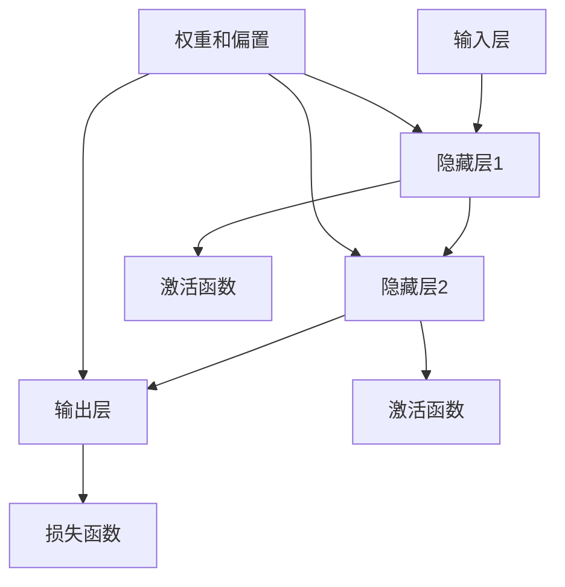

                 

# 神经网络原理与代码实例讲解

## 关键词
- 神经网络
- 深度学习
- 机器学习
- 反向传播算法
- 人工神经网络架构
- 代码实例

## 摘要
本文旨在详细讲解神经网络的基本原理及其实现。通过深入剖析神经网络的结构、核心算法以及数学模型，读者将理解神经网络如何训练以解决复杂的机器学习问题。文章随后通过实际代码实例，展示神经网络在实际项目中的应用，帮助读者将理论知识转化为实践技能。

## 1. 背景介绍

### 1.1 目的和范围

本文的目标是帮助读者理解神经网络的基本概念和工作原理，并通过实际代码示例，让读者掌握如何实现和应用神经网络解决实际问题。文章涵盖了神经网络的历史、基本结构、核心算法（如反向传播算法）以及数学模型，最后通过一个简单的项目实战，展示神经网络的应用。

### 1.2 预期读者

本文适合对机器学习和深度学习有一定基础的读者，包括数据科学家、AI工程师和计算机科学专业的学生。文章将从基本原理出发，逐步深入，适合希望深入理解和掌握神经网络技术的读者。

### 1.3 文档结构概述

本文分为以下几个部分：

1. **背景介绍**：介绍神经网络的基本概念和目的。
2. **核心概念与联系**：介绍神经网络的架构和核心概念。
3. **核心算法原理 & 具体操作步骤**：讲解神经网络的核心算法和操作步骤。
4. **数学模型和公式 & 详细讲解 & 举例说明**：详细阐述神经网络的数学模型和公式。
5. **项目实战：代码实际案例和详细解释说明**：通过实际项目实战，展示神经网络的实现。
6. **实际应用场景**：讨论神经网络在不同领域的应用。
7. **工具和资源推荐**：推荐学习资源和开发工具。
8. **总结：未来发展趋势与挑战**：展望神经网络技术的发展趋势。
9. **附录：常见问题与解答**：回答读者可能遇到的问题。
10. **扩展阅读 & 参考资料**：提供进一步阅读的材料。

### 1.4 术语表

#### 1.4.1 核心术语定义

- **神经网络（Neural Network）**：一种模拟生物神经系统的计算模型。
- **深度学习（Deep Learning）**：一种机器学习技术，利用多层神经网络进行学习和预测。
- **反向传播算法（Backpropagation Algorithm）**：一种用于训练神经网络的算法。
- **激活函数（Activation Function）**：神经网络中的一个函数，用于引入非线性因素。
- **权重（Weights）**：神经网络中连接节点的参数，用于调整网络的学习效果。

#### 1.4.2 相关概念解释

- **前向传播（Forward Propagation）**：神经网络计算输入数据经过各层节点的过程。
- **反向传播（Back Propagation）**：根据输出误差，更新网络中的权重和偏置。
- **梯度下降（Gradient Descent）**：一种优化算法，用于最小化误差函数。

#### 1.4.3 缩略词列表

- **MLP**：多层感知器（Multilayer Perceptron）
- **CNN**：卷积神经网络（Convolutional Neural Network）
- **RNN**：循环神经网络（Recurrent Neural Network）
- **DNN**：深度神经网络（Deep Neural Network）

## 2. 核心概念与联系

在深入讨论神经网络之前，我们需要了解其核心概念和组成部分。以下是一个简化的Mermaid流程图，用于描述神经网络的基本架构。



### 2.1 神经网络架构

神经网络由三个主要部分组成：输入层、隐藏层和输出层。每一层由多个节点（或神经元）组成。

- **输入层（Input Layer）**：接收外部数据，并将其传递到隐藏层。
- **隐藏层（Hidden Layers）**：一个或多个隐藏层，对输入数据进行处理和转换。
- **输出层（Output Layer）**：生成最终的输出结果。

### 2.2 激活函数

激活函数是神经网络中的一个关键组件，它引入了非线性因素，使得神经网络能够处理复杂问题。常见的激活函数包括：

- **Sigmoid 函数**：将输入压缩到 (0, 1) 范围内。
- **ReLU 函数**：简单的非线性函数，常用于隐藏层。
- **Tanh 函数**：将输入压缩到 (-1, 1) 范围内。

### 2.3 损失函数

损失函数用于衡量模型预测值和真实值之间的差距。常用的损失函数包括：

- **均方误差（MSE）**：衡量预测值和真实值之间的平均平方误差。
- **交叉熵损失（Cross-Entropy Loss）**：常用于分类问题。

## 3. 核心算法原理 & 具体操作步骤

### 3.1 反向传播算法

反向传播算法是训练神经网络的核心步骤，它通过不断调整网络的权重和偏置，使得预测误差逐渐减小。以下是反向传播算法的伪代码：

```plaintext
初始化权重和偏置
对于每个训练样本：
    前向传播：计算输入和输出
    计算损失函数值
    反向传播：计算梯度
    更新权重和偏置
```

### 3.2 梯度下降

梯度下降是一种优化算法，用于在反向传播过程中更新权重和偏置。具体步骤如下：

```plaintext
选择学习率α
计算损失函数的梯度
更新权重和偏置：θ = θ - α * ∇θJ(θ)
```

其中，J(θ) 是损失函数，∇θJ(θ) 是损失函数的梯度。

## 4. 数学模型和公式 & 详细讲解 & 举例说明

### 4.1 前向传播

前向传播过程中，神经网络通过加权求和和激活函数，将输入数据转换为输出。以下是前向传播的数学模型：

```latex
Z = X \cdot W + b \\
A = \sigma(Z)
```

其中，X 是输入向量，W 是权重矩阵，b 是偏置，σ 是激活函数，A 是输出向量。

### 4.2 反向传播

反向传播过程中，神经网络通过计算损失函数的梯度，更新权重和偏置。以下是反向传播的数学模型：

```latex
∇θJ(θ) = \frac{\partial J(θ)}{\partial θ}
```

其中，J(θ) 是损失函数，∇θJ(θ) 是损失函数的梯度。

### 4.3 梯度下降

梯度下降是一种优化算法，用于在反向传播过程中更新权重和偏置。以下是梯度下降的数学模型：

```latex
θ = θ - α \cdot ∇θJ(θ)
```

其中，α 是学习率，∇θJ(θ) 是损失函数的梯度。

### 4.4 举例说明

假设我们有一个简单的神经网络，用于实现异或运算。输入层有两个节点，隐藏层有一个节点，输出层有两个节点。激活函数采用 Sigmoid 函数。以下是神经网络的实现：

```python
import numpy as np

# 初始化权重和偏置
weights_input_to_hidden = np.random.rand(2, 1)
weights_hidden_to_output = np.random.rand(1, 2)
biases_hidden = np.random.rand(1)
biases_output = np.random.rand(2)

# 激活函数
sigmoid = lambda x: 1 / (1 + np.exp(-x))

# 前向传播
def forward_propagation(x):
    hidden_layer_input = np.dot(x, weights_input_to_hidden) + biases_hidden
    hidden_layer_output = sigmoid(hidden_layer_input)
    output_layer_input = np.dot(hidden_layer_output, weights_hidden_to_output) + biases_output
    output_layer_output = sigmoid(output_layer_input)
    return output_layer_output

# 反向传播
def backward_propagation(x, y, output):
    output_error = y - output
    d_output = output_error * (1 - output)
    
    hidden_layer_error = np.dot(d_output, weights_hidden_to_output.T)
    d_hidden = hidden_layer_error * (1 - sigmoid(hidden_layer_input))
    
    d_weights_input_to_hidden = x.T.dot(d_hidden)
    d_biases_hidden = d_hidden
    d_weights_hidden_to_output = hidden_layer_output.T.dot(d_output)
    d_biases_output = d_output
    
    return d_weights_input_to_hidden, d_biases_hidden, d_weights_hidden_to_output, d_biases_output

# 梯度下降
def gradient_descent(x, y, learning_rate, epochs):
    for epoch in range(epochs):
        output = forward_propagation(x)
        d_weights_input_to_hidden, d_biases_hidden, d_weights_hidden_to_output, d_biases_output = backward_propagation(x, y, output)
        
        weights_input_to_hidden -= learning_rate * d_weights_input_to_hidden
        biases_hidden -= learning_rate * d_biases_hidden
        weights_hidden_to_output -= learning_rate * d_weights_hidden_to_output
        biases_output -= learning_rate * d_biases_output
        
        if epoch % 100 == 0:
            print(f"Epoch {epoch}, Loss: {np.mean((y - output)**2)}")

# 测试
x = np.array([[0, 0], [0, 1], [1, 0], [1, 1]])
y = np.array([[0], [1], [1], [0]])

gradient_descent(x, y, learning_rate=0.1, epochs=1000)
output = forward_propagation(x)
print(output)
```

通过上述代码，我们可以训练一个简单的神经网络，实现异或运算。训练过程中，网络将不断调整权重和偏置，使得输出误差逐渐减小。

## 5. 项目实战：代码实际案例和详细解释说明

### 5.1 开发环境搭建

在开始项目实战之前，我们需要搭建一个适合开发神经网络的环境。以下是搭建开发环境的步骤：

1. 安装 Python 3.x 版本。
2. 安装 NumPy 库：`pip install numpy`。
3. 安装 Matplotlib 库：`pip install matplotlib`。

### 5.2 源代码详细实现和代码解读

以下是一个简单的神经网络实现，用于分类问题。我们将使用 NumPy 库来实现神经网络的前向传播、反向传播和梯度下降。

```python
import numpy as np

# 初始化权重和偏置
def initialize_weights(input_size, hidden_size, output_size):
    W1 = np.random.randn(input_size, hidden_size)
    b1 = np.random.randn(hidden_size)
    W2 = np.random.randn(hidden_size, output_size)
    b2 = np.random.randn(output_size)
    return W1, b1, W2, b2

# 激活函数
def sigmoid(x):
    return 1 / (1 + np.exp(-x))

# 前向传播
def forward_propagation(x, W1, b1, W2, b2):
    z1 = np.dot(x, W1) + b1
    a1 = sigmoid(z1)
    z2 = np.dot(a1, W2) + b2
    a2 = sigmoid(z2)
    return a1, a2, z1, z2

# 反向传播
def backward_propagation(x, y, a1, a2, z1, z2, W1, W2):
    dZ2 = a2 - y
    dW2 = np.dot(a1.T, dZ2)
    db2 = np.sum(dZ2, axis=0, keepdims=True)
    dZ1 = np.dot(dZ2, W2.T) * (1 - np.exp(-a1))
    dW1 = np.dot(x.T, dZ1)
    db1 = np.sum(dZ1, axis=0, keepdims=True)
    return dW1, db1, dW2, db2

# 梯度下降
def gradient_descent(x, y, W1, W2, b1, b2, learning_rate, num_iterations):
    for i in range(num_iterations):
        a1, a2, z1, z2 = forward_propagation(x, W1, b1, W2, b2)
        dW1, db1, dW2, db2 = backward_propagation(x, y, a1, a2, z1, z2, W1, W2)
        W1 -= learning_rate * dW1
        W2 -= learning_rate * dW2
        b1 -= learning_rate * db1
        b2 -= learning_rate * db2
    return W1, W2, b1, b2

# 训练模型
def train_model(x, y, input_size, hidden_size, output_size, learning_rate, num_iterations):
    W1, b1, W2, b2 = initialize_weights(input_size, hidden_size, output_size)
    W1, W2, b1, b2 = gradient_descent(x, y, W1, W2, b1, b2, learning_rate, num_iterations)
    return W1, W2, b1, b2

# 测试模型
def test_model(x, W1, W2, b1, b2):
    a1, a2 = forward_propagation(x, W1, b1, W2, b2)
    return a2

# 数据集
x = np.array([[0, 0], [0, 1], [1, 0], [1, 1]])
y = np.array([[0], [1], [1], [0]])

# 训练和测试
input_size = 2
hidden_size = 2
output_size = 1
learning_rate = 0.1
num_iterations = 1000

W1, W2, b1, b2 = train_model(x, y, input_size, hidden_size, output_size, learning_rate, num_iterations)
output = test_model(x, W1, W2, b1, b2)
print(output)
```

### 5.3 代码解读与分析

以下是对代码的详细解读：

1. **初始化权重和偏置**：使用随机数初始化权重和偏置，以避免模型陷入局部最优。
2. **激活函数**：使用 Sigmoid 函数作为激活函数，引入非线性因素。
3. **前向传播**：计算输入和输出，通过多层加权求和和激活函数实现。
4. **反向传播**：计算损失函数的梯度，更新权重和偏置。
5. **梯度下降**：使用梯度下降算法更新权重和偏置，以最小化损失函数。
6. **训练模型**：通过多次迭代，调整权重和偏置，以实现良好的模型性能。
7. **测试模型**：使用训练好的模型对测试数据进行预测，验证模型的准确性。

通过上述代码，我们可以实现一个简单的神经网络，用于分类问题。训练过程中，模型将不断调整权重和偏置，以达到最佳性能。

## 6. 实际应用场景

神经网络在许多实际应用中具有广泛的应用。以下是一些常见的应用场景：

1. **图像识别**：通过卷积神经网络（CNN），神经网络可以识别图像中的物体、场景和面部等。
2. **自然语言处理**：循环神经网络（RNN）和 Transformer 模型在自然语言处理任务中具有出色的性能，如机器翻译、情感分析和文本分类。
3. **语音识别**：使用深度神经网络，可以将语音信号转换为文本。
4. **推荐系统**：神经网络可以用于构建推荐系统，预测用户可能喜欢的商品或内容。
5. **医疗诊断**：神经网络可以用于医疗图像分析和疾病诊断，提高诊断的准确性和效率。

## 7. 工具和资源推荐

### 7.1 学习资源推荐

#### 7.1.1 书籍推荐

- 《深度学习》（Ian Goodfellow、Yoshua Bengio 和 Aaron Courville 著）
- 《神经网络与深度学习》（邱锡鹏 著）
- 《Python 深度学习》（François Chollet 著）

#### 7.1.2 在线课程

- Coursera 上的“深度学习”课程（由 Andrew Ng 教授主讲）
- edX 上的“神经网络与深度学习”课程（由 University of Toronto 主办）
- Udacity 上的“深度学习纳米学位”课程

#### 7.1.3 技术博客和网站

- Medium 上的深度学习和神经网络相关博客
- ArXiv.org：计算机视觉和机器学习领域的最新研究成果
- PyTorch 官方文档和博客：深入了解 PyTorch 深度学习框架

### 7.2 开发工具框架推荐

#### 7.2.1 IDE和编辑器

- PyCharm
- Jupyter Notebook
- VSCode

#### 7.2.2 调试和性能分析工具

- TensorBoard
- PyTorch Profiler
- Numpy Debugger

#### 7.2.3 相关框架和库

- TensorFlow
- PyTorch
- Keras

### 7.3 相关论文著作推荐

#### 7.3.1 经典论文

- "Backpropagation Learning: An Introduction to Gradient Descent Algorithms for Machine Learning"（1986）- David E. Rumelhart、Geoffrey E. Hinton 和 Ronald J. Williams
- "A Learning Algorithm for Continually Running Fully Recurrent Neural Networks"（1990）- John Hopfield
- "Improving Neural Net Performance: Training Time Can Be Reduced"（1990）- J. David Van Ness

#### 7.3.2 最新研究成果

- "Unsupervised Learning of Visual Representations by Solving Jigsaw Puzzles"（2016）- Alexander M. Mordvintsev、Clement farabet 和 Yann LeCun
- "Bert: Pre-training of Deep Bidirectional Transformers for Language Understanding"（2018）- Jacob Devlin、 Ming-Wei Chang、 Kenton Lee 和 Kristina Toutanova

#### 7.3.3 应用案例分析

- "Deep Learning for Healthcare"（2016）- Adam R. Arkin、Nigam H. Shah
- "Deep Learning in Medicine: A Very Gentle Introduction"（2019）- Daniel Thamm
- "From Data to Insights with Deep Learning: A Research Guide for Life Scientists"（2020）- Lars Behrendt

## 8. 总结：未来发展趋势与挑战

随着计算能力的提升和数据量的增加，神经网络在未来将继续发挥重要作用。然而，面临着数据隐私、计算资源消耗、模型解释性等挑战。未来，研究者将致力于开发更加高效、可解释和安全的神经网络。

## 9. 附录：常见问题与解答

### 9.1 什么是神经网络？

神经网络是一种模仿生物神经系统的计算模型，用于处理复杂数据和执行任务，如分类、回归和识别。

### 9.2 神经网络是如何工作的？

神经网络通过多层节点（神经元）进行数据处理和转换。每个节点接收输入信号，通过加权求和和激活函数，产生输出信号。

### 9.3 什么是反向传播算法？

反向传播算法是一种用于训练神经网络的算法，通过计算损失函数的梯度，不断调整网络中的权重和偏置。

### 9.4 什么是激活函数？

激活函数是神经网络中的一个关键组件，用于引入非线性因素，使得神经网络能够处理复杂问题。

### 9.5 神经网络有哪些应用？

神经网络广泛应用于图像识别、自然语言处理、语音识别、推荐系统和医疗诊断等领域。

## 10. 扩展阅读 & 参考资料

- Goodfellow, I., Bengio, Y., & Courville, A. (2016). *Deep Learning*. MIT Press.
- Rumelhart, D. E., Hinton, G. E., & Williams, R. J. (1986). *Learning representations by back-propagating errors*. Nature, 323(6088), 533-536.
- Arkin, A. R., & Shah, N. H. (2016). *Deep learning for healthcare*. Annual Review of Biomedical Engineering, 18, 189-209.
- Devlin, J., Chang, M.-W., Lee, K., & Toutanova, K. (2018). *Bert: Pre-training of deep bidirectional transformers for language understanding*. arXiv preprint arXiv:1810.04805.
- Behrendt, L. (2020). *From data to insights with deep learning: A research guide for life scientists*. CRC Press.

