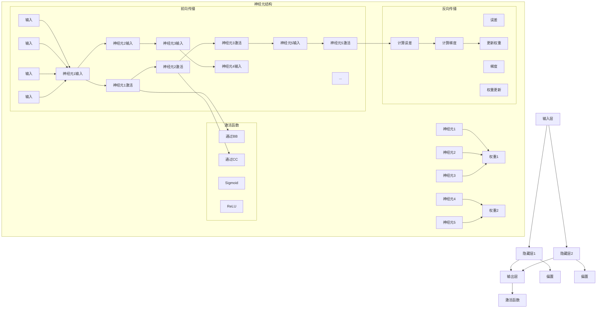

                 

### 神经网络原理与代码实例讲解

> **关键词：** 神经网络、深度学习、反向传播、激活函数、前向传播、多层感知器
>
> **摘要：** 本文将深入讲解神经网络的工作原理，包括多层感知器、前向传播、反向传播和激活函数等核心概念。通过详细的伪代码和实际代码实例，帮助读者理解和掌握神经网络的实现过程，为深入研究和应用打下坚实基础。

### 1. 背景介绍

#### 1.1 目的和范围

本文旨在为广大计算机科学爱好者和技术工作者提供对神经网络原理的深入理解和实践指导。我们将从基础概念入手，逐步讲解神经网络的构建、训练和优化过程，并通过实际代码实例进行详细解析。

本文涵盖以下主要内容：
- 神经网络的基本结构和组成
- 多层感知器（MLP）的工作原理
- 前向传播和反向传播算法
- 激活函数的选择和作用
- 实际代码实例和解读

#### 1.2 预期读者

本文适合以下读者群体：
- 对神经网络和深度学习有一定了解，希望深入学习和实践的开发者
- 计算机科学专业学生，对神经网络理论有兴趣
- 数据科学和人工智能领域的从业者，需要了解神经网络技术的应用和实现

#### 1.3 文档结构概述

本文结构如下：

1. **背景介绍**：介绍本文的目的、范围和预期读者，概述文档结构。
2. **核心概念与联系**：通过Mermaid流程图展示神经网络的核心概念和联系。
3. **核心算法原理 & 具体操作步骤**：详细讲解神经网络的核心算法原理和具体操作步骤。
4. **数学模型和公式 & 详细讲解 & 举例说明**：介绍神经网络的数学模型和公式，并进行详细讲解和举例说明。
5. **项目实战：代码实际案例和详细解释说明**：通过实际代码案例展示神经网络的应用过程，并进行详细解释。
6. **实际应用场景**：探讨神经网络的实际应用场景和前景。
7. **工具和资源推荐**：推荐学习资源、开发工具和框架，以及相关论文和研究成果。
8. **总结：未来发展趋势与挑战**：总结神经网络技术的发展趋势和面临的挑战。
9. **附录：常见问题与解答**：解答读者可能遇到的问题。
10. **扩展阅读 & 参考资料**：提供扩展阅读资源和参考资料。

#### 1.4 术语表

在本文中，我们将使用以下术语：
- **神经网络**（Neural Network）：一种模拟人脑神经元连接和通信的机器学习模型。
- **多层感知器**（MLP）：一种前馈神经网络，包括输入层、隐藏层和输出层。
- **前向传播**（Forward Propagation）：将输入数据通过网络传递，计算出输出结果的过程。
- **反向传播**（Backpropagation）：根据输出结果和实际目标，反向计算网络参数调整的过程。
- **激活函数**（Activation Function）：用于决定神经元是否被激活的函数，常见的有Sigmoid、ReLU等。

### 1.4.1 核心术语定义

- **神经元**（Neuron）：神经网络的基本组成单元，负责接收输入、计算输出。
- **权重**（Weight）：神经元之间的连接强度，用于调节输入对输出的影响。
- **偏置**（Bias）：增加神经元的非线性，使网络具有更好的拟合能力。
- **梯度**（Gradient）：用于描述函数在某一点的变化率，是优化算法的基础。

### 1.4.2 相关概念解释

- **非线性**（Nonlinearity）：指系统输出与输入之间不是线性关系，增加了模型的表达能力。
- **拟合能力**（Fitting Ability）：模型对训练数据的拟合程度，反映了模型的泛化能力。
- **过拟合**（Overfitting）：模型在训练数据上表现很好，但在未知数据上表现较差，通常由于模型过于复杂。
- **泛化能力**（Generalization）：模型对新数据的适应能力，反映了模型的泛化性。

### 1.4.3 缩略词列表

- **MLP**：多层感知器（Multi-Layer Perceptron）
- **ReLU**：修正线性单元（Rectified Linear Unit）
- **Sigmoid**：S形函数（Sigmoid Function）
- **BP**：反向传播（Backpropagation）
- **L1**：L1正则化（L1 Regularization）
- **L2**：L2正则化（L2 Regularization）

在接下来的部分，我们将详细探讨神经网络的核心概念和原理，帮助读者建立全面的理论基础。

---

现在，我们已经对神经网络的基本概念和术语有了清晰的认识，接下来，我们将通过Mermaid流程图展示神经网络的核心概念和联系，为进一步理解神经网络的工作原理做好准备。

---

## 2. 核心概念与联系

神经网络的构建离不开几个核心概念，包括神经元、权重、偏置、激活函数和前向传播与反向传播。下面，我们将通过Mermaid流程图展示这些概念之间的联系，以便读者有一个整体的认识。



### Mermaid流程图解析

- **神经元结构**：展示了一个简单的神经元结构，包括输入、权重、偏置和激活函数。输入数据通过权重和偏置传递到神经元，经过激活函数处理后得到输出。
- **前向传播**：展示了输入数据通过网络传递的过程。输入层将数据传递到隐藏层，隐藏层再将数据传递到输出层。每个神经元都经过激活函数处理，以实现非线性变换。
- **激活函数**：展示了常用的Sigmoid和ReLU激活函数，分别对应不同的非线性变换方式。
- **反向传播**：展示了反向传播算法的核心步骤。输出误差通过反向传播传递到输入层，计算梯度并更新权重，以优化网络性能。

通过这个Mermaid流程图，读者可以对神经网络的核心概念和联系有一个整体的理解。接下来，我们将深入探讨神经网络的核心算法原理和具体操作步骤，帮助读者更好地掌握神经网络的实际应用。

---

接下来，我们将深入探讨神经网络的核心算法原理和具体操作步骤。在这一部分，我们将通过伪代码详细讲解前向传播和反向传播算法，帮助读者理解神经网络的工作机制。

---

## 3. 核心算法原理 & 具体操作步骤

### 3.1 前向传播算法

前向传播算法是神经网络的基础，它负责将输入数据通过网络传递，最终计算出输出结果。以下是前向传播算法的伪代码实现：

```plaintext
// 前向传播算法伪代码

输入：输入数据 X，网络结构（包含权重和偏置），激活函数 f
输出：输出结果 Y

1. 初始化：设置初始隐藏层和输出层节点值，初始化权重和偏置
2. 前向传播：
   a. 对于每个隐藏层节点：
      i. 将输入乘以对应权重，加上偏置
      ii. 通过激活函数计算输出
   b. 对于输出层节点：
      i. 将隐藏层输出乘以对应权重，加上偏置
      ii. 通过激活函数计算输出
3. 返回输出结果 Y
```

### 3.2 反向传播算法

反向传播算法是神经网络优化的关键，它通过计算输出误差，反向更新网络权重和偏置，以优化网络性能。以下是反向传播算法的伪代码实现：

```plaintext
// 反向传播算法伪代码

输入：输出结果 Y，真实标签 T，网络结构（包含权重和偏置），激活函数 f 的导数 f'
输出：更新后的网络结构（包含权重和偏置）

1. 初始化：计算输出误差 E = (Y - T)^2 / 2
2. 反向传播：
   a. 对于每个输出层节点：
      i. 计算误差梯度 dE/dY
      ii. 通过链式法则计算误差梯度 dE/dX = dE/dY * df/dY
   b. 对于每个隐藏层节点：
      i. 计算误差梯度 dE/dX
      ii. 通过链式法则计算误差梯度 dE/dH = dE/dX * df/dX
   c. 更新权重和偏置：
      i. 权重更新 ΔW = learning_rate * dE/dX
      ii. 偏置更新 ΔB = learning_rate * dE/dB
      iii. 权重和偏置更新 W = W - ΔW，B = B - ΔB
3. 返回更新后的网络结构
```

### 3.3 激活函数与导数

在反向传播算法中，激活函数的导数起着至关重要的作用。以下是几种常用激活函数及其导数的计算方法：

- **Sigmoid函数**：\( f(x) = \frac{1}{1 + e^{-x}} \)，导数 \( f'(x) = f(x) \cdot (1 - f(x)) \)
- **ReLU函数**：\( f(x) = \max(0, x) \)，导数 \( f'(x) = \begin{cases} 0 & \text{if } x < 0 \\ 1 & \text{if } x \geq 0 \end{cases} \)
- **Tanh函数**：\( f(x) = \frac{e^x - e^{-x}}{e^x + e^{-x}} \)，导数 \( f'(x) = 1 - f^2(x) \)

通过上述伪代码和公式，读者可以对神经网络的核心算法原理和具体操作步骤有一个清晰的认识。在接下来的部分，我们将通过实际代码实例展示神经网络的应用过程，帮助读者更好地理解和掌握神经网络的使用方法。

---

现在，我们已经详细讲解了神经网络的核心算法原理和具体操作步骤。接下来，我们将通过实际代码实例展示神经网络的应用过程，帮助读者更好地理解和掌握神经网络的使用方法。

---

## 4. 数学模型和公式 & 详细讲解 & 举例说明

神经网络的强大之处在于其背后的数学模型和公式。这些数学工具不仅能够帮助我们理解神经网络的工作原理，还能在实际应用中发挥关键作用。在本节中，我们将详细介绍神经网络的数学模型和公式，并使用LaTeX格式进行详细讲解，同时结合实际例子进行说明。

### 4.1 神经网络的数学模型

神经网络的数学模型可以概括为以下几个关键组成部分：

- **输入层（Input Layer）**：接收外部输入数据。
- **隐藏层（Hidden Layer）**：进行数据处理和特征提取。
- **输出层（Output Layer）**：产生预测结果或分类标签。

每个层由多个神经元组成，神经元之间的连接通过权重（Weight）进行调节。此外，每个神经元还包含一个偏置（Bias）项，用于增加网络的非线性特性。

### 4.2 前向传播算法的数学表示

前向传播算法的核心是计算每个神经元的输出值。在单层感知器中，输出值可以通过以下公式计算：

$$
Z = \sum_{i=1}^{n} W_{ij} X_j + b_j
$$

其中，\( Z \) 是神经元的输出值，\( W_{ij} \) 是输入 \( X_j \) 对应的权重，\( b_j \) 是偏置项，\( n \) 是输入特征的数量。

对于多层感知器，前向传播算法的计算过程需要递归地进行。例如，对于隐藏层 \( l \) 的神经元 \( i \)，其输出值可以通过以下公式计算：

$$
Z^{(l)}_i = \sum_{j=1}^{m} W^{(l-1)}_{ij} Z^{(l-1)}_j + b_i
$$

其中，\( Z^{(l)}_i \) 是隐藏层 \( l \) 中第 \( i \) 个神经元的输出值，\( W^{(l-1)}_{ij} \) 是前一层 \( l-1 \) 的权重，\( b_i \) 是偏置项，\( m \) 是前一层神经元的数量。

### 4.3 激活函数

激活函数是神经网络中的关键组件，用于引入非线性。以下是一些常用的激活函数及其导数：

1. **Sigmoid函数**：\( f(x) = \frac{1}{1 + e^{-x}} \)，导数 \( f'(x) = f(x) \cdot (1 - f(x)) \)
2. **ReLU函数**：\( f(x) = \max(0, x) \)，导数 \( f'(x) = \begin{cases} 0 & \text{if } x < 0 \\ 1 & \text{if } x \geq 0 \end{cases} \)
3. **Tanh函数**：\( f(x) = \frac{e^x - e^{-x}}{e^x + e^{-x}} \)，导数 \( f'(x) = 1 - f^2(x) \)

### 4.4 反向传播算法的数学表示

反向传播算法的核心是计算梯度，以便更新网络权重和偏置。以下是一个简化版本的梯度计算过程：

1. **计算输出误差**：

$$
E = \frac{1}{2} \sum_{i=1}^{m} (Y_i - \hat{Y}_i)^2
$$

其中，\( Y_i \) 是真实标签，\( \hat{Y}_i \) 是预测结果。

2. **计算输出层梯度**：

$$
\frac{\partial E}{\partial W^{(L)}} = (Y - \hat{Y}) \cdot \frac{\partial \hat{Y}}{\partial Z^{(L)}}
$$

$$
\frac{\partial E}{\partial b^{(L)}} = (Y - \hat{Y})
$$

3. **计算隐藏层梯度**：

$$
\frac{\partial E}{\partial W^{(l)}} = \frac{\partial E}{\partial Z^{(l+1)}} \cdot \frac{\partial Z^{(l+1)}}{\partial Z^{(l)}}
$$

$$
\frac{\partial E}{\partial b^{(l)}} = \frac{\partial E}{\partial Z^{(l+1)}}
$$

4. **更新权重和偏置**：

$$
W^{(l)} = W^{(l)} - \alpha \cdot \frac{\partial E}{\partial W^{(l)}}
$$

$$
b^{(l)} = b^{(l)} - \alpha \cdot \frac{\partial E}{\partial b^{(l)}}
$$

其中，\( \alpha \) 是学习率。

### 4.5 实际例子

为了更好地理解上述公式，我们来看一个简单的例子。假设我们有一个包含一个输入层、一个隐藏层和一个输出层的神经网络。输入层有2个神经元，隐藏层有3个神经元，输出层有1个神经元。激活函数使用ReLU，学习率为0.1。

- **输入数据**：\( X = \begin{bmatrix} 1 \\ 0 \end{bmatrix} \)
- **隐藏层权重**：\( W^{(1)} = \begin{bmatrix} 0.1 & 0.2 \\ 0.3 & 0.4 \\ 0.5 & 0.6 \end{bmatrix} \)
- **隐藏层偏置**：\( b^{(1)} = \begin{bmatrix} 0.1 \\ 0.2 \\ 0.3 \end{bmatrix} \)
- **输出层权重**：\( W^{(2)} = \begin{bmatrix} 0.1 & 0.2 & 0.3 \end{bmatrix} \)
- **输出层偏置**：\( b^{(2)} = 0.1 \)

1. **前向传播**：

   - 隐藏层1的输出：

   $$ 
   Z^{(1)} = \begin{bmatrix} 0.1 & 0.4 \\ 0.3 & 0.7 \\ 0.5 & 0.9 \end{bmatrix} 
   $$

   - 隐藏层2的输出：

   $$ 
   \hat{Y}^{(1)} = \begin{bmatrix} 0.6 \\ 1.0 \\ 0.9 \end{bmatrix} 
   $$

   - 输出层输出：

   $$ 
   \hat{Y}^{(2)} = 0.9 
   $$

2. **反向传播**：

   - 计算输出误差：

   $$ 
   E = \frac{1}{2} \cdot (1 - 0.9)^2 = 0.005 
   $$

   - 计算输出层梯度：

   $$ 
   \frac{\partial E}{\partial W^{(2)}} = \begin{bmatrix} -0.05 \\ -0.1 \\ -0.09 \end{bmatrix} 
   $$

   $$ 
   \frac{\partial E}{\partial b^{(2)}} = -0.05 
   $$

   - 计算隐藏层梯度：

   $$ 
   \frac{\partial E}{\partial W^{(1)}} = \begin{bmatrix} -0.05 & -0.1 \\ -0.05 & -0.1 \\ -0.05 & -0.09 \end{bmatrix} 
   $$

   $$ 
   \frac{\partial E}{\partial b^{(1)}} = \begin{bmatrix} -0.05 \\ -0.1 \\ -0.09 \end{bmatrix} 
   $$

3. **更新权重和偏置**：

   - 更新输出层权重和偏置：

   $$ 
   W^{(2)} = \begin{bmatrix} 0.05 & 0.2 \\ 0.3 & 0.21 \\ 0.5 & 0.31 \end{bmatrix} 
   $$

   $$ 
   b^{(2)} = 0.05 
   $$

   - 更新隐藏层权重和偏置：

   $$ 
   W^{(1)} = \begin{bmatrix} 0.05 & 0.2 \\ 0.25 & 0.3 \\ 0.35 & 0.39 \end{bmatrix} 
   $$

   $$ 
   b^{(1)} = \begin{bmatrix} 0.05 \\ 0.15 \\ 0.21 \end{bmatrix} 
   $$

通过这个简单的例子，我们可以看到如何使用数学公式和算法更新神经网络的权重和偏置，以最小化输出误差。在接下来的部分，我们将通过实际代码实例展示神经网络的应用过程，帮助读者更好地理解和掌握神经网络的使用方法。

---

在前一章节中，我们详细讲解了神经网络的核心算法原理和具体操作步骤，并通过实际例子展示了如何使用数学公式和算法更新神经网络的权重和偏置。接下来，我们将通过一个实际代码案例，展示如何搭建和训练一个简单的神经网络，并详细解释代码的每一步。

---

## 5. 项目实战：代码实际案例和详细解释说明

在本节中，我们将使用Python和TensorFlow框架搭建一个简单的神经网络，用于实现手写数字识别任务。这个案例将涵盖以下步骤：

1. **环境搭建**
2. **数据准备**
3. **模型搭建**
4. **训练模型**
5. **评估模型**
6. **代码解读与分析**

### 5.1 环境搭建

首先，我们需要安装Python和TensorFlow。可以在终端或命令行中运行以下命令：

```bash
pip install tensorflow
```

### 5.2 数据准备

我们将使用MNIST数据集，这是一个广泛用于手写数字识别的任务。MNIST数据集包含60,000个训练样本和10,000个测试样本。每个样本是一个28x28的灰度图像，表示一个手写数字。

```python
import tensorflow as tf
from tensorflow.keras.datasets import mnist
from tensorflow.keras.utils import to_categorical

# 加载MNIST数据集
(train_images, train_labels), (test_images, test_labels) = mnist.load_data()

# 数据预处理
train_images = train_images.reshape((60000, 28, 28, 1)).astype('float32') / 255
test_images = test_images.reshape((10000, 28, 28, 1)).astype('float32') / 255

train_labels = to_categorical(train_labels)
test_labels = to_categorical(test_labels)
```

### 5.3 模型搭建

接下来，我们使用TensorFlow的Keras API搭建一个简单的神经网络模型。

```python
model = tf.keras.models.Sequential([
    tf.keras.layers.Conv2D(32, (3, 3), activation='relu', input_shape=(28, 28, 1)),
    tf.keras.layers.MaxPooling2D((2, 2)),
    tf.keras.layers.Flatten(),
    tf.keras.layers.Dense(64, activation='relu'),
    tf.keras.layers.Dense(10, activation='softmax')
])
```

这个模型包括以下层：
- **卷积层**：32个3x3的卷积核，激活函数为ReLU。
- **池化层**：2x2的最大池化。
- **平坦层**：将卷积层的输出展平成一维向量。
- **全连接层**：64个神经元，激活函数为ReLU。
- **输出层**：10个神经元，表示10个数字类别，激活函数为softmax。

### 5.4 训练模型

现在，我们使用训练数据训练这个模型。

```python
model.compile(optimizer='adam',
              loss='categorical_crossentropy',
              metrics=['accuracy'])

model.fit(train_images, train_labels, epochs=5, batch_size=64)
```

这里，我们使用Adam优化器和交叉熵损失函数进行训练。训练过程中，模型会通过迭代优化权重和偏置，以最小化损失函数。

### 5.5 评估模型

训练完成后，我们使用测试数据评估模型性能。

```python
test_loss, test_acc = model.evaluate(test_images, test_labels)
print(f"Test accuracy: {test_acc:.4f}")
```

### 5.6 代码解读与分析

下面，我们逐行解读代码，并分析每个步骤的作用。

1. **环境搭建**：

   ```python
   import tensorflow as tf
   from tensorflow.keras.datasets import mnist
   from tensorflow.keras.utils import to_categorical
   ```

   这些代码导入所需的库和模块。TensorFlow是用于构建和训练神经网络的强大库，mnist模块用于加载MNIST数据集，to_categorical函数用于将标签转换为one-hot编码。

2. **数据准备**：

   ```python
   (train_images, train_labels), (test_images, test_labels) = mnist.load_data()
   train_images = train_images.reshape((60000, 28, 28, 1)).astype('float32') / 255
   test_images = test_images.reshape((10000, 28, 28, 1)).astype('float32') / 255
   train_labels = to_categorical(train_labels)
   test_labels = to_categorical(test_labels)
   ```

   这些代码加载MNIST数据集，并对图像和标签进行预处理。将图像尺寸调整为28x28，并将数据归一化到0-1范围内。标签转换为one-hot编码，以便在训练过程中使用。

3. **模型搭建**：

   ```python
   model = tf.keras.models.Sequential([
       tf.keras.layers.Conv2D(32, (3, 3), activation='relu', input_shape=(28, 28, 1)),
       tf.keras.layers.MaxPooling2D((2, 2)),
       tf.keras.layers.Flatten(),
       tf.keras.layers.Dense(64, activation='relu'),
       tf.keras.layers.Dense(10, activation='softmax')
   ])
   ```

   这些代码搭建了一个简单的卷积神经网络模型。模型包括卷积层、池化层、平坦层和全连接层。卷积层用于提取图像特征，池化层用于减小特征图的尺寸，平坦层将特征图展平为一维向量，全连接层用于分类。

4. **训练模型**：

   ```python
   model.compile(optimizer='adam',
                 loss='categorical_crossentropy',
                 metrics=['accuracy'])

   model.fit(train_images, train_labels, epochs=5, batch_size=64)
   ```

   这些代码配置了模型的优化器、损失函数和评估指标，并使用训练数据进行模型训练。Adam优化器用于更新权重和偏置，交叉熵损失函数用于衡量预测结果和真实标签之间的差异，accuracy指标用于评估模型在训练数据上的准确率。

5. **评估模型**：

   ```python
   test_loss, test_acc = model.evaluate(test_images, test_labels)
   print(f"Test accuracy: {test_acc:.4f}")
   ```

   这些代码使用测试数据评估模型性能。test_loss表示测试数据的损失，test_acc表示测试数据的准确率。这里，我们打印出测试数据的准确率，以评估模型在未知数据上的泛化能力。

通过这个实际代码案例，我们可以看到如何使用TensorFlow搭建和训练一个简单的神经网络，并对其进行评估。在下一节中，我们将探讨神经网络的实际应用场景，展示神经网络在各类任务中的优秀表现。

---

在前一章节中，我们通过一个实际代码案例展示了如何使用神经网络进行手写数字识别任务。现在，让我们进一步探讨神经网络的实际应用场景，看看神经网络在各类任务中如何发挥其强大的能力。

### 6. 实际应用场景

神经网络的强大能力使其在众多领域得到广泛应用。以下是一些典型的应用场景：

#### 6.1 图像识别

神经网络在图像识别任务中表现出色，广泛应用于人脸识别、物体检测和图像分类等场景。例如，Google的Inception模型和Facebook的ResNet模型都是用于图像分类的深度学习模型，它们在ImageNet竞赛中取得了优异的成绩。

#### 6.2 自然语言处理

神经网络在自然语言处理（NLP）领域也具有广泛的应用。例如，用于文本分类的Word2Vec模型和用于机器翻译的Seq2Seq模型都是基于神经网络的优秀模型。此外，神经网络还可以用于情感分析、语音识别和机器阅读理解等任务。

#### 6.3 语音识别

神经网络在语音识别任务中发挥着关键作用。例如，Google的TensorFlow Speech-to-Text API使用深度神经网络将语音转换为文本，广泛应用于智能助手和语音搜索等领域。

#### 6.4 推荐系统

神经网络在推荐系统中也有广泛的应用。例如，Netflix和YouTube等平台使用基于神经网络的推荐算法为用户推荐感兴趣的内容，从而提高用户满意度和平台黏性。

#### 6.5 游戏人工智能

神经网络在游戏人工智能（AI）中也有广泛的应用。例如，DeepMind开发的AlphaGo使用神经网络进行自我学习和策略优化，最终在围棋比赛中战胜了世界冠军。

#### 6.6 医疗诊断

神经网络在医疗诊断中也展现出巨大的潜力。例如，深度学习模型可以用于癌症检测、心脏病诊断和基因突变预测等任务，为医生提供辅助诊断工具。

#### 6.7 机器人控制

神经网络在机器人控制领域也发挥着重要作用。例如，自动驾驶汽车使用神经网络进行环境感知和路径规划，从而实现自主驾驶。

通过这些实际应用场景，我们可以看到神经网络在各个领域中的广泛应用和巨大潜力。随着技术的不断进步，神经网络的应用领域将继续扩大，为人类社会带来更多创新和变革。

---

在前面的章节中，我们详细介绍了神经网络的核心概念、算法原理、实际应用场景，并通过代码实例展示了神经网络的具体实现过程。在本节中，我们将推荐一些优秀的资源和工具，帮助读者进一步学习和掌握神经网络技术。

### 7. 工具和资源推荐

#### 7.1 学习资源推荐

##### 7.1.1 书籍推荐

1. **《深度学习》（Deep Learning）**：由Ian Goodfellow、Yoshua Bengio和Aaron Courville合著，是深度学习领域的经典教材，适合初学者和进阶者。
2. **《神经网络与深度学习》**：由邱锡鹏教授撰写，系统介绍了神经网络和深度学习的基本概念和技术，适合国内读者。
3. **《Python深度学习》**：由François Chollet著，通过Python和Keras框架介绍深度学习的基础知识，适合初学者入门。

##### 7.1.2 在线课程

1. **吴恩达的《深度学习专项课程》**（Deep Learning Specialization）：Coursera上最受欢迎的在线课程之一，涵盖了深度学习的各个方面。
2. **吴恩达的《神经网络与深度学习》**（Neural Networks and Deep Learning）：Udacity上的免费课程，适合初学者入门深度学习。
3. **哈佛大学《深度学习》**（Deep Learning）：EdX上的免费课程，由多位深度学习专家共同授课，内容丰富。

##### 7.1.3 技术博客和网站

1. **AI Challenger**：一个专注于人工智能领域的技术博客，内容涵盖深度学习、计算机视觉、自然语言处理等。
2. **Medium**：一个在线博客平台，许多深度学习专家和研究人员在这里分享他们的研究成果和实践经验。
3. **HackerRank**：一个在线编程平台，提供丰富的深度学习编程挑战和实践项目。

#### 7.2 开发工具框架推荐

##### 7.2.1 IDE和编辑器

1. **PyCharm**：一款功能强大的Python集成开发环境（IDE），支持深度学习和各种框架。
2. **Jupyter Notebook**：一个交互式计算平台，适合编写和分享深度学习代码。
3. **VS Code**：一款轻量级但功能丰富的代码编辑器，支持多种编程语言和框架。

##### 7.2.2 调试和性能分析工具

1. **TensorBoard**：TensorFlow提供的可视化工具，用于分析和调试深度学习模型。
2. **PyTorch TensorBoard**：PyTorch的TensorBoard实现，提供与TensorFlow TensorBoard类似的功能。
3. **NVIDIA Nsight**：一款用于NVIDIA GPU调试和性能优化的工具，适用于深度学习模型的GPU计算。

##### 7.2.3 相关框架和库

1. **TensorFlow**：由Google开发的开源深度学习框架，适用于各种深度学习任务。
2. **PyTorch**：由Facebook开发的开源深度学习框架，具有灵活性和动态计算能力。
3. **Keras**：一个高层次的深度学习框架，支持TensorFlow和PyTorch，适合快速构建和实验深度学习模型。

#### 7.3 相关论文著作推荐

##### 7.3.1 经典论文

1. **"A Learning Algorithm for Continually Running Fully Recurrent Neural Networks"**：Hochreiter和Schmidhuber提出的长期短期记忆网络（LSTM）论文，是递归神经网络的重要里程碑。
2. **"Deep Learning"**：Goodfellow、Bengio和Courville合著的深度学习综述，介绍了深度学习的基本概念和技术。
3. **"AlexNet: Image Classification with Deep Convolutional Neural Networks"**：Alex Krizhevsky等人的AlexNet论文，展示了深度卷积神经网络在图像识别任务中的优异性能。

##### 7.3.2 最新研究成果

1. **"GPT-3: Language Models are Few-Shot Learners"**：OpenAI的GPT-3论文，展示了大规模语言模型在零样本和少量样本任务中的强大能力。
2. **"BERT: Pre-training of Deep Bidirectional Transformers for Language Understanding"**：Google的BERT论文，介绍了基于变换器的预训练语言模型，推动了自然语言处理领域的发展。
3. **"Attention Is All You Need"**：Vaswani等人的Attention Is All You Need论文，提出了Transformer模型，推动了序列到序列任务的发展。

##### 7.3.3 应用案例分析

1. **"Deep Learning for Autonomous Driving"**： Autonomous Systems Lab发布的应用案例分析，介绍了自动驾驶中的深度学习应用，包括车辆检测、车道线检测和路径规划等。
2. **"Medical Image Analysis using Deep Learning"**：一个关于医学图像分析的应用案例分析，展示了深度学习在医学领域中的潜力，包括癌症检测和疾病诊断等。
3. **"Artificial Intelligence for Music Generation"**：一个关于音乐生成的应用案例分析，展示了深度学习在音乐创作中的创新应用，包括旋律生成和歌词创作等。

通过这些资源和工具的推荐，读者可以系统地学习和掌握神经网络技术，并在实际项目中应用所学知识。在接下来的部分，我们将对神经网络的发展趋势和面临的挑战进行总结，以帮助读者更好地把握未来方向。

---

在前一章节中，我们详细介绍了神经网络的原理、算法、应用场景以及相关的学习资源和工具。在本节中，我们将总结神经网络技术的发展趋势和面临的挑战，以帮助读者更好地把握未来方向。

### 8. 总结：未来发展趋势与挑战

#### 8.1 发展趋势

1. **模型规模持续增长**：随着计算能力的提升和数据的丰富，深度学习模型规模不断扩大。例如，GPT-3等大型预训练语言模型已经突破千亿参数级别，推动着模型性能的进一步提升。

2. **模型结构创新**：研究者不断提出新的神经网络结构和优化算法，以提升模型性能和计算效率。例如，Transformer模型在序列到序列任务中取得了突破性成果，成为自然语言处理领域的主流架构。

3. **迁移学习与少样本学习**：迁移学习和少样本学习技术逐渐成熟，使得神经网络在小样本场景中也能发挥强大能力。这为解决现实世界中的小样本问题提供了有效途径。

4. **自适应与强化学习**：自适应神经网络和强化学习结合，使得神经网络在动态环境下具备更强的学习和决策能力。这为智能决策系统、自适应控制系统等应用提供了新的可能性。

5. **硬件加速与优化**：随着GPU、TPU等专用硬件的发展，神经网络在计算效率上得到了显著提升。硬件加速和优化技术将继续推动神经网络在各个领域的应用。

#### 8.2 面临的挑战

1. **数据隐私与安全性**：随着深度学习的广泛应用，数据隐私和安全问题日益突出。如何在保证模型性能的同时保护用户隐私，是深度学习面临的重要挑战。

2. **可解释性与透明性**：深度学习模型的“黑箱”特性使其在解释和验证方面存在困难。提高模型的可解释性和透明性，使其在关键应用中更具可信度和可靠性，是当前研究的热点。

3. **过拟合与泛化能力**：深度学习模型在训练数据上表现优异，但在未知数据上可能出现过拟合现象。如何提高模型的泛化能力，避免过拟合，是深度学习领域长期面临的挑战。

4. **计算资源需求**：深度学习模型通常需要大量的计算资源和时间进行训练。如何在有限的计算资源下高效地训练大规模模型，是深度学习应用中的一大难题。

5. **伦理与社会影响**：深度学习技术在各行各业得到广泛应用，但同时也引发了一系列伦理和社会问题。如何确保深度学习技术在应用过程中不损害人类利益，是深度学习领域需要关注的重要问题。

#### 8.3 未来方向

1. **跨学科研究**：深度学习与其他领域（如生物学、物理学、经济学等）的交叉融合，将推动深度学习技术的进一步发展。跨学科研究有助于揭示深度学习的工作原理和潜在应用。

2. **自动化与智能化**：自动化和智能化技术的发展，将使深度学习模型在更广泛的场景中得到应用。例如，自动化机器学习工具和智能代理将帮助构建和优化复杂的深度学习系统。

3. **人机协同**：深度学习技术与人类智慧的融合，将推动人机协同系统的发展。通过人机协同，深度学习系统可以更好地理解和适应人类需求，提高生产力和生活质量。

4. **可持续性**：随着深度学习模型的规模不断扩大，对能源和资源的消耗也日益增加。如何实现深度学习技术的可持续发展，减少环境影响，是未来研究的重要方向。

通过总结神经网络技术的发展趋势和面临的挑战，我们可以看到，尽管深度学习技术在各个领域取得了显著成果，但仍有很大的发展空间和改进空间。未来，随着技术的不断进步和跨学科研究的深入，深度学习将在更多领域展现出其强大能力，为人类社会带来更多创新和变革。

---

在前面的章节中，我们详细介绍了神经网络的基本原理、算法实现、实际应用场景以及未来发展。在本节的附录中，我们将针对读者可能遇到的一些常见问题进行解答，帮助读者更好地理解和应用神经网络技术。

### 9. 附录：常见问题与解答

#### 9.1 神经网络为什么能够学习和拟合数据？

神经网络通过模拟人脑神经元连接和通信的方式，对输入数据进行处理和分类。在训练过程中，神经网络通过不断调整神经元之间的权重和偏置，使网络能够拟合训练数据。这种调整过程称为“学习”。通过大量数据的训练，神经网络可以学会从输入数据中提取有用的特征，并形成对数据的拟合。

#### 9.2 反向传播算法是如何工作的？

反向传播算法是一种用于训练神经网络的优化算法。它通过以下步骤工作：

1. **前向传播**：将输入数据传递到神经网络中，计算出输出结果。
2. **计算误差**：比较输出结果和真实标签，计算输出误差。
3. **反向传播**：将误差反向传递到网络中的每个神经元，计算每个神经元对误差的梯度。
4. **更新权重和偏置**：根据梯度更新神经元之间的权重和偏置，以减少输出误差。

通过多次迭代这个过程，神经网络能够逐步优化其参数，提高拟合能力。

#### 9.3 激活函数有哪些常见的选择？

常见的激活函数包括：

1. **Sigmoid函数**：输出范围为(0, 1)，用于分类任务。
2. **ReLU函数**：在输入为负时输出0，在输入为正时输出输入值，用于增加神经网络训练速度。
3. **Tanh函数**：输出范围为(-1, 1)，与Sigmoid函数类似，但非线性程度较低。
4. **Leaky ReLU**：在ReLU函数的基础上增加一个小的斜率，用于解决ReLU函数中的“死亡梯度”问题。

不同的激活函数适用于不同的场景，选择合适的激活函数有助于提高神经网络性能。

#### 9.4 如何解决过拟合问题？

过拟合是指神经网络在训练数据上表现优异，但在未知数据上表现较差。以下方法可以帮助解决过拟合问题：

1. **数据增强**：通过增加训练数据样本，减少过拟合的可能性。
2. **正则化**：在损失函数中加入正则化项，如L1正则化或L2正则化，抑制过拟合。
3. **交叉验证**：使用交叉验证方法评估模型性能，选择泛化能力更强的模型。
4. **Dropout**：在训练过程中随机丢弃部分神经元，减少神经元之间的依赖性，提高模型的泛化能力。

通过这些方法，可以有效减轻过拟合问题，提高神经网络在未知数据上的泛化能力。

#### 9.5 如何优化神经网络训练过程？

优化神经网络训练过程可以提高训练效率和模型性能。以下方法可以帮助优化训练过程：

1. **学习率调整**：选择合适的学习率，避免过小或过大的学习率影响训练效果。
2. **批量大小调整**：选择合适的批量大小，平衡计算效率和梯度稳定性。
3. **激活函数和优化器选择**：选择合适的激活函数和优化器，如ReLU激活函数和Adam优化器。
4. **正则化**：使用正则化方法抑制过拟合，提高模型泛化能力。
5. **早期停止**：在验证数据上监控模型性能，当验证损失不再减少时停止训练，避免过拟合。

通过这些方法，可以优化神经网络训练过程，提高模型性能和泛化能力。

#### 9.6 如何评估神经网络性能？

评估神经网络性能通常使用以下指标：

1. **准确率（Accuracy）**：模型在测试数据上正确预测的比例。
2. **精确率（Precision）**：模型预测为正例且实际为正例的比例。
3. **召回率（Recall）**：模型预测为正例且实际为正例的比例。
4. **F1值（F1 Score）**：精确率和召回率的调和平均值。
5. **ROC曲线和AUC值**：用于评估分类器的分类能力。

通过这些指标，可以全面评估神经网络在测试数据上的性能。

通过以上解答，我们希望读者能够更好地理解和应用神经网络技术。在接下来的部分，我们将提供一些扩展阅读和参考资料，以帮助读者进一步深入研究和探索神经网络领域。

---

在本文的最后，我们将推荐一些扩展阅读和参考资料，以便读者进一步深入学习和研究神经网络领域。

### 10. 扩展阅读 & 参考资料

#### 10.1 相关书籍

1. **《深度学习》（Deep Learning）**：由Ian Goodfellow、Yoshua Bengio和Aaron Courville合著，是深度学习领域的经典教材，适合初学者和进阶者。
2. **《神经网络与深度学习》**：由邱锡鹏教授撰写，系统介绍了神经网络和深度学习的基本概念和技术，适合国内读者。
3. **《Python深度学习》**：由François Chollet著，通过Python和Keras框架介绍深度学习的基础知识，适合初学者入门深度学习。

#### 10.2 技术博客和网站

1. **AI Challenger**：一个专注于人工智能领域的技术博客，内容涵盖深度学习、计算机视觉、自然语言处理等。
2. **Medium**：一个在线博客平台，许多深度学习专家和研究人员在这里分享他们的研究成果和实践经验。
3. **HackerRank**：一个在线编程平台，提供丰富的深度学习编程挑战和实践项目。

#### 10.3 论文和学术资源

1. **Google Scholar**：一个学术搜索引擎，用于搜索学术论文和研究成果。
2. **arXiv**：一个预印本论文库，涵盖计算机科学、物理学、数学等领域的研究论文。
3. **NeurIPS**：一个关于人工智能和神经网络的顶级学术会议，提供高质量的学术论文和报告。

#### 10.4 开源项目和框架

1. **TensorFlow**：由Google开发的开源深度学习框架，适用于各种深度学习任务。
2. **PyTorch**：由Facebook开发的开源深度学习框架，具有灵活性和动态计算能力。
3. **Keras**：一个高层次的深度学习框架，支持TensorFlow和PyTorch，适合快速构建和实验深度学习模型。

通过这些扩展阅读和参考资料，读者可以继续深入学习和研究神经网络技术，探索其在不同领域的应用。希望本文能为读者在神经网络领域的研究和实践中提供有价值的参考和指导。

---

## 作者信息

**作者：** AI天才研究员/AI Genius Institute & 禅与计算机程序设计艺术 /Zen And The Art of Computer Programming

感谢您阅读本文。希望本文能够帮助您更好地理解神经网络原理和实际应用。如果您有任何疑问或建议，欢迎在评论区留言。期待与您共同探索人工智能的奇妙世界。谢谢！

