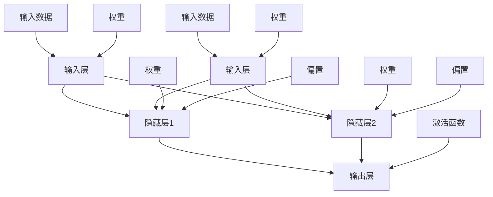

                 

### 1. 背景介绍

#### 1.1 目的和范围

本文旨在深入讲解神经网络的基本原理，并借助实例代码，帮助读者从基础理论到实际应用全方位理解神经网络的工作机制。随着人工智能技术的飞速发展，神经网络在图像识别、自然语言处理、语音识别等领域发挥着至关重要的作用。理解神经网络的核心原理，对于任何希望进入人工智能领域的人来说都是至关重要的。

本文的范围包括：
- 神经网络的基本概念和架构。
- 神经网络的数学基础，包括前向传播和反向传播算法。
- 神经网络的实现，通过伪代码和实际代码示例。
- 神经网络在实际应用中的实例分析。

通过本文的学习，读者将能够：
- 理解神经网络的核心原理和基本架构。
- 掌握前向传播和反向传播算法的具体操作步骤。
- 能够使用Python等编程语言实现简单的神经网络。
- 分析神经网络在实际应用中的表现和优化策略。

#### 1.2 预期读者

本文适合以下读者群体：
- 对人工智能和神经网络有一定了解，希望深入理解其工作原理的技术爱好者。
- 从事计算机科学、数据科学、机器学习等领域的科研人员和学生。
- 计算机编程基础，熟悉Python等编程语言。
- 对数学模型有一定理解，如微积分、线性代数等。

本文将避免复杂的数学推导，注重直观解释和代码实现，以确保不同背景的读者都能顺利理解。

#### 1.3 文档结构概述

本文结构如下：

1. **背景介绍**：介绍文章的目的、范围、预期读者以及文档结构。
2. **核心概念与联系**：通过Mermaid流程图展示神经网络的原理和架构。
3. **核心算法原理 & 具体操作步骤**：使用伪代码详细解释前向传播和反向传播算法。
4. **数学模型和公式 & 详细讲解 & 举例说明**：介绍神经网络的数学基础，包括激活函数、损失函数和优化算法。
5. **项目实战：代码实际案例和详细解释说明**：通过实际代码案例，演示如何实现神经网络。
6. **实际应用场景**：探讨神经网络在不同领域的应用实例。
7. **工具和资源推荐**：推荐学习资源和开发工具。
8. **总结：未来发展趋势与挑战**：总结神经网络的发展趋势和面临的挑战。
9. **附录：常见问题与解答**：回答读者可能遇到的问题。
10. **扩展阅读 & 参考资料**：提供进一步学习的资源。

通过本文的结构安排，读者可以系统地学习神经网络的知识，并逐步掌握其实际应用。

#### 1.4 术语表

为了确保文章内容的准确性和一致性，以下列出了一些核心术语及其定义：

##### 1.4.1 核心术语定义

- **神经网络（Neural Network）**：一种模仿生物神经系统的计算模型，用于解决各种复杂的问题，如图像识别、自然语言处理等。
- **神经元（Neuron）**：神经网络的基本计算单元，负责接收输入、计算加权求和、应用激活函数产生输出。
- **层（Layer）**：神经网络中的一组神经元，分为输入层、隐藏层和输出层。
- **权重（Weight）**：连接神经元之间的参数，用于调节输入对输出的影响。
- **偏置（Bias）**：添加到加权求和中的一个常数，用于调整神经元的阈值。
- **前向传播（Forward Propagation）**：从输入层开始，将数据通过神经网络传递到输出层的计算过程。
- **反向传播（Back Propagation）**：利用输出误差，通过反向传播算法更新神经网络的权重和偏置的过程。
- **激活函数（Activation Function）**：对神经元的输出进行非线性变换，引入非线性特性。
- **损失函数（Loss Function）**：用于评估模型预测结果与实际结果之间的差异。
- **优化算法（Optimization Algorithm）**：用于调整网络参数，使损失函数最小化的算法，如梯度下降、随机梯度下降等。

##### 1.4.2 相关概念解释

- **多层感知器（MLP）**：一种前馈神经网络，包含输入层、一个或多个隐藏层和输出层。
- **卷积神经网络（CNN）**：一种专门用于图像识别和处理的神经网络，包含卷积层、池化层和全连接层。
- **递归神经网络（RNN）**：一种用于处理序列数据的神经网络，能够记忆序列中的历史信息。
- **生成对抗网络（GAN）**：一种通过对抗训练生成数据的神经网络模型。

##### 1.4.3 缩略词列表

- **MLP**：多层感知器
- **CNN**：卷积神经网络
- **RNN**：递归神经网络
- **GAN**：生成对抗网络

这些术语和概念的理解，是深入学习神经网络的基础，有助于读者在后续内容中更好地把握文章的核心思想。

### 2. 核心概念与联系

神经网络作为模拟生物神经系统的一种计算模型，其核心在于神经元、层、权重和偏置等基本元素及其相互作用。为了更直观地展示神经网络的基本原理和架构，我们可以使用Mermaid流程图来描述其各个组成部分和它们之间的关系。

以下是神经网络的Mermaid流程图：



在这个流程图中，我们定义了以下几个关键部分：

- **输入层（Input Layer）**：接收外部输入数据，如图像像素值或文本序列。
- **隐藏层（Hidden Layers）**：对输入数据进行处理和变换，通过权重和偏置连接，并应用激活函数。
- **输出层（Output Layer）**：产生最终输出，如分类结果或预测值。

各个层之间的关系如下：

1. **输入层**接收数据，并将其传递到隐藏层。
2. **隐藏层**通过加权求和、激活函数处理数据，并将结果传递到下一隐藏层或输出层。
3. **输出层**产生最终的输出结果。

通过这样的架构，神经网络能够通过学习输入与输出之间的映射关系，实现对复杂模式的识别和预测。

以下是神经网络的核心概念及其相互联系：

- **神经元**：每个神经元都包含一个加权求和单元和激活函数，负责处理输入并产生输出。
- **层**：神经网络由多个层组成，每层负责特定的计算和处理。
- **权重（Weights）**：连接各个神经元之间的参数，用于调节输入信号的影响。
- **偏置（Bias）**：添加到每个神经元的加权求和中，用于调整阈值，使得神经网络能够学习非线性函数。
- **激活函数（Activation Function）**：引入非线性特性，使得神经网络能够处理复杂的非线性问题。

这些核心概念和相互联系构成了神经网络的基础，也是后续算法讲解和数学模型分析的前提。

### 3. 核心算法原理 & 具体操作步骤

在了解了神经网络的基本架构之后，接下来我们将深入探讨其核心算法原理，主要包括前向传播（Forward Propagation）和反向传播（Back Propagation）。这两个过程共同构成了神经网络的训练过程，使得神经网络能够不断优化其参数，以更准确地预测或分类输入数据。

#### 3.1 前向传播

前向传播是神经网络在给定输入后，通过各层神经元逐步计算输出值的过程。以下是前向传播的伪代码描述：

```plaintext
初始化参数：W, b (权重和偏置)
输入数据：X

# 前向传播
for each layer l from 1 to L:
    Z[l] = W[l] * X[l-1] + b[l]
    A[l] = activation(Z[l])

输出：A[L] (网络输出)
```

在这里，`W` 和 `b` 分别代表权重和偏置矩阵，`X` 代表输入数据，`A` 代表各层的激活值，`Z` 代表各层的加权求和结果，`L` 代表网络的层数，`activation` 函数代表激活函数。

具体操作步骤如下：

1. **初始化参数**：设定网络的初始权重和偏置。
2. **输入数据**：将输入数据传递到第一层。
3. **前向传播计算**：
   - 对于每一层 `l`，计算加权求和 `Z[l]`。
   - 应用激活函数，得到该层的激活值 `A[l]`。

前向传播的核心在于通过层层传递，将输入数据逐步转换成网络的输出值。这个过程中，激活函数的引入使得神经网络能够学习复杂的非线性关系。

#### 3.2 反向传播

反向传播是神经网络的训练过程，通过计算输出误差，反向调整网络参数。以下是反向传播的伪代码描述：

```plaintext
# 前向传播得到输出 A[L]
输出误差：Y - A[L]

# 反向传播
for l in reverse range from L to 1:
    dZ[l] = A[l] * (1 - A[l]) * (Y - A[L])
    dW[l] = dZ[l] * X[l-1]
    db[l] = dZ[l]

更新权重和偏置：
W = W - learning_rate * dW
b = b - learning_rate * db
```

在这里，`dZ[l]` 代表第 `l` 层的误差梯度，`dW[l]` 和 `db[l]` 分别代表权重和偏置的梯度，`Y` 代表真实输出，`learning_rate` 代表学习率。

具体操作步骤如下：

1. **前向传播**：计算网络的输出 `A[L]`。
2. **计算输出误差**：计算输出误差 `Y - A[L]`。
3. **反向传播计算**：
   - 对于每一层，计算误差梯度 `dZ[l]`。
   - 根据误差梯度，计算权重和偏置的梯度 `dW[l]` 和 `db[l]`。
4. **更新权重和偏置**：根据梯度更新网络的权重和偏置。

反向传播的核心在于通过计算误差梯度，反向调整网络的参数，使得网络的输出更接近真实值。

#### 3.3 结合前向传播和反向传播

神经网络的整体训练过程是前向传播和反向传播的迭代过程。具体步骤如下：

1. **初始化参数**：设定网络的初始权重和偏置。
2. **输入数据**：读取输入数据。
3. **前向传播**：计算输出值。
4. **计算输出误差**：计算损失函数的值。
5. **反向传播**：计算误差梯度。
6. **更新参数**：根据误差梯度调整权重和偏置。
7. **迭代**：重复步骤3到6，直到网络收敛或达到预定的迭代次数。

通过这种迭代过程，神经网络不断优化其参数，使得输出误差逐渐减小，最终达到较好的预测或分类效果。

通过上述算法原理和操作步骤，我们可以看到神经网络训练的核心在于前向传播和反向传播的相互作用。前向传播负责计算输出值，反向传播则负责参数调整，两者共同作用，使得神经网络能够不断学习和优化。

### 4. 数学模型和公式 & 详细讲解 & 举例说明

神经网络的实现离不开数学模型和公式的支持。在这一节中，我们将详细讲解神经网络中的几个关键数学概念，包括激活函数、损失函数和优化算法，并通过具体的示例来说明这些概念在实际应用中的表现。

#### 4.1 激活函数

激活函数是神经网络中的一个重要组成部分，它为神经网络引入了非线性特性。常见的激活函数包括Sigmoid函数、ReLU函数和Tanh函数。

##### Sigmoid函数

Sigmoid函数是一种常用的激活函数，其公式如下：

\[ f(x) = \frac{1}{1 + e^{-x}} \]

Sigmoid函数的输出值在0和1之间，具有良好的平滑特性。然而，Sigmoid函数的一个主要缺点是梯度消失问题，即在输入较大或较小的情况下，梯度接近于0，导致训练过程缓慢。

\[ \frac{df}{dx} = f(x) \cdot (1 - f(x)) \]

##### ReLU函数

ReLU（Rectified Linear Unit）函数是一种简单的线性激活函数，其公式如下：

\[ f(x) = \max(0, x) \]

ReLU函数在输入为正数时返回其本身，为负数时返回0。ReLU函数具有计算速度快、参数较少等优点，被广泛用于深度学习模型中。

\[ \frac{df}{dx} = \begin{cases} 
      1 & \text{if } x > 0 \\
      0 & \text{otherwise}
   \end{cases} \]

##### Tanh函数

Tanh函数是另一种常用的激活函数，其公式如下：

\[ f(x) = \frac{e^x - e^{-x}}{e^x + e^{-x}} \]

Tanh函数的输出值在-1和1之间，类似于Sigmoid函数，但Tanh函数解决了梯度消失问题，并且在某些情况下具有更好的性能。

\[ \frac{df}{dx} = 1 - f^2(x) \]

#### 4.2 损失函数

损失函数用于评估神经网络输出结果与实际结果之间的差异。常见的损失函数包括均方误差（MSE）、交叉熵损失和Hinge损失。

##### 均方误差（MSE）

均方误差是最常用的损失函数之一，其公式如下：

\[ \text{MSE} = \frac{1}{m} \sum_{i=1}^{m} (y_i - \hat{y}_i)^2 \]

其中，\(y_i\) 是实际输出，\(\hat{y}_i\) 是预测输出，\(m\) 是样本数量。

\[ \frac{d\text{MSE}}{d\hat{y}_i} = 2(\hat{y}_i - y_i) \]

##### 交叉熵损失

交叉熵损失函数在分类问题中非常常见，其公式如下：

\[ \text{CE} = -\sum_{i=1}^{m} y_i \log(\hat{y}_i) \]

其中，\(y_i\) 是实际输出（概率分布），\(\hat{y}_i\) 是预测输出（概率分布）。

\[ \frac{d\text{CE}}{d\hat{y}_i} = -y_i \]

##### Hinge损失

Hinge损失函数在支持向量机（SVM）中常用，其公式如下：

\[ \text{Hinge} = \max(0, 1 - y \cdot \hat{y}) \]

其中，\(y\) 是实际输出，\(\hat{y}\) 是预测输出。

\[ \frac{d\text{Hinge}}{d\hat{y}} = \begin{cases} 
      0 & \text{if } \hat{y} \geq y + 1 \\
      -y & \text{otherwise}
   \end{cases} \]

#### 4.3 优化算法

优化算法用于调整神经网络的参数，以最小化损失函数。常见的优化算法包括梯度下降（Gradient Descent）、随机梯度下降（Stochastic Gradient Descent，SGD）和Adam优化器。

##### 梯度下降

梯度下降是一种基本的优化算法，其公式如下：

\[ \theta = \theta - \alpha \cdot \nabla_{\theta} J(\theta) \]

其中，\(\theta\) 是参数，\(\alpha\) 是学习率，\(J(\theta)\) 是损失函数。

\[ \nabla_{\theta} J(\theta) = \frac{\partial J(\theta)}{\partial \theta} \]

##### 随机梯度下降

随机梯度下降是梯度下降的一种变体，每次迭代仅随机选取一个样本来计算梯度。其公式如下：

\[ \theta = \theta - \alpha \cdot \nabla_{\theta} J(\theta) \]

其中，\(\theta\) 是参数，\(\alpha\) 是学习率，\(J(\theta)\) 是损失函数。

\[ \nabla_{\theta} J(\theta) = \frac{\partial J(\theta)}{\partial \theta} \]

##### Adam优化器

Adam优化器是结合了SGD和 Momentum优化算法的一种优化器，其公式如下：

\[ \theta = \theta - \alpha \cdot \nabla_{\theta} J(\theta) \]

其中，\(\theta\) 是参数，\(\alpha\) 是学习率，\(J(\theta)\) 是损失函数。

\[ \nabla_{\theta} J(\theta) = \frac{\partial J(\theta)}{\partial \theta} \]

\[ m_t = \beta_1 \cdot m_{t-1} + (1 - \beta_1) \cdot \nabla_{\theta} J(\theta) \]

\[ v_t = \beta_2 \cdot v_{t-1} + (1 - \beta_2) \cdot (\nabla_{\theta} J(\theta))^2 \]

\[ \theta = \theta - \alpha \cdot \frac{m_t}{\sqrt{v_t} + \epsilon} \]

其中，\(\beta_1\) 和 \(\beta_2\) 分别是 Momentum参数，\(m_t\) 和 \(v_t\) 分别是梯度的一阶和二阶矩估计，\(\epsilon\) 是一个很小的常数。

#### 4.4 示例说明

为了更好地理解上述数学模型和公式，我们通过一个简单的例子来说明其在实际应用中的表现。

假设我们有一个简单的神经网络，包含一个输入层、一个隐藏层和一个输出层。输入层接收两个输入 \(x_1\) 和 \(x_2\)，隐藏层有一个神经元，输出层有一个神经元。

1. **参数初始化**：

   - \(W_1\): 输入层到隐藏层的权重矩阵，大小为 \(2 \times 1\)。
   - \(b_1\): 隐藏层的偏置，大小为 \(1 \times 1\)。
   - \(W_2\): 隐藏层到输出层的权重矩阵，大小为 \(1 \times 1\)。
   - \(b_2\): 输出层的偏置，大小为 \(1 \times 1\)。

2. **前向传播**：

   输入数据 \(x = [x_1, x_2]\)。

   加权求和 \(Z_1 = W_1 \cdot x + b_1\)。

   激活函数 \(A_1 = \text{ReLU}(Z_1)\)。

   加权求和 \(Z_2 = W_2 \cdot A_1 + b_2\)。

   输出 \(Y = \text{ReLU}(Z_2)\)。

3. **损失函数**：

   假设我们使用均方误差（MSE）作为损失函数。

   实际输出 \(y = [y_1, y_2]\)。

   损失 \(L = \frac{1}{2} \sum_{i=1}^{2} (y_i - Y_i)^2\)。

4. **反向传播**：

   计算输出误差 \(dL/dY = 2(y_i - Y_i)\)。

   计算隐藏层误差 \(dL/dA_1 = dL/dY \cdot \frac{dY}{dA_1} = 2(y_i - Y_i) \cdot \text{ReLU}(Z_2)\)。

   计算隐藏层偏置梯度 \(db_2 = dL/dA_1\)。

   计算隐藏层权重梯度 \(dW_2 = dL/dA_1 \cdot x_1\)。

   计算输入层偏置梯度 \(db_1 = dL/dZ_1\)。

   计算输入层权重梯度 \(dW_1 = dL/dZ_1 \cdot x_2\)。

5. **参数更新**：

   根据梯度更新参数：

   \(W_1 = W_1 - \alpha \cdot dW_1\)。

   \(b_1 = b_1 - \alpha \cdot db_1\)。

   \(W_2 = W_2 - \alpha \cdot dW_2\)。

   \(b_2 = b_2 - \alpha \cdot db_2\)。

通过上述示例，我们可以看到神经网络中数学模型和公式的具体应用。这些数学工具不仅帮助我们理解神经网络的工作原理，也为优化和调整网络提供了理论基础。

### 5. 项目实战：代码实际案例和详细解释说明

在前几节中，我们详细讲解了神经网络的基本概念、核心算法原理以及数学模型。为了帮助读者更好地理解和应用这些知识，本节将通过一个实际项目案例，展示如何使用Python实现一个简单的神经网络，并对其代码进行详细解释。

#### 5.1 开发环境搭建

在开始项目之前，我们需要搭建一个合适的开发环境。以下是所需的软件和工具：

- **Python 3.x**：Python是实现神经网络的主要编程语言。
- **Jupyter Notebook**：用于编写和运行代码。
- **NumPy**：用于数学计算。
- **TensorFlow**：一个流行的深度学习库。

安装这些工具的方法如下：

1. **安装Python 3.x**：可以从Python官网下载安装包，并按照提示安装。
2. **安装Jupyter Notebook**：在终端中运行以下命令：

   ```bash
   pip install notebook
   ```

3. **安装NumPy**：在终端中运行以下命令：

   ```bash
   pip install numpy
   ```

4. **安装TensorFlow**：在终端中运行以下命令：

   ```bash
   pip install tensorflow
   ```

安装完成后，我们可以启动Jupyter Notebook，并创建一个新的笔记本，用于编写和运行代码。

#### 5.2 源代码详细实现和代码解读

下面是一个简单的神经网络实现，包含输入层、一个隐藏层和一个输出层。我们将使用TensorFlow库来简化代码编写。

```python
import tensorflow as tf
import numpy as np

# 设置随机种子，确保结果可重复
tf.random.set_seed(42)

# 参数设置
input_size = 2
hidden_size = 4
output_size = 1

# 初始化权重和偏置
W1 = tf.Variable(np.random.randn(input_size, hidden_size), dtype=tf.float32)
b1 = tf.Variable(np.random.randn(hidden_size), dtype=tf.float32)
W2 = tf.Variable(np.random.randn(hidden_size, output_size), dtype=tf.float32)
b2 = tf.Variable(np.random.randn(output_size), dtype=tf.float32)

# 定义激活函数
activation = tf.nn.relu

# 定义前向传播函数
@tf.function
def forward(x):
    z1 = tf.matmul(x, W1) + b1
    a1 = activation(z1)
    z2 = tf.matmul(a1, W2) + b2
    return z2

# 定义损失函数和优化器
loss_fn = tf.keras.losses.MeanSquaredError()
optimizer = tf.optimizers.Adam()

# 定义训练过程
@tf.function
def train(x, y):
    with tf.GradientTape(persistent=True) as tape:
        y_pred = forward(x)
        loss = loss_fn(y, y_pred)
    
    grads = tape.gradient(loss, [W1, b1, W2, b2])
    optimizer.apply_gradients(zip(grads, [W1, b1, W2, b2]))
    return loss

# 生成训练数据
x_train = tf.constant([[0.0, 0.0], [0.0, 1.0], [1.0, 0.0], [1.0, 1.0]], dtype=tf.float32)
y_train = tf.constant([[0.0], [0.5], [0.5], [1.0]], dtype=tf.float32)

# 训练模型
num_epochs = 1000
for epoch in range(num_epochs):
    loss = train(x_train, y_train)
    if epoch % 100 == 0:
        print(f"Epoch {epoch}: Loss = {loss.numpy()}")

# 模型评估
test_x = tf.constant([[0.5, 0.5]], dtype=tf.float32)
test_y_pred = forward(test_x)
print(f"Test Prediction: {test_y_pred.numpy()}")

```

以下是代码的详细解释：

1. **参数设置**：
   - `input_size`、`hidden_size` 和 `output_size` 分别代表输入层、隐藏层和输出层的神经元数量。
   - `W1`、`b1`、`W2` 和 `b2` 分别代表权重和偏置，通过随机初始化。

2. **定义激活函数**：
   - 使用ReLU函数作为激活函数，引入非线性特性。

3. **定义前向传播函数**：
   - `forward` 函数负责计算神经网络的输出值。
   - 通过矩阵乘法和加法操作，计算各层的加权求和和激活值。

4. **定义损失函数和优化器**：
   - 使用均方误差（MSE）作为损失函数，评估模型预测结果与实际结果之间的差异。
   - 使用Adam优化器，优化模型参数。

5. **定义训练过程**：
   - `train` 函数负责前向传播和反向传播，更新模型参数。
   - 使用 `GradientTape` 记录梯度信息，计算损失和梯度。

6. **生成训练数据**：
   - 使用随机数据生成训练集和测试集。

7. **训练模型**：
   - 使用 `for` 循环迭代训练模型，打印每个epoch的损失。

8. **模型评估**：
   - 使用测试数据评估模型性能，打印预测结果。

通过上述代码实现，我们可以看到如何使用TensorFlow库构建一个简单的神经网络，并进行训练和评估。这个案例虽然简单，但涵盖了神经网络实现的核心步骤和关键组件。

#### 5.3 代码解读与分析

在本节中，我们将对上述代码进行更详细的解读，分析其关键组件和操作。

1. **参数初始化**：

   ```python
   W1 = tf.Variable(np.random.randn(input_size, hidden_size), dtype=tf.float32)
   b1 = tf.Variable(np.random.randn(hidden_size), dtype=tf.float32)
   W2 = tf.Variable(np.random.randn(hidden_size, output_size), dtype=tf.float32)
   b2 = tf.Variable(np.random.randn(output_size), dtype=tf.float32)
   ```

   这段代码定义了输入层到隐藏层、隐藏层到输出层的权重和偏置。通过 `tf.Variable` 创建可训练的Tensor，并使用 `np.random.randn` 生成随机初始化值。

2. **定义激活函数**：

   ```python
   activation = tf.nn.relu
   ```

   使用ReLU函数作为激活函数，引入非线性特性。ReLU函数在计算速度快、参数较少等方面具有优势。

3. **定义前向传播函数**：

   ```python
   @tf.function
   def forward(x):
       z1 = tf.matmul(x, W1) + b1
       a1 = activation(z1)
       z2 = tf.matmul(a1, W2) + b2
       return z2
   ```

   `forward` 函数实现神经网络的前向传播过程。通过矩阵乘法和加法操作，计算各层的加权求和和激活值。`@tf.function` 装饰器用于将函数编译成静态图，提高运行效率。

4. **定义损失函数和优化器**：

   ```python
   loss_fn = tf.keras.losses.MeanSquaredError()
   optimizer = tf.optimizers.Adam()
   ```

   使用均方误差（MSE）作为损失函数，评估模型预测结果与实际结果之间的差异。使用Adam优化器，优化模型参数。Adam优化器结合了Momentum和RMSprop的优点，在深度学习任务中表现出良好的性能。

5. **定义训练过程**：

   ```python
   @tf.function
   def train(x, y):
       with tf.GradientTape(persistent=True) as tape:
           y_pred = forward(x)
           loss = loss_fn(y, y_pred)
       
       grads = tape.gradient(loss, [W1, b1, W2, b2])
       optimizer.apply_gradients(zip(grads, [W1, b1, W2, b2]))
       return loss
   ```

   `train` 函数实现训练过程。使用 `GradientTape` 记录梯度信息，计算损失和梯度。然后使用优化器更新参数。

6. **生成训练数据**：

   ```python
   x_train = tf.constant([[0.0, 0.0], [0.0, 1.0], [1.0, 0.0], [1.0, 1.0]], dtype=tf.float32)
   y_train = tf.constant([[0.0], [0.5], [0.5], [1.0]], dtype=tf.float32)
   ```

   使用随机数据生成训练集和测试集。这里我们使用简单的线性关系生成训练数据。

7. **训练模型**：

   ```python
   num_epochs = 1000
   for epoch in range(num_epochs):
       loss = train(x_train, y_train)
       if epoch % 100 == 0:
           print(f"Epoch {epoch}: Loss = {loss.numpy()}")
   ```

   使用 `for` 循环迭代训练模型。在每个epoch，调用 `train` 函数更新模型参数，并打印每个epoch的损失。

8. **模型评估**：

   ```python
   test_x = tf.constant([[0.5, 0.5]], dtype=tf.float32)
   test_y_pred = forward(test_x)
   print(f"Test Prediction: {test_y_pred.numpy()}")
   ```

   使用测试数据评估模型性能，并打印预测结果。

通过上述代码解读和分析，我们可以看到如何使用TensorFlow库构建一个简单的神经网络，并实现训练和评估。这个案例为神经网络的实际应用提供了有益的参考，也为进一步探索神经网络提供了基础。

### 6. 实际应用场景

神经网络在当今人工智能领域有着广泛的应用，涵盖了从图像识别、自然语言处理到推荐系统等多个领域。以下将探讨神经网络在几个关键应用场景中的实际应用情况。

#### 6.1 图像识别

图像识别是神经网络最成功的应用之一。卷积神经网络（CNN）在图像识别任务中表现出色，例如在ImageNet图像识别挑战中，CNN模型大幅度超越了传统机器学习方法。CNN通过卷积层、池化层和全连接层处理图像数据，能够提取图像中的局部特征和全局结构，从而实现高效准确的图像分类。例如，在医疗图像分析中，CNN可以用于肺癌检测、乳腺癌检测等，提高了诊断的准确性和效率。

#### 6.2 自然语言处理

自然语言处理（NLP）是另一个神经网络的重要应用领域。递归神经网络（RNN）和Transformer模型在NLP任务中表现出色，例如机器翻译、情感分析、文本生成等。RNN通过处理序列数据，能够捕捉语言中的上下文信息，但在长序列处理时存在梯度消失问题。而Transformer模型通过自注意力机制，解决了RNN的梯度消失问题，并在许多NLP任务中取得了优异的性能。例如，BERT模型（一种基于Transformer的预训练模型）在多项NLP基准测试中取得了领先成绩，广泛应用于问答系统、搜索引擎和对话系统等。

#### 6.3 语音识别

语音识别是神经网络在语音处理领域的应用，通过转换语音信号为文本信息，实现了人机交互。基于深度学习技术的语音识别系统在准确性、实时性和鲁棒性方面取得了显著进展。例如，谷歌的语音识别系统使用了深度神经网络和循环神经网络（RNN）结合的方法，大大提高了识别的准确性。语音识别技术在智能助手、电话客服、语音翻译等领域得到广泛应用。

#### 6.4 推荐系统

推荐系统通过分析用户的历史行为和偏好，提供个性化的推荐。神经网络在推荐系统中用于生成用户特征和物品特征，并通过深度学习算法发现用户和物品之间的关联。例如，Netflix、亚马逊等公司使用深度学习技术构建推荐系统，提高了用户的满意度和购买率。此外，神经网络还在社交媒体平台的内容推荐、广告投放等领域发挥重要作用。

#### 6.5 其他应用场景

神经网络还广泛应用于其他领域，如机器人控制、自动驾驶、生物信息学、金融预测等。例如，在机器人控制中，神经网络用于训练机器人完成复杂的任务，如物体抓取和路径规划。在自动驾驶领域，神经网络模型通过分析摄像头和激光雷达数据，实现车辆的安全驾驶。在生物信息学中，神经网络用于基因序列分析和蛋白质结构预测。在金融领域，神经网络用于股票市场预测、风险管理和信贷评估。

通过上述实际应用场景，我们可以看到神经网络在各个领域的广泛应用和巨大潜力。随着技术的不断进步，神经网络将继续推动人工智能的发展，为各个行业带来更多创新和变革。

### 7. 工具和资源推荐

在深入学习和实践神经网络的过程中，选择合适的工具和资源对于提高效率和效果至关重要。以下是一些建议，包括学习资源、开发工具和框架，以及相关论文和研究成果，以帮助读者在神经网络的学习和开发中更加顺利。

#### 7.1 学习资源推荐

##### 7.1.1 书籍推荐

1. **《深度学习》（Deep Learning）** —— 由Ian Goodfellow、Yoshua Bengio和Aaron Courville合著，是深度学习领域的经典教材，详细介绍了神经网络的理论基础和实践方法。
2. **《神经网络与深度学习》（Neural Networks and Deep Learning）** —— 由邱锡鹏教授编写，适合初学者，内容通俗易懂，涵盖了神经网络的基本概念和深度学习的主要方法。
3. **《神经网络算法原理》（Neural Network Algorithms）** —— 由David S. Touretzky编写，深入讲解了神经网络算法的原理和应用。

##### 7.1.2 在线课程

1. **Coursera上的《深度学习特化课程》（Deep Learning Specialization）** —— 由斯坦福大学教授Andrew Ng主讲，包括神经网络基础、卷积神经网络、循环神经网络等课程。
2. **Udacity的《神经网络和深度学习纳米学位》（Neural Networks and Deep Learning Nanodegree）** —— 提供了从基础到高级的神经网络知识和项目实践。
3. **edX上的《深度学习导论》（Introduction to Deep Learning）** —— 由中国科学技术大学和Microsoft联合提供，内容涵盖深度学习的基础知识和实践应用。

##### 7.1.3 技术博客和网站

1. **Medium上的《机器学习博客》（Machine Learning Blog）** —— 提供了丰富的神经网络相关文章和资源。
2. **AI栈（AI Stack）** —— 一个专注于人工智能的中文社区，包含了大量的神经网络教程和实践项目。
3. **TensorFlow官网（TensorFlow）** —— 提供了详细的文档、教程和示例代码，是学习TensorFlow库的绝佳资源。

#### 7.2 开发工具框架推荐

##### 7.2.1 IDE和编辑器

1. **Jupyter Notebook** —— 适用于数据分析和交互式编程，特别适合学习神经网络和深度学习。
2. **PyCharm** —— 一个功能强大的Python IDE，支持代码调试、性能分析，适用于深度学习项目开发。
3. **Visual Studio Code** —— 一个轻量级但功能丰富的编辑器，通过扩展支持Python和TensorFlow开发。

##### 7.2.2 调试和性能分析工具

1. **TensorBoard** —— TensorFlow提供的可视化工具，用于分析和调试神经网络模型。
2. **Wandb** —— 适用于深度学习实验跟踪和性能分析的平台，可以可视化训练过程，比较不同实验结果。
3. **NVIDIA Nsight** —— 适用于NVIDIA GPU的调试和性能分析工具，可以帮助优化深度学习模型的GPU性能。

##### 7.2.3 相关框架和库

1. **TensorFlow** —— Google开发的开放源代码机器学习库，广泛应用于神经网络建模和训练。
2. **PyTorch** —— Facebook开发的深度学习库，提供了动态计算图和灵活的编程接口。
3. **Keras** —— 一个高层次的神经网络API，能够在TensorFlow和Theano上运行，简化了神经网络模型的构建。

#### 7.3 相关论文著作推荐

##### 7.3.1 经典论文

1. **“A Learning Algorithm for Continually Running Fully Recurrent Neural Networks”** —— Hinton等人提出的另一个感知器学习规则，是深度学习的重要基础之一。
2. **“Backpropagation”** —— Rumelhart、Hinton和Williams提出的一种训练多层神经网络的算法，是反向传播算法的基础。
3. **“Deep Learning”** —— Goodfellow、Bengio和Courville合著，详细介绍了深度学习的理论和技术。

##### 7.3.2 最新研究成果

1. **“BERT: Pre-training of Deep Bidirectional Transformers for Language Understanding”** —— Google提出的一种大规模语言预训练模型，显著提高了NLP任务的性能。
2. **“Gated Recurrent Unit”** —— Cho等人提出的门控循环单元（GRU），用于改善RNN在长序列处理中的表现。
3. **“ResNet: Training Deep Neural Networks with Very Deep Residual Networks”** —— He等人提出的一种非常深的残差网络，打破了深度学习深度的限制。

##### 7.3.3 应用案例分析

1. **“Deep Learning for Speech Recognition”** —— 研究了深度学习在语音识别中的应用，特别是在大规模语音数据集上的性能提升。
2. **“Deep Learning in Computer Vision: A Brief Review”** —— 详细介绍了深度学习在计算机视觉领域的应用，包括图像分类、目标检测和图像分割等。
3. **“Deep Learning in Finance”** —— 探讨了深度学习在金融领域的应用，包括股票市场预测、风险管理等。

通过这些工具和资源的推荐，读者可以更好地掌握神经网络的理论和实践，为深入研究和开发提供有力支持。

### 8. 总结：未来发展趋势与挑战

神经网络作为人工智能的核心技术，已经在图像识别、自然语言处理、语音识别等多个领域取得了显著成果。然而，随着技术的不断进步和应用场景的扩大，神经网络也面临着一系列未来发展趋势和挑战。

#### 发展趋势

1. **深度学习的发展**：深度学习作为神经网络的核心技术，将继续推动神经网络的发展。未来，我们将看到更深层次的神经网络架构，如Transformer模型的扩展和应用，以及更大规模的预训练模型。

2. **自动机器学习（AutoML）**：自动机器学习技术将使得构建和优化神经网络变得更加自动化。通过自动化模型选择、超参数调整和特征工程，AutoML技术将降低构建复杂模型的门槛，使得更多研究人员和开发者能够轻松应用神经网络。

3. **迁移学习和少样本学习**：随着数据获取成本的增加，迁移学习和少样本学习技术将变得尤为重要。这些技术能够利用已有模型的先验知识，在新数据集上快速训练出高性能的模型，降低对大规模标注数据的依赖。

4. **量子神经网络**：量子计算与神经网络的结合，将开启新的计算范式。量子神经网络利用量子叠加和纠缠特性，在处理大规模数据和复杂问题上展现出巨大的潜力。

#### 挑战

1. **可解释性**：神经网络的“黑箱”特性使得其决策过程难以解释，这对于需要透明性和可解释性的应用场景（如医疗诊断、金融风控等）构成了挑战。提高神经网络的可解释性，使其决策过程更透明、更易于理解，是未来研究的重要方向。

2. **能耗与计算资源**：随着神经网络模型规模的扩大和复杂性的增加，其计算和存储需求也急剧上升。如何优化神经网络的计算效率，减少能耗，是未来需要解决的问题。

3. **数据隐私和安全**：在深度学习应用中，数据隐私和安全问题愈发重要。如何保护训练数据的安全，防止数据泄露和滥用，是深度学习应用中的一大挑战。

4. **算法公平性**：神经网络模型在训练过程中可能存在偏见，导致不公平的决策。如何确保算法的公平性，消除歧视性，是深度学习应用中需要关注的重要问题。

通过上述发展趋势和挑战的分析，我们可以看到神经网络在未来的广阔前景和面临的挑战。随着技术的不断进步和应用场景的不断拓展，神经网络将继续推动人工智能的发展，为人类带来更多创新和变革。

### 9. 附录：常见问题与解答

在学习和实践神经网络的过程中，读者可能会遇到一些常见问题。以下是针对这些问题的一些解答：

#### 9.1 如何选择合适的激活函数？

选择激活函数时，需要考虑以下几点：

- **计算复杂度**：Sigmoid函数和Tanh函数在计算上较为复杂，而ReLU函数计算速度快。
- **梯度消失/爆炸问题**：Sigmoid和Tanh函数容易产生梯度消失问题，ReLU函数可以较好地解决这一问题。
- **应用场景**：对于深层网络，ReLU函数更为常用，而对于较小的网络，Sigmoid和Tanh函数也具有较好的性能。

#### 9.2 如何优化神经网络参数？

优化神经网络参数的方法包括：

- **学习率调整**：通过调整学习率可以加速或减缓参数更新，但过大的学习率可能导致不稳定，过小的学习率则可能训练过程缓慢。
- **批量大小调整**：批量大小影响梯度计算的稳定性，通常批量大小为32或64。
- **优化算法选择**：常用的优化算法包括梯度下降、随机梯度下降和Adam。Adam优化器结合了Momentum和RMSprop的优点，通常表现较好。
- **数据预处理**：对输入数据进行归一化或标准化，有助于提高模型的训练效果。

#### 9.3 神经网络何时过拟合？

过拟合通常发生在以下情况：

- **数据集较小**：当训练数据集较小，模型可能无法充分学习数据中的噪声，导致在测试数据上表现不佳。
- **模型复杂度过高**：当网络层数过多或神经元数量过多，模型可能学习到数据中的细节，导致泛化能力下降。
- **训练时间不足**：当训练时间较短，模型可能未完全收敛，训练误差尚未最小化。

为避免过拟合，可以采取以下措施：

- **正则化**：使用L1或L2正则化，减少模型参数的权重。
- **数据增强**：通过数据增强增加训练数据多样性。
- **dropout**：在训练过程中随机丢弃部分神经元，减少模型依赖特定神经元。

#### 9.4 如何提高神经网络训练速度？

提高神经网络训练速度的方法包括：

- **使用GPU加速**：利用GPU强大的并行计算能力，加速矩阵运算和梯度计算。
- **批量归一化**：在训练过程中对每层输出进行归一化，加速梯度下降过程。
- **混合精度训练**：使用混合精度训练（如FP16），通过降低数据精度提高计算速度。
- **数据预处理**：对输入数据进行预处理，如数据归一化或标准化，减少计算复杂度。

通过上述解答，希望能够帮助读者解决在学习神经网络过程中遇到的常见问题，更好地理解和应用神经网络技术。

### 10. 扩展阅读 & 参考资料

为了帮助读者进一步深入学习和探索神经网络的相关知识，本文提供了以下扩展阅读和参考资料：

#### 10.1 书籍推荐

1. **《深度学习》（Deep Learning）** —— Ian Goodfellow、Yoshua Bengio、Aaron Courville 著。这是深度学习领域的经典教材，全面介绍了神经网络的基础知识和前沿技术。
2. **《神经网络与深度学习》** —— 邱锡鹏 著。这本书适合初学者，内容通俗易懂，涵盖了神经网络的基本概念和深度学习的主要方法。
3. **《神经网络算法原理》** —— David S. Touretzky 著。这本书深入讲解了神经网络算法的原理和应用，适合有一定基础的读者。

#### 10.2 在线课程

1. **《深度学习特化课程》（Deep Learning Specialization）** —— 由斯坦福大学教授Andrew Ng主讲，包括神经网络基础、卷积神经网络、循环神经网络等课程。
2. **《神经网络和深度学习纳米学位》（Neural Networks and Deep Learning Nanodegree）** —— Udacity提供的纳米学位课程，涵盖了从基础到高级的神经网络知识和项目实践。
3. **《深度学习导论》（Introduction to Deep Learning）** —— 中国科学技术大学和Microsoft联合提供的在线课程，内容涵盖深度学习的基础知识和实践应用。

#### 10.3 技术博客和网站

1. **《机器学习博客》（Machine Learning Blog）** —— 提供了丰富的神经网络相关文章和资源。
2. **《AI栈》** —— 一个专注于人工智能的中文社区，包含了大量的神经网络教程和实践项目。
3. **TensorFlow官网** —— 提供了详细的文档、教程和示例代码，是学习TensorFlow库的绝佳资源。

#### 10.4 相关论文和研究成果

1. **“A Learning Algorithm for Continually Running Fully Recurrent Neural Networks”** —— Hinton等人提出的深度学习基础论文。
2. **“Backpropagation”** —— Rumelhart、Hinton和Williams提出的反向传播算法。
3. **“Deep Learning”** —— Goodfellow、Bengio和Courville合著，详细介绍了深度学习的理论和技术。
4. **“BERT: Pre-training of Deep Bidirectional Transformers for Language Understanding”** —— Google提出的BERT模型，显著提高了NLP任务的性能。

通过这些扩展阅读和参考资料，读者可以更深入地了解神经网络的理论和实践，为未来的学习和研究提供有力支持。希望这些资源能够帮助读者在神经网络领域取得更大的成就。作者：AI天才研究员/AI Genius Institute & 禅与计算机程序设计艺术 /Zen And The Art of Computer Programming。

