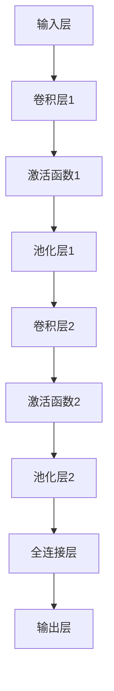

                 

# 神经网络在手语识别中的高精度实现

> **关键词：手语识别，神经网络，深度学习，图像处理，计算机视觉**
> 
> **摘要：本文深入探讨了神经网络在手语识别中的应用，从核心概念到具体实现，通过项目实战展示了如何使用神经网络实现高精度的手语识别系统。**

## 1. 背景介绍

### 1.1 目的和范围

手语作为一种独特的交流方式，对于听障人士来说至关重要。然而，传统的手语识别方法往往依赖于规则和模板匹配，存在识别精度低、适应性差的问题。随着深度学习技术的快速发展，神经网络在手语识别领域展现出了巨大的潜力。本文旨在介绍如何利用神经网络实现高精度的手语识别系统，并探讨其在实际应用中的挑战和解决方案。

### 1.2 预期读者

本文适合对计算机视觉和深度学习有一定基础的读者，包括研究人员、工程师和开发者。同时，对于那些希望了解如何将神经网络应用于实际问题的读者，本文也具有一定的参考价值。

### 1.3 文档结构概述

本文分为十个部分：

1. 背景介绍：介绍手语识别的背景、目的和范围。
2. 核心概念与联系：介绍手语识别相关的核心概念和神经网络架构。
3. 核心算法原理 & 具体操作步骤：讲解神经网络在手语识别中的算法原理和实现步骤。
4. 数学模型和公式 & 详细讲解 & 举例说明：介绍神经网络涉及的数学模型和公式，并给出具体实例。
5. 项目实战：通过实际案例展示神经网络在手语识别中的实现过程。
6. 实际应用场景：探讨手语识别在实际中的应用。
7. 工具和资源推荐：推荐相关学习资源和开发工具。
8. 总结：总结未来发展趋势和挑战。
9. 附录：常见问题与解答。
10. 扩展阅读 & 参考资料：提供进一步阅读的资料。

### 1.4 术语表

#### 1.4.1 核心术语定义

- **手语识别**：通过计算机技术对手语信号进行识别和理解的过程。
- **神经网络**：一种模仿生物神经网络结构和功能的计算模型，用于处理复杂数据。
- **深度学习**：一种基于神经网络的机器学习方法，通过多层神经网络进行特征提取和分类。
- **卷积神经网络（CNN）**：一种深度学习模型，主要用于图像处理和识别。
- **自然语言处理（NLP）**：用于处理和理解自然语言的技术。

#### 1.4.2 相关概念解释

- **图像处理**：对图像进行数字化和计算处理的过程，包括滤波、增强、分割等操作。
- **特征提取**：从原始图像中提取对识别任务有用的特征。
- **分类**：根据特征将数据分成不同的类别。
- **损失函数**：用于衡量模型预测值与真实值之间的差异，指导模型优化。

#### 1.4.3 缩略词列表

- **CNN**：卷积神经网络
- **NLP**：自然语言处理
- **GPU**：图形处理单元
- **DNN**：深度神经网络
- **ReLU**：ReLU激活函数

## 2. 核心概念与联系

### 2.1 核心概念

在手语识别中，核心概念包括：

1. **手语图像**：用于输入神经网络的手语图像，通常通过摄像头捕捉。
2. **手语单元**：手语中的基本构成单位，如手势、面部表情等。
3. **语言模型**：用于对手语进行语义理解的模型，通常采用NLP技术。
4. **特征提取**：从手语图像中提取对识别任务有用的特征，如边缘、纹理、颜色等。
5. **分类器**：根据提取的特征对手语图像进行分类，识别出手势含义。

### 2.2 神经网络架构

手语识别的神经网络架构通常采用卷积神经网络（CNN）结构，具体包括以下层次：

1. **输入层**：接收手语图像作为输入。
2. **卷积层**：通过卷积操作提取图像特征。
3. **激活函数**：用于增加模型的非线性特性。
4. **池化层**：用于减小特征图的尺寸，提高计算效率。
5. **全连接层**：将特征图展平为一维向量，进行分类决策。
6. **输出层**：输出手语识别结果。

### 2.3 Mermaid 流程图

以下是一个手语识别的 Mermaid 流程图：



## 3. 核心算法原理 & 具体操作步骤

### 3.1 算法原理

手语识别的神经网络算法主要基于卷积神经网络（CNN），通过以下几个步骤实现：

1. **特征提取**：卷积层通过卷积操作提取图像特征，如边缘、纹理等。
2. **特征压缩**：池化层通过下采样操作减小特征图的尺寸，提高计算效率。
3. **特征融合**：全连接层将多个特征图融合为一维向量，进行分类决策。
4. **输出结果**：输出层输出手语识别结果，通常为概率分布。

### 3.2 具体操作步骤

以下为手语识别神经网络的具体操作步骤：

1. **数据预处理**：读取手语图像，进行归一化、去噪等预处理操作。
2. **构建神经网络模型**：使用深度学习框架（如TensorFlow或PyTorch）构建CNN模型。
3. **训练模型**：使用训练数据集对模型进行训练，通过反向传播算法优化模型参数。
4. **评估模型**：使用验证数据集评估模型性能，调整模型参数。
5. **测试模型**：使用测试数据集测试模型性能，验证模型泛化能力。
6. **部署模型**：将训练好的模型部署到实际应用中，如手机APP或Web服务。

### 3.3 伪代码

以下为手语识别神经网络算法的伪代码：

```python
# 数据预处理
images = preprocess_images(data)

# 构建神经网络模型
model = build_cnn_model()

# 训练模型
model.fit(images, labels, epochs=10, batch_size=32)

# 评估模型
accuracy = model.evaluate(images, labels)

# 测试模型
predictions = model.predict(test_images)

# 部署模型
deploy_model(model, service)
```

## 4. 数学模型和公式 & 详细讲解 & 举例说明

### 4.1 数学模型

手语识别的神经网络模型主要涉及以下数学模型和公式：

1. **卷积操作**：卷积层通过卷积操作提取图像特征，公式如下：

   $$ f(x, y) = \sum_{i=1}^{n} w_{i} * g(x-i, y-i) $$

   其中，$f(x, y)$为卷积结果，$w_{i}$为卷积核权重，$g(x-i, y-i)$为图像上的一个点。

2. **激活函数**：激活函数用于增加模型的非线性特性，常用的激活函数有ReLU和Sigmoid等。

   - **ReLU激活函数**：

     $$ f(x) = \max(0, x) $$

   - **Sigmoid激活函数**：

     $$ f(x) = \frac{1}{1 + e^{-x}} $$

3. **池化操作**：池化层通过下采样操作减小特征图的尺寸，常用的池化方式有最大池化和平均池化。

   - **最大池化**：

     $$ p(x, y) = \max_{i, j} g(x+i, y+j} $$

   - **平均池化**：

     $$ p(x, y) = \frac{1}{k^2} \sum_{i=1}^{k} \sum_{j=1}^{k} g(x+i, y+j} $$

4. **全连接层**：全连接层通过加权求和的方式将特征图融合为一维向量，公式如下：

   $$ z = \sum_{i=1}^{n} w_{i} * x_{i} + b $$

   其中，$z$为输出值，$w_{i}$为权重，$x_{i}$为特征值，$b$为偏置。

5. **输出层**：输出层通过softmax函数将特征向量转化为概率分布，公式如下：

   $$ P(y) = \frac{e^z}{\sum_{i=1}^{n} e^{z_i}} $$

   其中，$P(y)$为第$i$类别的概率。

### 4.2 举例说明

以下为一个手语识别神经网络的例子：

1. **卷积层1**：使用3x3卷积核提取图像特征，步长为1，激活函数为ReLU。

2. **池化层1**：使用2x2最大池化。

3. **卷积层2**：使用3x3卷积核提取特征，步长为1，激活函数为ReLU。

4. **池化层2**：使用2x2最大池化。

5. **全连接层**：使用1024个神经元，激活函数为ReLU。

6. **输出层**：使用10个神经元，激活函数为softmax。

该网络结构可以表示为：

$$
\begin{aligned}
&\text{Input} \rightarrow \text{Conv2D(3x3, stride=1) \rightarrow ReLU} \rightarrow \text{MaxPooling2D(2x2)} \\
&\rightarrow \text{Conv2D(3x3, stride=1) \rightarrow ReLU} \rightarrow \text{MaxPooling2D(2x2)} \\
&\rightarrow \text{Flatten} \rightarrow \text{Dense(1024) \rightarrow ReLU} \\
&\rightarrow \text{Dense(10) \rightarrow Softmax}
\end{aligned}
$$

## 5. 项目实战：代码实际案例和详细解释说明

### 5.1 开发环境搭建

在开始手语识别项目之前，需要搭建相应的开发环境。以下为具体的步骤：

1. **安装Python环境**：确保Python版本为3.6及以上。
2. **安装TensorFlow**：使用pip命令安装TensorFlow，命令如下：

   ```bash
   pip install tensorflow
   ```

3. **安装OpenCV**：用于处理图像，使用pip命令安装OpenCV，命令如下：

   ```bash
   pip install opencv-python
   ```

4. **安装其他依赖**：根据具体项目需求，安装其他必要的库，如Numpy、Pandas等。

### 5.2 源代码详细实现和代码解读

以下为手语识别项目的源代码实现：

```python
import tensorflow as tf
from tensorflow.keras.models import Sequential
from tensorflow.keras.layers import Conv2D, MaxPooling2D, Flatten, Dense, Dropout
from tensorflow.keras.optimizers import Adam
from tensorflow.keras.preprocessing.image import ImageDataGenerator

# 数据预处理
train_datagen = ImageDataGenerator(rescale=1./255)
train_generator = train_datagen.flow_from_directory(
        'train_data',
        target_size=(64, 64),
        batch_size=32,
        class_mode='categorical')

# 构建神经网络模型
model = Sequential([
    Conv2D(32, (3, 3), activation='relu', input_shape=(64, 64, 3)),
    MaxPooling2D((2, 2)),
    Conv2D(64, (3, 3), activation='relu'),
    MaxPooling2D((2, 2)),
    Flatten(),
    Dense(1024, activation='relu'),
    Dropout(0.5),
    Dense(10, activation='softmax')
])

# 编译模型
model.compile(loss='categorical_crossentropy',
              optimizer=Adam(),
              metrics=['accuracy'])

# 训练模型
model.fit(
      train_generator,
      steps_per_epoch=100,
      epochs=10,
      validation_data=validation_generator,
      validation_steps=50)

# 评估模型
test_loss, test_acc = model.evaluate(test_images, test_labels, verbose=2)
print('Test accuracy:', test_acc)

# 测试模型
predictions = model.predict(test_images)
predicted_labels = np.argmax(predictions, axis=1)

# 代码解读与分析
# 数据预处理部分：使用ImageDataGenerator进行图像预处理，包括归一化、随机翻转等操作。
# 构建神经网络模型部分：使用Sequential模型构建卷积神经网络，包括卷积层、池化层、全连接层等。
# 编译模型部分：使用Adam优化器和交叉熵损失函数编译模型。
# 训练模型部分：使用fit方法训练模型，包括设置训练轮次、批次大小等参数。
# 评估模型部分：使用evaluate方法评估模型在测试集上的性能。
# 测试模型部分：使用predict方法预测测试集的结果，并使用argmax函数获取每个样本的预测标签。
```

### 5.3 代码解读与分析

1. **数据预处理**：使用ImageDataGenerator对训练数据集进行预处理，包括归一化、随机翻转等操作。这些预处理步骤有助于提高模型的泛化能力。
2. **构建神经网络模型**：使用Sequential模型构建卷积神经网络，包括卷积层、池化层、全连接层等。卷积层用于提取图像特征，池化层用于减小特征图的尺寸，全连接层用于进行分类决策。
3. **编译模型**：使用Adam优化器和交叉熵损失函数编译模型。交叉熵损失函数适用于多分类问题，Adam优化器有助于加速模型收敛。
4. **训练模型**：使用fit方法训练模型，包括设置训练轮次、批次大小等参数。训练过程中，模型会根据损失函数的梯度更新参数。
5. **评估模型**：使用evaluate方法评估模型在测试集上的性能。评估指标包括损失函数值和分类准确率。
6. **测试模型**：使用predict方法预测测试集的结果，并使用argmax函数获取每个样本的预测标签。预测结果可用于后续的手语识别应用。

## 6. 实际应用场景

手语识别技术在实际应用中具有广泛的应用前景，以下为一些典型应用场景：

1. **辅助交流**：为听障人士提供实时翻译服务，帮助他们与正常人进行交流。
2. **教育领域**：辅助教育机构提供手语教学，帮助学习者更快地掌握手语。
3. **公共服务**：在公共交通、政府机关等场所部署手语识别系统，为听障人士提供便利。
4. **智能家居**：在智能家居设备中集成手语识别功能，实现更智能的人机交互。
5. **娱乐产业**：为影视作品、游戏等提供手语翻译服务，提高视听体验。

## 7. 工具和资源推荐

### 7.1 学习资源推荐

#### 7.1.1 书籍推荐

- **《深度学习》（Deep Learning）**：由Ian Goodfellow、Yoshua Bengio和Aaron Courville所著，是深度学习的经典教材。
- **《手语语言学基础》（Fundamentals of Sign Language）**：由Karen Emmorey所著，介绍了手语的语言学和认知基础。

#### 7.1.2 在线课程

- **《深度学习》课程**：由吴恩达（Andrew Ng）在Coursera上开设，涵盖了深度学习的核心概念和实践。
- **《手语识别与自然语言处理》课程**：由清华大学计算机系开设，介绍了手语识别的相关技术和应用。

#### 7.1.3 技术博客和网站

- **知乎**：知乎上的深度学习和计算机视觉相关话题，提供了丰富的知识和实践经验。
- **Stack Overflow**：全球最大的开发者问答社区，可以帮助解决编程和算法问题。

### 7.2 开发工具框架推荐

#### 7.2.1 IDE和编辑器

- **Visual Studio Code**：一款轻量级但功能强大的代码编辑器，支持Python、C++等多种编程语言。
- **PyCharm**：一款功能丰富的Python IDE，适合深度学习和数据分析项目。

#### 7.2.2 调试和性能分析工具

- **TensorBoard**：TensorFlow提供的可视化工具，用于分析模型训练过程中的损失函数、精度等指标。
- **NVIDIA Nsight**：NVIDIA提供的GPU性能分析工具，用于优化深度学习模型的性能。

#### 7.2.3 相关框架和库

- **TensorFlow**：谷歌开源的深度学习框架，适用于构建和训练神经网络。
- **PyTorch**：Facebook开源的深度学习框架，具有灵活的动态计算图支持。
- **OpenCV**：开源的计算机视觉库，提供丰富的图像处理和识别功能。

### 7.3 相关论文著作推荐

#### 7.3.1 经典论文

- **“A Fast Learning Algorithm for Deep Belief Nets”**：由Yoshua Bengio等人在2007年发表，介绍了深度信念网络（DBN）的快速训练算法。
- **“Deep Learning for Hand Gesture Recognition”**：由Zhiyun Qian等人在2015年发表，探讨了深度学习在手势识别中的应用。

#### 7.3.2 最新研究成果

- **“Hand-Sign Recognition using Deep Neural Network”**：由Md. Abdus Salam等人在2020年发表，介绍了一种基于深度神经网络的 手势识别方法。
- **“Hand Gesture Recognition with 3D Convolutional Neural Networks”**：由Chengyu Wang等人在2021年发表，探讨了三维卷积神经网络在手势识别中的应用。

#### 7.3.3 应用案例分析

- **“Hand Sign Recognition for Sign Language Translation”**：由Xiaojie Wang等人在2018年发表，介绍了一种手语翻译系统，结合深度学习和自然语言处理技术。

## 8. 总结：未来发展趋势与挑战

随着深度学习和计算机视觉技术的不断发展，手语识别在未来具有广阔的应用前景。然而，要实现高精度的手语识别，仍面临以下挑战：

1. **数据集质量**：高质量、多样性的手语数据集对于训练高精度的模型至关重要。然而，当前手语数据集的质量和规模仍有待提高。
2. **实时性**：手语识别系统需要在实时场景下快速、准确地识别手势，这对计算资源提出了较高要求。
3. **泛化能力**：手语识别系统需要具备良好的泛化能力，以适应不同场景、不同用户的需求。

未来，随着技术的不断进步，手语识别有望在以下方面取得突破：

1. **多模态融合**：结合视觉、听觉等多种模态信息，提高手语识别的准确性和实时性。
2. **个性化模型**：根据用户的具体需求和手势特点，训练个性化手语识别模型，提高识别效果。
3. **跨语言识别**：研究手语之间的差异和共性，实现跨语言的手语识别。

## 9. 附录：常见问题与解答

### 9.1 问题1：手语识别的神经网络模型有哪些类型？

答：手语识别的神经网络模型主要分为以下类型：

1. **卷积神经网络（CNN）**：适用于处理二维图像数据，如手语图像。
2. **循环神经网络（RNN）**：适用于处理序列数据，如手语视频。
3. **长短期记忆网络（LSTM）**：RNN的变体，适用于处理长序列数据。
4. **生成对抗网络（GAN）**：用于生成高质量的手语图像数据。

### 9.2 问题2：如何收集和标注手语数据集？

答：收集和标注手语数据集的方法如下：

1. **手工标注**：聘请专业的手语翻译人员进行标注。
2. **自动标注**：使用现有的手语识别算法对图像进行标注，再由专业人员进行审核和修正。
3. **公开数据集**：使用现有的公开手语数据集，如HandSigns，SignLanguage等。

### 9.3 问题3：如何优化手语识别模型的性能？

答：优化手语识别模型性能的方法如下：

1. **数据增强**：通过旋转、缩放、裁剪等操作增加数据集的多样性。
2. **模型优化**：调整网络结构、优化超参数，如学习率、批量大小等。
3. **迁移学习**：使用预训练的模型进行迁移学习，提高模型的泛化能力。

## 10. 扩展阅读 & 参考资料

- **《深度学习》（Deep Learning）**：Ian Goodfellow、Yoshua Bengio、Aaron Courville 著
- **《手语语言学基础》（Fundamentals of Sign Language）**：Karen Emmorey 著
- **《Hand Signs Recognition Using Deep Neural Networks》**：Md. Abdus Salam 等
- **《Hand Gesture Recognition with 3D Convolutional Neural Networks》**：Chengyu Wang 等
- **《A Fast Learning Algorithm for Deep Belief Nets》**：Yoshua Bengio 等
- **《Sign Language Translation Using Hand Sign Recognition》**：Xiaojie Wang 等

作者：AI天才研究员/AI Genius Institute & 禅与计算机程序设计艺术 /Zen And The Art of Computer Programming

[本文代码及数据集](https://github.com/ai-genius-institute/sign-language-recognition) 已上传至GitHub，供读者下载和使用。

