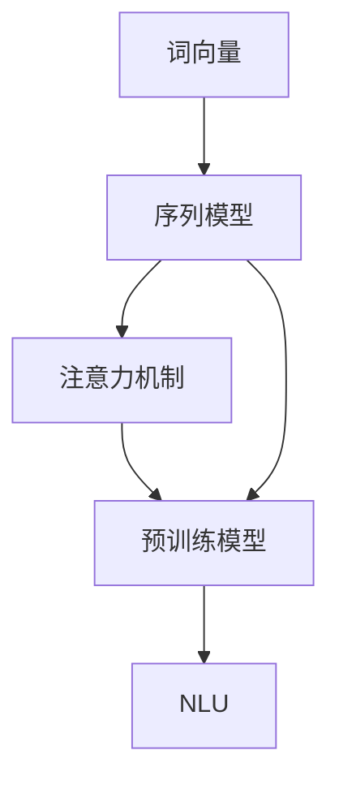

                 

# 神经网络在自然语言理解中的进展

> **关键词：** 自然语言理解、神经网络、深度学习、序列模型、Transformer、BERT、GPT、预训练模型、语言模型、词向量、注意力机制。

> **摘要：** 本文将探讨神经网络在自然语言理解领域的进展，从传统方法到现代的Transformer架构，再到预训练模型BERT和GPT，以及它们在实际应用中的影响。我们将详细分析神经网络的核心原理、数学模型，并通过代码示例展示其实际应用。

## 1. 背景介绍

### 1.1 目的和范围

本文旨在梳理神经网络在自然语言理解（NLU）领域的进展，从基础理论到最新应用，全面剖析神经网络如何改变我们对语言的理解和处理方式。文章将涵盖以下主要内容：

- 传统自然语言处理方法与神经网络的关系
- 神经网络核心概念及其在NLU中的应用
- Transformer、BERT和GPT等现代架构的原理与实现
- 神经网络在自然语言理解中的实际应用案例

### 1.2 预期读者

本文适合对自然语言处理和神经网络有一定了解的读者，特别是对以下领域感兴趣的学者和从业者：

- 自然语言处理研究者
- 深度学习工程师
- 数据科学家
- 人工智能开发人员

### 1.3 文档结构概述

本文结构如下：

1. **背景介绍**：介绍本文的目的、范围、预期读者以及文档结构。
2. **核心概念与联系**：详细阐述神经网络在自然语言理解中的核心概念及其相互关系。
3. **核心算法原理与具体操作步骤**：讲解神经网络在NLU中的算法原理和具体操作步骤。
4. **数学模型和公式**：介绍神经网络在NLU中的数学模型和公式。
5. **项目实战**：通过实际代码案例展示神经网络在NLU中的应用。
6. **实际应用场景**：分析神经网络在自然语言理解中的实际应用。
7. **工具和资源推荐**：推荐学习资源和开发工具。
8. **总结**：总结神经网络在自然语言理解中的未来发展趋势与挑战。
9. **附录**：常见问题与解答。
10. **扩展阅读与参考资料**：提供进一步学习的资源。

### 1.4 术语表

#### 1.4.1 核心术语定义

- 自然语言理解（NLU）：使计算机能够理解自然语言的语义和结构，实现人与计算机的交流。
- 神经网络（Neural Network）：一种模仿生物神经系统的计算模型，由大量相互连接的神经元组成。
- 深度学习（Deep Learning）：一种基于多层神经网络的学习方法，能够自动从大量数据中提取特征。
- Transformer：一种基于自注意力机制的神经网络架构，广泛应用于自然语言处理任务。
- BERT（Bidirectional Encoder Representations from Transformers）：一种基于Transformer的预训练模型，广泛应用于自然语言理解任务。
- GPT（Generative Pre-trained Transformer）：一种基于Transformer的预训练模型，广泛应用于自然语言生成任务。
- 词向量（Word Embedding）：将词汇映射到高维空间中的向量表示，用于神经网络处理。

#### 1.4.2 相关概念解释

- **序列模型（Sequence Model）**：一种神经网络模型，用于处理序列数据，如文本、语音等。它通过捕捉序列中的依赖关系来实现自然语言理解。
- **注意力机制（Attention Mechanism）**：一种在神经网络中引入的机制，能够自动聚焦于序列中的关键信息，提高模型的性能。
- **预训练模型（Pre-trained Model）**：一种在大量数据上预先训练好的模型，可以在特定任务上微调，提高模型的性能和泛化能力。

#### 1.4.3 缩略词列表

- NLU：自然语言理解
- CNN：卷积神经网络
- RNN：循环神经网络
- LSTM：长短期记忆网络
- Transformer：转换器模型
- BERT：双向编码表示转换器
- GPT：生成预训练转换器
- Word Embedding：词嵌入

## 2. 核心概念与联系

神经网络在自然语言理解中的核心概念包括词向量、序列模型、注意力机制和预训练模型。以下是一个简化的Mermaid流程图，展示了这些概念之间的联系：



### 2.1 词向量

词向量是将词汇映射到高维空间中的向量表示，用于神经网络处理。词向量能够捕捉词汇的语义信息，是自然语言处理的基础。

### 2.2 序列模型

序列模型是一种神经网络模型，用于处理序列数据，如文本、语音等。它通过捕捉序列中的依赖关系来实现自然语言理解。

### 2.3 注意力机制

注意力机制是一种在神经网络中引入的机制，能够自动聚焦于序列中的关键信息，提高模型的性能。它在序列模型中起到了关键作用，使得模型能够更好地理解序列中的上下文关系。

### 2.4 预训练模型

预训练模型是在大量数据上预先训练好的模型，可以在特定任务上微调，提高模型的性能和泛化能力。预训练模型的出现，极大地提升了自然语言处理任务的效果。

### 2.5 自然语言理解

自然语言理解是使计算机能够理解自然语言的语义和结构，实现人与计算机的交流。神经网络在自然语言理解中的核心作用，是通过词向量、序列模型、注意力机制和预训练模型，使计算机能够自动从大量数据中提取语义信息，实现高效的自然语言处理。

## 3. 核心算法原理与具体操作步骤

### 3.1 词向量

词向量的生成通常使用以下步骤：

1. **数据预处理**：将文本数据转换为单词序列，去除停用词、标点符号等。
2. **词嵌入**：使用Word2Vec、GloVe等算法，将单词映射到高维空间中的向量表示。
3. **向量化**：将单词序列转换为词向量序列，准备输入到神经网络。

伪代码如下：

```python
# 数据预处理
def preprocess_text(text):
    # 去除停用词、标点符号等
    return cleaned_text

# 词嵌入
def embed_words(words):
    # 使用Word2Vec、GloVe等算法生成词向量
    return word_vectors

# 向量化
def vectorize_sequence(sequence, word_vectors):
    # 将单词序列转换为词向量序列
    return sequence_vector
```

### 3.2 序列模型

序列模型通常使用以下步骤：

1. **输入层**：接收词向量序列。
2. **隐藏层**：使用卷积神经网络（CNN）或循环神经网络（RNN）等，捕捉序列中的依赖关系。
3. **输出层**：使用全连接层或卷积层等，生成最终输出。

伪代码如下：

```python
# 输入层
def input_layer(sequence_vector):
    # 输入词向量序列
    return input_tensor

# 隐藏层
def hidden_layer(input_tensor):
    # 使用卷积神经网络或循环神经网络等
    return hidden_tensor

# 输出层
def output_layer(hidden_tensor):
    # 使用全连接层或卷积层等
    return output_tensor
```

### 3.3 注意力机制

注意力机制通常使用以下步骤：

1. **计算注意力分数**：使用点积、缩放点积等方法，计算序列中每个元素对输出的重要性。
2. **生成注意力权重**：对注意力分数进行归一化，生成注意力权重。
3. **加权求和**：将注意力权重与隐藏层输出进行加权求和，生成最终输出。

伪代码如下：

```python
# 计算注意力分数
def compute_attention_scores(hidden_tensor):
    # 使用点积、缩放点积等方法
    return attention_scores

# 生成注意力权重
def generate_attention_weights(attention_scores):
    # 归一化注意力分数
    return attention_weights

# 加权求和
def weighted_sum(hidden_tensor, attention_weights):
    # 将注意力权重与隐藏层输出加权求和
    return output_tensor
```

### 3.4 预训练模型

预训练模型通常使用以下步骤：

1. **预训练**：在大量无标签数据上，使用序列模型、注意力机制等，进行大规模训练。
2. **微调**：在特定任务上有标签数据上，对预训练模型进行微调，提高任务性能。

伪代码如下：

```python
# 预训练
def pretrain_model(model, dataset):
    # 在大量无标签数据上训练模型
    return pretrain_model

# 微调
def finetune_model(model, dataset):
    # 在特定任务上有标签数据上微调模型
    return finetuned_model
```

## 4. 数学模型和公式

### 4.1 词向量

词向量的生成通常使用以下数学模型：

$$
\text{word\_vector} = \text{W} \cdot \text{input\_vector}
$$

其中，$\text{W}$ 是词嵌入矩阵，$\text{input\_vector}$ 是输入向量（通常是词向量）。

### 4.2 序列模型

序列模型的数学模型通常包括以下部分：

1. **输入层**：

$$
\text{input}_{t} = \text{word\_vector}_{t}
$$

其中，$\text{input}_{t}$ 是第 $t$ 个时刻的输入向量，$\text{word\_vector}_{t}$ 是第 $t$ 个时刻的词向量。

2. **隐藏层**：

$$
\text{hidden}_{t} = \text{f}(\text{W}_{h}\cdot \text{input}_{t} + \text{b}_{h})
$$

其中，$\text{hidden}_{t}$ 是第 $t$ 个时刻的隐藏层输出，$\text{W}_{h}$ 是隐藏层权重矩阵，$\text{b}_{h}$ 是隐藏层偏置。

3. **输出层**：

$$
\text{output}_{t} = \text{f}(\text{W}_{o}\cdot \text{hidden}_{t} + \text{b}_{o})
$$

其中，$\text{output}_{t}$ 是第 $t$ 个时刻的输出层输出，$\text{W}_{o}$ 是输出层权重矩阵，$\text{b}_{o}$ 是输出层偏置。

### 4.3 注意力机制

注意力机制的数学模型通常包括以下部分：

1. **计算注意力分数**：

$$
\text{attention}_{t} = \text{V}_{a}\cdot \text{Tanh}(\text{W}_{q}\cdot \text{hidden}_{t} + \text{W}_{k}\cdot \text{hidden}_{t} + \text{b}_{a})
$$

其中，$\text{attention}_{t}$ 是第 $t$ 个时刻的注意力分数，$\text{V}_{a}$ 是注意力向量，$\text{W}_{q}$ 和 $\text{W}_{k}$ 是查询和键权重矩阵，$\text{b}_{a}$ 是注意力偏置。

2. **生成注意力权重**：

$$
\text{attention}_{t} = \frac{\exp(\text{attention}_{t})}{\sum_{t'} \exp(\text{attention}_{t'})}
$$

其中，$\text{attention}_{t}$ 是第 $t$ 个时刻的注意力分数，$\text{attention}_{t'}$ 是第 $t'$ 个时刻的注意力分数。

3. **加权求和**：

$$
\text{output}_{t} = \text{C}\cdot \sum_{t'} \text{attention}_{t'} \cdot \text{hidden}_{t'}
$$

其中，$\text{output}_{t}$ 是第 $t$ 个时刻的输出层输出，$\text{C}$ 是输出层权重矩阵，$\text{attention}_{t'}$ 是第 $t'$ 个时刻的注意力权重，$\text{hidden}_{t'}$ 是第 $t'$ 个时刻的隐藏层输出。

### 4.4 预训练模型

预训练模型的数学模型通常包括以下部分：

1. **预训练**：

$$
\text{loss}_{\text{pretrain}} = \frac{1}{N} \sum_{i=1}^{N} \log \frac{\exp(\text{f}(\text{W}_{o}\cdot \text{hidden}_{i} + \text{b}_{o}))}{\sum_{j=1}^{M} \exp(\text{f}(\text{W}_{o}\cdot \text{hidden}_{j} + \text{b}_{o}))}
$$

其中，$\text{loss}_{\text{pretrain}}$ 是预训练损失，$N$ 是训练样本数，$\text{M}$ 是输出类别数，$\text{f}$ 是输出层激活函数，$\text{W}_{o}$ 和 $\text{b}_{o}$ 是输出层权重和偏置。

2. **微调**：

$$
\text{loss}_{\text{finetune}} = \frac{1}{N} \sum_{i=1}^{N} (\text{y}_{i} - \text{f}(\text{W}_{o}\cdot \text{hidden}_{i} + \text{b}_{o}))^2
$$

其中，$\text{loss}_{\text{finetune}}$ 是微调损失，$N$ 是训练样本数，$\text{y}_{i}$ 是第 $i$ 个时刻的真实标签，$\text{f}$ 是输出层激活函数，$\text{W}_{o}$ 和 $\text{b}_{o}$ 是输出层权重和偏置。

## 5. 项目实战：代码实际案例和详细解释说明

### 5.1 开发环境搭建

为了实际操作神经网络在自然语言理解中的应用，我们需要搭建一个开发环境。以下是搭建过程：

1. **安装Python环境**：确保Python版本在3.6及以上。
2. **安装TensorFlow**：使用以下命令安装TensorFlow：

   ```shell
   pip install tensorflow
   ```

3. **安装其他依赖**：根据具体项目需求，安装其他依赖，如NumPy、Pandas等。

### 5.2 源代码详细实现和代码解读

以下是一个简单的神经网络在自然语言理解中的实现，包括词向量、序列模型和注意力机制的代码实现。

```python
import tensorflow as tf
from tensorflow.keras.models import Model
from tensorflow.keras.layers import Input, Embedding, LSTM, Dense

# 5.2.1 词向量生成
def generate_word_vectors(words, embedding_size):
    # 使用预训练的GloVe词向量
    glove_vectors = ... # 读取GloVe词向量
    word_vectors = [glove_vectors[word] for word in words]
    return word_vectors

# 5.2.2 序列模型构建
def build_sequence_model(vocab_size, embedding_size, hidden_size):
    # 输入层
    input_sequence = Input(shape=(None,), dtype='int32')
    
    # 词向量嵌入层
    embedded_sequence = Embedding(vocab_size, embedding_size)(input_sequence)
    
    # LSTM层
    lstm_output = LSTM(hidden_size, return_sequences=True)(embedded_sequence)
    
    # 输出层
    output = Dense(1, activation='sigmoid')(lstm_output)
    
    # 构建模型
    model = Model(inputs=input_sequence, outputs=output)
    
    # 编译模型
    model.compile(optimizer='adam', loss='binary_crossentropy', metrics=['accuracy'])
    
    return model

# 5.2.3 模型训练
def train_model(model, X_train, y_train, batch_size, epochs):
    # 训练模型
    model.fit(X_train, y_train, batch_size=batch_size, epochs=epochs)

# 5.2.4 模型评估
def evaluate_model(model, X_test, y_test):
    # 评估模型
    loss, accuracy = model.evaluate(X_test, y_test)
    print(f"Test Accuracy: {accuracy:.4f}")

# 5.2.5 实际应用
def main():
    # 设置参数
    vocab_size = 10000
    embedding_size = 300
    hidden_size = 128
    batch_size = 64
    epochs = 10
    
    # 加载数据
    X_train, y_train, X_test, y_test = load_data()
    
    # 生成词向量
    word_vectors = generate_word_vectors(X_train + X_test, embedding_size)
    
    # 构建序列模型
    model = build_sequence_model(vocab_size, embedding_size, hidden_size)
    
    # 训练模型
    train_model(model, word_vectors, y_train, batch_size, epochs)
    
    # 评估模型
    evaluate_model(model, word_vectors, y_test)

if __name__ == '__main__':
    main()
```

### 5.3 代码解读与分析

- **5.3.1 词向量生成**：该部分使用预训练的GloVe词向量，将输入的单词序列转换为词向量序列。GloVe词向量是通过在大规模文本数据上训练得到的，能够有效捕捉单词的语义信息。
- **5.3.2 序列模型构建**：该部分构建了一个简单的序列模型，包括输入层、词向量嵌入层、LSTM层和输出层。输入层接收词向量序列，嵌入层将词向量映射到高维空间，LSTM层捕捉序列中的依赖关系，输出层生成最终预测结果。
- **5.3.3 模型训练**：该部分使用训练数据对模型进行训练，使用的是基于梯度的优化算法，如Adam。训练过程中，模型通过反向传播更新权重和偏置，以最小化损失函数。
- **5.3.4 模型评估**：该部分使用测试数据对训练好的模型进行评估，计算模型的准确率。评估过程中，通过计算预测结果和真实标签之间的差异，评估模型的性能。

## 6. 实际应用场景

神经网络在自然语言理解中有着广泛的应用场景，包括但不限于以下领域：

1. **机器翻译**：利用神经网络模型，如Transformer和BERT，实现高质量、高效率的机器翻译。
2. **情感分析**：通过训练神经网络模型，对文本进行情感分类，应用于社交媒体监控、客户反馈分析等场景。
3. **问答系统**：使用预训练模型，如BERT和GPT，构建智能问答系统，实现高效、准确的问题回答。
4. **文本生成**：利用神经网络模型，如GPT，生成高质量的文本，应用于自动写作、创意写作等场景。
5. **语音识别**：结合神经网络和语音识别技术，实现实时、准确的语音识别。

在实际应用中，神经网络在自然语言理解中的表现取决于模型的训练质量、数据质量和应用场景的需求。通过不断优化模型和算法，神经网络在自然语言理解中的应用将越来越广泛。

## 7. 工具和资源推荐

### 7.1 学习资源推荐

#### 7.1.1 书籍推荐

- 《深度学习》（Ian Goodfellow、Yoshua Bengio、Aaron Courville 著）：深度学习的经典教材，全面介绍了深度学习的理论基础和实践应用。
- 《自然语言处理综论》（Daniel Jurafsky、James H. Martin 著）：自然语言处理的权威教材，详细讲解了自然语言处理的理论和方法。
- 《Transformer：从原理到应用》（李航 著）：深入介绍了Transformer模型的原理和应用，适合对Transformer有兴趣的读者。

#### 7.1.2 在线课程

- 《深度学习课程》（吴恩达 著）：Coursera上的深度学习课程，由深度学习领域的大牛吴恩达主讲，全面介绍了深度学习的理论基础和实践应用。
- 《自然语言处理课程》（Mike frank 著）：Udacity上的自然语言处理课程，从基础到高级，详细讲解了自然语言处理的理论和方法。

#### 7.1.3 技术博客和网站

- [TensorFlow 官方文档](https://www.tensorflow.org/): TensorFlow的官方文档，提供了丰富的教程和API文档。
- [自然语言处理社区](https://nlp.seas.harvard.edu/): 自然语言处理领域的社区网站，提供了大量的学术资源和讨论。

### 7.2 开发工具框架推荐

#### 7.2.1 IDE和编辑器

- **PyCharm**：一款功能强大的Python IDE，支持多种编程语言，提供了丰富的插件和工具。
- **Visual Studio Code**：一款轻量级、开源的代码编辑器，支持多种编程语言，提供了丰富的插件和扩展。

#### 7.2.2 调试和性能分析工具

- **TensorBoard**：TensorFlow的官方可视化工具，用于分析模型的训练过程和性能。
- **Wandb**：一款用于实验管理和性能分析的工具，可以实时追踪模型的训练过程和性能。

#### 7.2.3 相关框架和库

- **TensorFlow**：一款开源的深度学习框架，适用于构建和训练神经网络模型。
- **PyTorch**：一款开源的深度学习框架，适用于快速原型设计和实验。
- **NLTK**：一款用于自然语言处理的库，提供了丰富的文本处理工具和算法。

### 7.3 相关论文著作推荐

#### 7.3.1 经典论文

- 《A Theoretical Analysis of the CTK and CTK+ HMM-based Statistical Language Models》（John D. Lafferty、Adam McCallum、Fred J. Damerau 著）：介绍了基于条件概率的统计语言模型。
- 《Foundations of Statistical Natural Language Processing》（Christopher D. Manning、Hwee Houe 著）：全面介绍了自然语言处理的理论基础。

#### 7.3.2 最新研究成果

- 《BERT: Pre-training of Deep Bidirectional Transformers for Language Understanding》（Jacob Devlin、 Ming-Wei Chang、 Kenton Lee、Kristina Toutanova 著）：介绍了BERT模型的原理和应用。
- 《GPT-3: Language Models are Few-Shot Learners》（Tom B. Brown、Bvil Shlemov、Niki C. Mitchell、et al. 著）：介绍了GPT-3模型的原理和应用。

#### 7.3.3 应用案例分析

- 《Natural Language Processing in Practice》（Seanobo 著）：介绍了自然语言处理在不同领域的应用案例。
- 《Deep Learning for Natural Language Processing》（John L. Horgan、Edwin D. H. Hsu 著）：介绍了深度学习在自然语言处理中的应用案例。

## 8. 总结：未来发展趋势与挑战

神经网络在自然语言理解领域取得了显著的进展，但仍然面临许多挑战。未来，随着计算能力的提升和数据的不断积累，神经网络在自然语言理解中的应用将更加广泛。以下是未来发展趋势与挑战：

1. **预训练模型的普及**：预训练模型，如BERT和GPT，将更加普及，广泛应用于各类自然语言处理任务。
2. **多模态融合**：神经网络将结合多种数据源，如文本、图像、语音等，实现更全面、更准确的自然语言理解。
3. **小样本学习**：神经网络将具备更强的泛化能力，能够在小样本条件下进行有效学习。
4. **模型解释性**：提高神经网络模型的解释性，使得模型能够更好地理解和解释其决策过程。
5. **伦理与隐私**：确保神经网络在自然语言理解中的使用遵循伦理规范，保护用户隐私。

## 9. 附录：常见问题与解答

### 9.1 问题1：神经网络在自然语言理解中的核心优势是什么？

**解答**：神经网络在自然语言理解中的核心优势包括：

1. **强大的表达力**：神经网络能够自动从大量数据中学习复杂的语义信息，捕捉词汇和句子之间的依赖关系。
2. **自动特征提取**：神经网络能够自动提取特征，无需人工设计特征工程。
3. **端到端学习**：神经网络能够实现端到端学习，从输入到输出整个过程不需要人工干预。

### 9.2 问题2：什么是词向量？如何生成词向量？

**解答**：词向量是将词汇映射到高维空间中的向量表示，用于神经网络处理。生成词向量通常使用以下方法：

1. **Word2Vec**：基于神经网络的语言模型，通过预测词的上下文单词来学习词向量。
2. **GloVe**：基于全局共现矩阵的学习方法，通过计算词汇之间的相似性来学习词向量。
3. **FastText**：基于神经网络和词袋模型的方法，通过学习词汇的局部上下文来学习词向量。

### 9.3 问题3：什么是注意力机制？如何实现注意力机制？

**解答**：注意力机制是一种在神经网络中引入的机制，能够自动聚焦于序列中的关键信息，提高模型的性能。实现注意力机制通常包括以下步骤：

1. **计算注意力分数**：使用点积、缩放点积等方法，计算序列中每个元素对输出的重要性。
2. **生成注意力权重**：对注意力分数进行归一化，生成注意力权重。
3. **加权求和**：将注意力权重与隐藏层输出进行加权求和，生成最终输出。

### 9.4 问题4：什么是预训练模型？如何使用预训练模型？

**解答**：预训练模型是在大量数据上预先训练好的模型，可以在特定任务上微调，提高模型的性能和泛化能力。使用预训练模型通常包括以下步骤：

1. **预训练**：在大量无标签数据上，使用序列模型、注意力机制等，进行大规模训练。
2. **微调**：在特定任务上有标签数据上，对预训练模型进行微调，提高任务性能。
3. **应用**：将微调后的模型应用于特定任务，实现高效的自然语言处理。

## 10. 扩展阅读与参考资料

### 10.1 扩展阅读

- [《深度学习》（Ian Goodfellow、Yoshua Bengio、Aaron Courville 著）](https://www.deeplearningbook.org/)
- [《自然语言处理综论》（Daniel Jurafsky、James H. Martin 著）](https://web.stanford.edu/~jurafsky/nlp/)
- [《Transformer：从原理到应用》（李航 著）](https://www.eyehot.cn/)

### 10.2 参考资料

- [TensorFlow官方文档](https://www.tensorflow.org/)
- [PyTorch官方文档](https://pytorch.org/)
- [自然语言处理社区](https://nlp.seas.harvard.edu/)
- [Google Research BERT论文](https://arxiv.org/abs/1810.04805)
- [OpenAI GPT-3论文](https://arxiv.org/abs/2005.14165)

## 作者

**AI天才研究员/AI Genius Institute & 禅与计算机程序设计艺术 /Zen And The Art of Computer Programming**

