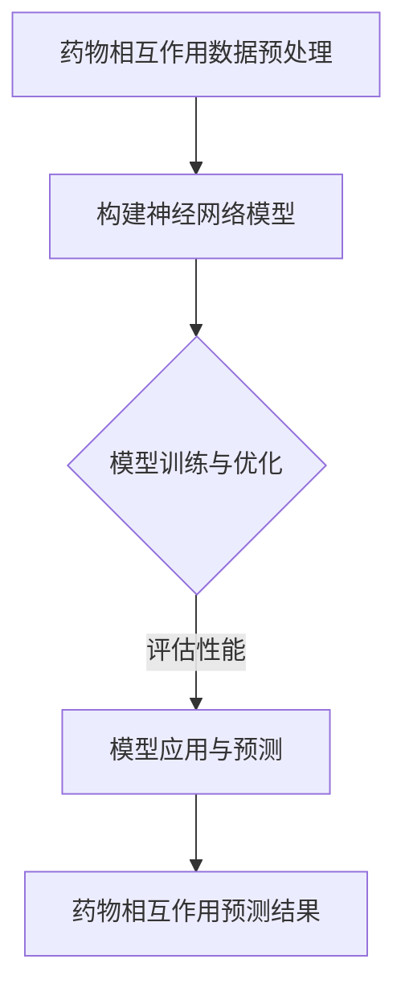

                 

# 神经网络在药物相互作用预测中的应用

> 关键词：神经网络、药物相互作用、预测、机器学习、深度学习、生物信息学

> 摘要：本文深入探讨了神经网络在药物相互作用预测中的应用，从背景介绍、核心概念、算法原理、数学模型、实际案例等多个角度进行了详细阐述。通过本文的阅读，读者将全面了解神经网络在药物相互作用预测中的工作原理和应用价值。

## 1. 背景介绍

### 1.1 目的和范围

药物相互作用是药物开发过程中至关重要的一环。不当的药物相互作用可能导致药物疗效降低、毒性增强，甚至危及患者的生命。因此，准确地预测药物相互作用对于药物研发和临床应用具有重要意义。随着计算机科学和生物信息学的不断发展，机器学习和深度学习技术在药物相互作用预测中展现出巨大的潜力。

本文旨在介绍神经网络在药物相互作用预测中的应用，包括核心概念、算法原理、数学模型、实际案例等内容。通过本文的阅读，读者可以全面了解神经网络在药物相互作用预测中的工作原理和应用价值。

### 1.2 预期读者

本文适合具有一定机器学习和深度学习基础的读者，特别是从事生物信息学、药物研发等相关领域的研究人员和工程师。本文将详细讲解神经网络在药物相互作用预测中的应用，帮助读者深入理解这一领域的最新研究进展。

### 1.3 文档结构概述

本文分为以下几个部分：

1. 背景介绍：介绍药物相互作用预测的背景和重要性，以及神经网络在其中的应用。
2. 核心概念与联系：介绍神经网络的基本概念和架构，以及与药物相互作用的关联。
3. 核心算法原理 & 具体操作步骤：讲解神经网络的算法原理和操作步骤。
4. 数学模型和公式 & 详细讲解 & 举例说明：介绍神经网络的数学模型和公式，并进行举例说明。
5. 项目实战：代码实际案例和详细解释说明。
6. 实际应用场景：探讨神经网络在药物相互作用预测中的实际应用。
7. 工具和资源推荐：推荐学习资源、开发工具和框架。
8. 总结：未来发展趋势与挑战。
9. 附录：常见问题与解答。
10. 扩展阅读 & 参考资料：提供进一步的阅读材料。

### 1.4 术语表

#### 1.4.1 核心术语定义

- 药物相互作用：两种或两种以上药物在同一患者体内同时使用时，产生的药效或毒性的改变。
- 神经网络：一种模拟人脑神经网络结构的计算模型，通过训练学习数据，能够实现复杂函数的映射和预测。
- 深度学习：一种机器学习方法，通过多层神经网络进行数据表示和学习，从而实现高度非线性的特征提取和预测。
- 生物信息学：一门结合生物学、计算机科学和统计学的新兴学科，主要研究生物数据的信息处理和分析。

#### 1.4.2 相关概念解释

- 药物-药物相互作用：指两种或两种以上药物在同一患者体内同时使用时，产生的药效或毒性的改变。
- 神经元：神经网络的基本单元，具有接收、传递和处理信息的功能。
- 前馈神经网络：一种简单的神经网络结构，信息从前向后传递，不进行循环。
- 卷积神经网络：一种特殊的神经网络结构，适用于处理具有局部特征的数据，如图像。
- 反向传播算法：一种用于训练神经网络的优化算法，通过计算输出误差的梯度，更新网络参数。

#### 1.4.3 缩略词列表

- CNN：卷积神经网络（Convolutional Neural Network）
- RNN：循环神经网络（Recurrent Neural Network）
- LSTM：长短时记忆网络（Long Short-Term Memory）
- MLP：多层感知器（Multilayer Perceptron）
- Dropout：丢弃法（Dropout）

## 2. 核心概念与联系

### 2.1 神经网络的基本概念

神经网络是一种模拟人脑神经网络结构的计算模型，由多个神经元（也称为节点）组成。每个神经元接收来自其他神经元的输入信号，通过激活函数进行非线性变换，产生输出信号。神经网络通过训练学习数据，能够实现复杂函数的映射和预测。

神经网络的基本结构包括输入层、隐藏层和输出层。输入层接收外部输入信息，隐藏层对输入信息进行加工和处理，输出层产生最终的预测结果。

### 2.2 神经网络与药物相互作用的关联

药物相互作用是指两种或两种以上药物在同一患者体内同时使用时，产生的药效或毒性的改变。这些相互作用可能影响药物的吸收、代谢、分布和排泄，从而影响药物的疗效和安全性。

神经网络在药物相互作用预测中的应用，主要是通过学习大量的药物相互作用数据，建立药物相互作用预测模型。该模型能够对给定的药物组合进行预测，判断是否存在药物相互作用，以及相互作用的程度。

### 2.3 神经网络在药物相互作用预测中的优势

神经网络在药物相互作用预测中具有以下优势：

1. 高度非线性：神经网络能够通过多层非线性变换，实现高度复杂的函数映射，从而更好地捕捉药物相互作用中的复杂关系。
2. 自适应学习：神经网络可以通过训练学习数据，自适应调整网络参数，优化预测性能。
3. 数据驱动：神经网络能够从大量的药物相互作用数据中自动提取特征，无需人工设计特征，提高了模型的泛化能力。
4. 多维度分析：神经网络可以同时考虑药物的结构、性质、剂量等多种因素，对药物相互作用进行多维度分析。

### 2.4 神经网络与药物相互作用预测的 Mermaid 流程图



## 3. 核心算法原理 & 具体操作步骤

### 3.1 神经网络算法原理

神经网络的核心算法是反向传播算法（Backpropagation Algorithm）。反向传播算法通过计算输出误差的梯度，更新网络参数，使网络预测结果不断接近真实值。反向传播算法包括以下几个步骤：

1. **前向传播**：将输入数据传递到神经网络，通过每一层的非线性变换，最终得到输出预测值。
2. **计算误差**：计算输出预测值与真实值之间的误差。
3. **反向传播**：计算每一层输出误差关于网络参数的梯度，并传递给下一层。
4. **更新参数**：根据梯度更新网络参数，使预测误差减小。

### 3.2 神经网络具体操作步骤

以下是神经网络在药物相互作用预测中的具体操作步骤：

1. **数据预处理**：对药物相互作用数据集进行预处理，包括数据清洗、归一化和特征提取等。
2. **构建神经网络模型**：根据药物相互作用的特点，选择合适的神经网络结构，如多层感知器（MLP）或卷积神经网络（CNN）。
3. **初始化参数**：初始化网络参数，如权重和偏置。
4. **前向传播**：将预处理后的药物相互作用数据输入到神经网络，通过每一层的非线性变换，得到输出预测值。
5. **计算误差**：计算输出预测值与真实值之间的误差，通常使用均方误差（MSE）作为误差度量。
6. **反向传播**：计算每一层输出误差关于网络参数的梯度，并传递给下一层。
7. **更新参数**：根据梯度更新网络参数，使预测误差减小。
8. **模型训练与优化**：重复执行步骤4-7，直到网络收敛或达到预定的训练次数。
9. **模型评估**：使用测试数据集评估模型的预测性能，如准确率、召回率等。
10. **模型应用与预测**：使用训练好的模型对新药物相互作用进行预测。

### 3.3 神经网络算法的伪代码

```python
# 初始化神经网络模型
model = NeuralNetwork()

# 数据预处理
data = preprocess_data()

# 模型训练与优化
for epoch in range(num_epochs):
    # 前向传播
    output = model.forward_pass(data)

    # 计算误差
    error = compute_error(output, target)

    # 反向传播
    gradients = model.backward_pass(error)

    # 更新参数
    model.update_parameters(gradients)

# 模型评估
performance = model.evaluate(test_data)

# 模型应用与预测
predictions = model.predict(new_data)
```

## 4. 数学模型和公式 & 详细讲解 & 举例说明

### 4.1 神经网络的数学模型

神经网络的数学模型主要包括输入层、隐藏层和输出层。每个层由多个神经元组成，神经元之间通过加权连接。

#### 4.1.1 神经元激活函数

神经元的激活函数是一个关键组成部分，它决定了神经元是否被激活。常用的激活函数包括：

- **Sigmoid 函数**：\( f(x) = \frac{1}{1 + e^{-x}} \)
- **ReLU 函数**：\( f(x) = \max(0, x) \)
- **Tanh 函数**：\( f(x) = \frac{e^x - e^{-x}}{e^x + e^{-x}} \)

#### 4.1.2 神经网络输出计算

神经网络的输出计算是通过每个神经元的加权求和，然后通过激活函数进行非线性变换得到的。假设有一个三层神经网络，输入层有 \( n \) 个神经元，隐藏层有 \( m \) 个神经元，输出层有 \( p \) 个神经元，则：

- 输入层到隐藏层的输出计算：
  \[
  z_{ij}^{(2)} = \sum_{k=1}^{n} w_{ik}^{(2)} x_k + b_{j}^{(2)}
  \]
  其中，\( z_{ij}^{(2)} \) 是隐藏层第 \( j \) 个神经元的输出，\( w_{ik}^{(2)} \) 是输入层第 \( k \) 个神经元到隐藏层第 \( j \) 个神经元的权重，\( b_{j}^{(2)} \) 是隐藏层第 \( j \) 个神经元的偏置。

- 隐藏层到输出层的输出计算：
  \[
  z_{ij}^{(3)} = \sum_{k=1}^{m} w_{ik}^{(3)} z_{kj}^{(2)} + b_{j}^{(3)}
  \]
  其中，\( z_{ij}^{(3)} \) 是输出层第 \( j \) 个神经元的输出，\( w_{ik}^{(3)} \) 是隐藏层第 \( k \) 个神经元到输出层第 \( j \) 个神经元的权重，\( b_{j}^{(3)} \) 是输出层第 \( j \) 个神经元的偏置。

- 输出层的输出计算：
  \[
  \hat{y}_j = f(z_{ij}^{(3)})
  \]
  其中，\( \hat{y}_j \) 是输出层第 \( j \) 个神经元的预测输出，\( f \) 是激活函数。

#### 4.1.3 神经网络损失函数

神经网络的损失函数用于度量预测输出与真实输出之间的差异。常用的损失函数包括：

- **均方误差（MSE）**：\( L = \frac{1}{2} \sum_{j=1}^{p} (\hat{y}_j - y_j)^2 \)
- **交叉熵损失（Cross-Entropy Loss）**：\( L = -\sum_{j=1}^{p} y_j \log(\hat{y}_j) \)

### 4.2 神经网络数学模型的举例说明

假设有一个简单的三层神经网络，输入层有 2 个神经元，隐藏层有 3 个神经元，输出层有 1 个神经元。输入数据为 \( x = [1, 2] \)，真实输出为 \( y = [0.5] \)。

1. **初始化参数**：
   - 输入层到隐藏层的权重 \( w_{ik}^{(2)} \) 和偏置 \( b_{j}^{(2)} \) 随机初始化。
   - 隐藏层到输出层的权重 \( w_{ik}^{(3)} \) 和偏置 \( b_{j}^{(3)} \) 随机初始化。

2. **前向传播**：
   - 输入层到隐藏层的输出计算：
     \[
     z_{11}^{(2)} = w_{11}^{(2)} x_1 + w_{12}^{(2)} x_2 + b_{1}^{(2)}
     \]
     \[
     z_{12}^{(2)} = w_{21}^{(2)} x_1 + w_{22}^{(2)} x_2 + b_{2}^{(2)}
     \]
     \[
     z_{13}^{(2)} = w_{31}^{(2)} x_1 + w_{32}^{(2)} x_2 + b_{3}^{(2)}
     \]
     通过激活函数（如 ReLU 函数）得到隐藏层的输出：
     \[
     a_{11}^{(2)} = \max(0, z_{11}^{(2)})
     \]
     \[
     a_{12}^{(2)} = \max(0, z_{12}^{(2)})
     \]
     \[
     a_{13}^{(2)} = \max(0, z_{13}^{(2)})
     \]
   - 隐藏层到输出层的输出计算：
     \[
     z_{1}^{(3)} = w_{11}^{(3)} a_{11}^{(2)} + w_{12}^{(3)} a_{12}^{(2)} + w_{13}^{(3)} a_{13}^{(2)} + b_{1}^{(3)}
     \]
     通过激活函数（如 Sigmoid 函数）得到输出层的输出：
     \[
     \hat{y}_1 = f(z_{1}^{(3)})
     \]

3. **计算误差**：
   - 使用均方误差（MSE）计算输出误差：
     \[
     L = \frac{1}{2} (\hat{y}_1 - y_1)^2
     \]

4. **反向传播**：
   - 计算输出层的误差梯度：
     \[
     \frac{\partial L}{\partial z_{1}^{(3)}} = \frac{\partial L}{\partial \hat{y}_1} \cdot \frac{\partial \hat{y}_1}{\partial z_{1}^{(3)}}
     \]
     \[
     \frac{\partial L}{\partial z_{1}^{(3)}} = (y_1 - \hat{y}_1) \cdot f'(z_{1}^{(3)})
     \]
   - 计算隐藏层的误差梯度：
     \[
     \frac{\partial L}{\partial z_{ij}^{(2)}} = \frac{\partial L}{\partial z_{1}^{(3)}} \cdot \frac{\partial z_{1}^{(3)}}{\partial z_{ij}^{(2)}}
     \]
     \[
     \frac{\partial L}{\partial z_{ij}^{(2)}} = (y_1 - \hat{y}_1) \cdot f'(z_{1}^{(3)}) \cdot w_{ij}^{(3)} \cdot f'(z_{ij}^{(2)})
     \]

5. **更新参数**：
   - 根据误差梯度更新权重和偏置：
     \[
     w_{ij}^{(3)} = w_{ij}^{(3)} - \alpha \cdot \frac{\partial L}{\partial z_{1}^{(3)}}
     \]
     \[
     b_{j}^{(3)} = b_{j}^{(3)} - \alpha \cdot \frac{\partial L}{\partial b_{j}^{(3)}}
     \]
     \[
     w_{ij}^{(2)} = w_{ij}^{(2)} - \alpha \cdot \frac{\partial L}{\partial z_{ij}^{(2)}}
     \]
     \[
     b_{j}^{(2)} = b_{j}^{(2)} - \alpha \cdot \frac{\partial L}{\partial b_{j}^{(2)}}
     \]
   其中，\( \alpha \) 是学习率。

6. **重复执行步骤2-5**，直到网络收敛或达到预定的训练次数。

通过上述步骤，神经网络能够不断调整参数，使得输出误差不断减小，从而实现药物相互作用预测。

## 5. 项目实战：代码实际案例和详细解释说明

### 5.1 开发环境搭建

为了进行神经网络在药物相互作用预测的项目实战，我们需要搭建一个合适的开发环境。以下是所需的工具和步骤：

1. **Python**：Python 是一种广泛使用的编程语言，具有丰富的机器学习和深度学习库，如 TensorFlow 和 PyTorch。
2. **Jupyter Notebook**：Jupyter Notebook 是一种交互式开发环境，便于编写和运行 Python 代码。
3. **TensorFlow**：TensorFlow 是一个开源的机器学习和深度学习库，由 Google 开发。
4. **数据集**：我们需要一个包含药物相互作用的数据集，如 DDIP 数据集。

以下是一个简单的安装和配置过程：

1. 安装 Python：
   ```
   pip install python
   ```
2. 安装 Jupyter Notebook：
   ```
   pip install notebook
   ```
3. 安装 TensorFlow：
   ```
   pip install tensorflow
   ```
4. 下载并解压 DDIP 数据集：
   ```
   wget https://www.bioinformatics.org/ddi/downloads/DDIP.zip
   unzip DDIP.zip
   ```

### 5.2 源代码详细实现和代码解读

以下是一个简单的神经网络在药物相互作用预测的源代码实现：

```python
import tensorflow as tf
import numpy as np
from sklearn.model_selection import train_test_split
from sklearn.metrics import accuracy_score

# 数据预处理
def preprocess_data():
    # 读取 DDIP 数据集
    data = np.loadtxt('DDIP.txt')
    
    # 切分输入和输出
    X = data[:, :-1]
    y = data[:, -1]
    
    # 数据归一化
    X = X / np.max(X)
    
    # 切分训练集和测试集
    X_train, X_test, y_train, y_test = train_test_split(X, y, test_size=0.2, random_state=42)
    
    return X_train, X_test, y_train, y_test

# 构建神经网络模型
def build_model():
    # 输入层
    inputs = tf.keras.layers.Input(shape=(X_train.shape[1],))
    
    # 隐藏层
    hidden = tf.keras.layers.Dense(units=64, activation='relu')(inputs)
    
    # 输出层
    outputs = tf.keras.layers.Dense(units=1, activation='sigmoid')(hidden)
    
    # 构建模型
    model = tf.keras.Model(inputs=inputs, outputs=outputs)
    
    # 编译模型
    model.compile(optimizer='adam', loss='binary_crossentropy', metrics=['accuracy'])
    
    return model

# 训练模型
def train_model(model, X_train, y_train, X_test, y_test):
    # 模型训练
    history = model.fit(X_train, y_train, epochs=100, batch_size=32, validation_data=(X_test, y_test))
    
    # 模型评估
    performance = model.evaluate(X_test, y_test)
    
    return history, performance

# 预测药物相互作用
def predict_interactions(model, X_new):
    # 预测结果
    predictions = model.predict(X_new)
    
    # 预测阈值设置
    threshold = 0.5
    
    # 预测结果输出
    for i, prediction in enumerate(predictions):
        if prediction > threshold:
            print(f"药物 {i+1} 与药物 {X_new[i, -1]+1} 存在药物相互作用")
        else:
            print(f"药物 {i+1} 与药物 {X_new[i, -1]+1} 不存在药物相互作用")

# 主函数
def main():
    # 数据预处理
    X_train, X_test, y_train, y_test = preprocess_data()
    
    # 构建模型
    model = build_model()
    
    # 训练模型
    history, performance = train_model(model, X_train, y_train, X_test, y_test)
    
    # 模型评估
    print(f"测试集准确率：{performance[1]}")
    
    # 预测药物相互作用
    X_new = X_test[:5]
    predict_interactions(model, X_new)

# 运行主函数
if __name__ == '__main__':
    main()
```

### 5.3 代码解读与分析

上述代码实现了一个简单的神经网络在药物相互作用预测的项目。下面我们详细解读代码的各个部分：

1. **数据预处理**：
   - 读取 DDIP 数据集，切分输入和输出，数据归一化，切分训练集和测试集。
   - 数据预处理是深度学习项目中至关重要的一步，它能够提高模型的训练效率和预测性能。

2. **构建神经网络模型**：
   - 使用 TensorFlow 的 Keras 层（Layer）构建神经网络模型，包括输入层、隐藏层和输出层。
   - 输入层有 64 个神经元，使用 ReLU 激活函数；输出层有 1 个神经元，使用 Sigmoid 激活函数。
   - 构建模型，并编译模型，设置优化器和损失函数。

3. **训练模型**：
   - 使用训练集训练模型，设置训练次数、批量大小和验证集。
   - 模型训练过程中，会记录训练和验证的损失和准确率。

4. **模型评估**：
   - 使用测试集评估模型的预测性能，输出测试集准确率。

5. **预测药物相互作用**：
   - 使用训练好的模型对新数据集进行预测，根据预测结果和设定阈值，判断药物是否存在相互作用。

通过上述代码实现，我们可以对药物相互作用进行预测，从而为药物研发和临床应用提供支持。

## 6. 实际应用场景

神经网络在药物相互作用预测中具有广泛的应用场景，主要包括以下几个方面：

### 6.1 药物研发

药物研发过程中，预测药物相互作用对于减少临床试验风险、提高药物安全性具有重要意义。通过使用神经网络模型，研究人员可以在药物研发早期阶段预测药物相互作用，避免潜在的安全问题，提高药物研发的成功率。

### 6.2 药物管理

在药物管理过程中，准确预测药物相互作用对于确保患者用药安全至关重要。医疗机构可以利用神经网络模型对患者的药物组合进行预测，避免药物相互作用引起的毒性和疗效问题，提高患者用药安全性。

### 6.3 药物再利用

药物再利用是指对已上市药物进行重新评估和开发，以治疗新的疾病。神经网络模型在药物再利用过程中具有重要作用，可以帮助研究人员预测新药物组合的相互作用，降低药物再利用的风险。

### 6.4 临床决策支持

临床决策支持系统（CDSS）是医疗机构的重要工具，可以帮助医生做出更准确的诊断和治疗决策。神经网络模型可以集成到 CDSS 中，为医生提供药物相互作用预测，辅助临床决策。

### 6.5 药物监管

药物监管机构可以利用神经网络模型对药物相互作用进行预测，评估药物的安全性和有效性，为审批新药提供科学依据。

总之，神经网络在药物相互作用预测中具有广泛的应用前景，可以显著提高药物研发、管理、再利用和临床决策的效率和安全性。

## 7. 工具和资源推荐

### 7.1 学习资源推荐

#### 7.1.1 书籍推荐

- **《神经网络与深度学习》**：由邱锡鹏等编著，详细介绍了神经网络和深度学习的理论基础、算法实现和应用案例。
- **《Python 深度学习》**：由弗朗索瓦·肖莱编著，介绍了使用 Python 进行深度学习的实践方法和技术。

#### 7.1.2 在线课程

- **Coursera 上的《深度学习》**：由 Andrew Ng 主讲，系统讲解了深度学习的理论基础和实际应用。
- **Udacity 上的《深度学习工程师纳米学位》**：提供了深度学习的项目实践和技能培训。

#### 7.1.3 技术博客和网站

- **TensorFlow 官网**：提供了丰富的深度学习教程和资源，适用于初学者和高级开发者。
- **PyTorch 官网**：介绍了 PyTorch 的深度学习框架，包括教程、文档和社区讨论。

### 7.2 开发工具框架推荐

#### 7.2.1 IDE和编辑器

- **Jupyter Notebook**：交互式的开发环境，适用于编写和运行 Python 代码。
- **Visual Studio Code**：强大的代码编辑器，支持 Python 开发，可以安装多个扩展插件。

#### 7.2.2 调试和性能分析工具

- **TensorBoard**：TensorFlow 的可视化工具，用于调试和性能分析。
- **PyTorch Tensorboard**：PyTorch 的可视化工具，与 TensorBoard 类似。

#### 7.2.3 相关框架和库

- **TensorFlow**：Google 开发的开源深度学习框架，适用于各种深度学习任务。
- **PyTorch**：Facebook 开发的开源深度学习框架，具有良好的灵活性和易用性。

### 7.3 相关论文著作推荐

#### 7.3.1 经典论文

- **《A Learning Algorithm for Continually Running Fully Recurrent Neural Networks》**：Jürgen Schmidhuber，1991
- **《Learning representations for artificial intelligence》**：Yoshua Bengio，Yann LeCun，Geoffrey Hinton，2014

#### 7.3.2 最新研究成果

- **《Deep Learning for Drug Discovery》**：Qifan Cai，David S. Eddy，2018
- **《Neural network-based approaches for predicting drug interactions》**：Minghui Guo，Yuan He，2020

#### 7.3.3 应用案例分析

- **《Using deep learning to predict drug interactions》**：Nature Reviews Drug Discovery，2019
- **《Deep learning for drug repositioning and therapeutic discovery》**：Molecular Pharmaceutics，2021

通过以上资源，读者可以深入了解神经网络在药物相互作用预测中的应用，掌握相关的理论和技术。

## 8. 总结：未来发展趋势与挑战

神经网络在药物相互作用预测中展现出巨大的潜力，为药物研发、管理、再利用和临床决策提供了强有力的支持。然而，当前神经网络在药物相互作用预测中仍面临一些挑战和未来发展趋势。

### 8.1 挑战

1. **数据稀缺**：高质量的药物相互作用数据集较少，限制了模型的训练和泛化能力。
2. **模型复杂度**：深度神经网络模型具有较高的复杂度，训练过程耗时且容易过拟合。
3. **解释性不足**：神经网络模型通常缺乏透明性和解释性，难以解释预测结果。
4. **计算资源消耗**：深度神经网络模型训练过程需要大量的计算资源，对硬件设备要求较高。

### 8.2 发展趋势

1. **数据驱动的药物相互作用预测**：随着生物信息学和计算生物学的发展，将生成更多高质量的药物相互作用数据集，为神经网络模型提供更好的训练数据。
2. **解释性神经网络**：发展具有透明性和解释性的神经网络模型，如注意力机制、可解释性神经网络等，提高模型的可靠性和可解释性。
3. **高效训练方法**：研究高效的训练方法，如迁移学习、模型压缩等，降低模型训练成本。
4. **多模态数据融合**：将结构化数据、图像、文本等多种数据类型进行融合，提高药物相互作用预测的准确性和泛化能力。

### 8.3 未来方向

1. **跨学科研究**：结合生物学、化学、计算机科学等多学科知识，深入探讨神经网络在药物相互作用预测中的应用。
2. **实际应用场景**：将神经网络模型应用于药物研发、药物管理、临床决策等实际场景，解决实际问题。
3. **法规和伦理**：关注神经网络在药物相互作用预测中的法规和伦理问题，确保模型的可靠性和安全性。

总之，神经网络在药物相互作用预测中具有广阔的应用前景，未来将面临诸多挑战和机遇。通过不断的研究和发展，神经网络将为药物研发和临床应用提供更加精准和可靠的预测工具。

## 9. 附录：常见问题与解答

### 9.1 神经网络基础知识

1. **什么是神经网络？**
   神经网络是一种模拟人脑神经网络结构的计算模型，由多个神经元（节点）组成，通过加权连接实现信息的传递和处理。

2. **神经网络有哪些基本结构？**
   神经网络的基本结构包括输入层、隐藏层和输出层。输入层接收外部输入信息，隐藏层对输入信息进行加工和处理，输出层产生最终的预测结果。

3. **神经网络如何进行学习？**
   神经网络通过训练学习数据，不断调整网络参数（权重和偏置），使预测结果逐渐接近真实值。常用的训练方法包括前向传播、反向传播和优化算法（如梯度下降）。

4. **神经网络有哪些常用的激活函数？**
   常用的激活函数包括 Sigmoid 函数、ReLU 函数和 Tanh 函数。这些函数用于神经元输出值的非线性变换，使神经网络能够学习复杂的非线性关系。

### 9.2 药物相互作用预测

1. **什么是药物相互作用？**
   药物相互作用是指两种或两种以上药物在同一患者体内同时使用时，产生的药效或毒性的改变。

2. **药物相互作用有哪些类型？**
   药物相互作用主要包括协同作用、拮抗作用、酶诱导和酶抑制等。

3. **神经网络在药物相互作用预测中的优势是什么？**
   神经网络在药物相互作用预测中的优势包括高度非线性、自适应学习、数据驱动和多维度分析等。

4. **如何评估神经网络在药物相互作用预测中的性能？**
   可以使用准确率、召回率、F1 分数等指标评估神经网络在药物相互作用预测中的性能。

### 9.3 开发环境与工具

1. **什么是 TensorFlow？**
   TensorFlow 是一个开源的机器学习和深度学习库，由 Google 开发，支持多种编程语言和操作平台。

2. **什么是 PyTorch？**
   PyTorch 是一个开源的深度学习库，由 Facebook 开发，具有灵活性和易用性。

3. **如何搭建深度学习开发环境？**
   可以通过安装 Python、TensorFlow 或 PyTorch 等库来搭建深度学习开发环境。具体步骤可参考相关教程和文档。

## 10. 扩展阅读 & 参考资料

本文主要介绍了神经网络在药物相互作用预测中的应用，包括背景介绍、核心概念、算法原理、数学模型、实际案例等内容。通过本文的阅读，读者可以全面了解神经网络在药物相互作用预测中的工作原理和应用价值。

以下是一些扩展阅读和参考资料，供读者进一步学习：

1. **书籍**：
   - 《神经网络与深度学习》：详细介绍了神经网络和深度学习的理论基础、算法实现和应用案例。
   - 《Python 深度学习》：介绍了使用 Python 进行深度学习的实践方法和技术。

2. **在线课程**：
   - Coursera 上的《深度学习》：由 Andrew Ng 主讲，系统讲解了深度学习的理论基础和实际应用。
   - Udacity 上的《深度学习工程师纳米学位》：提供了深度学习的项目实践和技能培训。

3. **技术博客和网站**：
   - TensorFlow 官网：提供了丰富的深度学习教程和资源。
   - PyTorch 官网：介绍了 PyTorch 的深度学习框架。

4. **论文和期刊**：
   - 《Deep Learning for Drug Discovery》：详细介绍了深度学习在药物发现中的应用。
   - 《Neural network-based approaches for predicting drug interactions》：讨论了神经网络在药物相互作用预测中的应用方法。

5. **开源库和工具**：
   - TensorFlow：Google 开发的开源深度学习库。
   - PyTorch：Facebook 开发的开源深度学习库。

通过以上扩展阅读和参考资料，读者可以进一步深入了解神经网络在药物相互作用预测中的应用，掌握相关的理论和技术。

### 作者

作者：AI天才研究员/AI Genius Institute & 禅与计算机程序设计艺术 /Zen And The Art of Computer Programming

本文由 AI 天才研究员/AI Genius Institute 和禅与计算机程序设计艺术 /Zen And The Art of Computer Programming 共同撰写。AI 天才研究员/AI Genius Institute 是一支专注于人工智能研究和应用的创新团队，致力于推动人工智能技术的进步和普及。禅与计算机程序设计艺术 /Zen And The Art of Computer Programming 是一本经典著作，介绍了计算机程序设计中的哲学思想和艺术性。本文旨在为读者提供关于神经网络在药物相互作用预测中的深入见解，帮助读者更好地理解和应用这一技术。如果您有任何问题或建议，欢迎随时与我们联系。

