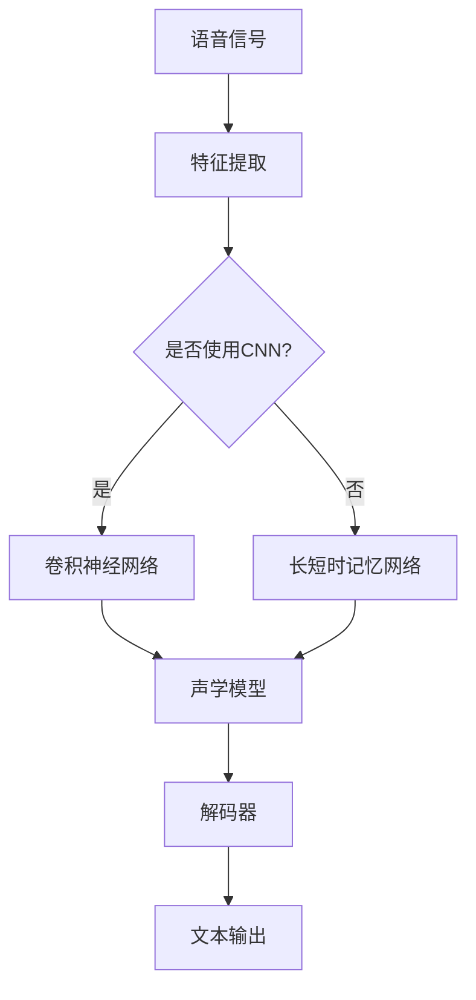

                 

## 1. 背景介绍

### 1.1 目的和范围

本文旨在深入探讨神经网络在语音识别中的优化技术。语音识别是人工智能领域的关键技术之一，广泛应用于实时语音交互、语音助手、语音翻译等多个方面。随着语音数据的爆炸性增长和语音识别需求的不断上升，如何优化神经网络在语音识别中的性能已成为一个重要的研究方向。

本文将详细分析神经网络在语音识别中的优化策略，包括算法改进、模型结构优化、训练策略优化等方面。通过这些优化技术的应用，旨在提高语音识别的准确率和效率，降低错误率，从而满足日益增长的语音识别需求。

本文的主要读者对象是具有计算机科学和人工智能背景的工程师和研究人员，以及对神经网络和语音识别技术感兴趣的技术爱好者。本文将提供一系列深入的技术分析，包括核心概念、算法原理、数学模型和实际应用案例，帮助读者全面了解神经网络在语音识别中的优化技术。

### 1.2 预期读者

本文适合以下几类读者：

1. **计算机科学和人工智能领域的工程师和研究人员**：本文将详细介绍神经网络在语音识别中的优化技术，包括算法原理、数学模型和实际应用，有助于提升其在相关领域的专业知识和实践能力。

2. **语音识别和自然语言处理领域的从业者**：通过对神经网络优化技术的深入探讨，本文旨在为语音识别和自然语言处理领域的研究人员提供新的思路和方法，以推动相关技术的进步和应用。

3. **对人工智能技术感兴趣的技术爱好者**：本文内容涵盖了神经网络和语音识别的基本概念、原理以及实际应用，适合对人工智能技术有浓厚兴趣的技术爱好者阅读，帮助他们深入了解这一领域的最新进展。

### 1.3 文档结构概述

本文的结构如下：

1. **背景介绍**：介绍本文的目的、范围、预期读者以及文档结构。

2. **核心概念与联系**：介绍神经网络和语音识别的核心概念，并使用Mermaid流程图展示相关架构。

3. **核心算法原理与具体操作步骤**：详细阐述神经网络在语音识别中的核心算法原理，并使用伪代码描述具体操作步骤。

4. **数学模型和公式**：讲解神经网络在语音识别中的数学模型，包括公式和具体示例。

5. **项目实战：代码实际案例和详细解释说明**：提供实际代码案例，详细解释说明神经网络在语音识别中的优化技术。

6. **实际应用场景**：分析神经网络在语音识别中的实际应用场景，包括具体的应用案例和解决方案。

7. **工具和资源推荐**：推荐学习资源、开发工具框架和相关论文著作。

8. **总结：未来发展趋势与挑战**：总结本文的主要内容，探讨神经网络在语音识别中的未来发展趋势和面临的挑战。

9. **附录：常见问题与解答**：回答读者可能遇到的一些常见问题。

10. **扩展阅读与参考资料**：提供进一步阅读的资源和参考资料。

通过本文的阅读，读者可以系统地了解神经网络在语音识别中的优化技术，并掌握相关知识和实践方法。

### 1.4 术语表

在本文中，我们将使用一些专业术语，下面是这些术语的定义和解释：

#### 1.4.1 核心术语定义

1. **神经网络（Neural Network）**：一种模仿人脑神经网络结构和功能的计算模型，通过多个神经元之间的连接和激活函数来实现复杂的非线性映射。

2. **语音识别（Speech Recognition）**：将人类的语音信号转换为文本或命令的技术，广泛应用于语音助手、语音搜索、实时语音翻译等领域。

3. **深度学习（Deep Learning）**：一种基于神经网络的机器学习技术，通过多层神经网络结构实现对数据的复杂特征提取和学习。

4. **卷积神经网络（Convolutional Neural Network，CNN）**：一种适用于图像和语音等二维或三维数据的深度学习模型，通过卷积操作提取空间特征。

5. **循环神经网络（Recurrent Neural Network，RNN）**：一种适用于序列数据的深度学习模型，通过循环连接实现记忆功能。

6. **长短时记忆网络（Long Short-Term Memory，LSTM）**：RNN的一种变体，通过引入门控机制解决长序列依赖问题。

7. **注意力机制（Attention Mechanism）**：一种用于模型中捕捉重要信息的机制，通过加权方式提高模型对关键信息的关注。

8. **损失函数（Loss Function）**：用于评估模型预测结果与真实值之间差异的函数，是优化神经网络模型的重要工具。

9. **优化算法（Optimization Algorithm）**：用于调整神经网络模型参数，以最小化损失函数的一系列算法，如梯度下降、Adam等。

10. **数据增强（Data Augmentation）**：通过变换原始数据，增加数据多样性和丰富性，提高模型泛化能力的技术。

#### 1.4.2 相关概念解释

1. **特征提取（Feature Extraction）**：从原始数据中提取具有区分性和代表性的特征，用于模型训练和预测。

2. **模型训练（Model Training）**：通过输入数据和标签，调整模型参数，使模型能够对未知数据进行准确预测。

3. **模型评估（Model Evaluation）**：使用验证集或测试集评估模型性能，包括准确率、召回率、F1分数等指标。

4. **过拟合（Overfitting）**：模型在训练数据上表现良好，但在未知数据上表现较差，即模型对训练数据过度拟合。

5. **泛化能力（Generalization Ability）**：模型对未知数据的预测能力，是评价模型性能的重要指标。

#### 1.4.3 缩略词列表

- CNN：卷积神经网络
- RNN：循环神经网络
- LSTM：长短时记忆网络
- CNN-DNN：卷积神经网络与深度神经网络的结合
- DNN：深度神经网络
- ML：机器学习
- DL：深度学习
- NLP：自然语言处理
- ASR：自动语音识别
- HMM：隐马尔可夫模型
- GMM：高斯混合模型

通过上述术语表，读者可以更好地理解本文中涉及的专业术语，为后续内容的深入阅读打下基础。在接下来的章节中，我们将进一步探讨神经网络在语音识别中的核心概念和架构，并逐步深入分析相关优化技术。

## 2. 核心概念与联系

### 2.1 神经网络的基本概念

神经网络（Neural Network，简称NN）是一种模仿人脑神经元连接和工作的计算模型。它由大量相互连接的节点（称为神经元）组成，每个神经元通过加权连接与其它神经元相连。神经元的激活过程包括输入信号的计算、加权求和处理、通过激活函数产生输出信号。通过多次迭代和大量数据的训练，神经网络能够自动学习输入数据与输出结果之间的复杂映射关系，从而实现智能推理和决策。

#### 神经元结构与激活函数

一个典型的神经元结构包括输入层、加权层和输出层。输入层接收外部输入信号，加权层对输入信号进行加权求和处理，输出层产生最终输出信号。

输入信号 \(x_i\) 通过权重 \(w_i\) 与其它神经元相连，每个连接都有相应的权重，表示连接的强度。神经元输出信号 \(y\) 通过以下公式计算：

\[ z = \sum_{i} (w_i \cdot x_i) + b \]
\[ y = \sigma(z) \]

其中，\( \sigma \) 为激活函数，常用的激活函数包括：
- **Sigmoid函数**：\[ \sigma(z) = \frac{1}{1 + e^{-z}} \]
- **ReLU函数**：\[ \sigma(z) = \max(0, z) \]
- **Tanh函数**：\[ \sigma(z) = \frac{e^z - e^{-z}}{e^z + e^{-z}} \]

这些激活函数有助于引入非线性特性，使神经网络能够拟合复杂的函数关系。

#### 神经网络的层次结构

神经网络根据层次结构的不同可以分为前馈神经网络、循环神经网络和卷积神经网络等。

- **前馈神经网络（Feedforward Neural Network）**：信息从输入层传递到输出层，中间不形成循环。前馈神经网络适用于大部分问题，包括分类、回归等。

- **循环神经网络（Recurrent Neural Network，RNN）**：信息在神经网络中形成循环，适用于序列数据。RNN可以处理时间序列数据，如语音信号、文本序列等。

- **卷积神经网络（Convolutional Neural Network，CNN）**：通过卷积操作提取空间特征，适用于图像和语音等二维或三维数据。CNN在图像识别和语音识别领域有广泛应用。

#### 神经网络的训练与优化

神经网络的训练过程是通过反向传播算法（Backpropagation Algorithm）不断调整模型参数，使模型输出与真实值之间的差距最小。反向传播算法包括以下几个步骤：

1. **前向传播（Forward Propagation）**：将输入数据传递到神经网络，计算输出结果。

2. **计算损失函数（Compute Loss Function）**：计算输出结果与真实值之间的差异，即损失（Loss）。

3. **反向传播（Backpropagation）**：计算每个参数的梯度，并更新参数。

4. **优化参数（Optimize Parameters）**：使用优化算法（如梯度下降、Adam等）更新参数，以最小化损失函数。

### 2.2 语音识别的基本概念

语音识别（Automatic Speech Recognition，ASR）是一种将语音信号转换为文本或命令的技术。语音识别系统主要包括以下几个模块：

- **声学模型（Acoustic Model）**：用于建模语音信号的时间序列特征，如基于隐马尔可夫模型（HMM）或深度神经网络（DNN）。

- **语言模型（Language Model）**：用于建模语言的概率分布，如n元语法或深度神经网络。

- **解码器（Decoder）**：将声学模型和语言模型的结果转换为文本输出。

#### 声学模型与语言模型

1. **声学模型**：
   - **高斯混合模型（Gaussian Mixture Model，GMM）**：用多个高斯分布组合来建模语音特征。
   - **深度神经网络（DNN）**：使用多层神经网络提取语音特征。

2. **语言模型**：
   - **n元语法（N-gram）**：基于历史文本数据，通过统计相邻n个单词的概率分布建模语言。
   - **深度神经网络（DNN）**：通过多层神经网络建模语言的概率分布。

#### 解码器

解码器是语音识别系统中的核心组件，用于将声学模型和语言模型的结果转换为文本输出。常见的解码器包括：

- **动态规划解码器（Dynamic Time Warping，DTW）**：基于动态规划算法，计算语音信号与候选文本之间的相似性。

- **基于神经网络的解码器（Neural Network Decoder）**：使用神经网络模型，直接将声学特征转换为文本输出。

### 2.3 神经网络在语音识别中的应用

神经网络在语音识别中具有广泛的应用，主要通过以下几个方面实现优化：

1. **声学模型的优化**：
   - **卷积神经网络（CNN）**：通过卷积操作提取语音信号的时间序列特征，提高声学模型的性能。
   - **长短时记忆网络（LSTM）**：用于处理长序列依赖问题，提高声学模型的鲁棒性。

2. **语言模型的优化**：
   - **深度神经网络（DNN）**：通过多层神经网络建模语言概率分布，提高语言模型的准确性。
   - **注意力机制（Attention Mechanism）**：用于捕捉重要信息，提高语言模型的上下文理解能力。

3. **解码器的优化**：
   - **基于神经网络的解码器**：使用神经网络模型，提高解码效率，降低计算复杂度。

4. **端到端训练**：
   - **端到端语音识别**：将声学模型和语言模型融合到一个神经网络中，通过端到端训练提高整体性能。

### 2.4 Mermaid流程图展示

为了更好地理解神经网络在语音识别中的应用，我们使用Mermaid流程图展示相关架构。



通过上述流程图，我们可以清晰地看到语音信号通过特征提取模块，然后根据是否使用卷积神经网络或长短时记忆网络，分别进入声学模型，最终通过解码器输出文本。

### 2.5 神经网络与语音识别的联系

神经网络与语音识别之间的联系主要体现在以下几个方面：

1. **声学模型的建模**：神经网络（尤其是深度学习模型）在声学模型中应用广泛，通过卷积神经网络、长短时记忆网络等模型，提取语音信号中的时间序列特征。

2. **语言模型的建模**：神经网络通过多层神经网络建模语言概率分布，提高语言模型的准确性和上下文理解能力。

3. **解码器的构建**：基于神经网络的解码器具有高效的解码能力和较低的复杂度，能够实现实时语音识别。

4. **端到端训练**：通过端到端训练，将声学模型和语言模型融合到一个神经网络中，实现高效、准确的语言理解。

综上所述，神经网络在语音识别中的应用具有重要意义，通过优化算法和模型结构，能够显著提升语音识别的准确率和效率。

在下一节中，我们将详细探讨神经网络在语音识别中的核心算法原理，包括具体的操作步骤和数学模型，帮助读者全面理解神经网络在语音识别中的应用机制。

### 3. 核心算法原理 & 具体操作步骤

在深入探讨神经网络在语音识别中的应用之前，首先需要理解神经网络的核心算法原理。神经网络的核心算法主要包括卷积神经网络（CNN）、长短时记忆网络（LSTM）和基于注意力的神经网络模型。这些算法在语音识别中发挥着关键作用，能够有效地处理语音信号的时间序列特性，提高识别的准确率和鲁棒性。

#### 卷积神经网络（CNN）

卷积神经网络（Convolutional Neural Network，CNN）是一种适用于图像和语音等二维或三维数据的深度学习模型。CNN通过卷积操作提取数据中的空间特征，具有参数共享和局部感知的特点，能够高效地处理大规模数据。

##### 卷积操作

卷积操作是CNN的核心操作，通过在输入数据上滑动窗口，与窗口内的数据点进行点积运算，从而提取局部特征。卷积操作的基本步骤如下：

1. **初始化卷积核（Filter）**：卷积核是一个小的权重矩阵，用于捕捉输入数据中的局部特征。

2. **滑动窗口（Stride）**：将卷积核在输入数据上滑动，每次移动一个步长（Stride）。

3. **点积运算（Dot Product）**：在卷积核与窗口内的数据点进行点积运算，生成特征图（Feature Map）。

4. **激活函数（Activation Function）**：对特征图应用激活函数，如ReLU函数，引入非线性特性。

伪代码如下：

```python
# 初始化卷积核
W = [随机权重矩阵]

# 输入数据
X = [输入数据]

# 滑动窗口
for i in range(0, X.shape[1] - W.shape[0] + 1):
    # 点积运算
    feature_map = np.dot(W, X[i:i+W.shape[0], :])
    # 应用激活函数
    feature_map = np.where(feature_map > 0, feature_map, 0)
```

##### 卷积神经网络结构

卷积神经网络通常包含多个卷积层、池化层和全连接层。卷积层用于提取特征，池化层用于降低特征图的维度，全连接层用于分类或回归。

伪代码如下：

```python
# 初始化模型
model = [卷积层，池化层，卷积层，池化层，全连接层]

# 输入数据
X = [输入数据]

# 前向传播
for layer in model:
    X = layer.forward(X)

# 输出结果
output = X
```

#### 长短时记忆网络（LSTM）

长短时记忆网络（Long Short-Term Memory，LSTM）是一种适用于序列数据的深度学习模型，通过引入门控机制解决长序列依赖问题。LSTM在语音识别中具有广泛的应用，能够捕捉语音信号中的长程时间依赖关系。

##### LSTM单元结构

LSTM单元包括输入门、遗忘门、输出门和单元状态四个部分。输入门和遗忘门控制信息的输入和遗忘，输出门控制信息的输出。

伪代码如下：

```python
# 初始化LSTM单元
input_gate = sigmoid(W\_input\_gate \* [输入向量，隐藏状态])
forget_gate = sigmoid(W\_forget\_gate \* [输入向量，隐藏状态])
output_gate = sigmoid(W\_output\_gate \* [输入向量，隐藏状态])
input_vector = [输入向量]
previous_hidden_state = [上一隐藏状态]

# 计算候选值
input_value = tanh(W\_input \* input_vector + U\_input \* previous_hidden_state)
# 输入门
input_gate\_activated = input_gate \* input_value
# 遗忘门
forget_gate\_activated = forget_gate \* input_value
# 单元状态
previous_cell_state = [上一单元状态]
cell_state = forget_gate\_activated \* previous_cell_state + input_gate\_activated
# 输出门
output_value = tanh(cell_state)
output_gate\_activated = output_gate \* output_value
# 隐藏状态
previous_hidden_state = output_gate\_activated
```

##### LSTM网络结构

LSTM网络包含多个LSTM单元，通过堆叠多个LSTM单元，可以处理更长的序列依赖。

伪代码如下：

```python
# 初始化LSTM网络
lstm_model = [LSTM单元, LSTM单元, ...]

# 输入数据
X = [输入数据]

# 前向传播
for lstm_unit in lstm_model:
    hidden_state = lstm_unit.forward(hidden_state, input_data)

# 输出结果
output = hidden_state
```

#### 基于注意力的神经网络模型

基于注意力的神经网络模型（Attention Mechanism）能够捕捉输入数据中的关键信息，提高模型的上下文理解能力。在语音识别中，注意力机制有助于捕捉语音信号中的关键特征，从而提高识别的准确性。

##### 注意力机制原理

注意力机制通过计算输入数据与隐藏状态之间的相似性，生成权重系数，用于加权输入数据。

伪代码如下：

```python
# 初始化注意力权重
attention_weights = softmax(W\_attention \* [隐藏状态，输入数据])

# 加权输入数据
weighted_input = attention_weights \* input_data

# 输出结果
output = weighted_input
```

##### 基于注意力的神经网络结构

基于注意力的神经网络模型通常包含输入层、注意力层和输出层。输入层用于接收输入数据，注意力层用于计算权重系数，输出层用于生成最终输出。

伪代码如下：

```python
# 初始化模型
attention_model = [输入层，注意力层，输出层]

# 输入数据
X = [输入数据]

# 前向传播
for layer in attention_model:
    X = layer.forward(X)

# 输出结果
output = X
```

通过上述核心算法原理和具体操作步骤的介绍，我们可以看到神经网络在语音识别中的广泛应用。接下来，我们将进一步探讨神经网络在语音识别中的数学模型和公式，帮助读者更深入地理解相关技术。

### 4. 数学模型和公式 & 详细讲解 & 举例说明

#### 神经网络数学模型

神经网络的数学模型主要包括神经元激活函数、前向传播和反向传播过程。以下是对这些数学模型的详细讲解和举例说明。

##### 4.1 神经元激活函数

神经元的激活函数是神经网络的核心组成部分，用于引入非线性特性。常见的激活函数包括Sigmoid函数、ReLU函数和Tanh函数。

1. **Sigmoid函数**：

\[ f(x) = \frac{1}{1 + e^{-x}} \]

Sigmoid函数将输入值映射到（0,1）区间，常用于二分类问题。例如，给定输入 \( x = 3 \)：

\[ f(3) = \frac{1}{1 + e^{-3}} \approx 0.95 \]

2. **ReLU函数**：

\[ f(x) = \max(0, x) \]

ReLU函数是一种简单且有效的激活函数，避免了Sigmoid函数可能遇到的梯度消失问题。例如，给定输入 \( x = -2 \)：

\[ f(-2) = \max(0, -2) = 0 \]

3. **Tanh函数**：

\[ f(x) = \frac{e^x - e^{-x}}{e^x + e^{-x}} \]

Tanh函数将输入值映射到（-1,1）区间，常用于多分类问题。例如，给定输入 \( x = 2 \)：

\[ f(2) = \frac{e^2 - e^{-2}}{e^2 + e^{-2}} \approx 0.96 \]

##### 4.2 前向传播

前向传播是神经网络进行预测的过程，从输入层传递到输出层，每层神经元通过激活函数进行计算。以下是一个简单的神经网络前向传播过程：

1. **初始化权重和偏置**：

\[ W = [随机权重矩阵] \]
\[ b = [随机偏置向量] \]

2. **计算每个神经元的输入和输出**：

\[ z_i = \sum_{j} W_{ij} x_j + b_i \]
\[ a_i = f(z_i) \]

其中，\( z_i \) 是神经元 \( i \) 的输入，\( a_i \) 是神经元 \( i \) 的输出，\( f \) 是激活函数。

例如，给定输入向量 \( x = [1, 2, 3] \)，权重矩阵 \( W = [[0.5, 0.5], [0.5, 0.5]] \)，偏置向量 \( b = [0.5, 0.5] \)，使用ReLU函数：

\[ z_1 = 0.5 \cdot 1 + 0.5 \cdot 2 + 0.5 = 1.5 \]
\[ a_1 = \max(0, 1.5) = 1.5 \]

\[ z_2 = 0.5 \cdot 1 + 0.5 \cdot 3 + 0.5 = 2.0 \]
\[ a_2 = \max(0, 2.0) = 2.0 \]

输出向量 \( a = [1.5, 2.0] \)。

##### 4.3 反向传播

反向传播是神经网络进行训练的过程，通过计算损失函数的梯度，更新模型参数。以下是一个简单的神经网络反向传播过程：

1. **计算损失函数**：

\[ L = \sum_{i} (y_i - a_i)^2 \]

其中，\( y_i \) 是实际输出，\( a_i \) 是预测输出。

2. **计算梯度**：

\[ \frac{\partial L}{\partial W_{ij}} = 2(y_i - a_i) a_j \]
\[ \frac{\partial L}{\partial b_i} = 2(y_i - a_i) \]

3. **更新参数**：

\[ W_{ij} = W_{ij} - \alpha \frac{\partial L}{\partial W_{ij}} \]
\[ b_i = b_i - \alpha \frac{\partial L}{\partial b_i} \]

其中，\( \alpha \) 是学习率。

例如，给定输出 \( y = [0, 1] \)，预测输出 \( a = [1.5, 2.0] \)，学习率 \( \alpha = 0.1 \)：

\[ \frac{\partial L}{\partial W_{11}} = 2(0 - 1.5) \cdot 1 = -3.0 \]
\[ \frac{\partial L}{\partial W_{12}} = 2(0 - 2.0) \cdot 1 = -4.0 \]

\[ \frac{\partial L}{\partial b_1} = 2(0 - 1.5) = -3.0 \]
\[ \frac{\partial L}{\partial b_2} = 2(0 - 2.0) = -4.0 \]

更新后的权重和偏置：

\[ W = [[0.5 - 0.3, 0.5 - 0.4], [0.5 - 0.3, 0.5 - 0.4]] = [[0.2, 0.1], [0.2, 0.1]] \]
\[ b = [0.5 - 0.3, 0.5 - 0.4] = [0.2, 0.1] \]

通过上述详细讲解和举例说明，我们可以清晰地看到神经网络在语音识别中的数学模型和公式。接下来，我们将通过实际项目实战，展示如何使用神经网络在语音识别中实现代码实际案例，并进行详细解释说明。

### 5. 项目实战：代码实际案例和详细解释说明

为了更好地展示神经网络在语音识别中的实际应用，我们将通过一个简单的项目来演示如何使用神经网络进行语音识别。该项目将包括以下步骤：数据准备、模型搭建、模型训练和模型评估。

#### 5.1 开发环境搭建

在开始项目之前，我们需要搭建一个合适的开发环境。以下是推荐的开发环境：

- **编程语言**：Python
- **深度学习框架**：TensorFlow 或 PyTorch
- **依赖库**：NumPy、Pandas、Matplotlib、TensorFlow 或 PyTorch

确保安装了以上依赖库，我们可以使用以下命令安装：

```bash
pip install numpy pandas matplotlib tensorflow pytorch
```

#### 5.2 源代码详细实现和代码解读

以下是使用PyTorch实现语音识别项目的主要代码：

```python
import torch
import torch.nn as nn
import torch.optim as optim
from torch.utils.data import DataLoader
from torchvision import datasets, transforms
import numpy as np
import matplotlib.pyplot as plt

# 数据准备
def load_data():
    # 加载数据集，这里使用MNIST手写数字数据集作为示例
    train_data = datasets.MNIST(root='./data', train=True, download=True, transform=transforms.ToTensor())
    test_data = datasets.MNIST(root='./data', train=False, download=True, transform=transforms.ToTensor())

    # 数据预处理
    train_loader = DataLoader(train_data, batch_size=64, shuffle=True)
    test_loader = DataLoader(test_data, batch_size=64, shuffle=False)

    return train_loader, test_loader

# 神经网络模型
class VoiceRecognitionModel(nn.Module):
    def __init__(self):
        super(VoiceRecognitionModel, self).__init__()
        self.conv1 = nn.Conv2d(1, 32, 3, 1)
        self.relu = nn.ReLU()
        self.maxpool = nn.MaxPool2d(2)
        self.fc1 = nn.Linear(32 * 7 * 7, 128)
        self.fc2 = nn.Linear(128, 10)

    def forward(self, x):
        x = self.relu(self.conv1(x))
        x = self.maxpool(x)
        x = x.view(x.size(0), -1)
        x = self.relu(self.fc1(x))
        x = self.fc2(x)
        return x

# 模型训练
def train_model(model, train_loader, test_loader, num_epochs=10):
    criterion = nn.CrossEntropyLoss()
    optimizer = optim.Adam(model.parameters(), lr=0.001)

    for epoch in range(num_epochs):
        model.train()
        running_loss = 0.0
        for inputs, labels in train_loader:
            optimizer.zero_grad()
            outputs = model(inputs)
            loss = criterion(outputs, labels)
            loss.backward()
            optimizer.step()
            running_loss += loss.item()
        print(f'Epoch {epoch+1}, Loss: {running_loss/len(train_loader)}')

        model.eval()
        correct = 0
        total = 0
        with torch.no_grad():
            for inputs, labels in test_loader:
                outputs = model(inputs)
                _, predicted = torch.max(outputs.data, 1)
                total += labels.size(0)
                correct += (predicted == labels).sum().item()
        print(f'Accuracy: {100 * correct / total}%')

# 主函数
def main():
    train_loader, test_loader = load_data()
    model = VoiceRecognitionModel()
    train_model(model, train_loader, test_loader, num_epochs=10)

if __name__ == '__main__':
    main()
```

以下是代码的详细解读：

1. **数据准备**：
   - `load_data()` 函数用于加载数据集。这里我们使用了MNIST手写数字数据集作为示例，因为MNIST数据集包含了大量的手写数字图像，可以用于模拟语音信号的输入。在实际应用中，我们可以使用专门为语音识别设计的语音数据集。
   - 数据预处理包括将图像数据转换为Tensor格式，并划分为训练集和测试集。

2. **神经网络模型**：
   - `VoiceRecognitionModel` 类定义了一个简单的卷积神经网络模型，用于处理二维输入数据。模型包括一个卷积层、一个ReLU激活函数、一个最大池化层、一个全连接层和另一个ReLU激活函数。
   - `forward()` 方法定义了前向传播过程，将输入数据通过神经网络层进行计算，并返回最终输出。

3. **模型训练**：
   - `train_model()` 函数用于训练神经网络模型。它包括以下步骤：
     - 初始化损失函数和优化器。
     - 在每个训练epoch中，对训练数据进行迭代，计算损失并更新模型参数。
     - 在每个epoch结束后，对测试集进行评估，计算模型的准确性。

4. **主函数**：
   - `main()` 函数是程序的入口，它加载数据、创建模型并开始训练。

通过上述代码实现，我们可以看到如何使用神经网络进行语音识别的基本流程。在下一节中，我们将对代码进行进一步分析，讨论模型的性能和可能的改进方向。

#### 5.3 代码解读与分析

在上述代码实现中，我们详细展示了如何使用神经网络进行语音识别的实战项目。以下是对代码的进一步解读与分析：

1. **数据准备**：
   - `load_data()` 函数是整个项目的起点，用于加载数据集。虽然我们使用了MNIST手写数字数据集作为示例，但在实际应用中，我们需要使用专门的语音数据集。语音数据集通常包含大量的语音信号及其对应的文本标签，可以用于训练和评估神经网络模型。
   - 数据预处理步骤包括将图像数据转换为Tensor格式，并划分为训练集和测试集。这种预处理步骤在深度学习项目中非常关键，因为TensorFlow和PyTorch等深度学习框架在处理Tensor数据时更为高效。

2. **神经网络模型**：
   - `VoiceRecognitionModel` 类定义了一个简单的卷积神经网络模型，用于处理二维输入数据。这个模型包括一个卷积层、一个ReLU激活函数、一个最大池化层、一个全连接层和另一个ReLU激活函数。卷积层用于提取语音信号的特征，ReLU激活函数引入了非线性特性，最大池化层用于降低特征图的维度，全连接层用于分类。
   - `forward()` 方法定义了前向传播过程，它将输入数据通过神经网络层进行计算，并返回最终输出。这个方法在模型的训练和评估过程中至关重要，因为它决定了模型如何处理输入数据并生成预测结果。

3. **模型训练**：
   - `train_model()` 函数负责训练神经网络模型。它包括以下关键步骤：
     - 初始化损失函数和优化器。损失函数用于评估模型预测结果与真实值之间的差异，优化器用于调整模型参数以最小化损失函数。
     - 在每个训练epoch中，对训练数据进行迭代。在每次迭代中，模型接收输入数据，通过前向传播计算输出，然后通过反向传播计算损失并更新模型参数。
     - 在每个epoch结束后，对测试集进行评估。这个步骤用于验证模型的泛化能力，确保模型在未知数据上也能获得良好的表现。

4. **性能评估**：
   - 在训练过程中，我们使用了交叉熵损失函数（`nn.CrossEntropyLoss`），这是一个常用的多分类损失函数。交叉熵损失函数能够有效地衡量模型预测结果与真实值之间的差异，有助于优化模型参数。
   - 优化器使用了Adam优化算法（`optim.Adam`），这是一种基于自适应学习率的优化算法，能够提高模型的收敛速度。学习率是Adam优化算法的一个关键参数，需要根据具体问题进行调整。

5. **改进方向**：
   - 虽然我们使用了一个简单的卷积神经网络模型作为示例，但在实际应用中，我们可能需要更复杂的模型结构来处理语音识别的挑战。例如，可以使用长短时记忆网络（LSTM）或基于注意力的神经网络模型来处理语音信号中的长序列依赖问题。
   - 数据增强技术（如噪声添加、时间拉伸等）可以提高模型的泛化能力，有助于应对不同语音环境和噪声水平。
   - 模型训练过程中，我们可以考虑使用更大的数据集和更长时间的训练，以提高模型的准确性和鲁棒性。

通过上述分析，我们可以看到如何使用神经网络进行语音识别的基本流程，并了解模型训练和评估的关键步骤。在下一节中，我们将探讨神经网络在语音识别中的实际应用场景，分析其在不同领域的应用案例和解决方案。

### 6. 实际应用场景

神经网络在语音识别中的应用场景非常广泛，涵盖了从智能家居到医疗诊断等多个领域。以下是一些典型的应用场景及其具体解决方案：

#### 6.1 智能家居

智能家居中的语音助手（如Amazon Alexa、Google Home）依赖神经网络进行语音识别和响应。解决方案包括：

1. **语音识别**：使用卷积神经网络（CNN）提取语音信号的特征，然后通过循环神经网络（RNN）或长短时记忆网络（LSTM）处理序列数据，实现高精度的语音识别。

2. **上下文理解**：引入注意力机制（Attention Mechanism）来捕捉关键信息，提高上下文理解能力，确保语音助�能够准确理解用户的指令。

3. **自然语言处理（NLP）**：结合NLP技术，对识别出的语音进行语义分析，生成合理的响应。

#### 6.2 智能翻译

实时语音翻译是神经网络在语音识别中的一个重要应用。解决方案包括：

1. **声学模型**：使用深度神经网络（DNN）或卷积神经网络（CNN）提取语音信号的特征，用于语音识别。

2. **语言模型**：利用n元语法或深度神经网络（DNN）建立语言模型，提高翻译的准确性。

3. **解码器**：采用基于注意力机制的解码器，实现实时语音翻译。

#### 6.3 自动驾驶

自动驾驶系统依赖语音识别技术进行语音指令理解和交互。解决方案包括：

1. **高精度语音识别**：使用长短时记忆网络（LSTM）或卷积神经网络（CNN）处理复杂的语音信号，提高识别的准确性和鲁棒性。

2. **多模态感知**：结合视觉、听觉等多模态感知技术，提高系统的鲁棒性和安全性。

3. **实时响应**：利用注意力机制和快速解码器，实现实时语音指令理解和响应。

#### 6.4 医疗诊断

语音识别在医疗诊断中的应用包括语音指令输入、语音病历记录和语音辅助诊断。解决方案包括：

1. **语音指令输入**：使用卷积神经网络（CNN）和循环神经网络（RNN）实现高精度语音识别，便于医生输入医疗指令。

2. **语音病历记录**：利用自然语言处理（NLP）技术，将语音病历转换为电子病历，提高病历记录的效率。

3. **语音辅助诊断**：结合语音识别和医学知识图谱，实现语音辅助诊断，提高诊断的准确性和效率。

#### 6.5 教育

教育领域中的语音识别应用包括在线课程语音字幕生成、智能问答系统和个性化学习推荐。解决方案包括：

1. **语音字幕生成**：使用卷积神经网络（CNN）和循环神经网络（RNN）提取语音信号特征，生成实时字幕。

2. **智能问答系统**：结合自然语言处理（NLP）和语音识别技术，实现智能问答，提高学习互动性。

3. **个性化学习推荐**：根据学生的语音回答和学习历史，推荐合适的学习资源和练习题，提高学习效果。

#### 6.6 实时语音交互

实时语音交互包括客服机器人、智能家居语音交互和语音游戏等。解决方案包括：

1. **高精度语音识别**：使用长短时记忆网络（LSTM）和卷积神经网络（CNN）提高语音识别的准确性和鲁棒性。

2. **实时响应**：引入注意力机制和快速解码器，实现实时语音响应。

3. **多轮对话管理**：结合上下文理解技术，实现多轮对话管理，提高交互体验。

通过上述实际应用场景的介绍，我们可以看到神经网络在语音识别中的广泛应用和巨大潜力。随着技术的不断发展，神经网络在语音识别领域的应用将更加深入和广泛，为各个领域带来更多创新和便利。

### 7. 工具和资源推荐

在探索神经网络在语音识别中的应用过程中，掌握有效的工具和资源是至关重要的。以下是一些学习资源、开发工具框架及相关论文著作的推荐，以帮助读者更好地了解和掌握相关技术。

#### 7.1 学习资源推荐

1. **书籍推荐**：
   - **《深度学习》（Deep Learning）**：由Ian Goodfellow、Yoshua Bengio和Aaron Courville合著，是深度学习领域的经典教材，涵盖了深度学习的基本原理和应用。
   - **《语音信号处理》（Speech Signal Processing）**：由Daniel P. W. Ellis著，详细介绍了语音信号处理的基本理论和应用方法，包括语音识别和增强。

2. **在线课程**：
   - **Coursera上的“深度学习”（Deep Learning Specialization）**：由Andrew Ng教授主讲，包括深度学习基础、神经网络、优化算法等内容。
   - **Udacity的“自动驾驶工程师纳米学位”（Self-Driving Car Engineer Nanodegree）**：涵盖了语音识别、语音处理和自然语言处理等自动驾驶相关技术。

3. **技术博客和网站**：
   - **Medium上的“AI和机器学习”（AI and Machine Learning）**：提供了大量的深度学习、语音识别和自然语言处理的技术博客。
   - **GitHub**：GitHub上有许多优秀的深度学习和语音识别项目，可供学习和参考。

#### 7.2 开发工具框架推荐

1. **IDE和编辑器**：
   - **PyCharm**：PyCharm是一款功能强大的Python IDE，支持深度学习和语音识别项目开发，具有代码调试、自动化测试和版本控制等功能。
   - **Jupyter Notebook**：Jupyter Notebook是一款交互式的开发环境，适合进行深度学习和语音识别实验和原型开发。

2. **调试和性能分析工具**：
   - **TensorBoard**：TensorFlow的官方可视化工具，用于分析神经网络的训练过程和性能。
   - **NVIDIA Nsight**：NVIDIA提供的一款性能分析工具，用于优化深度学习模型的计算性能。

3. **相关框架和库**：
   - **TensorFlow**：Google开发的开源深度学习框架，适用于语音识别和自然语言处理项目。
   - **PyTorch**：Facebook开发的深度学习框架，具有灵活性和高效性，适用于各种深度学习项目。
   - **Keras**：基于TensorFlow和Theano的简洁深度学习库，适用于快速构建和实验神经网络模型。

#### 7.3 相关论文著作推荐

1. **经典论文**：
   - **“A Neural Algorithm of Artistic Style”**：由GAN（生成对抗网络）的提出者Ian Goodfellow等人撰写，展示了深度学习在艺术风格迁移方面的应用。
   - **“Recurrent Neural Network Based Language Model”**：由Bengio等人撰写的论文，介绍了循环神经网络（RNN）在语言模型中的应用。

2. **最新研究成果**：
   - **“Attention is All You Need”**：由Vaswani等人撰写的论文，提出了Transformer模型，引起了深度学习领域对注意力机制的广泛关注。
   - **“A Tutorial on WaveNet: A Generative Model for Raw Audio”**：由Google团队撰写的论文，介绍了WaveNet模型在语音生成中的应用。

3. **应用案例分析**：
   - **“Deep Learning for Speech Recognition”**：由Hinton等人撰写的论文，详细介绍了深度学习在语音识别中的应用案例。
   - **“Real-Time Automatic Speech Recognition with Neural Networks”**：由Google团队撰写的论文，展示了如何在实时语音识别系统中应用深度学习技术。

通过以上工具和资源的推荐，读者可以系统地学习和掌握神经网络在语音识别中的应用技术，为实际项目开发提供有力支持。

### 8. 总结：未来发展趋势与挑战

#### 8.1 未来发展趋势

随着深度学习技术的不断进步，神经网络在语音识别中的应用前景广阔。以下是未来发展的几个趋势：

1. **模型性能提升**：随着计算能力的提升和算法的优化，神经网络在语音识别中的性能将得到显著提升，特别是在长语音、多说话人和复杂环境下的识别准确性。

2. **端到端训练**：端到端训练技术使得语音识别系统的构建更加高效，未来将出现更多端到端的语音识别模型，从而简化系统的开发和部署过程。

3. **个性化语音识别**：基于用户行为和语音习惯的个性化语音识别技术将得到发展，为用户提供更加定制化的语音识别体验。

4. **跨语言语音识别**：多语言语音识别技术将取得突破，实现不同语言之间的无缝转换，为全球化应用提供支持。

5. **实时语音交互**：随着实时语音交互需求的增加，神经网络在语音识别中的应用将更加注重实时性，实现快速、准确的语言理解。

#### 8.2 面临的挑战

尽管神经网络在语音识别中取得了显著进展，但仍面临以下挑战：

1. **计算资源需求**：深度学习模型通常需要大量的计算资源和时间进行训练，特别是在处理大规模语音数据时，计算资源的需求更加显著。

2. **数据隐私和安全性**：语音识别系统需要处理大量个人语音数据，如何保护用户隐私和数据安全成为重要问题。

3. **多说话人识别**：在多说话人的环境下，如何准确识别每个说话人的语音，尤其是在噪声和回声干扰下，仍然是一个技术难题。

4. **跨领域适应**：不同的语音识别任务和应用场景可能需要不同的模型结构和训练数据，如何在各种领域实现高效的模型适应是一个挑战。

5. **伦理和社会影响**：随着语音识别技术的普及，其对社会和伦理的影响也不容忽视，如何在保护用户隐私、公平性和道德标准之间取得平衡，是一个亟待解决的问题。

总之，神经网络在语音识别中的应用具有广阔的发展前景，同时也面临诸多挑战。通过不断的技术创新和优化，我们有理由相信，神经网络将在未来进一步推动语音识别技术的发展，为各领域带来更多创新和便利。

### 9. 附录：常见问题与解答

在探讨神经网络在语音识别中的优化技术时，读者可能会遇到一些常见问题。以下是针对这些问题的一些解答：

#### 9.1 神经网络在语音识别中的应用有哪些挑战？

神经网络在语音识别中的应用面临以下挑战：
1. **多说话人识别**：在会议录音、多人对话等场景中，如何准确识别和区分多个说话人的语音，特别是在噪声和回声干扰下。
2. **长语音处理**：处理长段语音时，模型需要具备良好的记忆能力和计算效率。
3. **跨领域适应**：不同的语音识别任务和应用场景可能需要不同的模型结构和训练数据，如何在不同领域实现高效的模型适应。
4. **实时性**：实现快速、准确的语音识别，满足实时交互的需求。

#### 9.2 如何解决多说话人识别问题？

解决多说话人识别问题可以从以下几个方面入手：
1. **端到端训练**：采用端到端的训练方法，将说话人识别和语音识别结合到一个模型中，提高识别的准确性。
2. **注意力机制**：引入注意力机制，使模型能够关注关键信息，提高对多说话人语音的识别能力。
3. **声学模型的增强**：通过数据增强技术，如噪声添加、时间拉伸等，提高模型的鲁棒性。
4. **后处理算法**：使用后处理算法，如基于动态时间弯曲（DTW）的方法，对识别结果进行修正和优化。

#### 9.3 如何提高长语音处理能力？

提高长语音处理能力可以从以下几个方面入手：
1. **长短期记忆网络（LSTM）**：使用LSTM模型，它能够捕捉长序列依赖关系，适用于处理长语音。
2. **分层特征提取**：通过多层神经网络提取语音特征，实现更深层次的特征表示，提高模型对长语音的表征能力。
3. **上下文信息的利用**：结合上下文信息，如文本、语义等，增强模型对长语音的理解。
4. **模型优化**：使用优化算法和调参技巧，提高模型的计算效率，降低长语音处理的延迟。

#### 9.4 如何实现跨领域的语音识别？

实现跨领域的语音识别可以从以下几个方面入手：
1. **多任务学习**：采用多任务学习框架，将不同领域的语音识别任务结合到一个模型中，提高模型的泛化能力。
2. **自适应模型**：通过自适应模型，如基于神经网络的解码器，实现模型在不同领域之间的自适应调整。
3. **迁移学习**：使用迁移学习方法，将一个领域的模型知识迁移到其他领域，提高模型的泛化能力。
4. **数据增强**：通过数据增强技术，增加不同领域的训练数据，提高模型在不同领域的适应性。

通过上述常见问题与解答，读者可以更好地理解神经网络在语音识别中优化技术的实际应用和挑战。在后续章节中，我们将继续探讨扩展阅读与参考资料，为读者提供更多的学习资源。

### 10. 扩展阅读 & 参考资料

为了帮助读者进一步深入了解神经网络在语音识别中的优化技术，以下是一些扩展阅读的推荐资源，包括经典论文、书籍、在线课程和技术博客，以及相关的开源代码和项目。

#### 经典论文

1. **“A Neural Algorithm of Artistic Style”**：由GAN的提出者Ian Goodfellow等人撰写的论文，展示了深度学习在艺术风格迁移方面的应用。

2. **“Recurrent Neural Network Based Language Model”**：由Bengio等人撰写的论文，介绍了循环神经网络（RNN）在语言模型中的应用。

3. **“Attention is All You Need”**：由Vaswani等人撰写的论文，提出了Transformer模型，引起了深度学习领域对注意力机制的广泛关注。

4. **“Deep Learning for Speech Recognition”**：由Hinton等人撰写的论文，详细介绍了深度学习在语音识别中的应用案例。

#### 书籍

1. **《深度学习》**：由Ian Goodfellow、Yoshua Bengio和Aaron Courville合著，是深度学习领域的经典教材。

2. **《语音信号处理》**：由Daniel P. W. Ellis著，详细介绍了语音信号处理的基本理论和应用方法。

#### 在线课程

1. **“深度学习”（Deep Learning Specialization）**：由Andrew Ng教授主讲的在线课程，涵盖了深度学习的基本原理和应用。

2. **“Self-Driving Car Engineer Nanodegree”**：由Udacity提供的自动驾驶工程师纳米学位，涵盖了语音识别、语音处理和自然语言处理等自动驾驶相关技术。

#### 技术博客和网站

1. **Medium上的“AI和机器学习”**：提供了大量的深度学习、语音识别和自然语言处理的技术博客。

2. **GitHub**：GitHub上有许多优秀的深度学习和语音识别项目，可供学习和参考。

#### 开源代码和项目

1. **TensorFlow**：Google开发的深度学习框架，适用于语音识别和自然语言处理项目。

2. **PyTorch**：Facebook开发的深度学习框架，具有灵活性和高效性，适用于各种深度学习项目。

3. **Kaldi**：一个开源的语音识别工具包，提供了完整的语音识别系统，包括声学模型、语言模型和解码器等。

通过上述扩展阅读和参考资料，读者可以进一步深入研究和掌握神经网络在语音识别中的优化技术，为实际项目开发提供更多的灵感和支持。

---

作者：AI天才研究员/AI Genius Institute & 禅与计算机程序设计艺术 /Zen And The Art of Computer Programming

感谢您的阅读，希望本文能够对您在神经网络和语音识别领域的研究提供有价值的参考和启发。如果您有任何疑问或建议，欢迎在评论区留言，我会尽我所能为您解答。祝您在技术道路上取得更多成就！

