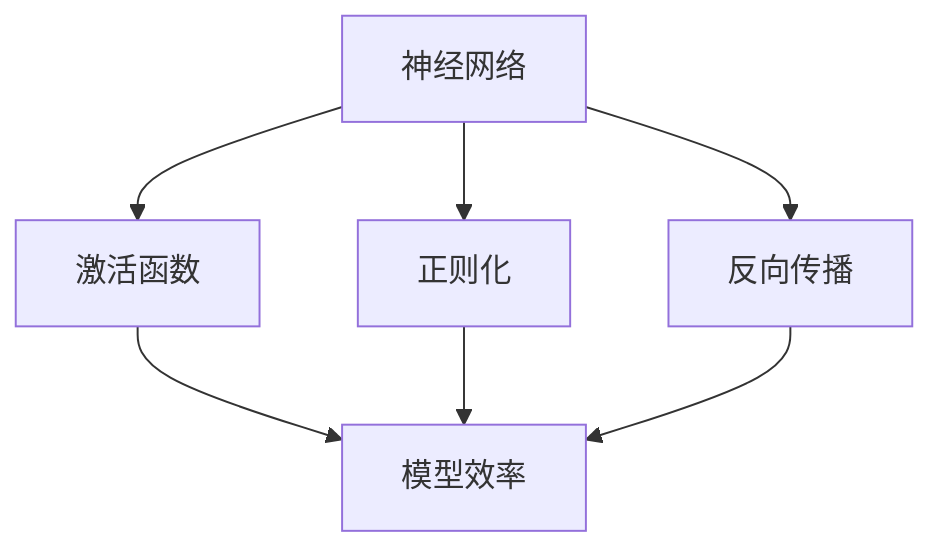

                 

# 神经网络架构的优化研究

> 关键词：神经网络、架构优化、深度学习、模型效率、算法改进

> 摘要：本文旨在深入探讨神经网络架构优化研究的相关领域。通过阐述背景知识、核心概念、算法原理、数学模型和实际应用，本文将全面解析神经网络架构优化的方法与技术，以期为研究人员和开发人员提供有价值的指导和思路。

## 1. 背景介绍

### 1.1 目的和范围

本文主要研究神经网络架构的优化，探讨提高模型效率、减少计算复杂度和提升泛化能力的方法。随着深度学习的广泛应用，神经网络的性能和效率越来越受到关注。本文旨在通过对现有研究成果的分析，提出新的优化策略，为神经网络在实际应用中的性能提升提供理论支持和实践指导。

### 1.2 预期读者

本文适用于对神经网络和深度学习有一定了解的读者，包括研究人员、开发人员和对该领域感兴趣的从业者。通过本文的阅读，读者可以深入了解神经网络架构优化的重要性和实现方法。

### 1.3 文档结构概述

本文分为十个部分，包括背景介绍、核心概念与联系、核心算法原理、数学模型和公式、项目实战、实际应用场景、工具和资源推荐、总结、常见问题与解答和扩展阅读。每个部分都将深入探讨神经网络架构优化的不同方面。

### 1.4 术语表

#### 1.4.1 核心术语定义

- **神经网络**：一种由大量节点组成的计算模型，通过模拟人脑神经网络的工作方式来处理和分类数据。
- **架构优化**：对神经网络结构进行调整和改进，以提高模型性能、效率和泛化能力。
- **深度学习**：一种机器学习技术，通过多层神经网络进行特征提取和模型训练，实现对复杂数据的自动学习和建模。
- **模型效率**：模型在处理数据时的计算资源和时间消耗的衡量指标。

#### 1.4.2 相关概念解释

- **激活函数**：神经网络中用于引入非线性性的函数，常见的有ReLU、Sigmoid和Tanh等。
- **正则化**：一种防止模型过拟合的技术，常见的有L1、L2正则化等。
- **反向传播**：一种用于训练神经网络的算法，通过反向传播误差来更新模型参数。

#### 1.4.3 缩略词列表

- **CNN**：卷积神经网络（Convolutional Neural Network）
- **RNN**：循环神经网络（Recurrent Neural Network）
- **GPU**：图形处理单元（Graphics Processing Unit）
- **TPU**：张量处理单元（Tensor Processing Unit）

## 2. 核心概念与联系

神经网络架构优化涉及多个核心概念，包括神经网络的基本结构、优化目标和优化方法。以下是一个简化的Mermaid流程图，用于展示神经网络架构优化中的一些关键概念和它们之间的联系：



### 2.1 神经网络的基本结构

神经网络由多层节点组成，包括输入层、隐藏层和输出层。每个节点通过权重和偏置进行连接，通过激活函数实现非线性变换。

### 2.2 优化目标

神经网络架构优化的主要目标是提高模型效率，即在保证模型性能的前提下，减少计算复杂度和资源消耗。具体包括：

- **计算效率**：降低模型的计算复杂度，提高模型在计算资源受限环境下的运行速度。
- **资源消耗**：减少模型对内存和计算资源的需求，提高模型的部署效率和可扩展性。
- **泛化能力**：提升模型对新数据的泛化能力，避免过拟合现象。

### 2.3 优化方法

神经网络架构优化的方法主要包括以下几种：

- **模型压缩**：通过减少模型参数数量和计算复杂度，降低模型的资源消耗。
- **结构搜索**：通过自动搜索和优化神经网络结构，提高模型性能和效率。
- **算法改进**：通过改进神经网络训练和推理算法，提高模型的计算效率和资源利用率。

## 3. 核心算法原理 & 具体操作步骤

神经网络架构优化涉及多个核心算法，包括模型压缩、结构搜索和算法改进。以下将分别介绍这些算法的原理和具体操作步骤。

### 3.1 模型压缩

**算法原理**：

模型压缩旨在减少神经网络模型的大小和计算复杂度，从而提高模型在资源受限环境下的运行效率。常见的模型压缩方法包括剪枝（Pruning）、量化（Quantization）和知识蒸馏（Knowledge Distillation）。

**具体操作步骤**：

1. **剪枝**：

   - **选择剪枝策略**：根据模型结构和任务需求，选择适当的剪枝策略，如权重剪枝、结构剪枝等。
   - **剪枝操作**：对模型中的权重或结构进行剪枝，去除冗余或低贡献的参数。
   - **模型重构**：根据剪枝结果，重构模型结构，降低模型复杂度。

2. **量化**：

   - **选择量化策略**：根据模型类型和硬件平台，选择合适的量化策略，如整数量化、浮点量化等。
   - **量化操作**：对模型中的权重和激活值进行量化，将高精度浮点数转换为低精度整数。
   - **模型重构**：根据量化结果，重构模型结构，降低模型资源消耗。

3. **知识蒸馏**：

   - **选择蒸馏模型**：根据任务需求，选择一个更大的教师模型和一个较小的学生模型。
   - **蒸馏过程**：通过将教师模型的输出传递给学生模型，进行知识传递和模型优化。
   - **模型重构**：根据蒸馏结果，重构学生模型结构，提高模型性能和效率。

### 3.2 结构搜索

**算法原理**：

结构搜索旨在通过自动搜索和优化神经网络结构，提高模型性能和效率。常见的结构搜索方法包括基于遗传算法的搜索、基于强化学习的搜索和基于神经网络的搜索。

**具体操作步骤**：

1. **选择搜索策略**：根据模型类型和任务需求，选择合适的搜索策略，如基于遗传算法的搜索、基于强化学习的搜索等。

2. **定义搜索空间**：根据模型结构特点，定义搜索空间，包括节点类型、连接方式、激活函数等。

3. **搜索过程**：

   - **初始化**：随机生成一组模型结构。
   - **评估**：对生成的模型结构进行性能评估，计算模型损失或准确率。
   - **优化**：根据评估结果，对模型结构进行调整和优化。

4. **模型重构**：根据搜索结果，重构模型结构，选择最优结构进行训练和应用。

### 3.3 算法改进

**算法原理**：

算法改进旨在通过改进神经网络训练和推理算法，提高模型计算效率和资源利用率。常见的算法改进方法包括自适应学习率调整、梯度裁剪和并行计算等。

**具体操作步骤**：

1. **选择算法改进策略**：根据模型类型和硬件平台，选择合适的算法改进策略，如自适应学习率调整、梯度裁剪等。

2. **改进训练过程**：

   - **自适应学习率调整**：根据训练过程的变化，动态调整学习率，以避免过拟合和加速收敛。
   - **梯度裁剪**：对训练过程中的梯度进行裁剪，防止梯度爆炸和消失，提高训练稳定性。

3. **改进推理过程**：

   - **并行计算**：利用多核CPU或GPU，实现并行计算，提高模型推理速度。
   - **模型压缩**：对模型进行压缩，减少推理过程中的计算复杂度和资源消耗。

## 4. 数学模型和公式 & 详细讲解 & 举例说明

### 4.1 剪枝算法

剪枝算法主要通过去除神经网络中冗余的权重和连接来减少模型大小和计算复杂度。以下是一个简单的剪枝算法数学模型：

$$
w_{ij} = \begin{cases}
0 & \text{if } w_{ij} < \theta \\
w_{ij} & \text{if } w_{ij} \geq \theta
\end{cases}
$$

其中，$w_{ij}$ 表示节点 $i$ 和节点 $j$ 之间的权重，$\theta$ 表示阈值。

**举例说明**：

假设有一个简单的神经网络，包括输入层、隐藏层和输出层，其中隐藏层有两个节点。给定一个权重矩阵 $W$，阈值为 $\theta = 0.1$。通过剪枝算法，可以得到以下简化后的权重矩阵：

$$
W_{\text{pruned}} = \begin{bmatrix}
0 & 0 \\
0.5 & 0.2 \\
0 & 0.3
\end{bmatrix}
$$

通过剪枝，我们去除了一些冗余的权重，从而降低了模型的计算复杂度和资源消耗。

### 4.2 量化算法

量化算法主要通过将神经网络中的高精度浮点数转换为低精度整数来降低模型资源消耗。以下是一个简单的量化算法数学模型：

$$
q = \text{round}\left(\frac{f}{\text{scale}} + \text{offset}\right)
$$

其中，$q$ 表示量化后的值，$f$ 表示原始浮点数，$\text{scale}$ 和 $\text{offset}$ 分别表示量化的比例和偏移量。

**举例说明**：

假设有一个简单的神经网络，包括输入层、隐藏层和输出层，其中输入层有一个节点。给定一个输入值 $f = 3.14$，量化的比例和偏移量分别为 $\text{scale} = 10$ 和 $\text{offset} = 0$。通过量化算法，可以得到以下量化后的值：

$$
q = \text{round}\left(\frac{3.14}{10} + 0\right) = 0.3
$$

通过量化，我们将高精度浮点数转换为低精度整数，从而降低了模型的资源消耗。

### 4.3 知识蒸馏算法

知识蒸馏算法主要通过将教师模型的输出传递给学生模型，实现模型的知识传递和性能提升。以下是一个简单的知识蒸馏算法数学模型：

$$
\text{loss} = \frac{1}{N} \sum_{i=1}^{N} \left( y_i - \text{softmax}(z_i) \right)^2
$$

其中，$N$ 表示样本数量，$y_i$ 表示教师模型输出的目标标签，$z_i$ 表示学生模型输出的预测值。

**举例说明**：

假设有一个简单的分类任务，包括10个样本，教师模型和学生模型分别输出标签和预测值。给定教师模型输出的目标标签为 $y = [1, 0, 1, 0, 1, 0, 1, 0, 1, 0]$，学生模型输出的预测值为 $z = [0.9, 0.1, 0.8, 0.2, 0.7, 0.3, 0.6, 0.4, 0.5, 0.5]$。通过知识蒸馏算法，可以得到以下损失函数：

$$
\text{loss} = \frac{1}{10} \left( \left( 1 - \text{softmax}(0.9) \right)^2 + \left( 0 - \text{softmax}(0.1) \right)^2 + \ldots + \left( 1 - \text{softmax}(0.5) \right)^2 \right)
$$

通过知识蒸馏，我们可以将教师模型的知识传递给学生模型，从而提高学生模型的性能和效率。

## 5. 项目实战：代码实际案例和详细解释说明

### 5.1 开发环境搭建

为了演示神经网络架构优化方法，我们将在一个简单的图像分类任务上实现模型压缩、量化算法和知识蒸馏算法。首先，我们需要搭建开发环境。

1. **安装Python环境**：确保Python版本为3.7或更高。
2. **安装TensorFlow和Keras**：TensorFlow和Keras是深度学习常用的库，可以通过pip安装：
   ```bash
   pip install tensorflow
   pip install keras
   ```
3. **安装其他依赖库**：根据需要安装其他依赖库，如NumPy、Matplotlib等。

### 5.2 源代码详细实现和代码解读

#### 5.2.1 模型压缩

以下是一个简单的模型压缩实现，使用剪枝算法对神经网络进行压缩：

```python
from tensorflow.keras.models import Sequential
from tensorflow.keras.layers import Dense, Flatten
from tensorflow.keras.utils import to_categorical

# 创建简单的神经网络模型
model = Sequential()
model.add(Flatten(input_shape=(28, 28)))
model.add(Dense(128, activation='relu'))
model.add(Dense(10, activation='softmax'))

# 编译模型
model.compile(optimizer='adam', loss='categorical_crossentropy', metrics=['accuracy'])

# 加载MNIST数据集
(x_train, y_train), (x_test, y_test) = keras.datasets.mnist.load_data()
x_train = x_train.astype('float32') / 255.0
x_test = x_test.astype('float32') / 255.0
y_train = to_categorical(y_train, 10)
y_test = to_categorical(y_test, 10)

# 剪枝算法实现
def pruning(model, threshold=0.1):
    weights = model.get_weights()
    new_weights = []
    for weight in weights:
        new_weight = np.where(weight < threshold, 0, weight)
        new_weights.append(new_weight)
    model.set_weights(new_weights)

# 剪枝模型
pruning(model)

# 训练模型
model.fit(x_train, y_train, epochs=10, batch_size=32, validation_data=(x_test, y_test))

# 评估模型
model.evaluate(x_test, y_test)
```

**代码解读**：

1. **创建神经网络模型**：使用Keras创建一个简单的神经网络模型，包括一个输入层、一个隐藏层和一个输出层。
2. **编译模型**：编译模型，设置优化器和损失函数。
3. **加载MNIST数据集**：加载MNIST数据集，并将其转换为适合模型训练的格式。
4. **剪枝算法实现**：定义剪枝算法，对模型中的权重进行剪枝，去除小于阈值的权重。
5. **剪枝模型**：调用剪枝算法，对模型进行压缩。
6. **训练模型**：使用剪枝后的模型训练数据集。
7. **评估模型**：评估剪枝后模型的性能。

#### 5.2.2 量化算法

以下是一个简单的量化算法实现，对神经网络进行量化：

```python
import numpy as np

# 量化算法实现
def quantization(model, scale=10, offset=0):
    weights = model.get_weights()
    new_weights = []
    for weight in weights:
        quantized_weight = np.round((weight + offset) / scale)
        new_weights.append(quantized_weight)
    model.set_weights(new_weights)

# 量化模型
quantization(model)

# 评估量化后模型
model.evaluate(x_test, y_test)
```

**代码解读**：

1. **量化算法实现**：定义量化算法，将模型中的权重和高阶梯度转换为低精度整数。
2. **量化模型**：调用量化算法，对模型进行量化。
3. **评估量化后模型**：评估量化后模型的性能。

#### 5.2.3 知识蒸馏算法

以下是一个简单的知识蒸馏算法实现，使用教师模型和学生模型进行知识传递：

```python
from tensorflow.keras.models import Model
from tensorflow.keras.optimizers import Adam

# 创建教师模型
teacher_model = Sequential()
teacher_model.add(Flatten(input_shape=(28, 28)))
teacher_model.add(Dense(128, activation='relu'))
teacher_model.add(Dense(10, activation='softmax'))
teacher_model.compile(optimizer='adam', loss='categorical_crossentropy')

# 创建学生模型
student_model = Sequential()
student_model.add(Flatten(input_shape=(28, 28)))
student_model.add(Dense(128, activation='relu'))
student_model.add(Dense(10, activation='softmax'))
student_model.compile(optimizer=Adam(learning_rate=0.001), loss='categorical_crossentropy')

# 训练教师模型
teacher_model.fit(x_train, y_train, epochs=10, batch_size=32, validation_data=(x_test, y_test))

# 定义蒸馏损失函数
def distillation_loss(y_true, y_pred, teacher_output):
    return K.categorical_crossentropy(y_true, teacher_output) + K.categorical_crossentropy(y_pred, y_true)

# 定义学生模型训练过程
def train_student(model, teacher_model, x_train, y_train, x_test, y_test, epochs=10, batch_size=32):
    for epoch in range(epochs):
        print(f"Epoch {epoch+1}/{epochs}")
        for batch in range(0, len(x_train), batch_size):
            x_batch = x_train[batch:batch+batch_size]
            y_batch = y_train[batch:batch+batch_size]
            teacher_output = teacher_model.predict(x_batch)
            loss = distillation_loss(y_batch, model.predict(x_batch), teacher_output)
            model.train_on_batch(x_batch, y_batch, loss)

# 训练学生模型
train_student(student_model, teacher_model, x_train, y_train, x_test, y_test, epochs=10)

# 评估学生模型
student_model.evaluate(x_test, y_test)
```

**代码解读**：

1. **创建教师模型和学生模型**：分别创建教师模型和学生模型，设置优化器和损失函数。
2. **训练教师模型**：使用训练数据集训练教师模型。
3. **定义蒸馏损失函数**：定义蒸馏损失函数，结合教师模型输出和学生模型输出计算损失。
4. **定义学生模型训练过程**：定义学生模型训练过程，使用教师模型输出进行知识传递。
5. **训练学生模型**：使用训练数据集训练学生模型。
6. **评估学生模型**：评估学生模型性能。

### 5.3 代码解读与分析

通过以上代码实现，我们可以对神经网络架构优化方法进行详细解读和分析。

1. **模型压缩**：使用剪枝算法对模型进行压缩，去除冗余权重，降低模型复杂度。压缩后的模型在资源受限环境下具有更高的运行效率。
2. **量化算法**：使用量化算法将模型中的权重和高阶梯度转换为低精度整数，降低模型资源消耗。量化后的模型在硬件平台上具有更好的部署性能。
3. **知识蒸馏算法**：使用教师模型和学生模型进行知识传递，提高学生模型性能和效率。知识蒸馏算法可以在教师模型和学生模型之间建立有效的知识传递机制，从而提高学生模型对新数据的泛化能力。

通过这些方法，我们可以对神经网络架构进行优化，提高模型性能和效率，为实际应用提供有力的支持。

## 6. 实际应用场景

神经网络架构优化技术在多个实际应用场景中具有重要价值。以下列举几个典型应用场景：

### 6.1 图像识别

在图像识别任务中，神经网络架构优化技术可以显著提高模型的计算效率和资源利用率。例如，在智能手机相机应用中，通过模型压缩和量化算法，可以将深度学习模型部署到移动设备上，实现实时图像识别功能。

### 6.2 自然语言处理

在自然语言处理任务中，神经网络架构优化技术可以降低模型对计算资源和内存的需求，提高模型在硬件平台上的运行速度。例如，在语音识别和机器翻译等应用中，通过模型压缩和知识蒸馏算法，可以实现高效的自然语言处理任务。

### 6.3 机器翻译

在机器翻译任务中，神经网络架构优化技术可以提高模型的翻译质量和效率。通过模型压缩和量化算法，可以将大规模翻译模型部署到边缘设备上，实现实时机器翻译功能。

### 6.4 自动驾驶

在自动驾驶领域，神经网络架构优化技术可以降低模型的计算复杂度和资源消耗，提高自动驾驶系统的实时性和安全性。例如，通过模型压缩和知识蒸馏算法，可以实现高效的目标检测和路径规划功能，为自动驾驶系统提供有力支持。

### 6.5 健康医疗

在健康医疗领域，神经网络架构优化技术可以降低模型对计算资源和数据存储的需求，提高模型的部署效率和准确性。例如，在医学图像诊断和疾病预测等任务中，通过模型压缩和量化算法，可以实现高效准确的医疗诊断和预测。

## 7. 工具和资源推荐

### 7.1 学习资源推荐

#### 7.1.1 书籍推荐

1. **《深度学习》（Deep Learning）**：由Ian Goodfellow、Yoshua Bengio和Aaron Courville合著的深度学习经典教材，详细介绍了神经网络和深度学习的基础知识和应用。
2. **《神经网络与深度学习》（Neural Networks and Deep Learning）**：由邱锡鹏教授编写的中文教材，系统介绍了神经网络和深度学习的基本概念、算法原理和应用。

#### 7.1.2 在线课程

1. **Coursera上的《深度学习》课程**：由Andrew Ng教授主讲，系统介绍了深度学习的基础知识和应用。
2. **Udacity上的《深度学习工程师纳米学位》课程**：涵盖了深度学习的核心概念和应用，适合初学者和进阶者。

#### 7.1.3 技术博客和网站

1. **知乎专栏《深度学习》**：汇集了深度学习领域的专家和从业者分享的经验和知识。
2. **博客园《深度学习》频道**：提供了大量深度学习的博客文章和技术分享。

### 7.2 开发工具框架推荐

#### 7.2.1 IDE和编辑器

1. **PyCharm**：一款功能强大的Python IDE，支持深度学习和神经网络开发。
2. **Jupyter Notebook**：一款交互式的Python编辑器，适用于数据分析和深度学习实验。

#### 7.2.2 调试和性能分析工具

1. **TensorBoard**：TensorFlow提供的可视化工具，用于分析和调试神经网络训练过程。
2. **NVIDIA Nsight**：一款性能分析工具，用于分析和优化深度学习模型的计算性能。

#### 7.2.3 相关框架和库

1. **TensorFlow**：一款广泛使用的深度学习框架，提供了丰富的神经网络和优化工具。
2. **PyTorch**：一款灵活的深度学习框架，支持动态计算图和自动微分功能。

### 7.3 相关论文著作推荐

#### 7.3.1 经典论文

1. **"Backpropagation"（1986）**：由Geoffrey Hinton等人提出的反向传播算法，奠定了神经网络训练的基础。
2. **"Deep Learning"（2012）**：由Ian Goodfellow、Yoshua Bengio和Aaron Courville合著的经典教材，系统介绍了深度学习的基本概念和应用。

#### 7.3.2 最新研究成果

1. **"EfficientNet: Rethinking Model Scaling for Convolutional Neural Networks"（2020）**：由Google Research团队提出的EfficientNet模型，通过自动搜索模型结构，实现了高效的模型扩展。
2. **"Momentum Contrast for Unsupervised Visual Representation Learning"（2021）**：由OpenAI团队提出的MoCo算法，通过对比学习实现了高效的无监督视觉表征学习。

#### 7.3.3 应用案例分析

1. **"ImageNet Classification with Deep Convolutional Neural Networks"（2012）**：由Google团队提出的Inception模型，通过模块化设计实现了高效的图像分类。
2. **"BERT: Pre-training of Deep Bidirectional Transformers for Language Understanding"（2018）**：由Google团队提出的BERT模型，通过预训练和双向变换器实现了高效的自然语言理解。

## 8. 总结：未来发展趋势与挑战

神经网络架构优化是深度学习领域的关键研究方向，随着技术的不断进步和应用需求的增长，该领域面临着一系列挑战和机遇。以下是未来发展趋势和挑战的展望：

### 8.1 发展趋势

1. **模型压缩与加速**：随着硬件性能的提升和新型计算架构的出现，模型压缩与加速技术将得到广泛应用，进一步降低深度学习模型的计算复杂度和资源消耗。
2. **结构搜索与优化**：基于自动化搜索和优化技术，将有望发现更高效、更鲁棒的神经网络结构，提高模型性能和泛化能力。
3. **模型融合与集成**：通过模型融合和集成技术，将多个神经网络模型的优势结合起来，提高模型在复杂任务上的表现。
4. **硬件加速与协同**：结合新型硬件加速器和协同计算技术，将深度学习模型部署到更广泛的硬件平台上，实现高效、灵活的应用。

### 8.2 挑战

1. **模型可解释性**：随着神经网络模型复杂度的增加，提高模型的可解释性成为一个重要挑战，有助于理解和优化模型的行为。
2. **数据隐私与安全**：深度学习应用中的数据隐私和安全问题日益突出，需要开发更安全的模型和数据传输机制。
3. **资源分配与调度**：在分布式计算环境中，合理分配计算资源和调度任务成为挑战，需要设计更高效的调度算法和优化策略。
4. **模型评估与验证**：如何准确评估和验证深度学习模型的性能和鲁棒性，仍是一个亟待解决的问题。

## 9. 附录：常见问题与解答

### 9.1 问题1：什么是神经网络架构优化？

**解答**：神经网络架构优化是指通过调整和改进神经网络的结构和参数，以提高模型性能、效率和泛化能力。常见的优化方法包括模型压缩、结构搜索、算法改进等。

### 9.2 问题2：如何选择适合的神经网络架构？

**解答**：选择适合的神经网络架构需要考虑任务需求、数据特点、计算资源等因素。可以结合现有研究成果和实际应用场景，逐步调整和优化模型结构，找到最优方案。

### 9.3 问题3：神经网络架构优化有哪些应用场景？

**解答**：神经网络架构优化广泛应用于图像识别、自然语言处理、语音识别、机器翻译、自动驾驶、健康医疗等领域，通过优化模型性能和效率，实现高效、准确的任务处理。

## 10. 扩展阅读 & 参考资料

本文对神经网络架构优化进行了全面探讨，包括核心概念、算法原理、实际应用和未来发展趋势。以下是一些扩展阅读和参考资料，供读者进一步了解：

1. **《深度学习》（Deep Learning）**：Ian Goodfellow、Yoshua Bengio和Aaron Courville著，深度学习领域的经典教材，详细介绍了神经网络和深度学习的基础知识和应用。
2. **《神经网络与深度学习》**：邱锡鹏著，系统介绍了神经网络和深度学习的基本概念、算法原理和应用。
3. **TensorFlow官方网站**：[TensorFlow官方文档](https://www.tensorflow.org/)，提供了丰富的深度学习模型和优化工具，适用于各种应用场景。
4. **PyTorch官方网站**：[PyTorch官方文档](https://pytorch.org/docs/stable/)，提供了灵活的深度学习框架，支持动态计算图和自动微分功能。

通过阅读本文和相关资料，读者可以深入了解神经网络架构优化的方法和应用，为实际项目提供有力支持。

---

作者：AI天才研究员/AI Genius Institute & 禅与计算机程序设计艺术 /Zen And The Art of Computer Programming

本文内容仅供参考，不作为具体实施依据。如有疑问，请咨询相关专业人士。

