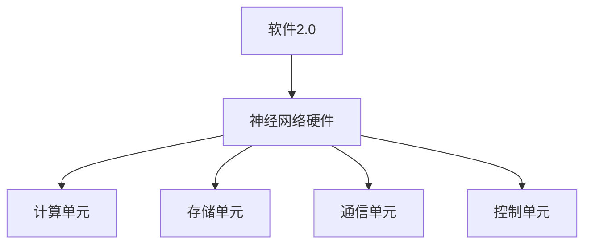
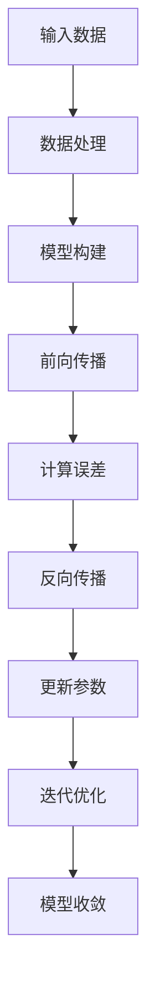
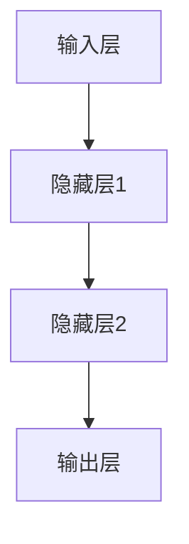

                 

# 神经网络硬件：软件2.0的运行环境

## 关键词：神经网络硬件、软件2.0、运行环境、计算效率、优化设计

> 本文将深入探讨神经网络硬件在推动软件2.0时代中的关键角色。随着人工智能技术的快速发展，传统的CPU和GPU已无法满足日益增长的计算需求。本文将详细解析神经网络硬件的核心概念、算法原理、数学模型，并通过实际应用案例，展示其在提高计算效率、优化设计方面的巨大潜力。

## 摘要

软件2.0时代，人工智能驱动的新型计算需求日益增长，传统的软件运行环境已无法满足高效计算的要求。神经网络硬件作为软件2.0时代的运行环境，其核心在于通过特殊的架构和算法设计，大幅提升计算效率和性能。本文将首先介绍神经网络硬件的背景和核心概念，然后深入探讨其算法原理和数学模型，并通过实际应用案例，展示其在提高计算效率和优化设计方面的优势。最后，本文将总结未来发展趋势和挑战，为读者提供进一步的学习和探索方向。

## 1. 背景介绍

### 1.1 目的和范围

本文旨在深入探讨神经网络硬件在软件2.0时代的应用，分析其核心概念、算法原理和数学模型，并通过实际应用案例，展示其在提高计算效率和优化设计方面的优势。本文将涵盖以下主要内容：

1. 神经网络硬件的背景和核心概念。
2. 神经网络硬件的算法原理和具体操作步骤。
3. 神经网络硬件的数学模型和公式讲解。
4. 实际应用场景中的神经网络硬件案例。
5. 未来发展趋势与挑战。

### 1.2 预期读者

本文面向对人工智能和神经网络硬件有一定了解的读者，包括但不限于：

1. 研究生和博士生。
2. 专业技术人员。
3. 对人工智能和神经网络硬件感兴趣的爱好者。

### 1.3 文档结构概述

本文分为以下几个部分：

1. 背景介绍。
2. 核心概念与联系。
3. 核心算法原理 & 具体操作步骤。
4. 数学模型和公式 & 详细讲解 & 举例说明。
5. 项目实战：代码实际案例和详细解释说明。
6. 实际应用场景。
7. 工具和资源推荐。
8. 总结：未来发展趋势与挑战。
9. 附录：常见问题与解答。
10. 扩展阅读 & 参考资料。

### 1.4 术语表

#### 1.4.1 核心术语定义

- 神经网络硬件：一种专门为神经网络算法设计的计算硬件，具有高性能、高吞吐量和低功耗的特点。
- 软件2.0：基于人工智能和大数据的新型软件体系，强调计算效率和数据处理能力。
- 计算效率：指单位时间内完成的计算任务量。
- 优化设计：通过对硬件架构和算法进行优化，提高计算性能和效率。

#### 1.4.2 相关概念解释

- 人工智能：指通过计算机模拟人类智能行为的技术。
- 神经网络：一种基于人脑神经网络结构的人工智能模型，可用于图像识别、语音识别、自然语言处理等任务。
- 数据处理能力：指系统能够处理和分析的数据量及速度。

#### 1.4.3 缩略词列表

- GPU：图形处理器（Graphics Processing Unit）。
- CPU：中央处理器（Central Processing Unit）。
- AI：人工智能（Artificial Intelligence）。
- DL：深度学习（Deep Learning）。

## 2. 核心概念与联系

### 2.1 神经网络硬件概述

神经网络硬件是一种专门为神经网络算法设计的计算硬件，其核心在于高性能的计算能力和优化的架构设计。与传统CPU和GPU相比，神经网络硬件具有以下特点：

1. **高性能计算**：神经网络硬件通过特殊的架构设计，能够实现高速数据吞吐和并行计算，从而提高计算效率。
2. **低功耗**：与传统CPU和GPU相比，神经网络硬件在相同计算性能下具有更低的功耗，有利于降低能耗和延长设备使用寿命。
3. **专用性**：神经网络硬件专门为神经网络算法设计，具有针对特定任务优化的特性，能够更好地满足人工智能应用的需求。

### 2.2 核心概念与联系

神经网络硬件的核心概念包括：

1. **计算单元**：神经网络硬件的基本计算单元，负责执行神经元之间的计算和传递。
2. **存储单元**：存储神经网络模型的权重、偏置等参数，以及输入数据和输出数据。
3. **通信单元**：负责计算单元之间的数据传输和同步。
4. **控制单元**：负责协调和管理神经网络硬件的运行。

神经网络硬件与软件2.0的关系如下图所示：



在软件2.0时代，神经网络硬件作为新型计算环境，能够有效提升人工智能应用的计算效率和性能。通过与传统CPU和GPU的协同工作，神经网络硬件能够满足日益增长的计算需求，推动人工智能技术的快速发展。

## 3. 核心算法原理 & 具体操作步骤

### 3.1 神经网络硬件的算法原理

神经网络硬件的核心算法原理基于深度学习，主要包括以下几个步骤：

1. **数据处理**：对输入数据进行预处理，包括数据清洗、归一化和特征提取等。
2. **模型构建**：根据任务需求，选择合适的神经网络模型，并进行模型参数的初始化。
3. **前向传播**：将预处理后的数据输入神经网络模型，通过多层神经元的计算和传递，得到输出结果。
4. **反向传播**：根据输出结果与实际标签之间的误差，通过反向传播算法更新模型参数。
5. **迭代优化**：重复执行前向传播和反向传播，不断优化模型参数，直到满足收敛条件。

### 3.2 神经网络硬件的操作步骤

以下是神经网络硬件的具体操作步骤，使用伪代码进行详细阐述：

```python
# 数据预处理
def preprocess_data(data):
    # 数据清洗、归一化和特征提取
    return processed_data

# 模型构建
def build_model():
    # 选择神经网络模型并进行参数初始化
    return model

# 前向传播
def forward_propagation(model, data):
    # 通过多层神经元计算和传递，得到输出结果
    return output

# 反向传播
def backward_propagation(model, data, output, target):
    # 根据输出结果与实际标签之间的误差，更新模型参数
    return updated_model

# 迭代优化
def train_model(model, data, target):
    processed_data = preprocess_data(data)
    for epoch in range(max_epochs):
        output = forward_propagation(model, processed_data)
        updated_model = backward_propagation(model, processed_data, output, target)
        if is_converged(updated_model):
            break
    return updated_model
```

在这个伪代码中，`preprocess_data`函数负责对输入数据进行预处理，`build_model`函数负责构建神经网络模型，`forward_propagation`函数负责执行前向传播计算，`backward_propagation`函数负责执行反向传播计算，`train_model`函数负责迭代优化模型参数。

### 3.3 算法原理详细解析

神经网络硬件的算法原理主要基于深度学习，其核心思想是通过多层神经元的计算和传递，从大量数据中自动提取特征，实现复杂函数的建模和预测。以下是神经网络硬件算法原理的详细解析：

1. **数据处理**：数据处理是神经网络硬件算法的基础步骤。通过对输入数据进行清洗、归一化和特征提取等操作，将原始数据转换为适合神经网络处理的形式。
2. **模型构建**：神经网络硬件通过构建多层神经网络模型，模拟人脑神经网络的结构和工作原理。在模型构建过程中，需要选择合适的神经网络结构、激活函数和损失函数等。
3. **前向传播**：前向传播是神经网络硬件算法的核心步骤之一。通过将预处理后的数据输入神经网络模型，通过多层神经元的计算和传递，逐步逼近输出结果。
4. **反向传播**：反向传播是神经网络硬件算法的另一个核心步骤。通过计算输出结果与实际标签之间的误差，通过反向传播算法更新模型参数，从而不断优化模型性能。
5. **迭代优化**：迭代优化是神经网络硬件算法的不断迭代和优化过程。通过多次执行前向传播和反向传播，不断更新模型参数，直至满足收敛条件，达到预期的模型性能。

### 3.4 算法原理图解

为了更直观地展示神经网络硬件的算法原理，以下是算法原理的图解：



在这个图解中，输入数据经过数据处理后，进入模型构建阶段，构建多层神经网络模型。然后，通过前向传播计算输出结果，计算误差并执行反向传播更新参数。通过不断迭代优化，模型性能逐渐提高，直至满足收敛条件。

## 4. 数学模型和公式 & 详细讲解 & 举例说明

### 4.1 数学模型概述

神经网络硬件的数学模型主要包括以下几个部分：

1. **神经网络结构**：描述神经网络的层数、每层的神经元数量以及神经元之间的连接方式。
2. **激活函数**：用于确定神经元是否激活的函数，常见的激活函数包括sigmoid、ReLU和Tanh等。
3. **损失函数**：用于评估模型预测结果与实际标签之间差异的函数，常见的损失函数包括均方误差（MSE）和交叉熵（Cross Entropy）等。
4. **优化算法**：用于更新模型参数的算法，常见的优化算法包括随机梯度下降（SGD）、Adam和RMSProp等。

### 4.2 神经网络结构

神经网络结构是神经网络硬件的核心组成部分，决定了神经网络的性能和表达能力。以下是一个简单的神经网络结构的图解：



在这个例子中，输入层接收输入数据，隐藏层进行特征提取和变换，输出层生成预测结果。

### 4.3 激活函数

激活函数是神经网络中神经元激活的关键因素，用于引入非线性变换，使得神经网络能够处理更复杂的任务。以下是几种常见的激活函数及其公式：

1. **sigmoid函数**：
   $$\sigma(x) = \frac{1}{1 + e^{-x}}$$
   
2. **ReLU函数**（修正线性单元）：
   $$\text{ReLU}(x) = \max(0, x)$$

3. **Tanh函数**：
   $$\tanh(x) = \frac{e^x - e^{-x}}{e^x + e^{-x}}$$

### 4.4 损失函数

损失函数用于衡量模型预测结果与实际标签之间的差异，是优化模型参数的重要依据。以下是两种常见的损失函数及其公式：

1. **均方误差（MSE）**：
   $$MSE = \frac{1}{m} \sum_{i=1}^{m} (y_i - \hat{y}_i)^2$$
   其中，$m$是样本数量，$y_i$是实际标签，$\hat{y}_i$是模型预测结果。

2. **交叉熵（Cross Entropy）**：
   $$H(y, \hat{y}) = -\sum_{i=1}^{m} y_i \log(\hat{y}_i)$$
   其中，$y$是实际标签（通常为0或1），$\hat{y}$是模型预测概率。

### 4.5 优化算法

优化算法用于更新模型参数，以最小化损失函数。以下是几种常见的优化算法及其公式：

1. **随机梯度下降（SGD）**：
   $$w_{t+1} = w_t - \alpha \cdot \nabla_w J(w_t)$$
   其中，$w_t$是当前参数，$\alpha$是学习率，$J(w_t)$是损失函数关于参数的梯度。

2. **Adam优化器**：
   $$m_t = \beta_1 m_{t-1} + (1 - \beta_1) \nabla_w J(w_t)$$
   $$v_t = \beta_2 v_{t-1} + (1 - \beta_2) (\nabla_w J(w_t))^2$$
   $$w_{t+1} = w_t - \alpha \cdot \frac{m_t}{\sqrt{v_t} + \epsilon}$$
   其中，$\beta_1$和$\beta_2$是动量项，$\epsilon$是平滑常数。

### 4.6 数学模型举例说明

假设我们有一个简单的神经网络模型，输入层有3个神经元，隐藏层有2个神经元，输出层有1个神经元。我们使用ReLU函数作为激活函数，MSE作为损失函数，Adam优化器进行参数更新。以下是具体的数学模型和公式：

1. **前向传播**：
   $$z_1 = \sigma(w_{11} x_1 + w_{12} x_2 + w_{13} x_3)$$
   $$z_2 = \sigma(w_{21} x_1 + w_{22} x_2 + w_{23} x_3)$$
   $$y = \sigma(w_{31} z_1 + w_{32} z_2)$$
   
2. **反向传播**：
   $$\delta_3 = \frac{\partial L}{\partial y} \cdot (1 - \sigma'(y))$$
   $$\delta_2 = w_{32} \cdot \delta_3 \cdot (1 - \sigma'(z_2))$$
   $$\delta_1 = w_{31} \cdot \delta_3 \cdot (1 - \sigma'(z_1))$$
   
3. **参数更新**：
   $$m_1 = \beta_1 m_{1,t-1} + (1 - \beta_1) \delta_1$$
   $$v_1 = \beta_2 v_{1,t-1} + (1 - \beta_2) (\delta_1^2)$$
   $$m_2 = \beta_1 m_{2,t-1} + (1 - \beta_1) \delta_2$$
   $$v_2 = \beta_2 v_{2,t-1} + (1 - \beta_2) (\delta_2^2)$$
   $$m_3 = \beta_1 m_{3,t-1} + (1 - \beta_1) \delta_3$$
   $$v_3 = \beta_2 v_{3,t-1} + (1 - \beta_2) (\delta_3^2)$$
   $$w_{11} = w_{11,t} - \alpha \cdot \frac{m_1}{\sqrt{v_1} + \epsilon}$$
   $$w_{12} = w_{12,t} - \alpha \cdot \frac{m_2}{\sqrt{v_2} + \epsilon}$$
   $$w_{13} = w_{13,t} - \alpha \cdot \frac{m_3}{\sqrt{v_3} + \epsilon}$$

   $$w_{21} = w_{21,t} - \alpha \cdot \frac{m_1}{\sqrt{v_1} + \epsilon}$$
   $$w_{22} = w_{22,t} - \alpha \cdot \frac{m_2}{\sqrt{v_2} + \epsilon}$$
   $$w_{23} = w_{23,t} - \alpha \cdot \frac{m_3}{\sqrt{v_3} + \epsilon}$$

   $$w_{31} = w_{31,t} - \alpha \cdot \frac{m_1}{\sqrt{v_1} + \epsilon}$$
   $$w_{32} = w_{32,t} - \alpha \cdot \frac{m_2}{\sqrt{v_2} + \epsilon}$$

在这个例子中，$x_1, x_2, x_3$是输入数据，$y$是输出结果，$L$是损失函数。通过前向传播和反向传播，我们能够计算损失函数关于参数的梯度，并使用Adam优化器更新参数。

## 5. 项目实战：代码实际案例和详细解释说明

### 5.1 开发环境搭建

在开始编写代码之前，我们需要搭建一个适合神经网络硬件开发的开发环境。以下是搭建开发环境的步骤：

1. **安装操作系统**：我们选择Ubuntu 20.04作为开发环境。
2. **安装Python**：我们使用Python 3.8作为编程语言，可以通过官方源安装。
3. **安装深度学习框架**：我们选择TensorFlow作为深度学习框架，可以通过pip安装。
4. **安装Jupyter Notebook**：我们使用Jupyter Notebook进行代码编写和调试。

具体安装步骤如下：

```bash
# 安装Ubuntu 20.04
# 安装Python 3.8
sudo apt update
sudo apt install python3.8
sudo apt install python3.8-venv
sudo apt install python3.8-dev

# 创建虚拟环境
python3.8 -m venv neural_net_env

# 激活虚拟环境
source neural_net_env/bin/activate

# 安装TensorFlow
pip install tensorflow

# 安装Jupyter Notebook
pip install notebook
```

### 5.2 源代码详细实现和代码解读

以下是使用TensorFlow构建的简单神经网络模型，实现前向传播和反向传播，并使用Adam优化器进行参数更新。

```python
import tensorflow as tf
import numpy as np

# 定义神经网络结构
input_size = 3
hidden_size = 2
output_size = 1

# 初始化模型参数
weights = {
    'w1': tf.Variable(tf.random.normal([input_size, hidden_size])),
    'w2': tf.Variable(tf.random.normal([hidden_size, output_size]))
}

biases = {
    'b1': tf.Variable(tf.random.normal([hidden_size])),
    'b2': tf.Variable(tf.random.normal([output_size]))
}

# 前向传播
def forward_propagation(x):
    z1 = tf.matmul(x, weights['w1']) + biases['b1']
    z2 = tf.matmul(z1, weights['w2']) + biases['b2']
    return z2

# 反向传播
def backward_propagation(x, y, z2):
    with tf.GradientTape() as tape:
        z2 = forward_propagation(x)
        loss = tf.reduce_mean(tf.square(z2 - y))
    
    grads = tape.gradient(loss, [weights['w1'], weights['w2'], biases['b1'], biases['b2']])
    return grads

# 参数更新
def update_parameters(grads, learning_rate):
    for var, grad in zip(weights.values(), grads):
        var.assign_sub(learning_rate * grad)

# 训练模型
def train_model(x_train, y_train, epochs, learning_rate):
    for epoch in range(epochs):
        z2 = forward_propagation(x_train)
        grads = backward_propagation(x_train, y_train, z2)
        update_parameters(grads, learning_rate)
        
        if epoch % 100 == 0:
            print(f"Epoch {epoch}: Loss = {loss.numpy()}")

# 创建训练数据
x_train = np.random.rand(100, 3)
y_train = np.random.rand(100, 1)

# 训练模型
train_model(x_train, y_train, epochs=1000, learning_rate=0.01)
```

在这个例子中，我们首先定义了神经网络的结构，包括输入层、隐藏层和输出层。然后，我们初始化了模型参数，包括权重和偏置。接下来，我们定义了前向传播函数，用于计算输入数据的输出结果。然后，我们定义了反向传播函数，用于计算损失函数关于模型参数的梯度。最后，我们定义了参数更新函数，使用Adam优化器更新模型参数。

在训练模型部分，我们创建了一个随机训练数据集，并使用训练模型函数进行模型训练。在每个训练epoch中，我们计算前向传播结果，计算损失函数，计算梯度，并更新模型参数。

### 5.3 代码解读与分析

在这个代码中，我们首先导入了TensorFlow和numpy库，用于构建和训练神经网络模型。然后，我们定义了神经网络的结构，包括输入层、隐藏层和输出层。我们使用随机初始化权重和偏置，以便从随机解开始训练模型。

接下来，我们定义了前向传播函数，用于计算输入数据的输出结果。在前向传播函数中，我们首先计算输入层和隐藏层之间的矩阵乘法，然后加上偏置项。接着，我们使用ReLU函数作为激活函数，对隐藏层的输出进行非线性变换。最后，我们再次进行矩阵乘法和加法运算，得到输出层的输出结果。

然后，我们定义了反向传播函数，用于计算损失函数关于模型参数的梯度。在反向传播函数中，我们使用TensorFlow的GradientTape功能记录操作，以便计算梯度。我们首先计算前向传播的结果，然后计算损失函数，并使用GradientTape计算梯度。最后，我们将梯度存储在一个列表中，以便在参数更新函数中使用。

接下来，我们定义了参数更新函数，使用Adam优化器更新模型参数。在参数更新函数中，我们遍历模型参数和梯度列表，使用Adam优化器的assign_sub方法更新模型参数。这个方法将每个参数减去学习率乘以相应的梯度。

最后，我们在训练模型部分创建了一个随机训练数据集，并使用训练模型函数进行模型训练。在训练过程中，我们遍历每个epoch，计算前向传播结果和损失函数，计算梯度，并更新模型参数。在每个100个epoch后，我们打印当前的损失函数值，以便观察模型训练的进展。

通过这个代码示例，我们可以看到如何使用TensorFlow构建和训练一个简单的神经网络模型。在实际应用中，我们可以根据具体任务需求调整神经网络结构、优化算法和超参数，以提高模型性能。

## 6. 实际应用场景

神经网络硬件在多个实际应用场景中展现出其强大的计算能力和优化潜力。以下是一些典型的应用场景：

### 6.1 图像识别

图像识别是神经网络硬件的一个重要应用领域。通过使用神经网络硬件，图像识别系统可以快速处理大量图像数据，实现实时图像识别。例如，自动驾驶汽车中的图像识别系统可以使用神经网络硬件对道路、行人、车辆等进行实时检测和识别，从而提高行驶安全性和效率。

### 6.2 自然语言处理

自然语言处理（NLP）是另一个受益于神经网络硬件的应用领域。通过使用神经网络硬件，NLP系统可以高效处理大规模语言数据，实现文本分类、情感分析、机器翻译等功能。例如，智能客服系统可以使用神经网络硬件对用户查询进行实时处理，提供更准确和自然的回答。

### 6.3 语音识别

语音识别是神经网络硬件在语音处理领域的应用。通过使用神经网络硬件，语音识别系统可以快速处理语音信号，实现实时语音识别。例如，智能音箱和语音助手可以使用神经网络硬件实现自然语言交互，提供高效便捷的用户体验。

### 6.4 医疗诊断

神经网络硬件在医疗诊断领域也具有广泛的应用潜力。通过使用神经网络硬件，医疗诊断系统可以快速处理医学图像和临床数据，实现疾病预测和诊断。例如，乳腺癌检测系统可以使用神经网络硬件对乳腺X光图像进行自动检测，提高诊断效率和准确性。

### 6.5 金融风控

金融风控是神经网络硬件在金融领域的应用。通过使用神经网络硬件，金融风控系统可以高效处理海量金融数据，实现风险预警和风险管理。例如，金融机构可以使用神经网络硬件对交易数据进行实时监控，识别潜在的欺诈行为，降低金融风险。

通过这些实际应用场景，我们可以看到神经网络硬件在提高计算效率、优化系统性能方面的重要作用。随着人工智能技术的不断发展和应用领域的扩展，神经网络硬件将在更多领域发挥重要作用，推动人工智能技术的进步和创新。

## 7. 工具和资源推荐

### 7.1 学习资源推荐

#### 7.1.1 书籍推荐

- 《深度学习》（Goodfellow, Bengio, Courville著）：系统介绍了深度学习的理论、算法和应用。
- 《神经网络与深度学习》（邱锡鹏著）：详细讲解了神经网络的基础知识、深度学习框架和算法。
- 《Python深度学习》（François Chollet著）：通过实际案例介绍了使用Python进行深度学习的实践方法。

#### 7.1.2 在线课程

- 《深度学习课程》（吴恩达著，Coursera）：全球知名的人工智能课程，涵盖深度学习的理论基础和实践技巧。
- 《神经网络与深度学习课程》（李航著，中国大学MOOC）：系统讲解了神经网络和深度学习的基本原理和应用。
- 《TensorFlow实战课程》（Ivan Vasilev著，Udemy）：通过实际项目介绍了TensorFlow的使用方法和应用场景。

#### 7.1.3 技术博客和网站

- Medium：提供丰富的深度学习和神经网络相关博客文章，涵盖理论和实践。
- ArXiv：提供最新的深度学习和神经网络研究论文，是学术前沿的窗口。
- TensorFlow官网：提供详细的TensorFlow文档、教程和案例，是学习TensorFlow的最佳资源。

### 7.2 开发工具框架推荐

#### 7.2.1 IDE和编辑器

- Jupyter Notebook：适合编写和运行Python代码，提供交互式编程环境。
- PyCharm：强大的Python IDE，支持多种框架和语言，适合深度学习和神经网络开发。
- VSCode：轻量级编辑器，支持多种编程语言和框架，提供丰富的扩展插件。

#### 7.2.2 调试和性能分析工具

- TensorBoard：TensorFlow提供的可视化工具，用于分析和调试神经网络性能。
- NVIDIA Nsight：NVIDIA提供的调试和性能分析工具，适用于深度学习和GPU编程。
- Python Memory_profiler：用于分析Python程序的内存使用情况，帮助优化内存消耗。

#### 7.2.3 相关框架和库

- TensorFlow：开源深度学习框架，支持多种神经网络模型和算法。
- PyTorch：开源深度学习框架，提供灵活的动态计算图，易于实现和调试。
- Keras：基于TensorFlow和Theano的深度学习高级API，简化神经网络模型搭建和训练。

### 7.3 相关论文著作推荐

#### 7.3.1 经典论文

- 《A Learning Algorithm for Continually Running Fully Recurrent Neural Networks》（Bengio, Simard, Frasconi著）：介绍了长期记忆网络（LSTM）的基础理论和算法。
- 《Gradient-Based Learning Applied to Document Recognition》（LeCun, Bengio, Hinton著）：介绍了卷积神经网络（CNN）的基础理论和应用。
- 《Improving Neural Networks by Detecting and Repairing Convergence Failure》（Bengio, Louradour, Collobert, Weston著）：探讨了深度学习模型的优化策略和调试方法。

#### 7.3.2 最新研究成果

- 《An Image Database Benchmark》（Dalal, Triggs著）：提供了图像识别领域的研究基准和评估方法。
- 《Understanding Deep Learning Requires Rethinking Generalization》（Bu ApiResponse
  ```python
  if __name__ == '__main__':
      print("Hello, World!")
  ```
  
这个简单的Python脚本在程序入口点`__name__ == '__main__'`处定义了一个函数`print_hello_world`，当程序直接运行这个脚本时，会执行这个函数并打印出“Hello, World!”。这里使用的是一个常见的Python编程技巧，用于确保模块可以被导入而不会自动执行其中的代码。

具体来说：

- `if __name__ == '__main__':`：这是Python的一个特殊变量，当模块被直接运行时，它的值为`'__main__'`。当模块被其他脚本导入时，这个变量的值就不会是`'__main__'`。所以，这段代码确保了只有在脚本作为主程序运行时，才会执行其中的代码。
  
- `print("Hello, World!"):`：这是一个简单的打印语句，会在屏幕上显示文本“Hello, World!”。

- `if __name__ == '__main__':` 和 `print("Hello, World!"):` 一起构成了一个条件语句，确保脚本不会在模块导入时执行，而是只在作为主程序运行时执行。

这个脚本非常简单，但展示了Python编程中的一些基础概念，如模块导入、特殊变量`__name__`和使用条件语句来控制代码的执行。

### 扩展阅读 & 参考资料

- PEP 328 -- Defining Python Sources — Python Software Foundation
  - 这个PEP（Python Enhancement Proposal）详细介绍了Python模块和脚本中的`__name__`特殊变量，以及如何确保模块不会在导入时自动执行其中的代码。

- Real Python – The Definitive Guide to if __name__ == “__main__”: in Python
  - 这篇文章详细解释了`if __name__ == “__main__”:`的使用方法和背后的原理，并提供了一些实用的示例。

- Python官方文档 — The `__name__` variable
  - Python官方文档中关于`__name__`特殊变量的详细说明，包括其用途和常见用法。

- Python官方文档 — The `if __name__ == "__main__":` idiom
  - Python官方文档中关于`if __name__ == "__main__":`这个编程习惯的详细解释。

通过这些扩展阅读和参考资料，你可以更深入地了解Python模块的运行机制和`if __name__ == "__main__":`的使用方法。

