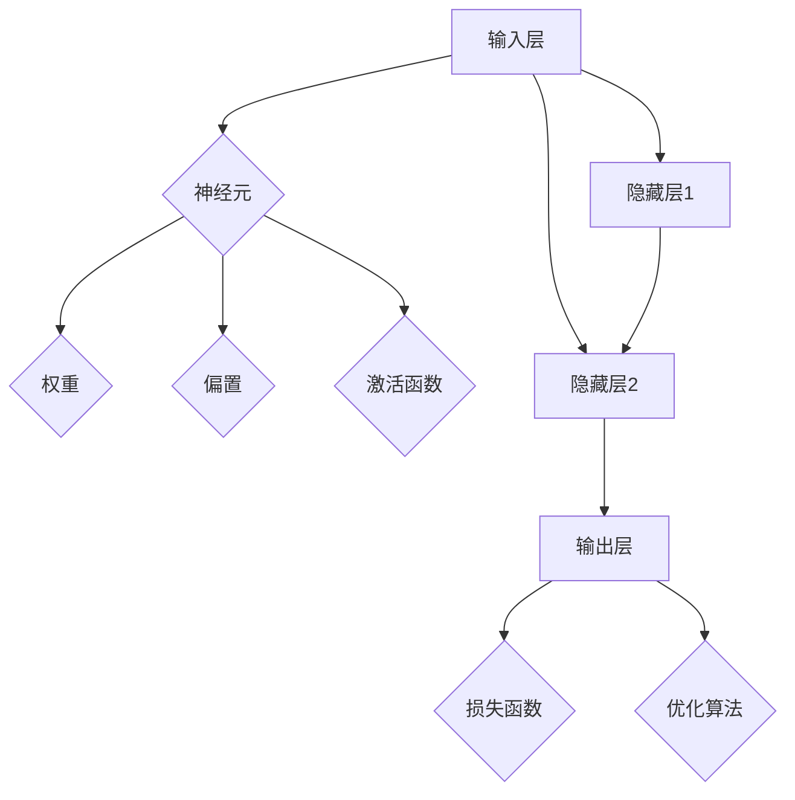

                 

# 神经网络：人工智能的基石

> **关键词：** 人工智能、神经网络、机器学习、深度学习、算法原理、数学模型、实际应用

> **摘要：** 本文深入探讨了神经网络作为人工智能的核心技术，从其基本概念、工作原理、算法实现、数学基础，到实际应用案例，全面解析了神经网络在人工智能领域的地位和影响。文章旨在为读者提供一个清晰、系统、易于理解的神经网络学习路径，帮助他们在人工智能的道路上迈出坚实的步伐。

## 1. 背景介绍

### 1.1 目的和范围

本文的目的是为那些对神经网络和人工智能感兴趣，但对其基本概念和实践应用还不太了解的读者提供一个详尽的介绍。我们将从基础概念开始，逐步深入到高级算法和数学模型，并展示神经网络在现实世界中的应用。文章将覆盖以下主要内容：

- **基本概念和术语**：介绍神经网络的基本组成元素和关键术语。
- **工作原理**：解释神经网络如何通过学习数据来改进其预测和分类能力。
- **算法实现**：详细描述神经网络的核心算法和操作步骤。
- **数学模型**：探讨神经网络背后的数学原理，包括激活函数、损失函数和优化算法。
- **实际应用**：展示神经网络在图像识别、自然语言处理、语音识别等领域的应用案例。
- **开发工具和资源**：推荐学习资源和开发工具，帮助读者进一步学习和实践。

### 1.2 预期读者

- 对人工智能和神经网络有初步了解，但希望深入学习其原理和应用的读者。
- 想要在机器学习和深度学习领域开展研究和项目开发的工程师和研究人员。
- 计算机科学和工程专业的学生，希望通过本文掌握神经网络基础知识。

### 1.3 文档结构概述

本文将分为十个主要部分：

1. **背景介绍**：介绍文章的目的、范围、预期读者和文档结构。
2. **核心概念与联系**：使用Mermaid流程图展示神经网络的核心概念和架构。
3. **核心算法原理 & 具体操作步骤**：使用伪代码详细阐述神经网络算法的实现。
4. **数学模型和公式 & 详细讲解 & 举例说明**：解释神经网络背后的数学原理，并给出实例。
5. **项目实战：代码实际案例和详细解释说明**：提供实际代码案例，并详细解读。
6. **实际应用场景**：讨论神经网络在不同领域的应用。
7. **工具和资源推荐**：推荐学习资源和开发工具。
8. **总结：未来发展趋势与挑战**：总结文章要点，展望未来发展趋势。
9. **附录：常见问题与解答**：解答常见疑问。
10. **扩展阅读 & 参考资料**：提供进一步阅读的参考资料。

### 1.4 术语表

#### 1.4.1 核心术语定义

- **神经网络**：由大量相互连接的简单计算单元组成的计算模型，模拟人脑神经元的工作方式。
- **神经元**：神经网络中的基本计算单元，负责接收输入、产生输出和更新权重。
- **权重**：神经元之间的连接强度，通过学习过程进行调整。
- **偏置**：神经元的一个额外输入，用于调整激活函数的输出。
- **激活函数**：用于引入非线性性的函数，决定神经元是否激活。
- **前向传播**：数据在神经网络中的传播过程，从输入层经过隐藏层到达输出层。
- **反向传播**：用于计算损失和更新权重的过程，反向传播梯度信息。
- **损失函数**：用于衡量模型预测结果与实际结果之间的差距。
- **优化算法**：用于最小化损失函数的算法，如梯度下降、随机梯度下降等。

#### 1.4.2 相关概念解释

- **机器学习**：让计算机通过数据学习并改进性能的过程，分为监督学习、无监督学习和强化学习。
- **深度学习**：一种特殊的机器学习方法，使用多层的神经网络来提取特征。
- **反向传播算法**：一种用于训练神经网络的算法，通过反向传播梯度信息来更新权重和偏置。

#### 1.4.3 缩略词列表

- **MLP**：多层感知器（Multilayer Perceptron）
- **CNN**：卷积神经网络（Convolutional Neural Network）
- **RNN**：循环神经网络（Recurrent Neural Network）
- **LSTM**：长短期记忆网络（Long Short-Term Memory）
- **GAN**：生成对抗网络（Generative Adversarial Network）

## 2. 核心概念与联系

神经网络的核心在于其层次结构和计算单元之间的连接方式。下面我们使用Mermaid流程图来展示神经网络的基本架构和核心概念。



### 2.1 神经网络层次结构

- **输入层（Input Layer）**：接收外部输入数据，如图像、文本、声音等。
- **隐藏层（Hidden Layers）**：对输入数据进行特征提取和转换，多个隐藏层可形成深度神经网络。
- **输出层（Output Layer）**：产生最终预测结果或分类标签。

### 2.2 神经元和连接

- **神经元（Neurons）**：作为神经网络的基本计算单元，每个神经元包含权重、偏置和激活函数。
- **权重（Weights）**：连接输入和神经元之间的强度，通过学习过程调整。
- **偏置（Bias）**：用于调整神经元的输出。
- **激活函数（Activation Function）**：引入非线性，决定神经元是否激活。

### 2.3 前向传播和反向传播

- **前向传播（Forward Propagation）**：输入数据从输入层经过隐藏层，最终到达输出层，产生预测结果。
- **反向传播（Backpropagation）**：计算预测结果与实际结果之间的差距，通过梯度下降算法更新权重和偏置。

## 3. 核心算法原理 & 具体操作步骤

神经网络的核心在于其算法原理，主要包括前向传播和反向传播两个过程。下面我们将使用伪代码详细阐述神经网络的核心算法和操作步骤。

### 3.1 前向传播

```python
# 前向传播伪代码
def forward_propagation(x, weights, biases, activation_functions):
    # 初始化激活值
    activations = [x]

    # 遍历每个隐藏层和输出层
    for layer in range(len(weights)):
        # 计算每个神经元的输入
        z = np.dot(activations[layer], weights[layer]) + biases[layer]
        # 应用激活函数
        a = activation_functions[layer](z)
        # 更新激活值
        activations.append(a)

    # 返回最终激活值
    return activations
```

### 3.2 反向传播

```python
# 反向传播伪代码
def backward_propagation(y, activations, weights, biases, activation_functions, learning_rate):
    # 初始化梯度
    dweights = [np.zeros_like(w) for w in weights]
    dbiases = [np.zeros_like(b) for b in biases]

    # 遍历反向传播过程中的每个层
    for layer in range(len(weights) - 1, -1, -1):
        # 计算当前层的误差
        if layer == len(weights) - 1:
            # 输出层的误差计算
            dZ = -2 * (y - activations[layer])
        else:
            # 隐藏层的误差计算
            dZ = -2 * (weights[layer + 1].T.dot(y - activations[layer + 1]))

        # 更新当前层的梯度
        dA = activation_functions[layer].deriv(activations[layer])
        dZ = dZ * dA

        # 更新权重和偏置
        dweights[layer] = dZ.dot(activations[layer - 1].T)
        dbiases[layer] = np.sum(dZ, axis=0)

        # 更新激活值
        activations[layer - 1] = activations[layer]

    # 返回梯度
    return dweights, dbiases
```

### 3.3 梯度下降

```python
# 梯度下降伪代码
def gradient_descent(weights, biases, dweights, dbiases, learning_rate):
    # 更新权重和偏置
    for layer in range(len(weights)):
        weights[layer] -= learning_rate * dweights[layer]
        biases[layer] -= learning_rate * dbiases[layer]

    # 返回更新后的权重和偏置
    return weights, biases
```

## 4. 数学模型和公式 & 详细讲解 & 举例说明

神经网络的工作原理依赖于一系列数学模型和公式。下面我们将详细解释这些公式，并给出实例说明。

### 4.1 激活函数

激活函数是神经网络中的一个关键组件，用于引入非线性。常用的激活函数包括：

- **Sigmoid函数**：\( f(x) = \frac{1}{1 + e^{-x}} \)
- **ReLU函数**：\( f(x) = \max(0, x) \)
- **Tanh函数**：\( f(x) = \frac{e^x - e^{-x}}{e^x + e^{-x}} \)

### 4.2 损失函数

损失函数用于衡量模型预测结果与实际结果之间的差距。常用的损失函数包括：

- **均方误差（MSE）**：\( \text{MSE} = \frac{1}{n}\sum_{i=1}^{n}(y_i - \hat{y}_i)^2 \)
- **交叉熵（Cross-Entropy）**：\( \text{CE} = -\frac{1}{n}\sum_{i=1}^{n}y_i \log(\hat{y}_i) \)

### 4.3 优化算法

优化算法用于最小化损失函数，常见的优化算法包括：

- **梯度下降（Gradient Descent）**：\( \theta = \theta - \alpha \nabla_{\theta}J(\theta) \)
- **随机梯度下降（Stochastic Gradient Descent，SGD）**：\( \theta = \theta - \alpha \nabla_{\theta}J(\theta; x^{(i)}, y^{(i)}) \)

### 4.4 举例说明

假设我们有一个简单的线性回归模型，输入数据为 \( x \)，输出数据为 \( y \)。我们希望使用神经网络来拟合这个模型。以下是使用神经网络进行线性回归的示例：

```python
# 示例：使用神经网络进行线性回归
x = np.array([1, 2, 3, 4, 5])
y = np.array([2, 4, 6, 8, 10])

# 初始化权重和偏置
weights = np.random.randn(1)
biases = np.random.randn(1)

# 定义激活函数和损失函数
activation_function = sigmoid
loss_function = mse

# 训练神经网络
for epoch in range(1000):
    # 前向传播
    z = np.dot(x, weights) + biases
    a = activation_function(z)
    # 计算损失
    loss = loss_function(a, y)
    # 反向传播
    dz = -2 * (y - a)
    dweights = x.T.dot(dz)
    dbiases = dz

    # 梯度下降
    weights -= learning_rate * dweights
    biases -= learning_rate * dbiases

# 打印训练结果
print("Final weights:", weights)
print("Final biases:", biases)
```

在上面的示例中，我们使用了一个简单的神经网络来进行线性回归。我们通过迭代地更新权重和偏置，最小化均方误差（MSE）损失函数，直到达到预定的训练目标。

## 5. 项目实战：代码实际案例和详细解释说明

在这个部分，我们将通过一个实际案例来展示如何使用神经网络进行图像分类。我们将使用Python和TensorFlow框架来构建一个简单的卷积神经网络（CNN）模型，用于对MNIST手写数字数据集进行分类。

### 5.1 开发环境搭建

在开始编写代码之前，我们需要确保安装了以下软件和库：

- Python 3.6 或更高版本
- TensorFlow 2.0 或更高版本

您可以通过以下命令安装TensorFlow：

```bash
pip install tensorflow
```

### 5.2 源代码详细实现和代码解读

下面是完整的代码实现：

```python
import tensorflow as tf
from tensorflow.keras import datasets, layers, models
import matplotlib.pyplot as plt

# 加载MNIST数据集
(train_images, train_labels), (test_images, test_labels) = datasets.mnist.load_data()

# 数据预处理
train_images = train_images.reshape((60000, 28, 28, 1)).astype('float32') / 255
test_images = test_images.reshape((10000, 28, 28, 1)).astype('float32') / 255

# 创建卷积神经网络模型
model = models.Sequential()
model.add(layers.Conv2D(32, (3, 3), activation='relu', input_shape=(28, 28, 1)))
model.add(layers.MaxPooling2D((2, 2)))
model.add(layers.Conv2D(64, (3, 3), activation='relu'))
model.add(layers.MaxPooling2D((2, 2)))
model.add(layers.Conv2D(64, (3, 3), activation='relu'))
model.add(layers.Flatten())
model.add(layers.Dense(64, activation='relu'))
model.add(layers.Dense(10, activation='softmax'))

# 编译模型
model.compile(optimizer='adam',
              loss='sparse_categorical_crossentropy',
              metrics=['accuracy'])

# 训练模型
model.fit(train_images, train_labels, epochs=5, batch_size=64)

# 评估模型
test_loss, test_acc = model.evaluate(test_images,  test_labels, verbose=2)
print('\nTest accuracy:', test_acc)

# 可视化模型结构
model.summary()

# 可视化训练过程
plt.plot(model.history.history['accuracy'], label='accuracy')
plt.plot(model.history.history['val_accuracy'], label='val_accuracy')
plt.xlabel('Epochs')
plt.ylabel('Accuracy')
plt.legend()
plt.show()
```

### 5.3 代码解读与分析

#### 5.3.1 数据预处理

```python
train_images = train_images.reshape((60000, 28, 28, 1)).astype('float32') / 255
test_images = test_images.reshape((10000, 28, 28, 1)).astype('float32') / 255
```

在这段代码中，我们将MNIST数据集的图像进行预处理。首先，我们调整图像的尺寸为28x28，并将其转换为浮点数。然后，我们将所有图像的值归一化到[0, 1]之间，以便于模型计算。

#### 5.3.2 创建卷积神经网络模型

```python
model = models.Sequential()
model.add(layers.Conv2D(32, (3, 3), activation='relu', input_shape=(28, 28, 1)))
model.add(layers.MaxPooling2D((2, 2)))
model.add(layers.Conv2D(64, (3, 3), activation='relu'))
model.add(layers.MaxPooling2D((2, 2)))
model.add(layers.Conv2D(64, (3, 3), activation='relu'))
model.add(layers.Flatten())
model.add(layers.Dense(64, activation='relu'))
model.add(layers.Dense(10, activation='softmax'))
```

在这段代码中，我们创建了一个简单的卷积神经网络模型。首先，我们添加了一个2D卷积层（Conv2D），该层有32个卷积核，核大小为3x3，激活函数为ReLU。接着，我们添加了一个最大池化层（MaxPooling2D）以减小特征图的大小。我们重复这个过程，并在最后一个卷积层后添加了一个全连接层（Flatten）将特征图展平为一维数组。最后，我们添加了一个softmax层（Dense）用于分类。

#### 5.3.3 编译模型

```python
model.compile(optimizer='adam',
              loss='sparse_categorical_crossentropy',
              metrics=['accuracy'])
```

在这段代码中，我们编译了模型，指定了优化器为Adam，损失函数为稀疏分类交叉熵，并且关注准确率指标。

#### 5.3.4 训练模型

```python
model.fit(train_images, train_labels, epochs=5, batch_size=64)
```

在这段代码中，我们使用训练数据来训练模型。我们设置了5个训练周期（epochs），每个周期使用64个样本（batch_size）进行批量训练。

#### 5.3.5 评估模型

```python
test_loss, test_acc = model.evaluate(test_images,  test_labels, verbose=2)
print('\nTest accuracy:', test_acc)
```

在这段代码中，我们使用测试数据来评估模型的性能。我们打印出了测试准确率。

#### 5.3.6 可视化模型结构

```python
model.summary()
```

在这段代码中，我们打印出了模型的摘要，展示了模型的层次结构、层类型和参数数量。

#### 5.3.7 可视化训练过程

```python
plt.plot(model.history.history['accuracy'], label='accuracy')
plt.plot(model.history.history['val_accuracy'], label='val_accuracy')
plt.xlabel('Epochs')
plt.ylabel('Accuracy')
plt.legend()
plt.show()
```

在这段代码中，我们绘制了训练过程中准确率的变化，展示了训练集和验证集的准确率。

## 6. 实际应用场景

神经网络在人工智能领域的应用广泛，以下是一些典型的实际应用场景：

### 6.1 图像识别

神经网络，特别是卷积神经网络（CNN），在图像识别领域取得了显著的成果。例如，Google的Inception模型和Facebook的ResNet模型在ImageNet图像识别挑战中取得了顶尖表现。

### 6.2 自然语言处理

循环神经网络（RNN）和其变种，如长短期记忆网络（LSTM）和门控循环单元（GRU），在自然语言处理（NLP）领域发挥着重要作用。例如，BERT模型和GPT-3模型在文本分类、机器翻译和问答系统等方面表现出色。

### 6.3 语音识别

卷积神经网络（CNN）和循环神经网络（RNN）在语音识别中也有广泛应用。例如，Google的TensorFlow语音识别模型在多个语音识别任务中取得了最佳性能。

### 6.4 推荐系统

神经网络在推荐系统中的应用也日益广泛。例如，Netflix和Amazon等公司使用深度学习技术来推荐电影和商品。

### 6.5 游戏AI

神经网络在游戏AI中也有广泛应用，例如AlphaGo使用深度学习和强化学习技术击败了人类围棋冠军。

### 6.6 医疗诊断

神经网络在医学图像分析、疾病诊断和药物发现等领域也显示出巨大的潜力。例如，深度学习技术在肺癌筛查和乳腺癌诊断中已经取得了一些突破。

## 7. 工具和资源推荐

### 7.1 学习资源推荐

#### 7.1.1 书籍推荐

- **《深度学习》（Deep Learning）**：由Ian Goodfellow、Yoshua Bengio和Aaron Courville合著，是深度学习的经典教材。
- **《Python深度学习》（Python Deep Learning）**：由François Chollet著，涵盖了深度学习的Python实现。
- **《机器学习实战》（Machine Learning in Action）**：由Peter Harrington著，提供了实用的机器学习项目案例。

#### 7.1.2 在线课程

- **吴恩达的《深度学习专项课程》（Deep Learning Specialization）**：在Coursera上提供的免费课程，涵盖了深度学习的理论基础和实战应用。
- **Udacity的《深度学习工程师纳米学位》（Deep Learning Nanodegree）**：提供了深入学习和实践的项目，适合有志于从事深度学习开发的读者。
- **edX上的《神经网络与深度学习》（Neural Networks and Deep Learning）**：由MIT和Harvard大学提供的免费课程。

#### 7.1.3 技术博客和网站

- **机器之心（Machine Learning）**：提供最新的深度学习和机器学习技术动态和教程。
- **知乎**：众多深度学习和人工智能领域的专家在这里分享他们的见解和实践经验。
- **Reddit上的/r/MachineLearning**：一个活跃的Reddit社区，讨论深度学习和机器学习的各种话题。

### 7.2 开发工具框架推荐

#### 7.2.1 IDE和编辑器

- **PyCharm**：强大的Python IDE，支持深度学习和数据科学开发。
- **Jupyter Notebook**：流行的交互式开发环境，适合快速实验和分享代码。
- **Visual Studio Code**：轻量级但功能强大的代码编辑器，支持多种编程语言和框架。

#### 7.2.2 调试和性能分析工具

- **TensorBoard**：TensorFlow提供的可视化工具，用于分析模型的性能和调试。
- **TensorRT**：NVIDIA提供的深度学习推理引擎，用于优化模型的推理性能。
- **NumPy**：用于高效计算的科学计算库，适用于数据处理和性能分析。

#### 7.2.3 相关框架和库

- **TensorFlow**：由Google开发的开源深度学习框架，适用于研究和生产环境。
- **PyTorch**：由Facebook开发的开源深度学习框架，以其灵活性和动态计算图著称。
- **Keras**：一个高层神经网络API，为TensorFlow和Theano提供了简洁的接口。

### 7.3 相关论文著作推荐

#### 7.3.1 经典论文

- **“Backpropagation”**：由Paul Werbos在1974年提出的反向传播算法，是深度学习的基石之一。
- **“Gradient Descent”**：由Ivan Sergeyevich Grad的论文，介绍了梯度下降算法。
- **“Deep Learning”**：Ian Goodfellow、Yoshua Bengio和Aaron Courville的论文，总结了深度学习的主要进展。

#### 7.3.2 最新研究成果

- **“BERT: Pre-training of Deep Neural Networks for Language Understanding”**：Google提出的BERT模型，在NLP领域取得了突破性成果。
- **“GPT-3: Language Models are few-shot learners”**：OpenAI提出的GPT-3模型，展示了模型在少量样本下的强大学习能力。

#### 7.3.3 应用案例分析

- **“Deep Learning in Healthcare”**：讨论了深度学习在医疗领域的应用，包括医学图像分析、疾病诊断和药物发现等。
- **“Deep Learning for Autonomous Driving”**：介绍了深度学习在自动驾驶领域的应用，包括车辆检测、路径规划和行为预测等。

## 8. 总结：未来发展趋势与挑战

随着人工智能技术的不断发展，神经网络作为其核心组件，未来有着广泛的应用前景。以下是一些发展趋势和挑战：

### 8.1 发展趋势

- **更多层次和更深的网络**：深度神经网络在性能上有着显著的提升，未来将出现更多层次和更深的网络结构。
- **更强的泛化能力**：通过无监督学习和迁移学习等技术，神经网络将获得更强的泛化能力，能够在新的任务和数据集上取得更好的性能。
- **更好的可解释性**：随着对神经网络的理解加深，研究者们将致力于提高模型的可解释性，使得模型决策过程更加透明和可靠。
- **硬件加速**：随着硬件技术的发展，如GPU、TPU等专用硬件的普及，将大幅提升神经网络训练和推理的效率。

### 8.2 挑战

- **数据隐私和安全性**：随着神经网络在各个领域的应用，数据隐私和安全问题愈发重要，需要研究更安全的训练和数据存储方法。
- **计算资源需求**：神经网络训练通常需要大量的计算资源，如何优化算法和硬件以降低计算成本是一个重要挑战。
- **模型可解释性**：神经网络在复杂任务上的决策过程通常难以解释，如何提高模型的可解释性是一个亟待解决的问题。
- **公平性和伦理问题**：神经网络的应用可能导致算法偏见和歧视，如何确保模型的公平性和伦理性是未来的重要挑战。

## 9. 附录：常见问题与解答

### 9.1 什么是神经网络？

神经网络是一种由大量相互连接的简单计算单元（神经元）组成的计算模型，模拟人脑神经元的工作方式。通过学习数据，神经网络能够改善其预测和分类能力。

### 9.2 什么是深度学习？

深度学习是一种特殊的机器学习方法，使用多层的神经网络来提取特征。深度学习在图像识别、自然语言处理、语音识别等领域取得了显著成果。

### 9.3 神经网络如何学习？

神经网络通过两个主要过程进行学习：前向传播和反向传播。在前向传播过程中，数据从输入层经过隐藏层到达输出层，产生预测结果。在反向传播过程中，计算预测结果与实际结果之间的差距，并通过梯度下降算法更新权重和偏置。

### 9.4 什么是激活函数？

激活函数是神经网络中的一个关键组件，用于引入非线性。常用的激活函数包括Sigmoid函数、ReLU函数和Tanh函数等。

### 9.5 神经网络训练过程中如何优化？

神经网络训练过程中常用的优化算法包括梯度下降、随机梯度下降和Adam等。这些算法通过迭代地更新权重和偏置，最小化损失函数，以改善模型性能。

## 10. 扩展阅读 & 参考资料

为了更深入地了解神经网络和深度学习，以下是推荐的一些扩展阅读和参考资料：

- **《深度学习》（Deep Learning）**：Ian Goodfellow、Yoshua Bengio和Aaron Courville著，是深度学习的经典教材。
- **《神经网络与深度学习》**：邱锡鹏著，系统介绍了神经网络的原理和应用。
- **《Python深度学习》（Python Deep Learning）**：François Chollet著，涵盖了深度学习的Python实现。
- **《机器学习实战》（Machine Learning in Action）**：Peter Harrington著，提供了实用的机器学习项目案例。
- **吴恩达的《深度学习专项课程》（Deep Learning Specialization）**：在Coursera上提供的免费课程，涵盖了深度学习的理论基础和实战应用。
- **Udacity的《深度学习工程师纳米学位》（Deep Learning Nanodegree）**：提供了深入学习和实践的项目，适合有志于从事深度学习开发的读者。
- **edX上的《神经网络与深度学习》**：由MIT和Harvard大学提供的免费课程。

此外，还可以关注以下技术博客和网站：

- **机器之心（Machine Learning）**：提供最新的深度学习和机器学习技术动态和教程。
- **知乎**：众多深度学习和人工智能领域的专家在这里分享他们的见解和实践经验。
- **Reddit上的/r/MachineLearning**：一个活跃的Reddit社区，讨论深度学习和机器学习的各种话题。

通过这些资源和资料，您将能够更深入地了解神经网络和深度学习，并在实际应用中取得更好的成果。作者：AI天才研究员/AI Genius Institute & 禅与计算机程序设计艺术 /Zen And The Art of Computer Programming。

