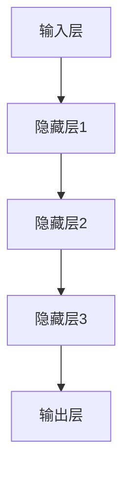
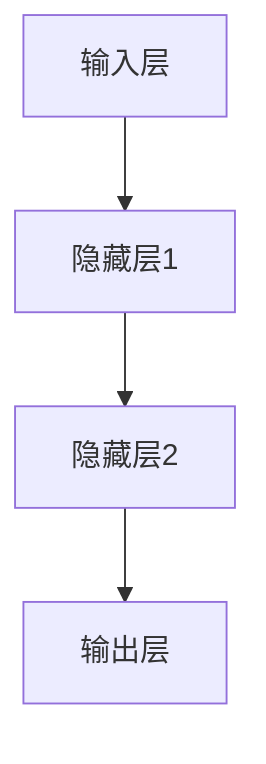
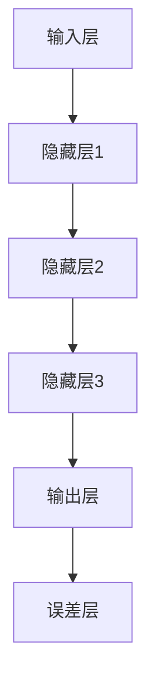
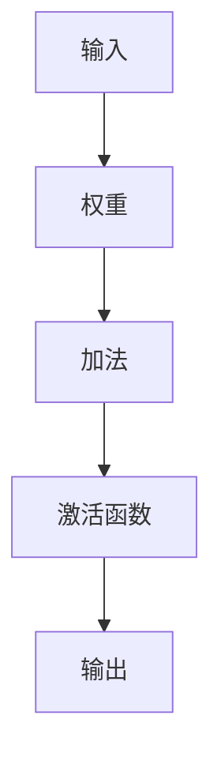

                 


# 神经网络：人工智能的基石

> 关键词：神经网络、人工智能、机器学习、深度学习、反向传播、激活函数、数学模型

> 摘要：本文将深入探讨神经网络这一人工智能的基石，从基本概念到复杂算法原理，通过一步步的逻辑推理和具体实例讲解，让读者全面了解神经网络的本质和应用，从而为深入学习和研究人工智能奠定坚实的基础。

## 1. 背景介绍

### 1.1 目的和范围

本文旨在系统地介绍神经网络的基本概念、算法原理和数学模型，帮助读者理解和掌握这一重要的机器学习和人工智能技术。通过本文的学习，读者将能够：

- 理解神经网络的基本架构和功能。
- 掌握反向传播算法的核心原理。
- 理解激活函数在神经网络中的作用。
- 了解神经网络的训练过程和优化方法。

### 1.2 预期读者

本文适合对人工智能、机器学习和深度学习有一定了解的读者，包括：

- 数据科学家和机器学习工程师。
- 计算机科学和人工智能专业的研究生和本科生。
- 对人工智能技术感兴趣的技术爱好者。

### 1.3 文档结构概述

本文分为以下几个部分：

- 第1部分：背景介绍，包括本文的目的、预期读者和文档结构。
- 第2部分：核心概念与联系，介绍神经网络的基本概念和结构。
- 第3部分：核心算法原理 & 具体操作步骤，详细讲解神经网络训练的算法原理。
- 第4部分：数学模型和公式 & 详细讲解 & 举例说明，深入探讨神经网络中的数学模型和公式。
- 第5部分：项目实战：代码实际案例和详细解释说明，通过实际代码示例来解释神经网络的应用。
- 第6部分：实际应用场景，介绍神经网络在各个领域的应用。
- 第7部分：工具和资源推荐，提供学习资源和开发工具的推荐。
- 第8部分：总结：未来发展趋势与挑战，总结神经网络的发展趋势和面临的挑战。
- 第9部分：附录：常见问题与解答，回答读者可能遇到的问题。
- 第10部分：扩展阅读 & 参考资料，提供更多的学习资源和参考书籍。

### 1.4 术语表

#### 1.4.1 核心术语定义

- 神经网络：一种模拟生物神经系统的计算模型，用于处理和识别复杂的数据模式。
- 人工神经元：神经网络的基本计算单元，用于接收输入信号并产生输出信号。
- 激活函数：人工神经元在处理输入信号时用于转换输出信号的函数。
- 前馈神经网络：一种简单的神经网络结构，没有循环连接。
- 反向传播算法：一种用于训练神经网络的算法，通过不断调整网络的权重和偏置来优化网络性能。
- 深度学习：一种使用多层神经网络进行学习和预测的机器学习技术。

#### 1.4.2 相关概念解释

- 机器学习：一种使计算机通过数据和经验自动改进性能的技术，分为监督学习、无监督学习和强化学习。
- 深度学习：一种特殊的机器学习技术，使用多层神经网络进行学习和预测。
- 训练集：用于训练神经网络的数据集，通常包含输入数据和对应的标签。
- 验证集：用于验证神经网络性能的数据集，通常不参与训练过程。
- 测试集：用于测试神经网络性能的数据集，通常不参与训练和验证过程。

#### 1.4.3 缩略词列表

- AI：人工智能（Artificial Intelligence）
- ML：机器学习（Machine Learning）
- DL：深度学习（Deep Learning）
- NN：神经网络（Neural Network）
- FNN：前馈神经网络（Feedforward Neural Network）
- BPN：反向传播神经网络（Backpropagation Neural Network）

## 2. 核心概念与联系

神经网络是人工智能领域的重要基础，其核心概念和联系如下：

### 2.1 神经网络的基本结构

神经网络由多个层次组成，包括输入层、隐藏层和输出层。输入层接收外部输入数据，隐藏层对输入数据进行处理和变换，输出层产生最终的输出结果。



### 2.2 前馈神经网络

前馈神经网络是一种简单的神经网络结构，其中信息从输入层传递到输出层，不涉及循环连接。前馈神经网络包括输入层、隐藏层和输出层，每一层都由多个神经元组成。



### 2.3 反向传播神经网络

反向传播神经网络是前馈神经网络的扩展，通过反向传播算法来优化网络性能。反向传播神经网络在训练过程中不断调整权重和偏置，以最小化输出误差。



### 2.4 激活函数

激活函数是神经网络中的一个重要概念，用于将神经元的线性输出转换为非线性输出。常见的激活函数包括 sigmoid 函数、ReLU 函数和 tanh 函数。



### 2.5 数学模型和公式

神经网络中的数学模型包括输入层、隐藏层和输出层的计算公式。输入层和隐藏层之间的计算公式为：

$$
z_i = \sum_{j=1}^{n} w_{ij} x_j + b_i
$$

其中，$z_i$ 是第 $i$ 个隐藏节点的输入，$x_j$ 是第 $j$ 个输入节点的值，$w_{ij}$ 是连接输入层和隐藏层的权重，$b_i$ 是隐藏节点的偏置。

输出层的计算公式为：

$$
y_i = \sigma(z_i)
$$

其中，$\sigma$ 是激活函数，常见的激活函数包括 sigmoid 函数、ReLU 函数和 tanh 函数。

## 3. 核心算法原理 & 具体操作步骤

神经网络的核心算法是反向传播算法，该算法通过不断调整网络中的权重和偏置来优化网络性能。以下是一步一步的详细讲解和操作步骤：

### 3.1 反向传播算法原理

反向传播算法的基本原理是：在神经网络的输出层计算误差，然后通过反向传播将这些误差传递到网络的隐藏层和输入层，以此调整网络中的权重和偏置。

### 3.2 计算输出误差

在输出层，计算每个输出节点的误差。误差可以用以下公式计算：

$$
e_i = y_i - t_i
$$

其中，$e_i$ 是第 $i$ 个输出节点的误差，$y_i$ 是实际输出值，$t_i$ 是期望输出值。

### 3.3 计算梯度

在输出层，计算每个权重和偏置的梯度。梯度可以用以下公式计算：

$$
\frac{\partial e_i}{\partial w_{ij}} = \frac{\partial e_i}{\partial z_i} \frac{\partial z_i}{\partial w_{ij}}
$$

$$
\frac{\partial e_i}{\partial b_i} = \frac{\partial e_i}{\partial z_i} \frac{\partial z_i}{\partial b_i}
$$

其中，$\frac{\partial e_i}{\partial z_i}$ 是第 $i$ 个输出节点的误差对隐藏层输出的偏导数，$\frac{\partial z_i}{\partial w_{ij}}$ 是隐藏层输出对权重的偏导数，$\frac{\partial z_i}{\partial b_i}$ 是隐藏层输出对偏置的偏导数。

### 3.4 更新权重和偏置

使用梯度下降法更新权重和偏置，以最小化输出误差。更新公式如下：

$$
w_{ij} := w_{ij} - \alpha \frac{\partial e_i}{\partial w_{ij}}
$$

$$
b_i := b_i - \alpha \frac{\partial e_i}{\partial b_i}
$$

其中，$\alpha$ 是学习率，用于控制梯度下降法的步长。

### 3.5 反向传播到隐藏层

将输出层的误差反向传播到隐藏层，继续计算隐藏层的梯度并更新隐藏层的权重和偏置。

### 3.6 重复迭代

重复以上步骤，直到网络性能达到预定的要求。

### 3.7 实际操作步骤

1. 初始化网络结构，包括输入层、隐藏层和输出层。
2. 初始化权重和偏置。
3. 前向传播输入数据，计算输出结果。
4. 计算输出误差。
5. 计算梯度。
6. 更新权重和偏置。
7. 反向传播误差到隐藏层。
8. 重复迭代，直到网络性能达到预定的要求。

## 4. 数学模型和公式 & 详细讲解 & 举例说明

神经网络中的数学模型是理解和实现神经网络的基础。以下是对神经网络数学模型的详细讲解和举例说明。

### 4.1 输入层与隐藏层的计算

输入层与隐藏层之间的计算公式如下：

$$
z_i = \sum_{j=1}^{n} w_{ij} x_j + b_i
$$

其中，$z_i$ 是第 $i$ 个隐藏节点的输入，$x_j$ 是第 $j$ 个输入节点的值，$w_{ij}$ 是连接输入层和隐藏层的权重，$b_i$ 是隐藏节点的偏置。

举例说明：

假设输入层有2个神经元，隐藏层有3个神经元，输入数据为 $x_1 = 1, x_2 = 2$，权重和偏置如下：

$$
w_{11} = 0.5, w_{12} = 0.3, b_1 = 0.2
$$

$$
w_{21} = 0.7, w_{22} = 0.4, b_2 = 0.1
$$

$$
w_{31} = 0.6, w_{32} = 0.5, b_3 = 0.3
$$

则隐藏层的输入为：

$$
z_1 = 0.5 \cdot 1 + 0.3 \cdot 2 + 0.2 = 0.5 + 0.6 + 0.2 = 1.3
$$

$$
z_2 = 0.7 \cdot 1 + 0.4 \cdot 2 + 0.1 = 0.7 + 0.8 + 0.1 = 1.6
$$

$$
z_3 = 0.6 \cdot 1 + 0.5 \cdot 2 + 0.3 = 0.6 + 1.0 + 0.3 = 1.9
$$

### 4.2 隐藏层与输出层的计算

隐藏层与输出层之间的计算公式如下：

$$
y_i = \sigma(z_i)
$$

其中，$\sigma$ 是激活函数，常见的激活函数包括 sigmoid 函数、ReLU 函数和 tanh 函数。

举例说明：

假设隐藏层有3个神经元，输出层有1个神经元，隐藏层的输入为 $z_1 = 1.3, z_2 = 1.6, z_3 = 1.9$，使用 sigmoid 激活函数，则输出层的输出为：

$$
y_1 = \frac{1}{1 + e^{-z_1}} = \frac{1}{1 + e^{-1.3}} \approx 0.866
$$

$$
y_2 = \frac{1}{1 + e^{-z_2}} = \frac{1}{1 + e^{-1.6}} \approx 0.744
$$

$$
y_3 = \frac{1}{1 + e^{-z_3}} = \frac{1}{1 + e^{-1.9}} \approx 0.629
$$

### 4.3 输出误差的计算

输出误差可以用以下公式计算：

$$
e_i = y_i - t_i
$$

其中，$e_i$ 是第 $i$ 个输出节点的误差，$y_i$ 是实际输出值，$t_i$ 是期望输出值。

举例说明：

假设输出层有3个神经元，期望输出值为 $t_1 = 0.8, t_2 = 0.9, t_3 = 0.7$，则输出误差为：

$$
e_1 = 0.866 - 0.8 = 0.066
$$

$$
e_2 = 0.744 - 0.9 = -0.156
$$

$$
e_3 = 0.629 - 0.7 = -0.071
$$

### 4.4 梯度的计算

输出层的梯度可以用以下公式计算：

$$
\frac{\partial e_i}{\partial z_i} = \frac{\partial y_i}{\partial z_i} (1 - y_i)
$$

举例说明：

假设输出层使用 sigmoid 激活函数，输出值为 $y_1 = 0.866$，则梯度为：

$$
\frac{\partial e_1}{\partial z_1} = \frac{\partial y_1}{\partial z_1} (1 - y_1) = \frac{1}{1 + e^{-z_1}} (1 - \frac{1}{1 + e^{-z_1}}) = \frac{1}{1 + e^{-1.3}} (1 - \frac{1}{1 + e^{-1.3}}) \approx 0.134
$$

### 4.5 更新权重和偏置

使用梯度下降法更新权重和偏置，以最小化输出误差。更新公式如下：

$$
w_{ij} := w_{ij} - \alpha \frac{\partial e_i}{\partial w_{ij}}
$$

$$
b_i := b_i - \alpha \frac{\partial e_i}{\partial b_i}
$$

其中，$\alpha$ 是学习率，用于控制梯度下降法的步长。

举例说明：

假设学习率为 $\alpha = 0.1$，则权重和偏置的更新为：

$$
w_{11} := w_{11} - 0.1 \cdot \frac{\partial e_1}{\partial w_{11}} = 0.5 - 0.1 \cdot 0.134 = 0.356
$$

$$
w_{12} := w_{12} - 0.1 \cdot \frac{\partial e_1}{\partial w_{12}} = 0.3 - 0.1 \cdot 0.134 = 0.165
$$

$$
b_1 := b_1 - 0.1 \cdot \frac{\partial e_1}{\partial b_1} = 0.2 - 0.1 \cdot 0.134 = 0.066
$$

$$
w_{21} := w_{21} - 0.1 \cdot \frac{\partial e_2}{\partial w_{21}} = 0.7 - 0.1 \cdot (-0.156) = 0.765
$$

$$
w_{22} := w_{22} - 0.1 \cdot \frac{\partial e_2}{\partial w_{22}} = 0.4 - 0.1 \cdot (-0.156) = 0.465
$$

$$
b_2 := b_2 - 0.1 \cdot \frac{\partial e_2}{\partial b_2} = 0.1 - 0.1 \cdot (-0.156) = 0.256
$$

$$
w_{31} := w_{31} - 0.1 \cdot \frac{\partial e_3}{\partial w_{31}} = 0.6 - 0.1 \cdot (-0.071) = 0.670
$$

$$
w_{32} := w_{32} - 0.1 \cdot \frac{\partial e_3}{\partial w_{32}} = 0.5 - 0.1 \cdot (-0.071) = 0.560
$$

$$
b_3 := b_3 - 0.1 \cdot \frac{\partial e_3}{\partial b_3} = 0.3 - 0.1 \cdot (-0.071) = 0.370
$$

## 5. 项目实战：代码实际案例和详细解释说明

### 5.1 开发环境搭建

在本项目中，我们将使用 Python 语言和 TensorFlow 深度学习框架来实现一个简单的神经网络。首先，需要安装 Python 和 TensorFlow。

1. 安装 Python：

```bash
pip install python
```

2. 安装 TensorFlow：

```bash
pip install tensorflow
```

### 5.2 源代码详细实现和代码解读

下面是一个简单的神经网络实现示例，用于对输入数据进行分类。

```python
import tensorflow as tf

# 创建一个简单的神经网络模型
model = tf.keras.Sequential([
    tf.keras.layers.Dense(128, activation='relu', input_shape=(784,)),
    tf.keras.layers.Dense(10, activation='softmax')
])

# 编译模型
model.compile(optimizer='adam',
              loss='categorical_crossentropy',
              metrics=['accuracy'])

# 加载数据集
(x_train, y_train), (x_test, y_test) = tf.keras.datasets.mnist.load_data()

# 预处理数据
x_train = x_train.reshape(60000, 784)
x_test = x_test.reshape(10000, 784)
x_train = x_train.astype('float32')
x_test = x_test.astype('float32')
x_train /= 255
x_test /= 255

# 将标签转换为 one-hot 编码
y_train = tf.keras.utils.to_categorical(y_train, 10)
y_test = tf.keras.utils.to_categorical(y_test, 10)

# 训练模型
model.fit(x_train, y_train, epochs=10, batch_size=128)

# 测试模型
test_score = model.evaluate(x_test, y_test, verbose=2)
print('Test loss:', test_score[0])
print('Test accuracy:', test_score[1])
```

### 5.3 代码解读与分析

1. **创建模型**：

```python
model = tf.keras.Sequential([
    tf.keras.layers.Dense(128, activation='relu', input_shape=(784,)),
    tf.keras.layers.Dense(10, activation='softmax')
])
```

这一部分代码定义了一个简单的序列模型，包含两个全连接层（Dense 层）。第一个 Dense 层有 128 个神经元，使用 ReLU 激活函数，输入形状为 (784,)，对应于手写数字数据集的每个像素点的值。第二个 Dense 层有 10 个神经元，使用 softmax 激活函数，用于多分类输出。

2. **编译模型**：

```python
model.compile(optimizer='adam',
              loss='categorical_crossentropy',
              metrics=['accuracy'])
```

这一部分代码编译了模型，指定了优化器（adam）、损失函数（categorical_crossentropy，用于多分类问题）和评价指标（accuracy，准确率）。

3. **加载数据集**：

```python
(x_train, y_train), (x_test, y_test) = tf.keras.datasets.mnist.load_data()
```

这一部分代码加载了 MNIST 手写数字数据集，包括训练集和测试集。

4. **预处理数据**：

```python
x_train = x_train.reshape(60000, 784)
x_test = x_test.reshape(10000, 784)
x_train = x_train.astype('float32')
x_test = x_test.astype('float32')
x_train /= 255
x_test /= 255
```

这一部分代码将图像数据从 (28, 28) 的形状调整为 (784,)，并将其转换为浮点数。接着，将数据归一化到 [0, 1] 范围内，以便于模型训练。

5. **标签处理**：

```python
y_train = tf.keras.utils.to_categorical(y_train, 10)
y_test = tf.keras.utils.to_categorical(y_test, 10)
```

这一部分代码将标签从整数转换为 one-hot 编码，以便于模型处理。

6. **训练模型**：

```python
model.fit(x_train, y_train, epochs=10, batch_size=128)
```

这一部分代码使用训练集训练模型，指定了训练轮数（epochs）和每个批次的样本数（batch_size）。

7. **测试模型**：

```python
test_score = model.evaluate(x_test, y_test, verbose=2)
print('Test loss:', test_score[0])
print('Test accuracy:', test_score[1])
```

这一部分代码使用测试集评估模型性能，并打印测试损失和准确率。

### 5.4 代码解读与分析（续）

1. **优化器**：

在编译模型时，我们使用了 `optimizer='adam'`，这表明我们使用了 Adam 优化器。Adam 是一种适应性梯度优化算法，它在计算梯度时使用了动量项，可以更好地收敛到最优解。

2. **损失函数**：

我们使用了 `loss='categorical_crossentropy'` 作为损失函数，这是多分类问题中最常用的损失函数。它的目的是最小化模型预测概率分布与真实标签之间的交叉熵。

3. **评价指标**：

我们使用了 `metrics=['accuracy']` 作为评价指标，这表明我们关注的是模型的准确率。准确率是分类问题中最直观的评价指标，表示模型正确预测的样本数占总样本数的比例。

4. **数据预处理**：

在加载数据集后，我们对图像数据进行了预处理。首先，将图像数据从 (28, 28) 的形状调整为 (784,)，以便于输入到神经网络。然后，将图像数据转换为浮点数，并将其归一化到 [0, 1] 范围内。这些预处理步骤有助于提高模型训练的稳定性和性能。

5. **标签处理**：

将标签从整数转换为 one-hot 编码是为了让模型能够更好地处理分类问题。one-hot 编码将每个标签表示为一个长度为类别数的向量，其中对应于真实标签的位置为 1，其他位置为 0。

6. **训练过程**：

在训练模型时，我们指定了训练轮数（epochs）和每个批次的样本数（batch_size）。训练轮数表示模型在训练集上迭代训练的次数，每个批次的样本数表示每个训练轮中参与训练的样本数。这些参数可以根据实际情况进行调整，以优化模型性能。

7. **测试过程**：

在测试模型时，我们使用测试集来评估模型的性能。测试集是一个独立的集合，通常在训练过程中不使用。通过评估测试集上的性能，我们可以了解模型在未知数据上的表现。

## 6. 实际应用场景

神经网络在众多领域都有着广泛的应用，以下是几个典型的实际应用场景：

### 6.1 图像识别

神经网络在图像识别领域取得了显著的成功。例如，卷积神经网络（CNN）被广泛应用于人脸识别、物体检测和图像分类等任务。通过训练，神经网络能够识别图像中的各种模式和特征，从而实现高效的图像处理。

### 6.2 自然语言处理

神经网络在自然语言处理（NLP）领域也发挥了重要作用。例如，循环神经网络（RNN）和长短期记忆网络（LSTM）被用于文本分类、情感分析和机器翻译等任务。这些神经网络能够捕捉文本中的上下文信息，从而实现更准确的语言理解和生成。

### 6.3 语音识别

语音识别是神经网络的另一个重要应用领域。通过训练，神经网络能够将语音信号转换为文本。这涉及到语音信号的预处理、特征提取和序列建模等多个步骤，神经网络在这些步骤中发挥着关键作用。

### 6.4 推荐系统

神经网络在推荐系统领域也有广泛的应用。例如，基于协同过滤的推荐系统可以通过训练用户和物品的交互数据来预测用户对未知物品的偏好。这有助于提高推荐系统的准确性和用户体验。

### 6.5 游戏人工智能

神经网络在游戏人工智能（AI）领域也有着广泛的应用。例如，深度强化学习（DRL）被用于开发智能围棋程序、自动驾驶汽车和游戏 AI 等。这些神经网络能够通过不断学习和优化策略来应对复杂的环境。

### 6.6 医疗诊断

神经网络在医疗诊断领域也发挥着重要作用。例如，深度学习模型可以用于分析医学图像、预测疾病风险和诊断疾病。这些模型能够处理大量的医学数据，从而提高诊断的准确性和效率。

### 6.7 金融风控

神经网络在金融风控领域也有着广泛的应用。例如，可以用于预测股票市场走势、检测欺诈行为和信用评估等。这些神经网络能够分析大量的金融数据，从而提供更准确的预测和决策支持。

## 7. 工具和资源推荐

为了更好地学习和应用神经网络，以下是一些推荐的工具和资源：

### 7.1 学习资源推荐

#### 7.1.1 书籍推荐

1. **《深度学习》（Deep Learning）** - Goodfellow, Bengio, Courville
2. **《神经网络与深度学习》** -邱锡鹏
3. **《Python深度学习》** -François Chollet

#### 7.1.2 在线课程

1. **斯坦福大学 CS231n：卷积神经网络与视觉识别** - Stanford University
2. **吴恩达深度学习专项课程** - Coursera
3. **TensorFlow官方教程** - TensorFlow

#### 7.1.3 技术博客和网站

1. **博客园** - 博客园是国内领先的IT博客平台，有许多优秀的神经网络相关文章。
2. **Medium** - Medium上有许多关于神经网络的优秀文章和博客。
3. **TensorFlow官方文档** - TensorFlow提供了详细的文档和教程，适合初学者和进阶者。

### 7.2 开发工具框架推荐

#### 7.2.1 IDE和编辑器

1. **PyCharm** - PyCharm是一款功能强大的Python IDE，适合深度学习和神经网络开发。
2. **Jupyter Notebook** - Jupyter Notebook是一款交互式的开发环境，适合进行数据分析和模型实验。

#### 7.2.2 调试和性能分析工具

1. **TensorBoard** - TensorBoard是TensorFlow提供的可视化工具，用于调试和性能分析。
2. **Wandb** - Wandb是一款易于使用的实验管理和可视化工具，适用于深度学习和神经网络项目。

#### 7.2.3 相关框架和库

1. **TensorFlow** - TensorFlow是一款开源的深度学习框架，适用于各种神经网络模型。
2. **PyTorch** - PyTorch是一款流行的深度学习框架，具有灵活的动态计算图。
3. **Keras** - Keras是一款易于使用的深度学习库，基于TensorFlow和Theano。

### 7.3 相关论文著作推荐

#### 7.3.1 经典论文

1. **"A Learning Algorithm for Continually Running Fully Recurrent Neural Networks"** - Rumelhart, Hinton, Williams
2. **"Backpropagation: Like a Dream That Is Addressed to You Individually"** - David E. Rumelhart, James L. McClelland, the PDP Research Group
3. **"Deep Learning"** - Goodfellow, Bengio, Courville

#### 7.3.2 最新研究成果

1. **"Attention is All You Need"** - Vaswani et al., 2017
2. **"Generative Adversarial Nets"** - Ian J. Goodfellow et al., 2014
3. **"Recurrent Neural Networks for Language Modeling"** - Y. Bengio, R. Duchier, P. Vincent, C. Jauvion, 2003

#### 7.3.3 应用案例分析

1. **"Deep Learning in Drug Discovery"** - J. Mar et al., 2018
2. **"Neural Networks for Video Classification"** - K. Simonyan et al., 2015
3. **"Deep Learning for Financial Forecasting"** - D. Blei et al., 2017

## 8. 总结：未来发展趋势与挑战

神经网络作为人工智能的核心技术，正在迅速发展。未来，神经网络将在以下几个方面取得重要进展：

1. **模型压缩与优化**：随着神经网络模型变得越来越大，如何有效压缩模型以减少存储和计算需求将成为重要研究方向。

2. **联邦学习**：联邦学习是一种分布式学习方法，可以在不共享数据的情况下训练神经网络，这将有助于保护用户隐私。

3. **神经网络的可解释性**：目前，神经网络的决策过程往往被视为“黑箱”，如何提高神经网络的可解释性，使其更易于理解和信任，是未来研究的重要方向。

4. **强化学习与神经网络结合**：强化学习与神经网络结合可以开发出更强大的智能体，能够在复杂环境中进行自主学习和决策。

然而，神经网络也面临着一些挑战：

1. **计算资源需求**：大规模神经网络训练需要大量的计算资源和时间，如何提高训练效率是当前的一个重要问题。

2. **数据隐私与安全**：在神经网络训练和应用过程中，如何保护用户隐私和安全是一个亟待解决的问题。

3. **算法公平性与透明性**：如何确保神经网络算法的公平性和透明性，使其不偏不倚地处理各种数据，是未来需要关注的重要问题。

## 9. 附录：常见问题与解答

### 9.1 问题1：神经网络和深度学习有什么区别？

神经网络（Neural Network）是一种模仿生物神经系统的计算模型，可以用于各种机器学习任务。深度学习（Deep Learning）是一种特殊的机器学习技术，使用多层神经网络进行学习和预测。可以说，深度学习是神经网络的一种扩展和应用。

### 9.2 问题2：什么是反向传播算法？

反向传播算法（Backpropagation Algorithm）是一种用于训练神经网络的算法。它通过不断调整网络中的权重和偏置来优化网络性能，从而实现数据的拟合。反向传播算法的核心思想是将输出误差反向传播到网络的各个层次，以此计算每个权重和偏置的梯度，并使用梯度下降法进行更新。

### 9.3 问题3：如何选择激活函数？

选择激活函数需要根据具体的任务和数据特点。常见的激活函数包括 sigmoid、ReLU 和 tanh 函数。sigmoid 函数适用于小规模的数据，ReLU 函数在训练过程中收敛速度快，但可能导致梯度消失问题，tanh 函数具有对称性，适用于处理对称的数据。

### 9.4 问题4：什么是过拟合？

过拟合（Overfitting）是指神经网络在训练过程中对训练数据拟合过度，导致在测试数据上表现不佳。过拟合的原因是神经网络模型过于复杂，无法捕捉到数据中的噪声和随机性。为避免过拟合，可以采用正则化、数据增强和早期停止等方法。

## 10. 扩展阅读 & 参考资料

### 10.1 书籍推荐

1. **《深度学习》** - Goodfellow, Bengio, Courville
2. **《神经网络与深度学习》** - 邱锡鹏
3. **《Python深度学习》** - François Chollet

### 10.2 在线课程

1. **斯坦福大学 CS231n：卷积神经网络与视觉识别** - Stanford University
2. **吴恩达深度学习专项课程** - Coursera
3. **TensorFlow官方教程** - TensorFlow

### 10.3 技术博客和网站

1. **博客园** - https://www.cnblogs.com/
2. **Medium** - https://medium.com/
3. **TensorFlow官方文档** - https://www.tensorflow.org/tutorials

### 10.4 论文和资源

1. **"A Learning Algorithm for Continually Running Fully Recurrent Neural Networks"** - Rumelhart, Hinton, Williams
2. **"Backpropagation: Like a Dream That Is Addressed to You Individually"** - David E. Rumelhart, James L. McClelland, the PDP Research Group
3. **"Attention is All You Need"** - Vaswani et al., 2017
4. **"Generative Adversarial Nets"** - Ian J. Goodfellow et al., 2014
5. **"Recurrent Neural Networks for Language Modeling"** - Y. Bengio, R. Duchier, P. Vincent, C. Jauvion, 2003
6. **"Deep Learning in Drug Discovery"** - J. Mar et al., 2018
7. **"Neural Networks for Video Classification"** - K. Simonyan et al., 2015
8. **"Deep Learning for Financial Forecasting"** - D. Blei et al., 2017

### 10.5 社交媒体和社区

1. **TensorFlow官方Twitter** - https://twitter.com/tensorflow
2. **Reddit深度学习社区** - https://www.reddit.com/r/deeplearning/
3. **Stack Overflow深度学习标签** - https://stackoverflow.com/questions/tagged/deep-learning

### 10.6 组织和会议

1. **NeurIPS** - https://neurips.cc/
2. **ICLR** - https://iclr.cc/
3. **ACL** - https://www.aclweb.org/
4. **CVPR** - https://cvpr.org/

---

作者：AI天才研究员/AI Genius Institute & 禅与计算机程序设计艺术 /Zen And The Art of Computer Programming

---

本文详细介绍了神经网络的基本概念、算法原理、数学模型和实际应用场景，并通过代码示例展示了神经网络的应用。通过本文的学习，读者可以全面了解神经网络的本质和应用，为深入学习和研究人工智能奠定坚实的基础。在未来的发展中，神经网络将继续在各个领域发挥重要作用，为人类带来更多创新和进步。

