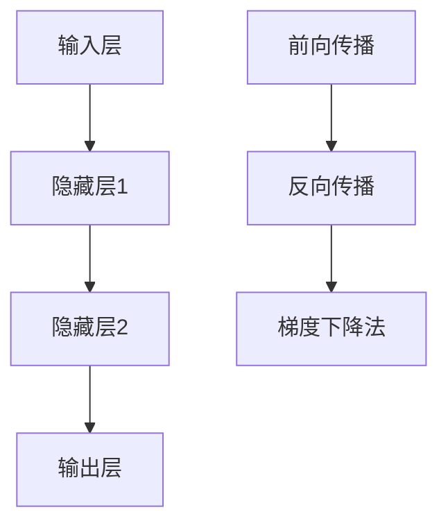

                 

### 文章标题：神经网络：人类与机器的共存

#### 关键词：神经网络、人工智能、机器学习、深度学习、人类共存

> **摘要**：本文将深入探讨神经网络这一人工智能领域的核心技术，分析其基本概念、工作原理以及与人类共存的可能性和挑战。通过逐步解析神经网络的架构、核心算法原理、数学模型，并结合实际项目案例，我们希望读者能够全面了解神经网络在推动人类与机器共存中所发挥的关键作用，并为其未来发展提供有益的思考。  

### 1. 背景介绍

#### 1.1 目的和范围

本文旨在为广大读者提供一个全面而深入的神经网络介绍，涵盖其基本概念、工作原理以及实际应用。我们希望通过逐步解析神经网络的架构、核心算法原理、数学模型，使读者能够全面了解神经网络在人工智能领域的重要性和潜力。同时，本文还将探讨神经网络与人类共存的可能性及面临的挑战，为未来的发展提供有益的思考。

#### 1.2 预期读者

本文主要面向对人工智能和神经网络有一定了解的读者，包括人工智能研究人员、开发者、算法工程师以及对该领域感兴趣的学者。然而，即使是对神经网络了解不多甚至完全陌生的读者，也能通过本文逐步建立起对这一重要技术的全面认识。

#### 1.3 文档结构概述

本文结构如下：

1. **背景介绍**：介绍本文的目的、预期读者以及文档结构。
2. **核心概念与联系**：详细阐述神经网络的架构、核心算法原理以及数学模型。
3. **核心算法原理 & 具体操作步骤**：通过伪代码讲解神经网络的核心算法原理和操作步骤。
4. **数学模型和公式 & 详细讲解 & 举例说明**：详细解析神经网络的数学模型和公式，并结合实例进行说明。
5. **项目实战：代码实际案例和详细解释说明**：通过实际项目案例展示神经网络的实现和应用。
6. **实际应用场景**：介绍神经网络在各个领域的实际应用。
7. **工具和资源推荐**：推荐学习资源、开发工具和框架。
8. **总结：未来发展趋势与挑战**：总结神经网络的发展趋势和面临的挑战。
9. **附录：常见问题与解答**：解答读者可能遇到的问题。
10. **扩展阅读 & 参考资料**：提供进一步学习的资源。

#### 1.4 术语表

##### 1.4.1 核心术语定义

- **神经网络**：由大量神经元组成的计算模型，能够通过学习数据来模拟人脑的思维方式。
- **神经元**：神经网络的基本计算单元，能够接收输入信号、进行计算并产生输出。
- **激活函数**：神经元计算过程中用于确定神经元是否激活的函数。
- **前向传播**：神经网络在训练过程中将输入数据传递到输出层的计算过程。
- **反向传播**：神经网络在训练过程中通过比较实际输出和预期输出，调整神经元之间的权重，以优化模型性能的计算过程。

##### 1.4.2 相关概念解释

- **深度学习**：一种特殊类型的机器学习，通过多层神经网络来提取数据中的特征和模式。
- **卷积神经网络（CNN）**：一种专门用于图像处理的深度学习模型，能够自动提取图像中的特征。
- **循环神经网络（RNN）**：一种用于处理序列数据的神经网络，能够捕捉序列中的时间依赖关系。
- **生成对抗网络（GAN）**：一种用于生成数据的新兴深度学习模型，由生成器和判别器两个网络组成。

##### 1.4.3 缩略词列表

- **AI**：人工智能（Artificial Intelligence）
- **ML**：机器学习（Machine Learning）
- **DL**：深度学习（Deep Learning）
- **CNN**：卷积神经网络（Convolutional Neural Network）
- **RNN**：循环神经网络（Recurrent Neural Network）
- **GAN**：生成对抗网络（Generative Adversarial Network）

### 2. 核心概念与联系

#### 2.1 神经网络架构

神经网络是模仿人脑结构和功能的一种计算模型，由大量神经元（也称为节点）组成。每个神经元都与其他神经元相连，并通过权重进行信息传递。神经网络的基本结构包括输入层、隐藏层和输出层。

- **输入层**：接收外部输入数据，每个神经元代表一个特征。
- **隐藏层**：对输入数据进行处理和变换，隐藏层可以有一个或多个。
- **输出层**：产生最终输出，用于分类、预测或其他任务。


#### 2.2 神经网络核心算法原理

神经网络的核心算法包括前向传播和反向传播。

- **前向传播**：将输入数据传递到神经网络的各个层，通过逐层计算，最终得到输出。  
  - 伪代码：
    ```python
    for each layer l in the network:
        for each neuron n in layer l:
            z[n] = sum(w[n, :] * x[:]) + b[n]
            a[n] = activation(z[n])
    ```
    其中，\(w[n, :] \)表示神经元n的权重，\(x[:] \)表示神经元n的输入，\(b[n] \)表示神经元n的偏置，\(z[n] \)表示神经元n的净输入，\(a[n] \)表示神经元n的输出。

- **反向传播**：通过比较实际输出和预期输出，计算损失函数，并使用梯度下降法调整权重和偏置，以优化模型性能。  
  - 伪代码：
    ```python
    for each layer l in the network:
        for each neuron n in layer l:
            delta[n] = (expected_output[n] - actual_output[n]) * activation_derivative(a[n])
            for each input x[i] of neuron n:
                delta[n] += w[n, i] * delta[n - 1]
            gradient[w[n, :] ] += delta[n]
            gradient[b[n]] += delta[n]
    ```

#### 2.3 数学模型和公式

神经网络的工作原理可以通过一系列数学公式来描述。

- **激活函数**：常见的激活函数包括 sigmoid、ReLU 和 tanh。  
  - sigmoid 函数：
    $$ f(x) = \frac{1}{1 + e^{-x}} $$
  - ReLU 函数：
    $$ f(x) = \max(0, x) $$
  - tanh 函数：
    $$ f(x) = \frac{e^x - e^{-x}}{e^x + e^{-x}} $$

- **损失函数**：用于衡量模型预测结果与实际结果之间的差距，常见的损失函数包括均方误差（MSE）和交叉熵（CE）。  
  - 均方误差（MSE）：
    $$ L = \frac{1}{2} \sum_{i=1}^n (y_i - \hat{y}_i)^2 $$
    其中，\(y_i \)表示实际输出，\(\hat{y}_i \)表示预测输出。
  - 交叉熵（CE）：
    $$ L = - \sum_{i=1}^n y_i \log(\hat{y}_i) $$

- **梯度下降法**：用于调整模型参数以最小化损失函数。  
  - 梯度下降法：
    $$ w := w - \alpha \cdot \nabla_w L $$
    其中，\(w \)表示模型参数，\(\alpha \)表示学习率，\(\nabla_w L \)表示损失函数关于模型参数的梯度。

#### 2.4 Mermaid 流程图

以下是神经网络的 Mermaid 流程图：



### 3. 核心算法原理 & 具体操作步骤

#### 3.1 神经网络核心算法原理

神经网络的训练过程主要包括前向传播和反向传播。

- **前向传播**：输入数据从输入层开始，通过多个隐藏层，最终传递到输出层，得到预测结果。每个神经元都会进行加权求和并应用激活函数，从而实现数据的非线性变换。
- **反向传播**：将预测结果与实际结果进行比较，计算损失函数，并使用梯度下降法调整模型参数。这个过程从输出层开始，反向传播到输入层，通过层层更新权重和偏置，使模型逐渐逼近真实值。

#### 3.2 具体操作步骤

以下是神经网络训练过程的伪代码：

```python
# 初始化模型参数
weights = initialize_weights()
biases = initialize_biases()

# 前向传播
def forward_propagation(x):
    a = x
    for layer in layers:
        z = sum(w * a) + b
        a = activation(z)
    return a

# 反向传播
def backward_propagation(y, a):
    d = (y - a) * activation_derivative(a)
    for layer in reversed(layers):
        for neuron in layer:
            delta[n] = d[n] * activation_derivative(a[n])
            d = delta[n] * w[n, :]

# 梯度下降法
def gradient_descent(learning_rate):
    for layer in layers:
        for neuron in layer:
            gradient[w[n, :]] += d[n]
            gradient[b[n]] += d[n]
    weights = weights - learning_rate * gradient
    biases = biases - learning_rate * gradient

# 训练神经网络
for epoch in range(num_epochs):
    for x, y in dataset:
        a = forward_propagation(x)
        backward_propagation(y, a)
        gradient_descent(learning_rate)
```

#### 3.3 梯度消失与梯度爆炸

在反向传播过程中，梯度的大小可能会受到激活函数的影响。对于深层神经网络，梯度消失和梯度爆炸问题是常见的挑战。

- **梯度消失**：当梯度在反向传播过程中递减时，可能导致模型参数更新不足，使得神经网络难以收敛。
- **梯度爆炸**：当梯度在反向传播过程中递增时，可能导致模型参数更新过快，使得神经网络失去稳定性。

为了避免这些问题，可以采用以下策略：

- **使用合适的激活函数**：例如，ReLU函数可以解决梯度消失问题。
- **批量归一化**：通过将每个神经元的输入和输出归一化到相同的范围，可以减少梯度消失和梯度爆炸问题。
- **学习率调整**：通过调整学习率，可以控制梯度下降的步长，从而避免过度更新模型参数。

### 4. 数学模型和公式 & 详细讲解 & 举例说明

#### 4.1 数学模型

神经网络的工作原理可以通过一系列数学模型来描述，包括线性模型、非线性模型和损失函数。

- **线性模型**：神经网络的每个神经元都可以看作是一个线性模型，其输出可以表示为：
  $$ z = \sum_{i=1}^n w_i x_i + b $$
  其中，\(w_i \)表示权重，\(x_i \)表示输入，\(b \)表示偏置。

- **非线性模型**：为了实现数据的非线性变换，神经网络引入了激活函数。常见的激活函数包括 sigmoid、ReLU 和 tanh。

- **损失函数**：用于衡量模型预测结果与实际结果之间的差距。常见的损失函数包括均方误差（MSE）和交叉熵（CE）。

#### 4.2 公式详细讲解

- **激活函数**：
  - **sigmoid 函数**：
    $$ f(x) = \frac{1}{1 + e^{-x}} $$
    sigmoid 函数的输出介于0和1之间，常用于二分类问题。
  - **ReLU 函数**：
    $$ f(x) = \max(0, x) $$
    ReLU 函数在0处发生跃变，能够加速神经网络的训练。
  - **tanh 函数**：
    $$ f(x) = \frac{e^x - e^{-x}}{e^x + e^{-x}} $$
    tanh 函数的输出介于-1和1之间，具有较好的平滑特性。

- **损失函数**：
  - **均方误差（MSE）**：
    $$ L = \frac{1}{2} \sum_{i=1}^n (y_i - \hat{y}_i)^2 $$
    其中，\(y_i \)表示实际输出，\(\hat{y}_i \)表示预测输出。
  - **交叉熵（CE）**：
    $$ L = - \sum_{i=1}^n y_i \log(\hat{y}_i) $$
    其中，\(y_i \)表示实际输出，\(\hat{y}_i \)表示预测输出。

- **梯度下降法**：
  $$ w := w - \alpha \cdot \nabla_w L $$
  其中，\(w \)表示模型参数，\(\alpha \)表示学习率，\(\nabla_w L \)表示损失函数关于模型参数的梯度。

#### 4.3 举例说明

假设我们有一个简单的神经网络，包含一个输入层、一个隐藏层和一个输出层。输入数据为\(x_1\)和\(x_2\)，隐藏层神经元为\(h_1\)和\(h_2\)，输出层神经元为\(o_1\)。

- **前向传播**：
  - 输入层到隐藏层的计算：
    $$ z_1 = w_{11} x_1 + w_{12} x_2 + b_1 $$
    $$ z_2 = w_{21} x_1 + w_{22} x_2 + b_2 $$
    $$ a_1 = \sigma(z_1) $$
    $$ a_2 = \sigma(z_2) $$
  - 隐藏层到输出层的计算：
    $$ z_3 = w_{31} a_1 + w_{32} a_2 + b_3 $$
    $$ o_1 = \sigma(z_3) $$

- **反向传播**：
  - 输出层到隐藏层的计算：
    $$ \delta_3 = (o_1 - y) \cdot \sigma'(z_3) $$
    $$ \delta_1 = \sum_{k=1}^2 w_{k3} \cdot \delta_3 \cdot \sigma'(z_k) $$
  - 隐藏层到输入层的计算：
    $$ \delta_2 = \sum_{k=1}^2 w_{k3} \cdot \delta_3 \cdot \sigma'(z_k) $$

- **梯度下降法**：
  $$ w_{11} := w_{11} - \alpha \cdot \delta_1 x_1 $$
  $$ w_{12} := w_{12} - \alpha \cdot \delta_1 x_2 $$
  $$ w_{21} := w_{21} - \alpha \cdot \delta_1 x_1 $$
  $$ w_{22} := w_{22} - \alpha \cdot \delta_1 x_2 $$
  $$ w_{31} := w_{31} - \alpha \cdot \delta_3 a_1 $$
  $$ w_{32} := w_{32} - \alpha \cdot \delta_3 a_2 $$
  $$ b_1 := b_1 - \alpha \cdot \delta_1 $$
  $$ b_2 := b_2 - \alpha \cdot \delta_1 $$
  $$ b_3 := b_3 - \alpha \cdot \delta_3 $$

### 5. 项目实战：代码实际案例和详细解释说明

#### 5.1 开发环境搭建

为了更好地理解和实现神经网络，我们需要搭建一个合适的开发环境。以下是所需工具和软件的安装步骤：

1. **Python**：安装 Python 3.x 版本，建议使用 Anaconda，方便管理和安装相关库。
2. **Jupyter Notebook**：安装 Jupyter Notebook，用于编写和运行代码。
3. **TensorFlow**：安装 TensorFlow，这是一个流行的深度学习框架，能够方便地实现神经网络。
4. **NumPy**：安装 NumPy，用于数学运算。

安装命令如下：

```bash
conda install python=3.8
conda install -c conda-forge jupyter
pip install tensorflow
pip install numpy
```

#### 5.2 源代码详细实现和代码解读

以下是一个简单的神经网络实现示例，包括输入层、一个隐藏层和一个输出层，用于实现二分类问题。

```python
import numpy as np
import tensorflow as tf

# 初始化参数
learning_rate = 0.01
num_epochs = 1000
input_size = 2
hidden_size = 4
output_size = 1

# 创建模型
model = tf.keras.Sequential([
    tf.keras.layers.Dense(hidden_size, activation='relu', input_shape=(input_size,)),
    tf.keras.layers.Dense(output_size, activation='sigmoid')
])

# 编译模型
model.compile(optimizer='adam', loss='binary_crossentropy', metrics=['accuracy'])

# 生成训练数据
x_train = np.array([[0, 0], [0, 1], [1, 0], [1, 1]])
y_train = np.array([[0], [1], [1], [0]])

# 训练模型
model.fit(x_train, y_train, epochs=num_epochs, batch_size=1)

# 测试模型
x_test = np.array([[0.5, 0.5]])
y_test = np.array([[0]])
prediction = model.predict(x_test)

print("Predicted label:", prediction[0][0])
print("Actual label:", y_test[0][0])
```

#### 5.3 代码解读与分析

1. **初始化参数**：设置学习率、训练轮数、输入层大小、隐藏层大小和输出层大小。
2. **创建模型**：使用 TensorFlow 的 `Sequential` 模型，添加一个隐藏层和一个输出层，分别使用 ReLU 和 sigmoid 激活函数。
3. **编译模型**：设置优化器、损失函数和评估指标。
4. **生成训练数据**：创建一个包含四个样本的二维数组，分别表示输入和标签。
5. **训练模型**：使用 `fit` 方法训练模型，设置训练轮数和批量大小。
6. **测试模型**：生成一个测试样本，使用 `predict` 方法预测标签，并与实际标签进行比较。

通过这个示例，我们可以看到如何使用 TensorFlow 实现一个简单的神经网络。在实际项目中，我们可以根据需求调整网络结构、优化模型参数，从而实现更复杂的任务。

### 6. 实际应用场景

神经网络在人工智能领域具有广泛的应用，以下是一些典型的实际应用场景：

1. **图像识别**：神经网络，尤其是卷积神经网络（CNN），在图像识别任务中表现出色。例如，Google 的 Inception 模型在 ImageNet 数据集上取得了显著的准确率。
2. **自然语言处理**：循环神经网络（RNN）和其变种 Long Short-Term Memory（LSTM）在自然语言处理任务中发挥了重要作用，如文本分类、机器翻译和情感分析。
3. **语音识别**：神经网络，特别是深度神经网络（DNN），在语音识别任务中具有很高的准确率。例如，Google 的语音识别系统采用了基于深度神经网络的模型。
4. **推荐系统**：神经网络可以用于构建推荐系统，通过学习用户的历史行为数据，预测用户可能感兴趣的商品或内容。
5. **自动驾驶**：神经网络在自动驾驶领域也发挥了重要作用，通过处理摄像头和激光雷达等传感器数据，实现车道保持、障碍物检测和路径规划等功能。

### 7. 工具和资源推荐

为了更好地学习和实践神经网络，以下是一些推荐的学习资源、开发工具和框架。

#### 7.1 学习资源推荐

1. **书籍推荐**：
   - 《神经网络与深度学习》（邱锡鹏）：详细介绍了神经网络的基本原理和深度学习技术。
   - 《Python 深度学习》（François Chollet）：涵盖了深度学习的基础知识和实际应用。
   - 《深度学习》（Ian Goodfellow、Yoshua Bengio、Aaron Courville）：被誉为深度学习领域的经典之作，全面讲解了深度学习的理论和技术。

2. **在线课程**：
   - Coursera 的《深度学习》课程：由 Andrew Ng 教授主讲，涵盖了深度学习的理论基础和实际应用。
   - edX 的《深度学习导论》课程：介绍了深度学习的基础知识和相关工具。
   - Udacity 的《深度学习纳米学位》课程：通过项目实践，帮助读者掌握深度学习的核心技能。

3. **技术博客和网站**：
   - Medium 上的深度学习相关博客：提供了丰富的深度学习资源和实践经验。
   - arXiv.org：一个学术预印本论文库，包含大量深度学习领域的最新研究成果。
   - Medium 上的 Deep Learning Guide：一个专门介绍深度学习技术和应用的博客。

#### 7.2 开发工具框架推荐

1. **IDE和编辑器**：
   - Jupyter Notebook：方便编写和运行代码，特别适合深度学习项目。
   - PyCharm：一款功能强大的 Python 集成开发环境，支持多种深度学习框架。
   - VSCode：轻量级但功能强大的代码编辑器，支持 Python 和深度学习相关扩展。

2. **调试和性能分析工具**：
   - TensorBoard：TensorFlow 提供的一个可视化工具，用于分析和调试深度学习模型。
   - NVIDIA Nsight Compute：一款用于深度学习性能分析和调优的工具。
   - PyTorch Profiler：用于分析 PyTorch 深度学习模型性能。

3. **相关框架和库**：
   - TensorFlow：Google 开发的一款流行的深度学习框架，具有广泛的应用。
   - PyTorch：Facebook 开发的一款深度学习框架，具有灵活的动态图编程能力。
   - Keras：一个高级神经网络API，支持 TensorFlow 和 PyTorch。

### 8. 相关论文著作推荐

1. **经典论文**：
   - “Backpropagation Learning: An Overview”（1986）：详细介绍了反向传播算法的原理和应用。
   - “A Learning Algorithm for Continually Running Fully Recurrent Neural Networks”（1990）：提出了长短时记忆（LSTM）网络，解决了长序列依赖问题。
   - “Deep Learning”（2015）：全面介绍了深度学习的基础理论和应用。

2. **最新研究成果**：
   - “Self-Attention Mechanism: A New Computation Paradigm for Neural Networks”（2017）：提出了自注意力机制，提高了神经网络的表示能力。
   - “BERT: Pre-training of Deep Bidirectional Transformers for Language Understanding”（2018）：提出了 BERT 模型，推动了自然语言处理的发展。
   - “Generative Adversarial Nets”（2014）：提出了生成对抗网络（GAN），为数据生成和增强提供了新的方法。

3. **应用案例分析**：
   - “ImageNet Classification with Deep Convolutional Neural Networks”（2012）：通过深度卷积神经网络实现了高精度的图像分类。
   - “Recurrent Neural Networks for Language Modeling”（1995）：通过循环神经网络实现了高质量的文本语言模型。
   - “Deep Learning for Speech Recognition”（2014）：通过深度神经网络实现了高精度的语音识别。

### 9. 总结：未来发展趋势与挑战

神经网络作为人工智能的核心技术，正在不断推动着人类与机器的共存。未来，随着计算能力的提升、算法的优化和数据的积累，神经网络有望在更多领域发挥重要作用。

然而，神经网络的发展也面临着一系列挑战，包括：

1. **可解释性**：神经网络的黑盒特性使得其决策过程难以解释，这限制了其在一些关键领域的应用。
2. **数据隐私**：神经网络对大量数据进行训练，可能涉及用户隐私，如何保障数据安全和隐私是一个重要问题。
3. **计算资源消耗**：深度神经网络训练需要大量计算资源，如何优化算法和提高计算效率是一个关键挑战。
4. **模型泛化能力**：神经网络可能过度拟合训练数据，导致在未知数据上的表现不佳。

为应对这些挑战，研究人员正在探索可解释性神经网络、联邦学习、高效算法和模型压缩等方向。通过不断的技术创新，神经网络有望在未来发挥更大的作用，为人类与机器的共存提供更强有力的支持。

### 10. 附录：常见问题与解答

1. **问题一**：神经网络是如何学习的？
   **解答**：神经网络通过反向传播算法进行学习。在训练过程中，神经网络通过前向传播计算输出，然后使用反向传播计算损失函数的梯度。通过梯度下降法调整模型参数，使模型逐渐逼近真实值。

2. **问题二**：神经网络是否可以替代人类智能？
   **解答**：神经网络可以模拟人脑的某些功能，但在很多方面仍无法完全替代人类智能。人类智能具有灵活性、创造性和情感等特点，这些特性目前难以通过神经网络实现。

3. **问题三**：如何避免神经网络过拟合？
   **解答**：可以采用以下方法来避免神经网络过拟合：
   - 使用更小的网络结构；
   - 增加正则化项；
   - 使用交叉验证方法；
   - 提高数据集的质量。

4. **问题四**：如何优化神经网络的计算效率？
   **解答**：可以通过以下方法来优化神经网络的计算效率：
   - 使用高效的算法，如卷积神经网络（CNN）；
   - 利用并行计算资源，如 GPU；
   - 使用模型压缩技术，如模型剪枝、量化等。

### 11. 扩展阅读 & 参考资料

1. **扩展阅读**：
   - 《深度学习》（Ian Goodfellow、Yoshua Bengio、Aaron Courville）：全面介绍深度学习的理论基础和实际应用。
   - 《神经网络与深度学习》（邱锡鹏）：详细讲解神经网络的基本原理和深度学习技术。
   - 《Python 深度学习》（François Chollet）：通过实际案例介绍深度学习的应用。

2. **参考资料**：
   - [TensorFlow 官方文档](https://www.tensorflow.org/)
   - [PyTorch 官方文档](https://pytorch.org/)
   - [Keras 官方文档](https://keras.io/)
   - [arXiv.org](https://arxiv.org/)：学术预印本论文库，包含大量深度学习领域的最新研究成果。
   - [Medium 上的深度学习相关博客](https://medium.com/topic/deep-learning)

### 作者信息

**作者：AI天才研究员/AI Genius Institute & 禅与计算机程序设计艺术 /Zen And The Art of Computer Programming**<|im_sep|>### 文章标题：神经网络：人类与机器的共存

> **关键词**：神经网络、人工智能、机器学习、深度学习、人类共存

> **摘要**：本文深入探讨神经网络在人工智能领域的作用，分析其基本概念、工作原理以及与人类共存的可能性。通过逐步解析神经网络的架构、核心算法原理、数学模型，并结合实际项目案例，我们希望读者能够全面了解神经网络在推动人类与机器共存中所发挥的关键作用，并为其未来发展提供有益的思考。

### 1. 背景介绍

#### 1.1 目的和范围

本文旨在为广大读者提供一个全面而深入的神经网络介绍，涵盖其基本概念、工作原理以及实际应用。我们希望通过逐步解析神经网络的架构、核心算法原理、数学模型，使读者能够全面了解神经网络在人工智能领域的重要性和潜力。同时，本文还将探讨神经网络与人类共存的可能性及面临的挑战，为未来的发展提供有益的思考。

#### 1.2 预期读者

本文主要面向对人工智能和神经网络有一定了解的读者，包括人工智能研究人员、开发者、算法工程师以及对该领域感兴趣的学者。然而，即使是对神经网络了解不多甚至完全陌生的读者，也能通过本文逐步建立起对这一重要技术的全面认识。

#### 1.3 文档结构概述

本文结构如下：

1. **背景介绍**：介绍本文的目的、预期读者以及文档结构。
2. **核心概念与联系**：详细阐述神经网络的架构、核心算法原理以及数学模型。
3. **核心算法原理 & 具体操作步骤**：通过伪代码讲解神经网络的核心算法原理和操作步骤。
4. **数学模型和公式 & 详细讲解 & 举例说明**：详细解析神经网络的数学模型和公式，并结合实例进行说明。
5. **项目实战：代码实际案例和详细解释说明**：通过实际项目案例展示神经网络的实现和应用。
6. **实际应用场景**：介绍神经网络在各个领域的实际应用。
7. **工具和资源推荐**：推荐学习资源、开发工具和框架。
8. **总结：未来发展趋势与挑战**：总结神经网络的发展趋势和面临的挑战。
9. **附录：常见问题与解答**：解答读者可能遇到的问题。
10. **扩展阅读 & 参考资料**：提供进一步学习的资源。

#### 1.4 术语表

##### 1.4.1 核心术语定义

- **神经网络**：由大量神经元组成的计算模型，能够通过学习数据来模拟人脑的思维方式。
- **神经元**：神经网络的基本计算单元，能够接收输入信号、进行计算并产生输出。
- **激活函数**：神经元计算过程中用于确定神经元是否激活的函数。
- **前向传播**：神经网络在训练过程中将输入数据传递到输出层的计算过程。
- **反向传播**：神经网络在训练过程中通过比较实际输出和预期输出，调整神经元之间的权重，以优化模型性能的计算过程。

##### 1.4.2 相关概念解释

- **深度学习**：一种特殊类型的机器学习，通过多层神经网络来提取数据中的特征和模式。
- **卷积神经网络（CNN）**：一种专门用于图像处理的深度学习模型，能够自动提取图像中的特征。
- **循环神经网络（RNN）**：一种用于处理序列数据的神经网络，能够捕捉序列中的时间依赖关系。
- **生成对抗网络（GAN）**：一种用于生成数据的新兴深度学习模型，由生成器和判别器两个网络组成。

##### 1.4.3 缩略词列表

- **AI**：人工智能（Artificial Intelligence）
- **ML**：机器学习（Machine Learning）
- **DL**：深度学习（Deep Learning）
- **CNN**：卷积神经网络（Convolutional Neural Network）
- **RNN**：循环神经网络（Recurrent Neural Network）
- **GAN**：生成对抗网络（Generative Adversarial Network）

### 2. 核心概念与联系

#### 2.1 神经网络架构

神经网络是模仿人脑结构和功能的一种计算模型，由大量神经元（也称为节点）组成。每个神经元都与其他神经元相连，并通过权重进行信息传递。神经网络的基本结构包括输入层、隐藏层和输出层。

- **输入层**：接收外部输入数据，每个神经元代表一个特征。
- **隐藏层**：对输入数据进行处理和变换，隐藏层可以有一个或多个。
- **输出层**：产生最终输出，用于分类、预测或其他任务。


#### 2.2 神经网络核心算法原理

神经网络的核心算法包括前向传播和反向传播。

- **前向传播**：将输入数据传递到神经网络的各个层，通过逐层计算，最终得到输出。  
  - 伪代码：
    ```python
    for each layer l in the network:
        for each neuron n in layer l:
            z[n] = sum(w[n, :] * x[:]) + b[n]
            a[n] = activation(z[n])
    ```
    其中，\(w[n, :] \)表示神经元n的权重，\(x[:] \)表示神经元n的输入，\(b[n] \)表示神经元n的偏置，\(z[n] \)表示神经元n的净输入，\(a[n] \)表示神经元n的输出。

- **反向传播**：通过比较实际输出和预期输出，计算损失函数，并使用梯度下降法调整权重和偏置，以优化模型性能的计算过程。  
  - 伪代码：
    ```python
    for each layer l in the network:
        for each neuron n in layer l:
            delta[n] = (expected_output[n] - actual_output[n]) * activation_derivative(a[n])
            for each input x[i] of neuron n:
                delta[n] += w[n, i] * delta[n - 1]
            gradient[w[n, :] ] += delta[n]
            gradient[b[n]] += delta[n]
    ```

#### 2.3 数学模型和公式

神经网络的工作原理可以通过一系列数学公式来描述。

- **激活函数**：常见的激活函数包括 sigmoid、ReLU 和 tanh。  
  - sigmoid 函数：
    $$ f(x) = \frac{1}{1 + e^{-x}} $$
  - ReLU 函数：
    $$ f(x) = \max(0, x) $$
  - tanh 函数：
    $$ f(x) = \frac{e^x - e^{-x}}{e^x + e^{-x}} $$

- **损失函数**：用于衡量模型预测结果与实际结果之间的差距，常见的损失函数包括均方误差（MSE）和交叉熵（CE）。  
  - 均方误差（MSE）：
    $$ L = \frac{1}{2} \sum_{i=1}^n (y_i - \hat{y}_i)^2 $$
    其中，\(y_i \)表示实际输出，\(\hat{y}_i \)表示预测输出。
  - 交叉熵（CE）：
    $$ L = - \sum_{i=1}^n y_i \log(\hat{y}_i) $$
    其中，\(y_i \)表示实际输出，\(\hat{y}_i \)表示预测输出。

- **梯度下降法**：用于调整模型参数以最小化损失函数。  
  - 梯度下降法：
    $$ w := w - \alpha \cdot \nabla_w L $$
    其中，\(w \)表示模型参数，\(\alpha \)表示学习率，\(\nabla_w L \)表示损失函数关于模型参数的梯度。

#### 2.4 Mermaid 流程图

以下是神经网络的 Mermaid 流程图：


### 3. 核心算法原理 & 具体操作步骤

#### 3.1 神经网络核心算法原理

神经网络的训练过程主要包括前向传播和反向传播。

- **前向传播**：输入数据从输入层开始，通过多个隐藏层，最终传递到输出层，得到预测结果。每个神经元都会进行加权求和并应用激活函数，从而实现数据的非线性变换。
- **反向传播**：将预测结果与实际结果进行比较，计算损失函数，并使用梯度下降法调整模型参数。这个过程从输出层开始，反向传播到输入层，通过层层更新权重和偏置，使模型逐渐逼近真实值。

#### 3.2 具体操作步骤

以下是神经网络训练过程的伪代码：

```python
# 初始化模型参数
weights = initialize_weights()
biases = initialize_biases()

# 前向传播
def forward_propagation(x):
    a = x
    for layer in layers:
        z = sum(w * a) + b
        a = activation(z)
    return a

# 反向传播
def backward_propagation(y, a):
    d = (y - a) * activation_derivative(a)
    for layer in reversed(layers):
        for neuron in layer:
            delta[n] = d[n] * activation_derivative(a[n])
            d = delta[n] * w[n, :]

# 梯度下降法
def gradient_descent(learning_rate):
    for layer in layers:
        for neuron in layer:
            gradient[w[n, :]] += d[n]
            gradient[b[n]] += d[n]
    weights = weights - learning_rate * gradient
    biases = biases - learning_rate * gradient

# 训练神经网络
for epoch in range(num_epochs):
    for x, y in dataset:
        a = forward_propagation(x)
        backward_propagation(y, a)
        gradient_descent(learning_rate)
```

#### 3.3 梯度消失与梯度爆炸

在反向传播过程中，梯度的大小可能会受到激活函数的影响。对于深层神经网络，梯度消失和梯度爆炸问题是常见的挑战。

- **梯度消失**：当梯度在反向传播过程中递减时，可能导致模型参数更新不足，使得神经网络难以收敛。
- **梯度爆炸**：当梯度在反向传播过程中递增时，可能导致模型参数更新过快，使得神经网络失去稳定性。

为了避免这些问题，可以采用以下策略：

- **使用合适的激活函数**：例如，ReLU函数可以解决梯度消失问题。
- **批量归一化**：通过将每个神经元的输入和输出归一化到相同的范围，可以减少梯度消失和梯度爆炸问题。
- **学习率调整**：通过调整学习率，可以控制梯度下降的步长，从而避免过度更新模型参数。

### 4. 数学模型和公式 & 详细讲解 & 举例说明

#### 4.1 数学模型

神经网络的工作原理可以通过一系列数学模型来描述，包括线性模型、非线性模型和损失函数。

- **线性模型**：神经网络的每个神经元都可以看作是一个线性模型，其输出可以表示为：
  $$ z = \sum_{i=1}^n w_i x_i + b $$
  其中，\(w_i \)表示权重，\(x_i \)表示输入，\(b \)表示偏置。

- **非线性模型**：为了实现数据的非线性变换，神经网络引入了激活函数。常见的激活函数包括 sigmoid、ReLU 和 tanh。

- **损失函数**：用于衡量模型预测结果与实际结果之间的差距。常见的损失函数包括均方误差（MSE）和交叉熵（CE）。

#### 4.2 公式详细讲解

- **激活函数**：
  - **sigmoid 函数**：
    $$ f(x) = \frac{1}{1 + e^{-x}} $$
    sigmoid 函数的输出介于0和1之间，常用于二分类问题。
  - **ReLU 函数**：
    $$ f(x) = \max(0, x) $$
    ReLU 函数在0处发生跃变，能够加速神经网络的训练。
  - **tanh 函数**：
    $$ f(x) = \frac{e^x - e^{-x}}{e^x + e^{-x}} $$
    tanh 函数的输出介于-1和1之间，具有较好的平滑特性。

- **损失函数**：
  - **均方误差（MSE）**：
    $$ L = \frac{1}{2} \sum_{i=1}^n (y_i - \hat{y}_i)^2 $$
    其中，\(y_i \)表示实际输出，\(\hat{y}_i \)表示预测输出。
  - **交叉熵（CE）**：
    $$ L = - \sum_{i=1}^n y_i \log(\hat{y}_i) $$
    其中，\(y_i \)表示实际输出，\(\hat{y}_i \)表示预测输出。

- **梯度下降法**：
  $$ w := w - \alpha \cdot \nabla_w L $$
  其中，\(w \)表示模型参数，\(\alpha \)表示学习率，\(\nabla_w L \)表示损失函数关于模型参数的梯度。

#### 4.3 举例说明

假设我们有一个简单的神经网络，包含一个输入层、一个隐藏层和一个输出层。输入数据为\(x_1\)和\(x_2\)，隐藏层神经元为\(h_1\)和\(h_2\)，输出层神经元为\(o_1\)。

- **前向传播**：
  - 输入层到隐藏层的计算：
    $$ z_1 = w_{11} x_1 + w_{12} x_2 + b_1 $$
    $$ z_2 = w_{21} x_1 + w_{22} x_2 + b_2 $$
    $$ a_1 = \sigma(z_1) $$
    $$ a_2 = \sigma(z_2) $$
  - 隐藏层到输出层的计算：
    $$ z_3 = w_{31} a_1 + w_{32} a_2 + b_3 $$
    $$ o_1 = \sigma(z_3) $$

- **反向传播**：
  - 输出层到隐藏层的计算：
    $$ \delta_3 = (o_1 - y) \cdot \sigma'(z_3) $$
    $$ \delta_1 = \sum_{k=1}^2 w_{k3} \cdot \delta_3 \cdot \sigma'(z_k) $$
  - 隐藏层到输入层的计算：
    $$ \delta_2 = \sum_{k=1}^2 w_{k3} \cdot \delta_3 \cdot \sigma'(z_k) $$

- **梯度下降法**：
  $$ w_{11} := w_{11} - \alpha \cdot \delta_1 x_1 $$
  $$ w_{12} := w_{12} - \alpha \cdot \delta_1 x_2 $$
  $$ w_{21} := w_{21} - \alpha \cdot \delta_1 x_1 $$
  $$ w_{22} := w_{22} - \alpha \cdot \delta_1 x_2 $$
  $$ w_{31} := w_{31} - \alpha \cdot \delta_3 a_1 $$
  $$ w_{32} := w_{32} - \alpha \cdot \delta_3 a_2 $$
  $$ b_1 := b_1 - \alpha \cdot \delta_1 $$
  $$ b_2 := b_2 - \alpha \cdot \delta_1 $$
  $$ b_3 := b_3 - \alpha \cdot \delta_3 $$

### 5. 项目实战：代码实际案例和详细解释说明

#### 5.1 开发环境搭建

为了更好地理解和实现神经网络，我们需要搭建一个合适的开发环境。以下是所需工具和软件的安装步骤：

1. **Python**：安装 Python 3.x 版本，建议使用 Anaconda，方便管理和安装相关库。
2. **Jupyter Notebook**：安装 Jupyter Notebook，用于编写和运行代码。
3. **TensorFlow**：安装 TensorFlow，这是一个流行的深度学习框架，能够方便地实现神经网络。
4. **NumPy**：安装 NumPy，用于数学运算。

安装命令如下：

```bash
conda install python=3.8
conda install -c conda-forge jupyter
pip install tensorflow
pip install numpy
```

#### 5.2 源代码详细实现和代码解读

以下是一个简单的神经网络实现示例，包括输入层、一个隐藏层和一个输出层，用于实现二分类问题。

```python
import numpy as np
import tensorflow as tf

# 初始化参数
learning_rate = 0.01
num_epochs = 1000
input_size = 2
hidden_size = 4
output_size = 1

# 创建模型
model = tf.keras.Sequential([
    tf.keras.layers.Dense(hidden_size, activation='relu', input_shape=(input_size,)),
    tf.keras.layers.Dense(output_size, activation='sigmoid')
])

# 编译模型
model.compile(optimizer='adam', loss='binary_crossentropy', metrics=['accuracy'])

# 生成训练数据
x_train = np.array([[0, 0], [0, 1], [1, 0], [1, 1]])
y_train = np.array([[0], [1], [1], [0]])

# 训练模型
model.fit(x_train, y_train, epochs=num_epochs, batch_size=1)

# 测试模型
x_test = np.array([[0.5, 0.5]])
y_test = np.array([[0]])
prediction = model.predict(x_test)

print("Predicted label:", prediction[0][0])
print("Actual label:", y_test[0][0])
```

#### 5.3 代码解读与分析

1. **初始化参数**：设置学习率、训练轮数、输入层大小、隐藏层大小和输出层大小。
2. **创建模型**：使用 TensorFlow 的 `Sequential` 模型，添加一个隐藏层和一个输出层，分别使用 ReLU 和 sigmoid 激活函数。
3. **编译模型**：设置优化器、损失函数和评估指标。
4. **生成训练数据**：创建一个包含四个样本的二维数组，分别表示输入和标签。
5. **训练模型**：使用 `fit` 方法训练模型，设置训练轮数和批量大小。
6. **测试模型**：生成一个测试样本，使用 `predict` 方法预测标签，并与实际标签进行比较。

通过这个示例，我们可以看到如何使用 TensorFlow 实现一个简单的神经网络。在实际项目中，我们可以根据需求调整网络结构、优化模型参数，从而实现更复杂的任务。

### 6. 实际应用场景

神经网络在人工智能领域具有广泛的应用，以下是一些典型的实际应用场景：

1. **图像识别**：神经网络，尤其是卷积神经网络（CNN），在图像识别任务中表现出色。例如，Google 的 Inception 模型在 ImageNet 数据集上取得了显著的准确率。
2. **自然语言处理**：循环神经网络（RNN）和其变种 Long Short-Term Memory（LSTM）在自然语言处理任务中发挥了重要作用，如文本分类、机器翻译和情感分析。
3. **语音识别**：神经网络，特别是深度神经网络（DNN），在语音识别任务中具有很高的准确率。例如，Google 的语音识别系统采用了基于深度神经网络的模型。
4. **推荐系统**：神经网络可以用于构建推荐系统，通过学习用户的历史行为数据，预测用户可能感兴趣的商品或内容。
5. **自动驾驶**：神经网络在自动驾驶领域也发挥了重要作用，通过处理摄像头和激光雷达等传感器数据，实现车道保持、障碍物检测和路径规划等功能。

### 7. 工具和资源推荐

为了更好地学习和实践神经网络，以下是一些推荐的学习资源、开发工具和框架。

#### 7.1 学习资源推荐

1. **书籍推荐**：
   - 《神经网络与深度学习》（邱锡鹏）：详细介绍了神经网络的基本原理和深度学习技术。
   - 《Python 深度学习》（François Chollet）：涵盖了深度学习的

