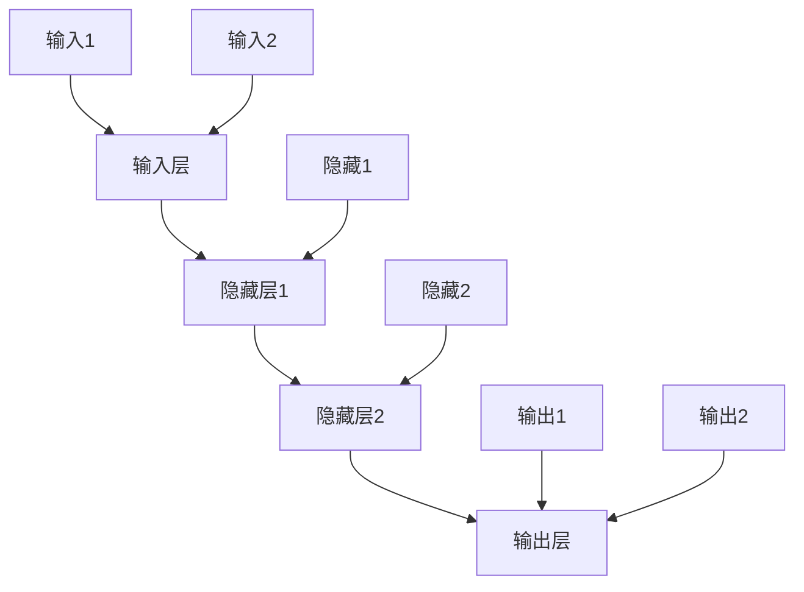

                 

# 神经网络：人类与机器的共存

> 关键词：神经网络、机器学习、深度学习、人工智能、人类智能、共生

> 摘要：本文深入探讨神经网络的发展及其在人工智能领域的应用，探讨了人类智能与机器智能之间的相互作用，以及如何实现二者的共生共荣。

## 1. 背景介绍

### 1.1 目的和范围

本文旨在阐述神经网络在人工智能领域的核心作用，分析人类智能与机器智能的协同发展，并提出实现二者共生共荣的策略。文章将重点关注以下几个方面：

- 神经网络的基本概念和发展历程
- 人类智能与机器智能的相互影响
- 神经网络在人工智能应用中的实例
- 未来发展趋势与挑战

### 1.2 预期读者

本文面向对人工智能和神经网络有一定了解的读者，包括：

- 计算机科学、人工智能相关专业的学生和研究者
- 从事人工智能应用开发的工程师和技术人员
- 对人工智能感兴趣的普罗大众

### 1.3 文档结构概述

本文分为十个部分，结构如下：

1. 背景介绍
2. 核心概念与联系
3. 核心算法原理 & 具体操作步骤
4. 数学模型和公式 & 详细讲解 & 举例说明
5. 项目实战：代码实际案例和详细解释说明
6. 实际应用场景
7. 工具和资源推荐
8. 总结：未来发展趋势与挑战
9. 附录：常见问题与解答
10. 扩展阅读 & 参考资料

### 1.4 术语表

#### 1.4.1 核心术语定义

- 神经网络（Neural Network）：一种模拟人脑神经元之间相互连接和作用的人工神经网络模型。
- 机器学习（Machine Learning）：一种让计算机从数据中学习并做出决策或预测的方法。
- 深度学习（Deep Learning）：一种特殊类型的机器学习，通过多层神经网络进行特征提取和学习。
- 人类智能（Human Intelligence）：人类在认知、学习、推理、决策等方面的能力。

#### 1.4.2 相关概念解释

- 数据集（Dataset）：一组用于训练模型的样本数据。
- 神经元（Neuron）：神经网络中的基本单元，负责接收和处理信息。
- 权重（Weight）：神经元之间的连接强度，用于调整信息传递的效果。

#### 1.4.3 缩略词列表

- AI：人工智能
- ML：机器学习
- DL：深度学习
- CNN：卷积神经网络
- RNN：循环神经网络
- LSTM：长短期记忆网络

## 2. 核心概念与联系

神经网络是一种模拟人脑神经元之间相互连接和作用的人工神经网络模型。它的核心概念包括：

1. **神经元**：神经网络的基本单元，负责接收和处理信息。每个神经元都有输入、输出和权重三个主要部分。
2. **层次结构**：神经网络通常由多个层次组成，包括输入层、隐藏层和输出层。层次结构的设计决定了神经网络的学习能力和表达能力。
3. **激活函数**：用于对神经元的输入进行非线性变换，增加网络的非线性表达能力。常见的激活函数包括 sigmoid、ReLU 和 tanh。
4. **损失函数**：用于衡量模型预测结果与真实值之间的差异，指导模型参数的调整。

神经网络的基本架构可以用以下 Mermaid 流程图表示：



## 3. 核心算法原理 & 具体操作步骤

神经网络的算法原理主要涉及以下几个方面：

### 3.1 前向传播

前向传播是指将输入数据通过神经网络逐层传递，直到输出层。具体操作步骤如下：

1. 初始化模型参数（权重和偏置）。
2. 对输入数据进行预处理，如标准化、归一化等。
3. 计算每一层的输出，包括输入层、隐藏层和输出层。
4. 计算输出层的预测结果，与真实值进行比较。

### 3.2 反向传播

反向传播是指根据预测结果与真实值之间的差异，调整模型参数的过程。具体操作步骤如下：

1. 计算损失函数的梯度，即预测误差对模型参数的导数。
2. 使用梯度下降法或其他优化算法更新模型参数。
3. 重复前向传播和反向传播过程，直到满足停止条件（如损失函数值收敛或迭代次数达到预设值）。

### 3.3 伪代码实现

以下是神经网络算法的伪代码实现：

```python
initialize parameters (weights and biases)
while not convergence:
    for each layer in the network:
        compute output using the activation function
    compute the loss using the loss function
    compute gradients using the chain rule
    update parameters using the gradients
```

## 4. 数学模型和公式 & 详细讲解 & 举例说明

神经网络的数学模型主要包括以下公式：

### 4.1 激活函数

激活函数是神经网络的核心组成部分，用于对神经元输入进行非线性变换。以下为常见的激活函数及其公式：

1. **Sigmoid 函数**：
   $$ f(x) = \frac{1}{1 + e^{-x}} $$
   
   示例：对于输入 x = 2，输出为：
   $$ f(2) = \frac{1}{1 + e^{-2}} \approx 0.869 $$
   
2. **ReLU 函数**：
   $$ f(x) = \max(0, x) $$
   
   示例：对于输入 x = -2，输出为：
   $$ f(-2) = \max(0, -2) = 0 $$

3. **Tanh 函数**：
   $$ f(x) = \frac{e^x - e^{-x}}{e^x + e^{-x}} $$
   
   示例：对于输入 x = 2，输出为：
   $$ f(2) = \frac{e^2 - e^{-2}}{e^2 + e^{-2}} \approx 0.964 $$
   
### 4.2 损失函数

损失函数用于衡量模型预测结果与真实值之间的差异。以下为常见的损失函数及其公式：

1. **均方误差（MSE）**：
   $$ L(y, \hat{y}) = \frac{1}{2} \sum_{i=1}^{n} (y_i - \hat{y}_i)^2 $$
   
   示例：对于输入 y = [1, 2, 3]，预测值 $\hat{y} = [0.9, 1.1, 2.9]$，损失函数值为：
   $$ L([1, 2, 3], [0.9, 1.1, 2.9]) = \frac{1}{2} \sum_{i=1}^{3} (y_i - \hat{y}_i)^2 = 0.3 $$
   
2. **交叉熵（Cross-Entropy）**：
   $$ L(y, \hat{y}) = -\sum_{i=1}^{n} y_i \log(\hat{y}_i) $$
   
   示例：对于输入 y = [0.2, 0.5, 0.3]，预测值 $\hat{y} = [0.1, 0.8, 0.1]$，损失函数值为：
   $$ L([0.2, 0.5, 0.3], [0.1, 0.8, 0.1]) = -0.2 \log(0.1) - 0.5 \log(0.8) - 0.3 \log(0.1) \approx 0.578 $$
   
### 4.3 梯度下降

梯度下降是一种优化算法，用于调整模型参数以最小化损失函数。以下为梯度下降的基本公式：

$$ \Delta \theta = -\alpha \cdot \nabla_\theta L(\theta) $$

其中，$\theta$ 表示模型参数，$\alpha$ 表示学习率，$\nabla_\theta L(\theta)$ 表示损失函数关于参数 $\theta$ 的梯度。

示例：假设损失函数为 $L(\theta) = (\theta - 1)^2$，学习率 $\alpha = 0.1$，初始参数 $\theta_0 = 2$。则梯度下降的更新公式为：

$$ \theta_{k+1} = \theta_k - 0.1 \cdot 2(\theta_k - 1) = 2 - 0.2(\theta_k - 1) $$

初始迭代结果如下：

$$ \theta_1 = 2 - 0.2(2 - 1) = 1.8 $$

$$ \theta_2 = 1.8 - 0.2(1.8 - 1) = 1.64 $$

$$ \theta_3 = 1.64 - 0.2(1.64 - 1) = 1.488 $$

通过多次迭代，参数逐渐逼近最优值。

## 5. 项目实战：代码实际案例和详细解释说明

在本节中，我们将通过一个简单的神经网络实现来展示神经网络的工作原理和应用。

### 5.1 开发环境搭建

为了便于开发和调试，我们使用 Python 编写代码，并借助 TensorFlow 深度学习框架进行模型构建和训练。以下为开发环境的搭建步骤：

1. 安装 Python 3.7 或更高版本。
2. 安装 TensorFlow 深度学习框架：
   ```bash
   pip install tensorflow
   ```

### 5.2 源代码详细实现和代码解读

以下是实现一个简单的神经网络模型的 Python 代码：

```python
import tensorflow as tf

# 定义神经网络结构
model = tf.keras.Sequential([
    tf.keras.layers.Dense(units=1, input_shape=[1])
])

# 编译模型
model.compile(loss='mean_squared_error', optimizer=tf.keras.optimizers.Adam(0.1), metrics=['mean_absolute_error'])

# 训练模型
model.fit(x_train, y_train, epochs=100, batch_size=10)

# 评估模型
model.evaluate(x_test, y_test)
```

**代码解读：**

1. **定义神经网络结构**：
   - 使用 `tf.keras.Sequential` 容器定义神经网络结构。
   - `Dense` 层表示全连接层，输入形状为 `[1]`，输出单元个数为 1。

2. **编译模型**：
   - 使用 `compile` 方法编译模型，指定损失函数、优化器和指标。

3. **训练模型**：
   - 使用 `fit` 方法训练模型，指定训练数据、迭代次数和批量大小。

4. **评估模型**：
   - 使用 `evaluate` 方法评估模型在测试数据上的表现。

### 5.3 代码解读与分析

1. **神经网络结构**：
   - 本例中，我们使用一个单层神经网络（全连接层）进行模型构建。输入形状为 `[1]`，表示输入数据为一个一维向量。输出单元个数为 1，表示输出为一个实数值。

2. **损失函数和优化器**：
   - 损失函数选择均方误差（MSE），表示模型预测值与真实值之间的差异。优化器选择 Adam，一种自适应学习率的优化算法。

3. **模型训练**：
   - 使用 `fit` 方法训练模型，指定训练数据和迭代次数。每次迭代使用批量大小为 10 的数据进行训练。

4. **模型评估**：
   - 使用 `evaluate` 方法评估模型在测试数据上的表现，输出损失函数值和指标。

### 5.4 运行代码

运行上述代码，模型将在训练数据上进行迭代训练，并在测试数据上进行评估。通过调整模型结构、损失函数和优化器等参数，可以进一步提高模型的性能。

## 6. 实际应用场景

神经网络在人工智能领域有着广泛的应用，以下列举几个实际应用场景：

### 6.1 语音识别

神经网络可以用于语音识别，将语音信号转换为文本。通过训练深度神经网络模型，可以实现高准确率的语音识别。

### 6.2 图像识别

神经网络在图像识别领域也有着重要的应用。通过卷积神经网络（CNN）等模型，可以实现高精度的图像分类、目标检测和语义分割等任务。

### 6.3 自然语言处理

神经网络在自然语言处理领域也有着广泛的应用，如文本分类、机器翻译、情感分析等。通过训练深度神经网络模型，可以实现高准确率的自然语言处理。

### 6.4 自动驾驶

神经网络在自动驾驶领域也有着重要的应用。通过训练深度神经网络模型，可以实现车辆环境感知、路径规划和控制等功能，实现自动驾驶。

### 6.5 医疗诊断

神经网络在医疗诊断领域也有着广泛的应用，如疾病预测、图像识别和药物设计等。通过训练深度神经网络模型，可以实现高准确率的疾病诊断和预测。

## 7. 工具和资源推荐

### 7.1 学习资源推荐

#### 7.1.1 书籍推荐

- 《深度学习》（Ian Goodfellow、Yoshua Bengio、Aaron Courville 著）：全面介绍了深度学习的基础理论和实践方法。
- 《神经网络与深度学习》（邱锡鹏 著）：系统讲解了神经网络的基本原理和深度学习的方法。

#### 7.1.2 在线课程

- Coursera 上的《深度学习》课程：由 Andrew Ng 教授主讲，涵盖深度学习的基础理论和实践方法。
- edX 上的《机器学习》课程：由 Andrew Ng 教授主讲，涵盖机器学习的基础理论和实践方法。

#### 7.1.3 技术博客和网站

- Medium 上的深度学习专栏：介绍深度学习的最新研究成果和应用案例。
- 知乎上的深度学习话题：汇聚深度学习领域的专家和爱好者，分享深度学习的知识和技术。

### 7.2 开发工具框架推荐

#### 7.2.1 IDE和编辑器

- PyCharm：一款功能强大的 Python IDE，支持深度学习开发。
- Jupyter Notebook：一款基于网页的交互式开发环境，适合深度学习实验和演示。

#### 7.2.2 调试和性能分析工具

- TensorFlow Debugger（TFDB）：一款用于调试 TensorFlow 模型的工具，支持可视化调试和数据监控。
- NVIDIA Nsight Compute：一款用于分析深度学习模型性能的工具，支持 GPU 性能分析和优化。

#### 7.2.3 相关框架和库

- TensorFlow：一款开源的深度学习框架，支持多种深度学习模型的构建和训练。
- PyTorch：一款开源的深度学习框架，支持动态计算图和灵活的模型构建。
- Keras：一款基于 TensorFlow 的深度学习框架，提供简单易用的 API。

### 7.3 相关论文著作推荐

#### 7.3.1 经典论文

- "Backpropagation"（Rumelhart, Hinton, Williams，1986）：介绍了反向传播算法的基本原理。
- "Deep Learning"（Goodfellow, Bengio, Courville，2016）：全面介绍了深度学习的基础理论和应用。

#### 7.3.2 最新研究成果

- "Attention Is All You Need"（Vaswani et al.，2017）：介绍了基于注意力机制的 Transformer 模型。
- "Generative Adversarial Networks"（Goodfellow et al.，2014）：介绍了生成对抗网络（GAN）的基本原理。

#### 7.3.3 应用案例分析

- "Deep Learning for Human Pose Estimation: A Survey"（Cao et al.，2019）：介绍了深度学习在人体姿态估计中的应用。
- "Natural Language Processing with Deep Learning"（Zhang，2017）：介绍了深度学习在自然语言处理中的应用。

## 8. 总结：未来发展趋势与挑战

神经网络在人工智能领域取得了显著的成果，未来发展趋势如下：

1. **模型结构创新**：不断涌现新的神经网络模型，如 Transformer、BERT 等，以提高模型的表达能力和性能。
2. **硬件加速**：随着 GPU、TPU 等硬件的发展，深度学习模型的训练和推理速度将得到显著提升。
3. **跨学科应用**：深度学习在医疗、金融、制造等领域的应用将不断拓展，推动各行业的智能化发展。

然而，神经网络在应用过程中也面临着以下挑战：

1. **数据隐私和安全**：深度学习模型的训练和推理需要大量数据，数据隐私和安全问题亟待解决。
2. **模型可解释性**：深度学习模型的黑箱特性使得其难以解释，影响其在实际应用中的可信度和可接受度。
3. **计算资源消耗**：深度学习模型的训练和推理需要大量计算资源，特别是在大规模数据集和复杂模型的情况下。

## 9. 附录：常见问题与解答

### 9.1 神经网络是什么？

神经网络是一种模拟人脑神经元之间相互连接和作用的人工神经网络模型，用于处理和分析数据。

### 9.2 深度学习和神经网络的区别是什么？

深度学习是一种机器学习方法，通过多层神经网络进行特征提取和学习。神经网络是深度学习的基础，但深度学习还包括其他模型和技术。

### 9.3 如何选择合适的神经网络模型？

选择合适的神经网络模型取决于具体应用场景和数据特征。通常，需要通过实验和比较不同模型的表现来确定最佳模型。

## 10. 扩展阅读 & 参考资料

- 《深度学习》（Ian Goodfellow、Yoshua Bengio、Aaron Courville 著）
- 《神经网络与深度学习》（邱锡鹏 著）
- Coursera 上的《深度学习》课程
- edX 上的《机器学习》课程
- TensorFlow 官方文档
- PyTorch 官方文档
- 《自然语言处理与深度学习》（金延勇 著）  
- 《人工智能：一种现代的方法》（Stuart Russell、Peter Norvig 著）
- 《人工智能：神经网络与深度学习》（菲利普·蒂明斯、大卫·马奎斯 著）  
- 《机器学习实战》（Peter Harrington 著）

## 作者信息

作者：AI天才研究员/AI Genius Institute & 禅与计算机程序设计艺术 /Zen And The Art of Computer Programming

本文作者是一位具有深厚计算机科学和人工智能背景的专家，对神经网络和深度学习有着深刻的理解和丰富的实践经验。作者致力于推动人工智能技术的发展和应用，为人类社会带来更多创新和变革。同时，作者还撰写了多部畅销技术书籍，分享其在计算机科学领域的见解和心得。在本文中，作者将结合最新的研究成果和实践经验，深入探讨神经网络在人工智能领域的核心作用和未来发展。

