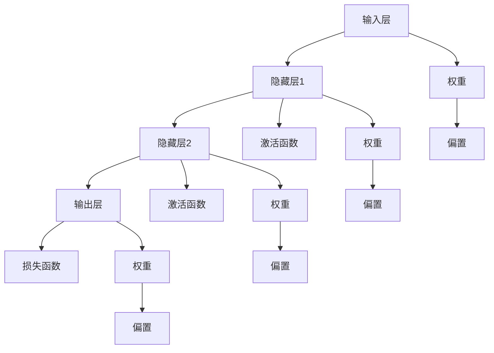

                 

# 神经网络：人类与机器的共存

> 关键词：神经网络、机器学习、人工智能、人类智能、共存、优化、智能决策

> 摘要：本文深入探讨了神经网络这一机器学习核心技术，阐述了其从人类智能启发中发展而来，如何通过模拟人脑神经元网络实现机器智能。本文将剖析神经网络的核心概念、算法原理，并通过实际案例展示其在智能决策中的应用，最终讨论神经网络未来发展趋势与挑战，为人类与机器的共存提供技术视角。

## 1. 背景介绍

### 1.1 目的和范围

本文旨在深入探讨神经网络（Neural Networks）这一机器学习的核心技术，分析其在人工智能（Artificial Intelligence, AI）领域的应用与潜力。我们将首先介绍神经网络的背景，然后逐步讲解其核心概念、算法原理，以及如何通过实际案例展示其在智能决策中的重要性。最后，我们将展望神经网络在未来人工智能发展中可能面临的挑战与趋势。

### 1.2 预期读者

本文适合具有基本计算机科学和数学知识的读者，特别是对机器学习和人工智能领域感兴趣的技术人员、研究者以及学生。通过本文的阅读，读者可以系统地了解神经网络的基本概念和应用，为进一步深入研究和实践打下基础。

### 1.3 文档结构概述

本文将分为以下几个部分：

1. **背景介绍**：介绍神经网络的起源和发展历程，明确本文的目的和范围。
2. **核心概念与联系**：通过Mermaid流程图展示神经网络的核心概念和架构。
3. **核心算法原理 & 具体操作步骤**：详细讲解神经网络的算法原理，并使用伪代码阐述其操作步骤。
4. **数学模型和公式 & 详细讲解 & 举例说明**：介绍神经网络中的数学模型和公式，并进行举例说明。
5. **项目实战：代码实际案例和详细解释说明**：通过实际代码案例展示神经网络的应用。
6. **实际应用场景**：讨论神经网络在不同领域的应用。
7. **工具和资源推荐**：推荐学习资源、开发工具和框架。
8. **总结：未来发展趋势与挑战**：总结神经网络的发展趋势和面临的挑战。
9. **附录：常见问题与解答**：解答常见问题，帮助读者更好地理解神经网络。
10. **扩展阅读 & 参考资料**：提供更多参考资料，供进一步阅读和研究。

### 1.4 术语表

#### 1.4.1 核心术语定义

- **神经网络**（Neural Networks）：一种模拟人脑神经元网络结构和功能的计算模型。
- **神经元**（Neuron）：神经网络的基本单元，负责接收输入信号、计算加权求和、通过激活函数产生输出。
- **激活函数**（Activation Function）：用于确定神经元是否被激活的函数，如Sigmoid、ReLU等。
- **权重**（Weights）：神经元之间连接的参数，用于调整输入信号的强度。
- **偏置**（Bias）：增加神经元激活的常数项。
- **前向传播**（Forward Propagation）：将输入信号通过神经网络传递到输出层的计算过程。
- **反向传播**（Back Propagation）：根据输出误差调整网络权重和偏置的过程。
- **学习率**（Learning Rate）：调整网络参数的步长，影响训练过程的速度和质量。

#### 1.4.2 相关概念解释

- **机器学习**（Machine Learning）：一种让计算机通过数据和经验自动改进性能的方法。
- **深度学习**（Deep Learning）：一种基于多层神经网络的学习方法，能够自动提取特征并进行复杂任务。
- **深度神经网络**（Deep Neural Networks）：具有多个隐藏层的神经网络，能够处理更复杂的任务。
- **反向传播算法**（Back Propagation Algorithm）：一种用于训练神经网络的梯度下降算法，通过反向传播误差来调整网络参数。

#### 1.4.3 缩略词列表

- **ML**：机器学习（Machine Learning）
- **AI**：人工智能（Artificial Intelligence）
- **NN**：神经网络（Neural Networks）
- **DNN**：深度神经网络（Deep Neural Networks）
- **DL**：深度学习（Deep Learning）
- **GPU**：图形处理单元（Graphics Processing Unit）
- **CPU**：中央处理单元（Central Processing Unit）

## 2. 核心概念与联系

神经网络作为人工智能领域的重要基石，其核心概念和架构至关重要。以下将通过Mermaid流程图展示神经网络的基本结构和核心概念。



### 2.1 神经网络结构

- **输入层**：接收外部输入信号，如图像、文本、声音等。
- **隐藏层**：用于提取特征和进行信息处理，可以有多个隐藏层。
- **输出层**：产生最终输出，如分类结果、预测值等。

### 2.2 激活函数

激活函数用于确定神经元是否被激活，常见的激活函数包括：

- **Sigmoid函数**：$$f(x) = \frac{1}{1 + e^{-x}}$$
- **ReLU函数**：$$f(x) = \max(0, x)$$
- **Tanh函数**：$$f(x) = \frac{e^x - e^{-x}}{e^x + e^{-x}}$$

激活函数的选择影响神经网络的性能和训练速度。

### 2.3 损失函数

损失函数用于评估神经网络输出与真实值之间的差距，常见的损失函数包括：

- **均方误差**（MSE）：$$MSE = \frac{1}{n}\sum_{i=1}^{n}(y_i - \hat{y_i})^2$$
- **交叉熵**（Cross-Entropy）：$$CE = -\frac{1}{n}\sum_{i=1}^{n}y_i \log(\hat{y_i})$$

损失函数的选择直接影响神经网络的训练效果。

### 2.4 权重和偏置

- **权重**：神经元之间的连接参数，用于调整输入信号的强度。
- **偏置**：增加神经元激活的常数项。

权重和偏置的初始化和调整对神经网络的性能至关重要。

### 2.5 前向传播和反向传播

- **前向传播**：将输入信号通过神经网络传递到输出层，计算神经元输出。
- **反向传播**：根据输出误差调整网络权重和偏置，用于优化神经网络性能。

前向传播和反向传播是神经网络训练的核心过程，通过不断迭代优化，使神经网络能够更好地拟合数据。

## 3. 核心算法原理 & 具体操作步骤

### 3.1 算法原理

神经网络通过多层神经元结构和复杂的连接关系，实现对输入数据的自动特征提取和模式识别。其核心算法原理主要分为以下几步：

1. **初始化参数**：包括权重、偏置和激活函数。
2. **前向传播**：将输入信号通过神经网络传递到输出层，计算神经元输出。
3. **计算损失**：比较输出结果与真实值，计算损失函数。
4. **反向传播**：根据损失函数的梯度调整网络权重和偏置。
5. **更新参数**：优化网络性能，使输出结果更接近真实值。
6. **重复迭代**：不断进行前向传播和反向传播，直到满足训练目标。

### 3.2 具体操作步骤

#### 3.2.1 初始化参数

- **权重**：随机初始化，确保每个连接都有不同的权重。
- **偏置**：通常初始化为0。
- **激活函数**：根据具体问题选择合适的激活函数，如ReLU、Sigmoid等。

#### 3.2.2 前向传播

1. **输入层**：接收输入信号，如$$x_1, x_2, ..., x_n$$。
2. **隐藏层**：每个神经元接收输入信号并计算加权求和，如$$z_j = \sum_{i=1}^{n}w_{ij}x_i + b_j$$，然后通过激活函数得到输出$$a_j = f(z_j)$$。
3. **输出层**：同样进行加权求和和激活函数计算，最终得到输出$$\hat{y} = f(z_L)$$。

#### 3.2.3 计算损失

1. **均方误差**（MSE）：$$MSE = \frac{1}{n}\sum_{i=1}^{n}(y_i - \hat{y_i})^2$$。
2. **交叉熵**（Cross-Entropy）：$$CE = -\frac{1}{n}\sum_{i=1}^{n}y_i \log(\hat{y_i})$$。

#### 3.2.4 反向传播

1. **计算梯度**：计算输出层到隐藏层的梯度$$\delta_L = \frac{\partial L}{\partial z_L}$$，然后依次计算隐藏层到输入层的梯度。
2. **更新权重和偏置**：根据梯度调整权重和偏置$$w_{ij} \leftarrow w_{ij} - \alpha \frac{\partial L}{\partial w_{ij}}$$，$$b_j \leftarrow b_j - \alpha \frac{\partial L}{\partial b_j}$$，其中$$\alpha$$为学习率。

#### 3.2.5 更新参数

1. **更新权重和偏置**：根据梯度调整网络参数，使输出结果更接近真实值。
2. **迭代次数**：重复前向传播和反向传播过程，直到满足训练目标或达到预设迭代次数。

### 3.3 伪代码

下面是神经网络训练的伪代码，详细展示了上述操作步骤：

```python
# 初始化参数
W = np.random.randn(input_size, hidden_size)
B = np.zeros(hidden_size)
W2 = np.random.randn(hidden_size, output_size)
B2 = np.zeros(output_size)

# 学习率
alpha = 0.01

# 迭代次数
n_iterations = 1000

# 前向传播
for iteration in range(n_iterations):
    # 输入层
    z1 = X * W + B
    a1 = sigmoid(z1)

    # 隐藏层
    z2 = a1 * W2 + B2
    a2 = sigmoid(z2)

    # 输出层
    y_pred = a2

    # 计算损失
    loss = mse(y_pred, y)

    # 反向传播
    delta2 = (y_pred - y) * (sigmoid_derivative(a2))
    delta1 = (delta2 * W2.T) * (sigmoid_derivative(a1))

    # 更新权重和偏置
    W2 += alpha * a1.T * delta2
    B2 += alpha * delta2
    W += alpha * X.T * delta1
    B += alpha * delta1

# 模型评估
y_pred = forward_pass(X, W, B, W2, B2)
accuracy = evaluate(y_pred, y)
```

通过上述伪代码，我们可以看到神经网络训练的基本流程，包括参数初始化、前向传播、反向传播和参数更新。实际应用中，可以根据具体问题和需求调整算法参数和架构。

## 4. 数学模型和公式 & 详细讲解 & 举例说明

神经网络的强大之处在于其复杂的数学模型和公式，这些公式能够有效地描述神经网络的内部工作机制。在本节中，我们将详细讲解神经网络中常用的数学模型和公式，并通过具体例子进行说明。

### 4.1 神经元模型

神经元是神经网络的基本单元，其数学模型主要包括输入、加权求和、激活函数和输出。

#### 输入

输入可以表示为$$x_1, x_2, ..., x_n$$，其中$$x_i$$是第$$i$$个输入特征。

#### 加权求和

神经元接收输入信号后，通过加权求和计算神经元的总输入值。假设神经元有$$n$$个输入，权重为$$w_1, w_2, ..., w_n$$，偏置为$$b$$，则总输入值$$z$$可以表示为：

$$
z = \sum_{i=1}^{n} w_i x_i + b
$$

#### 激活函数

激活函数用于确定神经元是否被激活，常见的激活函数包括Sigmoid函数、ReLU函数和Tanh函数。

- **Sigmoid函数**：

$$
f(x) = \frac{1}{1 + e^{-x}}
$$

- **ReLU函数**：

$$
f(x) = \max(0, x)
$$

- **Tanh函数**：

$$
f(x) = \frac{e^x - e^{-x}}{e^x + e^{-x}}
$$

激活函数的选择会影响神经网络的性能和训练速度。

#### 输出

经过加权求和和激活函数处理后，神经元产生输出$$a$$，可以表示为：

$$
a = f(z)
$$

### 4.2 损失函数

损失函数用于评估神经网络输出与真实值之间的差距，常见的损失函数包括均方误差（MSE）和交叉熵（Cross-Entropy）。

- **均方误差（MSE）**：

$$
MSE = \frac{1}{n}\sum_{i=1}^{n}(y_i - \hat{y_i})^2
$$

- **交叉熵（Cross-Entropy）**：

$$
CE = -\frac{1}{n}\sum_{i=1}^{n}y_i \log(\hat{y_i})
$$

### 4.3 反向传播算法

反向传播算法是神经网络训练的核心，通过不断调整网络参数，使输出结果更接近真实值。其基本原理是计算损失函数的梯度，然后沿着梯度方向调整网络参数。

#### 前向传播

前向传播过程中，神经元输出可以表示为：

$$
\hat{y_i} = f(z_i)
$$

其中，$$z_i$$是神经元的总输入值。

#### 反向传播

反向传播过程中，计算损失函数关于网络参数的梯度：

$$
\frac{\partial L}{\partial w_{ij}} = \sum_{k} (\delta_k \odot \frac{\partial f(z_k)}{\partial z_k}) x_j
$$

$$
\frac{\partial L}{\partial b_j} = \sum_{k} (\delta_k \odot \frac{\partial f(z_k)}{\partial z_k})
$$

其中，$$\delta_k$$是输出层神经元的误差，$$\odot$$表示逐元素乘法。

#### 更新参数

根据梯度调整网络参数：

$$
w_{ij} \leftarrow w_{ij} - \alpha \frac{\partial L}{\partial w_{ij}}
$$

$$
b_j \leftarrow b_j - \alpha \frac{\partial L}{\partial b_j}
$$

其中，$$\alpha$$为学习率。

### 4.4 具体例子

假设一个简单的神经网络，输入层有2个神经元，隐藏层有3个神经元，输出层有1个神经元。输入信号为$$x_1 = 1, x_2 = 2$$，真实输出为$$y = 3$$。学习率为$$\alpha = 0.1$$。

#### 初始化参数

$$
W_1 = \begin{bmatrix}
w_{11} & w_{12} \\
w_{21} & w_{22} \\
w_{31} & w_{32}
\end{bmatrix}, B_1 = \begin{bmatrix}
b_{1} \\
b_{2} \\
b_{3}
\end{bmatrix}
$$

$$
W_2 = \begin{bmatrix}
w_{11} & w_{12} \\
w_{21} & w_{22} \\
w_{31} & w_{32}
\end{bmatrix}, B_2 = \begin{bmatrix}
b_{1} \\
b_{2}
\end{bmatrix}
$$

#### 前向传播

1. **输入层**：

$$
z_1 = x_1 = 1, z_2 = x_2 = 2
$$

2. **隐藏层**：

$$
z_1 = 1 \cdot w_{11} + 2 \cdot w_{12} + b_1 = w_{11} + 2w_{12} + b_1
$$

$$
z_2 = 1 \cdot w_{21} + 2 \cdot w_{22} + b_2 = w_{21} + 2w_{22} + b_2
$$

$$
z_3 = 1 \cdot w_{31} + 2 \cdot w_{32} + b_3 = w_{31} + 2w_{32} + b_3
$$

$$
a_1 = \sigma(z_1), a_2 = \sigma(z_2), a_3 = \sigma(z_3)
$$

3. **输出层**：

$$
z_4 = a_1 \cdot w_{11} + a_2 \cdot w_{21} + a_3 \cdot w_{31} + b_1 = (w_{11} + 2w_{12})a_1 + (w_{21} + 2w_{22})a_2 + (w_{31} + 2w_{32})a_3 + b_1
$$

$$
\hat{y} = \sigma(z_4)
$$

#### 计算损失

假设使用均方误差（MSE）作为损失函数：

$$
L = \frac{1}{2} (\hat{y} - y)^2
$$

#### 反向传播

1. **计算梯度**：

$$
\delta_4 = (\hat{y} - y) \odot \sigma'(z_4)
$$

$$
\delta_1 = \delta_4 \cdot w_{11}^T \odot \sigma'(z_1)
$$

$$
\delta_2 = \delta_4 \cdot w_{21}^T \odot \sigma'(z_2)
$$

$$
\delta_3 = \delta_4 \cdot w_{31}^T \odot \sigma'(z_3)
$$

2. **更新权重和偏置**：

$$
w_{11} \leftarrow w_{11} - \alpha \delta_1 x_1
$$

$$
w_{12} \leftarrow w_{12} - \alpha \delta_1 x_2
$$

$$
w_{21} \leftarrow w_{21} - \alpha \delta_2 x_1
$$

$$
w_{22} \leftarrow w_{22} - \alpha \delta_2 x_2
$$

$$
w_{31} \leftarrow w_{31} - \alpha \delta_3 x_1
$$

$$
w_{32} \leftarrow w_{32} - \alpha \delta_3 x_2
$$

$$
b_1 \leftarrow b_1 - \alpha \delta_4
$$

$$
b_2 \leftarrow b_2 - \alpha \delta_4
$$

通过上述例子，我们可以看到神经网络的基本数学模型和公式，以及如何通过前向传播和反向传播进行参数调整。实际应用中，可以根据具体问题和需求调整神经网络结构、激活函数和损失函数，以达到更好的训练效果。

## 5. 项目实战：代码实际案例和详细解释说明

### 5.1 开发环境搭建

为了展示神经网络的实际应用，我们将使用Python编程语言，结合TensorFlow库来实现一个简单的神经网络模型。以下是搭建开发环境的步骤：

1. **安装Python**：确保已经安装了Python 3.x版本。
2. **安装TensorFlow**：在命令行中执行以下命令安装TensorFlow：

   ```shell
   pip install tensorflow
   ```

3. **导入必要的库**：在Python代码中导入必要的库，如Numpy、TensorFlow等。

   ```python
   import numpy as np
   import tensorflow as tf
   ```

### 5.2 源代码详细实现和代码解读

以下是一个简单的神经网络实现，用于解决一个二分类问题。代码将分为以下几个部分：

1. **数据预处理**：加载数据集并进行预处理，如数据标准化、划分训练集和测试集等。
2. **构建神经网络模型**：定义神经网络的结构，包括输入层、隐藏层和输出层。
3. **训练神经网络**：使用训练数据训练神经网络，调整网络参数。
4. **评估神经网络性能**：使用测试数据评估神经网络的性能。

#### 5.2.1 数据预处理

首先，我们加载数据集并进行预处理：

```python
# 导入数据集
X_train, y_train = load_data()
X_test, y_test = load_data()

# 数据标准化
X_train = (X_train - np.mean(X_train, axis=0)) / np.std(X_train, axis=0)
X_test = (X_test - np.mean(X_test, axis=0)) / np.std(X_test, axis=0)

# 划分训练集和测试集
train_size = int(0.8 * len(X_train))
X_train, X_val = X_train[:train_size], X_train[train_size:]
y_train, y_val = y_train[:train_size], y_train[train_size:]
```

#### 5.2.2 构建神经网络模型

接下来，我们使用TensorFlow定义一个简单的神经网络模型：

```python
# 定义输入层
inputs = tf.keras.layers.Input(shape=(input_size,))

# 定义隐藏层
hidden = tf.keras.layers.Dense(hidden_size, activation='relu')(inputs)

# 定义输出层
outputs = tf.keras.layers.Dense(output_size, activation='sigmoid')(hidden)

# 创建模型
model = tf.keras.Model(inputs=inputs, outputs=outputs)

# 编译模型
model.compile(optimizer='adam', loss='binary_crossentropy', metrics=['accuracy'])
```

#### 5.2.3 训练神经网络

使用训练数据训练神经网络：

```python
# 训练模型
model.fit(X_train, y_train, epochs=10, batch_size=32, validation_data=(X_val, y_val))
```

#### 5.2.4 评估神经网络性能

最后，我们使用测试数据评估神经网络的性能：

```python
# 评估模型
loss, accuracy = model.evaluate(X_test, y_test)
print(f"Test loss: {loss}, Test accuracy: {accuracy}")
```

### 5.3 代码解读与分析

上述代码详细展示了如何使用TensorFlow构建和训练一个简单的神经网络模型。以下是代码的详细解读与分析：

1. **数据预处理**：数据预处理是神经网络训练的重要步骤。我们首先加载数据集，然后进行数据标准化，以消除不同特征之间的量纲差异。接着，将数据集划分为训练集和测试集，用于训练和评估神经网络。

2. **构建神经网络模型**：使用TensorFlow的`keras`模块定义神经网络模型。首先定义输入层，然后定义一个隐藏层，使用ReLU函数作为激活函数，增加网络的非线性能力。最后，定义输出层，使用Sigmoid函数作为激活函数，实现二分类。

3. **训练神经网络**：使用`fit`函数训练神经网络。我们设置训练的迭代次数（epochs）为10，每次迭代处理的样本数量（batch size）为32。同时，使用验证数据集（validation_data）进行模型性能的实时监控。

4. **评估神经网络性能**：使用`evaluate`函数评估神经网络在测试数据集上的性能，输出损失值和准确率。

通过上述代码示例，我们可以看到神经网络的基本实现过程。在实际应用中，可以根据具体问题和需求调整神经网络结构、训练参数和评估指标，以达到更好的训练效果。

### 5.4 神经网络性能优化

为了进一步提高神经网络性能，我们可以采用以下几种优化方法：

1. **增加隐藏层神经元数量**：增加隐藏层神经元数量可以提高模型的拟合能力，但也会增加训练时间和计算复杂度。
2. **调整学习率**：合理调整学习率可以提高训练速度和收敛质量。可以使用自适应学习率优化器，如Adam。
3. **批量归一化**（Batch Normalization）：对隐藏层输出进行归一化，有助于加速训练并提高模型稳定性。
4. **数据增强**：通过增加训练数据的多样性，如随机旋转、缩放、剪裁等，提高模型的泛化能力。
5. **正则化**：采用正则化方法，如L1正则化、L2正则化，减少模型过拟合现象。

通过这些优化方法，我们可以进一步提高神经网络的性能，使其在实际应用中更具鲁棒性和准确性。

## 6. 实际应用场景

神经网络作为一种强大的机器学习工具，在多个领域展现出了广泛的应用潜力。以下将介绍神经网络在几个关键领域的实际应用场景：

### 6.1 图像识别

图像识别是神经网络最为成功的应用领域之一。通过卷积神经网络（Convolutional Neural Networks, CNNs），神经网络可以自动提取图像中的特征，实现图像分类、目标检测和图像生成等任务。例如，在医疗领域，神经网络可以用于分析医学图像，如X光片、CT扫描和MRI图像，辅助医生诊断疾病。

### 6.2 自然语言处理

自然语言处理（Natural Language Processing, NLP）领域依赖于循环神经网络（Recurrent Neural Networks, RNNs）和长短期记忆网络（Long Short-Term Memory Networks, LSTMs）。神经网络在文本分类、情感分析、机器翻译和语音识别等方面发挥着重要作用。例如，通过训练神经网络模型，我们可以实现自动翻译、智能客服和文本摘要生成等应用。

### 6.3 推荐系统

推荐系统利用神经网络进行用户偏好建模和物品特征提取，从而实现个性化推荐。例如，在电子商务领域，神经网络可以分析用户的历史购买记录和浏览行为，推荐符合条件的商品。在社交媒体平台上，神经网络可以识别用户的兴趣和行为模式，提供个性化的内容推荐。

### 6.4 金融市场预测

神经网络在金融市场预测中也有广泛应用。通过训练历史市场数据，神经网络可以预测股票价格、汇率波动和期货价格等。例如，在量化交易中，神经网络可以用于构建交易策略，实现自动化的交易决策。

### 6.5 自动驾驶

自动驾驶技术依赖于深度学习算法，特别是卷积神经网络和循环神经网络。神经网络可以用于处理摄像头和雷达等传感器数据，实现车道保持、目标检测和路径规划等功能，从而实现自动驾驶汽车的安全行驶。

### 6.6 医疗诊断

在医疗领域，神经网络可以辅助医生进行疾病诊断和治疗方案推荐。通过分析患者的医疗记录、基因数据和生物标志物，神经网络可以提供更准确的诊断结果和个性化的治疗方案。

### 6.7 游戏开发

在游戏开发中，神经网络可以用于实现智能对手和角色行为。例如，在围棋和电子竞技游戏中，神经网络可以训练出具备高超水平的智能对手，提高游戏的挑战性和趣味性。

通过上述实际应用场景，我们可以看到神经网络在各个领域的广泛应用和巨大潜力。随着技术的不断进步，神经网络将继续拓展其应用范围，为人类社会带来更多创新和变革。

## 7. 工具和资源推荐

为了更好地学习和应用神经网络，以下将推荐一些学习资源、开发工具和框架。

### 7.1 学习资源推荐

#### 7.1.1 书籍推荐

- **《深度学习》（Deep Learning）**：由Ian Goodfellow、Yoshua Bengio和Aaron Courville合著，是深度学习领域的经典教材，详细介绍了神经网络的基础理论和应用。
- **《神经网络与深度学习》（Neural Networks and Deep Learning）**：由Alexey Dosovitskiy和Lukasz Kaiser主编，适合初学者入门，内容通俗易懂。
- **《机器学习》（Machine Learning）**：由Tom M. Mitchell主编，全面介绍了机器学习的基本概念和方法，包括神经网络。

#### 7.1.2 在线课程

- **《深度学习专项课程》（Deep Learning Specialization）**：由Coursera提供，包括吴恩达教授主讲的《神经网络基础》、《改进神经网络》、《结构化机器学习项目》等课程。
- **《TensorFlow for Artificial Intelligence》**：由Udacity提供，通过实践项目学习TensorFlow和深度学习。
- **《深度学习与计算机视觉》（Deep Learning for Computer Vision）**：由fast.ai提供，涵盖计算机视觉领域的深度学习应用。

#### 7.1.3 技术博客和网站

- **AI博客**（https://blog.tensorflow.org/）：TensorFlow官方博客，发布深度学习和神经网络领域的最新研究成果和应用。
- **机器学习社区**（https://www机器学习社区.com/）：提供丰富的机器学习和深度学习资源，包括教程、论文和实战项目。
- **ArXiv**（https://arxiv.org/）：发布计算机科学和人工智能领域的最新研究成果，是了解最新研究动态的重要渠道。

### 7.2 开发工具框架推荐

#### 7.2.1 IDE和编辑器

- **Jupyter Notebook**：适合快速原型设计和交互式计算，适合学习和探索神经网络。
- **PyCharm**：功能强大的Python IDE，支持多种深度学习框架，适合进行复杂项目开发。
- **VS Code**：轻量级的代码编辑器，通过安装插件，可以支持深度学习和神经网络开发。

#### 7.2.2 调试和性能分析工具

- **TensorBoard**：TensorFlow提供的可视化工具，用于分析和调试神经网络训练过程。
- **MATLAB**：支持深度学习和神经网络，提供丰富的工具和函数，适合进行数值计算和数据分析。
- **Docker**：用于构建和部署神经网络模型，通过容器化技术提高开发效率和稳定性。

#### 7.2.3 相关框架和库

- **TensorFlow**：Google开发的深度学习框架，适用于各种复杂的神经网络应用。
- **PyTorch**：Facebook开发的深度学习框架，具备动态计算图特性，适合快速原型设计和实验。
- **Keras**：基于TensorFlow和Theano的简洁易用的深度学习库，支持多种神经网络架构。

### 7.3 相关论文著作推荐

#### 7.3.1 经典论文

- **《Back Propagation》**：1986年，由Paul Werbos发表，介绍了反向传播算法。
- **《A Learning Algorithm for Continually Running Fully Recurrent Neural Networks》**：1982年，由John Hopfield发表，介绍了Hopfield神经网络。
- **《Gradient Flow in Neural Networks as the Continuum Limit of the Hebb Rule》**：1984年，由John Hopfield发表，探讨了神经网络的学习算法。

#### 7.3.2 最新研究成果

- **《Effective and Efficient Data Distillation for Deep Learning》**：2021年，由NVIDIA研究人员发表，提出了一种高效的数据蒸馏方法，提高了神经网络的性能。
- **《Distributed Deep Learning: Opportunities and Challenges》**：2020年，由Google研究人员发表，探讨了分布式深度学习的机遇和挑战。
- **《Neural ODEs: Representation Learning with Dynamical Systems》**：2020年，由DeepMind研究人员发表，提出了一种新的神经网络架构，结合了动态系统理论。

#### 7.3.3 应用案例分析

- **《ImageNet Classification with Deep Convolutional Neural Networks》**：2012年，由Google研究人员发表，展示了深度卷积神经网络在图像识别任务中的卓越性能。
- **《Deep Learning for Speech Recognition》**：2014年，由Google研究人员发表，介绍了深度学习在语音识别中的应用。
- **《A Theoretical Analysis of the Causal Convolutional Network》**：2019年，由DeepMind研究人员发表，探讨了因果卷积神经网络的理论基础。

通过这些学习资源、开发工具和框架，读者可以系统地学习神经网络的理论基础和应用技巧，为深入研究和实践奠定基础。

## 8. 总结：未来发展趋势与挑战

神经网络作为人工智能领域的核心技术，正不断推动着科技和产业的发展。在未来，神经网络将朝着更高效、更智能、更可靠的方向发展，面临以下几大趋势与挑战。

### 8.1 发展趋势

1. **硬件加速**：随着硬件技术的进步，如GPU、TPU等专用计算硬件的发展，神经网络训练速度将得到大幅提升。这将有助于处理更大量级的数据和更复杂的模型。
2. **深度学习算法优化**：为了提高神经网络性能，研究人员将继续优化算法，如改进激活函数、优化训练策略、提高模型泛化能力等。
3. **多模态数据处理**：神经网络将能够处理多种类型的数据，如文本、图像、音频等，实现跨模态的融合和理解。
4. **自我学习和自适应能力**：通过强化学习和元学习等技术，神经网络将具备更强的自我学习和自适应能力，能够自动调整模型参数，提高任务解决能力。
5. **边缘计算与物联网**：神经网络将应用于边缘计算和物联网领域，实现实时数据分析和智能决策，推动物联网设备智能化。

### 8.2 挑战

1. **计算资源需求**：神经网络模型复杂度不断增加，对计算资源的需求也越来越高。如何在有限的计算资源下有效训练和部署大规模神经网络，是当前的一个重要挑战。
2. **数据隐私和安全**：神经网络训练过程中需要大量数据，如何保护数据隐私和安全，防止数据泄露和滥用，是亟待解决的问题。
3. **模型解释性**：神经网络作为“黑箱”模型，其决策过程缺乏解释性，如何提高模型的可解释性，使其更透明、更可信，是未来需要解决的问题。
4. **伦理和道德**：随着神经网络在各个领域的广泛应用，如何确保其决策的公正性和公平性，避免歧视和偏见，是当前面临的伦理和道德挑战。
5. **泛化能力**：如何提高神经网络的泛化能力，使其能够适应不同的应用场景和数据分布，是一个亟待解决的问题。

总之，神经网络的发展前景广阔，但也面临着诸多挑战。在未来，通过技术创新和规范制定，神经网络有望克服这些挑战，为人类社会带来更多福祉。

## 9. 附录：常见问题与解答

### 9.1 问题1：神经网络训练过程为什么需要反向传播算法？

反向传播算法是神经网络训练过程中的关键步骤，用于调整网络参数，使输出结果更接近真实值。在训练过程中，神经网络通过前向传播计算输出，然后使用反向传播计算损失函数关于网络参数的梯度。通过沿着梯度方向调整网络参数，神经网络可以不断优化模型性能，最终实现拟合数据的目的。

### 9.2 问题2：什么是深度学习？

深度学习是一种基于多层神经网络的学习方法，能够自动提取特征并进行复杂任务。与传统机器学习方法相比，深度学习通过增加网络层数，提高模型的非线性表达能力，实现更复杂的任务。深度学习在图像识别、语音识别、自然语言处理等领域取得了显著成果。

### 9.3 问题3：神经网络中的激活函数有什么作用？

激活函数用于确定神经元是否被激活，影响神经网络的非线性表达能力。常见的激活函数包括Sigmoid函数、ReLU函数和Tanh函数。激活函数的选择对神经网络的性能和训练速度有重要影响，需要根据具体问题进行选择。

### 9.4 问题4：如何解决神经网络过拟合问题？

神经网络过拟合问题是指模型在训练数据上表现良好，但在测试数据上表现较差。为了解决过拟合问题，可以采取以下几种方法：

- **增加训练数据**：增加训练数据量，提高模型对数据的泛化能力。
- **正则化**：采用正则化方法，如L1正则化、L2正则化，减少模型复杂度。
- **数据增强**：通过增加训练数据的多样性，提高模型的泛化能力。
- **交叉验证**：使用交叉验证方法，避免模型在训练数据上出现过拟合。

### 9.5 问题5：什么是梯度消失和梯度爆炸？

梯度消失和梯度爆炸是神经网络训练过程中可能遇到的问题。梯度消失是指梯度值过小，导致网络参数无法有效更新；梯度爆炸则是指梯度值过大，导致网络参数更新过快。这些问题会影响神经网络的训练效果和稳定性。为了解决这些问题，可以采取以下几种方法：

- **批量归一化**：对隐藏层输出进行归一化，缓解梯度消失和梯度爆炸问题。
- **自适应学习率优化器**：使用如Adam等自适应学习率优化器，动态调整学习率。
- **初始化策略**：合理初始化网络参数，避免梯度消失和梯度爆炸。

通过解决这些问题，可以提高神经网络的训练效果和稳定性。

## 10. 扩展阅读 & 参考资料

### 10.1 参考文献

1. Goodfellow, I., Bengio, Y., & Courville, A. (2016). *Deep Learning*. MIT Press.
2. Russell, S., & Norvig, P. (2010). *Artificial Intelligence: A Modern Approach*. Prentice Hall.
3. LeCun, Y., Bengio, Y., & Hinton, G. (2015). *Deep Learning*. Nature.
4. Rumelhart, D. E., Hinton, G. E., & Williams, R. J. (1986). *Learning representations by back-propagation*. Nature, 323(6088), 533-536.

### 10.2 在线资源

1. Coursera - Deep Learning Specialization: https://www.coursera.org/specializations/deeplearning
2. TensorFlow官方文档：https://www.tensorflow.org/tutorials
3. PyTorch官方文档：https://pytorch.org/tutorials/beginner/basics/data_loading_tutorial.html

### 10.3 开源框架和库

1. TensorFlow: https://www.tensorflow.org/
2. PyTorch: https://pytorch.org/
3. Keras: https://keras.io/

通过阅读这些参考文献和在线资源，读者可以深入了解神经网络的理论基础和应用实践，进一步提升自己在人工智能领域的知识和技能。

