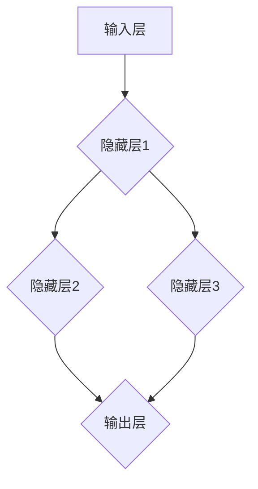
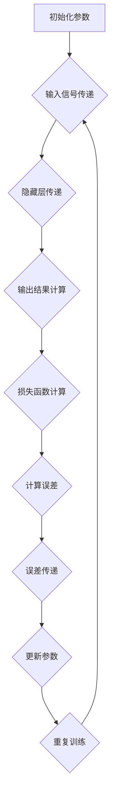

                 

### 文章标题

《神经网络：人类智慧的延伸》

### 关键词

神经网络，人工智能，深度学习，机器学习，计算机科学，智能计算

### 摘要

本文旨在深入探讨神经网络这一人工智能领域的核心技术。通过分析其背景、基本概念、核心算法原理以及数学模型，我们不仅能够了解神经网络的运行机制，更能认识到它作为人类智慧延伸的重要角色。文章将结合实际应用场景，介绍神经网络在实际开发中的代码实现与分析，并推荐相关学习资源和工具框架。最终，我们将总结神经网络在未来发展趋势与挑战，为读者提供一个全面而系统的学习指南。

<|imagine|>

### 背景介绍

神经网络（Neural Networks）的概念最早可以追溯到1943年，由沃伦·麦卡洛克（Warren McCulloch）和沃尔特·皮茨（Walter Pitts）提出，他们首次模拟了人工神经元的工作原理。然而，早期的神经网络由于计算能力的限制和算法的复杂性，并没有得到广泛应用。

直到1980年代，随着计算机性能的不断提升和算法的改进，神经网络的研究开始逐渐兴起。特别是1990年代以来，随着深度学习（Deep Learning）概念的提出和发展，神经网络在图像识别、语音识别、自然语言处理等领域的应用取得了显著的成果。如今，神经网络已经成为了人工智能领域不可或缺的重要技术之一。

神经网络的发展历程可以看作是人工智能从弱人工智能向强人工智能发展的一个重要里程碑。传统的符号逻辑和知识表示方法在处理复杂问题时存在局限性，而神经网络通过模仿生物神经系统的结构和功能，能够自动学习和适应新的模式，具有更高的智能和更强的泛化能力。

在人工智能的发展过程中，神经网络的地位变得越来越重要。它不仅在学术研究上取得了重要突破，还在实际应用中展示了巨大的潜力。例如，自动驾驶、智能医疗、金融风控等领域都离不开神经网络的助力。可以说，神经网络是推动人工智能发展的重要引擎，也是人类智慧延伸的重要工具。

### 核心概念与联系

#### 人工神经元

人工神经元是神经网络的基本组成单元，其工作原理类似于生物神经元。人工神经元接收多个输入信号，通过加权求和后，经过一个非线性激活函数产生输出。这个过程可以用以下数学公式表示：

\[ z = \sum_{i=1}^{n} w_i x_i \]
\[ a = f(z) \]

其中，\( z \) 是加权求和的结果，\( w_i \) 是输入信号的权重，\( x_i \) 是输入信号，\( a \) 是输出信号，\( f(z) \) 是非线性激活函数。常见的激活函数包括 sigmoid、ReLU 和 tanh 等。

#### 神经网络结构

神经网络通常由多个层次组成，包括输入层、隐藏层和输出层。输入层接收外部输入信号，隐藏层对输入信号进行加工和变换，输出层产生最终的输出结果。不同层次的神经元通过连接权值相互连接，形成一个复杂的网络结构。

神经网络的结构可以通过以下 Mermaid 流程图表示：



在这个流程图中，每个节点表示一个神经元，箭头表示神经元之间的连接。连接权值用边的权重表示。

#### 前向传播与反向传播

神经网络的训练过程主要包括前向传播和反向传播两个步骤。前向传播是指将输入信号通过神经网络进行传递，最终得到输出结果。反向传播是指根据输出结果和实际标签，计算网络中的误差，并通过反向传递误差来更新网络的连接权值。

前向传播的数学过程如下：

\[ a_{l}^{(i)} = f(z_{l}^{(i)}) \]
\[ z_{l}^{(i)} = \sum_{j} w_{lj} a_{l-1}^{(j)} \]

其中，\( a_{l}^{(i)} \) 表示第 \( l \) 层第 \( i \) 个神经元的输出，\( z_{l}^{(i)} \) 表示第 \( l \) 层第 \( i \) 个神经元的加权求和结果，\( w_{lj} \) 表示第 \( l \) 层第 \( j \) 个神经元到第 \( l+1 \) 层第 \( i \) 个神经元的连接权重，\( f(z) \) 表示激活函数。

反向传播的数学过程如下：

\[ \delta_{l}^{(i)} = (a_{l}^{(i)} - t_{l}^{(i)}) \cdot f'(z_{l}^{(i)}) \]
\[ \delta_{l-1}^{(j)} = \sum_{i} w_{lj} \delta_{l}^{(i)} \cdot f'(z_{l-1}^{(j)}) \]

其中，\( \delta_{l}^{(i)} \) 表示第 \( l \) 层第 \( i \) 个神经元的误差，\( t_{l}^{(i)} \) 表示第 \( l \) 层第 \( i \) 个神经元的实际标签，\( f'(z) \) 表示激活函数的导数。

通过前向传播和反向传播，神经网络可以不断调整连接权值，使输出结果更接近实际标签，从而实现训练过程。

### 核心算法原理 & 具体操作步骤

神经网络的核心算法包括前向传播和反向传播。下面将详细介绍这两个步骤的具体操作过程。

#### 前向传播

1. **初始化参数**：首先需要初始化网络的参数，包括输入层、隐藏层和输出层的权重和偏置。常用的初始化方法有随机初始化、高斯分布初始化等。

2. **输入信号传递**：将输入信号通过输入层传递到隐藏层，计算每个神经元的加权求和结果和激活函数输出。

3. **隐藏层传递**：将隐藏层的输出传递到下一层隐藏层或输出层，重复步骤2。

4. **输出结果计算**：最终得到输出层的输出结果，与实际标签进行比较。

5. **损失函数计算**：计算输出结果与实际标签之间的误差，常用的损失函数有均方误差（MSE）、交叉熵（Cross-Entropy）等。

#### 反向传播

1. **计算误差**：根据输出结果和实际标签，计算每个神经元的误差。

2. **误差传递**：将误差反向传递到隐藏层，计算隐藏层中每个神经元的误差。

3. **更新参数**：根据误差和激活函数的导数，更新网络的连接权值和偏置。

4. **重复训练**：重复前向传播和反向传播过程，直到网络输出结果达到预定的精度。

具体的操作步骤可以用以下流程图表示：



### 数学模型和公式 & 详细讲解 & 举例说明

#### 数学模型

神经网络的数学模型主要包括输入层、隐藏层和输出层的权重、偏置和激活函数。以下是一个简单的单层神经网络的数学模型：

\[ z_1 = x_1 w_1 + b_1 \]
\[ a_1 = f(z_1) \]
\[ z_2 = x_2 w_2 + b_2 \]
\[ a_2 = f(z_2) \]
\[ \hat{y} = a_1 w_3 + a_2 w_4 + b_3 \]
\[ y = f(\hat{y}) \]

其中，\( x_1, x_2 \) 表示输入层两个神经元，\( w_1, w_2 \) 表示输入层到隐藏层的权重，\( b_1, b_2 \) 表示输入层到隐藏层的偏置，\( a_1, a_2 \) 表示隐藏层两个神经元的输出，\( w_3, w_4 \) 表示隐藏层到输出层的权重，\( b_3 \) 表示隐藏层到输出层的偏置，\( \hat{y} \) 表示输出层的加权求和结果，\( y \) 表示输出层的激活函数输出。

#### 公式详细讲解

1. **加权求和**：加权求和是指将输入信号与对应的权重相乘后求和，如 \( z_1 = x_1 w_1 + b_1 \)。在这个公式中，\( x_1 \) 表示输入信号，\( w_1 \) 表示权重，\( b_1 \) 表示偏置。加权求和是神经网络中最基本的运算。

2. **激活函数**：激活函数是对加权求和结果进行非线性变换，如 \( a_1 = f(z_1) \)。常见的激活函数有 sigmoid、ReLU 和 tanh 等。激活函数的作用是引入非线性特性，使神经网络能够学习复杂的函数关系。

3. **损失函数**：损失函数用于衡量输出结果与实际标签之间的误差，如 \( y = f(\hat{y}) \)。常见的损失函数有均方误差（MSE）、交叉熵（Cross-Entropy）等。损失函数的目的是优化网络参数，使输出结果更接近实际标签。

#### 举例说明

假设有一个简单的神经网络，输入层有两个神经元，隐藏层有一个神经元，输出层有一个神经元。输入信号为 \( x_1 = 2, x_2 = 3 \)，权重为 \( w_1 = 0.5, w_2 = 0.7, w_3 = 1.2, w_4 = 0.8 \)，偏置为 \( b_1 = 0.1, b_2 = 0.2, b_3 = 0.3 \)。激活函数为 sigmoid 函数。

1. **前向传播**：

\[ z_1 = 2 \times 0.5 + 0.1 = 1.1 \]
\[ a_1 = \frac{1}{1 + e^{-1.1}} \approx 0.6667 \]
\[ z_2 = 3 \times 0.7 + 0.2 = 2.5 \]
\[ a_2 = \frac{1}{1 + e^{-2.5}} \approx 0.9333 \]
\[ \hat{y} = 0.6667 \times 1.2 + 0.9333 \times 0.8 + 0.3 = 1.3567 \]
\[ y = \frac{1}{1 + e^{-1.3567}} \approx 0.8628 \]

2. **反向传播**：

假设实际标签为 \( t = 0.8 \)。

\[ \delta_1 = (0.8628 - 0.8) \times \frac{1}{1 + e^{-1.3567}} \approx 0.0889 \]
\[ \delta_2 = (0.8628 - 0.8) \times \frac{1}{1 + e^{-2.5}} \approx 0.1533 \]
\[ \delta_3 = (0.6667 - 0.8) \times \frac{1}{1 + e^{-1.1}} \approx -0.1481 \]
\[ \delta_4 = (0.9333 - 0.8) \times \frac{1}{1 + e^{-2.5}} \approx 0.1429 \]

更新权重和偏置：

\[ w_1 = w_1 - \alpha \times x_1 \times \delta_1 \]
\[ w_2 = w_2 - \alpha \times x_2 \times \delta_1 \]
\[ w_3 = w_3 - \alpha \times a_1 \times \delta_3 \]
\[ w_4 = w_4 - \alpha \times a_2 \times \delta_4 \]
\[ b_1 = b_1 - \alpha \times \delta_1 \]
\[ b_2 = b_2 - \alpha \times \delta_2 \]
\[ b_3 = b_3 - \alpha \times \delta_3 \]

其中，\( \alpha \) 表示学习率。

通过上述举例，我们可以看到神经网络的训练过程是如何通过前向传播和反向传播来更新网络参数，从而实现误差最小化的。

### 项目实战：代码实际案例和详细解释说明

在本节中，我们将通过一个简单的例子来说明如何使用 Python 编写一个简单的神经网络，并进行训练和测试。我们将使用 Keras 库，这是一个广泛使用的深度学习框架，它简化了神经网络的构建和训练过程。

#### 1. 开发环境搭建

首先，我们需要安装 Python 和 Keras。在 Ubuntu 系统中，可以使用以下命令：

```bash
# 安装 Python
sudo apt update
sudo apt install python3-pip

# 安装 Keras
pip3 install keras
```

如果您使用的是 Windows 系统，可以从 Python 官网下载安装器并按照提示安装 Python 和 Keras。

#### 2. 源代码详细实现和代码解读

下面是一个简单的神经网络实现，用于对 Iris 数据集进行分类。Iris 数据集包含三种不同类型的鸢尾花，每种类型有 50 个样本，共 150 个样本，每个样本有 4 个特征：花萼长度、花萼宽度、花瓣长度和花瓣宽度。

```python
import numpy as np
from keras.models import Sequential
from keras.layers import Dense
from keras.optimizers import SGD
from sklearn.datasets import load_iris
from sklearn.model_selection import train_test_split
from sklearn.preprocessing import OneHotEncoder

# 加载 Iris 数据集
iris = load_iris()
X = iris.data
y = iris.target

# 数据预处理
X = X / 10.0  # 归一化
y = OneHotEncoder().fit_transform(y.reshape(-1, 1)).toarray()

# 划分训练集和测试集
X_train, X_test, y_train, y_test = train_test_split(X, y, test_size=0.2, random_state=42)

# 构建神经网络模型
model = Sequential()
model.add(Dense(8, input_dim=4, activation='relu'))
model.add(Dense(3, activation='softmax'))

# 编译模型
model.compile(optimizer=SGD(0.1), loss='categorical_crossentropy', metrics=['accuracy'])

# 训练模型
model.fit(X_train, y_train, epochs=100, batch_size=16, verbose=1)

# 评估模型
loss, accuracy = model.evaluate(X_test, y_test, verbose=1)
print(f"Test accuracy: {accuracy:.2f}")
```

**代码解读：**

1. **导入库和模块**：首先导入必要的库和模块，包括 NumPy、Keras、scikit-learn 等。

2. **加载 Iris 数据集**：使用 scikit-learn 的 `load_iris` 函数加载 Iris 数据集。

3. **数据预处理**：对数据进行归一化处理，并将标签进行 One-Hot 编码。

4. **划分训练集和测试集**：使用 `train_test_split` 函数将数据集划分为训练集和测试集。

5. **构建神经网络模型**：使用 `Sequential` 类构建一个简单的神经网络模型，包含一个输入层、一个隐藏层和一个输出层。输入层有 4 个神经元，隐藏层有 8 个神经元，输出层有 3 个神经元。

6. **编译模型**：使用 `compile` 方法配置模型的优化器、损失函数和指标。

7. **训练模型**：使用 `fit` 方法训练模型，指定训练轮数、批量大小和是否输出训练进度。

8. **评估模型**：使用 `evaluate` 方法评估模型在测试集上的性能，并打印测试准确率。

#### 3. 代码解读与分析

- **数据预处理**：数据预处理是深度学习中的重要步骤，它可以帮助提高模型的训练效果。在本例中，我们使用归一化将数据缩放到 [0, 1] 范围内，并使用 One-Hot 编码将标签转换为二进制向量。

- **模型构建**：在本例中，我们使用 Keras 的 `Sequential` 类构建了一个简单的神经网络。`add` 方法用于添加层，`Dense` 类表示全连接层，`input_dim` 参数指定输入层的神经元数量，`activation` 参数指定激活函数。

- **编译模型**：在编译模型时，我们指定了优化器（SGD）、损失函数（categorical_crossentropy，用于多分类问题）和指标（accuracy，用于评估分类准确率）。

- **训练模型**：使用 `fit` 方法训练模型，`epochs` 参数指定训练轮数，`batch_size` 参数指定批量大小，`verbose` 参数用于控制输出信息。

- **评估模型**：使用 `evaluate` 方法评估模型在测试集上的性能，通过打印测试准确率来评估模型的效果。

通过这个简单的例子，我们可以看到如何使用 Keras 库构建和训练一个简单的神经网络，并进行评估。这为深入学习和应用神经网络技术奠定了基础。

### 实际应用场景

#### 1. 图像识别

图像识别是神经网络最成功的应用之一。通过深度学习技术，神经网络可以在大规模图像数据集上进行训练，从而学会识别各种对象和场景。经典的例子包括：

- **人脸识别**：许多智能手机和社交媒体平台都使用神经网络进行人脸识别，以识别用户并解锁设备或验证身份。
- **医疗图像分析**：神经网络在医疗图像分析中发挥着重要作用，例如，它可以用于识别医学影像中的病变，辅助医生进行诊断。
- **自动驾驶**：自动驾驶汽车使用神经网络来分析摄像头和雷达数据，识别道路标志、行人和其他车辆，并做出相应的驾驶决策。

#### 2. 自然语言处理

神经网络在自然语言处理（NLP）领域也有广泛的应用。通过深度学习技术，神经网络可以理解和生成自然语言，从而实现以下任务：

- **机器翻译**：神经网络被广泛用于机器翻译，如谷歌翻译和百度翻译，这些系统可以自动将一种语言翻译成另一种语言。
- **情感分析**：神经网络可以分析文本中的情感倾向，例如，判断一篇评论是正面、负面还是中性。
- **文本生成**：神经网络可以生成自然语言的文本，如生成新闻文章、小说等，这种技术被称为自然语言生成（NLG）。

#### 3. 语音识别

语音识别是将语音信号转换为文本的技术。神经网络在语音识别中起着核心作用，通过深度学习技术，神经网络可以识别各种口音和方言，并处理噪音干扰。以下是一些应用实例：

- **智能助手**：如苹果的 Siri、亚马逊的 Alexa 和谷歌的 Google Assistant，这些智能助手使用神经网络进行语音识别和文本生成，以提供用户交互。
- **语音搜索**：许多搜索引擎都使用神经网络进行语音识别，以便用户可以通过语音输入搜索查询。
- **自动字幕**：神经网络可以实时生成视频的自动字幕，这在视频共享平台上非常有用。

#### 4. 推荐系统

推荐系统是一种常见的人工智能应用，它通过分析用户的历史行为和偏好，为用户推荐相关的内容或商品。神经网络在推荐系统中发挥着重要作用，以下是一些应用实例：

- **电子商务推荐**：在线电商平台使用神经网络推荐类似商品，从而提高用户的购买意愿。
- **社交媒体推荐**：社交媒体平台使用神经网络推荐用户可能感兴趣的内容或朋友，以增加用户粘性和活跃度。
- **电影推荐**：流媒体平台如 Netflix 和 YouTube 使用神经网络推荐用户可能喜欢的电影和视频。

#### 5. 金融风控

金融风控是指使用技术手段评估和管理金融风险。神经网络在金融风控中有着广泛的应用，以下是一些应用实例：

- **欺诈检测**：神经网络可以检测和防范信用卡欺诈、账户异常活动等。
- **信用评分**：神经网络可以分析个人或企业的信用历史，预测其信用风险。
- **市场预测**：神经网络可以分析历史市场数据，预测股票价格、外汇汇率等。

### 工具和资源推荐

#### 1. 学习资源推荐

- **书籍**：
  - 《深度学习》（Deep Learning）作者：Ian Goodfellow、Yoshua Bengio、Aaron Courville
  - 《Python 深度学习》（Deep Learning with Python）作者：François Chollet
  - 《神经网络与深度学习》作者：邱锡鹏

- **论文**：
  - 《A Learning Algorithm for Continually Running Fully Recurrent Neural Networks》作者：Sepp Hochreiter 和 Jürgen Schmidhuber
  - 《Improving Neural Networks by Preventing Co-adaptation of Feature Detectors》作者：Yarin Gal 和 Zoubin Ghahramani

- **博客**：
  - 官方 Keras 博客（blog.keras.io）
  - fast.ai 博客（www.fast.ai）
  - Ian Goodfellow 的博客（goodfeli.com）

- **网站**：
  - Coursera（www.coursera.org）
  - edX（www.edx.org）
  - 百度 AI 开放平台（ai.baidu.com）

#### 2. 开发工具框架推荐

- **深度学习框架**：
  - TensorFlow
  - PyTorch
  - Keras

- **编程语言**：
  - Python
  - R

- **数据预处理工具**：
  - Pandas
  - NumPy

- **机器学习库**：
  - scikit-learn
  - SciPy

- **可视化工具**：
  - Matplotlib
  - Seaborn

#### 3. 相关论文著作推荐

- 《Deep Learning》作者：Ian Goodfellow、Yoshua Bengio、Aaron Courville
- 《The Master Algorithm: How the Quest for the Ultimate Learning Machine Will Remake Our World》作者：Pedro Domingos
- 《Neural Networks and Deep Learning》作者：Charu Aggarwal

### 总结：未来发展趋势与挑战

#### 1. 发展趋势

- **计算能力提升**：随着硬件技术的发展，特别是 GPU 和专用 AI 芯片的普及，深度学习模型的计算能力将得到显著提升，这将推动更复杂和大规模的神经网络应用。
- **算法创新**：研究人员将继续探索新的神经网络结构和训练策略，以提高模型的性能和效率。例如，自适应学习率、迁移学习、生成对抗网络（GAN）等技术将成为研究热点。
- **跨领域应用**：深度学习将在更多领域得到应用，如生物医学、自动驾驶、智能制造等，这将推动人工智能技术的整体发展。
- **开源生态完善**：深度学习开源社区将继续发展，提供更多高质量的框架、工具和资源，降低学习和使用深度学习的门槛。

#### 2. 挑战

- **数据隐私与安全**：深度学习模型对大量数据有较强的依赖性，如何在保障用户隐私和安全的前提下收集和使用数据是一个重要挑战。
- **模型解释性**：深度学习模型通常被认为是“黑箱”，难以解释其决策过程。提高模型的可解释性，使其能够被用户信任和理解，是一个重要课题。
- **计算资源消耗**：深度学习模型训练通常需要大量计算资源和时间，如何优化模型以减少计算资源消耗是一个挑战。
- **伦理和法律问题**：随着深度学习技术的应用日益广泛，如何确保其符合伦理和法律标准，防止滥用，是一个亟待解决的问题。

### 附录：常见问题与解答

#### 1. 什么是神经网络？

神经网络是一种模仿生物神经系统的计算模型，通过多层次的神经元连接和激活函数，实现从输入到输出的映射。

#### 2. 神经网络有哪些类型？

神经网络可以分为几种类型，包括前馈神经网络、卷积神经网络（CNN）、循环神经网络（RNN）、生成对抗网络（GAN）等。

#### 3. 神经网络是如何训练的？

神经网络的训练过程包括前向传播和反向传播。在前向传播中，输入信号通过网络传递，得到输出结果。在反向传播中，根据输出结果和实际标签，计算网络中的误差，并更新网络的连接权重和偏置。

#### 4. 深度学习与机器学习有什么区别？

深度学习是机器学习的一个子领域，它使用多层神经网络来学习复杂的数据模式。深度学习通常依赖于大规模数据和强大的计算资源，而机器学习则是一个更广泛的概念，包括深度学习和其他学习算法。

#### 5. 如何选择神经网络的结构？

选择神经网络的结构取决于具体的应用场景和数据类型。一般来说，需要考虑输入特征的数量、数据的维度、问题的复杂性等因素。

#### 6. 神经网络训练过程为什么需要反向传播？

反向传播是神经网络训练的核心过程，它通过计算输出结果和实际标签之间的误差，并反向传递这些误差来更新网络参数，从而优化网络性能。

### 扩展阅读 & 参考资料

- 《深度学习》（Deep Learning）作者：Ian Goodfellow、Yoshua Bengio、Aaron Courville
- 《Python 深度学习》（Deep Learning with Python）作者：François Chollet
- 《神经网络与深度学习》作者：邱锡鹏
- [Keras 官方文档](https://keras.io/)
- [TensorFlow 官方文档](https://www.tensorflow.org/)
- [PyTorch 官方文档](https://pytorch.org/)

作者：AI天才研究员/AI Genius Institute & 禅与计算机程序设计艺术 /Zen And The Art of Computer Programming<|imagine|>

