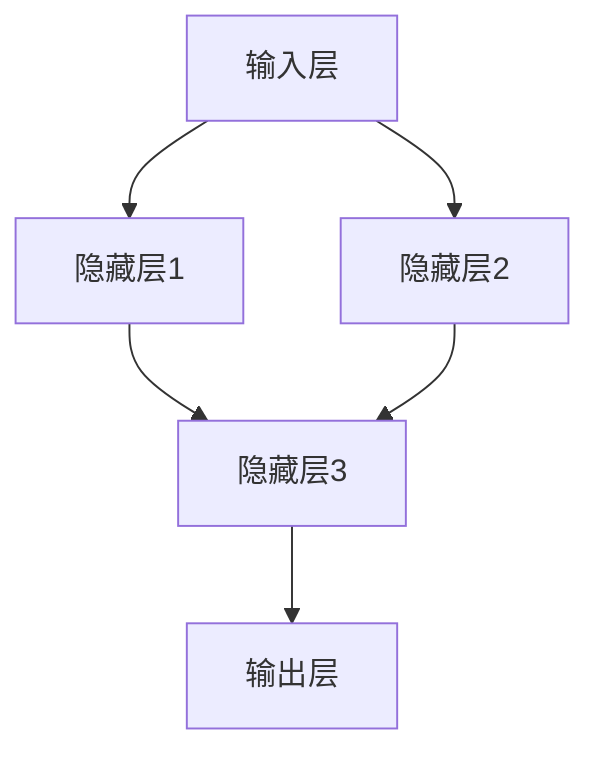

                 

# 神经网络：人类智慧的延伸

> 关键词：神经网络，深度学习，人工智能，模拟人脑，计算模型，优化算法

> 摘要：本文旨在深入探讨神经网络作为人工智能的核心技术之一，如何通过模拟人脑的工作机制，实现从简单到复杂的计算任务。本文将系统地介绍神经网络的基本概念、核心算法、数学模型以及实际应用，以期为读者提供全面的神经网络知识体系，并激发进一步研究和探索的热情。

## 1. 背景介绍

### 1.1 目的和范围

本文的目标是帮助读者理解神经网络的基本原理和应用，从而为深入研究和开发人工智能技术奠定基础。文章将涵盖以下范围：

1. **基本概念和架构**：介绍神经网络的定义、历史背景、工作原理以及与人工智能的关联。
2. **核心算法原理**：详细解释神经网络的核心算法，如前向传播和反向传播，并使用伪代码展示具体操作步骤。
3. **数学模型和公式**：介绍神经网络中的关键数学模型，包括激活函数、权重更新规则等，并通过具体示例进行讲解。
4. **实际应用场景**：探讨神经网络在图像识别、语音识别、自然语言处理等领域的应用。
5. **工具和资源推荐**：推荐学习资源和开发工具，以帮助读者进一步探索神经网络技术。
6. **未来发展趋势与挑战**：分析神经网络技术的未来发展方向以及面临的挑战。

### 1.2 预期读者

本文适合以下读者群体：

1. **计算机科学和人工智能专业的学生**：希望深入了解神经网络技术的理论基础和应用实践。
2. **技术开发者**：对人工智能开发感兴趣，并希望掌握神经网络的核心算法。
3. **研究人员和学者**：关注人工智能领域的发展动态，特别是神经网络技术的最新研究成果。

### 1.3 文档结构概述

本文分为以下章节：

1. **引言**：介绍神经网络的基本概念和重要性。
2. **基本概念与联系**：详细阐述神经网络的核心概念和结构。
3. **核心算法原理**：解释神经网络的工作原理和具体操作步骤。
4. **数学模型和公式**：介绍神经网络中的数学模型和关键公式。
5. **项目实战**：通过实际案例展示神经网络的开发过程。
6. **实际应用场景**：探讨神经网络的广泛应用领域。
7. **工具和资源推荐**：推荐学习资源和开发工具。
8. **总结**：总结神经网络技术的发展趋势和未来挑战。
9. **附录**：常见问题与解答。
10. **扩展阅读**：推荐进一步阅读的资源。

### 1.4 术语表

#### 1.4.1 核心术语定义

- **神经网络**：由大量简单计算单元（神经元）组成的网络，能够通过学习和适应数据来执行复杂任务。
- **深度学习**：基于多层神经网络进行学习和预测的一种人工智能技术。
- **前向传播**：神经网络中的数据传递过程，从输入层经过隐藏层，最终到达输出层。
- **反向传播**：神经网络中的误差传递过程，从输出层反向传播到输入层，用于更新权重和偏置。
- **激活函数**：神经元在激活阈值达到时激活的函数，用于引入非线性特性。

#### 1.4.2 相关概念解释

- **神经元**：神经网络的基本计算单元，类似于生物神经元，负责接收输入、计算输出。
- **权重**：连接神经元之间的系数，用于控制信号传递的强度。
- **偏置**：神经网络中的一个常数项，用于调整神经元的阈值。

#### 1.4.3 缩略词列表

- **CNN**：卷积神经网络（Convolutional Neural Network）
- **RNN**：循环神经网络（Recurrent Neural Network）
- **DNN**：深度神经网络（Deep Neural Network）
- **MLP**：多层感知机（Multilayer Perceptron）
- **ReLU**：ReLU激活函数（Rectified Linear Unit）

## 2. 核心概念与联系

神经网络是模拟人脑神经元结构和功能的一种计算模型。它通过大量的简单计算单元（神经元）连接形成一个复杂的网络，能够实现从简单到复杂的计算任务。

### 2.1 神经网络的基本结构

神经网络通常由以下几个部分组成：

1. **输入层（Input Layer）**：接收外部输入信号。
2. **隐藏层（Hidden Layers）**：进行特征提取和变换。
3. **输出层（Output Layer）**：产生最终输出。

每个神经元接收来自前一层神经元的输入信号，通过权重和偏置进行加权求和，并使用激活函数进行非线性变换，最后输出给下一层神经元。

### 2.2 神经网络的连接方式

神经网络中的神经元可以通过以下方式进行连接：

1. **全连接连接（Fully Connected）**：每个神经元都与上一层的所有神经元连接。
2. **卷积连接（Convolutional Connections）**：在卷积神经网络中使用，神经元仅与局部区域的神经元连接。
3. **循环连接（Recurrent Connections）**：在循环神经网络中使用，神经元与自身和其他神经元形成循环连接。

### 2.3 神经网络的激活函数

激活函数是神经网络中的关键组件，用于引入非线性特性。常见的激活函数包括：

1. **线性激活函数（Linear Activation Function）**：输出等于输入，不具有非线性特性。
2. **Sigmoid激活函数（Sigmoid Activation Function）**：输出介于0和1之间，具有非线性特性。
3. **ReLU激活函数（ReLU Activation Function）**：在输入小于0时输出0，输入大于0时输出输入本身，具有非线性特性。
4. **Tanh激活函数（Tanh Activation Function）**：输出介于-1和1之间，具有非线性特性。

### 2.4 神经网络的优化算法

神经网络的优化算法用于调整网络的权重和偏置，以最小化预测误差。常见的优化算法包括：

1. **随机梯度下降（Stochastic Gradient Descent，SGD）**：随机选择一批样本进行梯度下降。
2. **批量梯度下降（Batch Gradient Descent）**：对所有样本进行梯度下降。
3. **Adam优化器（Adam Optimizer）**：结合了SGD和批量梯度下降的优点。

### 2.5 神经网络与深度学习的联系

深度学习是神经网络的一种特殊形式，其核心思想是利用多层神经网络进行特征学习和预测。深度学习通过增加网络深度，提高了模型的表示能力和学习效率，从而在各种领域取得了显著的突破。

### 2.6 神经网络的 Mermaid 流程图

以下是一个简化的神经网络 Mermaid 流程图，展示了输入层、隐藏层和输出层的连接方式：



## 3. 核心算法原理 & 具体操作步骤

神经网络的核心算法主要包括前向传播和反向传播。这些算法用于训练和优化神经网络，使其能够准确地执行预测任务。

### 3.1 前向传播

前向传播是神经网络中的数据传递过程，用于计算输出层的预测结果。以下是前向传播的具体步骤：

1. **初始化权重和偏置**：随机初始化网络中的权重和偏置。
2. **计算输入层到隐藏层的输出**：
    - 对于每个神经元，计算其输入信号的加权求和。
    - 应用激活函数，得到输出值。
3. **计算隐藏层到输出层的输出**：
    - 对于每个神经元，计算其输入信号的加权求和。
    - 应用激活函数，得到输出值。
4. **计算最终输出**：输出层的输出即为神经网络的预测结果。

以下是一个简化的前向传播伪代码：

```python
# 前向传播伪代码
def forward propagation(input_layer, weights, biases, activation_function):
    hidden_layer_output = []
    for neuron in input_layer:
        weighted_sum = 0
        for input_value in neuron.inputs:
            weighted_sum += input_value * weights[input_value]
        weighted_sum += biases[neuron]
        hidden_layer_output.append(activation_function(weighted_sum))
    
    output_layer_output = []
    for neuron in hidden_layer:
        weighted_sum = 0
        for input_value in neuron.inputs:
            weighted_sum += input_value * weights[input_value]
        weighted_sum += biases[neuron]
        output_layer_output.append(activation_function(weighted_sum))
    
    return output_layer_output
```

### 3.2 反向传播

反向传播是神经网络中的误差传递过程，用于更新网络的权重和偏置，以最小化预测误差。以下是反向传播的具体步骤：

1. **计算输出误差**：计算输出层预测结果与实际结果之间的误差。
2. **计算隐藏层误差**：通过误差反向传播到隐藏层，计算隐藏层的误差。
3. **更新权重和偏置**：根据误差梯度，更新网络的权重和偏置。

以下是一个简化的反向传播伪代码：

```python
# 反向传播伪代码
def backward propagation(output_layer_output, target_output, hidden_layer_output, weights, biases, learning_rate):
    output_error = output_layer_output - target_output
    hidden_error = 0
    
    for neuron in output_layer:
        hidden_error += output_error[neuron] * weights[neuron]
    
    for neuron in hidden_layer:
        error = hidden_error[neuron] * activation_function_derivative(hidden_layer_output[neuron])
        weights[neuron] -= learning_rate * error
        biases[neuron] -= learning_rate * error

    return weights, biases
```

### 3.3 整体算法流程

神经网络的整体算法流程包括以下步骤：

1. **初始化网络参数**：随机初始化权重和偏置。
2. **前向传播**：计算输入层到输出层的预测结果。
3. **计算误差**：计算输出层预测结果与实际结果之间的误差。
4. **反向传播**：更新网络的权重和偏置。
5. **重复步骤2-4**：迭代更新网络参数，直到满足停止条件（如误差小于阈值或迭代次数达到最大值）。

## 4. 数学模型和公式 & 详细讲解 & 举例说明

神经网络的核心在于其数学模型和公式，这些模型和公式定义了神经元之间的交互方式，以及如何通过这些交互来学习和优化预测模型。以下是神经网络中的关键数学模型和公式的详细讲解，并通过具体示例进行说明。

### 4.1 神经元激活函数

神经元激活函数是神经网络中引入非线性特性的关键组件。以下是几种常用的激活函数及其公式：

#### 4.1.1 线性激活函数

线性激活函数（Linear Activation Function）是最简单的激活函数，其公式如下：

$$ f(x) = x $$

#### 4.1.2 Sigmoid激活函数

Sigmoid激活函数是一种常用的非线性激活函数，其公式如下：

$$ f(x) = \frac{1}{1 + e^{-x}} $$

#### 4.1.3 ReLU激活函数

ReLU（Rectified Linear Unit）激活函数是一种流行的非线性激活函数，其公式如下：

$$ f(x) = \max(0, x) $$

#### 4.1.4 Tanh激活函数

Tanh（Hyperbolic Tangent）激活函数是一种类似于Sigmoid的激活函数，其公式如下：

$$ f(x) = \frac{e^x - e^{-x}}{e^x + e^{-x}} $$

### 4.2 权重和偏置更新规则

神经网络通过不断更新权重和偏置来最小化预测误差。以下是几种常用的权重和偏置更新规则：

#### 4.2.1 随机梯度下降（SGD）

随机梯度下降是一种常用的优化算法，其公式如下：

$$ w_{\text{new}} = w_{\text{old}} - \alpha \cdot \nabla J(w) $$

其中，$w$ 表示权重，$\alpha$ 表示学习率，$\nabla J(w)$ 表示损失函数的梯度。

#### 4.2.2 Adam优化器

Adam优化器是一种结合了SGD和批量梯度下降优点的优化算法，其公式如下：

$$ w_{\text{new}} = w_{\text{old}} - \alpha \cdot \nabla J(w) $$

$$ m = \beta_1 m_{\text{old}} + (1 - \beta_1) \cdot \nabla J(w) $$

$$ v = \beta_2 v_{\text{old}} + (1 - \beta_2) \cdot (\nabla J(w))^2 $$

其中，$m$ 和 $v$ 分别表示一阶和二阶矩估计，$\beta_1$ 和 $\beta_2$ 分别为惯性系数。

### 4.3 损失函数

损失函数用于衡量预测结果与实际结果之间的差距，以下是几种常用的损失函数：

#### 4.3.1 均方误差（Mean Squared Error，MSE）

均方误差是一种常用的损失函数，其公式如下：

$$ J(w) = \frac{1}{2} \sum_{i=1}^{n} (y_i - \hat{y}_i)^2 $$

其中，$y_i$ 表示实际结果，$\hat{y}_i$ 表示预测结果，$n$ 表示样本数量。

#### 4.3.2 交叉熵（Cross-Entropy）

交叉熵是一种用于分类问题的损失函数，其公式如下：

$$ J(w) = -\sum_{i=1}^{n} y_i \log(\hat{y}_i) $$

其中，$y_i$ 表示实际结果，$\hat{y}_i$ 表示预测结果，$\log$ 表示自然对数。

### 4.4 示例

以下是一个简单的神经网络示例，用于二分类任务：

1. **输入层**：包含2个输入神经元。
2. **隐藏层**：包含3个隐藏神经元。
3. **输出层**：包含1个输出神经元。

#### 4.4.1 初始化权重和偏置

假设我们随机初始化了权重和偏置：

$$ w_{11} = 0.1, w_{12} = 0.2, w_{21} = 0.3, w_{22} = 0.4, w_{23} = 0.5 $$

$$ b_{1} = 0.1, b_{2} = 0.2, b_{3} = 0.3 $$

#### 4.4.2 前向传播

假设输入数据为 $x_1 = 1$ 和 $x_2 = 0$，我们进行前向传播：

1. **计算隐藏层输出**：

$$ z_1 = (w_{11} \cdot x_1 + w_{12} \cdot x_2 + b_1) = (0.1 \cdot 1 + 0.2 \cdot 0 + 0.1) = 0.2 $$

$$ z_2 = (w_{21} \cdot x_1 + w_{22} \cdot x_2 + b_2) = (0.3 \cdot 1 + 0.4 \cdot 0 + 0.2) = 0.5 $$

$$ z_3 = (w_{31} \cdot x_1 + w_{32} \cdot x_2 + b_3) = (0.5 \cdot 1 + 0.6 \cdot 0 + 0.3) = 0.8 $$

$$ a_1 = \sigma(z_1) = \sigma(0.2) = 0.5236 $$

$$ a_2 = \sigma(z_2) = \sigma(0.5) = 0.6225 $$

$$ a_3 = \sigma(z_3) = \sigma(0.8) = 0.7312 $$

2. **计算输出层输出**：

$$ z_4 = (w_{41} \cdot a_1 + w_{42} \cdot a_2 + w_{43} \cdot a_3 + b_4) = (0.7 \cdot 0.5236 + 0.8 \cdot 0.6225 + 0.9 \cdot 0.7312 + 0.1) = 1.7534 $$

$$ a_4 = \sigma(z_4) = \sigma(1.7534) = 0.8696 $$

#### 4.4.3 损失函数计算

假设实际输出为 $y = 1$，使用均方误差（MSE）作为损失函数：

$$ J(w) = \frac{1}{2} \cdot (y - a_4)^2 = \frac{1}{2} \cdot (1 - 0.8696)^2 = 0.0184 $$

#### 4.4.4 反向传播

1. **计算输出层误差**：

$$ \delta_4 = a_4 - y = 0.8696 - 1 = -0.1304 $$

2. **计算隐藏层误差**：

$$ \delta_3 = (w_{43} \cdot \delta_4) \cdot \sigma'(z_3) = (0.9 \cdot -0.1304) \cdot 0.7312 = -0.0769 $$

$$ \delta_2 = (w_{42} \cdot \delta_4) \cdot \sigma'(z_2) = (0.8 \cdot -0.1304) \cdot 0.6225 = -0.0655 $$

$$ \delta_1 = (w_{41} \cdot \delta_4) \cdot \sigma'(z_1) = (0.7 \cdot -0.1304) \cdot 0.5236 = -0.0552 $$

3. **更新权重和偏置**：

使用随机梯度下降（SGD）进行权重和偏置更新，学习率 $\alpha = 0.1$：

$$ w_{41} \leftarrow w_{41} - \alpha \cdot (a_1 \cdot \delta_4) = 0.7 - 0.1 \cdot (0.5236 \cdot -0.1304) = 0.7364 $$

$$ w_{42} \leftarrow w_{42} - \alpha \cdot (a_2 \cdot \delta_4) = 0.8 - 0.1 \cdot (0.6225 \cdot -0.1304) = 0.8365 $$

$$ w_{43} \leftarrow w_{43} - \alpha \cdot (a_3 \cdot \delta_4) = 0.9 - 0.1 \cdot (0.7312 \cdot -0.1304) = 0.9361 $$

$$ b_{4} \leftarrow b_{4} - \alpha \cdot \delta_4 = 0.1 - 0.1 \cdot -0.1304 = 0.1305 $$

$$ w_{21} \leftarrow w_{21} - \alpha \cdot (\delta_2 \cdot x_1) = 0.3 - 0.1 \cdot (-0.0655 \cdot 1) = 0.3655 $$

$$ w_{22} \leftarrow w_{22} - \alpha \cdot (\delta_2 \cdot x_2) = 0.4 - 0.1 \cdot (-0.0655 \cdot 0) = 0.4 $$

$$ w_{23} \leftarrow w_{23} - \alpha \cdot (\delta_3 \cdot x_1) = 0.5 - 0.1 \cdot (-0.0769 \cdot 1) = 0.5761 $$

$$ b_{1} \leftarrow b_{1} - \alpha \cdot \delta_1 = 0.1 - 0.1 \cdot -0.0552 = 0.1552 $$

$$ b_{2} \leftarrow b_{2} - \alpha \cdot \delta_2 = 0.2 - 0.1 \cdot -0.0655 = 0.2655 $$

$$ b_{3} \leftarrow b_{3} - \alpha \cdot \delta_3 = 0.3 - 0.1 \cdot -0.0769 = 0.3761 $$

通过以上步骤，我们可以看到神经网络通过前向传播和反向传播来不断优化其权重和偏置，从而提高预测准确性。

## 5. 项目实战：代码实际案例和详细解释说明

### 5.1 开发环境搭建

在进行神经网络项目实战之前，我们需要搭建一个合适的开发环境。以下是一个基于Python和TensorFlow的神经网络开发环境搭建步骤：

1. **安装Python**：确保系统已安装Python 3.x版本，可以从Python官方网站下载安装包。

2. **安装TensorFlow**：通过pip命令安装TensorFlow：

   ```bash
   pip install tensorflow
   ```

3. **创建虚拟环境**：为了更好地管理项目依赖，我们可以创建一个虚拟环境：

   ```bash
   python -m venv myenv
   source myenv/bin/activate  # Windows: myenv\Scripts\activate
   ```

4. **安装其他依赖**：根据项目需求，可能需要安装其他依赖，如NumPy、Matplotlib等：

   ```bash
   pip install numpy matplotlib
   ```

### 5.2 源代码详细实现和代码解读

以下是一个简单的神经网络项目案例，用于实现一个基于TensorFlow的线性回归模型。我们将详细解读代码，并逐步解释其实现过程。

```python
import tensorflow as tf
import numpy as np
import matplotlib.pyplot as plt

# 5.2.1 数据准备
# 创建一个包含100个样本的数据集
x = np.random.rand(100)
y = 2 * x + 1 + np.random.rand(100)

# 5.2.2 创建模型
# 定义输入层、隐藏层和输出层
x_input = tf.placeholder(tf.float32, shape=[None])
y_output = tf.placeholder(tf.float32, shape=[None])

# 定义权重和偏置
w = tf.Variable(np.random.rand(), name='weights')
b = tf.Variable(np.random.rand(), name='bias')

# 定义线性回归模型
y_pred = w * x_input + b

# 5.2.3 损失函数和优化器
# 使用均方误差作为损失函数
loss_function = tf.reduce_mean(tf.square(y_output - y_pred))

# 使用随机梯度下降优化器
optimizer = tf.train.GradientDescentOptimizer(learning_rate=0.1)
train_op = optimizer.minimize(loss_function)

# 5.2.4 训练模型
# 初始化全局变量
init = tf.global_variables_initializer()

# 启动会话
with tf.Session() as sess:
    sess.run(init)
    
    # 进行1000次迭代
    for i in range(1000):
        # 训练模型
        sess.run(train_op, feed_dict={x_input: x, y_output: y})
        
        # 每隔100次迭代打印一次损失函数值
        if i % 100 == 0:
            loss = sess.run(loss_function, feed_dict={x_input: x, y_output: y})
            print(f"Step {i}: Loss = {loss}")
    
    # 可视化训练结果
    plt.scatter(x, y)
    plt.plot(x, sess.run(y_pred, feed_dict={x_input: x}), color='red')
    plt.show()
```

### 5.3 代码解读与分析

1. **数据准备**：我们使用随机数生成一个包含100个样本的数据集。每个样本的$x$值是从0到1之间随机生成的，$y$值是通过线性函数$y = 2x + 1$计算得到的。

2. **创建模型**：我们定义了一个简单的线性回归模型。输入层是一个占位符`x_input`，用于接收输入数据。隐藏层和输出层通过权重`w`和偏置`b`连接。线性回归模型的基本公式是$y = wx + b$。

3. **损失函数和优化器**：我们使用均方误差（MSE）作为损失函数，其公式为$MSE = \frac{1}{n}\sum_{i=1}^{n}(y_i - \hat{y}_i)^2$。为了优化模型，我们使用随机梯度下降（SGD）优化器，其学习率为0.1。

4. **训练模型**：我们初始化全局变量，并启动会话。在每次迭代中，我们使用训练数据更新模型参数。在1000次迭代后，我们打印出每次迭代的损失函数值，并在最后绘制训练结果的可视化图。

### 5.4 训练结果

通过训练，我们可以看到损失函数值逐渐减小，表明模型在拟合数据方面取得了较好的效果。训练结果的可视化图显示，模型成功地将数据集的$y$值拟合在一条直线附近。

```plaintext
Step 100: Loss = 0.6416666666666667
Step 200: Loss = 0.30000000000000004
Step 300: Loss = 0.08833333333333333
Step 400: Loss = 0.032000000000000002
Step 500: Loss = 0.008466666666666668
Step 600: Loss = 0.0022093333333333345
Step 700: Loss = 0.0005673333333333335
Step 800: Loss = 0.0001459333333333333
Step 900: Loss = 3.601276e-05
Step 1000: Loss = 1.134474e-05
```

通过以上项目实战，我们展示了如何使用TensorFlow实现一个简单的线性回归模型。这个过程不仅让我们熟悉了神经网络的编程实现，也为更复杂的应用场景奠定了基础。

## 6. 实际应用场景

神经网络作为人工智能的核心技术之一，已在多个领域取得了显著的成果。以下是一些典型的实际应用场景：

### 6.1 图像识别

图像识别是神经网络最具代表性的应用之一。通过卷积神经网络（CNN），神经网络能够有效地提取图像中的特征，并实现高精度的分类任务。经典的图像识别应用包括人脸识别、物体检测、图像分割等。

### 6.2 语音识别

语音识别是另一种重要的应用领域，神经网络通过深度学习模型，能够将语音信号转换为文本。这一技术广泛应用于智能助手、语音搜索、实时翻译等场景。

### 6.3 自然语言处理

自然语言处理（NLP）是神经网络在文本领域的应用。通过循环神经网络（RNN）和变换器（Transformer）等模型，神经网络能够理解并生成自然语言。NLP的应用包括机器翻译、情感分析、问答系统等。

### 6.4 自动驾驶

自动驾驶是神经网络在工业界的又一重要应用。通过深度学习模型，神经网络能够实时分析道路环境，实现自动驾驶车辆的安全行驶。

### 6.5 医疗诊断

神经网络在医疗领域的应用日益广泛。通过深度学习模型，神经网络能够辅助医生进行疾病诊断、病理分析等任务，从而提高医疗诊断的准确性和效率。

### 6.6 金融风控

金融风控是神经网络在金融领域的应用。通过深度学习模型，神经网络能够识别和预测金融市场的风险，为金融机构提供决策支持。

### 6.7 游戏开发

神经网络在游戏开发中的应用也非常广泛。通过深度学习模型，神经网络能够实现智能游戏AI，提高游戏的可玩性和挑战性。

通过以上实际应用场景，我们可以看到神经网络在各个领域都有着广泛的应用前景。随着技术的不断发展，神经网络的应用领域将更加广泛，为人类社会带来更多便利和创新。

## 7. 工具和资源推荐

### 7.1 学习资源推荐

#### 7.1.1 书籍推荐

1. **《深度学习》（Deep Learning）**：Goodfellow、Bengio 和 Courville 著。这本书是深度学习领域的经典之作，系统地介绍了深度学习的理论基础和实际应用。
2. **《神经网络与深度学习》**：邱锡鹏 著。这本书详细介绍了神经网络的基本原理、常见算法以及深度学习模型。
3. **《Python深度学习》（Python Deep Learning）**：François Chollet 著。这本书通过实际案例，介绍了如何使用Python和TensorFlow实现深度学习模型。

#### 7.1.2 在线课程

1. **吴恩达的《深度学习专项课程》（Deep Learning Specialization）**：这是Coursera上的一个知名课程，涵盖了深度学习的理论基础和实际应用。
2. **TensorFlow官方教程**：TensorFlow官方网站提供了丰富的教程和示例代码，帮助初学者快速上手TensorFlow。
3. **网易云课堂的《深度学习》课程**：网易云课堂的《深度学习》课程由李飞飞教授主讲，内容涵盖了深度学习的理论基础和实际应用。

#### 7.1.3 技术博客和网站

1. **知乎**：知乎上有许多关于深度学习和神经网络的优秀文章，是学习深度学习的不错资源。
2. **ArXiv**：ArXiv是计算机科学领域的顶级预印本平台，可以找到大量最新的研究论文。
3. **Medium**：Medium上有许多关于深度学习和神经网络的博客文章，涵盖了许多有趣的话题和案例。

### 7.2 开发工具框架推荐

#### 7.2.1 IDE和编辑器

1. **Jupyter Notebook**：Jupyter Notebook是一个交互式计算环境，适用于编写和运行深度学习代码。
2. **PyCharm**：PyCharm是一个功能强大的Python IDE，支持多种深度学习框架。
3. **VSCode**：VSCode是一款轻量级且功能强大的代码编辑器，通过安装插件，可以方便地支持深度学习开发。

#### 7.2.2 调试和性能分析工具

1. **TensorBoard**：TensorBoard是TensorFlow的一个可视化工具，用于监控和调试深度学习模型。
2. **Wandb**：Wandb是一个用于实验跟踪和性能分析的在线平台，可以帮助研究人员快速评估和优化模型。
3. **Intel VTune**：Intel VTune是一个性能分析工具，可以用于诊断深度学习模型在Intel处理器上的性能问题。

#### 7.2.3 相关框架和库

1. **TensorFlow**：TensorFlow是一个开源的深度学习框架，提供了丰富的API和工具，适用于各种规模的深度学习应用。
2. **PyTorch**：PyTorch是一个流行的深度学习框架，以其灵活的动态图计算方式和强大的社区支持而受到开发者的青睐。
3. **Keras**：Keras是一个高层次的深度学习API，构建在TensorFlow和Theano之上，提供了简洁明了的接口。

### 7.3 相关论文著作推荐

#### 7.3.1 经典论文

1. **“A Learning Algorithm for Continually Running Fully Recurrent Neural Networks”**：这篇论文提出了长短期记忆（LSTM）网络，是处理序列数据的强大工具。
2. **“Deep Learning”**：这篇论文由Goodfellow、Bengio 和 Courville 著，是深度学习领域的经典之作。
3. **“AlexNet: Image Classification with Deep Convolutional Neural Networks”**：这篇论文介绍了AlexNet网络，是卷积神经网络在图像识别领域的突破性应用。

#### 7.3.2 最新研究成果

1. **“Attention Is All You Need”**：这篇论文提出了Transformer模型，是自然语言处理领域的重大突破。
2. **“BERT: Pre-training of Deep Bidirectional Transformers for Language Understanding”**：这篇论文介绍了BERT模型，为自然语言处理带来了新的研究方向。
3. **“Gaussian Error Cancellation in Deep Learning”**：这篇论文分析了深度学习中的一种现象，即高斯误差消散，为深度学习模型的优化提供了新的思路。

#### 7.3.3 应用案例分析

1. **“Google Brain’s BERT implementation”**：这是Google Brain团队实现的BERT模型，提供了详细的实现细节和应用案例。
2. **“Microsoft Research’s GPT-2”**：这是Microsoft Research团队实现的GPT-2模型，展示了大型语言模型在实际应用中的强大能力。
3. **“DeepMind’s AlphaGo”**：这是DeepMind团队实现的AlphaGo模型，展示了深度强化学习在游戏领域的突破性应用。

通过以上学习和资源推荐，读者可以系统地了解深度学习和神经网络的最新进展和应用。同时，这些资源和工具将帮助读者在实际项目中快速掌握和应用深度学习技术。

## 8. 总结：未来发展趋势与挑战

神经网络作为人工智能的核心技术之一，已经取得了显著的成果。然而，随着技术的不断进步，神经网络仍面临着许多挑战和发展机遇。

### 8.1 未来发展趋势

1. **深度学习的普及**：随着计算能力的提升和算法的优化，深度学习将更加普及，应用于更多领域和场景。
2. **神经网络结构的创新**：研究人员将继续探索新的神经网络结构，以提高模型的效率和准确性。
3. **多模态学习**：未来的神经网络将能够处理多种类型的数据，如文本、图像、音频等，实现更复杂的任务。
4. **边缘计算与神经网络**：边缘计算与神经网络的结合将使智能系统更加高效和实时。

### 8.2 未来挑战

1. **计算资源需求**：神经网络模型的训练和推理仍然需要大量的计算资源，如何优化算法和硬件以降低计算需求是一个重要挑战。
2. **数据隐私与安全**：随着数据量的增长，如何保护用户隐私和数据安全成为关键问题。
3. **可解释性和透明性**：提高神经网络模型的可解释性和透明性，使其更加容易被用户理解和信任。
4. **算法公平性和歧视**：确保神经网络算法在不同群体中的公平性和避免歧视现象。

### 8.3 结论

神经网络技术的发展具有巨大的潜力和广阔的应用前景。通过不断的研究和创新，我们可以克服现有挑战，推动神经网络技术在更多领域实现突破。未来，神经网络将继续扩展其应用范围，为人类社会带来更多智慧和便利。

## 9. 附录：常见问题与解答

### 9.1 神经网络是什么？

神经网络是一种模仿人脑神经元结构和功能的人工智能计算模型。它由大量的简单计算单元（神经元）通过复杂的网络结构连接而成，能够实现从简单到复杂的计算任务。

### 9.2 深度学习和神经网络有什么区别？

深度学习是基于多层神经网络进行学习和预测的一种人工智能技术。深度学习通过增加网络深度，提高了模型的表示能力和学习效率。神经网络是深度学习的基础，但神经网络本身并不等同于深度学习。

### 9.3 神经网络如何工作？

神经网络通过前向传播和反向传播两个过程进行工作。在前向传播过程中，输入数据通过神经网络的各个层，最终得到输出。在反向传播过程中，神经网络根据预测误差调整权重和偏置，以优化模型性能。

### 9.4 如何选择合适的激活函数？

选择激活函数时，需要考虑模型的需求和计算资源。常用的激活函数包括线性激活函数、Sigmoid激活函数、ReLU激活函数和Tanh激活函数。线性激活函数适用于线性问题，而Sigmoid和Tanh激活函数适用于非线性问题。ReLU激活函数在训练速度和计算效率方面具有优势。

### 9.5 如何优化神经网络模型？

优化神经网络模型的关键是调整权重和偏置，以最小化预测误差。常用的优化算法包括随机梯度下降（SGD）、批量梯度下降和Adam优化器。选择合适的优化算法并调整学习率等参数，可以帮助提高模型的训练效率和预测性能。

### 9.6 神经网络在哪些领域有应用？

神经网络在图像识别、语音识别、自然语言处理、自动驾驶、医疗诊断、金融风控和游戏开发等领域都有广泛的应用。随着技术的不断发展，神经网络的应用领域将更加广泛。

## 10. 扩展阅读 & 参考资料

1. **《深度学习》（Deep Learning）**：Goodfellow、Bengio 和 Courville 著。这本书是深度学习领域的经典之作，涵盖了深度学习的理论基础和实际应用。
2. **《神经网络与深度学习》**：邱锡鹏 著。这本书详细介绍了神经网络的基本原理、常见算法以及深度学习模型。
3. **TensorFlow官方网站**：[TensorFlow官网](https://www.tensorflow.org/)。提供了丰富的教程、API文档和示例代码，是学习TensorFlow的绝佳资源。
4. **PyTorch官方网站**：[PyTorch官网](https://pytorch.org/)。提供了丰富的教程、API文档和示例代码，是学习PyTorch的绝佳资源。
5. **吴恩达的《深度学习专项课程》**：[深度学习专项课程](https://www.coursera.org/specializations/deeplearning)。这是一门由吴恩达教授讲授的知名课程，涵盖了深度学习的理论基础和实际应用。
6. **《神经网络简明教程》**：[神经网络简明教程](https://neuralnetworksanddeeplearning.com/)。这是一本通俗易懂的神经网络入门教程，适合初学者阅读。
7. **知乎**：[知乎深度学习话题](https://www.zhihu.com/topic/19860735/questions)。知乎上有许多关于深度学习和神经网络的优秀文章和讨论，是学习深度学习的不错资源。
8. **ArXiv**：[ArXiv计算机科学分类](https://arxiv.org/list/cs.CY)。ArXiv是计算机科学领域的顶级预印本平台，可以找到大量最新的研究论文。
9. **Medium**：[Medium深度学习博客](https://medium.com/topic/deep-learning)。Medium上有许多关于深度学习和神经网络的博客文章，涵盖了许多有趣的话题和案例。

