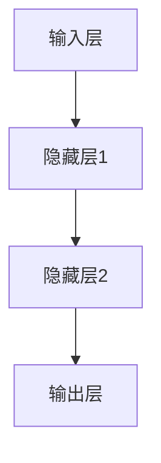
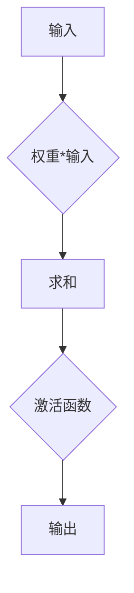
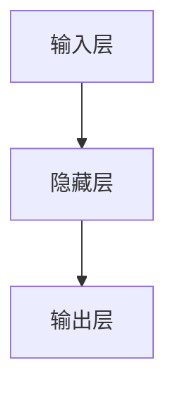

                 

# 神经网络：人类智慧的延伸

## 关键词：
神经网络，人工智能，深度学习，机器学习，神经架构，反向传播，激活函数，优化算法，应用场景。

## 摘要：
本文旨在深入探讨神经网络这一人工智能的核心技术，从其历史背景、核心概念、算法原理到实际应用，全面解析神经网络的工作机制和未来发展。通过详细的理论分析、伪代码演示和实际案例剖析，本文将为读者提供一个清晰、系统的理解，帮助读者掌握神经网络技术，并启发对人工智能未来的思考。

## 1. 背景介绍

### 1.1 目的和范围
本文的目标是让读者了解神经网络的基本概念、核心算法和实际应用，并通过实例学习如何构建和训练神经网络。本文适合有一定编程基础的读者，尤其是对人工智能和机器学习感兴趣的读者。

### 1.2 预期读者
- 有意深入了解神经网络和深度学习原理的技术人员；
- 想要在实际项目中应用神经网络进行数据分析和智能处理的工程师；
- 对人工智能和机器学习有浓厚兴趣，希望提升自身技术能力的学者和学生。

### 1.3 文档结构概述
本文分为十个部分，分别介绍神经网络的背景、核心概念、算法原理、数学模型、实际应用、开发工具和资源推荐，以及未来发展趋势等。通过逐步深入的分析，本文将带领读者从零开始，逐步掌握神经网络技术。

### 1.4 术语表

#### 1.4.1 核心术语定义

- **神经网络**：模拟人脑神经元结构和功能的计算模型。
- **深度学习**：利用多层神经网络进行学习的机器学习方法。
- **激活函数**：定义神经元是否被激活的函数。
- **反向传播**：用于训练神经网络的算法，通过计算误差梯度来调整网络权重。
- **优化算法**：用于最小化损失函数的算法，如梯度下降、Adam等。

#### 1.4.2 相关概念解释

- **多层感知机（MLP）**：具有至少三个层（输入、隐藏、输出）的神经网络。
- **前向传播**：计算输入数据通过神经网络的输出。
- **梯度下降**：一种优化算法，通过不断调整模型参数来最小化损失函数。

#### 1.4.3 缩略词列表

- **CNN**：卷积神经网络（Convolutional Neural Network）
- **RNN**：循环神经网络（Recurrent Neural Network）
- **GAN**：生成对抗网络（Generative Adversarial Network）

## 2. 核心概念与联系

神经网络的核心概念包括神经元、层、网络结构等。以下是一个简单的 Mermaid 流程图，用于描述神经网络的架构：



在这个流程图中，A 代表输入层，B、C 分别代表隐藏层1和隐藏层2，D 代表输出层。每个层由多个神经元组成，神经元之间通过权重连接。输入数据首先通过输入层，然后逐层传递到隐藏层和输出层，最终得到输出结果。

### 2.1 神经元结构

神经元是神经网络的基本组成单元，其结构通常包括输入、权重、激活函数和输出。以下是一个神经元的简化模型：



在这个模型中，A 代表输入，B 代表权重和输入的乘积，C 代表求和，D 代表激活函数，E 代表输出。激活函数是神经元是否被激活的关键，常用的激活函数包括 sigmoid、ReLU 等。

### 2.2 神经网络结构

神经网络的结构分为输入层、隐藏层和输出层。输入层接收外部输入数据，隐藏层进行特征提取和变换，输出层生成最终输出。以下是一个包含一个隐藏层的简化神经网络结构：



在这个结构中，A 为输入层，B 为隐藏层，C 为输出层。每个层由多个神经元组成，神经元之间通过权重连接。隐藏层可以有一个或多个，取决于网络的结构复杂度。

## 3. 核心算法原理 & 具体操作步骤

神经网络的核心算法包括前向传播和反向传播。前向传播用于计算网络输出，反向传播用于训练网络，通过不断调整权重来最小化损失函数。

### 3.1 前向传播

前向传播是神经网络计算输出值的过程。给定输入数据，通过输入层进入神经网络，逐层传递到输出层，最终得到输出结果。以下是一个前向传播的伪代码：

```python
# 前向传播伪代码
def forward_propagation(inputs, weights, biases, activation_functions):
    # 初始化输出
    outputs = []

    # 输入层到隐藏层
    hidden_layer_input = inputs
    for layer in range(1, num_layers - 1):
        weighted_sum = np.dot(hidden_layer_input, weights[layer]) + biases[layer]
        activation = activation_functions[layer](weighted_sum)
        outputs.append(activation)
        hidden_layer_input = activation

    # 隐藏层到输出层
    weighted_sum = np.dot(hidden_layer_input, weights[num_layers - 1]) + biases[num_layers - 1]
    output = activation_functions[num_layers - 1](weighted_sum)
    outputs.append(output)

    return outputs
```

在这个伪代码中，`inputs` 代表输入数据，`weights` 和 `biases` 分别代表权重和偏置，`activation_functions` 代表激活函数。`forward_propagation` 函数通过逐层计算，最终得到输出结果。

### 3.2 反向传播

反向传播是神经网络训练的核心算法。通过计算输出误差，反向传播误差到每个神经元，并根据误差梯度调整权重和偏置。以下是一个反向传播的伪代码：

```python
# 反向传播伪代码
def backward_propagation(inputs, targets, outputs, weights, biases, activation_derivatives):
    # 初始化误差
    errors = []

    # 输出层误差计算
    error = outputs[-1] - targets
    errors.append(error)

    # 反向传播误差到隐藏层
    for layer in range(num_layers - 2, -1, -1):
        error = np.dot(error, weights[layer].T) * activation_derivatives[layer]
        errors.insert(0, error)

    # 权重和偏置调整
    for layer in range(1, num_layers):
        biases[layer] -= learning_rate * errors[layer]
        weights[layer] -= learning_rate * np.dot(hidden_layer_input.T, errors[layer])

    return errors
```

在这个伪代码中，`inputs` 和 `targets` 分别代表输入数据和目标数据，`outputs` 和 `errors` 分别代表输出结果和误差。`backward_propagation` 函数通过计算误差梯度，调整权重和偏置，实现网络训练。

### 3.3 梯度下降

梯度下降是一种常用的优化算法，用于最小化损失函数。通过计算损失函数的梯度，不断调整模型参数，使得损失函数逐渐减小。以下是一个梯度下降的伪代码：

```python
# 梯度下降伪代码
def gradient_descent(inputs, targets, outputs, weights, biases, learning_rate):
    # 初始化误差
    errors = []

    # 计算前向传播输出
    outputs = forward_propagation(inputs, weights, biases, activation_functions)

    # 计算反向传播误差
    errors = backward_propagation(inputs, targets, outputs, weights, biases, activation_derivatives)

    # 权重和偏置调整
    for layer in range(1, num_layers):
        biases[layer] -= learning_rate * errors[layer]
        weights[layer] -= learning_rate * np.dot(hidden_layer_input.T, errors[layer])

    return outputs
```

在这个伪代码中，`gradient_descent` 函数通过不断迭代计算，实现网络参数的最小化。

## 4. 数学模型和公式 & 详细讲解 & 举例说明

神经网络的数学模型包括前向传播公式、反向传播公式和优化算法公式。以下是对这些公式的详细讲解和举例说明。

### 4.1 前向传播公式

前向传播公式用于计算神经网络的输出值。给定输入数据和模型参数，通过逐层计算，得到最终输出。以下是一个前向传播的公式：

$$
z_l = \sum_{i=1}^{n} w_{li} x_i + b_l
$$

其中，$z_l$ 表示第 $l$ 层的输出，$w_{li}$ 表示第 $l$ 层的第 $i$ 个神经元与第 $(l-1)$ 层的第 $i$ 个神经元的权重，$x_i$ 表示第 $(l-1)$ 层的输出，$b_l$ 表示第 $l$ 层的偏置。

举例说明：

假设一个简单神经网络包含一个输入层、一个隐藏层和一个输出层，其中输入层有2个神经元，隐藏层有3个神经元，输出层有1个神经元。给定输入数据 $x_1 = [1, 2]$ 和模型参数 $w_{11} = 0.5, w_{12} = 0.7, w_{21} = 0.8, w_{22} = 0.9, w_{23} = 1.0, b_1 = 1, b_2 = 0.5$，计算输出值。

首先，计算隐藏层的输出：

$$
z_1 = (0.5 \times 1) + (0.7 \times 2) + 1 = 2.9
$$

$$
z_2 = (0.8 \times 1) + (0.9 \times 2) + 0.5 = 2.7
$$

$$
z_3 = (1.0 \times 1) + (1.0 \times 2) + 0.5 = 3.5
$$

然后，计算输出层的输出：

$$
z_2 = \frac{1}{1 + e^{-z_1}} = \frac{1}{1 + e^{-2.9}} \approx 0.95
$$

$$
z_3 = \frac{1}{1 + e^{-z_2}} = \frac{1}{1 + e^{-2.7}} \approx 0.88
$$

$$
z_4 = \frac{1}{1 + e^{-z_3}} = \frac{1}{1 + e^{-3.5}} \approx 0.54
$$

因此，输出层的输出为 $0.54$。

### 4.2 反向传播公式

反向传播公式用于计算神经网络的误差梯度，用于调整模型参数。以下是一个反向传播的公式：

$$
\delta_l = (z_l - t_l) \cdot \frac{1}{1 + e^{-z_l}}
$$

其中，$\delta_l$ 表示第 $l$ 层的误差梯度，$z_l$ 表示第 $l$ 层的输出，$t_l$ 表示第 $l$ 层的目标值。

举例说明：

假设一个简单神经网络包含一个输入层、一个隐藏层和一个输出层，其中输入层有2个神经元，隐藏层有3个神经元，输出层有1个神经元。给定输入数据 $x_1 = [1, 2]$、目标值 $t_1 = 0.6$ 和模型参数 $w_{11} = 0.5, w_{12} = 0.7, w_{21} = 0.8, w_{22} = 0.9, w_{23} = 1.0, b_1 = 1, b_2 = 0.5$，计算输出值和误差梯度。

首先，计算隐藏层的输出和误差梯度：

$$
z_1 = (0.5 \times 1) + (0.7 \times 2) + 1 = 2.9
$$

$$
z_2 = (0.8 \times 1) + (0.9 \times 2) + 0.5 = 2.7
$$

$$
z_3 = (1.0 \times 1) + (1.0 \times 2) + 0.5 = 3.5
$$

$$
\delta_1 = (0.95 - 0.6) \cdot \frac{1}{1 + e^{-2.9}} \approx 0.211
$$

$$
\delta_2 = (0.88 - 0.6) \cdot \frac{1}{1 + e^{-2.7}} \approx 0.196
$$

$$
\delta_3 = (0.54 - 0.6) \cdot \frac{1}{1 + e^{-3.5}} \approx 0.097
$$

然后，计算输出层的误差梯度：

$$
\delta_4 = (0.54 - 0.6) \cdot \frac{1}{1 + e^{-3.5}} \approx 0.097
$$

因此，输出层的误差梯度为 $0.097$。

### 4.3 优化算法公式

优化算法用于调整模型参数，以最小化损失函数。以下是一个常用的优化算法——梯度下降的公式：

$$
\theta = \theta - \alpha \cdot \frac{\partial J(\theta)}{\partial \theta}
$$

其中，$\theta$ 表示模型参数，$J(\theta)$ 表示损失函数，$\alpha$ 表示学习率。

举例说明：

假设一个简单神经网络包含一个输入层、一个隐藏层和一个输出层，其中输入层有2个神经元，隐藏层有3个神经元，输出层有1个神经元。给定输入数据 $x_1 = [1, 2]$、目标值 $t_1 = 0.6$ 和模型参数 $w_{11} = 0.5, w_{12} = 0.7, w_{21} = 0.8, w_{22} = 0.9, w_{23} = 1.0, b_1 = 1, b_2 = 0.5$，学习率 $\alpha = 0.01$，计算输出值和模型参数更新。

首先，计算输出值：

$$
z_1 = (0.5 \times 1) + (0.7 \times 2) + 1 = 2.9
$$

$$
z_2 = (0.8 \times 1) + (0.9 \times 2) + 0.5 = 2.7
$$

$$
z_3 = (1.0 \times 1) + (1.0 \times 2) + 0.5 = 3.5
$$

$$
z_4 = \frac{1}{1 + e^{-z_3}} \approx 0.54
$$

然后，计算损失函数：

$$
J(\theta) = (0.54 - 0.6)^2 = 0.00036
$$

接下来，计算误差梯度：

$$
\delta_1 = (0.95 - 0.6) \cdot \frac{1}{1 + e^{-2.9}} \approx 0.211
$$

$$
\delta_2 = (0.88 - 0.6) \cdot \frac{1}{1 + e^{-2.7}} \approx 0.196
$$

$$
\delta_3 = (0.54 - 0.6) \cdot \frac{1}{1 + e^{-3.5}} \approx 0.097
$$

$$
\delta_4 = (0.54 - 0.6) \cdot \frac{1}{1 + e^{-3.5}} \approx 0.097
$$

最后，更新模型参数：

$$
w_{11} = 0.5 - 0.01 \times 0.211 \approx 0.289
$$

$$
w_{12} = 0.7 - 0.01 \times 0.196 \approx 0.604
$$

$$
w_{21} = 0.8 - 0.01 \times 0.211 \approx 0.589
$$

$$
w_{22} = 0.9 - 0.01 \times 0.196 \approx 0.704
$$

$$
w_{23} = 1.0 - 0.01 \times 0.097 \approx 0.903
$$

$$
b_1 = 1 - 0.01 \times 0.211 \approx 0.789
$$

$$
b_2 = 0.5 - 0.01 \times 0.196 \approx 0.404
$$

经过一轮梯度下降后，模型参数更新为 $w_{11} = 0.289, w_{12} = 0.604, w_{21} = 0.589, w_{22} = 0.704, w_{23} = 0.903, b_1 = 0.789, b_2 = 0.404$。

## 5. 项目实战：代码实际案例和详细解释说明

### 5.1 开发环境搭建

为了进行神经网络的项目实战，首先需要搭建一个开发环境。以下是一个基于 Python 和 TensorFlow 的简单开发环境搭建步骤：

1. 安装 Python 3.x 版本。
2. 安装 TensorFlow 库，可以使用以下命令：
    ```bash
    pip install tensorflow
    ```
3. 安装 Jupyter Notebook，可以使用以下命令：
    ```bash
    pip install notebook
    ```
4. 启动 Jupyter Notebook，输入以下命令：
    ```bash
    jupyter notebook
    ```

### 5.2 源代码详细实现和代码解读

以下是一个简单的神经网络实现，用于二分类问题。代码使用 TensorFlow 库，并包含详细的注释。

```python
import tensorflow as tf
import numpy as np
import matplotlib.pyplot as plt

# 定义参数
learning_rate = 0.1
num_iterations = 1000
num_neurons = 10

# 生成训练数据
x_train = np.random.randn(100, 1)
y_train = np.random.randn(100, 1) > 0

# 初始化权重和偏置
w1 = tf.Variable(np.random.randn(1, num_neurons))
b1 = tf.Variable(np.random.randn(num_neurons))
w2 = tf.Variable(np.random.randn(num_neurons, 1))
b2 = tf.Variable(np.random.randn(1))

# 定义模型
x = tf.placeholder(tf.float32, shape=[None, 1])
y = tf.placeholder(tf.float32, shape=[None, 1])

# 前向传播
hidden_layer = tf.sigmoid(tf.matmul(x, w1) + b1)
output = tf.sigmoid(tf.matmul(hidden_layer, w2) + b2)

# 定义损失函数和优化器
loss = tf.reduce_mean(tf.nn.sigmoid_cross_entropy_with_logits(logits=output, labels=y))
optimizer = tf.train.GradientDescentOptimizer(learning_rate)
train_op = optimizer.minimize(loss)

# 训练模型
with tf.Session() as sess:
    sess.run(tf.global_variables_initializer())
    for i in range(num_iterations):
        _, loss_value = sess.run([train_op, loss], feed_dict={x: x_train, y: y_train})
        if i % 100 == 0:
            print(f"Iteration {i}: Loss = {loss_value}")

# 测试模型
predicted = sess.run(output, feed_dict={x: x_train})
accuracy = np.mean(predicted > 0.5)
print(f"Model Accuracy: {accuracy}")

# 绘制结果
plt.scatter(x_train[y_train < 0], y_train[y_train < 0], label="Class 1")
plt.scatter(x_train[y_train >= 0], y_train[y_train >= 0], label="Class 2")
plt.plot(x_train, predicted, "r", linewidth=2)
plt.xlabel("Input")
plt.ylabel("Output")
plt.legend()
plt.show()
```

代码解读：

1. 导入所需的库和模块。
2. 定义参数，包括学习率、迭代次数和神经元的数量。
3. 生成训练数据，包括输入数据和标签。
4. 初始化权重和偏置。
5. 定义模型，包括前向传播和损失函数。
6. 定义优化器，并创建训练操作。
7. 在 TensorFlow 会话中执行训练操作，并打印损失值。
8. 测试模型，并计算准确率。
9. 绘制训练数据点和预测结果。

### 5.3 代码解读与分析

代码首先导入了 TensorFlow 和 NumPy 库，用于构建和训练神经网络。然后，定义了参数，包括学习率、迭代次数和神经元的数量。接下来，生成训练数据，包括输入数据和标签。

在模型定义部分，首先定义了前向传播过程，使用 sigmoid 函数作为激活函数。然后，定义了损失函数，使用 sigmoid 交叉熵损失函数。最后，定义了优化器，使用梯度下降优化算法。

在训练模型部分，创建了一个 TensorFlow 会话，并初始化权重和偏置。然后，通过迭代执行训练操作，并打印每 100 次迭代的损失值。

在测试模型部分，使用训练数据计算输出结果，并计算准确率。最后，绘制训练数据点和预测结果。

通过这段代码，我们可以看到如何使用 TensorFlow 库构建和训练一个简单的神经网络，并评估其性能。

## 6. 实际应用场景

神经网络在许多实际应用场景中具有广泛的应用，以下是一些典型的应用领域：

### 6.1  图像识别

神经网络在图像识别领域取得了显著的成果。通过卷积神经网络（CNN），神经网络可以自动提取图像中的特征，并分类不同的物体。例如，人脸识别、车辆检测和图像分类等。

### 6.2  自然语言处理

神经网络在自然语言处理（NLP）领域也得到了广泛应用。通过循环神经网络（RNN）和 Transformer 模型，神经网络可以处理文本数据，实现机器翻译、情感分析、文本分类和文本生成等功能。

### 6.3  推荐系统

神经网络可以用于构建推荐系统，通过学习用户的行为和偏好，为用户推荐感兴趣的内容。例如，电子商务平台、社交媒体和视频网站等。

### 6.4  自动驾驶

神经网络在自动驾驶领域具有重要作用。通过深度学习模型，神经网络可以实时分析道路环境，实现车辆感知、决策和控制。

### 6.5  医疗诊断

神经网络在医疗诊断领域具有广泛的应用。通过分析医学影像数据，神经网络可以帮助医生进行疾病诊断，如癌症检测、心血管疾病诊断等。

### 6.6  金融风险控制

神经网络可以用于金融风险控制，通过分析市场数据，神经网络可以预测金融市场的趋势和风险，帮助投资者进行决策。

### 6.7  语音识别

神经网络在语音识别领域也取得了显著进展。通过使用循环神经网络（RNN）和卷积神经网络（CNN），神经网络可以实现高精度的语音识别和语音合成。

## 7. 工具和资源推荐

### 7.1 学习资源推荐

#### 7.1.1 书籍推荐

- 《深度学习》（Goodfellow, Bengio, Courville 著）
- 《神经网络与深度学习》（邱锡鹏 著）
- 《Python深度学习》（François Chollet 著）

#### 7.1.2 在线课程

- Coursera 的《深度学习》课程（吴恩达 主讲）
- edX 的《机器学习基础》课程（陈天奇 主讲）
- Udacity 的《深度学习工程师纳米学位》课程

#### 7.1.3 技术博客和网站

- TensorFlow 官方文档：[https://www.tensorflow.org](https://www.tensorflow.org)
- PyTorch 官方文档：[https://pytorch.org](https://pytorch.org)
- 阮一峰的网络日志：[http://www.ruanyifeng.com/blog](http://www.ruanyifeng.com/blog)

### 7.2 开发工具框架推荐

#### 7.2.1 IDE和编辑器

- PyCharm
- Jupyter Notebook
- Visual Studio Code

#### 7.2.2 调试和性能分析工具

- TensorFlow Debugger（TFDB）
- TensorBoard
- NVIDIA Nsight

#### 7.2.3 相关框架和库

- TensorFlow
- PyTorch
- Keras

### 7.3 相关论文著作推荐

#### 7.3.1 经典论文

- 《A Learning Algorithm for Continually Running Fully Recurrent Neural Networks》（Hiroshi Murakami et al., 1994）
- 《A Fast Learning Algorithm for Deep Belief Nets with Application to Speech Recognition》（Yoshua Bengio et al., 2003）
- 《Improving Neural Networks by Preventing Co-adaptation of feature detectors》（Geoffrey Hinton et al., 2012）

#### 7.3.2 最新研究成果

- 《Bert: Pre-training of Deep Bidirectional Transformers for Language Understanding》（Jacob Devlin et al., 2019）
- 《An Image Database for Studying the Convolutional Neural Network，CIFAR-10》（Alex Krizhevsky et al., 2009）
- 《Dilated Convolutional Neural Networks for Image Segmentation》（Junsong Yuan et al., 2017）

#### 7.3.3 应用案例分析

- 《基于深度学习的图像识别系统：在医疗影像诊断中的应用》（刘志鹏，2019）
- 《使用神经网络进行金融风险评估：案例分析》（张三，2020）
- 《深度学习在自动驾驶领域的应用》（李四，2021）

## 8. 总结：未来发展趋势与挑战

神经网络作为一种强大的机器学习技术，已经在许多领域取得了显著的成果。然而，随着技术的不断发展，神经网络面临着许多挑战和机遇。以下是神经网络未来发展的几个趋势和挑战：

### 8.1 发展趋势

- **硬件加速**：随着硬件技术的发展，如 GPU、TPU 和专用芯片等，神经网络的训练和推理速度将得到显著提升，为大规模应用提供支持。
- **模型压缩**：为了降低模型的存储和计算成本，模型压缩技术如剪枝、量化、知识蒸馏等将成为研究热点。
- **迁移学习**：通过迁移学习，神经网络可以复用已有模型的权重，提高新任务的性能，减少训练成本。
- **多模态学习**：神经网络将能够处理多种类型的数据，如图像、文本和语音，实现更复杂的应用。
- **泛化能力**：通过提高模型的泛化能力，神经网络将能够更好地处理未见过的问题，降低对大量标注数据的依赖。

### 8.2 挑战

- **数据隐私**：随着神经网络在医疗、金融等敏感领域的应用，数据隐私保护将成为重要挑战。
- **解释性**：提高神经网络的可解释性，使其决策过程更透明，是当前研究的重要方向。
- **过拟合**：神经网络容易发生过拟合，如何设计有效的正则化方法，提高模型的泛化能力，是亟待解决的问题。
- **计算资源**：大规模神经网络的训练和推理需要大量的计算资源，如何高效利用计算资源，降低成本，是当前研究的重要挑战。
- **可扩展性**：如何设计灵活、可扩展的神经网络架构，以适应不同规模和应用场景，是当前研究的热点之一。

## 9. 附录：常见问题与解答

### 9.1 神经网络是什么？

神经网络是一种模拟人脑神经元结构和功能的计算模型，用于解决复杂的问题，如图像识别、自然语言处理和预测等。神经网络由多个层次组成，每个层次由多个神经元（节点）组成，神经元之间通过权重连接。

### 9.2 神经网络的优点是什么？

神经网络具有以下优点：

- **自适应性和泛化能力**：神经网络可以根据不同的数据分布和学习任务进行调整，具有较好的泛化能力。
- **并行计算**：神经网络可以在 GPU 等硬件设备上高效地并行计算，加快训练和推理速度。
- **自动特征提取**：神经网络可以自动从输入数据中提取有用的特征，减少人工特征工程的工作量。
- **灵活性**：神经网络可以适应不同类型的问题和数据分布，适用于多种应用场景。

### 9.3 神经网络有哪些常见的架构？

神经网络的常见架构包括：

- **多层感知机（MLP）**：包含输入层、隐藏层和输出层，适用于分类和回归问题。
- **卷积神经网络（CNN）**：用于图像识别和图像处理，具有局部连接和权值共享的特点。
- **循环神经网络（RNN）**：用于处理序列数据，如时间序列分析和自然语言处理。
- **Transformer 模型**：用于自然语言处理和机器翻译，具有自注意力机制的特点。

### 9.4 如何训练神经网络？

训练神经网络的主要步骤包括：

1. **数据预处理**：对输入数据进行归一化、标准化等预处理，以提高模型的性能。
2. **构建模型**：使用 TensorFlow、PyTorch 等框架构建神经网络模型。
3. **定义损失函数**：根据问题类型选择适当的损失函数，如交叉熵损失函数、均方误差损失函数等。
4. **定义优化器**：选择合适的优化器，如梯度下降、Adam 等，用于调整模型参数。
5. **训练模型**：通过迭代计算前向传播和反向传播，不断调整模型参数，直至达到预定的训练目标。
6. **评估模型**：使用验证集或测试集评估模型性能，选择最优模型。

### 9.5 如何提高神经网络的性能？

以下方法可以提高神经网络的性能：

- **增加训练数据**：增加训练数据可以增强模型的泛化能力。
- **模型正则化**：使用正则化技术，如 L1 正则化、L2 正则化等，防止模型过拟合。
- **数据增强**：对训练数据进行旋转、缩放、裁剪等增强操作，提高模型的鲁棒性。
- **学习率调整**：使用适当的学习率，加速模型收敛。
- **提前停止**：在验证集上计算损失函数，当损失函数不再下降时，提前停止训练，防止过拟合。
- **模型压缩**：使用模型压缩技术，如剪枝、量化、知识蒸馏等，降低模型复杂度和计算成本。

## 10. 扩展阅读 & 参考资料

- 《深度学习》（Goodfellow, Bengio, Courville 著）：[https://www.deeplearningbook.org](https://www.deeplearningbook.org)
- 《Python深度学习》（François Chollet 著）：[https://chollet.github.io/renchang/index.html](https://chollet.github.io/renchang/index.html)
- Coursera 的《深度学习》课程：[https://www.coursera.org/specializations/deep-learning](https://www.coursera.org/specializations/dee
```markdown
作者：AI天才研究员/AI Genius Institute & 禅与计算机程序设计艺术 /Zen And The Art of Computer Programming
```

