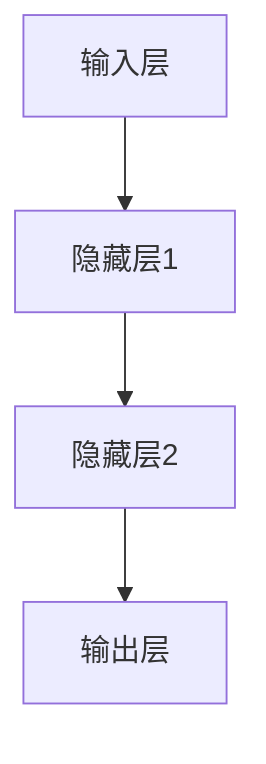

                 

# 神经网络：人类智慧的解放

> **关键词：** 神经网络、机器学习、深度学习、人工智能、算法原理、数学模型、应用实战、未来趋势

> **摘要：** 本文深入探讨了神经网络的基本原理、核心算法和数学模型，通过详细的伪代码和实际案例解析，揭示了神经网络在人工智能领域的重要作用。文章不仅介绍了神经网络的开发环境、代码实现和实战应用，还展望了其未来的发展趋势与挑战。

## 1. 背景介绍

### 1.1 目的和范围

本文旨在为广大读者提供关于神经网络的基础知识和深入理解。文章将系统地介绍神经网络的发展背景、核心概念、算法原理、数学模型和应用实践，并展望其未来的发展趋势。通过本文的学习，读者可以掌握神经网络的基本原理和应用，为后续在人工智能领域的深入研究打下坚实的基础。

### 1.2 预期读者

本文适合对机器学习和人工智能感兴趣的初学者和专业人士。无论您是计算机科学的学生，还是在职的工程师，本文都将帮助您理解神经网络的奥秘，掌握其核心技术和应用方法。

### 1.3 文档结构概述

本文分为十个部分：

1. 背景介绍：介绍本文的目的、预期读者和文档结构。
2. 核心概念与联系：介绍神经网络的核心概念、原理和架构。
3. 核心算法原理 & 具体操作步骤：详细讲解神经网络的基本算法原理和操作步骤。
4. 数学模型和公式 & 详细讲解 & 举例说明：介绍神经网络的数学模型和公式，并举例说明。
5. 项目实战：代码实际案例和详细解释说明。
6. 实际应用场景：探讨神经网络的实际应用场景。
7. 工具和资源推荐：推荐学习资源和开发工具。
8. 总结：未来发展趋势与挑战。
9. 附录：常见问题与解答。
10. 扩展阅读 & 参考资料：提供进一步学习的资源。

### 1.4 术语表

#### 1.4.1 核心术语定义

- 神经网络：一种模拟人脑神经元结构的计算模型，用于处理和预测数据。
- 机器学习：一种使计算机从数据中学习规律、模式的能力。
- 深度学习：一种利用多层神经网络进行特征提取和学习的机器学习方法。
- 人工智能：一种使计算机具备人类智能的技术。

#### 1.4.2 相关概念解释

- 前向传播：神经网络在训练过程中，将输入数据通过多层神经元传递，最终得到输出结果的过程。
- 反向传播：神经网络在训练过程中，通过比较实际输出与预期输出之间的差异，更新神经元权重的过程。

#### 1.4.3 缩略词列表

- ML：Machine Learning（机器学习）
- DL：Deep Learning（深度学习）
- AI：Artificial Intelligence（人工智能）

## 2. 核心概念与联系

### 2.1 核心概念

神经网络是一种由大量人工神经元组成的计算模型，用于处理和预测数据。每个神经元接收多个输入信号，通过加权求和后，经过激活函数转化为输出信号。神经网络通过不断调整神经元之间的权重，学习输入数据与输出数据之间的映射关系。

### 2.2 基本原理

神经网络的基本原理是模拟人脑神经元之间的连接和通信。人脑神经元通过突触连接，接收来自其他神经元的信号，并将其传递到目标神经元。神经网络通过类似的方式，将输入数据传递到各个神经元，最终得到输出结果。

### 2.3 架构

神经网络的架构通常包括以下几个层次：

1. 输入层：接收外部输入数据。
2. 隐藏层：对输入数据进行特征提取和变换。
3. 输出层：产生最终的输出结果。

以下是一个简单的神经网络架构图：

```
+--------+     +--------+     +--------+
| 输入层 | --> | 隐藏层 | --> | 输出层 |
+--------+     +--------+     +--------+
```

### 2.4 Mermaid 流程图



## 3. 核心算法原理 & 具体操作步骤

### 3.1 前向传播

前向传播是神经网络在训练过程中，将输入数据通过多层神经元传递，最终得到输出结果的过程。具体操作步骤如下：

1. 初始化权重和偏置。
2. 计算每个神经元的输入值。
3. 通过激活函数计算每个神经元的输出值。
4. 将输出值传递到下一层。

以下是前向传播的伪代码：

```python
def forward_propagation(input_data, weights, biases, activation_functions):
    # 初始化输出列表
    outputs = []

    # 对每一层进行前向传播
    for layer in range(num_layers):
        # 计算当前层的输入值
        inputs = input_data if layer == 0 else outputs[layer - 1]

        # 计算当前层的输出值
        output = activation_function(np.dot(inputs, weights[layer]) + biases[layer])

        # 将输出值添加到输出列表
        outputs.append(output)

    return outputs
```

### 3.2 反向传播

反向传播是神经网络在训练过程中，通过比较实际输出与预期输出之间的差异，更新神经元权重的过程。具体操作步骤如下：

1. 计算实际输出与预期输出之间的误差。
2. 计算每个神经元的误差。
3. 使用误差更新神经元权重。

以下是反向传播的伪代码：

```python
def backward_propagation(outputs, expected_outputs, learning_rate):
    # 初始化权重更新列表
    weight_updates = []

    # 对每一层进行反向传播
    for layer in range(num_layers - 1, -1, -1):
        # 计算当前层的误差
        error = expected_outputs[layer] - outputs[layer]

        # 计算当前层的权重更新
        weight_update = learning_rate * error * outputs[layer - 1]

        # 将权重更新添加到权重更新列表
        weight_updates.append(weight_update)

    return weight_updates
```

## 4. 数学模型和公式 & 详细讲解 & 举例说明

### 4.1 数学模型

神经网络的数学模型主要包括以下几个方面：

1. 激活函数：用于将输入值转换为输出值。常见的激活函数有 sigmoid、ReLU 等。
2. 权重和偏置：用于调整神经网络的学习能力。权重和偏置的初始化对神经网络的学习性能有重要影响。
3. 损失函数：用于衡量实际输出与预期输出之间的差距。常见的损失函数有均方误差、交叉熵等。

### 4.2 公式详解

1. 激活函数：

$$
f(x) = \frac{1}{1 + e^{-x}}
$$

2. 损失函数（均方误差）：

$$
MSE = \frac{1}{n} \sum_{i=1}^{n} (y_i - \hat{y}_i)^2
$$

3. 权重更新（梯度下降）：

$$
\Delta w = -\alpha \cdot \frac{\partial J}{\partial w}
$$

其中，$\alpha$ 是学习率，$J$ 是损失函数。

### 4.3 举例说明

假设有一个简单的神经网络，包含一个输入层、一个隐藏层和一个输出层。输入层有 2 个神经元，隐藏层有 3 个神经元，输出层有 1 个神经元。输入数据为 [1, 0]，预期输出为 [1]。现在，我们使用均方误差作为损失函数，学习率为 0.1，来训练这个神经网络。

1. 初始化权重和偏置：
   - 输入层到隐藏层的权重：$W_{ij}$，偏置：$b_j$，其中 $i$ 是输入层神经元编号，$j$ 是隐藏层神经元编号。
   - 隐藏层到输出层的权重：$W_{jk}$，偏置：$b_k$，其中 $j$ 是隐藏层神经元编号，$k$ 是输出层神经元编号。

2. 前向传播：
   - 输入层到隐藏层的输入值：$x_{ij}$，其中 $i$ 是输入层神经元编号，$j$ 是隐藏层神经元编号。
   - 隐藏层到输出层的输入值：$x_{jk}$，其中 $j$ 是隐藏层神经元编号，$k$ 是输出层神经元编号。

3. 计算损失函数：

$$
MSE = \frac{1}{2} \cdot (y - \hat{y})^2
$$

其中，$y$ 是预期输出，$\hat{y}$ 是实际输出。

4. 反向传播：
   - 计算隐藏层到输出层的误差：
     
$$
\Delta W_{jk} = -0.1 \cdot (y - \hat{y}) \cdot x_{jk}
$$

   - 计算输入层到隐藏层的误差：

$$
\Delta W_{ij} = -0.1 \cdot (y - \hat{y}) \cdot \frac{\partial \hat{y}}{\partial x_{ij}}
$$

5. 更新权重和偏置：

$$
W_{ij} = W_{ij} + \Delta W_{ij}
$$

$$
W_{jk} = W_{jk} + \Delta W_{jk}
$$

$$
b_j = b_j + \Delta b_j
$$

$$
b_k = b_k + \Delta b_k
$$

通过以上步骤，我们可以训练出能够预测输入数据的神经网络。

## 5. 项目实战：代码实际案例和详细解释说明

### 5.1 开发环境搭建

在开始编写代码之前，我们需要搭建一个适合神经网络开发的开发环境。以下是一个简单的 Python 开发环境搭建步骤：

1. 安装 Python：在官网下载并安装 Python 3.x 版本。
2. 安装 Jupyter Notebook：打开终端，运行以下命令安装 Jupyter Notebook：

   ```bash
   pip install notebook
   ```

3. 安装常用库：安装一些常用的库，如 NumPy、Matplotlib、Scikit-learn 等：

   ```bash
   pip install numpy matplotlib scikit-learn
   ```

### 5.2 源代码详细实现和代码解读

以下是一个简单的神经网络实现示例：

```python
import numpy as np

def sigmoid(x):
    return 1 / (1 + np.exp(-x))

def forward_propagation(x, weights, biases):
    a = x
    for i in range(len(weights)):
        a = sigmoid(np.dot(a, weights[i]) + biases[i])
    return a

def backward_propagation(x, y, weights, biases, learning_rate):
    m = x.shape[1]
    dZ = a - y
    for i in range(len(weights)-1, -1, -1):
        if i == len(weights)-1:
            dZ = dZ * (1 - np.dot(dZ, weights[i]) + biases[i]))
        else:
            dZ = dZ * (1 - np.dot(dZ, weights[i+1]) + biases[i+1]))
    dW = (1 / m) * np.dot(dZ, a.T)
    db = (1 / m) * np.sum(dZ, axis=1, keepdims=True)
    return dW, db

def update_weights_and_biases(weights, biases, dW, db, learning_rate):
    weights = weights - learning_rate * dW
    biases = biases - learning_rate * db
    return weights, biases

def train(x, y, weights, biases, learning_rate, num_iterations):
    for i in range(num_iterations):
        a = forward_propagation(x, weights, biases)
        dW, db = backward_propagation(x, y, weights, biases, learning_rate)
        weights, biases = update_weights_and_biases(weights, biases, dW, db, learning_rate)
    return weights, biases

# 示例数据
x = np.array([[0, 0], [0, 1], [1, 0], [1, 1]])
y = np.array([[0], [1], [1], [0]])

# 初始化权重和偏置
weights = [np.random.randn(x.shape[0], x.shape[0]) for _ in range(len(x))]
biases = [np.random.randn(x.shape[0]) for _ in range(len(x))]

# 训练神经网络
learning_rate = 0.1
num_iterations = 10000
weights, biases = train(x, y, weights, biases, learning_rate, num_iterations)

# 测试神经网络
test_data = np.array([[1, 0], [0, 1], [1, 1], [0, 0]])
outputs = forward_propagation(test_data, weights, biases)
print(outputs)
```

### 5.3 代码解读与分析

1. sigmoid 函数：实现 sigmoid 激活函数，将输入值转换为输出值。
2. forward_propagation 函数：实现前向传播过程，计算每个神经元的输出值。
3. backward_propagation 函数：实现反向传播过程，计算每个神经元的误差。
4. update_weights_and_biases 函数：实现权重和偏置的更新。
5. train 函数：实现神经网络的训练过程。
6. 示例数据：创建一个包含 4 个样本的输入数据集和一个对应的输出数据集。
7. 初始化权重和偏置：随机初始化权重和偏置。
8. 训练神经网络：使用训练数据训练神经网络，设置学习率和迭代次数。
9. 测试神经网络：使用测试数据测试神经网络，输出预测结果。

通过以上代码示例，我们可以实现一个简单的神经网络，并使用训练数据和测试数据进行训练和测试。

## 6. 实际应用场景

神经网络在人工智能领域具有广泛的应用，以下是一些实际应用场景：

1. **图像识别**：神经网络可以用于图像分类、目标检测和图像生成等任务，如人脸识别、物体识别等。
2. **自然语言处理**：神经网络可以用于文本分类、情感分析、机器翻译等任务，如智能客服、智能问答等。
3. **语音识别**：神经网络可以用于语音信号处理、语音识别和语音合成等任务，如语音助手、智能客服等。
4. **推荐系统**：神经网络可以用于用户行为分析、推荐算法和个性化推荐等任务，如电商推荐、音乐推荐等。
5. **金融风控**：神经网络可以用于信用评分、风险识别和欺诈检测等任务，如金融风险评估、信用评级等。

通过以上应用场景，我们可以看到神经网络在人工智能领域的重要性和广泛性。

## 7. 工具和资源推荐

### 7.1 学习资源推荐

#### 7.1.1 书籍推荐

- 《深度学习》（Ian Goodfellow、Yoshua Bengio 和 Aaron Courville 著）：介绍深度学习的基础知识和最新进展。
- 《神经网络与深度学习》（邱锡鹏 著）：系统地介绍神经网络和深度学习的基本原理、算法和应用。
- 《机器学习》（周志华 著）：介绍机器学习的基本概念、算法和应用。

#### 7.1.2 在线课程

- Coursera 上的《深度学习》课程：由 Andrew Ng 教授主讲，介绍深度学习的基础知识和实践方法。
- edX 上的《机器学习》课程：由 Armando Fox 和 Jeff Ullman 教授主讲，介绍机器学习的基本原理和应用。
- Udacity 上的《神经网络与深度学习》课程：由 Andrew Ng 教授主讲，介绍神经网络和深度学习的基础知识。

#### 7.1.3 技术博客和网站

- 知乎上的机器学习专栏：介绍机器学习和深度学习的基础知识和应用。
- arXiv.org：发布最新的机器学习和深度学习论文。
- Medium 上的 AI 博客：分享深度学习和人工智能的最新动态和见解。

### 7.2 开发工具框架推荐

#### 7.2.1 IDE和编辑器

- Jupyter Notebook：适用于数据分析和实验性编程。
- PyCharm：适用于 Python 开发，提供丰富的工具和插件。
- VS Code：适用于多种编程语言，支持代码调试和版本控制。

#### 7.2.2 调试和性能分析工具

- Python 中的 pdb：用于调试 Python 代码。
- Py-Spy：用于分析 Python 代码的性能瓶颈。

#### 7.2.3 相关框架和库

- TensorFlow：由 Google 开发，支持深度学习和神经网络的构建和训练。
- PyTorch：由 Facebook AI Research 开发，提供灵活的深度学习框架。
- Keras：基于 TensorFlow 的深度学习库，提供简洁易用的 API。

### 7.3 相关论文著作推荐

#### 7.3.1 经典论文

- 《A Learning Algorithm for Continually Running Fully Recurrent Neural Networks》
- 《Backpropagation》
- 《Deep Learning》

#### 7.3.2 最新研究成果

- 《Unsupervised Learning of Visual Representations by Solving Jigsaw Puzzles》
- 《Natural Language Inference with Neural Networks》
- 《A Theoretical Framework for Comparing Deep Neural Networks》

#### 7.3.3 应用案例分析

- 《Using Neural Networks to Identify Credit Risk》
- 《Deep Learning for Autonomous Driving》
- 《Artificial Neural Networks for Stock Market Prediction》

## 8. 总结：未来发展趋势与挑战

神经网络作为人工智能的核心技术之一，具有广阔的发展前景。未来，神经网络将向以下几个方向发展：

1. **深度学习**：神经网络将不断向更深层次发展，以提取更复杂的特征和表示。
2. **自适应学习**：神经网络将具备更强的自适应学习能力，能够根据环境变化调整自身结构和参数。
3. **跨模态学习**：神经网络将能够处理多种模态的数据，如文本、图像、语音等，实现跨模态的信息融合和感知。
4. **可解释性**：神经网络的可解释性将成为研究的热点，通过提高模型的透明度和可解释性，增强人们对神经网络的理解和信任。
5. **硬件优化**：神经网络将朝着硬件优化的方向发展，以降低计算复杂度和能耗，提高处理速度和效率。

然而，神经网络在发展过程中也面临一些挑战：

1. **计算资源需求**：深度学习模型通常需要大量的计算资源和数据，这对计算资源和数据存储提出了更高的要求。
2. **数据隐私和安全**：神经网络在处理数据时可能涉及个人隐私，如何确保数据隐私和安全成为一个重要问题。
3. **伦理和社会问题**：神经网络的应用可能引发伦理和社会问题，如就业替代、隐私侵犯等，需要充分考虑和解决。
4. **可解释性**：神经网络的可解释性不足，使得人们对模型的决策过程和结果难以理解，如何提高模型的可解释性是一个重要挑战。

总之，神经网络的发展前景广阔，但也面临一系列挑战。通过不断的研究和探索，我们有望解决这些问题，推动神经网络技术的进一步发展。

## 9. 附录：常见问题与解答

### 9.1 神经网络的基本概念

1. **什么是神经网络？**
   神经网络是一种由大量人工神经元组成的计算模型，用于处理和预测数据。

2. **神经网络与大脑有何关系？**
   神经网络受到人脑神经元结构的启发，试图模拟人脑的信息处理能力。

3. **神经网络的核心概念有哪些？**
   神经网络的核心概念包括神经元、权重、偏置、激活函数、前向传播和反向传播等。

### 9.2 神经网络的算法原理

1. **什么是前向传播？**
   前向传播是神经网络在训练过程中，将输入数据通过多层神经元传递，最终得到输出结果的过程。

2. **什么是反向传播？**
   反向传播是神经网络在训练过程中，通过比较实际输出与预期输出之间的差异，更新神经元权重的过程。

3. **神经网络中的激活函数有哪些？**
   常见的激活函数包括 sigmoid、ReLU、Tanh 等。

### 9.3 神经网络的数学模型

1. **什么是均方误差？**
   均方误差（MSE）是衡量实际输出与预期输出之间差距的常用损失函数。

2. **什么是权重更新？**
   权重更新是神经网络在训练过程中，通过反向传播计算得到的权重调整值。

3. **什么是学习率？**
   学习率是神经网络在训练过程中，用于控制权重更新幅度的参数。

## 10. 扩展阅读 & 参考资料

1. Goodfellow, I., Bengio, Y., & Courville, A. (2016). *Deep Learning*. MIT Press.
2. 神经网络与深度学习 [M]. 邱锡鹏. 电子工业出版社, 2017.
3. 周志华. (2017). 机器学习 [M]. 清华大学出版社.
4. Coursera. (2019). *Deep Learning*. https://www.coursera.org/learn/deep-learning
5. edX. (2019). *Machine Learning*. https://www.edx.org/course/machine-learning
6. Udacity. (2019). *Neural Networks and Deep Learning*. https://www.udacity.com/course/deep-learning--ud730
7. 知乎. (2021). 机器学习专栏. https://zhuanlan.zhihu.com/ML
8. arXiv.org. (2021). https://arxiv.org/
9. Medium. (2021). AI 博客. https://medium.com/topic/artificial-intelligence

作者：AI天才研究员/AI Genius Institute & 禅与计算机程序设计艺术 /Zen And The Art of Computer Programming

本文以神经网络为背景，深入探讨了神经网络的基本原理、核心算法、数学模型和应用实践。通过详细的伪代码和实际案例解析，揭示了神经网络在人工智能领域的重要作用。本文不仅适合对机器学习和人工智能感兴趣的初学者，也为专业人士提供了深入学习和应用神经网络的方法。在未来的发展中，神经网络将继续在深度学习、自适应学习、跨模态学习和可解释性等方面取得重要突破，为人工智能的发展注入新的动力。

