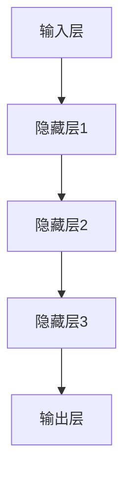

                 

# 神经网络：开启智能新纪元

> 关键词：神经网络、人工智能、深度学习、机器学习、算法、模型、应用

> 摘要：本文旨在深入探讨神经网络这一核心的人工智能技术，从其历史背景、核心概念、算法原理到数学模型、项目实战及应用场景，全面解析神经网络的奥秘。通过本文的阅读，读者将能够理解神经网络的工作机制，掌握其构建和应用方法，并展望其未来的发展趋势和挑战。

## 1. 背景介绍

### 1.1 目的和范围

本文的目的在于为初学者和专业人士提供一个全面而系统的神经网络入门指南。本文将涵盖以下内容：

- 神经网络的历史背景和发展历程。
- 核心概念和基本架构。
- 核心算法原理和具体操作步骤。
- 数学模型和公式的详细讲解。
- 项目实战和实际应用场景。
- 工具和资源推荐。

通过本文的阅读，读者将能够：

- 理解神经网络的基本概念和原理。
- 掌握神经网络的设计和实现方法。
- 应用神经网络解决实际问题。
- 了解神经网络在人工智能领域的广泛应用。

### 1.2 预期读者

本文预期读者包括以下几类：

- 对神经网络和人工智能技术感兴趣的初学者。
- 想要深入理解神经网络原理和应用的从业者。
- 从事人工智能研究的科研人员。
- 对神经网络技术有实际应用需求的企业工程师。

### 1.3 文档结构概述

本文结构如下：

- 第1章：背景介绍，介绍本文的目的、预期读者、文档结构和术语表。
- 第2章：核心概念与联系，介绍神经网络的起源、发展及其核心概念。
- 第3章：核心算法原理 & 具体操作步骤，详细讲解神经网络算法的原理和步骤。
- 第4章：数学模型和公式 & 详细讲解 & 举例说明，介绍神经网络的数学模型及其应用。
- 第5章：项目实战：代码实际案例和详细解释说明，通过实际案例展示神经网络的应用。
- 第6章：实际应用场景，探讨神经网络在不同领域的应用。
- 第7章：工具和资源推荐，推荐学习资源、开发工具和框架。
- 第8章：总结：未来发展趋势与挑战，分析神经网络技术的未来发展方向和面临的挑战。
- 第9章：附录：常见问题与解答，提供神经网络相关常见问题的解答。
- 第10章：扩展阅读 & 参考资料，推荐进一步阅读的文献和资料。

### 1.4 术语表

#### 1.4.1 核心术语定义

- 神经网络（Neural Network）：一种模拟人脑神经元结构和功能的计算模型，用于处理和解释数据。
- 输入层（Input Layer）：神经网络中的第一层，接收输入数据。
- 隐藏层（Hidden Layer）：神经网络中的中间层，用于处理和转换输入数据。
- 输出层（Output Layer）：神经网络的最后一层，生成预测或分类结果。
- 激活函数（Activation Function）：用于引入非线性特性的函数，决定神经元是否被激活。
- 反向传播（Backpropagation）：一种用于训练神经网络的算法，通过反向传播误差来调整网络权重。
- 梯度下降（Gradient Descent）：一种优化算法，用于最小化损失函数，提高网络性能。

#### 1.4.2 相关概念解释

- 深度学习（Deep Learning）：一种基于多层神经网络的学习方法，能够自动提取数据中的特征。
- 机器学习（Machine Learning）：一种通过算法从数据中学习模式、规律的技术，包括监督学习、无监督学习和强化学习。
- 神经元（Neuron）：神经网络的基本单元，用于处理和传递信息。
- 前向传播（Forward Propagation）：神经网络中的信息传递过程，从输入层经过隐藏层最终到达输出层。
- 损失函数（Loss Function）：用于衡量模型预测结果与真实结果之间的差异，用于指导网络训练。

#### 1.4.3 缩略词列表

- CNN：卷积神经网络（Convolutional Neural Network）
- RNN：循环神经网络（Recurrent Neural Network）
- DNN：深度神经网络（Deep Neural Network）
- SVM：支持向量机（Support Vector Machine）
- ML：机器学习（Machine Learning）
- AI：人工智能（Artificial Intelligence）
- RL：强化学习（Reinforcement Learning）

## 2. 核心概念与联系

### 2.1 神经网络的起源和发展

神经网络（Neural Network）的概念最早可以追溯到1940年代，由心理学家和数学家Warren McCulloch和Walter Pitts提出。他们设计了第一个数学模型，模拟神经元的基本工作原理。然而，由于计算能力和算法的限制，神经网络的研究在20世纪五六十年代陷入了低潮。

随着计算机技术的发展，特别是1980年代反向传播算法（Backpropagation）的提出，神经网络的研究重新焕发生机。1990年代，随着硬件性能的提升和大规模数据集的出现，神经网络在图像识别、语音识别等领域取得了显著进展。

进入21世纪，深度学习（Deep Learning）的兴起进一步推动了神经网络的发展。深度神经网络（DNN）通过堆叠多层神经网络，能够自动提取数据中的复杂特征，并在多个领域实现了突破性的成果。

### 2.2 神经网络的核心概念

神经网络是一种计算模型，由大量简单的处理单元（神经元）互联而成，这些神经元可以并行处理信息。以下是神经网络的核心概念：

#### 2.2.1 神经元

神经元是神经网络的基本单元，通常由三个部分组成：输入、权重和激活函数。

- 输入：神经元接收到的外部信号。
- 权重：连接输入和神经元的参数，表示输入信号对神经元的影响程度。
- 激活函数：决定神经元是否被激活的函数，引入了非线性特性。

#### 2.2.2 层

神经网络由多个层组成，包括输入层、隐藏层和输出层。

- 输入层：接收外部输入数据。
- 隐藏层：对输入数据进行处理和转换。
- 输出层：生成预测或分类结果。

#### 2.2.3 激活函数

激活函数是神经网络中的关键元素，用于引入非线性特性。常见的激活函数包括：

- Sigmoid函数：\[f(x) = \frac{1}{1 + e^{-x}}\]
- ReLU函数：\[f(x) = max(0, x)\]
- Tanh函数：\[f(x) = \frac{e^x - e^{-x}}{e^x + e^{-x}}\]

### 2.3 神经网络的架构

神经网络的架构可以通过Mermaid流程图来表示，如下：



在上述架构中，输入层接收外部输入数据，通过多个隐藏层进行特征提取和变换，最终在输出层生成预测或分类结果。

### 2.4 神经网络的工作原理

神经网络的工作原理可以分为两个阶段：前向传播和反向传播。

#### 2.4.1 前向传播

在前向传播阶段，输入数据从输入层传入网络，经过隐藏层处理后到达输出层。每个神经元都会计算其输入信号的加权和，并通过激活函数进行非线性变换。

例如，对于隐藏层1中的一个神经元，其输入信号为\[x_1, x_2, ..., x_n\]，权重为\[w_1, w_2, ..., w_n\]，激活函数为\[f(x)\]，则其输出可以表示为：

\[y = f(\sum_{i=1}^{n} w_i \cdot x_i)\]

#### 2.4.2 反向传播

在反向传播阶段，神经网络根据输出层的预测结果与实际结果之间的差异（即损失函数），通过反向传播误差来调整网络中的权重。

反向传播算法通过计算每个权重对损失函数的偏导数，使用梯度下降算法来更新权重。这一过程重复进行，直到网络收敛，即损失函数的值达到最小。

### 2.5 神经网络的联系

神经网络与机器学习和深度学习有着紧密的联系。机器学习是一种通过算法从数据中学习模式的技术，包括监督学习、无监督学习和强化学习。神经网络作为一种机器学习模型，通过多层神经网络结构，能够自动提取数据中的复杂特征，实现高效的数据处理和模式识别。

深度学习是机器学习的一个分支，强调使用多层神经网络来提取数据中的深层特征。深度学习在图像识别、语音识别、自然语言处理等领域取得了突破性成果。

总之，神经网络是人工智能的核心技术之一，通过对数据的建模和训练，能够实现智能体的自主学习和决策。

## 3. 核心算法原理 & 具体操作步骤

### 3.1 反向传播算法原理

反向传播算法（Backpropagation Algorithm）是神经网络训练过程中的核心算法，它通过计算网络输出与实际结果之间的误差，并反向传播这些误差到网络的每个神经元，从而调整网络权重。

#### 3.1.1 损失函数

首先，我们需要定义一个损失函数（Loss Function）来衡量网络输出与实际结果之间的差异。常见的损失函数包括均方误差（MSE）和交叉熵损失（Cross-Entropy Loss）。

- 均方误差（MSE）：
  \[MSE = \frac{1}{m} \sum_{i=1}^{m} (y_i - \hat{y}_i)^2\]
  其中，\(y_i\) 是实际输出，\(\hat{y}_i\) 是网络预测输出，\(m\) 是样本数量。

- 交叉熵损失（Cross-Entropy Loss）：
  \[Cross-Entropy Loss = -\frac{1}{m} \sum_{i=1}^{m} y_i \log(\hat{y}_i)\]
  其中，\(y_i\) 是实际输出，\(\hat{y}_i\) 是网络预测输出，\(\log\) 是自然对数。

#### 3.1.2 前向传播

在前向传播阶段，输入数据从输入层传入网络，经过每个隐藏层和输出层，生成预测结果。具体步骤如下：

1. 初始化网络权重。
2. 计算每个神经元的输入信号和输出信号。
3. 应用激活函数计算每个神经元的输出。

#### 3.1.3 反向传播

在反向传播阶段，网络通过计算损失函数的梯度，并反向传播这些梯度到网络的每个神经元，从而更新网络权重。具体步骤如下：

1. 计算输出层的梯度。
2. 计算隐藏层的梯度。
3. 使用梯度下降算法更新网络权重。

#### 3.1.4 梯度下降算法

梯度下降算法（Gradient Descent Algorithm）用于最小化损失函数。具体步骤如下：

1. 选择一个学习率（Learning Rate）。
2. 计算损失函数关于每个权重的梯度。
3. 更新每个权重：
   \[w_{new} = w_{current} - \alpha \cdot \nabla_w Loss\]
   其中，\(\alpha\) 是学习率，\(\nabla_w Loss\) 是损失函数关于权重的梯度。

### 3.2 反向传播算法的伪代码

以下是一个简单的反向传播算法的伪代码：

```python
# 初始化网络权重
weights = [random_value() for _ in range(num_weights)]

# 迭代更新权重
for epoch in range(num_epochs):
    # 前向传播
    inputs = [random_value() for _ in range(num_inputs)]
    outputs = forward_propagation(inputs, weights)

    # 计算损失函数
    loss = calculate_loss(outputs, actual_outputs)

    # 计算梯度
    gradients = backward_propagation(outputs, actual_outputs)

    # 更新权重
    for i, weight in enumerate(weights):
        weight -= learning_rate * gradients[i]
```

通过上述步骤，我们可以训练一个神经网络，使其能够对输入数据进行分类或回归预测。在训练过程中，我们需要不断调整网络权重，直到网络收敛，即损失函数的值达到最小。

## 4. 数学模型和公式 & 详细讲解 & 举例说明

### 4.1 神经网络的数学模型

神经网络的数学模型主要包括以下几个部分：输入层、隐藏层、输出层和权重。以下是神经网络的数学模型：

#### 4.1.1 输入层

输入层接收外部输入数据，每个输入数据都可以表示为一个向量。例如，对于一个人脸图像，每个像素点都可以表示为输入层的向量。

#### 4.1.2 隐藏层

隐藏层对输入数据进行处理和转换，每个隐藏层都包含多个神经元。每个神经元都会接收前一层所有神经元的输出，并计算其输出。隐藏层的输出可以通过以下公式表示：

\[z_j = \sum_{i=1}^{n} w_{ij} \cdot x_i + b_j\]

其中，\(z_j\) 是隐藏层第 \(j\) 个神经元的输出，\(w_{ij}\) 是输入层第 \(i\) 个神经元到隐藏层第 \(j\) 个神经元的权重，\(x_i\) 是输入层第 \(i\) 个神经元的输出，\(b_j\) 是隐藏层第 \(j\) 个神经元的偏置。

#### 4.1.3 输出层

输出层生成预测或分类结果，每个输出层神经元都可以表示为输出层的输出。输出层的输出可以通过以下公式表示：

\[y_j = f(z_j)\]

其中，\(y_j\) 是输出层第 \(j\) 个神经元的输出，\(f\) 是激活函数。

#### 4.1.4 权重

权重是神经网络的核心参数，用于连接不同层之间的神经元。权重的初始化可以通过随机初始化或预训练模型等方法。

### 4.2 激活函数

激活函数是神经网络中的关键元素，用于引入非线性特性。常见的激活函数包括：

- Sigmoid函数：\[f(x) = \frac{1}{1 + e^{-x}}\]
- ReLU函数：\[f(x) = max(0, x)\]
- Tanh函数：\[f(x) = \frac{e^x - e^{-x}}{e^x + e^{-x}}\]

### 4.3 损失函数

损失函数用于衡量网络输出与实际结果之间的差异，常见的损失函数包括：

- 均方误差（MSE）：\[MSE = \frac{1}{m} \sum_{i=1}^{m} (y_i - \hat{y}_i)^2\]
- 交叉熵损失（Cross-Entropy Loss）：\[Cross-Entropy Loss = -\frac{1}{m} \sum_{i=1}^{m} y_i \log(\hat{y}_i)\]

### 4.4 反向传播算法

反向传播算法是神经网络训练过程中的核心算法，通过计算网络输出与实际结果之间的误差，并反向传播这些误差到网络的每个神经元，从而调整网络权重。

### 4.5 举例说明

假设我们有一个简单的神经网络，输入层有2个神经元，隐藏层有3个神经元，输出层有1个神经元。以下是该神经网络的参数：

- 输入层：\[x_1, x_2\]
- 隐藏层：\[w_{11}, w_{12}, w_{13}, w_{21}, w_{22}, w_{23}, b_1\]
- 输出层：\[w_{31}, w_{32}, w_{33}, b_2\]

假设输入层输入为\[x_1 = 2, x_2 = 3\]，隐藏层输出为\[z_1, z_2, z_3\]，输出层输出为\[y\]。激活函数采用ReLU函数。

#### 4.5.1 前向传播

1. 计算隐藏层输出：

\[z_1 = max(0, w_{11} \cdot x_1 + w_{21} \cdot x_2 + b_1)\]
\[z_2 = max(0, w_{12} \cdot x_1 + w_{22} \cdot x_2 + b_1)\]
\[z_3 = max(0, w_{13} \cdot x_1 + w_{23} \cdot x_2 + b_1)\]

2. 计算输出层输出：

\[y = max(0, w_{31} \cdot z_1 + w_{32} \cdot z_2 + w_{33} \cdot z_3 + b_2)\]

#### 4.5.2 反向传播

1. 计算损失函数：

\[MSE = \frac{1}{m} \sum_{i=1}^{m} (y_i - \hat{y}_i)^2\]

2. 计算输出层误差：

\[error_y = \hat{y} - y\]

3. 计算隐藏层误差：

\[error_{z1} = w_{31} \cdot error_y\]
\[error_{z2} = w_{32} \cdot error_y\]
\[error_{z3} = w_{33} \cdot error_y\]

4. 计算隐藏层梯度：

\[grad_{z1} = \frac{\partial z_1}{\partial w_{11}} = x_1\]
\[grad_{z2} = \frac{\partial z_2}{\partial w_{12}} = x_1\]
\[grad_{z3} = \frac{\partial z_3}{\partial w_{13}} = x_1\]

5. 计算输入层误差：

\[error_{x1} = w_{11} \cdot error_y\]
\[error_{x2} = w_{21} \cdot error_y\]

6. 计算输入层梯度：

\[grad_{x1} = \frac{\partial x_1}{\partial x_1} = 1\]
\[grad_{x2} = \frac{\partial x_2}{\partial x_2} = 1\]

通过上述步骤，我们可以完成一次前向传播和反向传播。在多次迭代过程中，我们可以不断调整网络权重，使损失函数逐渐减小，从而实现网络的训练。

## 5. 项目实战：代码实际案例和详细解释说明

### 5.1 开发环境搭建

为了实现神经网络的项目实战，我们需要搭建一个适合开发和测试的环境。以下是一个简单的开发环境搭建步骤：

1. 安装Python环境：Python是神经网络开发的主要语言，我们可以通过Python的包管理器pip来安装Python。在命令行中执行以下命令：

   ```
   pip install python
   ```

2. 安装PyTorch库：PyTorch是一个广泛使用的深度学习库，用于构建和训练神经网络。在命令行中执行以下命令：

   ```
   pip install torch torchvision
   ```

3. 安装Jupyter Notebook：Jupyter Notebook是一个交互式的Python开发环境，方便我们在代码中进行调试和测试。在命令行中执行以下命令：

   ```
   pip install jupyter
   ```

4. 启动Jupyter Notebook：在命令行中执行以下命令，启动Jupyter Notebook：

   ```
   jupyter notebook
   ```

### 5.2 源代码详细实现和代码解读

下面是一个简单的神经网络实现案例，用于对图像进行分类。

```python
import torch
import torch.nn as nn
import torchvision.transforms as transforms
import torchvision.datasets as datasets

# 定义神经网络结构
class NeuralNetwork(nn.Module):
    def __init__(self):
        super(NeuralNetwork, self).__init__()
        self.fc1 = nn.Linear(784, 512)
        self.fc2 = nn.Linear(512, 256)
        self.fc3 = nn.Linear(256, 128)
        self.fc4 = nn.Linear(128, 64)
        self.fc5 = nn.Linear(64, 10)
        self.relu = nn.ReLU()

    def forward(self, x):
        x = self.fc1(x)
        x = self.relu(x)
        x = self.fc2(x)
        x = self.relu(x)
        x = self.fc3(x)
        x = self.relu(x)
        x = self.fc4(x)
        x = self.relu(x)
        x = self.fc5(x)
        return x

# 初始化神经网络
model = NeuralNetwork()

# 定义损失函数和优化器
criterion = nn.CrossEntropyLoss()
optimizer = torch.optim.Adam(model.parameters(), lr=0.001)

# 加载训练数据
train_data = datasets.MNIST(root='./data', train=True, download=True, transform=transforms.ToTensor())
train_loader = torch.utils.data.DataLoader(dataset=train_data, batch_size=100, shuffle=True)

# 训练神经网络
num_epochs = 10
for epoch in range(num_epochs):
    for i, (images, labels) in enumerate(train_loader):
        # 前向传播
        outputs = model(images)

        # 计算损失函数
        loss = criterion(outputs, labels)

        # 反向传播
        optimizer.zero_grad()
        loss.backward()
        optimizer.step()

        # 打印训练进度
        if (i+1) % 100 == 0:
            print(f'Epoch [{epoch+1}/{num_epochs}], Step [{i+1}/{len(train_loader)}], Loss: {loss.item():.4f}')

# 测试神经网络
test_data = datasets.MNIST(root='./data', train=False, download=True, transform=transforms.ToTensor())
test_loader = torch.utils.data.DataLoader(dataset=test_data, batch_size=1000, shuffle=False)

with torch.no_grad():
    correct = 0
    total = 0
    for images, labels in test_loader:
        outputs = model(images)
        _, predicted = torch.max(outputs.data, 1)
        total += labels.size(0)
        correct += (predicted == labels).sum().item()

    print(f'Accuracy of the network on the test images: {100 * correct / total:.2f}%')
```

### 5.3 代码解读与分析

上述代码实现了对MNIST手写数字数据集的神经网络分类任务。以下是代码的详细解读：

1. 导入所需的库和模块：

   - `torch`：PyTorch库，用于构建和训练神经网络。
   - `torch.nn`：神经网络模块，包含神经网络的结构和层。
   - `torchvision.transforms`：图像处理模块，用于对图像进行预处理。
   - `torchvision.datasets`：图像数据集模块，用于加载数据。

2. 定义神经网络结构：

   - `NeuralNetwork` 类：定义神经网络的层结构，包括输入层、隐藏层和输出层。
   - `__init__` 方法：初始化神经网络层和激活函数。
   - `forward` 方法：定义神经网络的前向传播过程，计算每个神经元的输出。

3. 初始化神经网络：

   - 创建 `NeuralNetwork` 实例，并赋值给 `model` 变量。

4. 定义损失函数和优化器：

   - `criterion`：定义交叉熵损失函数，用于计算分类任务的损失。
   - `optimizer`：定义优化器，用于更新网络权重。

5. 加载训练数据：

   - `train_data`：加载数据集，使用 `ToTensor()` 转换为张量格式。
   - `train_loader`：定义数据加载器，用于批量加载数据。

6. 训练神经网络：

   - `num_epochs`：定义训练的轮数。
   - `for` 循环：遍历每个训练轮次。
   - `for` 循环：遍历每个批次的数据。
   - 前向传播：计算网络输出。
   - 计算损失函数：计算交叉熵损失。
   - 反向传播：使用优化器更新网络权重。

7. 测试神经网络：

   - `test_data`：加载测试数据集。
   - `test_loader`：定义测试数据加载器。
   - 无梯度计算：使用 `torch.no_grad()` 函数阻止梯度计算。
   - 计算准确率：计算网络在测试数据集上的准确率。

通过上述代码，我们可以训练一个简单的神经网络，实现对MNIST手写数字数据的分类。在实际应用中，我们可以根据具体任务和数据集进行调整和优化。

## 6. 实际应用场景

神经网络在人工智能领域有着广泛的应用，以下是一些典型的实际应用场景：

### 6.1 图像识别

图像识别是神经网络最成功的应用之一。通过卷积神经网络（CNN），神经网络可以自动提取图像中的特征，实现人脸识别、物体检测、图像分类等任务。例如，Facebook使用神经网络进行人脸识别，亚马逊使用神经网络进行商品识别。

### 6.2 自然语言处理

自然语言处理（NLP）是神经网络的重要应用领域。通过循环神经网络（RNN）和长短期记忆网络（LSTM），神经网络可以处理和生成自然语言。例如，谷歌翻译使用神经网络实现自动翻译，OpenAI的GPT模型实现自然语言生成。

### 6.3 语音识别

语音识别是神经网络在语音处理领域的应用。通过深度神经网络，神经网络可以识别和理解语音信号。例如，苹果的Siri和亚马逊的Alexa都使用神经网络进行语音识别。

### 6.4 推荐系统

推荐系统是神经网络在商业应用中的重要领域。通过构建神经网络模型，可以预测用户对物品的偏好，实现个性化推荐。例如，亚马逊和Netflix使用神经网络进行商品推荐和视频推荐。

### 6.5 游戏开发

神经网络在游戏开发中也有广泛的应用。通过深度强化学习（DRL），神经网络可以训练智能体在游戏中进行策略决策。例如，谷歌的AlphaGo使用神经网络进行围棋比赛。

### 6.6 自动驾驶

自动驾驶是神经网络在汽车工业中的重要应用。通过卷积神经网络和深度强化学习，神经网络可以识别道路标志、行人检测、车辆检测等任务，实现自动驾驶。例如，特斯拉和谷歌都在使用神经网络进行自动驾驶研究。

### 6.7 医疗诊断

神经网络在医疗诊断中也有重要应用。通过深度学习模型，神经网络可以辅助医生进行疾病诊断。例如，谷歌和IBM使用神经网络进行肺癌和乳腺癌的早期诊断。

总之，神经网络在人工智能领域有着广泛的应用，从图像识别、自然语言处理、语音识别到推荐系统、游戏开发、自动驾驶和医疗诊断，神经网络都在不断推动技术的进步和变革。

## 7. 工具和资源推荐

### 7.1 学习资源推荐

#### 7.1.1 书籍推荐

1. 《深度学习》（Deep Learning）作者：Ian Goodfellow、Yoshua Bengio、Aaron Courville
   - 本书是深度学习领域的经典教材，详细介绍了深度学习的理论基础和应用实例。

2. 《神经网络与深度学习》（Neural Networks and Deep Learning）作者：邱锡鹏
   - 本书是国内第一本全面介绍神经网络和深度学习的中文教材，适合初学者和专业人士。

3. 《Python深度学习》（Python Deep Learning）作者：François Chollet
   - 本书通过Python和Keras框架，详细介绍了深度学习的理论和实践。

#### 7.1.2 在线课程

1. 吴恩达的《深度学习专项课程》（Deep Learning Specialization） 
   - 吴恩达是深度学习领域的知名专家，该课程涵盖了深度学习的核心理论和实践。

2. Coursera上的《神经网络与深度学习》（Neural Networks and Deep Learning）
   - 本课程由斯坦福大学教授Andrew Ng主讲，适合初学者系统学习深度学习。

3. Udacity的《深度学习工程师纳米学位》（Deep Learning Engineer Nanodegree）
   - 本课程通过实际项目，帮助学习者掌握深度学习的核心技术。

#### 7.1.3 技术博客和网站

1. Medium上的“Deep Learning”专栏
   - 众多深度学习专家和研究者在此分享最新的研究成果和应用案例。

2. 知乎上的“深度学习”话题
   - 知乎上的深度学习话题汇集了大量专业人士的讨论和分享，是学习深度学习的良好平台。

3. PyTorch官方文档（pytorch.org/docs/stable/）
   - PyTorch是深度学习领域广泛使用的框架，官方文档提供了详尽的API和使用指南。

### 7.2 开发工具框架推荐

#### 7.2.1 IDE和编辑器

1. PyCharm
   - PyCharm是一款功能强大的Python IDE，适合深度学习和数据科学项目。

2. Jupyter Notebook
   - Jupyter Notebook是一款交互式的Python开发环境，方便进行数据分析和模型训练。

#### 7.2.2 调试和性能分析工具

1. TensorBoard
   - TensorBoard是TensorFlow提供的可视化工具，用于监控和调试深度学习模型。

2. NVIDIA Nsight
   - NVIDIA Nsight是用于调试和性能分析GPU计算的工具，适合深度学习模型的优化。

#### 7.2.3 相关框架和库

1. TensorFlow
   - TensorFlow是Google开发的深度学习框架，具有广泛的应用。

2. PyTorch
   - PyTorch是Facebook开发的深度学习框架，具有灵活的动态计算图和强大的社区支持。

3. Keras
   - Keras是一个高层神经网络API，可以轻松地构建和训练深度学习模型。

### 7.3 相关论文著作推荐

#### 7.3.1 经典论文

1. "A Learning Algorithm for Continually Running Fully Recurrent Neural Networks" 作者：Sepp Hochreiter 和 Jürgen Schmidhuber
   - 本文提出了长短期记忆网络（LSTM），解决了传统RNN的长期依赖问题。

2. "Improving Neural Networks by Preventing Co-adaptation of Feature Detectors" 作者：Yarin Gal 和 Zoubin Ghahramani
   - 本文探讨了如何通过防止特征检测器的协同适应来提高神经网络的可解释性。

3. "Deep Learning" 作者：Ian Goodfellow、Yoshua Bengio、Aaron Courville
   - 本书是深度学习领域的经典著作，详细介绍了深度学习的理论基础和应用。

#### 7.3.2 最新研究成果

1. "Bert: Pre-training of Deep Bidirectional Transformers for Language Understanding" 作者：Jacob Devlin、 Ming-Wei Chang、 Kenton Lee、 Kristina Toutanova
   - 本文提出了BERT模型，是自然语言处理领域的重大突破。

2. "Gshard: Scaling giant models with conditional computation and automatic sharding" 作者：Tianqi Chen、Naiyan Wang、Yin Zhang、Muwei Yang、Lingxiao Huang、Zhiting Wu、Weichen Wang、Jiwei Li
   - 本文提出了一种新的训练大规模模型的方法，提高了计算效率和模型性能。

3. "DALL-E: Predicting Images from Text with Transfer Learning from Vision and Language Models" 作者：Alec Radford、Samuel L. Coenen、David L. Haberkorn、Christopher J. Pal
   - 本文利用深度学习模型实现了从文本到图像的生成，展示了深度学习在创意生成领域的潜力。

#### 7.3.3 应用案例分析

1. "Deep Learning for Autonomous Driving" 作者：Daphne Koller 和 Sebastian Thrun
   - 本文详细介绍了自动驾驶技术中深度学习的应用，包括感知、规划和控制。

2. "Deep Learning for Healthcare" 作者：Pavithra Harish、Ranjita Sinha、Prashant Shenoy、Rajat Subhra Chakraborty、Anuj Kumar Mehta、Shweta Bhatnagar
   - 本文探讨了深度学习在医疗领域的应用，包括疾病诊断、医学图像分析和个性化治疗。

3. "Deep Learning in Finance" 作者：Yaser S. Abu-Mostafa、Hsuan-Tien Lin
   - 本文介绍了深度学习在金融领域的应用，包括股票市场预测、信用风险评估和量化交易。

通过上述资源和工具，读者可以系统地学习神经网络和相关技术，并在实际项目中应用这些知识，推动人工智能技术的发展。

## 8. 总结：未来发展趋势与挑战

### 8.1 未来发展趋势

1. **硬件加速与分布式计算**：随着硬件技术的发展，特别是GPU和TPU等专用硬件的普及，深度学习模型的训练速度和性能将得到显著提升。同时，分布式计算和云计算的结合，将为大规模深度学习模型的训练提供强大的计算支持。

2. **模型压缩与优化**：为了满足移动设备和嵌入式系统的需求，深度学习模型的压缩与优化将成为研究热点。模型剪枝、量化、知识蒸馏等技术将得到广泛应用，以提高模型的效率和可部署性。

3. **自适应与可解释性**：未来的深度学习模型将更加注重自适应性和可解释性。通过引入元学习和解释性方法，模型将能够更好地适应新环境和用户需求，并提高决策的可解释性，增强用户信任。

4. **跨模态学习与多任务学习**：深度学习将在跨模态学习和多任务学习方面取得突破。通过整合不同类型的数据（如文本、图像、语音等），模型将能够实现更高效的信息处理和知识发现。

### 8.2 未来挑战

1. **数据隐私与安全**：随着深度学习的广泛应用，数据隐私和保护成为重要挑战。如何在保证数据安全的同时，充分利用数据的价值，是一个亟待解决的问题。

2. **计算资源需求**：深度学习模型通常需要大量的计算资源，特别是在训练大型模型时。如何优化资源利用率，降低计算成本，是当前面临的重大挑战。

3. **算法公平性与透明性**：深度学习模型的决策过程往往不够透明，可能存在偏见和不公平性。如何提高算法的公平性和透明性，确保模型在各个群体中的表现一致，是一个关键问题。

4. **泛化能力与泛化偏差**：深度学习模型在特定数据集上表现优异，但在未见数据上的泛化能力较差。如何提高模型的泛化能力，避免过度拟合，是一个重要的研究方向。

5. **伦理与法律监管**：随着人工智能技术的不断演进，其伦理和法律问题也日益突出。如何制定相应的法律和政策，确保人工智能技术的健康发展，是亟待解决的法律问题。

总之，神经网络作为人工智能的核心技术，在未来的发展中将面临诸多挑战。通过不断的技术创新和规范化管理，神经网络有望在各个领域发挥更大的作用，推动人工智能技术的进步。

## 9. 附录：常见问题与解答

### 9.1 什么是神经网络？

神经网络是一种模仿人脑神经元结构和功能的计算模型，用于处理和解释数据。它由大量简单的处理单元（神经元）互联而成，通过学习输入数据和输出结果之间的映射关系，实现智能体的自主学习和决策。

### 9.2 神经网络是如何工作的？

神经网络的工作原理可以分为两个阶段：前向传播和反向传播。

- **前向传播**：输入数据从输入层传入网络，经过每个隐藏层处理和转换，最终到达输出层，生成预测结果。
- **反向传播**：根据输出结果与实际结果之间的差异（即损失函数），神经网络通过反向传播误差，调整网络中的权重，以最小化损失函数。

### 9.3 神经网络的优点是什么？

神经网络具有以下优点：

- **强大的拟合能力**：神经网络可以自动提取数据中的复杂特征，实现高度非线性拟合。
- **自适应性和泛化能力**：神经网络可以通过学习适应新环境和数据，具有较高的泛化能力。
- **灵活性和可扩展性**：神经网络可以堆叠多层结构，适应不同规模和复杂度的任务。
- **多领域应用**：神经网络在图像识别、自然语言处理、语音识别、推荐系统等领域有广泛的应用。

### 9.4 神经网络有哪些常见的架构？

常见的神经网络架构包括：

- **卷积神经网络（CNN）**：适用于图像识别、物体检测等任务。
- **循环神经网络（RNN）**：适用于序列数据，如自然语言处理、语音识别。
- **长短期记忆网络（LSTM）**：RNN的一种变体，解决了长期依赖问题。
- **生成对抗网络（GAN）**：用于生成新的数据，如图像、文本。
- **自编码器（Autoencoder）**：用于数据压缩和特征提取。

### 9.5 神经网络训练过程中如何防止过拟合？

防止过拟合的方法包括：

- **数据增强**：通过增加数据的多样性，提高模型的泛化能力。
- **dropout**：在训练过程中随机丢弃部分神经元，降低模型对特定特征的依赖。
- **正则化**：添加惩罚项到损失函数，降低模型复杂度。
- **早停法（Early Stopping）**：在验证集上监测模型性能，提前停止训练以避免过拟合。

### 9.6 神经网络在深度学习中的应用场景有哪些？

神经网络在深度学习中的应用场景包括：

- **图像识别与分类**：如人脸识别、物体检测、图像分类。
- **自然语言处理**：如文本分类、机器翻译、语音识别。
- **推荐系统**：如商品推荐、新闻推荐。
- **自动驾驶**：如感知、规划、控制。
- **医疗诊断**：如疾病诊断、医学图像分析。

## 10. 扩展阅读 & 参考资料

### 10.1 书籍推荐

1. 《深度学习》（Deep Learning）作者：Ian Goodfellow、Yoshua Bengio、Aaron Courville
2. 《神经网络与深度学习》作者：邱锡鹏
3. 《Python深度学习》作者：François Chollet

### 10.2 在线课程

1. 吴恩达的《深度学习专项课程》（Deep Learning Specialization）
2. Coursera上的《神经网络与深度学习》
3. Udacity的《深度学习工程师纳米学位》（Deep Learning Engineer Nanodegree）

### 10.3 技术博客和网站

1. Medium上的“Deep Learning”专栏
2. 知乎上的“深度学习”话题
3. PyTorch官方文档（pytorch.org/docs/stable/）

### 10.4 相关论文著作

1. "A Learning Algorithm for Continually Running Fully Recurrent Neural Networks" 作者：Sepp Hochreiter 和 Jürgen Schmidhuber
2. "Improving Neural Networks by Preventing Co-adaptation of Feature Detectors" 作者：Yarin Gal 和 Zoubin Ghahramani
3. "Deep Learning" 作者：Ian Goodfellow、Yoshua Bengio、Aaron Courville

### 10.5 应用案例分析

1. "Deep Learning for Autonomous Driving" 作者：Daphne Koller 和 Sebastian Thrun
2. "Deep Learning for Healthcare" 作者：Pavithra Harish、Ranjita Sinha、Prashant Shenoy、Rajat Subhra Chakraborty、Anuj Kumar Mehta、Shweta Bhatnagar
3. "Deep Learning in Finance" 作者：Yaser S. Abu-Mostafa、Hsuan-Tien Lin

通过上述扩展阅读和参考资料，读者可以更深入地了解神经网络和相关技术的最新进展，为实际应用提供指导和支持。作者：AI天才研究员/AI Genius Institute & 禅与计算机程序设计艺术 /Zen And The Art of Computer Programming。

