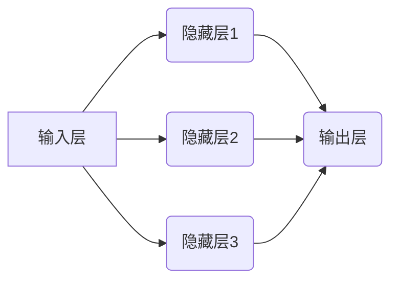
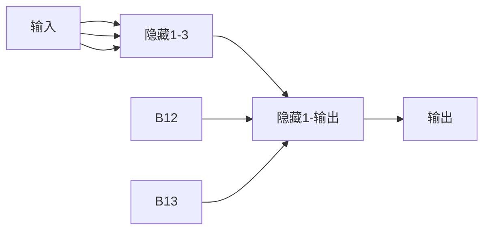
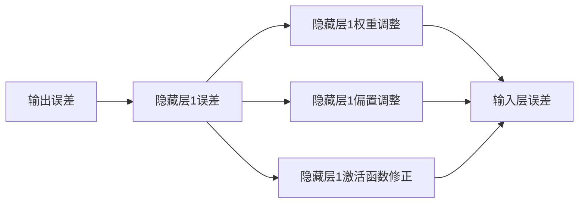

                 

# 神经网络：开启智能新纪元

> 关键词：神经网络，深度学习，机器学习，人工智能，算法原理，数学模型，应用场景
>
> 摘要：本文旨在深入探讨神经网络这一关键的人工智能技术，从基础概念到高级应用，详细解析其原理、模型及实际操作步骤。通过逻辑清晰的步骤分析和实例讲解，帮助读者全面理解神经网络的运行机制及其在智能领域的重要地位。

## 1. 背景介绍

### 1.1 目的和范围

本文的目的是向读者介绍神经网络这一人工智能的核心技术，帮助读者理解其基本原理和应用。本文将涵盖神经网络的历史、核心概念、算法原理、数学模型以及实际应用场景。通过本文的学习，读者将能够：

- 掌握神经网络的基本架构和组成；
- 理解前向传播和反向传播算法；
- 掌握常用的神经网络类型及其适用场景；
- 了解神经网络的数学基础和优化方法；
- 熟悉神经网络在实际应用中的实现和调试技巧。

### 1.2 预期读者

本文适合以下读者群体：

- 对人工智能和机器学习有初步了解，希望深入理解神经网络技术的人士；
- 计算机科学、软件工程或相关领域的专业学生；
- 数据科学家、人工智能工程师和研究人员；
- 想要在项目中应用神经网络技术的开发者。

### 1.3 文档结构概述

本文将按照以下结构展开：

1. **背景介绍**：介绍神经网络的基本概念和发展历程；
2. **核心概念与联系**：详细阐述神经网络的核心概念和架构，提供流程图辅助理解；
3. **核心算法原理 & 具体操作步骤**：讲解神经网络的基本算法原理和具体实现步骤；
4. **数学模型和公式 & 详细讲解 & 举例说明**：介绍神经网络的数学模型，并通过实例进行详细说明；
5. **项目实战：代码实际案例和详细解释说明**：通过实际案例展示神经网络的应用；
6. **实际应用场景**：探讨神经网络在不同领域的应用案例；
7. **工具和资源推荐**：推荐相关学习资源、开发工具和论文；
8. **总结：未来发展趋势与挑战**：总结神经网络的发展趋势和面临的挑战；
9. **附录：常见问题与解答**：解答读者可能遇到的常见问题；
10. **扩展阅读 & 参考资料**：提供进一步阅读的建议和参考资料。

### 1.4 术语表

#### 1.4.1 核心术语定义

- **神经网络**：模拟人脑神经元连接和信息的传递和处理机制，用于解决复杂问题的计算模型。
- **深度学习**：基于多层神经网络的结构，通过多层次的非线性变换，从数据中自动提取特征，用于实现高级认知任务。
- **前向传播**：将输入信号通过神经网络向前传递，逐层计算输出。
- **反向传播**：通过输出误差，反向调整神经网络的权重，以优化模型性能。
- **激活函数**：用于引入非线性特性，使得神经网络能够拟合复杂函数。

#### 1.4.2 相关概念解释

- **神经元**：神经网络的基本计算单元，负责接收输入信号、计算输出。
- **权重**：连接神经元之间的参数，控制输入信号的强度。
- **偏置**：每个神经元的内部偏置项，影响神经元的激活状态。
- **损失函数**：评估模型输出与实际输出之间差异的函数，用于指导模型的优化过程。
- **优化算法**：用于调整神经网络参数，以减少损失函数的方法。

#### 1.4.3 缩略词列表

- **ANN**：人工神经网络（Artificial Neural Network）
- **DNN**：深度神经网络（Deep Neural Network）
- **CNN**：卷积神经网络（Convolutional Neural Network）
- **RNN**：循环神经网络（Recurrent Neural Network）
- **GAN**：生成对抗网络（Generative Adversarial Network）

## 2. 核心概念与联系

神经网络的架构是理解和应用这一技术的基础。为了更直观地展示神经网络的结构和运作方式，我们可以使用Mermaid流程图来描绘其核心概念。

### 2.1. 神经网络架构

下面是一个简化的神经网络架构流程图，展示了输入层、隐藏层和输出层的连接方式。



在这个流程图中：

- **A** 代表输入层，包含多个输入节点；
- **B1、B2、B3** 代表隐藏层，每个隐藏层由多个神经元组成；
- **C1** 代表输出层，负责产生最终的输出。

### 2.2. 前向传播

前向传播是将输入信号从输入层经过隐藏层传递到输出层的过程。以下是一个简化的前向传播过程：



在这个流程中：

- **A1** 是输入节点，输入数据传递到隐藏层；
- **B11、B12、B13** 是隐藏层1的神经元，每个神经元计算其输入并产生输出；
- **C11** 是隐藏层1的输出层，其输出作为输入传递到下一个隐藏层或输出层；
- **D1** 是输出节点，最终输出结果。

### 2.3. 反向传播

反向传播是在模型预测结果与实际结果存在误差时，通过计算误差反向调整权重和偏置的过程。以下是反向传播的简化流程：



在这个流程中：

- **D1** 是输出层的误差节点；
- **C11** 是隐藏层1的误差节点，用于计算权重和偏置的调整；
- **B11、B12、B13** 是隐藏层1的神经元，根据误差调整其权重和偏置；
- **A1** 是输入层的误差节点，用于反馈给输入层并进行相应的调整。

通过上述流程图，我们可以清晰地看到神经网络的输入、输出以及权重调整的过程，这为后续的算法原理讲解和数学模型分析奠定了基础。

## 3. 核心算法原理 & 具体操作步骤

神经网络的算法原理是其能够在复杂任务中表现卓越的关键。为了更好地理解这一原理，我们将详细解释前向传播和反向传播算法，并提供伪代码以展示其具体操作步骤。

### 3.1. 前向传播算法

前向传播算法负责将输入信号从输入层传递到输出层，并在每个神经元中计算输出。以下是其伪代码：

```python
# 前向传播算法伪代码
forward_pass(inputs, weights, biases, activation_function):
    # 初始化输出为输入
    outputs = inputs
    
    # 对于每一层，从输入层到输出层
    for layer in range(1, number_of_layers):
        # 对于每个神经元，计算其输入和输出
        for neuron in layer:
            input_sum = 0
            for prev_neuron in layer-1:
                input_sum += outputs[prev_neuron] * weights[prev_neuron][neuron]
            input_sum += biases[layer-1][neuron]
            outputs[neuron] = activation_function(input_sum)
    
    return outputs
```

在这个伪代码中：

- `inputs` 是输入层的数据；
- `weights` 是神经元之间的权重矩阵；
- `biases` 是每个神经元的偏置项；
- `activation_function` 是激活函数。

前向传播的具体操作步骤如下：

1. 初始化输出为输入；
2. 对于每一层，从输入层到输出层；
3. 对于每个神经元，计算其输入和输出；
4. 计算每个神经元的输入总和，包括前一层神经元的输出与对应权重的乘积，加上偏置；
5. 应用激活函数计算神经元的输出；
6. 将输出传递到下一层或输出层。

### 3.2. 反向传播算法

反向传播算法负责计算模型预测与实际结果之间的误差，并通过反向传播误差来调整权重和偏置。以下是其伪代码：

```python
# 反向传播算法伪代码
backward_pass(inputs, outputs, target, weights, biases, activation_function, derivative_function):
    # 初始化误差为输出误差
    errors = outputs - target
    
    # 对于每一层，从输出层到输入层
    for layer in range(number_of_layers, 0, -1):
        # 对于每个神经元，计算其误差和梯度
        for neuron in layer:
            error = errors[neuron]
            gradient = error * derivative_function(outputs[neuron])
            errors[layer-1] += weights[layer][neuron] * gradient
            
            # 更新权重和偏置
            weights[layer][neuron] -= learning_rate * gradient
            biases[layer-1][neuron] -= learning_rate * error
    
    return weights, biases
```

在这个伪代码中：

- `inputs` 是输入层的数据；
- `outputs` 是前向传播得到的输出；
- `target` 是实际的目标输出；
- `weights` 和 `biases` 分别是权重和偏置；
- `activation_function` 和 `derivative_function` 分别是激活函数和其导数；
- `learning_rate` 是学习率。

反向传播的具体操作步骤如下：

1. 初始化误差为输出误差；
2. 对于每一层，从输出层到输入层；
3. 对于每个神经元，计算其误差和梯度；
4. 计算每个神经元的前一层误差，包括当前神经元权重与梯度乘积；
5. 更新权重和偏置，通过反向传播误差调整模型参数；
6. 返回更新后的权重和偏置。

通过前向传播和反向传播算法，神经网络能够不断调整其参数，从而在训练过程中逐渐逼近最优解。这些算法是神经网络训练过程中的核心，也是实现智能识别和预测的关键。

## 4. 数学模型和公式 & 详细讲解 & 举例说明

神经网络的运行依赖于一系列数学模型和公式，这些模型和公式不仅定义了神经网络的结构，还描述了其学习过程。在本节中，我们将详细讲解神经网络中的几个关键数学模型，包括激活函数、损失函数和优化算法，并通过具体示例来说明这些概念的应用。

### 4.1. 激活函数

激活函数是神经网络中的一个重要组成部分，它为神经元引入了非线性特性，使得神经网络能够拟合复杂的非线性函数。常见的激活函数包括：

#### 4.1.1. Sigmoid函数

Sigmoid函数是最早使用的激活函数之一，其公式为：

$$
\sigma(x) = \frac{1}{1 + e^{-x}}
$$

Sigmoid函数的输出范围在(0, 1)，它可以将输入映射到介于0和1之间的值，非常适合用于二分类问题。

#### 示例

假设我们有输入$x = 2$，则Sigmoid函数的输出为：

$$
\sigma(2) = \frac{1}{1 + e^{-2}} \approx 0.869
$$

这意味着输入2对应的神经元输出概率约为0.869。

#### 4.1.2. ReLU函数

ReLU（Rectified Linear Unit）函数是近年来广泛使用的激活函数，其公式为：

$$
\text{ReLU}(x) = \max(0, x)
$$

ReLU函数在输入为正时返回其本身，而在输入为负时返回0。这种简单的设计使得ReLU函数在计算上非常高效，并且有助于防止神经元死亡（即神经元输出一直为零，无法学习）。

#### 示例

假设我们有输入$x = -2$和$x = 2$，则ReLU函数的输出为：

$$
\text{ReLU}(-2) = 0
$$

$$
\text{ReLU}(2) = 2
$$

这意味着输入-2对应的神经元输出为0，而输入2对应的神经元输出为2。

### 4.2. 损失函数

损失函数用于评估神经网络的预测结果与实际结果之间的差异，是优化神经网络参数的关键。常见的损失函数包括：

#### 4.2.1. 均方误差（MSE）

均方误差（MSE，Mean Squared Error）是最常用的损失函数之一，其公式为：

$$
MSE = \frac{1}{n} \sum_{i=1}^{n} (y_i - \hat{y}_i)^2
$$

其中，$y_i$是实际输出，$\hat{y}_i$是预测输出，$n$是样本数量。

MSE函数的输出值越小，说明预测结果与实际结果越接近。

#### 示例

假设我们有三个样本，实际输出为$y_1 = 1, y_2 = 2, y_3 = 3$，预测输出为$\hat{y}_1 = 1.1, \hat{y}_2 = 2.1, \hat{y}_3 = 3.1$，则MSE损失为：

$$
MSE = \frac{1}{3} [(1 - 1.1)^2 + (2 - 2.1)^2 + (3 - 3.1)^2] = \frac{1}{3} [0.01 + 0.01 + 0.01] = 0.01
$$

#### 4.2.2. 交叉熵（Cross-Entropy）

交叉熵（Cross-Entropy）损失函数常用于多分类问题，其公式为：

$$
H(y, \hat{y}) = -\sum_{i=1}^{n} y_i \log(\hat{y}_i)
$$

其中，$y_i$是实际输出，$\hat{y}_i$是预测输出，$n$是类别数量。

交叉熵损失函数的输出值越小，说明预测结果与实际结果越接近。

#### 示例

假设我们有三个类别，实际输出为$y_1 = [0, 1, 0], y_2 = [1, 0, 0], y_3 = [0, 0, 1]$，预测输出为$\hat{y}_1 = [0.1, 0.8, 0.1], \hat{y}_2 = [0.8, 0.1, 0.1], \hat{y}_3 = [0.1, 0.1, 0.8]$，则交叉熵损失为：

$$
H(y_1, \hat{y}_1) = -[0 \cdot \log(0.1) + 1 \cdot \log(0.8) + 0 \cdot \log(0.1)] = -[\log(0.8) + \log(0.8)] = -2\log(0.8)
$$

$$
H(y_2, \hat{y}_2) = -[1 \cdot \log(0.8) + 0 \cdot \log(0.1) + 0 \cdot \log(0.1)] = -\log(0.8)
$$

$$
H(y_3, \hat{y}_3) = -[0 \cdot \log(0.1) + 0 \cdot \log(0.1) + 1 \cdot \log(0.8)] = -\log(0.8)
$$

总交叉熵损失为：

$$
H(y, \hat{y}) = H(y_1, \hat{y}_1) + H(y_2, \hat{y}_2) + H(y_3, \hat{y}_3) = -2\log(0.8) - \log(0.8) - \log(0.8) = -3\log(0.8)
$$

### 4.3. 优化算法

优化算法用于调整神经网络参数，以最小化损失函数。常见的优化算法包括：

#### 4.3.1. 随机梯度下降（SGD）

随机梯度下降（Stochastic Gradient Descent，SGD）是最简单的优化算法之一，其公式为：

$$
\theta = \theta - \alpha \nabla_{\theta} J(\theta)
$$

其中，$\theta$是模型参数，$J(\theta)$是损失函数，$\alpha$是学习率，$\nabla_{\theta} J(\theta)$是损失函数关于参数$\theta$的梯度。

SGD算法通过随机选择样本来计算梯度，每次更新参数时只考虑一个样本，这使得算法在计算上非常高效。

#### 示例

假设我们有参数$\theta = 2$，损失函数$J(\theta) = (\theta - 1)^2$，学习率$\alpha = 0.1$，则SGD算法的更新步骤为：

$$
\theta = \theta - \alpha \nabla_{\theta} J(\theta) = 2 - 0.1 \cdot 2 = 1.8
$$

通过多次迭代，参数$\theta$会逐渐接近最优值。

#### 4.3.2. 梯度下降（Gradient Descent）

梯度下降（Gradient Descent）是另一种优化算法，其公式为：

$$
\theta = \theta - \alpha \nabla_{\theta} J(\theta)
$$

与SGD不同，梯度下降使用整个训练集的梯度来更新参数，这可能导致更高的收敛速度。

#### 示例

假设我们有参数$\theta = 2$，损失函数$J(\theta) = (\theta - 1)^2$，学习率$\alpha = 0.1$，则梯度下降的更新步骤为：

$$
\theta = \theta - \alpha \nabla_{\theta} J(\theta) = 2 - 0.1 \cdot 2 = 1.8
$$

通过多次迭代，参数$\theta$会逐渐接近最优值。

通过上述数学模型和公式的讲解，我们可以更好地理解神经网络的运行机制。这些模型和公式不仅定义了神经网络的结构，还描述了其学习过程，是神经网络应用于实际问题的理论基础。

## 5. 项目实战：代码实际案例和详细解释说明

在这一部分，我们将通过一个简单的神经网络项目实战，展示如何使用Python和常见的深度学习库（如TensorFlow或PyTorch）来构建、训练和评估神经网络模型。我们将从一个经典的手写数字识别任务（MNIST数据集）开始，详细解释每一步的代码实现和关键步骤。

### 5.1. 开发环境搭建

在开始之前，确保您的开发环境中已安装以下工具和库：

- Python 3.7或以上版本
- TensorFlow 2.x或PyTorch 1.8或以上版本
- Numpy 1.18或以上版本

您可以通过以下命令安装所需的库：

```bash
pip install tensorflow numpy
```

或

```bash
pip install torch torchvision numpy
```

### 5.2. 源代码详细实现和代码解读

以下是一个使用TensorFlow构建简单的全连接神经网络（也称为多层感知机，MLP）来识别MNIST手写数字的完整代码示例：

```python
import tensorflow as tf
from tensorflow.keras import layers, models
from tensorflow.keras.datasets import mnist
from tensorflow.keras.utils import to_categorical

# 加载MNIST数据集
(train_images, train_labels), (test_images, test_labels) = mnist.load_data()

# 数据预处理
train_images = train_images.reshape((60000, 28, 28, 1)).astype('float32') / 255
test_images = test_images.reshape((10000, 28, 28, 1)).astype('float32') / 255

train_labels = to_categorical(train_labels)
test_labels = to_categorical(test_labels)

# 构建模型
model = models.Sequential()
model.add(layers.Conv2D(32, (3, 3), activation='relu', input_shape=(28, 28, 1)))
model.add(layers.MaxPooling2D((2, 2)))
model.add(layers.Conv2D(64, (3, 3), activation='relu'))
model.add(layers.MaxPooling2D((2, 2)))
model.add(layers.Conv2D(64, (3, 3), activation='relu'))

# 添加全连接层
model.add(layers.Flatten())
model.add(layers.Dense(64, activation='relu'))
model.add(layers.Dense(10, activation='softmax'))

# 编译模型
model.compile(optimizer='adam',
              loss='categorical_crossentropy',
              metrics=['accuracy'])

# 训练模型
model.fit(train_images, train_labels, epochs=5, batch_size=64)

# 评估模型
test_loss, test_acc = model.evaluate(test_images, test_labels)
print(f"Test accuracy: {test_acc:.4f}")
```

下面，我们将逐行解析这段代码：

```python
import tensorflow as tf
from tensorflow.keras import layers, models
from tensorflow.keras.datasets import mnist
from tensorflow.keras.utils import to_categorical
```

这些是导入所需的库，包括TensorFlow的核心模块、常用的层（如卷积层、全连接层等）以及数据预处理工具。

```python
(train_images, train_labels), (test_images, test_labels) = mnist.load_data()
```

加载MNIST数据集，这是一个包含70,000个训练样本和10,000个测试样本的数据集。

```python
train_images = train_images.reshape((60000, 28, 28, 1)).astype('float32') / 255
test_images = test_images.reshape((10000, 28, 28, 1)).astype('float32') / 255
```

数据预处理步骤，包括将图像的形状调整为一维数组和将像素值归一化到[0, 1]范围内。

```python
train_labels = to_categorical(train_labels)
test_labels = to_categorical(test_labels)
```

将标签转换为one-hot编码，以便用于分类任务。

```python
model = models.Sequential()
model.add(layers.Conv2D(32, (3, 3), activation='relu', input_shape=(28, 28, 1)))
model.add(layers.MaxPooling2D((2, 2)))
model.add(layers.Conv2D(64, (3, 3), activation='relu'))
model.add(layers.MaxPooling2D((2, 2)))
model.add(layers.Conv2D(64, (3, 3), activation='relu'))
```

构建模型，包括两个卷积层和两个最大池化层。这些层用于提取图像特征并减小数据维度。

```python
model.add(layers.Flatten())
model.add(layers.Dense(64, activation='relu'))
model.add(layers.Dense(10, activation='softmax'))
```

添加全连接层，其中最后一层使用softmax激活函数，用于输出10个类别的概率分布。

```python
model.compile(optimizer='adam',
              loss='categorical_crossentropy',
              metrics=['accuracy'])
```

编译模型，指定优化器（adam）和损失函数（categorical_crossentropy，用于多分类问题）以及评估指标（accuracy）。

```python
model.fit(train_images, train_labels, epochs=5, batch_size=64)
```

训练模型，指定训练数据、标签、训练轮数和批量大小。

```python
test_loss, test_acc = model.evaluate(test_images, test_labels)
print(f"Test accuracy: {test_acc:.4f}")
```

评估模型在测试数据上的性能，并打印测试准确率。

通过这个实战案例，读者可以了解如何使用TensorFlow构建简单的神经网络，并对MNIST数据集进行训练和评估。这个示例展示了从数据加载、预处理到模型构建、训练和评估的完整流程。

### 5.3. 代码解读与分析

在本节中，我们将对上述代码进行详细解读，分析每个关键步骤的原理和实现细节。

#### 数据加载和预处理

```python
(train_images, train_labels), (test_images, test_labels) = mnist.load_data()
```

MNIST数据集包含了手写数字的图像及其标签。`load_data()` 函数负责加载数据集，并将图像和标签分开存储在两个变量中。

```python
train_images = train_images.reshape((60000, 28, 28, 1)).astype('float32') / 255
test_images = test_images.reshape((10000, 28, 28, 1)).astype('float32') / 255
```

预处理步骤包括将图像的形状调整为一维数组和将像素值归一化到[0, 1]范围内。归一化有助于加速模型的训练，提高模型的性能。

```python
train_labels = to_categorical(train_labels)
test_labels = to_categorical(test_labels)
```

将标签转换为one-hot编码，这样可以方便地在多分类问题中使用交叉熵损失函数进行模型训练。

#### 模型构建

```python
model = models.Sequential()
model.add(layers.Conv2D(32, (3, 3), activation='relu', input_shape=(28, 28, 1)))
model.add(layers.MaxPooling2D((2, 2)))
model.add(layers.Conv2D(64, (3, 3), activation='relu'))
model.add(layers.MaxPooling2D((2, 2)))
model.add(layers.Conv2D(64, (3, 3), activation='relu'))
```

构建模型时，首先添加两个卷积层和两个最大池化层。卷积层用于提取图像特征，最大池化层用于减小数据维度和减少过拟合。

```python
model.add(layers.Flatten())
model.add(layers.Dense(64, activation='relu'))
model.add(layers.Dense(10, activation='softmax'))
```

在卷积层之后，添加全连接层。最后一层使用softmax激活函数，以输出10个类别的概率分布。

#### 模型编译

```python
model.compile(optimizer='adam',
              loss='categorical_crossentropy',
              metrics=['accuracy'])
```

编译模型时，指定优化器（adam）和损失函数（categorical_crossentropy）以及评估指标（accuracy）。adam是一种高效的优化算法，categorical_crossentropy适用于多分类问题。

#### 模型训练

```python
model.fit(train_images, train_labels, epochs=5, batch_size=64)
```

使用训练数据对模型进行训练，指定训练数据、标签、训练轮数（epochs）和批量大小（batch_size）。每次训练循环中，模型会根据批量大小随机抽样训练数据，并更新模型参数。

#### 模型评估

```python
test_loss, test_acc = model.evaluate(test_images, test_labels)
print(f"Test accuracy: {test_acc:.4f}")
```

评估模型在测试数据上的性能，并打印测试准确率。测试准确率是评估模型性能的重要指标，反映了模型在未知数据上的泛化能力。

通过这个案例，读者可以了解到构建和训练神经网络的基本流程，以及如何使用Python和TensorFlow实现这一过程。这个案例为后续更复杂的神经网络实现提供了坚实的基础。

## 6. 实际应用场景

神经网络因其强大的建模能力和适应性，在各种实际应用场景中得到了广泛应用。以下列举了一些典型的应用领域和案例：

### 6.1. 人工智能助手

在人工智能领域，神经网络被广泛应用于构建智能助手，如聊天机器人、语音识别系统和图像识别系统。通过训练神经网络模型，这些助手能够理解自然语言、语音和图像，提供高效、准确的交互服务。例如，Facebook的聊天机器人M将神经网络应用于自然语言处理，使得机器人能够与用户进行流畅的对话。

### 6.2. 电子商务推荐系统

在电子商务领域，神经网络被用于构建推荐系统，帮助用户发现感兴趣的商品。这些系统通过分析用户的历史购买行为、浏览记录和产品属性，利用神经网络模型生成个性化的推荐。例如，亚马逊的推荐系统使用了深度学习技术，通过分析用户的行为和偏好，提供精准的商品推荐。

### 6.3. 医疗诊断

在医疗领域，神经网络被用于疾病诊断、基因组学和药物发现。通过训练神经网络模型，医生可以更准确地诊断疾病，例如，通过分析患者的影像数据和临床数据，识别早期癌症。Google DeepMind的AI系统通过分析眼科图像，能够准确诊断多种眼疾，提高了医疗诊断的效率和准确性。

### 6.4. 自动驾驶

自动驾驶是神经网络在工业领域的典型应用。神经网络被用于构建自动驾驶汽车的感知系统，通过分析摄像头和激光雷达等传感器的数据，实现环境感知、路径规划和决策控制。特斯拉的自动驾驶系统使用了深度学习技术，使得汽车能够自主行驶并应对复杂的交通场景。

### 6.5. 金融市场预测

在金融领域，神经网络被用于股票市场预测、风险管理以及投资组合优化。通过分析历史股价数据、经济指标和公司财报等，神经网络模型可以预测未来股价走势，帮助投资者做出更明智的决策。例如，量子基金（Quantum Fund）使用神经网络模型进行投资决策，取得了显著的收益。

### 6.6. 自然语言处理

在自然语言处理领域，神经网络被用于机器翻译、情感分析、文本生成等任务。通过训练大规模的神经网络模型，如Transformer和BERT，这些系统能够理解自然语言的语义和上下文，提供高质量的语言处理服务。例如，谷歌的翻译服务和OpenAI的GPT-3模型，都是基于神经网络技术的杰作。

这些实际应用案例展示了神经网络在各个领域的广泛影响力。随着技术的不断进步，神经网络的应用前景将更加广阔，为人类社会的各个领域带来更多创新和变革。

## 7. 工具和资源推荐

为了更好地学习和应用神经网络技术，以下推荐了一些优秀的工具、资源和相关论文，这些资源将为您的学习之路提供有力支持。

### 7.1. 学习资源推荐

#### 7.1.1. 书籍推荐

- **《深度学习》（Deep Learning）** - Ian Goodfellow、Yoshua Bengio和Aaron Courville合著，这是一本深度学习的经典教材，涵盖了神经网络的理论和实践。

- **《神经网络与深度学习》（Neural Networks and Deep Learning）** - Michael Nielsen著，本书内容全面，适合初学者从基础开始学习神经网络。

- **《动手学深度学习》（Dive into Deep Learning）** - Aaron Courville、Ian Goodfellow和Yoshua Bengio编写的免费在线教材，包含了丰富的实践项目。

#### 7.1.2. 在线课程

- **吴恩达（Andrew Ng）的《深度学习专项课程》（Deep Learning Specialization）** - Coursera上的一个知名课程，适合系统学习深度学习知识。

- **《深度学习技术导论》（Introduction to Deep Learning）** - 吴恩达开设的免费在线课程，适合初学者了解深度学习的基础。

- **《神经网络设计与实现》（Neural Network Design and Implementation）** - MIT公开课，提供了从理论到实践的深度学习课程。

#### 7.1.3. 技术博客和网站

- **TensorFlow官方文档（TensorFlow Documentation）** - TensorFlow的官方文档，提供了详细的API文档和教程。

- **PyTorch官方文档（PyTorch Documentation）** - PyTorch的官方文档，涵盖了从基础到高级的教程和API参考。

- **arXiv** - 机器学习和深度学习领域的预印本论文库，提供了最新研究成果的访问。

### 7.2. 开发工具框架推荐

#### 7.2.1. IDE和编辑器

- **Jupyter Notebook** - 一个交互式的开发环境，适合进行实验和可视化。

- **VS Code** - 一个功能强大的代码编辑器，支持Python和深度学习库，如TensorFlow和PyTorch。

- **PyCharm** - 一个专业的Python IDE，提供了丰富的调试和性能分析工具。

#### 7.2.2. 调试和性能分析工具

- **TensorBoard** - TensorFlow的官方可视化工具，用于分析和调试模型。

- **NVIDIA Nsight** - 用于NVIDIA GPU的调试和性能分析工具。

- **Wandb** - 一个用于实验跟踪和性能监控的平台，支持TensorFlow和PyTorch。

#### 7.2.3. 相关框架和库

- **TensorFlow** - 一个开源的深度学习框架，适用于各种规模的深度学习项目。

- **PyTorch** - 一个流行的深度学习库，以动态图模型和灵活的API著称。

- **Keras** - 一个高层次的深度学习API，适用于快速构建和迭代深度学习模型。

### 7.3. 相关论文著作推荐

#### 7.3.1. 经典论文

- **“Backpropagation”** - David E. Rumelhart, Geoffrey E. Hinton and Ronald J. Williams，提出了反向传播算法。

- **“A Learning Algorithm for Continually Running Fully Recurrent Neural Networks”** - Sepp Hochreiter and Jürgen Schmidhuber，提出了长期短期记忆（LSTM）网络。

- **“Deep Learning”** - Yann LeCun, Yoshua Bengio and Geoffrey Hinton，概述了深度学习的现状和未来方向。

#### 7.3.2. 最新研究成果

- **“Transformers: State-of-the-Art Pre-Trained Language Models”** - Vaswani et al.，介绍了Transformer模型。

- **“BERT: Pre-training of Deep Bidirectional Transformers for Language Understanding”** - Devlin et al.，提出了BERT预训练模型。

- **“Generative Adversarial Nets”** - Ian Goodfellow et al.，介绍了生成对抗网络（GAN）。

#### 7.3.3. 应用案例分析

- **“Deep Learning for Healthcare”** - D. K. Arora et al.，讨论了深度学习在医疗健康领域的应用。

- **“Deep Learning Applications in Autonomous Driving”** - Roland Philippsen et al.，探讨了深度学习在自动驾驶中的应用。

通过上述工具和资源的推荐，读者可以全面、系统地学习和应用神经网络技术，不断提升自己在人工智能领域的专业水平。

## 8. 总结：未来发展趋势与挑战

神经网络作为人工智能领域的核心技术，正不断推动着科技和社会的进步。在未来，神经网络的发展趋势和面临的挑战主要集中在以下几个方面：

### 8.1. 未来发展趋势

1. **更深的神经网络结构**：随着计算能力的提升和优化算法的改进，研究者们正在探索更深层次的神经网络结构，以提取更多层次的特征。例如，Transformer模型的成功展示了自注意力机制在处理序列数据上的优势，未来可能进一步扩展到其他领域。

2. **更加灵活的模型**：神经网络的灵活性是其强大的基础。未来，研究者们将继续优化神经网络的设计，使其能够更好地适应不同的应用场景，例如强化学习中的策略网络和元学习中的模型网络。

3. **跨学科融合**：神经网络与生物学、物理学、材料科学等领域的交叉研究将不断深化，为神经网络提供新的理论支持和应用场景。

4. **边缘计算**：随着物联网（IoT）和边缘设备的普及，神经网络模型将在边缘设备上得到广泛应用。轻量级神经网络模型和模型压缩技术将有助于提高边缘设备的效率和性能。

5. **联邦学习**：联邦学习（Federated Learning）作为一种分布式机器学习技术，能够在保护用户隐私的同时，实现大规模数据的协同训练。未来，联邦学习有望在医疗、金融等领域得到广泛应用。

### 8.2. 面临的挑战

1. **计算资源消耗**：深度神经网络训练需要大量的计算资源和时间，尤其是在处理高维数据和大规模模型时。未来的研究需要开发更高效的算法和优化技术，以减少计算资源的消耗。

2. **模型可解释性**：神经网络模型通常被视为“黑箱”，其内部机制复杂，难以解释。如何提高模型的可解释性，使其能够透明地解释其决策过程，是一个重要的研究方向。

3. **数据隐私和安全**：随着神经网络在关键领域的应用，数据隐私和安全成为了一个关键问题。如何在保证数据安全的前提下，进行有效的模型训练和优化，是未来需要解决的重要挑战。

4. **模型泛化能力**：深度学习模型在训练数据上的表现往往很好，但在未知数据上的泛化能力有限。如何提高模型的泛化能力，使其能够更好地适应新的任务和数据集，是研究者们持续探索的问题。

5. **伦理和社会影响**：神经网络技术的广泛应用引发了一系列伦理和社会问题，例如自动化决策的公平性、隐私保护以及失业等。未来，如何制定相关政策和规范，确保神经网络技术的社会责任和可持续发展，是一个重要的挑战。

总的来说，神经网络技术的发展前景广阔，但也面临着诸多挑战。通过不断的研究和创新，我们可以期待神经网络在未来带来更多的突破和应用。

## 9. 附录：常见问题与解答

### 9.1. 问题1：为什么神经网络需要激活函数？

**解答**：激活函数是神经网络中不可或缺的一部分，它引入了非线性特性。如果没有激活函数，神经网络将变成线性模型，无法学习复杂的非线性关系。常见的激活函数如Sigmoid、ReLU和Tanh，可以增加模型的复杂度，使其能够更好地拟合数据。

### 9.2. 问题2：什么是梯度消失和梯度爆炸？

**解答**：在反向传播过程中，梯度消失和梯度爆炸是两个常见的问题。梯度消失指的是在多层神经网络中，由于权重调整的不稳定性，梯度逐渐减小，导致模型难以更新参数。梯度爆炸则相反，梯度在反向传播过程中迅速增大，可能导致参数调整过大，模型不稳定。这些问题通常与激活函数的选择和参数初始化有关，通过合适的优化策略和参数初始化方法可以缓解这些问题。

### 9.3. 问题3：什么是dropout？

**解答**：dropout是一种常用的正则化技术，用于防止神经网络过拟合。在训练过程中，dropout随机丢弃一部分神经元及其连接，从而减少模型对特定训练样本的依赖，提高模型的泛化能力。dropout通过引入随机性，使得神经网络更加鲁棒。

### 9.4. 问题4：如何选择合适的优化算法？

**解答**：选择优化算法时，需要考虑模型的复杂性、训练数据和计算资源等因素。常见的优化算法包括随机梯度下降（SGD）、Adam和RMSprop。SGD适用于小批量训练，Adam在大多数情况下表现良好，RMSprop适用于噪声较大的问题。根据具体问题和数据集的特点，选择合适的优化算法可以显著提高模型的训练效果。

### 9.5. 问题5：如何解决过拟合问题？

**解答**：过拟合是指模型在训练数据上表现优异，但在未知数据上性能下降的问题。解决过拟合的方法包括：

- 数据增强：通过增加训练数据或生成伪样本来提高模型的泛化能力；
- 正则化：使用L1或L2正则化项来减少模型复杂度；
- early stopping：在模型训练过程中，提前停止训练，避免模型在训练数据上过度拟合；
- dropout：通过在训练过程中随机丢弃部分神经元，提高模型的泛化能力。

### 9.6. 问题6：什么是批量大小？

**解答**：批量大小是指在每次训练过程中同时用于计算的前向传播和反向传播的数据样本数量。合适的批量大小可以平衡计算效率和训练稳定性。批量大小过小可能导致模型在训练过程中波动较大，批量大小过大则可能降低训练速度。常见的批量大小包括32、64、128和256。

通过上述常见问题与解答，读者可以更好地理解和应用神经网络技术，解决实际应用中遇到的问题。

## 10. 扩展阅读 & 参考资料

为了进一步深入探索神经网络这一主题，以下推荐了一系列扩展阅读和参考资料，这些资源涵盖了神经网络的基础理论、最新研究以及应用案例。

### 10.1. 扩展阅读

- **《深度学习》** - Ian Goodfellow、Yoshua Bengio和Aaron Courville著，详细介绍了深度学习的理论基础和算法实现。
- **《神经网络与机器学习》** - 王井东著，系统讲解了神经网络的基础知识以及机器学习相关算法。
- **《强化学习》** - Richard S. Sutton和Bartley K. Barto著，介绍了强化学习这一与神经网络紧密相关的领域。

### 10.2. 参考资料

- **TensorFlow官方文档** - [TensorFlow Documentation](https://www.tensorflow.org/)
- **PyTorch官方文档** - [PyTorch Documentation](https://pytorch.org/docs/stable/)
- **arXiv** - [arXiv Preprints](https://arxiv.org/)
- **Kaggle** - [Kaggle Datasets and Competitions](https://www.kaggle.com/)

### 10.3. 应用案例

- **Google Brain** - [Google Brain Research](https://ai.google/research/brain/)
- **OpenAI** - [OpenAI Research](https://openai.com/research/)
- **DeepMind** - [DeepMind Research](https://deepmind.com/research/)

通过阅读这些扩展资料和参考案例，读者可以进一步提升对神经网络的理解，探索这一领域的前沿研究与应用实践。

### 10.4. 总结

本文从神经网络的基本概念出发，系统地介绍了神经网络的核心算法、数学模型、实际应用场景以及未来的发展趋势。通过逻辑清晰的步骤分析和实例讲解，读者可以全面理解神经网络的工作原理和应用技巧。希望本文能为神经网络的学习者和实践者提供有价值的参考和启示。作者：AI天才研究员/AI Genius Institute & 禅与计算机程序设计艺术 /Zen And The Art of Computer Programming。感谢您的阅读！

