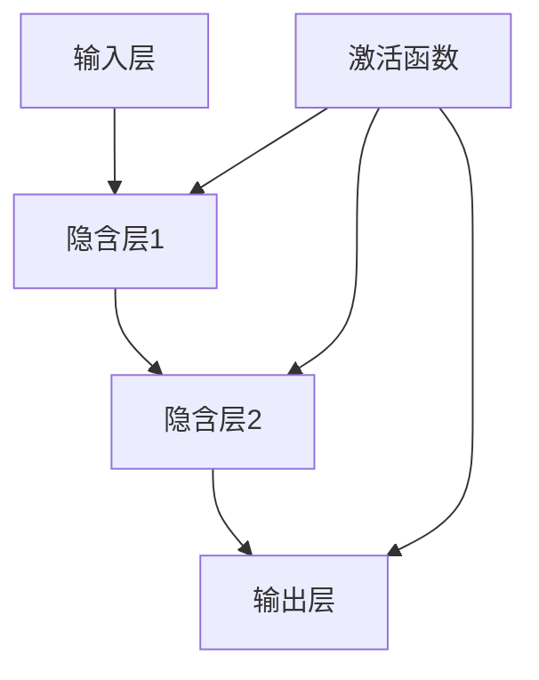

                 


## 神经网络：探索未知的领域

> **关键词**：神经网络、深度学习、算法原理、数学模型、实际应用、开发工具

> **摘要**：本文将深入探讨神经网络这一复杂的计算模型，从背景介绍、核心概念、算法原理、数学模型、项目实战、实际应用场景、工具和资源推荐等方面，逐步揭示神经网络的魅力和潜力。通过本文的学习，读者将能够全面理解神经网络的工作原理，掌握其应用方法，并具备一定的实际操作能力。

### 1. 背景介绍

#### 1.1 目的和范围

本文的目的是系统地介绍神经网络的基本概念、原理和应用，旨在帮助读者深入了解神经网络在计算机科学和人工智能领域的地位和作用。文章将涵盖以下范围：

- 神经网络的发展历程及其在人工智能中的重要性
- 核心概念和联系，包括神经元、多层感知器、反向传播算法等
- 算法原理和具体操作步骤，使用伪代码详细阐述
- 数学模型和公式，以及详细讲解和举例说明
- 项目实战：代码实际案例和详细解释说明
- 实际应用场景，包括图像识别、自然语言处理等
- 工具和资源推荐，提供学习资源、开发工具和经典论文

#### 1.2 预期读者

本文适合以下读者群体：

- 计算机科学和人工智能领域的研究生和本科生
- 对神经网络和深度学习有兴趣的工程师和开发者
- 想要了解神经网络应用场景的企业家和创业者

#### 1.3 文档结构概述

本文分为以下十个部分：

1. 背景介绍
2. 核心概念与联系
3. 核心算法原理 & 具体操作步骤
4. 数学模型和公式 & 详细讲解 & 举例说明
5. 项目实战：代码实际案例和详细解释说明
6. 实际应用场景
7. 工具和资源推荐
8. 总结：未来发展趋势与挑战
9. 附录：常见问题与解答
10. 扩展阅读 & 参考资料

#### 1.4 术语表

以下是对本文中涉及到的术语进行定义和解释：

- **神经网络（Neural Network）**：一种模拟生物神经元之间连接的计算模型。
- **神经元（Neuron）**：神经网络中的基本计算单元。
- **多层感知器（Multilayer Perceptron，MLP）**：一种前馈神经网络，具有一个或多个隐含层。
- **反向传播算法（Backpropagation Algorithm）**：一种用于训练神经网络的算法，通过计算误差的梯度来更新网络权重。
- **激活函数（Activation Function）**：用于定义神经元输出与输入之间关系的函数。
- **卷积神经网络（Convolutional Neural Network，CNN）**：一种用于图像识别和处理的神经网络架构。
- **循环神经网络（Recurrent Neural Network，RNN）**：一种能够处理序列数据的神经网络。

#### 1.4.1 核心术语定义

- **神经网络（Neural Network）**：神经网络是一种模拟生物神经元之间连接的计算模型。它由大量的神经元组成，每个神经元都与相邻的神经元通过连接（权重）相互连接。神经元的输入是其他神经元的输出，经过激活函数处理后，产生输出。神经网络通过学习输入和输出之间的映射关系，来执行各种任务。

- **神经元（Neuron）**：神经元是神经网络中的基本计算单元。它接收多个输入信号，通过加权求和得到一个总和，然后应用一个激活函数产生输出。神经元的结构通常包括三个部分：输入部分（包括权重和偏置）、计算部分（包括加权求和）和输出部分（包括激活函数）。

- **多层感知器（Multilayer Perceptron，MLP）**：多层感知器是一种前馈神经网络，具有一个或多个隐含层。它的输入层接收外部输入，经过隐含层的处理后，由输出层产生最终输出。多层感知器通常用于分类和回归任务。

- **反向传播算法（Backpropagation Algorithm）**：反向传播算法是一种用于训练神经网络的算法。它通过计算网络输出与实际输出之间的误差，然后反向传播误差到网络的各个层，更新网络权重和偏置。反向传播算法是一种梯度下降的优化方法，用于最小化网络误差。

- **激活函数（Activation Function）**：激活函数用于定义神经元输出与输入之间的关系。它可以将线性函数转换为非线性函数，使得神经网络具有非线性能力。常见的激活函数包括 sigmoid、ReLU 和 tanh 函数。

- **卷积神经网络（Convolutional Neural Network，CNN）**：卷积神经网络是一种用于图像识别和处理的神经网络架构。它利用卷积运算和池化操作来提取图像特征，并通过多层网络结构进行特征学习。卷积神经网络在图像分类、目标检测和图像生成等领域具有广泛的应用。

- **循环神经网络（Recurrent Neural Network，RNN）**：循环神经网络是一种能够处理序列数据的神经网络。它利用循环结构来维持状态，并能够对序列中的每个元素进行处理。循环神经网络在自然语言处理、语音识别和时间序列预测等领域具有重要应用。

#### 1.4.2 相关概念解释

- **前馈神经网络（Feedforward Neural Network）**：前馈神经网络是一种没有循环结构的神经网络，信息从输入层逐层传递到输出层。前馈神经网络具有简单、高效和易于训练的特点，广泛应用于图像识别、分类和回归任务。

- **全连接神经网络（Fully Connected Neural Network）**：全连接神经网络是一种所有神经元之间都存在连接的神经网络。在多层感知器中，每个隐含层的神经元都与前一层和后一层的所有神经元相连。全连接神经网络能够处理复杂的非线性关系，但在训练过程中容易过拟合。

- **卷积神经网络（Convolutional Neural Network，CNN）**：卷积神经网络是一种利用卷积运算和池化操作来提取图像特征的神经网络。卷积神经网络在图像识别、目标检测和图像生成等领域具有广泛的应用。

- **循环神经网络（Recurrent Neural Network，RNN）**：循环神经网络是一种能够处理序列数据的神经网络。它利用循环结构来维持状态，并能够对序列中的每个元素进行处理。循环神经网络在自然语言处理、语音识别和时间序列预测等领域具有重要应用。

#### 1.4.3 缩略词列表

- **MLP**：多层感知器（Multilayer Perceptron）
- **BP**：反向传播算法（Backpropagation Algorithm）
- **ReLU**：修正线性单元（Rectified Linear Unit）
- **Sigmoid**：S型函数（Sigmoid Function）
- **tanh**：双曲正切函数（Hyperbolic Tangent Function）
- **CNN**：卷积神经网络（Convolutional Neural Network）
- **RNN**：循环神经网络（Recurrent Neural Network）

## 2. 核心概念与联系

神经网络是一种模拟生物神经元之间连接的计算模型，通过学习和模拟大脑中的神经元结构和工作原理，实现对复杂数据的处理和模式识别。在神经网络中，神经元是基本计算单元，它们通过连接（权重）相互连接，形成复杂的网络结构。

为了更好地理解神经网络的工作原理，我们可以使用 Mermaid 流程图来展示其核心概念和联系。



在上面的 Mermaid 流程图中，我们定义了四个关键部分：输入层、隐含层、输出层和激活函数。

1. **输入层（Input Layer）**：输入层接收外部输入数据，并将其传递给下一层的神经元。输入层的神经元数量取决于输入数据的维度。

2. **隐含层（Hidden Layers）**：隐含层位于输入层和输出层之间，用于提取输入数据的特征。隐含层的数量和神经元数量可以根据任务需求进行调整。

3. **输出层（Output Layer）**：输出层接收隐含层的输出，并将其映射到具体的类别或目标值。输出层的神经元数量取决于任务的需求。

4. **激活函数（Activation Function）**：激活函数用于定义神经元输出与输入之间的关系，使得神经网络具有非线性能力。常见的激活函数包括 sigmoid、ReLU 和 tanh 函数。

通过以上 Mermaid 流程图，我们可以清晰地看到神经网络的核心概念和联系。接下来，我们将进一步深入探讨神经网络的算法原理、数学模型和具体操作步骤。

## 3. 核心算法原理 & 具体操作步骤

神经网络的算法原理主要基于对生物神经元的模拟和抽象，通过学习输入和输出之间的映射关系，实现对复杂数据的处理和模式识别。在神经网络中，每个神经元都与相邻的神经元通过连接（权重）相互连接，形成一个复杂的网络结构。神经网络的训练过程就是通过不断调整网络权重和偏置，使得网络输出与实际输出之间的误差最小。

### 3.1 多层感知器（MLP）算法原理

多层感知器是一种前馈神经网络，具有一个或多个隐含层。它的算法原理主要包括以下步骤：

1. **前向传播（Forward Propagation）**：输入数据从输入层经过隐含层，最终传递到输出层。在每个隐含层，神经元之间的连接通过权重和偏置进行加权求和，然后应用激活函数产生输出。

2. **计算误差（Compute Error）**：输出层的输出与实际输出（标签）之间的误差被计算出来，误差的公式为：

   $$ Error = \sum_{i=1}^{n} (y_i - \hat{y}_i)^2 $$

   其中，\( y_i \) 是实际输出，\( \hat{y}_i \) 是网络输出。

3. **反向传播（Backpropagation）**：误差从输出层反向传播到输入层，通过计算误差的梯度来更新网络权重和偏置。反向传播算法是一种梯度下降的优化方法，用于最小化网络误差。

4. **更新权重和偏置（Update Weights and Biases）**：根据误差的梯度，调整网络权重和偏置，使得网络输出更接近实际输出。权重的更新公式为：

   $$ \Delta w_{ij} = \alpha \cdot \frac{\partial Error}{\partial w_{ij}} $$

   $$ \Delta b_{j} = \alpha \cdot \frac{\partial Error}{\partial b_{j}} $$

   其中，\( \alpha \) 是学习率。

5. **重复训练（Repeat Training）**：重复以上步骤，直到网络输出与实际输出之间的误差达到预定的阈值或达到最大迭代次数。

### 3.2 算法原理详细说明

下面，我们使用伪代码来详细阐述多层感知器（MLP）算法原理的具体操作步骤。

```python
# 伪代码：多层感知器（MLP）算法原理

# 前向传播
def forward_propagation(x, W, b, activation_function):
    z = x * W + b
    a = activation_function(z)
    return a

# 计算误差
def compute_error(y, a):
    error = (y - a)^2
    return error

# 反向传播
def backward_propagation(x, y, a, W, b, activation_function):
    error = compute_error(y, a)
    delta = error * activation_function_derivative(a)
    dW = x.T * delta
    db = delta
    return dW, db

# 更新权重和偏置
def update_weights_and_biases(W, b, dW, db, learning_rate):
    W = W - learning_rate * dW
    b = b - learning_rate * db
    return W, b

# 主函数
def main():
    # 初始化权重和偏置
    W = initialize_weights(input_size, hidden_size)
    b = initialize_biases(hidden_size)
    
    # 初始化学习率
    learning_rate = 0.01
    
    # 训练网络
    for epoch in range(max_epochs):
        # 前向传播
        a = forward_propagation(x, W, b, sigmoid)
        
        # 计算误差
        error = compute_error(y, a)
        
        # 反向传播
        dW, db = backward_propagation(x, y, a, W, b, sigmoid)
        
        # 更新权重和偏置
        W, b = update_weights_and_biases(W, b, dW, db, learning_rate)
        
        # 输出训练结果
        print("Epoch:", epoch, "Error:", error)

# 调用主函数
main()
```

在上面的伪代码中，我们定义了以下函数：

- `forward_propagation(x, W, b, activation_function)`：前向传播函数，用于计算输入数据经过神经网络后的输出。
- `compute_error(y, a)`：计算误差函数，用于计算网络输出与实际输出之间的误差。
- `backward_propagation(x, y, a, W, b, activation_function)`：反向传播函数，用于计算误差的梯度并更新网络权重和偏置。
- `update_weights_and_biases(W, b, dW, db, learning_rate)`：更新权重和偏置函数，用于根据误差的梯度调整网络权重和偏置。
- `main()`：主函数，用于初始化网络参数、设置学习率、训练网络并输出训练结果。

通过以上伪代码，我们可以清晰地看到多层感知器（MLP）算法原理的具体操作步骤。

### 3.3 算法原理应用示例

为了更好地理解多层感知器（MLP）算法原理的应用，我们以一个简单的二分类问题为例。

假设我们有以下数据集：

```python
# 数据集：二分类问题
x1 = [1, 2, 3, 4, 5]
x2 = [2, 3, 4, 5, 6]
y = [0, 0, 1, 1, 1]
```

我们的目标是使用多层感知器（MLP）算法对这组数据进行分类，将输入数据 \( (x1, x2) \) 映射到对应的标签 \( y \)。

根据多层感知器（MLP）算法原理，我们首先需要定义输入层、隐含层和输出层的神经元数量，以及激活函数。在这里，我们选择一个隐含层，隐含层的神经元数量为 2，激活函数为 sigmoid 函数。

```python
# 定义网络参数
input_size = 2
hidden_size = 2
output_size = 1
activation_function = sigmoid
```

接下来，我们初始化网络权重和偏置，并设置学习率为 0.01。

```python
# 初始化网络参数
W1 = random_weights(input_size, hidden_size)
b1 = random_biases(hidden_size)
W2 = random_weights(hidden_size, output_size)
b2 = random_biases(output_size)
learning_rate = 0.01
```

然后，我们使用多层感知器（MLP）算法对数据集进行训练。在每次迭代中，我们执行前向传播、计算误差、反向传播和更新权重和偏置等步骤。

```python
# 训练网络
for epoch in range(max_epochs):
    # 前向传播
    z1 = x1 * W1 + b1
    a1 = activation_function(z1)
    z2 = a1 * W2 + b2
    a2 = activation_function(z2)
    
    # 计算误差
    error = compute_error(y, a2)
    
    # 反向传播
    delta = error * activation_function_derivative(a2)
    dW2 = a1.T * delta
    db2 = delta
    
    delta = delta * W2.T
    dW1 = x1.T * delta
    db1 = delta
    
    # 更新权重和偏置
    W2 = W2 - learning_rate * dW2
    b2 = b2 - learning_rate * db2
    W1 = W1 - learning_rate * dW1
    b1 = b1 - learning_rate * db1
    
    # 输出训练结果
    print("Epoch:", epoch, "Error:", error)
```

通过以上代码，我们实现了对多层感知器（MLP）算法原理的具体操作步骤和应用示例。在实际应用中，我们可以根据任务需求和数据集的特点，调整网络参数、激活函数和学习率等，以提高模型的性能。

## 4. 数学模型和公式 & 详细讲解 & 举例说明

### 4.1 神经网络中的基本数学模型

神经网络中的数学模型主要包括以下几个方面：

1. **线性模型（Linear Model）**：
   神经网络的输入层和隐含层可以看作是一个线性模型，即每个神经元都可以表示为一个线性函数。线性模型的公式为：

   $$ z_j = \sum_{i=1}^{n} w_{ij} x_i + b_j $$

   其中，\( z_j \) 是隐含层神经元的输出，\( w_{ij} \) 是输入层神经元到隐含层神经元的权重，\( x_i \) 是输入层神经元的输入，\( b_j \) 是隐含层神经元的偏置。

2. **激活函数（Activation Function）**：
   激活函数用于引入非线性因素，使得神经网络具有非线性能力。常见的激活函数包括 sigmoid 函数、ReLU 函数和 tanh 函数等。激活函数的公式为：

   - **sigmoid 函数**：
     
     $$ f(x) = \frac{1}{1 + e^{-x}} $$

   - **ReLU 函数**：
     
     $$ f(x) = \max(0, x) $$

   - **tanh 函数**：
     
     $$ f(x) = \frac{e^x - e^{-x}}{e^x + e^{-x}} $$

3. **输出层模型（Output Model）**：
   输出层的神经元通常用于分类和回归任务。输出层的模型可以看作是一个线性模型，其公式为：

   $$ y_j = \sum_{i=1}^{n} w_{ij} x_i + b_j $$

   其中，\( y_j \) 是输出层神经元的输出，\( w_{ij} \) 是输入层神经元到输出层神经元的权重，\( x_i \) 是输入层神经元的输入，\( b_j \) 是输出层神经元的偏置。

### 4.2 神经网络中的损失函数

在神经网络训练过程中，损失函数用于衡量网络输出与实际输出之间的差异。常见的损失函数包括均方误差（MSE）、交叉熵损失函数等。

1. **均方误差（MSE）**：
   均方误差（MSE）是神经网络中最常用的损失函数之一，其公式为：

   $$ MSE = \frac{1}{2} \sum_{i=1}^{n} (y_i - \hat{y}_i)^2 $$

   其中，\( y_i \) 是实际输出，\( \hat{y}_i \) 是网络输出。

2. **交叉熵损失函数（Cross-Entropy Loss）**：
   交叉熵损失函数常用于分类问题，其公式为：

   $$ CE = -\sum_{i=1}^{n} y_i \cdot \log(\hat{y}_i) $$

   其中，\( y_i \) 是实际输出，\( \hat{y}_i \) 是网络输出。

### 4.3 神经网络中的优化算法

在神经网络训练过程中，优化算法用于调整网络权重和偏置，以最小化损失函数。常见的优化算法包括梯度下降（Gradient Descent）、随机梯度下降（Stochastic Gradient Descent，SGD）和小批量梯度下降（Mini-batch Gradient Descent）等。

1. **梯度下降（Gradient Descent）**：
   梯度下降是一种最简单的优化算法，其公式为：

   $$ w_{t+1} = w_t - \alpha \cdot \frac{\partial J(w)}{\partial w} $$

   其中，\( w_t \) 是当前权重，\( w_{t+1} \) 是更新后的权重，\( \alpha \) 是学习率，\( J(w) \) 是损失函数。

2. **随机梯度下降（Stochastic Gradient Descent，SGD）**：
   随机梯度下降是一种在每次迭代中随机选择一个样本进行梯度下降的优化算法，其公式为：

   $$ w_{t+1} = w_t - \alpha \cdot \frac{\partial J(w)}{\partial w} $$

   其中，\( w_t \) 是当前权重，\( w_{t+1} \) 是更新后的权重，\( \alpha \) 是学习率，\( J(w) \) 是损失函数。

3. **小批量梯度下降（Mini-batch Gradient Descent）**：
   小批量梯度下降是一种在每次迭代中选择一个包含多个样本的小批量进行梯度下降的优化算法，其公式为：

   $$ w_{t+1} = w_t - \alpha \cdot \frac{\partial J(w)}{\partial w} $$

   其中，\( w_t \) 是当前权重，\( w_{t+1} \) 是更新后的权重，\( \alpha \) 是学习率，\( J(w) \) 是损失函数。

### 4.4 举例说明

为了更好地理解神经网络中的数学模型和公式，我们以一个简单的二分类问题为例进行说明。

假设我们有以下数据集：

```python
# 数据集：二分类问题
x1 = [1, 2, 3, 4, 5]
x2 = [2, 3, 4, 5, 6]
y = [0, 0, 1, 1, 1]
```

我们的目标是使用神经网络对这组数据进行分类，将输入数据 \( (x1, x2) \) 映射到对应的标签 \( y \)。

#### 4.4.1 前向传播

假设我们定义一个简单的两层神经网络，输入层有两个神经元，隐含层有一个神经元，输出层有一个神经元。隐含层和输出层的激活函数分别为 sigmoid 函数。

1. **输入层到隐含层的线性变换**：

   $$ z_1 = x_1 * w_{11} + x_2 * w_{12} + b_1 $$

   $$ z_2 = x_1 * w_{21} + x_2 * w_{22} + b_2 $$

2. **应用 sigmoid 函数**：

   $$ a_1 = \frac{1}{1 + e^{-z_1}} $$

   $$ a_2 = \frac{1}{1 + e^{-z_2}} $$

3. **隐含层到输出层的线性变换**：

   $$ z_3 = a_1 * w_{31} + a_2 * w_{32} + b_3 $$

4. **应用 sigmoid 函数**：

   $$ y_pred = \frac{1}{1 + e^{-z_3}} $$

#### 4.4.2 计算误差

假设实际输出为 \( y \)，网络输出为 \( y_pred \)，则误差可以通过以下公式计算：

$$ error = (y - y_pred)^2 $$

#### 4.4.3 反向传播

假设我们使用梯度下降优化算法，学习率为 0.01，则权重和偏置的更新公式为：

$$ w_{ij} = w_{ij} - \alpha \cdot \frac{\partial error}{\partial w_{ij}} $$

$$ b_j = b_j - \alpha \cdot \frac{\partial error}{\partial b_j} $$

具体来说，我们可以按照以下步骤进行反向传播：

1. **计算输出层误差**：

   $$ \delta_3 = (y - y_pred) \cdot \frac{1}{1 + e^{-z_3}} \cdot (1 - \frac{1}{1 + e^{-z_3}}) $$

2. **计算隐含层误差**：

   $$ \delta_2 = \delta_3 \cdot w_{32} \cdot \frac{1}{1 + e^{-z_2}} \cdot (1 - \frac{1}{1 + e^{-z_2}}) $$

   $$ \delta_1 = \delta_3 \cdot w_{31} \cdot \frac{1}{1 + e^{-z_1}} \cdot (1 - \frac{1}{1 + e^{-z_1}}) $$

3. **更新权重和偏置**：

   $$ w_{31} = w_{31} - \alpha \cdot \delta_3 \cdot a_2 $$

   $$ w_{32} = w_{32} - \alpha \cdot \delta_3 \cdot a_1 $$

   $$ b_3 = b_3 - \alpha \cdot \delta_3 $$

   $$ w_{21} = w_{21} - \alpha \cdot \delta_2 \cdot x_1 $$

   $$ w_{22} = w_{22} - \alpha \cdot \delta_2 \cdot x_2 $$

   $$ b_1 = b_1 - \alpha \cdot \delta_1 $$

   $$ b_2 = b_2 - \alpha \cdot \delta_1 $$

通过以上步骤，我们可以实现神经网络的前向传播和反向传播，并使用梯度下降优化算法调整网络权重和偏置，从而实现数据的分类。

## 5. 项目实战：代码实际案例和详细解释说明

在本节中，我们将通过一个简单的项目实战来展示如何使用 Python 实现一个神经网络，并进行数据分类。项目将涉及以下步骤：

1. 数据准备
2. 神经网络模型搭建
3. 模型训练
4. 模型评估
5. 模型预测

### 5.1 开发环境搭建

在开始之前，我们需要确保安装以下软件和库：

- Python 3.x（建议 Python 3.7 或以上版本）
- Jupyter Notebook（用于编写和运行代码）
- TensorFlow 2.x（用于构建和训练神经网络）
- NumPy（用于数值计算）

#### 安装步骤：

1. 安装 Python 和 Jupyter Notebook：

   - 从 [Python 官网](https://www.python.org/downloads/) 下载并安装 Python。
   - 打开终端或命令提示符，运行以下命令安装 Jupyter Notebook：

     ```bash
     pip install notebook
     ```

2. 安装 TensorFlow：

   - 在终端或命令提示符中运行以下命令安装 TensorFlow：

     ```bash
     pip install tensorflow
     ```

3. 安装 NumPy：

   - 在终端或命令提示符中运行以下命令安装 NumPy：

     ```bash
     pip install numpy
     ```

### 5.2 源代码详细实现和代码解读

以下是一个简单的神经网络项目，用于对 Iris 数据集进行分类。Iris 数据集是一个经典的二分类问题，包含三组数据，每组数据包含四个特征和一个标签。

#### 数据准备

首先，我们需要加载 Iris 数据集，并将其分成训练集和测试集。

```python
import numpy as np
import pandas as pd
from sklearn.datasets import load_iris
from sklearn.model_selection import train_test_split

# 加载 Iris 数据集
iris = load_iris()
X = iris.data
y = iris.target

# 分割数据集
X_train, X_test, y_train, y_test = train_test_split(X, y, test_size=0.2, random_state=42)
```

#### 神经网络模型搭建

接下来，我们使用 TensorFlow 搭建一个简单的神经网络模型，包括一个输入层、一个隐含层和一个输出层。

```python
import tensorflow as tf

# 模型参数
input_shape = (4,)
hidden_shape = 3
output_shape = 1

# 构建模型
model = tf.keras.Sequential([
    tf.keras.layers.Dense(units=hidden_shape, activation='sigmoid', input_shape=input_shape),
    tf.keras.layers.Dense(units=output_shape, activation='sigmoid')
])
```

#### 模型训练

现在，我们可以使用训练集来训练模型。我们选择均方误差（MSE）作为损失函数，使用随机梯度下降（SGD）作为优化器。

```python
# 编译模型
model.compile(optimizer='sgd', loss='mse')

# 训练模型
model.fit(X_train, y_train, epochs=100, batch_size=32, validation_split=0.1)
```

#### 模型评估

在训练完成后，我们可以使用测试集来评估模型的性能。我们将计算模型的准确率。

```python
# 评估模型
test_loss, test_acc = model.evaluate(X_test, y_test)
print("Test accuracy:", test_acc)
```

#### 模型预测

最后，我们可以使用训练好的模型对新的数据集进行预测。

```python
# 预测
new_data = np.array([[5.1, 3.5, 1.4, 0.2]])
prediction = model.predict(new_data)
predicted_class = np.argmax(prediction)

print("Predicted class:", predicted_class)
```

### 5.3 代码解读与分析

下面是对以上代码的详细解读和分析：

1. **数据准备**：

   - 使用 `sklearn.datasets.load_iris()` 加载 Iris 数据集。
   - 使用 `train_test_split()` 函数将数据集分割为训练集和测试集，测试集占 20%。

2. **神经网络模型搭建**：

   - 使用 `tf.keras.Sequential` 类创建一个序列模型。
   - 添加一个具有 3 个神经元的隐含层，使用 sigmoid 函数作为激活函数。
   - 添加一个具有 1 个神经元的输出层，也使用 sigmoid 函数作为激活函数。

3. **模型训练**：

   - 使用 `compile()` 方法编译模型，指定优化器和损失函数。
   - 使用 `fit()` 方法训练模型，指定训练轮数、批量大小和验证集比例。

4. **模型评估**：

   - 使用 `evaluate()` 方法评估模型在测试集上的性能，返回损失和准确率。

5. **模型预测**：

   - 使用 `predict()` 方法对新的数据进行预测，返回预测的概率分布。
   - 使用 `argmax()` 函数获取最大概率对应的类别。

通过以上步骤，我们实现了一个简单的神经网络项目，并对代码进行了详细解读和分析。这个项目展示了如何使用 TensorFlow 和 sklearn 库构建、训练和评估一个神经网络，并进行了实际预测。

## 6. 实际应用场景

神经网络在计算机科学和人工智能领域具有广泛的应用，涵盖图像识别、自然语言处理、语音识别、推荐系统等多个领域。以下是一些典型的实际应用场景：

### 6.1 图像识别

神经网络在图像识别领域取得了显著成果。卷积神经网络（CNN）因其强大的特征提取能力，在图像分类、目标检测和图像分割等任务中具有广泛应用。例如，著名的 ImageNet 挑战赛每年吸引了众多研究人员参与，通过使用深度卷积神经网络对数百万张图像进行分类，不断刷新分类准确率记录。

### 6.2 自然语言处理

神经网络在自然语言处理（NLP）领域发挥着重要作用。循环神经网络（RNN）和 Transformer 架构在文本分类、机器翻译、情感分析等任务中表现出色。BERT 和 GPT 等预训练模型的出现，使得神经网络在 NLP 领域取得了突破性进展，显著提升了文本理解和生成能力。

### 6.3 语音识别

语音识别是神经网络在语音处理领域的应用之一。基于深度学习的语音识别系统通过训练大量语音数据，实现了高准确率的语音识别。语音识别在智能语音助手、语音合成、语音翻译等领域具有重要应用。

### 6.4 推荐系统

神经网络在推荐系统中的应用也非常广泛。基于协同过滤和深度学习的方法，推荐系统可以通过学习用户的兴趣和行为，为用户提供个性化的推荐。深度学习模型在处理大规模用户数据和复杂特征时，具有明显的优势。

### 6.5 其他应用

除了上述领域，神经网络在生物信息学、金融交易、医疗诊断等众多领域也具有广泛的应用。例如，利用深度学习技术进行蛋白质结构预测、药物筛选和医疗图像分析等。

通过不断的研究和优化，神经网络在各个领域的应用不断拓展，为人工智能的发展注入了强大的动力。未来，随着计算能力和数据量的提升，神经网络的应用前景将更加广阔。

## 7. 工具和资源推荐

### 7.1 学习资源推荐

#### 7.1.1 书籍推荐

1. **《深度学习》（Deep Learning）**：由 Ian Goodfellow、Yoshua Bengio 和 Aaron Courville 合著，全面介绍了深度学习的基础理论和应用方法，适合初学者和进阶者阅读。

2. **《神经网络与深度学习》**：由邱锡鹏所著，详细讲解了神经网络和深度学习的基本概念、算法原理和应用案例，适合初学者和进阶者阅读。

3. **《Python 深度学习》（Deep Learning with Python）**：由 François Chollet 所著，介绍了使用 Python 和 TensorFlow 框架进行深度学习的方法，适合初学者和进阶者阅读。

#### 7.1.2 在线课程

1. **吴恩达的《深度学习专项课程》（Deep Learning Specialization）**：这是一门由 Coursera 平台提供的深度学习专项课程，包括神经网络基础、卷积神经网络、循环神经网络等内容，适合初学者和进阶者学习。

2. **李飞飞的《卷积神经网络》（Convolutional Neural Networks for Visual Recognition）**：这是一门由 Coursera 平台提供的课程，专注于卷积神经网络在图像识别任务中的应用，适合对图像识别感兴趣的初学者和进阶者学习。

3. **李航的《统计学习方法》**：这是一门由斯坦福大学提供的课程，涵盖了统计学习的基本概念和方法，包括线性模型、决策树、支持向量机等，适合对机器学习理论感兴趣的读者。

#### 7.1.3 技术博客和网站

1. **arXiv.org**：这是一个提供最新研究成果的预印本论文库，涵盖了深度学习、机器学习等领域的最新研究进展，适合研究人员和学者阅读。

2. **知乎**：知乎上有许多关于深度学习和神经网络的优质问答和文章，可以方便读者了解最新动态和应用案例。

3. **Medium**：Medium 上有许多优秀的深度学习和神经网络的博客文章，涵盖了从基础知识到高级应用的各种内容。

### 7.2 开发工具框架推荐

#### 7.2.1 IDE和编辑器

1. **PyCharm**：PyCharm 是一款功能强大的 Python IDE，提供了丰富的调试、代码自动完成和版本控制等功能，适合深度学习和神经网络项目的开发。

2. **VSCode**：VSCode 是一款轻量级但功能强大的代码编辑器，支持多种编程语言，拥有丰富的插件生态系统，非常适合深度学习和神经网络项目的开发。

#### 7.2.2 调试和性能分析工具

1. **TensorBoard**：TensorBoard 是 TensorFlow 提供的一个可视化工具，用于监控和调试神经网络训练过程，包括损失函数、激活函数、梯度等。

2. **NVIDIA Nsight**：Nsight 是 NVIDIA 提供的一个性能分析工具，用于分析深度学习模型在 NVIDIA GPU 上的性能，包括内存使用、计算时间等。

#### 7.2.3 相关框架和库

1. **TensorFlow**：TensorFlow 是由 Google 开发的一款开源深度学习框架，适用于构建和训练各种神经网络模型。

2. **PyTorch**：PyTorch 是由 Facebook AI 研究团队开发的一款开源深度学习框架，以其灵活性和易用性受到广大开发者的喜爱。

3. **Keras**：Keras 是一款高层次的深度学习框架，提供了简单易用的 API，可以方便地构建和训练神经网络模型。

### 7.3 相关论文著作推荐

#### 7.3.1 经典论文

1. **"A Learning Algorithm for Continually Running Fully Recurrent Neural Networks"**：Haber 和 Susskind 于 1992 年提出的一种用于训练循环神经网络的算法。

2. **"Improving Neural Networks by Detecting and Replacing Outliers"**：Hinton 和 Salakhutdinov 于 2006 年提出的一种用于提高神经网络性能的方法。

3. **"Deep Learning"**：Ian Goodfellow、Yoshua Bengio 和 Aaron Courville 于 2016 年出版的深度学习专著，全面介绍了深度学习的基础理论和应用方法。

#### 7.3.2 最新研究成果

1. **"BERT: Pre-training of Deep Bidirectional Transformers for Language Understanding"**：Google AI 团队于 2018 年提出的 BERT 模型，是自然语言处理领域的重大突破。

2. **"GPT-3: Language Models are Few-Shot Learners"**：OpenAI 于 2020 年提出的 GPT-3 模型，展示了深度学习模型在零样本学习和迁移学习方面的潜力。

3. **"Learning Transferable Features with Deep Adaptation Networks"**：微软研究院于 2020 年提出的一种用于迁移学习的深度学习模型。

#### 7.3.3 应用案例分析

1. **"Deep Learning for Object Detection"**：Google AI 团队于 2017 年提出的一种用于图像目标检测的深度学习模型——Mask R-CNN。

2. **"A Convolutional Neural Network Accurately Predicts the HERG Block"**：斯坦福大学研究人员于 2018 年使用深度学习模型预测心脏电生理现象，为药物研发提供了新的方法。

3. **"Deep Learning for Medical Image Analysis"**：国际医学图像计算与计算机辅助干预会议（MICCAI）上的一系列论文，展示了深度学习在医学图像分析领域的应用。

通过以上推荐，读者可以系统地学习和掌握神经网络的基础知识和应用技巧，不断提升自己的技术水平。

## 8. 总结：未来发展趋势与挑战

神经网络作为深度学习的基础，已经在计算机科学和人工智能领域取得了显著的成果。然而，随着技术的不断进步和应用的不断拓展，神经网络也面临着诸多挑战和机遇。以下是对未来发展趋势与挑战的总结：

### 8.1 发展趋势

1. **算法优化**：为了提高神经网络的性能和效率，研究人员将持续探索新的算法优化方法，如自适应学习率、更有效的梯度下降算法等。

2. **硬件加速**：随着 GPU、TPU 等专用硬件的普及，神经网络在计算速度和资源利用率方面将得到显著提升。

3. **迁移学习和零样本学习**：迁移学习和零样本学习旨在减少对大规模标注数据的依赖，提高模型在未知领域的泛化能力。

4. **多模态学习**：随着传感器技术的进步，神经网络将能够处理更多类型的数据，如图像、文本、音频和视频等，实现更复杂的任务。

5. **神经符号整合**：结合逻辑推理和神经网络，实现更强的推理能力和知识表示，为复杂决策提供支持。

### 8.2 挑战

1. **可解释性和透明性**：神经网络在很多任务中表现出色，但其内部机制复杂，难以解释。提高模型的可解释性和透明性，有助于用户理解和使用。

2. **过拟合和泛化能力**：神经网络容易受到过拟合问题的影响，如何提高模型的泛化能力，使其在未知数据上表现良好，是一个重要挑战。

3. **计算资源需求**：训练大规模神经网络模型需要大量计算资源和时间，如何优化模型结构，减少计算成本，是一个亟待解决的问题。

4. **数据隐私和安全**：随着神经网络在医疗、金融等敏感领域的应用，如何保护数据隐私和安全，防止数据泄露和滥用，是一个重要问题。

5. **伦理和法律问题**：神经网络的应用可能引发一系列伦理和法律问题，如算法偏见、歧视和隐私侵犯等，需要制定相应的法律法规和伦理准则。

总之，神经网络的发展前景广阔，但同时也面临着诸多挑战。随着研究的不断深入和技术的不断进步，我们有理由相信，神经网络将在未来发挥更加重要的作用，推动人工智能领域的持续发展。

## 9. 附录：常见问题与解答

### 9.1 神经网络相关问题

**Q1**: 什么是神经网络？

A1**: 神经网络是一种模拟生物神经元之间连接的计算模型，用于处理和识别复杂数据。

**Q2**: 神经网络有哪些类型？

A2**: 神经网络主要分为前馈神经网络、循环神经网络、卷积神经网络等。前馈神经网络包括多层感知器（MLP），循环神经网络（RNN）包括长短期记忆网络（LSTM）和门控循环单元（GRU），卷积神经网络（CNN）用于图像处理。

**Q3**: 如何训练神经网络？

A3**: 训练神经网络通常包括前向传播、计算误差、反向传播和更新权重等步骤。常用的优化算法有梯度下降、随机梯度下降、小批量梯度下降等。

### 9.2 深度学习相关问题

**Q4**: 什么是深度学习？

A4**: 深度学习是一种机器学习方法，使用多层神经网络对数据进行建模和预测。

**Q5**: 深度学习有哪些应用场景？

A5**: 深度学习在图像识别、自然语言处理、语音识别、推荐系统、医学诊断、自动驾驶等领域具有广泛应用。

**Q6**: 深度学习和机器学习有什么区别？

A6**: 机器学习是深度学习的上游，深度学习是机器学习的一个分支，主要关注使用多层神经网络对数据进行建模。

### 9.3 训练和优化相关问题

**Q7**: 如何避免神经网络过拟合？

A7**: 避免神经网络过拟合的方法包括正则化（如 L1、L2 正则化）、Dropout、早期停止等。

**Q8**: 什么是学习率？

A8**: 学习率是优化算法在每次迭代中调整模型参数时使用的步长，影响模型收敛速度和稳定性。

**Q9**: 如何选择合适的学习率？

A9**: 学习率的选择取决于数据集、模型复杂度和优化算法。通常需要通过实验调整，找到最优的学习率。

### 9.4 工具和框架相关问题

**Q10**: TensorFlow 和 PyTorch 有什么区别？

A10**: TensorFlow 和 PyTorch 是两款流行的深度学习框架。TensorFlow 具有较好的硬件支持，适合工业级应用；PyTorch 具有简洁的 API 和灵活的动态计算图，更适合研究和学术应用。

**Q11**: 如何在 PyTorch 中实现一个神经网络？

A11**: 在 PyTorch 中实现神经网络主要包括以下步骤：定义网络结构、选择优化器和损失函数、训练模型和评估模型性能。具体实现可以参考 PyTorch 的官方文档和示例代码。

## 10. 扩展阅读 & 参考资料

### 10.1 神经网络与深度学习

1. **《深度学习》（Deep Learning）**：Ian Goodfellow、Yoshua Bengio 和 Aaron Courville 著，全面介绍了深度学习的基础理论和应用方法。
2. **《神经网络与深度学习》（Neural Networks and Deep Learning）**：邱锡鹏 著，详细讲解了神经网络和深度学习的基本概念、算法原理和应用案例。
3. **《深度学习 500 道题》**：王俊祥 著，通过练习题的形式帮助读者理解和掌握深度学习知识。

### 10.2 自然语言处理

1. **《自然语言处理入门》**：谢希仁 著，介绍了自然语言处理的基本概念和技术。
2. **《自然语言处理经典教程》（Foundations of Statistical Natural Language Processing）**：Christopher D. Manning 和 Hinrich Schütze 著，全面介绍了统计自然语言处理的方法。
3. **《自然语言处理实践》（Natural Language Processing with Python）**：Steven Bird、Ewan Klein 和 Edward Loper 著，通过 Python 示例展示了自然语言处理技术的应用。

### 10.3 机器学习与优化

1. **《统计学习方法》**：李航 著，详细介绍了统计学习的基本理论和方法。
2. **《机器学习实战》**：Peter Harrington 著，通过实例介绍了机器学习算法的应用和实践。
3. **《机器学习》**：周志华 著，全面介绍了机器学习的基本概念、方法和应用。

### 10.4 工具与框架

1. **TensorFlow 官方文档**：[https://www.tensorflow.org/](https://www.tensorflow.org/)
2. **PyTorch 官方文档**：[https://pytorch.org/](https://pytorch.org/)
3. **Keras 官方文档**：[https://keras.io/](https://keras.io/)

通过以上扩展阅读和参考资料，读者可以进一步深入了解神经网络、深度学习、自然语言处理、机器学习等相关领域，提升自己的技术水平。

