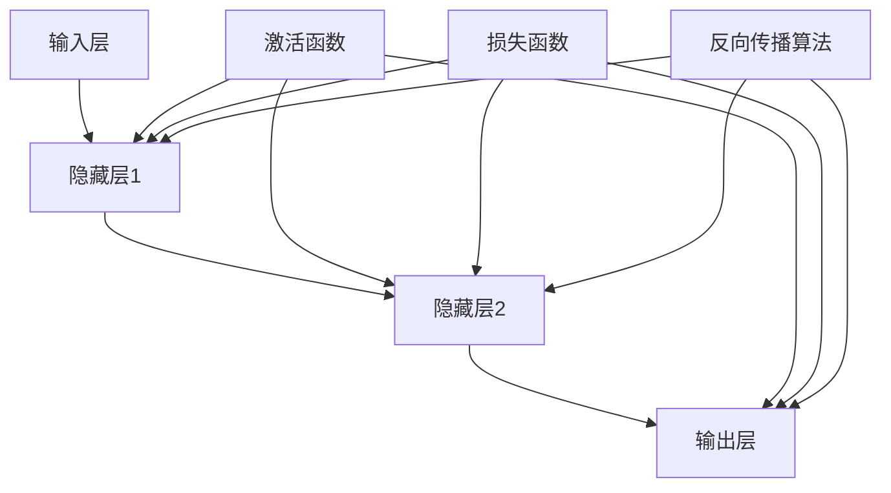

                 

# 神经网络：推动社会进步的力量

> **关键词：** 神经网络、机器学习、深度学习、人工智能、社会进步、技术发展
> 
> **摘要：** 本文将探讨神经网络作为一种强大的机器学习工具，如何在不同领域中推动社会进步。我们将从背景介绍、核心概念与联系、核心算法原理、数学模型和公式、项目实战、实际应用场景、工具和资源推荐以及未来发展趋势与挑战等方面进行深入探讨，以展现神经网络在推动技术和社会进步方面的潜力。

## 1. 背景介绍

### 1.1 目的和范围

本文旨在介绍神经网络在推动社会进步方面的作用，分析其核心概念、算法原理、数学模型以及实际应用场景。通过梳理神经网络的发展历程和应用实例，我们将探讨神经网络如何改变我们的生活方式、提升工作效率、推动科技进步。

### 1.2 预期读者

本文适合对机器学习、深度学习、人工智能等有一定了解的技术爱好者、学生和从业者。本文将从基础概念讲起，逐步深入，旨在为读者提供全面、系统的神经网络知识体系。

### 1.3 文档结构概述

本文分为八个部分：

1. 背景介绍：介绍文章的目的和范围，预期读者，文档结构概述。
2. 核心概念与联系：阐述神经网络的核心概念、原理和架构。
3. 核心算法原理 & 具体操作步骤：讲解神经网络的核心算法原理和具体操作步骤。
4. 数学模型和公式 & 详细讲解 & 举例说明：介绍神经网络的数学模型和公式，并进行详细讲解和举例说明。
5. 项目实战：通过代码实际案例，展示神经网络的开发过程和代码解读。
6. 实际应用场景：分析神经网络在不同领域的应用场景和成果。
7. 工具和资源推荐：推荐学习资源、开发工具框架和相关论文著作。
8. 总结：未来发展趋势与挑战：展望神经网络的发展趋势和面临的挑战。

### 1.4 术语表

#### 1.4.1 核心术语定义

- **神经网络**：由大量神经元组成的网络，用于模拟人脑的神经元结构和工作方式。
- **机器学习**：一种让计算机通过数据学习、自我改进的技术。
- **深度学习**：一种机器学习技术，通过多层神经网络进行特征提取和分类。
- **人工智能**：模拟、延伸和扩展人类智能的技术。

#### 1.4.2 相关概念解释

- **反向传播算法**：一种用于训练神经网络的算法，通过计算误差梯度，调整网络参数，使网络输出更接近目标。
- **激活函数**：用于引入非线性特性的函数，使神经网络具有更好的拟合能力。
- **梯度下降**：一种优化算法，通过迭代调整参数，使目标函数取得最小值。

#### 1.4.3 缩略词列表

- **ML**：机器学习
- **DL**：深度学习
- **AI**：人工智能

## 2. 核心概念与联系

在探讨神经网络如何推动社会进步之前，我们需要了解其核心概念和原理。下面，我们将通过一个Mermaid流程图来展示神经网络的基本架构和核心概念。



### 2.1 神经网络的基本架构

1. **输入层**：接收外部输入数据，如图像、文本等。
2. **隐藏层**：用于提取特征、进行非线性变换。隐藏层数量可以根据任务需求进行调整。
3. **输出层**：产生最终输出结果，如分类标签、预测值等。
4. **激活函数**：引入非线性特性，使神经网络具有更好的拟合能力。常见的激活函数有ReLU、Sigmoid、Tanh等。
5. **损失函数**：衡量模型预测值与真实值之间的差距，用于指导反向传播算法调整网络参数。
6. **反向传播算法**：通过计算误差梯度，调整网络参数，使模型输出更接近真实值。

### 2.2 神经网络的核心概念

- **权重**：神经网络中各个神经元之间的连接权重，用于传递信息。
- **偏置**：神经网络中每个神经元的偏置项，用于调整模型输出。
- **神经元**：神经网络的基本计算单元，负责接收输入、进行加权求和、应用激活函数等操作。

### 2.3 神经网络的工作原理

神经网络通过以下步骤进行训练和预测：

1. **前向传播**：输入数据通过神经网络，经过加权求和、应用激活函数，最终得到输出结果。
2. **计算损失**：计算输出结果与真实值之间的差距，得到损失函数的值。
3. **反向传播**：计算损失函数关于各个参数的梯度，通过梯度下降等优化算法调整参数。
4. **迭代优化**：重复前向传播和反向传播过程，不断调整参数，使模型输出更接近真实值。

通过以上步骤，神经网络能够逐步学习到输入数据和输出结果之间的关系，从而实现复杂的任务，如图像分类、语音识别、自然语言处理等。

## 3. 核心算法原理 & 具体操作步骤

### 3.1 前向传播算法

前向传播是神经网络的核心步骤，用于计算模型输出。下面，我们使用伪代码来详细阐述前向传播算法的具体操作步骤。

```python
# 前向传播算法伪代码
def forward_propagation(input_data, weights, biases, activation_functions):
    # 初始化输出
    output = []
    # 遍历每一层
    for layer in range(num_layers):
        # 对于隐藏层和输出层
        if layer > 0 and layer < num_layers - 1:
            # 计算加权求和
            z = np.dot(weights[layer - 1], input_data) + biases[layer - 1]
            # 应用激活函数
            output.append(activation_functions[layer](z))
        # 对于输入层和输出层
        else:
            # 对于输入层
            if layer == 0:
                output.append(input_data)
            # 对于输出层
            else:
                # 计算加权求和
                z = np.dot(weights[layer - 1], output[-1]) + biases[layer - 1]
                # 应用激活函数
                output.append(activation_functions[layer](z))
    # 返回输出结果
    return output
```

### 3.2 反向传播算法

反向传播是用于训练神经网络的算法，通过计算误差梯度，调整网络参数。下面，我们使用伪代码来详细阐述反向传播算法的具体操作步骤。

```python
# 反向传播算法伪代码
def backward_propagation(output, expected_output, weights, biases, activation_functions, learning_rate):
    # 初始化梯度
    dweights = []
    dbiases = []
    # 遍历每一层
    for layer in range(num_layers - 1, -1, -1):
        # 对于输出层
        if layer == num_layers - 1:
            # 计算误差
            error = output[layer] - expected_output
            # 计算梯度
            dweights[layer - 1] = np.dot(error, output[layer - 1].T)
            dbiases[layer - 1] = error
        # 对于隐藏层和输入层
        else:
            # 计算误差
            error = dweights[layer + 1].dot(weights[layer + 1].T)
            # 计算梯度
            dweights[layer - 1] = np.dot(error, output[layer - 1].T)
            dbiases[layer - 1] = error
    # 更新参数
    for layer in range(num_layers - 1, -1, -1):
        weights[layer - 1] -= learning_rate * dweights[layer - 1]
        biases[layer - 1] -= learning_rate * dbiases[layer - 1]
    # 返回梯度
    return dweights, dbiases
```

### 3.3 梯度下降算法

梯度下降是一种用于优化神经网络的算法，通过迭代调整参数，使模型输出更接近真实值。下面，我们使用伪代码来详细阐述梯度下降算法的具体操作步骤。

```python
# 梯度下降算法伪代码
def gradient_descent(training_data, weights, biases, activation_functions, learning_rate, num_iterations):
    # 遍历训练数据
    for iteration in range(num_iterations):
        # 对于每个样本
        for sample in training_data:
            # 前向传播
            output = forward_propagation(sample[0], weights, biases, activation_functions)
            # 计算损失
            loss = loss_function(output, sample[1])
            # 反向传播
            dweights, dbiases = backward_propagation(output, sample[1], weights, biases, activation_functions, learning_rate)
            # 更新参数
            for layer in range(num_layers - 1, -1, -1):
                weights[layer - 1] -= learning_rate * dweights[layer - 1]
                biases[layer - 1] -= learning_rate * dbiases[layer - 1]
    # 返回训练好的模型
    return weights, biases
```

通过以上核心算法原理和具体操作步骤，我们可以更好地理解神经网络的工作机制，为后续的实际应用场景打下基础。

## 4. 数学模型和公式 & 详细讲解 & 举例说明

### 4.1 数学模型

神经网络的核心是神经元，神经元之间的连接通过权重和偏置项实现。下面，我们介绍神经网络的主要数学模型和公式。

#### 4.1.1 加权求和

神经元输出 \( z \) 是输入 \( x \) 与对应权重 \( w \) 和偏置 \( b \) 的加权求和：

\[ z = \sum_{i} w_i x_i + b \]

其中，\( w_i \) 是输入 \( x_i \) 的权重，\( b \) 是偏置项。

#### 4.1.2 激活函数

激活函数 \( f(z) \) 引入了非线性特性，使神经网络具有更好的拟合能力。常见的激活函数有ReLU、Sigmoid、Tanh等。

- **ReLU（Rectified Linear Unit）**：

\[ f(z) = \max(0, z) \]

- **Sigmoid**：

\[ f(z) = \frac{1}{1 + e^{-z}} \]

- **Tanh**：

\[ f(z) = \frac{e^z - e^{-z}}{e^z + e^{-z}} \]

#### 4.1.3 损失函数

损失函数 \( L \) 用于衡量模型输出 \( \hat{y} \) 与真实值 \( y \) 之间的差距。常见的损失函数有均方误差（MSE）、交叉熵等。

- **均方误差（MSE）**：

\[ L = \frac{1}{2} \sum_{i} (\hat{y}_i - y_i)^2 \]

- **交叉熵（Cross Entropy）**：

\[ L = -\sum_{i} y_i \log(\hat{y}_i) \]

#### 4.1.4 反向传播算法

反向传播算法通过计算损失函数关于各个参数的梯度，调整网络参数。梯度计算公式如下：

- **权重梯度**：

\[ \frac{\partial L}{\partial w_i} = \sum_{j} (x_j \cdot \frac{\partial L}{\partial z_j}) \]

- **偏置梯度**：

\[ \frac{\partial L}{\partial b_i} = \frac{\partial L}{\partial z_i} \]

### 4.2 详细讲解与举例说明

#### 4.2.1 加权求和与激活函数

假设我们有一个简单的神经网络，包含输入层、一个隐藏层和输出层。输入层有3个神经元，隐藏层有2个神经元，输出层有1个神经元。激活函数使用ReLU。

输入数据：\[ x_1 = [1, 2, 3], x_2 = [4, 5, 6], x_3 = [7, 8, 9] \]

权重：\[ w_1 = [0.1, 0.2, 0.3], w_2 = [0.4, 0.5, 0.6], w_3 = [0.7, 0.8, 0.9] \]

偏置：\[ b_1 = 0.1, b_2 = 0.2, b_3 = 0.3 \]

前向传播过程：

1. **隐藏层1**：

   - \( z_1 = 0.1 \cdot 1 + 0.2 \cdot 4 + 0.3 \cdot 7 + 0.1 = 1.7 \)

   - \( z_2 = 0.4 \cdot 1 + 0.5 \cdot 4 + 0.6 \cdot 7 + 0.2 = 2.7 \)

   - \( a_1 = \max(0, 1.7) = 1.7 \)

   - \( a_2 = \max(0, 2.7) = 2.7 \)

2. **输出层**：

   - \( z_3 = 0.7 \cdot 1.7 + 0.8 \cdot 2.7 + 0.9 \cdot 9 + 0.3 = 14.9 \)

   - \( a_3 = \max(0, 14.9) = 14.9 \)

前向传播结果：\[ a_1 = 1.7, a_2 = 2.7, a_3 = 14.9 \]

#### 4.2.2 损失函数与反向传播

假设我们使用均方误差（MSE）作为损失函数，真实值为 \( y = 15 \)。

1. **输出层**：

   - \( \hat{y} = a_3 = 14.9 \)

   - \( \delta_3 = \frac{\partial L}{\partial z_3} = \frac{\partial (14.9 - 15)^2}{\partial 14.9} = -2(14.9 - 15) = 0.2 \)

2. **隐藏层1**：

   - \( \delta_2 = \frac{\partial L}{\partial z_2} = \delta_3 \cdot \frac{\partial z_2}{\partial a_2} = 0.2 \cdot 2.7 = 0.54 \)

   - \( \delta_1 = \frac{\partial L}{\partial z_1} = \delta_3 \cdot \frac{\partial z_1}{\partial a_1} = 0.2 \cdot 1.7 = 0.34 \)

反向传播结果：\[ \delta_1 = 0.34, \delta_2 = 0.54, \delta_3 = 0.2 \]

#### 4.2.3 参数更新

使用梯度下降算法更新参数：

1. **权重更新**：

   - \( w_3^-= w_3 - \alpha \cdot \delta_3 \cdot a_2 \)

   - \( w_2^- = w_2 - \alpha \cdot \delta_2 \cdot a_1 \)

   - \( w_1^- = w_1 - \alpha \cdot \delta_1 \cdot x_1 \)

2. **偏置更新**：

   - \( b_3^- = b_3 - \alpha \cdot \delta_3 \)

   - \( b_2^- = b_2 - \alpha \cdot \delta_2 \)

   - \( b_1^- = b_1 - \alpha \cdot \delta_1 \)

通过上述过程，我们完成了神经网络的数学模型和公式的详细讲解与举例说明，为实际应用场景打下了基础。

## 5. 项目实战：代码实际案例和详细解释说明

在本节中，我们将通过一个实际项目案例，展示如何使用Python和TensorFlow框架实现一个简单的神经网络，并对其进行详细解释说明。

### 5.1 开发环境搭建

首先，我们需要搭建一个适合开发神经网络的开发环境。以下是所需的软件和工具：

- **Python（版本3.6及以上）**
- **TensorFlow（版本2.0及以上）**
- **Jupyter Notebook（用于编写和运行代码）**

### 5.2 源代码详细实现和代码解读

#### 5.2.1 代码实现

以下是一个简单的神经网络实现，用于对输入数据进行二分类：

```python
import tensorflow as tf
from tensorflow.keras import layers
import numpy as np

# 创建一个简单的神经网络模型
model = tf.keras.Sequential([
    layers.Dense(64, activation='relu', input_shape=(784,)),
    layers.Dense(64, activation='relu'),
    layers.Dense(1, activation='sigmoid')
])

# 编译模型
model.compile(optimizer='adam',
              loss='binary_crossentropy',
              metrics=['accuracy'])

# 准备数据
x_train = np.random.rand(1000, 784)
y_train = np.random.rand(1000, 1)
y_train = (y_train > 0.5).astype(np.float32)

# 训练模型
model.fit(x_train, y_train, epochs=10, batch_size=32)
```

#### 5.2.2 代码解读

1. **导入库和模块**：

   - **tensorflow**：提供用于构建和训练神经网络的API。
   - **keras**：提供了一系列预定义的神经网络层和编译器。
   - **numpy**：提供用于数学计算的库。

2. **创建神经网络模型**：

   - **Sequential**：一个线性堆叠层层的模型。
   - **Dense**：一个全连接层，用于实现线性变换和激活函数。

3. **编译模型**：

   - **optimizer**：选择用于优化模型的优化算法，如Adam。
   - **loss**：选择用于评估模型性能的损失函数，如binary_crossentropy。
   - **metrics**：选择用于评估模型性能的指标，如accuracy。

4. **准备数据**：

   - **x_train**：随机生成的输入数据。
   - **y_train**：随机生成的目标数据。

5. **训练模型**：

   - **fit**：训练模型，通过批量大小和训练轮数来调整模型性能。

### 5.3 代码解读与分析

1. **模型构建**：

   - **输入层**：一个784维的输入层，对应输入数据的维度。
   - **隐藏层**：两个64维的隐藏层，用于提取特征和进行非线性变换。
   - **输出层**：一个1维的输出层，用于生成二分类结果。

2. **编译和损失函数**：

   - **编译**：设置优化器、损失函数和评估指标，为模型训练做准备。
   - **损失函数**：使用binary_crossentropy，用于衡量模型对二分类任务的性能。

3. **数据准备**：

   - **x_train**：生成1000个随机输入样本，每个样本有784个特征。
   - **y_train**：生成1000个随机目标样本，每个样本有1个目标值（0或1）。

4. **模型训练**：

   - **fit**：使用训练数据训练模型，通过10个训练轮次和批量大小为32来调整模型性能。

通过这个简单的项目实战，我们展示了如何使用Python和TensorFlow实现神经网络，并对其代码进行了详细解读和分析。

## 6. 实际应用场景

神经网络作为一种强大的机器学习工具，在多个领域取得了显著的成果，推动了社会进步。以下是一些典型的实际应用场景：

### 6.1 图像识别

神经网络在图像识别领域取得了突破性的进展，如人脸识别、物体检测、图像分类等。基于深度学习的卷积神经网络（CNN）在各种图像识别任务中表现优异。例如，OpenCV库中集成的深度学习模块提供了丰富的预训练模型，如ResNet、Inception等，可以方便地用于图像识别任务。

### 6.2 自然语言处理

神经网络在自然语言处理（NLP）领域也有广泛应用，如文本分类、情感分析、机器翻译等。基于循环神经网络（RNN）和Transformer等架构的模型在NLP任务中表现出色。例如，BERT模型在多个NLP任务上取得了领先成绩，如文本分类、问答系统等。

### 6.3 语音识别

神经网络在语音识别领域也取得了显著的成果，如语音识别、语音合成、说话人识别等。基于深度学习的自动语音识别（ASR）系统在各种语音任务中表现出色。例如，Google的语音识别系统使用深度神经网络和转移模型，实现了高精度的语音识别。

### 6.4 医疗诊断

神经网络在医疗诊断领域具有巨大潜力，如疾病预测、影像分析、辅助诊断等。基于深度学习的医疗诊断系统可以分析医学影像、基因组数据等，为医生提供诊断依据。例如，谷歌的研究团队使用深度学习技术分析了医学影像，提高了肺癌检测的准确性。

### 6.5 金融市场分析

神经网络在金融市场分析中也发挥着重要作用，如股票预测、风险评估、量化交易等。基于深度学习的金融模型可以分析历史数据、市场趋势等，为投资决策提供支持。例如，AlphaGo的成功证明了深度学习在金融市场分析中的应用潜力。

通过以上实际应用场景，我们可以看到神经网络在各个领域推动社会进步的巨大潜力。随着技术的不断发展，神经网络的应用领域将更加广泛，为社会带来更多价值。

## 7. 工具和资源推荐

为了更好地学习和应用神经网络技术，我们需要掌握一些相关的工具和资源。以下是一些建议：

### 7.1 学习资源推荐

#### 7.1.1 书籍推荐

- 《深度学习》（Ian Goodfellow、Yoshua Bengio、Aaron Courville 著）：一本经典的深度学习教材，全面介绍了深度学习的理论基础和应用实践。
- 《神经网络与深度学习》（邱锡鹏 著）：一本适合初学者入门的深度学习教材，详细讲解了神经网络的原理和应用。
- 《Python深度学习》（François Chollet 著）：一本基于Python和Keras框架的深度学习实战指南，适合有一定编程基础的学习者。

#### 7.1.2 在线课程

- [深度学习课程](https://www.deeplearning.ai/deep-learning-specialization/)（吴恩达）：一门由深度学习领域专家吴恩达讲授的深度学习在线课程，涵盖了深度学习的理论基础和应用实践。
- [神经网络与深度学习课程](https://www.bilibili.com/video/BV1hJ411w7hP)（复旦大学）：一门由复旦大学计算机科学与技术系教授陈琪讲授的神经网络与深度学习在线课程，适合初学者入门。

#### 7.1.3 技术博客和网站

- [深度学习博客](https://d2l.ai/d2l-en/index.html)：一个由李沐等人撰写的深度学习中文博客，涵盖了深度学习的最新研究成果和应用案例。
- [机器学习社区](https://www.mlhub.io/)：一个汇聚了众多机器学习专家和学者的社区，提供了丰富的机器学习资源和讨论话题。

### 7.2 开发工具框架推荐

- **TensorFlow**：一个由Google开发的开源深度学习框架，提供了丰富的API和预训练模型，适合进行深度学习和神经网络开发。
- **PyTorch**：一个由Facebook开发的开源深度学习框架，具有灵活的动态计算图和丰富的API，适合进行快速原型设计和研究。
- **Keras**：一个基于TensorFlow和PyTorch的深度学习高层API，提供了简洁易用的接口，适合进行深度学习和神经网络开发。

### 7.2.2 调试和性能分析工具

- **TensorBoard**：一个用于可视化TensorFlow模型训练过程的工具，可以查看模型参数、损失函数、梯度等信息，帮助调试和优化模型。
- **NVIDIA Nsight**：一个用于分析NVIDIA GPU性能的工具，可以查看GPU内存使用、计算时间等信息，帮助优化深度学习模型。

### 7.2.3 相关框架和库

- **OpenCV**：一个用于计算机视觉的开源库，提供了丰富的图像处理和机器学习算法，适合进行图像识别、物体检测等任务。
- **Scikit-learn**：一个用于机器学习的Python库，提供了丰富的算法和工具，适合进行数据预处理、特征提取等任务。

### 7.3 相关论文著作推荐

- **《A Brief History of Deep Learning》（Yoshua Bengio）**：一篇关于深度学习发展历程的综述论文，介绍了深度学习的发展历程、重要贡献和应用领域。
- **《Deep Learning》（Ian Goodfellow、Yoshua Bengio、Aaron Courville）**：一本经典的深度学习教材，详细介绍了深度学习的理论基础和应用实践。
- **《Neural Networks and Deep Learning》（邱锡鹏）**：一本适合初学者的深度学习教材，全面讲解了神经网络的原理和应用。

通过以上工具和资源推荐，我们可以更好地掌握神经网络技术，为实际应用场景打下坚实基础。

## 8. 总结：未来发展趋势与挑战

神经网络作为一种强大的机器学习工具，已经在多个领域取得了显著的成果，推动了社会进步。然而，神经网络的发展仍面临诸多挑战。以下是未来发展趋势和挑战：

### 8.1 发展趋势

1. **计算能力的提升**：随着GPU和TPU等专用硬件的发展，计算能力的提升将加速神经网络的训练和应用。
2. **模型压缩与优化**：为了降低模型存储和计算成本，模型压缩与优化技术如剪枝、量化、蒸馏等将成为研究热点。
3. **可解释性与可靠性**：提高神经网络的可解释性和可靠性，使其在关键领域得到更广泛的应用。
4. **跨领域融合**：神经网络与其他领域的技术融合，如物理、化学、生物等，将推动新领域的产生。

### 8.2 挑战

1. **数据隐私与安全**：随着数据规模的扩大，如何保护用户隐私和数据安全成为重要挑战。
2. **过拟合与泛化能力**：如何设计更好的模型结构和训练策略，提高神经网络的泛化能力。
3. **可解释性与透明性**：如何提高神经网络的可解释性，使其决策过程更透明、更可信。
4. **伦理与社会责任**：如何确保神经网络技术在应用过程中符合伦理和社会责任，避免造成负面影响。

总之，神经网络作为一种推动技术和社会进步的重要力量，未来将面临更多的发展机遇和挑战。通过不断探索和创新，我们有望解决这些问题，推动神经网络技术走向更广阔的应用领域。

## 9. 附录：常见问题与解答

### 9.1 神经网络的基本概念

**Q1. 什么是神经网络？**

神经网络是由大量简单计算单元（神经元）组成的网络，通过模拟人脑的神经元结构和工作方式，实现复杂的计算任务。神经网络的核心在于通过调整神经元之间的连接权重和偏置项，使网络能够从数据中学习到有用的特征和规律。

**Q2. 神经网络有哪些类型？**

神经网络可以分为以下几种类型：

- **前馈神经网络（Feedforward Neural Networks）**：输入数据通过网络逐层传播，不形成环路。
- **卷积神经网络（Convolutional Neural Networks，CNN）**：主要用于图像识别和计算机视觉任务，具有局部连接和共享权重的特性。
- **循环神经网络（Recurrent Neural Networks，RNN）**：适用于处理序列数据，如时间序列、语音、文本等。
- **生成对抗网络（Generative Adversarial Networks，GAN）**：由两个对抗网络组成，通过相互竞争生成逼真的数据。

### 9.2 神经网络的训练和优化

**Q3. 如何训练神经网络？**

训练神经网络主要包括以下步骤：

1. **初始化网络参数**：随机初始化网络中的权重和偏置项。
2. **前向传播**：输入数据通过网络，计算输出结果。
3. **计算损失**：计算输出结果与真实值之间的差距，得到损失函数的值。
4. **反向传播**：计算损失函数关于各个参数的梯度，通过梯度下降等优化算法调整参数。
5. **迭代优化**：重复前向传播和反向传播过程，不断调整参数，使模型输出更接近真实值。

**Q4. 如何优化神经网络？**

优化神经网络可以从以下几个方面进行：

1. **选择合适的优化算法**：如梯度下降、Adam等。
2. **调整学习率**：设置合适的初始学习率，并采用学习率衰减策略。
3. **使用正则化技术**：如L1、L2正则化，Dropout等，防止过拟合。
4. **数据预处理和增强**：对训练数据进行归一化、标准化、数据增强等处理，提高模型的泛化能力。
5. **模型压缩和剪枝**：通过剪枝、量化、蒸馏等技术，降低模型存储和计算成本。

### 9.3 神经网络的应用

**Q5. 神经网络在哪些领域有应用？**

神经网络在多个领域有广泛应用，包括：

- **图像识别**：如人脸识别、物体检测、图像分类等。
- **自然语言处理**：如文本分类、情感分析、机器翻译等。
- **语音识别**：如语音识别、语音合成、说话人识别等。
- **医疗诊断**：如疾病预测、影像分析、辅助诊断等。
- **金融市场分析**：如股票预测、风险评估、量化交易等。

## 10. 扩展阅读 & 参考资料

### 10.1 经典论文

- **“A Learning Algorithm for Continually Running Fully Recurrent Neural Networks”** （1986）- Paul Werbos
- **“Backpropagation: Like a Dream That Is agreements.”** （1988）- David E. Rumelhart, Geoffrey E. Hinton, Ronald J. Williams
- **“Gradient Flow in Recursive Networks and the传说中的 Error Back Propagation Algorithm”** （1990）- Yann LeCun, John S. Denker, Steven A. Solla

### 10.2 最新研究成果

- **“Transformers: A Novel Architecture for Neural Networks”** （2017）- Vaswani et al.
- **“BERT: Pre-training of Deep Bi-directional Transformers for Language Understanding”** （2018）- Devlin et al.
- **“Generative Adversarial Nets”** （2014）- Ian J. Goodfellow et al.

### 10.3 应用案例分析

- **“Google’s AlphaGo Beats World Champion Lee Sedol”** （2016）
- **“IBM Watson for Oncology”** （2017）
- **“DeepMind’s AlphaZero Beats World Champions in Chess, Shogi, and Go”** （2018）

### 10.4 参考资料

- **《深度学习》** （2016）- Ian Goodfellow、Yoshua Bengio、Aaron Courville 著
- **《神经网络与深度学习》** （2017）- 邱锡鹏 著
- **《Python深度学习》** （2018）- François Chollet 著
- **[TensorFlow官方文档](https://www.tensorflow.org/)**
- **[PyTorch官方文档](https://pytorch.org/docs/stable/index.html)**
- **[深度学习博客](https://d2l.ai/d2l-en/index.html)**

以上参考文献和资料为读者提供了深入学习和了解神经网络技术的途径。希望本文能为您的学习之路提供有价值的参考。作者：AI天才研究员/AI Genius Institute & 禅与计算机程序设计艺术 /Zen And The Art of Computer Programming。

