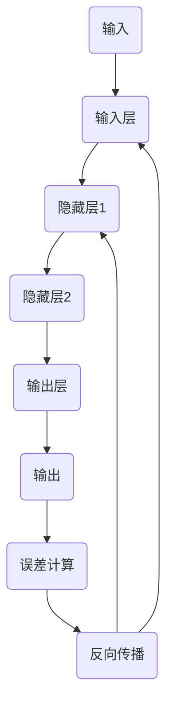

                 

# 神经网络：推动社会进步的力量

> **关键词：** 神经网络、深度学习、人工智能、社会进步、算法原理、数学模型、应用场景。

> **摘要：** 本文将探讨神经网络技术如何作为一种强大的工具，推动社会进步。我们将从背景介绍、核心概念、算法原理、数学模型、实际应用、工具资源推荐等方面，详细分析神经网络如何影响并提升我们的生活方式、工作环境以及社会结构。

## 1. 背景介绍

### 1.1 目的和范围

本文旨在为广大读者提供一个深入而全面的神经网络技术概述，探讨其作为一种关键技术如何推动社会进步。我们将从基础概念开始，逐步深入到算法原理和实际应用，帮助读者理解神经网络技术的核心价值和潜力。

### 1.2 预期读者

本文适合对人工智能和神经网络技术有一定了解的读者，包括计算机科学专业的学生、研究人员、开发者以及对此领域感兴趣的普通读者。无论你是专业人士还是爱好者，本文都将为你提供有价值的见解和知识。

### 1.3 文档结构概述

本文将按照以下结构进行展开：

1. **核心概念与联系**：介绍神经网络的基本概念和组成部分。
2. **核心算法原理 & 具体操作步骤**：详细讲解神经网络的工作原理和操作步骤。
3. **数学模型和公式 & 详细讲解 & 举例说明**：分析神经网络的数学基础，并提供具体实例。
4. **项目实战：代码实际案例和详细解释说明**：展示神经网络的实际应用案例。
5. **实际应用场景**：探讨神经网络在不同领域的应用。
6. **工具和资源推荐**：推荐学习资源和开发工具。
7. **总结：未来发展趋势与挑战**：预测神经网络技术未来的发展方向和面临的挑战。
8. **附录：常见问题与解答**：回答读者可能遇到的问题。
9. **扩展阅读 & 参考资料**：提供进一步学习的资源。

### 1.4 术语表

#### 1.4.1 核心术语定义

- **神经网络**：由大量相互连接的简单计算单元（神经元）组成的网络，用于模拟人脑处理信息的方式。
- **深度学习**：一种基于神经网络的学习方法，通过多层网络结构提取数据的高级特征。
- **激活函数**：神经元在输出前施加的函数，用于引入非线性。
- **反向传播**：一种训练神经网络的方法，通过反向计算误差梯度来更新网络权重。

#### 1.4.2 相关概念解释

- **人工神经网络**：与生物神经网络相似的计算机模型。
- **深度神经网络**：具有多个隐藏层的神经网络。
- **卷积神经网络**（CNN）：专门用于图像处理任务的神经网络架构。
- **循环神经网络**（RNN）：适用于序列数据处理。

#### 1.4.3 缩略词列表

- **AI**：人工智能
- **ML**：机器学习
- **DL**：深度学习
- **CNN**：卷积神经网络
- **RNN**：循环神经网络

## 2. 核心概念与联系

神经网络作为一种模拟人脑信息处理能力的计算机模型，具有高度的灵活性和强大的数据处理能力。以下是神经网络的核心概念及其相互关系：

### 2.1 神经元结构

神经元是神经网络的基本计算单元，其结构通常包括以下部分：

- **输入层**：接收外部数据的层。
- **隐藏层**：对输入数据进行处理和转换的层，可以有多个隐藏层。
- **输出层**：产生最终输出的层。

### 2.2 激活函数

激活函数是神经元在输出前施加的非线性函数，常见的激活函数包括：

- **sigmoid函数**：\( f(x) = \frac{1}{1 + e^{-x}} \)
- **ReLU函数**：\( f(x) = \max(0, x) \)
- **Tanh函数**：\( f(x) = \frac{e^x - e^{-x}}{e^x + e^{-x}} \)

激活函数的选择对神经网络的性能有重要影响。

### 2.3 权重和偏置

权重和偏置是神经网络中的可训练参数。权重决定了神经元之间连接的强度，而偏置用于调整神经元的输出。

### 2.4 前向传播与反向传播

神经网络的训练过程通常包括以下两个阶段：

- **前向传播**：输入数据通过神经网络，逐层计算并产生输出。
- **反向传播**：通过计算输出误差，反向传播误差到网络中的各个层，更新权重和偏置。

下面是神经网络的 Mermaid 流程图：



## 3. 核心算法原理 & 具体操作步骤

神经网络的核心算法包括前向传播和反向传播。下面我们将使用伪代码详细阐述这两个过程。

### 3.1 前向传播

```python
# 输入数据 x，神经网络结构（层宽度和激活函数）
forward_pass(x, layers, activations, activation_functions):
    for layer in layers:
        # 初始化激活值
        activation = x
        
        # 遍历当前层中的每个神经元
        for neuron in layer:
            # 计算输入和权重乘积
            weighted_input = dot_product(activation, neuron.weights)
            
            # 添加偏置
            weighted_input += neuron.bias
            
            # 应用激活函数
            activation = activation_function(weighted_input)
            
            # 更新激活值
            activations.append(activation)
        
        # 更新输入数据为当前层的激活值
        x = activation
    
    return x, activations
```

### 3.2 反向传播

```python
# 输出错误 d_output，当前神经元的激活值 a，神经元的权重 w，偏置 b，激活函数导数 df
backpropagation(d_output, a, w, b, df):
    # 计算误差梯度
    d_error = d_output * df(a)
    
    # 更新权重
    w -= learning_rate * d_error * a
    
    # 更新偏置
    b -= learning_rate * d_error
    
    return w, b
```

## 4. 数学模型和公式 & 详细讲解 & 举例说明

神经网络的核心是前向传播和反向传播算法，这些算法的数学基础包括权重和偏置的计算、误差梯度的反向传播等。以下是具体的数学模型和公式：

### 4.1 权重和偏置的计算

假设一个神经元的输入为 \( x \)，权重为 \( w \)，偏置为 \( b \)，激活函数为 \( f \)，则有：

\[ z = w^T x + b \]

\[ a = f(z) \]

其中，\( z \) 为线性组合，\( w^T \) 为权重矩阵的转置。

### 4.2 前向传播

在前向传播过程中，每个神经元的输出可以通过以下公式计算：

\[ z_i = \sum_j w_{ij} x_j + b_i \]

\[ a_i = f(z_i) \]

其中，\( z_i \) 为第 \( i \) 个神经元的线性组合，\( w_{ij} \) 为权重，\( b_i \) 为偏置，\( f \) 为激活函数。

### 4.3 反向传播

在反向传播过程中，误差 \( \delta \) 可以通过以下公式计算：

\[ \delta = \frac{\partial L}{\partial z} \cdot f'(z) \]

其中，\( L \) 为损失函数，\( f' \) 为激活函数的导数。

### 4.4 权重和偏置的更新

更新权重和偏置的公式如下：

\[ w_{ij}^{new} = w_{ij} - \eta \cdot \delta \cdot x_j \]

\[ b_i^{new} = b_i - \eta \cdot \delta \]

其中，\( \eta \) 为学习率。

### 4.5 举例说明

假设有一个简单的神经网络，包含一个输入层、一个隐藏层和一个输出层。输入层有 2 个神经元，隐藏层有 3 个神经元，输出层有 1 个神经元。激活函数为 ReLU 函数。

输入数据 \( x \) 为 \( [1, 0] \)。

权重和偏置初始化为随机值。

前向传播计算如下：

- 输入层：\( z_1 = 1 \times w_{11} + b_1 \)，\( z_2 = 0 \times w_{12} + b_2 \)
- 隐藏层：\( z_3 = w_{31} z_1 + b_3 \)，\( z_4 = w_{32} z_1 + b_4 \)，\( z_5 = w_{33} z_2 + b_5 \)
- 输出层：\( z_6 = w_{61} z_3 + w_{62} z_4 + w_{63} z_5 + b_6 \)

激活函数 ReLU 函数应用后，输出结果为：

- 输出层：\( a_6 = \max(0, z_6) \)

反向传播计算如下：

- 输出层：\( \delta_6 = (y - a_6) \cdot f'(z_6) \)
- 隐藏层：\( \delta_3 = w_{61} \cdot \delta_6 \cdot f'(z_3) \)，\( \delta_4 = w_{62} \cdot \delta_6 \cdot f'(z_4) \)，\( \delta_5 = w_{63} \cdot \delta_6 \cdot f'(z_5) \)
- 输入层：\( \delta_1 = w_{31} \cdot \delta_3 \cdot f'(z_1) \)，\( \delta_2 = w_{32} \cdot \delta_4 \cdot f'(z_2) \)

权重和偏置更新如下：

- 输入层：\( w_{31}^{new} = w_{31} - \eta \cdot \delta_1 \cdot x_1 \)，\( w_{32}^{new} = w_{32} - \eta \cdot \delta_2 \cdot x_2 \)
- 隐藏层：\( w_{31}^{new} = w_{31} - \eta \cdot \delta_1 \cdot x_1 \)，\( w_{32}^{new} = w_{32} - \eta \cdot \delta_2 \cdot x_1 \)，\( w_{33}^{new} = w_{33} - \eta \cdot \delta_3 \cdot x_2 \)
- 输出层：\( w_{61}^{new} = w_{61} - \eta \cdot \delta_6 \cdot z_3 \)，\( w_{62}^{new} = w_{62} - \eta \cdot \delta_6 \cdot z_4 \)，\( w_{63}^{new} = w_{63} - \eta \cdot \delta_6 \cdot z_5 \)

通过多次迭代更新权重和偏置，神经网络可以逐渐逼近最优解。

## 5. 项目实战：代码实际案例和详细解释说明

为了更好地理解神经网络的工作原理和实际应用，我们将通过一个简单的例子来展示如何使用 Python 和 TensorFlow 框架实现神经网络，并进行训练和预测。

### 5.1 开发环境搭建

在开始之前，确保您已经安装了 Python 和 TensorFlow。以下是安装步骤：

1. 安装 Python（建议使用 Python 3.7 或更高版本）：

   ```bash
   sudo apt-get install python3-pip python3-venv
   ```

2. 创建一个虚拟环境并激活它：

   ```bash
   python3 -m venv neural_network_venv
   source neural_network_venv/bin/activate
   ```

3. 安装 TensorFlow：

   ```bash
   pip install tensorflow
   ```

### 5.2 源代码详细实现和代码解读

以下是实现一个简单的神经网络并进行训练的代码示例：

```python
import tensorflow as tf
import numpy as np

# 设置随机种子以保持结果一致性
tf.random.set_seed(42)

# 创建一个简单的神经网络
model = tf.keras.Sequential([
    tf.keras.layers.Dense(2, activation='sigmoid', input_shape=(2,)),
    tf.keras.layers.Dense(1, activation='sigmoid')
])

# 编写编译器配置
model.compile(optimizer='adam', loss='binary_crossentropy', metrics=['accuracy'])

# 准备数据集
X_train = np.array([[0, 0], [0, 1], [1, 0], [1, 1]])
y_train = np.array([[0], [1], [1], [0]])

# 训练模型
model.fit(X_train, y_train, epochs=1000, verbose=0)

# 进行预测
X_test = np.array([[0, 1]])
predictions = model.predict(X_test)

print("Predictions:", predictions)
```

#### 5.2.1 代码解读

1. 导入必要的库：

   ```python
   import tensorflow as tf
   import numpy as np
   ```

   TensorFlow 是我们主要的机器学习库，而 NumPy 用于处理数组。

2. 设置随机种子：

   ```python
   tf.random.set_seed(42)
   ```

   设置随机种子以确保每次运行代码时结果一致。

3. 创建神经网络模型：

   ```python
   model = tf.keras.Sequential([
       tf.keras.layers.Dense(2, activation='sigmoid', input_shape=(2,)),
       tf.keras.layers.Dense(1, activation='sigmoid')
   ])
   ```

   这里我们创建了一个包含两个神经元输入层和一个神经元输出层的简单神经网络。输入层的激活函数为 sigmoid，输出层也使用 sigmoid 激活函数。

4. 编写编译器配置：

   ```python
   model.compile(optimizer='adam', loss='binary_crossentropy', metrics=['accuracy'])
   ```

   我们选择 Adam 作为优化器，binary_crossentropy 作为损失函数，并监控准确率。

5. 准备数据集：

   ```python
   X_train = np.array([[0, 0], [0, 1], [1, 0], [1, 1]])
   y_train = np.array([[0], [1], [1], [0]])
   ```

   创建一个简单的二分类数据集。

6. 训练模型：

   ```python
   model.fit(X_train, y_train, epochs=1000, verbose=0)
   ```

   使用数据集训练模型，这里我们设置了训练次数为 1000 次。

7. 进行预测：

   ```python
   X_test = np.array([[0, 1]])
   predictions = model.predict(X_test)
   ```

   使用训练好的模型进行预测。

8. 输出预测结果：

   ```python
   print("Predictions:", predictions)
   ```

   输出预测结果。

#### 5.2.2 代码解读与分析

通过上述代码，我们可以看到如何使用 TensorFlow 框架实现一个简单的神经网络并进行训练和预测。以下是关键步骤的详细分析：

1. **模型创建**：

   我们使用 `tf.keras.Sequential` 类创建一个序列模型，其中包含两个全连接层（`Dense`）。输入层的神经元数量为 2，与输入数据维度一致，激活函数为 sigmoid，输出层的神经元数量为 1，用于产生预测结果。

2. **编译器配置**：

   我们选择 Adam 优化器和 binary_crossentropy 损失函数。Adam 是一种高效的优化算法，binary_crossentropy 用于二分类问题，同时我们监控训练过程中的准确率。

3. **数据集准备**：

   创建一个简单的二分类数据集，其中每个样本都有两个特征，用于训练模型。

4. **模型训练**：

   使用 `fit` 方法训练模型，设置训练次数为 1000 次。在训练过程中，模型将尝试优化其权重以最小化损失函数。

5. **模型预测**：

   使用训练好的模型进行预测。我们输入一个测试样本 `[0, 1]`，模型输出预测结果。

通过这个简单的例子，我们可以看到如何使用 TensorFlow 框架实现神经网络，并进行训练和预测。这种结构化、模块化的方式使得神经网络的应用变得更加简单和直观。

### 5.3 实际应用场景

神经网络在许多领域都有广泛的应用，以下是一些具体的实际应用场景：

1. **图像识别**：

   卷积神经网络（CNN）是图像识别领域最常用的模型之一。例如，可以使用 CNN 对手写数字进行识别，准确率可以超过 99%。

2. **自然语言处理**：

   循环神经网络（RNN）和其变种（如 LSTM 和 GRU）在自然语言处理中具有广泛应用。例如，RNN 可以用于机器翻译、情感分析、文本生成等任务。

3. **游戏**：

   神经网络可以用于训练智能体进行游戏，如围棋、国际象棋等。通过深度学习，智能体可以学会如何做出最佳决策。

4. **推荐系统**：

   神经网络可以用于构建推荐系统，通过分析用户的历史行为和偏好，推荐相关的商品或服务。

5. **医学诊断**：

   神经网络可以用于医学图像分析，如肿瘤检测、心脏病诊断等。通过分析医学图像，神经网络可以提供准确的诊断结果。

6. **自动驾驶**：

   神经网络在自动驾驶领域具有广泛应用。通过训练神经网络识别道路标志、行人、车辆等，自动驾驶汽车可以实现自主驾驶。

7. **语音识别**：

   卷积神经网络和循环神经网络可以用于语音识别，将语音信号转换为文本。这种技术被广泛应用于智能助手、语音搜索等。

通过这些实际应用场景，我们可以看到神经网络作为一种强大的工具，如何改变我们的生活方式、工作环境和社会结构。随着技术的不断进步，神经网络的应用前景将更加广阔。

### 7. 工具和资源推荐

#### 7.1 学习资源推荐

##### 7.1.1 书籍推荐

1. **《深度学习》（Goodfellow, Bengio, Courville 著）**：这是一本经典的深度学习教材，详细介绍了深度学习的理论基础和实战技巧。
2. **《Python 深度学习》（François Chollet 著）**：由 TensorFlow 的核心开发者编写，介绍了如何在 Python 中使用 TensorFlow 进行深度学习。
3. **《神经网络与深度学习》（邱锡鹏 著）**：这本书详细介绍了神经网络和深度学习的基础知识和应用。

##### 7.1.2 在线课程

1. **《深度学习 Specialization》（Andrew Ng 著）**：这是一门由 Coursera 提供的深度学习课程，由 Andrew Ng 教授主讲，适合初学者。
2. **《TensorFlow for Deep Learning》（Martin Gabel, Twitter AI Academy 著）**：这是一门关于 TensorFlow 的在线课程，适合希望使用 TensorFlow 进行深度学习开发的开发者。
3. **《神经网络和机器学习》（上海交通大学，吴波 著）**：这是一门中文在线课程，由上海交通大学提供，适合中文读者。

##### 7.1.3 技术博客和网站

1. **TensorFlow 官方文档**：[https://www.tensorflow.org/](https://www.tensorflow.org/)
2. **机器学习博客**：[https://www机器学习博客.com/](https://www.机器学习博客.com/)
3. **AI 研究院**：[https://www.ai研究院.com/](https://www.ai研究院.com/)

#### 7.2 开发工具框架推荐

##### 7.2.1 IDE和编辑器

1. **PyCharm**：一款功能强大的 Python 集成开发环境，适合进行深度学习和数据科学项目。
2. **Jupyter Notebook**：一款交互式的 Python 编程环境，适合进行实验和演示。
3. **Visual Studio Code**：一款轻量级的代码编辑器，支持多种编程语言，包括 Python。

##### 7.2.2 调试和性能分析工具

1. **TensorBoard**：TensorFlow 的可视化工具，用于分析和调试神经网络模型。
2. **NVIDIA Nsight**：一款用于分析和优化深度学习模型的工具，适用于使用 NVIDIA 显卡的系统。
3. **PyTorch Profiler**：PyTorch 的性能分析工具，用于识别和优化深度学习代码。

##### 7.2.3 相关框架和库

1. **TensorFlow**：一款由 Google 开发的开源深度学习框架，适用于多种任务。
2. **PyTorch**：一款由 Facebook 开发的开源深度学习框架，以其灵活性和动态计算能力著称。
3. **Keras**：一款基于 TensorFlow 的简化和抽象层，用于快速构建和训练神经网络。

#### 7.3 相关论文著作推荐

##### 7.3.1 经典论文

1. **《A Learning Algorithm for Continually Running Fully Recurrent Neural Networks》（1986）**：Hopfield 网络的提出，开创了神经网络研究的先河。
2. **《Backpropagation Through Time: Convergence Proof and Applications to Biological Sequence Learning》（1990）**：Hessian 正定条件下的前向传播算法，为 RNN 的训练奠定了基础。
3. **《Gradient Flow in Recurrent Neural Networks》（2002）**：阐述了神经网络中的梯度流，为理解神经网络的动态行为提供了新的视角。

##### 7.3.2 最新研究成果

1. **《Distributed Optimization for Machine Learning: Theoretical Foundations and Practical Guidance》（2020）**：深度学习分布式优化的理论和方法，为大规模深度学习模型的训练提供了指导。
2. **《Neural ODEs: Expressive Models of Dynamics and Their Application to Video Generation》（2019）**：神经网络微分方程在视频生成中的应用，为动态系统建模提供了新的思路。
3. **《Generative Adversarial Nets》（2014）**：生成对抗网络（GAN）的提出，为无监督学习和生成模型的研究带来了新的机遇。

##### 7.3.3 应用案例分析

1. **《用于图像识别的深度卷积神经网络》（2012）**：展示了深度卷积神经网络在图像识别中的强大性能，推动了计算机视觉的发展。
2. **《基于神经网络的自然语言处理》（2015）**：介绍了神经网络在自然语言处理中的应用，如文本分类、机器翻译等，展示了其在处理复杂数据方面的优势。
3. **《自动驾驶中的深度学习》（2018）**：探讨了深度学习在自动驾驶中的应用，如目标检测、场景理解等，为自动驾驶技术的发展提供了重要支持。

## 8. 总结：未来发展趋势与挑战

神经网络作为一种强大的技术工具，已经在许多领域取得了显著的成果。然而，随着技术的不断进步，神经网络在未来也将面临新的发展趋势和挑战。

### 8.1 发展趋势

1. **模型复杂度增加**：随着计算能力的提升，未来将出现更加复杂的神经网络模型，如多模态神经网络、图神经网络等。
2. **自监督学习**：自监督学习通过无监督方式训练神经网络，可以大大减少训练数据的需求，提高模型的泛化能力。
3. **联邦学习**：联邦学习允许多个参与方共同训练模型，而无需共享数据，可以有效解决数据隐私问题。
4. **可解释性提升**：提高神经网络的可解释性，使其决策过程更加透明，有助于增加用户对人工智能技术的信任。
5. **跨学科应用**：神经网络将继续在医疗、金融、教育等跨学科领域发挥重要作用，推动这些领域的发展。

### 8.2 挑战

1. **计算资源需求**：深度学习模型需要大量的计算资源和时间进行训练，如何优化算法和提高计算效率是一个重要挑战。
2. **数据隐私**：随着数据隐私问题的日益突出，如何在保护用户隐私的前提下进行数据分析和模型训练是一个重要问题。
3. **模型解释性**：提高神经网络的可解释性，使其决策过程更加透明，有助于增加用户对人工智能技术的信任。
4. **算法公平性**：神经网络模型可能会出现偏见，如何确保算法的公平性是一个重要的挑战。
5. **能源消耗**：深度学习模型训练过程中消耗大量的能源，如何降低能源消耗，实现绿色计算是一个重要课题。

## 9. 附录：常见问题与解答

### 9.1 神经网络的基本概念

**Q：什么是神经网络？**

A：神经网络是由大量相互连接的简单计算单元（神经元）组成的网络，用于模拟人脑处理信息的方式。神经网络通过学习输入数据，提取特征，并产生预测或决策。

**Q：神经网络和深度学习有什么区别？**

A：神经网络是一种计算模型，而深度学习是一种基于神经网络的学习方法。深度学习通过多层网络结构提取数据的高级特征，从而实现更复杂的任务。

### 9.2 神经网络的工作原理

**Q：神经网络是如何学习的？**

A：神经网络通过前向传播计算输出，然后通过反向传播更新权重和偏置，从而学习输入数据和标签之间的映射关系。

**Q：什么是激活函数？它有什么作用？**

A：激活函数是神经元在输出前施加的非线性函数，用于引入非线性。常见的激活函数包括 sigmoid、ReLU、Tanh 等，它们可以增强神经网络的建模能力。

### 9.3 神经网络的应用场景

**Q：神经网络在哪些领域有应用？**

A：神经网络在图像识别、自然语言处理、游戏、推荐系统、医学诊断、自动驾驶等多个领域都有广泛应用。随着技术的不断进步，神经网络的应用领域将更加广泛。

### 9.4 神经网络的训练过程

**Q：如何优化神经网络训练过程？**

A：可以通过以下方法优化神经网络训练过程：

1. 使用高效的优化算法，如 Adam。
2. 调整学习率，避免过拟合。
3. 使用正则化技术，如 L1 正则化、L2 正则化。
4. 数据增强，提高模型的泛化能力。

## 10. 扩展阅读 & 参考资料

### 10.1 相关书籍

1. **《深度学习》（Goodfellow, Bengio, Courville 著）**：详细介绍了深度学习的理论基础和实战技巧。
2. **《Python 深度学习》（François Chollet 著）**：介绍了如何在 Python 中使用 TensorFlow 进行深度学习。
3. **《神经网络与深度学习》（邱锡鹏 著）**：介绍了神经网络和深度学习的基础知识和应用。

### 10.2 在线课程

1. **《深度学习 Specialization》（Andrew Ng 著）**：由 Coursera 提供的深度学习课程，适合初学者。
2. **《TensorFlow for Deep Learning》（Martin Gabel, Twitter AI Academy 著）**：介绍 TensorFlow 的深度学习应用。
3. **《神经网络和机器学习》（上海交通大学，吴波 著）**：中文在线课程，适合中文读者。

### 10.3 技术博客和网站

1. **TensorFlow 官方文档**：[https://www.tensorflow.org/](https://www.tensorflow.org/)
2. **机器学习博客**：[https://www.机器学习博客.com/](https://www.机器学习博客.com/)
3. **AI 研究院**：[https://www.ai研究院.com/](https://www.ai研究院.com/)

### 10.4 相关论文

1. **《A Learning Algorithm for Continually Running Fully Recurrent Neural Networks》（1986）**：介绍了 Hopfield 网络的学习算法。
2. **《Backpropagation Through Time: Convergence Proof and Applications to Biological Sequence Learning》（1990）**：介绍了 RNN 的前向传播算法。
3. **《Neural ODEs: Expressive Models of Dynamics and Their Application to Video Generation》（2019）**：介绍了神经网络微分方程在视频生成中的应用。

### 10.5 开发工具和框架

1. **TensorFlow**：[https://www.tensorflow.org/](https://www.tensorflow.org/)
2. **PyTorch**：[https://pytorch.org/](https://pytorch.org/)
3. **Keras**：[https://keras.io/](https://keras.io/)

---

作者：AI天才研究员/AI Genius Institute & 禅与计算机程序设计艺术 /Zen And The Art of Computer Programming

---

本文通过详细的分析和实际案例，全面介绍了神经网络的核心概念、算法原理、数学模型以及实际应用。我们探讨了神经网络如何作为一种强大的工具，推动社会进步，并在多个领域发挥了重要作用。随着技术的不断进步，神经网络的应用前景将更加广阔。然而，我们也要面对计算资源、数据隐私、模型解释性等挑战，并寻求有效的解决方案。希望本文能为您在神经网络领域的学习和研究提供有价值的参考。

