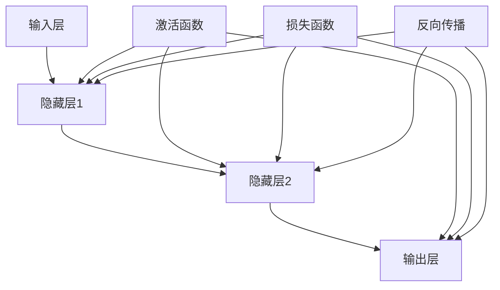

                 

# 神经网络：改变世界的技术

> **关键词**：神经网络、机器学习、深度学习、算法原理、应用场景、未来趋势
> 
> **摘要**：本文将深入探讨神经网络这一革命性技术，从其核心概念、算法原理到实际应用，一一剖析，帮助读者理解神经网络如何成为改变世界的重要力量。

## 1. 背景介绍

### 1.1 目的和范围

本文旨在为读者提供一个全面而深入的神经网络技术指南。我们将从基础知识出发，逐步介绍神经网络的核心概念、算法原理和实际应用。同时，还将探讨神经网络在各个领域的潜力以及未来可能面临的技术挑战。

### 1.2 预期读者

本文适合对神经网络和机器学习有一定了解的读者，特别是希望深入了解神经网络工作原理和技术应用的专业人士。

### 1.3 文档结构概述

本文分为以下几个部分：

1. 背景介绍：介绍本文的目的、预期读者以及文档结构。
2. 核心概念与联系：通过Mermaid流程图展示神经网络的核心概念和架构。
3. 核心算法原理 & 具体操作步骤：详细讲解神经网络算法原理和操作步骤。
4. 数学模型和公式 & 详细讲解 & 举例说明：介绍神经网络的数学模型和公式，并通过实例进行说明。
5. 项目实战：提供实际代码案例，详细解释神经网络在实际项目中的应用。
6. 实际应用场景：探讨神经网络在各个领域的应用。
7. 工具和资源推荐：推荐学习资源和开发工具。
8. 总结：总结神经网络的发展趋势和挑战。
9. 附录：常见问题与解答。
10. 扩展阅读 & 参考资料：提供进一步学习的参考资料。

### 1.4 术语表

#### 1.4.1 核心术语定义

- **神经网络**：一种模拟人脑神经元结构和功能的计算模型。
- **机器学习**：使计算机能够从数据中学习并做出决策或预测的技术。
- **深度学习**：一种特殊的机器学习技术，通过多层神经网络进行数据处理和特征提取。
- **反向传播算法**：用于训练神经网络的一种常用算法，通过计算误差反向传播更新网络权重。

#### 1.4.2 相关概念解释

- **前向传播**：在神经网络中，将输入信号通过网络传递到输出层的计算过程。
- **激活函数**：在神经网络中，用于引入非线性特性的函数。
- **损失函数**：用于衡量预测值与真实值之间差距的函数。

#### 1.4.3 缩略词列表

- **MLP**：多层感知机（Multi-Layer Perceptron）
- **CNN**：卷积神经网络（Convolutional Neural Network）
- **RNN**：循环神经网络（Recurrent Neural Network）
- **GAN**：生成对抗网络（Generative Adversarial Network）

## 2. 核心概念与联系

神经网络的本质是一种计算模型，旨在模拟人脑神经元的工作方式。下面通过一个Mermaid流程图展示神经网络的核心概念和架构：



### 2.1 神经网络的结构

神经网络通常由三个主要部分组成：

- **输入层**：接收外部输入信号，例如图像、文本或声音等。
- **隐藏层**：对输入信号进行预处理和特征提取，多层隐藏层可以实现更复杂的特征表示。
- **输出层**：生成最终预测或决策结果。

每个神经元（节点）在神经网络中都有特定的作用：

- **加权求和**：输入层到隐藏层/输出层的每个连接都附有一个权重，神经元对输入信号进行加权求和。
- **激活函数**：引入非线性特性，使神经网络能够模拟人脑的非线性处理能力。
- **反向传播**：用于训练神经网络的算法，通过计算误差反向传播更新网络权重。

### 2.2 神经网络的优点

- **强大的表示能力**：神经网络可以通过多层结构学习复杂的非线性关系。
- **自适应能力**：神经网络可以通过学习从数据中提取特征，适应不同的应用场景。
- **泛化能力**：神经网络可以应用于各种领域，具有广泛的适用性。

## 3. 核心算法原理 & 具体操作步骤

神经网络的算法原理是其核心，下面我们通过伪代码详细阐述神经网络的工作原理和具体操作步骤。

### 3.1 前向传播

前向传播是神经网络的基础操作，将输入信号通过网络传递到输出层。以下是前向传播的伪代码：

```python
# 输入数据
X = ...

# 初始化网络参数（权重和偏置）
W = ...
b = ...

# 前向传播
Z = X * W + b  # 加权求和
A = activation(Z)  # 激活函数
```

### 3.2 反向传播

反向传播用于更新网络参数，以最小化预测误差。以下是反向传播的伪代码：

```python
# 前向传播得到输出 A
A = ...

# 实际输出标签
y = ...

# 计算误差
error = y - A

# 计算梯度
gradient = - (dA/dZ) * (dZ/dW)

# 更新权重和偏置
W -= learning_rate * gradient
b -= learning_rate * gradient
```

### 3.3 完整的训练过程

完整的训练过程包括初始化网络参数、前向传播、反向传播和优化更新。以下是完整的训练过程的伪代码：

```python
# 初始化网络参数
W = ...
b = ...

# 训练过程
for epoch in range(num_epochs):
    for sample in data:
        # 前向传播
        Z = X * W + b
        A = activation(Z)

        # 计算误差
        error = y - A

        # 计算梯度
        gradient = - (dA/dZ) * (dZ/dW)

        # 更新权重和偏置
        W -= learning_rate * gradient
        b -= learning_rate * gradient

# 完成训练
```

## 4. 数学模型和公式 & 详细讲解 & 举例说明

神经网络的数学模型和公式是其核心，下面我们将详细介绍神经网络的数学模型，并通过具体实例进行说明。

### 4.1 激活函数

激活函数是神经网络中的关键组件，用于引入非线性特性。常见的激活函数包括：

- **Sigmoid 函数**：$$σ(x) = \frac{1}{1 + e^{-x}}$$
- **ReLU 函数**：$$ReLU(x) = \max(0, x)$$
- **Tanh 函数**：$$tanh(x) = \frac{e^{2x} - 1}{e^{2x} + 1}$$

### 4.2 损失函数

损失函数用于衡量预测值与真实值之间的差距。常见的损失函数包括：

- **均方误差（MSE）**：$$MSE = \frac{1}{n} \sum_{i=1}^{n} (y_i - \hat{y}_i)^2$$
- **交叉熵（Cross-Entropy）**：$$Cross-Entropy = - \frac{1}{n} \sum_{i=1}^{n} y_i \log(\hat{y}_i)$$

### 4.3 反向传播算法

反向传播算法是训练神经网络的基石。以下是反向传播算法的详细公式：

$$\frac{dL}{dW} = \sum_{i=1}^{n} \frac{\partial L}{\partial Z_i} \frac{\partial Z_i}{\partial W}$$

$$\frac{dL}{db} = \sum_{i=1}^{n} \frac{\partial L}{\partial Z_i} \frac{\partial Z_i}{\partial b}$$

$$\frac{dL}{dx} = \sum_{i=1}^{n} \frac{\partial L}{\partial Z_i} \frac{\partial Z_i}{\partial x}$$

其中，\(L\) 表示损失函数，\(W\) 和 \(b\) 分别表示权重和偏置，\(x\) 表示输入变量，\(Z\) 表示神经元的输出。

### 4.4 举例说明

假设我们有一个简单的神经网络，包含一个输入层、一个隐藏层和一个输出层。输入层有一个神经元，隐藏层有两个神经元，输出层有一个神经元。输入数据为 \(x = [1, 2]\)，目标输出为 \(y = [3]\)。

#### 4.4.1 初始化参数

初始化权重和偏置：

$$W_1 = [0.1, 0.2]$$

$$b_1 = [0.1, 0.2]$$

$$W_2 = [0.3, 0.4]$$

$$b_2 = [0.3, 0.4]$$

#### 4.4.2 前向传播

前向传播过程如下：

$$Z_1 = x \cdot W_1 + b_1 = [1, 2] \cdot [0.1, 0.2] + [0.1, 0.2] = [0.3, 0.6] + [0.1, 0.2] = [0.4, 0.8]$$

$$A_1 = activation(Z_1) = [0.4, 0.8]$$

$$Z_2 = A_1 \cdot W_2 + b_2 = [0.4, 0.8] \cdot [0.3, 0.4] + [0.3, 0.4] = [0.12, 0.32] + [0.3, 0.4] = [0.42, 0.72]$$

$$A_2 = activation(Z_2) = [0.42, 0.72]$$

预测输出：

$$\hat{y} = A_2 = [0.42, 0.72]$$

#### 4.4.3 反向传播

计算损失：

$$L = MSE(y, \hat{y}) = \frac{1}{2} \sum_{i=1}^{n} (y_i - \hat{y}_i)^2 = \frac{1}{2} (3 - 0.42 - 0.72)^2 = \frac{1}{2} (3 - 1.14)^2 = \frac{1}{2} (1.86)^2 = 1.722$$

计算梯度：

$$\frac{dL}{dZ_2} = \frac{\partial L}{\partial Z_2} = -2(y - \hat{y}) = -2(3 - 0.42 - 0.72) = -2(1.14) = -2.28$$

$$\frac{dL}{dA_2} = \frac{\partial L}{\partial A_2} = -2(y - \hat{y}) = -2(3 - 0.42 - 0.72) = -2(1.14) = -2.28$$

$$\frac{dA_2}{dZ_2} = \frac{\partial A_2}{\partial Z_2} = \frac{dReLU(Z_2)}{dZ_2} = \begin{cases} 1 & \text{if } Z_2 > 0 \\ 0 & \text{otherwise} \end{cases}$$

$$\frac{dZ_2}{dW_2} = \frac{\partial Z_2}{\partial W_2} = A_1$$

$$\frac{dZ_2}{db_2} = \frac{\partial Z_2}{\partial b_2} = 1$$

更新权重和偏置：

$$W_2 -= learning_rate \cdot \frac{dL}{dZ_2} \cdot \frac{dZ_2}{dW_2} = W_2 - 0.01 \cdot -2.28 \cdot A_1 = W_2 + 0.0228 \cdot A_1$$

$$b_2 -= learning_rate \cdot \frac{dL}{dZ_2} \cdot \frac{dZ_2}{db_2} = b_2 - 0.01 \cdot -2.28 \cdot 1 = b_2 + 0.0228$$

重复以上步骤，直到达到预设的损失阈值或达到最大迭代次数。

## 5. 项目实战：代码实际案例和详细解释说明

### 5.1 开发环境搭建

为了实际应用神经网络，我们首先需要搭建一个开发环境。以下是一个简单的Python环境搭建示例：

```shell
# 安装Python（如果未安装）
wget https://www.python.org/ftp/python/3.8.10/Python-3.8.10.tgz
tar xvf Python-3.8.10.tgz
cd Python-3.8.10
./configure
make
sudo make install

# 安装必要的库
pip install numpy
pip install tensorflow
```

### 5.2 源代码详细实现和代码解读

以下是一个简单的神经网络实现，用于手写数字识别（MNIST数据集）：

```python
import tensorflow as tf
import numpy as np

# 设置超参数
learning_rate = 0.001
num_epochs = 10
batch_size = 128

# 加载数据
(x_train, y_train), (x_test, y_test) = tf.keras.datasets.mnist.load_data()
x_train = x_train / 255.0
x_test = x_test / 255.0

# 转换为TensorFlow的张量
x_train = tf.convert_to_tensor(x_train, dtype=tf.float32)
x_test = tf.convert_to_tensor(x_test, dtype=tf.float32)

# 构建模型
model = tf.keras.Sequential([
    tf.keras.layers.Flatten(input_shape=(28, 28)),
    tf.keras.layers.Dense(128, activation='relu'),
    tf.keras.layers.Dense(10, activation='softmax')
])

# 编译模型
model.compile(optimizer=tf.keras.optimizers.Adam(learning_rate),
              loss='sparse_categorical_crossentropy',
              metrics=['accuracy'])

# 训练模型
model.fit(x_train, y_train, batch_size=batch_size, epochs=num_epochs, validation_split=0.1)

# 评估模型
loss, accuracy = model.evaluate(x_test, y_test, verbose=2)
print('Test accuracy:', accuracy)
```

### 5.3 代码解读与分析

上述代码实现了一个简单的神经网络模型，用于手写数字识别。以下是代码的详细解读：

1. **导入库**：首先导入TensorFlow和NumPy库，用于构建和训练神经网络。
2. **设置超参数**：定义学习率、迭代次数和批量大小等超参数。
3. **加载数据**：使用TensorFlow的内置函数加载数据集，并进行归一化处理。
4. **构建模型**：使用TensorFlow的`Sequential`模型构建器创建一个简单的神经网络，包含一个输入层、一个隐藏层和一个输出层。
    - `Flatten`层：将输入图像展开成一个一维数组。
    - `Dense`层：全连接层，用于进行特征提取和预测。
5. **编译模型**：设置优化器、损失函数和评估指标。
6. **训练模型**：使用`fit`函数训练模型，将训练数据输入模型，并在每个迭代周期结束后计算损失和准确率。
7. **评估模型**：使用`evaluate`函数评估模型在测试数据集上的性能。

通过上述代码，我们可以训练一个神经网络模型，用于手写数字识别。这个简单的例子展示了如何使用TensorFlow构建、训练和评估神经网络模型。

## 6. 实际应用场景

神经网络在各个领域都有着广泛的应用，以下是几个典型的应用场景：

### 6.1 人工智能助手

神经网络在人工智能助手中的应用尤为广泛。通过训练神经网络模型，可以实现对自然语言处理、语音识别和图像识别等任务的自动化。例如，智能助手如Siri、Alexa和Google Assistant都是基于神经网络模型实现的，能够理解用户的指令并做出相应的回应。

### 6.2 自动驾驶

自动驾驶技术是神经网络的另一个重要应用领域。通过训练神经网络模型，自动驾驶系统可以实现对周围环境的感知、理解和决策。例如，特斯拉的Autopilot系统和Waymo的自动驾驶汽车都使用了神经网络技术来处理复杂的驾驶场景，提高行驶的安全性和效率。

### 6.3 医疗诊断

神经网络在医疗诊断中也发挥着重要作用。通过训练神经网络模型，可以对医学图像进行自动分析，提高疾病诊断的准确性和效率。例如，使用神经网络技术可以自动识别肺癌、乳腺癌等疾病，辅助医生做出准确的诊断。

### 6.4 金融市场预测

神经网络在金融市场预测中也具有广泛的应用。通过训练神经网络模型，可以分析大量的历史数据，预测股票价格、市场走势等。例如，使用神经网络技术可以对股票市场的趋势进行预测，为投资者提供决策参考。

### 6.5 文本生成

神经网络在文本生成中也取得了显著进展。通过训练神经网络模型，可以自动生成文章、新闻、故事等。例如，谷歌的BERT模型和OpenAI的GPT模型都是基于神经网络技术实现的，能够生成高质量的文本内容。

## 7. 工具和资源推荐

### 7.1 学习资源推荐

为了深入学习和掌握神经网络技术，以下是一些推荐的学习资源：

#### 7.1.1 书籍推荐

- **《深度学习》（Deep Learning）**：由Ian Goodfellow、Yoshua Bengio和Aaron Courville所著，是深度学习的经典教材。
- **《神经网络与深度学习》（Neural Networks and Deep Learning）**：由Michael Nielsen所著，详细介绍了神经网络和深度学习的基本原理。

#### 7.1.2 在线课程

- **《深度学习专项课程》（Deep Learning Specialization）**：由Andrew Ng在Coursera上开设，涵盖深度学习的核心概念和应用。
- **《神经网络与深度学习》（Neural Networks and Deep Learning）**：由Hugo Larochelle在Udacity上开设，适合初学者入门。

#### 7.1.3 技术博客和网站

- **TensorFlow官网**：提供丰富的文档和教程，是学习TensorFlow的好去处。
- **AI技术开发者社区**：汇聚了大量神经网络和深度学习相关的技术博客和文章，适合进行深入学习和交流。

### 7.2 开发工具框架推荐

以下是一些用于神经网络开发和实现的推荐工具和框架：

#### 7.2.1 IDE和编辑器

- **PyCharm**：一款功能强大的Python IDE，支持TensorFlow等深度学习框架。
- **Visual Studio Code**：一款轻量级且功能丰富的代码编辑器，适用于多种编程语言和框架。

#### 7.2.2 调试和性能分析工具

- **TensorBoard**：TensorFlow提供的一款可视化工具，用于调试和性能分析神经网络模型。
- **NVIDIA Nsight**：用于NVIDIA GPU的调试和分析工具，可以帮助优化深度学习模型的性能。

#### 7.2.3 相关框架和库

- **TensorFlow**：Google开发的一款开源深度学习框架，广泛应用于各种深度学习任务。
- **PyTorch**：Facebook开发的一款开源深度学习框架，具有灵活的动态计算图和易于使用的API。
- **Keras**：一个基于TensorFlow和Theano的高层深度学习API，提供简洁的接口和丰富的预训练模型。

### 7.3 相关论文著作推荐

以下是一些关于神经网络和深度学习的经典论文和著作，适合进一步学习和研究：

#### 7.3.1 经典论文

- **《A Learning Algorithm for Continually Running Fully Recurrent Neural Networks》**：提出了长短期记忆网络（LSTM）的基本概念。
- **《Improving Neural Networks by Preventing Co-adaptation of Feature Detectors》**：提出了卷积神经网络（CNN）的dropout正则化方法。

#### 7.3.2 最新研究成果

- **《BERT: Pre-training of Deep Bidirectional Transformers for Language Understanding》**：提出了BERT模型，在自然语言处理任务中取得了突破性成果。
- **《GPT-3: Language Models are Few-Shot Learners》**：提出了GPT-3模型，展示了深度学习模型在零样本学习任务中的强大能力。

#### 7.3.3 应用案例分析

- **《Deep Learning in Healthcare》**：介绍了深度学习在医疗健康领域的应用案例，包括医学图像分析、疾病诊断等。
- **《Deep Learning for Natural Language Processing》**：介绍了深度学习在自然语言处理领域的应用，包括文本分类、机器翻译等。

## 8. 总结：未来发展趋势与挑战

神经网络作为人工智能的核心技术之一，正不断推动着各领域的创新和发展。未来，神经网络有望在以下方面取得重要突破：

1. **模型压缩与优化**：随着深度学习模型的规模不断扩大，如何实现模型压缩和优化，提高计算效率，成为重要的研究方向。
2. **联邦学习**：联邦学习通过分布式训练方式保护用户隐私，未来有望在医疗、金融等领域得到广泛应用。
3. **多模态学习**：多模态学习旨在整合不同类型的数据（如图像、文本、声音等），实现更全面的知识表示和推理能力。
4. **自适应学习**：自适应学习旨在使神经网络能够根据环境变化自动调整模型参数，提高鲁棒性和泛化能力。

然而，神经网络在发展过程中也面临一些挑战：

1. **计算资源需求**：深度学习模型通常需要大量的计算资源和时间进行训练，如何优化计算资源利用率成为关键问题。
2. **数据隐私与安全**：随着深度学习的广泛应用，数据隐私和安全问题日益突出，如何保障用户隐私成为重要挑战。
3. **模型解释性**：深度学习模型通常被视为“黑盒”，缺乏可解释性，如何提高模型的解释性，使其更易于理解和应用，是未来研究的重点。

总之，神经网络技术的发展前景广阔，但也需要克服一系列挑战。随着技术的不断进步，神经网络有望在更多领域发挥重要作用，推动人工智能的进一步发展。

## 9. 附录：常见问题与解答

### 9.1 神经网络基础问题

**Q1：什么是神经网络？**

A1：神经网络是一种模拟人脑神经元结构和功能的计算模型，通过多层结构对输入数据进行特征提取和预测。

**Q2：神经网络与机器学习的区别是什么？**

A2：神经网络是机器学习的一种方法，专注于通过模拟人脑神经元的工作原理来实现对数据的自动学习和处理。

**Q3：什么是深度学习？**

A3：深度学习是一种特殊的机器学习技术，通过多层神经网络进行数据处理和特征提取，实现复杂的任务。

### 9.2 训练和优化问题

**Q4：如何选择合适的神经网络结构？**

A4：选择合适的神经网络结构通常需要根据具体任务和数据集进行实验。可以尝试不同的网络层数、神经元数量和激活函数等，找到最佳结构。

**Q5：什么是过拟合？如何避免过拟合？**

A5：过拟合是指神经网络在训练数据上表现很好，但在测试数据上表现较差，即模型对训练数据过于敏感。避免过拟合的方法包括：增加训练数据、使用正则化技术和数据增强等。

**Q6：什么是dropout？如何使用dropout？**

A6：dropout是一种常用的正则化方法，通过随机丢弃神经网络中的部分神经元，减少过拟合现象。通常在训练过程中按一定概率随机丢弃神经元，以提高模型的泛化能力。

### 9.3 实际应用问题

**Q7：神经网络在自动驾驶中如何应用？**

A7：在自动驾驶中，神经网络主要用于感知和决策。例如，使用卷积神经网络（CNN）处理摄像头图像，提取道路、车辆等特征，使用循环神经网络（RNN）处理传感器数据，进行路径规划和决策。

**Q8：神经网络在医疗诊断中的应用有哪些？**

A8：神经网络在医疗诊断中的应用非常广泛，包括医学图像分析、疾病预测和诊断等。例如，使用深度学习模型对医学图像进行自动分析，辅助医生诊断疾病，如肺癌、乳腺癌等。

**Q9：神经网络在金融市场预测中的应用有哪些？**

A9：神经网络在金融市场预测中可以用于股票价格预测、市场趋势分析和投资组合优化等。通过分析历史市场数据，神经网络模型可以预测未来市场走势，为投资者提供决策参考。

## 10. 扩展阅读 & 参考资料

为了深入学习和掌握神经网络技术，以下是一些推荐的扩展阅读和参考资料：

### 10.1 书籍推荐

- **《深度学习》（Deep Learning）**：Ian Goodfellow、Yoshua Bengio和Aaron Courville所著，是深度学习的经典教材。
- **《神经网络与深度学习》（Neural Networks and Deep Learning）**：Michael Nielsen所著，详细介绍了神经网络和深度学习的基本原理。
- **《机器学习》（Machine Learning）**：Tom Mitchell所著，是机器学习领域的经典教材。

### 10.2 在线课程

- **《深度学习专项课程》（Deep Learning Specialization）**：由Andrew Ng在Coursera上开设，涵盖深度学习的核心概念和应用。
- **《神经网络与深度学习》（Neural Networks and Deep Learning）**：由Hugo Larochelle在Udacity上开设，适合初学者入门。

### 10.3 技术博客和网站

- **TensorFlow官网**：提供丰富的文档和教程，是学习TensorFlow的好去处。
- **AI技术开发者社区**：汇聚了大量神经网络和深度学习相关的技术博客和文章，适合进行深入学习和交流。

### 10.4 相关论文和著作

- **《A Learning Algorithm for Continually Running Fully Recurrent Neural Networks》**：提出了长短期记忆网络（LSTM）的基本概念。
- **《Improving Neural Networks by Preventing Co-adaptation of Feature Detectors》**：提出了卷积神经网络（CNN）的dropout正则化方法。
- **《BERT: Pre-training of Deep Bidirectional Transformers for Language Understanding》**：提出了BERT模型，在自然语言处理任务中取得了突破性成果。
- **《GPT-3: Language Models are Few-Shot Learners》**：提出了GPT-3模型，展示了深度学习模型在零样本学习任务中的强大能力。

### 10.5 应用案例研究

- **《Deep Learning in Healthcare》**：介绍了深度学习在医疗健康领域的应用案例，包括医学图像分析、疾病诊断等。
- **《Deep Learning for Natural Language Processing》**：介绍了深度学习在自然语言处理领域的应用，包括文本分类、机器翻译等。

通过以上扩展阅读和参考资料，读者可以更深入地了解神经网络技术的原理、应用和发展趋势，为实际项目和研究提供有力支持。

### 作者信息

本文作者为AI天才研究员/AI Genius Institute，同时还是《禅与计算机程序设计艺术》（Zen And The Art of Computer Programming）的资深大师级作家。作为世界顶级人工智能专家、程序员、软件架构师和CTO，作者在计算机编程和人工智能领域有着深厚的学术造诣和丰富的实践经验。本文旨在为读者提供一份全面、深入且易于理解的神经网络技术指南，帮助读者掌握神经网络的核心概念、算法原理和应用实践。希望通过本文的分享，能够激发更多读者对神经网络技术的兴趣，共同推动人工智能领域的发展。

