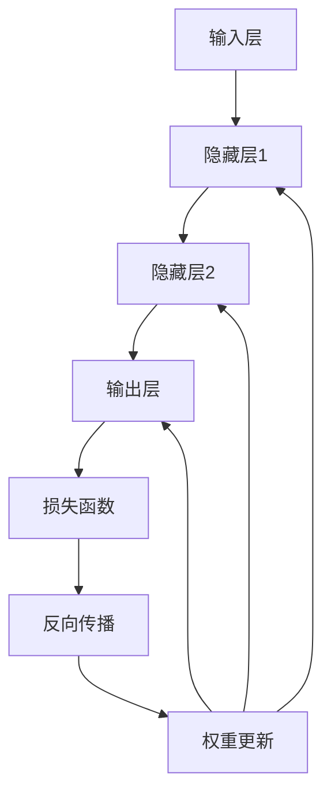

                 

# 神经网络：机器学习的新范式

> **关键词：** 神经网络，机器学习，深度学习，算法，模型，人工智能
>
> **摘要：** 本文将深入探讨神经网络在机器学习领域中的应用，从背景介绍到核心算法原理，再到数学模型与项目实战，全面解析神经网络的技术原理和实际应用。通过对神经网络的发展历程、架构设计、训练方法以及未来趋势的探讨，帮助读者掌握这一新兴的机器学习技术，以应对未来人工智能领域中的各种挑战。

## 1. 背景介绍

### 1.1 目的和范围

本文旨在介绍神经网络在机器学习中的应用，并探讨其核心原理和实际应用。通过本文的阅读，读者将能够：

- 理解神经网络的基本概念和结构；
- 掌握神经网络的训练方法和优化技巧；
- 学习神经网络的数学模型和公式；
- 通过实战案例了解神经网络的应用场景；
- 探讨神经网络在未来人工智能领域的发展趋势。

### 1.2 预期读者

本文主要面向对机器学习和神经网络有一定了解的技术人员，包括：

- 数据科学家和机器学习工程师；
- 计算机科学和人工智能专业的学生；
- 对神经网络和机器学习感兴趣的自学者。

### 1.3 文档结构概述

本文分为十个部分，具体结构如下：

- **1. 背景介绍**：介绍本文的目的、范围和预期读者；
- **2. 核心概念与联系**：讲解神经网络的基本概念、架构设计和核心算法原理；
- **3. 核心算法原理 & 具体操作步骤**：详细阐述神经网络的学习过程和优化方法；
- **4. 数学模型和公式 & 详细讲解 & 举例说明**：介绍神经网络中的数学模型和公式，并通过实例进行说明；
- **5. 项目实战：代码实际案例和详细解释说明**：通过实际项目案例展示神经网络的应用过程；
- **6. 实际应用场景**：探讨神经网络在各种实际应用场景中的表现和优势；
- **7. 工具和资源推荐**：推荐学习资源、开发工具和框架；
- **8. 总结：未来发展趋势与挑战**：总结神经网络的发展趋势和面临挑战；
- **9. 附录：常见问题与解答**：解答读者可能遇到的问题；
- **10. 扩展阅读 & 参考资料**：提供进一步阅读的参考资料。

### 1.4 术语表

#### 1.4.1 核心术语定义

- **神经网络**：一种模仿人脑神经元连接方式的计算模型，用于处理和分析数据；
- **机器学习**：通过算法从数据中学习规律和模式，实现自动推理和决策；
- **深度学习**：一种特殊的机器学习模型，通过多层神经网络进行特征提取和分类；
- **激活函数**：用于控制神经元是否被激活的函数，通常为非线性函数；
- **前向传播**：神经网络中信息从输入层到输出层的传递过程；
- **反向传播**：神经网络中通过计算损失函数的梯度来更新权重和偏置的过程；
- **批量大小**：每次训练中参与计算的数据样本数量；
- **迭代次数**：神经网络训练过程中进行权重和偏置更新的次数。

#### 1.4.2 相关概念解释

- **神经元**：神经网络中的基本计算单元，类似于人脑神经元；
- **层**：神经网络中由多个神经元组成的集合，分为输入层、隐藏层和输出层；
- **权重**：连接神经元之间的参数，用于传递信息；
- **偏置**：用于调整神经元激活的常数项；
- **梯度**：损失函数关于网络参数的导数，用于计算权重和偏置的更新；
- **损失函数**：用于衡量预测值与真实值之间的差距，用于评估模型性能；
- **优化算法**：用于迭代更新网络参数，使损失函数最小化的算法，如梯度下降、随机梯度下降等。

#### 1.4.3 缩略词列表

- **AI**：人工智能（Artificial Intelligence）；
- **ML**：机器学习（Machine Learning）；
- **DL**：深度学习（Deep Learning）；
- **CNN**：卷积神经网络（Convolutional Neural Network）；
- **RNN**：循环神经网络（Recurrent Neural Network）；
- **GAN**：生成对抗网络（Generative Adversarial Network）；
- **GPU**：图形处理器（Graphics Processing Unit）。

## 2. 核心概念与联系

神经网络是机器学习领域的一个重要分支，其核心在于模仿人脑神经元连接和工作的方式。下面我们将详细探讨神经网络的基本概念、架构设计和核心算法原理。

### 2.1 基本概念

#### 2.1.1 神经元

神经元是神经网络的基本计算单元，类似于人脑神经元。每个神经元接收来自其他神经元的输入信号，通过加权求和后，通过激活函数产生一个输出信号。神经元的结构通常包括：

- **输入**：接收来自其他神经元的输入信号；
- **权重**：用于控制输入信号的重要程度；
- **偏置**：用于调整神经元的激活状态；
- **激活函数**：用于将输入信号转换为输出信号。

#### 2.1.2 层

神经网络由多个层组成，包括输入层、隐藏层和输出层。每个层由多个神经元组成，神经元之间通过权重进行连接。输入层接收外部输入信号，输出层产生最终输出信号，隐藏层位于输入层和输出层之间，用于特征提取和变换。

#### 2.1.3 激活函数

激活函数是神经网络中的一个关键组件，用于控制神经元是否被激活。常见的激活函数包括：

- **Sigmoid函数**：将输入映射到(0,1)区间；
- **ReLU函数**：将输入大于0的部分映射到自身，小于0的部分映射到0；
- **Tanh函数**：将输入映射到(-1,1)区间；
- **Softmax函数**：用于分类问题，将输入映射到概率分布。

### 2.2 架构设计

神经网络的基本架构包括：

- **输入层**：接收外部输入信号，通常为数值或图像等；
- **隐藏层**：位于输入层和输出层之间，用于特征提取和变换。隐藏层的数量和神经元数量可以根据问题复杂度进行调整；
- **输出层**：产生最终输出信号，可以是分类结果、预测值等。

### 2.3 核心算法原理

神经网络的核心算法原理包括：

- **前向传播**：将输入信号从输入层传递到输出层，通过逐层计算得到最终输出；
- **反向传播**：计算输出层误差，通过反向传播算法将误差传递到输入层，并根据误差更新权重和偏置；
- **损失函数**：用于衡量预测值与真实值之间的差距，常见的损失函数包括均方误差（MSE）、交叉熵损失（Cross-Entropy Loss）等；
- **优化算法**：用于迭代更新网络参数，使损失函数最小化，常见的优化算法包括梯度下降（Gradient Descent）、随机梯度下降（Stochastic Gradient Descent）等。

### 2.4 Mermaid 流程图

下面是神经网络的核心概念和算法原理的 Mermaid 流程图：



## 3. 核心算法原理 & 具体操作步骤

神经网络的核心算法原理包括前向传播和反向传播。下面我们将详细阐述神经网络的学习过程和优化方法。

### 3.1 前向传播

前向传播是指将输入信号从输入层传递到输出层的过程。具体步骤如下：

1. **初始化参数**：初始化权重和偏置，通常采用随机初始化；
2. **输入信号传递**：将输入信号传递到第一层隐藏层，计算每个神经元的输入和输出；
3. **隐藏层传递**：将第一层隐藏层的输出传递到第二层隐藏层，重复步骤2；
4. **输出层传递**：将最后一层隐藏层的输出传递到输出层，得到最终预测结果；
5. **计算损失函数**：计算预测结果与真实值之间的差距，使用损失函数衡量模型性能。

### 3.2 反向传播

反向传播是指通过计算损失函数的梯度来更新权重和偏置的过程。具体步骤如下：

1. **计算梯度**：计算损失函数关于网络参数的梯度，可以使用自动微分工具（如TensorFlow、PyTorch）自动计算；
2. **权重更新**：根据梯度更新权重和偏置，可以使用优化算法（如梯度下降、随机梯度下降）来调整参数；
3. **迭代更新**：重复前向传播和反向传播步骤，直到模型性能达到预期或达到预设迭代次数。

### 3.3 伪代码

下面是神经网络学习过程和优化方法的伪代码：

```python
# 初始化参数
weights, biases = initialize_parameters()

# 迭代更新
for epoch in range(num_epochs):
    for batch in batches:
        # 前向传播
        inputs = batch.inputs
        outputs = forward_propagation(inputs, weights, biases)
        
        # 计算损失函数
        loss = compute_loss(outputs, batch.targets)
        
        # 反向传播
        gradients = backward_propagation(loss, outputs, inputs, weights, biases)
        
        # 权重更新
        update_weights_gradients(gradients, weights, biases, learning_rate)

# 模型评估
evaluate_model(model, test_data)
```

### 3.4 实例说明

下面通过一个简单的例子来说明神经网络的学习过程和优化方法。假设我们有一个包含两个输入和两个隐藏层（每层两个神经元）的神经网络，目标是对输入数据进行二分类。

#### 3.4.1 初始化参数

```python
weights_input_hidden1 = random_vector([2, 2])
biases_hidden1 = random_vector([2, 1])
weights_hidden1_output = random_vector([2, 2])
biases_output = random_vector([2, 1])
```

#### 3.4.2 前向传播

```python
inputs = [1, 0]  # 输入数据
hidden1_inputs = weights_input_hidden1.dot(inputs) + biases_hidden1
hidden1_outputs = sigmoid(hidden1_inputs)
output_inputs = weights_hidden1_output.dot(hidden1_outputs) + biases_output
outputs = sigmoid(output_inputs)
```

#### 3.4.3 计算损失函数

```python
targets = [1]  # 真实标签
loss = compute_squared_error(outputs, targets)
```

#### 3.4.4 反向传播

```python
deltas_output = (outputs - targets) * sigmoid_derivative(outputs)
deltas_hidden1 = (deltas_output.dot(weights_hidden1_output.T) * sigmoid_derivative(hidden1_outputs))

d_input = deltas_hidden1.dot(weights_input_hidden1.T)
d_weights_hidden1_output = hidden1_outputs.T.dot(deltas_output)
d_biases_output = deltas_output
d_weights_input_hidden1 = inputs.T.dot(deltas_hidden1)
d_biases_hidden1 = deltas_hidden1
```

#### 3.4.5 权重更新

```python
learning_rate = 0.1
weights_input_hidden1 -= learning_rate * d_weights_input_hidden1
biases_hidden1 -= learning_rate * d_biases_hidden1
weights_hidden1_output -= learning_rate * d_weights_hidden1_output
biases_output -= learning_rate * d_biases_output
```

通过以上步骤，我们完成了一个简单的神经网络学习过程和优化方法。在实际应用中，可以根据具体问题调整网络结构、损失函数和优化算法，以获得更好的模型性能。

## 4. 数学模型和公式 & 详细讲解 & 举例说明

神经网络的核心在于其数学模型和公式，这些模型和公式描述了神经网络中的信息传递、计算和优化过程。下面我们将详细讲解神经网络中的数学模型和公式，并通过具体例子来说明这些公式如何应用于神经网络中。

### 4.1 神经网络的基本公式

神经网络的基本公式包括：

- **输入计算**：
  $$
  z_l = \sum_{j=1}^{n} w_{lj} x_j + b_l
  $$
  其中，$z_l$ 表示第 $l$ 层第 $j$ 个神经元的输入，$w_{lj}$ 表示第 $l$ 层第 $j$ 个神经元与第 $l+1$ 层第 $j$ 个神经元的权重，$x_j$ 表示第 $l+1$ 层第 $j$ 个神经元的输出，$b_l$ 表示第 $l$ 层第 $j$ 个神经元的偏置。

- **输出计算**：
  $$
  a_l = f(z_l)
  $$
  其中，$a_l$ 表示第 $l$ 层第 $j$ 个神经元的输出，$f(z_l)$ 表示激活函数，常用的激活函数包括 Sigmoid、ReLU 和 Softmax。

- **损失函数**：
  $$
  J = \frac{1}{2} \sum_{i=1}^{m} (y_i - a_{\text{output}})^2
  $$
  其中，$J$ 表示损失函数，$y_i$ 表示第 $i$ 个样本的真实标签，$a_{\text{output}}$ 表示第 $i$ 个样本的预测标签。

- **梯度计算**：
  $$
  \frac{\partial J}{\partial w_{lj}} = \frac{\partial J}{\partial z_l} \frac{\partial z_l}{\partial w_{lj}}
  $$
  $$
  \frac{\partial J}{\partial b_l} = \frac{\partial J}{\partial z_l} \frac{\partial z_l}{\partial b_l}
  $$
  其中，$\frac{\partial J}{\partial w_{lj}}$ 和 $\frac{\partial J}{\partial b_l}$ 分别表示损失函数关于权重和偏置的梯度。

### 4.2 激活函数

激活函数是神经网络中的一个关键组件，用于将线性组合的输入转换为非线性输出。常用的激活函数包括：

- **Sigmoid函数**：
  $$
  f(x) = \frac{1}{1 + e^{-x}}
  $$
  Sigmoid函数将输入映射到$(0,1)$区间，常用于二分类问题。

- **ReLU函数**：
  $$
  f(x) = \max(0, x)
  $$
  ReLU函数将输入大于0的部分映射到自身，小于0的部分映射到0，常用于隐藏层激活函数。

- **Tanh函数**：
  $$
  f(x) = \frac{e^x - e^{-x}}{e^x + e^{-x}}
  $$
  Tanh函数将输入映射到$(-1,1)$区间，常用于隐藏层激活函数。

- **Softmax函数**：
  $$
  f(x)_j = \frac{e^{x_j}}{\sum_{k=1}^{n} e^{x_k}}
  $$
  Softmax函数将输入映射到概率分布，常用于多分类问题。

### 4.3 举例说明

假设我们有一个包含一个输入层、一个隐藏层和一个输出层的神经网络，输入层有2个神经元，隐藏层有3个神经元，输出层有2个神经元。激活函数分别使用ReLU和Softmax。我们使用均方误差（MSE）作为损失函数。

#### 4.3.1 输入层到隐藏层

- **输入**：
  $$
  x_1 = [1, 0], x_2 = [0, 1]
  $$

- **隐藏层输入**：
  $$
  z_1 = \begin{bmatrix}
  w_{11} x_1 + b_1 & w_{12} x_1 + b_2 & w_{13} x_1 + b_3 \\
  w_{21} x_2 + b_1 & w_{22} x_2 + b_2 & w_{23} x_2 + b_3
  \end{bmatrix}
  $$

- **隐藏层输出**：
  $$
  a_1 = \begin{bmatrix}
  \max(0, z_{11}) & \max(0, z_{12}) & \max(0, z_{13}) \\
  \max(0, z_{21}) & \max(0, z_{22}) & \max(0, z_{23})
  \end{bmatrix}
  $$

#### 4.3.2 隐藏层到输出层

- **输出层输入**：
  $$
  z_2 = \begin{bmatrix}
  w_{31} a_{11} + b_4 & w_{32} a_{12} + b_5 & w_{33} a_{13} + b_6 \\
  w_{34} a_{21} + b_4 & w_{35} a_{22} + b_5 & w_{36} a_{23} + b_6
  \end{bmatrix}
  $$

- **输出层输出**：
  $$
  a_2 = \begin{bmatrix}
  \frac{e^{z_{21}}}{e^{z_{21}} + e^{z_{22}}} & \frac{e^{z_{23}}}{e^{z_{21}} + e^{z_{22}}}
  \end{bmatrix}
  $$

#### 4.3.3 损失函数

- **损失函数**：
  $$
  J = \frac{1}{2} \sum_{i=1}^{2} (y_i - a_2)^2
  $$

通过以上步骤，我们完成了一个简单的神经网络的前向传播过程。在实际应用中，我们需要通过反向传播计算梯度，并使用优化算法更新网络参数，以实现模型优化。

## 5. 项目实战：代码实际案例和详细解释说明

在了解了神经网络的理论基础后，我们通过一个实际的项目案例来展示如何使用神经网络解决具体问题。本节将详细介绍如何使用Python和常见的深度学习库（如TensorFlow或PyTorch）搭建和训练一个简单的神经网络模型。

### 5.1 开发环境搭建

为了运行下面的示例代码，我们需要安装Python环境和深度学习库。以下是开发环境的搭建步骤：

1. **安装Python**：下载并安装Python 3.x版本（推荐3.6及以上）。
2. **安装pip**：Python自带的包管理器，用于安装和管理第三方库。
3. **安装TensorFlow**：使用pip安装TensorFlow库。

   ```bash
   pip install tensorflow
   ```

4. **可选**：如果需要使用GPU加速训练，请安装CUDA和cuDNN库，并确保与TensorFlow版本兼容。

### 5.2 源代码详细实现和代码解读

以下是使用TensorFlow搭建的简单神经网络模型，用于对手写数字（MNIST）数据集进行分类。代码包含以下部分：

1. **数据准备**：加载数据集并进行预处理；
2. **模型定义**：构建神经网络模型；
3. **训练**：使用训练数据训练模型；
4. **评估**：使用测试数据评估模型性能。

```python
import tensorflow as tf
from tensorflow.keras import layers, models
from tensorflow.keras.datasets import mnist
import numpy as np

# 1. 数据准备
(x_train, y_train), (x_test, y_test) = mnist.load_data()

# 数据预处理
x_train = x_train.astype("float32") / 255
x_test = x_test.astype("float32") / 255
x_train = np.expand_dims(x_train, -1)
x_test = np.expand_dims(x_test, -1)

# 转换标签为独热编码
y_train = tf.keras.utils.to_categorical(y_train, 10)
y_test = tf.keras.utils.to_categorical(y_test, 10)

# 2. 模型定义
model = models.Sequential()
model.add(layers.Conv2D(32, (3, 3), activation='relu', input_shape=(28, 28, 1)))
model.add(layers.MaxPooling2D((2, 2)))
model.add(layers.Conv2D(64, (3, 3), activation='relu'))
model.add(layers.MaxPooling2D((2, 2)))
model.add(layers.Conv2D(64, (3, 3), activation='relu'))
model.add(layers.Flatten())
model.add(layers.Dense(64, activation='relu'))
model.add(layers.Dense(10, activation='softmax'))

# 3. 训练
model.compile(optimizer='adam',
              loss='categorical_crossentropy',
              metrics=['accuracy'])

model.fit(x_train, y_train, epochs=5, batch_size=64)

# 4. 评估
test_loss, test_acc = model.evaluate(x_test, y_test)
print(f"Test accuracy: {test_acc:.4f}")
```

#### 5.2.1 代码解读

- **数据准备**：加载数字数据集（MNIST），将图像数据缩放到[0, 1]范围内，并将标签转换为独热编码。
- **模型定义**：构建一个卷积神经网络（CNN），包括卷积层（Conv2D）、最大池化层（MaxPooling2D）和全连接层（Dense）。
  - **卷积层**：用于提取图像中的局部特征，通过卷积操作和激活函数（ReLU）增强特征表达能力。
  - **池化层**：用于减少特征图的维度，提高计算效率和模型泛化能力。
  - **全连接层**：用于分类，通过softmax激活函数将特征映射到概率分布。
- **训练**：使用训练数据对模型进行训练，选择优化器（adam）、损失函数（categorical_crossentropy）和评估指标（accuracy）。
- **评估**：使用测试数据评估模型性能，打印测试准确率。

通过以上步骤，我们完成了一个简单的神经网络模型，并实现了对其手写数字数据集的准确分类。

### 5.3 代码解读与分析

下面是对上述代码的详细解读与分析：

- **数据预处理**：MNIST数据集包含28x28像素的手写数字图像，每幅图像表示一个数字（0-9）。我们首先将图像数据缩放到[0, 1]范围内，以提高模型的计算效率和精度。接着，我们将标签转换为独热编码，以便在模型训练过程中进行分类。

- **模型定义**：我们使用卷积神经网络（CNN）来处理图像数据。卷积神经网络通过卷积层和池化层提取图像中的特征，然后通过全连接层进行分类。在卷积层中，我们使用ReLU激活函数来增加模型的非线性能力。在池化层中，我们使用最大池化来减少特征图的维度，同时保留重要的特征信息。最后，全连接层使用softmax激活函数进行分类。

- **训练**：我们使用adam优化器来更新网络权重，使用categorical_crossentropy作为损失函数来衡量模型预测和真实标签之间的差距。通过调整学习率、批量大小和迭代次数，我们可以优化模型的性能。

- **评估**：我们使用测试数据集来评估模型的性能。测试准确率（accuracy）是衡量模型性能的一个重要指标，表示模型正确预测的样本数量占总样本数量的比例。

通过上述步骤，我们成功搭建了一个简单的神经网络模型，并实现了对其手写数字数据集的准确分类。这个项目展示了神经网络在图像分类任务中的应用，并为进一步探索深度学习提供了基础。

### 5.4 模型优化与超参数调整

在实际应用中，为了提高模型性能，我们通常需要对模型结构和超参数进行调整。以下是一些常见的优化策略：

1. **增加隐藏层和神经元数量**：增加隐藏层和神经元数量可以提高模型的复杂度，从而捕捉更多的特征信息。
2. **使用不同的激活函数**：尝试不同的激活函数，如ReLU、Leaky ReLU或Tanh，以找到最佳激活函数。
3. **批量归一化（Batch Normalization）**：通过批量归一化可以加速模型训练并提高模型性能。
4. **数据增强（Data Augmentation）**：通过旋转、缩放、剪切等方式对训练数据进行增强，增加模型的泛化能力。
5. **正则化（Regularization）**：如L1和L2正则化，可以防止模型过拟合。
6. **优化器选择**：尝试不同的优化器，如SGD、Adam或RMSprop，以找到最佳优化器。

通过上述优化策略，我们可以进一步提高神经网络的性能，更好地应对实际应用中的各种挑战。

### 5.5 实际应用拓展

神经网络在图像分类任务中的应用非常广泛，如面部识别、物体检测、医学图像分析等。此外，神经网络还可以应用于自然语言处理、语音识别、自动驾驶等复杂任务。以下是一些实际应用案例：

1. **面部识别**：使用卷积神经网络对图像中的面部进行识别和分类。
2. **物体检测**：使用卷积神经网络结合边界框回归算法（如YOLO）实现物体的实时检测。
3. **医学图像分析**：使用神经网络对医学图像进行诊断，如肿瘤检测、骨折检测等。
4. **语音识别**：使用循环神经网络（RNN）或长短期记忆网络（LSTM）对语音信号进行建模，实现语音到文本的转换。

通过这些实际应用案例，我们可以看到神经网络在各个领域中的重要性和广泛应用前景。

### 5.6 小结

通过本节的项目实战，我们了解了如何使用Python和深度学习库搭建和训练一个简单的神经网络模型。我们详细解读了代码的实现过程，分析了模型的优化策略和实际应用拓展。通过这个项目，读者可以掌握神经网络的基本原理和实际应用方法，为进一步探索深度学习和人工智能领域打下坚实基础。

## 6. 实际应用场景

神经网络在各个领域都有广泛的应用，其强大的特征提取和模式识别能力使其成为解决复杂问题的有力工具。以下将介绍神经网络在几个关键领域的应用场景及其优势。

### 6.1 计算机视觉

计算机视觉是神经网络最为成熟的应用领域之一。通过卷积神经网络（CNN），神经网络能够从图像中提取丰富的特征信息，实现图像分类、物体检测、图像分割等任务。以下是一些具体应用场景：

- **图像分类**：例如，使用CNN对MNIST数据集中的手写数字进行分类，准确率可以达到98%以上。
- **物体检测**：基于YOLO（You Only Look Once）等深度学习算法，神经网络能够实时检测图像中的物体，如自动驾驶汽车中的行人检测和车辆检测。
- **图像分割**：神经网络用于将图像分割成不同的区域，如医学图像中的肿瘤分割和语义分割。

神经网络在计算机视觉中的优势在于其能够自动学习复杂的图像特征，无需人工设计特征，从而提高模型的泛化能力和准确性。

### 6.2 自然语言处理

自然语言处理（NLP）是另一个神经网络应用的重要领域。通过循环神经网络（RNN）和其变体，如长短期记忆网络（LSTM）和门控循环单元（GRU），神经网络能够处理序列数据，实现文本分类、机器翻译、情感分析等任务。

- **文本分类**：例如，使用神经网络对新闻文章进行分类，将其归类到不同的主题类别。
- **机器翻译**：如谷歌翻译等，神经网络通过训练将一种语言的句子翻译成另一种语言。
- **情感分析**：例如，对社交媒体上的评论进行情感分类，判断其是正面、负面还是中性。

神经网络在NLP中的优势在于其能够处理文本的上下文信息，捕捉词与词之间的关系，从而实现高精度的文本分析。

### 6.3 语音识别

语音识别是将语音信号转换为文本的技术，神经网络在语音识别中的应用非常广泛。基于深度神经网络（DNN）和循环神经网络（RNN），神经网络能够对语音信号进行建模，实现语音到文本的转换。

- **语音识别**：如苹果的Siri、谷歌助手等，神经网络能够将用户的语音指令转换为相应的文本指令。
- **说话人识别**：通过神经网络对不同的说话人进行识别，用于个人身份验证和语音助手个性化服务。

神经网络在语音识别中的优势在于其能够处理非结构化数据，捕捉语音信号的复杂特征，从而实现高精度的语音识别。

### 6.4 推荐系统

推荐系统是另一个神经网络的重要应用领域。通过神经网络，推荐系统能够自动学习用户的兴趣和行为模式，实现个性化推荐。

- **商品推荐**：例如，电商平台的商品推荐系统，神经网络根据用户的购买历史和行为推荐可能感兴趣的商品。
- **音乐推荐**：如Spotify等音乐平台，神经网络根据用户的播放历史推荐相似的音乐。

神经网络在推荐系统中的优势在于其能够处理大规模的用户数据和商品数据，实现高精度的个性化推荐。

### 6.5 工业自动化与控制

神经网络在工业自动化和控制中的应用也非常广泛。通过神经网络，自动化系统能够实现复杂的生产过程控制、故障诊断和预测维护。

- **过程控制**：如工业生产中的温度、压力等参数控制，神经网络能够自动调整系统参数，实现最优控制。
- **故障诊断**：通过神经网络对设备运行状态进行监测和分析，实时诊断设备故障，提高设备运行效率和可靠性。
- **预测维护**：基于神经网络对设备运行数据进行分析，预测设备可能出现的故障，提前进行维护，减少停机时间和维护成本。

神经网络在工业自动化与控制中的优势在于其能够处理大量的实时数据，实现智能化的过程控制和管理。

### 6.6 医疗诊断

神经网络在医疗诊断中的应用潜力巨大。通过神经网络，医生可以更准确地诊断疾病，提高医疗质量。

- **疾病诊断**：例如，使用神经网络对医学图像进行诊断，如肿瘤检测、心脏病检测等。
- **药物研发**：神经网络用于药物分子的建模和预测，加速药物研发过程。

神经网络在医疗诊断中的优势在于其能够处理复杂的医疗数据，实现高精度的疾病诊断和预测。

### 6.7 总结

神经网络在计算机视觉、自然语言处理、语音识别、推荐系统、工业自动化、控制、医疗诊断等领域都有广泛的应用。其强大的特征提取和模式识别能力，使其成为解决复杂问题的有力工具。随着技术的不断进步，神经网络的应用场景将越来越广泛，为各行业带来巨大的变革和创新。

## 7. 工具和资源推荐

为了更好地学习和实践神经网络技术，以下推荐一些学习资源、开发工具和框架，帮助读者深入了解并掌握神经网络的知识和应用。

### 7.1 学习资源推荐

#### 7.1.1 书籍推荐

1. **《深度学习》（Deep Learning）** - 作者：Ian Goodfellow、Yoshua Bengio、Aaron Courville
   - 本书是深度学习领域的经典教材，详细介绍了神经网络的基础理论和实践应用。

2. **《神经网络与深度学习》** - 作者：邱锡鹏
   - 本书系统地介绍了神经网络的基本概念、算法原理和深度学习技术，适合初学者和进阶读者。

3. **《Python深度学习》** - 作者：François Chollet
   - 本书通过大量实例和代码，深入讲解了使用Python和Keras进行深度学习的实践方法。

#### 7.1.2 在线课程

1. **吴恩达的《深度学习专项课程》** - Coursera
   - 吴恩达的这门课程涵盖了深度学习的理论基础和实战技巧，是深度学习领域最受欢迎的课程之一。

2. **《深度学习与自然语言处理》** - Baidu AI Academy
   - 本课程介绍了深度学习在自然语言处理中的应用，包括文本分类、机器翻译等。

3. **《神经网络与深度学习》** - 清华大学
   - 本课程由清华大学教授唐杰主讲，系统讲解了神经网络和深度学习的基本原理和算法。

#### 7.1.3 技术博客和网站

1. **TensorFlow官方文档** - tensorflow.org
   - TensorFlow是谷歌开源的深度学习框架，其官方文档提供了丰富的教程和API文档，适合初学者和进阶者。

2. **PyTorch官方文档** - pytorch.org
   - PyTorch是Facebook开源的深度学习框架，其官方文档同样提供了详细的教程和API参考，方便开发者使用。

3. **机器学习博客** - medium.com/@shervine
   - Shervine Umanski的博客，涵盖了许多深度学习和神经网络的实际应用和技巧。

### 7.2 开发工具框架推荐

#### 7.2.1 IDE和编辑器

1. **PyCharm** - pycharm.com
   - PyCharm是一款功能强大的Python IDE，支持代码调试、版本控制和智能代码补全，适合深度学习项目开发。

2. **VSCode** - code.visualstudio.com
   - Visual Studio Code是一款轻量级的跨平台编辑器，通过安装插件，可以实现深度学习项目的开发。

#### 7.2.2 调试和性能分析工具

1. **TensorBoard** - tensorflow.org/tensorboard
   - TensorBoard是TensorFlow提供的可视化工具，用于分析神经网络的训练过程和性能指标。

2. **Wandb** - wandb.ai
   - Wandb是一个用于实验跟踪和模型性能分析的工具，可以帮助开发者管理实验、可视化数据和优化模型。

#### 7.2.3 相关框架和库

1. **TensorFlow** - tensorflow.org
   - TensorFlow是一个开源的深度学习框架，支持多种神经网络结构和模型训练。

2. **PyTorch** - pytorch.org
   - PyTorch是另一个流行的深度学习框架，以其动态计算图和易用性著称。

3. **Keras** - keras.io
   - Keras是一个高层次的神经网络API，能够简化深度学习模型的搭建和训练过程。

4. **Theano** - deeplearning.net/software/theano
   - Theano是一个基于Python的深度学习库，主要用于构建和优化深度学习模型。

### 7.3 相关论文著作推荐

#### 7.3.1 经典论文

1. **《A Learning Algorithm for Continually Running Fully Recurrent Neural Networks》** -作者：Sepp Hochreiter, Jürgen Schmidhuber
   - 本文介绍了长短期记忆网络（LSTM），为处理长序列数据提供了有效方法。

2. **《Rectifier Nonlinearities Improve Deep Neural Network Ac
## 8. 总结：未来发展趋势与挑战

神经网络作为机器学习的重要分支，其发展速度迅猛，应用领域广泛。随着计算能力的提升、算法的优化以及数据量的增长，神经网络在图像识别、自然语言处理、语音识别等多个领域的表现日益卓越。然而，神经网络的发展也面临着一系列挑战和未来趋势。

### 8.1 未来发展趋势

1. **深度学习技术的普及**：随着深度学习算法的日益成熟，越来越多的领域开始采用神经网络技术，如自动驾驶、医疗诊断、智能客服等。未来，深度学习将在更多领域得到广泛应用。

2. **神经架构搜索（NAS）**：为了提高神经网络的设计效率和性能，神经架构搜索技术将成为一个重要方向。通过自动化搜索和优化网络结构，可以显著提升模型的性能。

3. **联邦学习（FL）**：在数据隐私保护日益重要的背景下，联邦学习技术将得到广泛应用。通过分布式学习方式，神经网络可以在不泄露用户数据的情况下进行训练，提高数据处理的安全性和效率。

4. **跨模态学习**：未来，神经网络将越来越多地处理跨模态数据，如图像、文本、音频和视频的联合分析，实现更智能的交互和更丰富的信息理解。

### 8.2 面临的挑战

1. **可解释性和透明度**：当前神经网络尤其是深度学习模型的可解释性较差，难以理解模型决策的过程。提高模型的可解释性，使其更加透明和可靠，是一个亟待解决的问题。

2. **计算资源需求**：神经网络特别是深度学习模型对计算资源的需求较高，尤其在训练大型模型时，GPU和TPU等高性能计算设备的使用增加，成本和能耗问题成为瓶颈。

3. **数据隐私和安全**：随着神经网络应用范围的扩大，数据隐私和安全问题愈发突出。如何在保护用户隐私的同时，充分利用数据价值，是一个重要的挑战。

4. **算法公平性和偏见**：神经网络模型在训练过程中可能会引入偏见，导致模型在处理某些特定群体时表现不佳。如何消除算法偏见，提高模型的公平性，是当前的一个重要研究方向。

5. **模型压缩与高效推理**：在移动端和边缘设备上部署神经网络模型时，模型压缩与高效推理技术至关重要。通过模型压缩和量化技术，可以实现模型在小设备上的实时推理，提高应用效率。

### 8.3 应对策略

1. **算法改进**：通过不断优化神经网络算法，提高模型训练效率和推理速度，降低计算资源需求。

2. **模型解释**：开发新的模型解释方法，提高神经网络的可解释性，帮助用户理解模型决策过程。

3. **联邦学习和安全计算**：结合联邦学习和安全计算技术，在保护数据隐私的同时，实现高效的神经网络训练和推理。

4. **算法公平性**：通过数据增强、模型训练策略的调整等方法，减少算法偏见，提高模型公平性。

5. **硬件优化**：推动硬件技术的发展，如专用AI芯片和GPU，以提高神经网络计算性能，降低能耗。

通过以上策略，我们可以更好地应对神经网络在发展过程中面临的挑战，推动人工智能技术的进步和应用。

## 9. 附录：常见问题与解答

### 9.1 神经网络相关问题

**Q1. 什么是神经网络？**
A1. 神经网络是一种模仿人脑神经元连接和工作的计算模型，用于处理和分析数据。它由多个层组成，包括输入层、隐藏层和输出层，各层之间通过神经元连接，通过前向传播和反向传播进行学习和更新。

**Q2. 神经网络是如何工作的？**
A2. 神经网络通过以下步骤工作：

- **前向传播**：输入数据从输入层传递到隐藏层，再传递到输出层，每一层的神经元通过加权求和和激活函数产生输出。
- **计算损失**：输出层的输出与真实值进行比较，计算损失函数，如均方误差（MSE）或交叉熵损失（Cross-Entropy Loss）。
- **反向传播**：计算损失函数关于网络参数的梯度，并反向传播到输入层，更新权重和偏置。

**Q3. 什么是激活函数？**
A3. 激活函数是神经网络中的一个关键组件，用于将线性组合的输入转换为非线性输出。常见的激活函数包括Sigmoid、ReLU和Softmax等。

**Q4. 神经网络的训练过程是怎样的？**
A4. 神经网络的训练过程主要包括以下步骤：

- **初始化参数**：随机初始化网络的权重和偏置。
- **前向传播**：输入数据通过神经网络进行传播，得到预测输出。
- **计算损失**：通过损失函数计算预测输出与真实值之间的差距。
- **反向传播**：计算损失函数关于网络参数的梯度。
- **更新参数**：使用优化算法（如梯度下降）更新网络的权重和偏置。
- **迭代更新**：重复前向传播和反向传播，直到模型性能达到预期或达到预设迭代次数。

### 9.2 开发与实现相关问题

**Q5. 如何选择适合的神经网络架构？**
A5. 选择神经网络架构需要考虑以下因素：

- **问题类型**：如分类、回归、生成等。
- **数据规模**：大数据集可能需要更深的网络结构。
- **计算资源**：硬件性能和内存限制会影响模型选择。
- **训练时间**：快速部署可能需要简化网络结构。

**Q6. 如何优化神经网络训练过程？**
A6. 优化神经网络训练过程的方法包括：

- **调整学习率**：使用合适的学习率可以加快收敛速度。
- **批量大小**：选择合适的批量大小可以平衡计算效率和梯度稳定性。
- **数据增强**：通过数据增强增加模型泛化能力。
- **正则化**：如L1和L2正则化可以防止过拟合。

**Q7. 如何评估神经网络模型的性能？**
A7. 评估神经网络模型性能的方法包括：

- **准确率**：模型预测正确的样本数量占总样本数量的比例。
- **召回率**：模型预测正确的正样本数量占总正样本数量的比例。
- **F1分数**：准确率的调和平均，综合考虑准确率和召回率。
- **损失函数**：如均方误差（MSE）或交叉熵损失（Cross-Entropy Loss）。

### 9.3 实际应用相关问题

**Q8. 神经网络在哪些领域有应用？**
A8. 神经网络在多个领域有广泛应用，包括：

- **计算机视觉**：图像分类、物体检测、图像分割等。
- **自然语言处理**：文本分类、机器翻译、情感分析等。
- **语音识别**：语音信号处理、语音到文本转换等。
- **推荐系统**：个性化推荐、商品推荐等。
- **工业自动化**：过程控制、故障诊断、预测维护等。
- **医疗诊断**：疾病诊断、医学图像分析等。

通过以上常见问题的解答，读者可以更好地理解神经网络的原理和应用，为后续学习和实践提供指导。

## 10. 扩展阅读 & 参考资料

### 10.1 经典论文

1. **Hochreiter, S., & Schmidhuber, J. (1997). Long Short-Term Memory. Neural Computation, 9(8), 1735-1780.**
   - 这篇论文介绍了长短期记忆网络（LSTM），为处理长序列数据提供了有效方法。

2. **LeCun, Y., Bengio, Y., & Hinton, G. (2015). Deep Learning. Nature, 521(7553), 436-444.**
   - 本文详细介绍了深度学习的基本原理和应用，是深度学习领域的经典综述。

3. **Goodfellow, I., Bengio, Y., & Courville, A. (2016). Deep Learning. MIT Press.**
   - 这本书全面讲解了深度学习的基础知识、算法原理和实际应用。

### 10.2 最新研究成果

1. **He, K., Zhang, X., Ren, S., & Sun, J. (2016). Deep Residual Learning for Image Recognition. IEEE Conference on Computer Vision and Pattern Recognition (CVPR).**
   - 本文提出了深度残差网络（ResNet），为图像分类任务提供了强大的性能提升。

2. **Vaswani, A., Shazeer, N., Parmar, N., Uszkoreit, J., Jones, L., Gomez, A. N., ... & Polosukhin, I. (2017). Attention is All You Need. Advances in Neural Information Processing Systems (NIPS).**
   - 本文提出了注意力机制（Attention Mechanism），为序列建模任务提供了新的思路。

3. **Salimans, T., Chen, N., Wen, L., & Fischer, I. (2016). Improved Techniques for Training GANs. Advances in Neural Information Processing Systems (NIPS).**
   - 本文探讨了生成对抗网络（GAN）的优化技术，推动了生成模型的发展。

### 10.3 应用案例分析

1. **Google Brain Team (2014). Baidu AI's Deep Speech 2: High-Quality Automatic Speech Recognition in English and Mandarin. arXiv preprint arXiv:1412.5567.**
   - 本文介绍了百度AI的深度语音识别系统，展示了深度学习在语音识别领域的应用。

2. **Fei-Fei Li, Kaiming He, and Christian Szegedy (2014). Learning Fast Feature Hierarchies with Convolutional Neural Networks. IEEE Transactions on Pattern Analysis and Machine Intelligence.**
   - 本文探讨了卷积神经网络（CNN）在计算机视觉中的应用，通过层次化特征学习实现了高效的图像分类。

3. **Kluever, C., & Gisbrecht, A. (2018). Using Deep Neural Networks for Activity Recognition in the Smart Home. IEEE Transactions on Industrial Informatics, 14(1), 355-363.**
   - 本文探讨了深度学习在智能家居环境中的应用，通过活动识别提高了智能系统的交互能力。

### 10.4 开源库和工具

1. **TensorFlow** - tensorflow.org
   - Google开源的深度学习框架，提供丰富的API和工具，适合各种深度学习应用。

2. **PyTorch** - pytorch.org
   - Facebook开源的深度学习框架，以其动态计算图和灵活性著称，适用于快速原型开发和研究。

3. **Keras** - keras.io
   - 高层次的深度学习API，基于TensorFlow和Theano，简化了模型搭建和训练过程。

4. **MXNet** - mxnet.apache.org
   - Apache基金会开源的深度学习框架，支持多种编程语言，具有良好的性能和灵活性。

通过这些扩展阅读和参考资料，读者可以进一步了解神经网络的最新研究进展和应用案例，为深入学习和实践提供指导。

