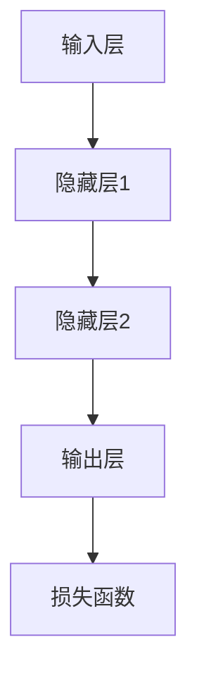

                 

# 神经网络：自然语言处理的新突破

> **关键词：** 神经网络，自然语言处理，机器学习，人工智能，深度学习
>
> **摘要：** 本文将深入探讨神经网络在自然语言处理（NLP）领域的应用，解析其核心概念、算法原理、数学模型以及实际应用案例。通过这一步一步的分析与推理，我们将揭示神经网络在NLP中的巨大潜力，以及其对人工智能领域的推动作用。

## 1. 背景介绍

### 1.1 目的和范围

本文旨在介绍神经网络在自然语言处理（NLP）领域的应用，探讨其在文本分析和理解方面的突破。我们将详细阐述神经网络的基本概念、核心算法原理以及数学模型，并通过实际应用案例展示其在NLP中的巨大价值。同时，本文还将介绍相关工具和资源，以帮助读者更好地理解和应用神经网络。

### 1.2 预期读者

本文面向具有一定编程基础和机器学习知识的读者，尤其是对自然语言处理感兴趣的程序员、数据科学家和人工智能从业者。通过本文的学习，读者将能够深入了解神经网络在NLP领域的应用，掌握核心算法原理，并能够应用于实际问题。

### 1.3 文档结构概述

本文结构如下：

1. **背景介绍**：介绍神经网络在自然语言处理领域的应用背景。
2. **核心概念与联系**：解析神经网络的基本概念及其与NLP的关联。
3. **核心算法原理 & 具体操作步骤**：详细阐述神经网络的工作原理和操作步骤。
4. **数学模型和公式 & 详细讲解 & 举例说明**：介绍神经网络的数学模型和公式，并通过实例进行讲解。
5. **项目实战：代码实际案例和详细解释说明**：展示神经网络在实际项目中的应用，并提供代码解读。
6. **实际应用场景**：探讨神经网络在自然语言处理中的具体应用场景。
7. **工具和资源推荐**：推荐相关学习资源、开发工具和论文著作。
8. **总结：未来发展趋势与挑战**：总结神经网络在NLP领域的发展趋势和面临的挑战。
9. **附录：常见问题与解答**：解答读者可能遇到的问题。
10. **扩展阅读 & 参考资料**：提供扩展阅读和参考资料，以供进一步学习。

### 1.4 术语表

#### 1.4.1 核心术语定义

- **神经网络（Neural Network）**：一种基于生物神经网络结构的计算机算法模型，由大量神经元连接而成，用于模拟大脑的智能行为。
- **自然语言处理（Natural Language Processing，NLP）**：计算机科学和人工智能领域的分支，专注于使计算机理解和处理人类语言的技术。
- **深度学习（Deep Learning）**：一种基于多层神经网络的学习方法，能够自动提取复杂的数据特征。
- **反向传播算法（Backpropagation Algorithm）**：一种用于训练神经网络的优化算法，通过计算输出误差的梯度来更新网络权重。

#### 1.4.2 相关概念解释

- **神经元（Neuron）**：神经网络的基本计算单元，接收输入信号，通过激活函数产生输出。
- **激活函数（Activation Function）**：用于确定神经元是否被激活的函数，如 sigmoid、ReLU等。
- **批量归一化（Batch Normalization）**：一种用于加速神经网络训练和避免梯度消失的方法，通过对输入数据进行归一化处理来稳定训练过程。

#### 1.4.3 缩略词列表

- **NLP**：自然语言处理（Natural Language Processing）
- **DL**：深度学习（Deep Learning）
- **NN**：神经网络（Neural Network）
- **BP**：反向传播算法（Backpropagation Algorithm）

## 2. 核心概念与联系

### 2.1 神经网络的基本概念

神经网络是一种模拟人脑神经元结构的计算模型，由大量神经元（节点）及其连接（边）组成。每个神经元接收来自其他神经元的输入信号，通过激活函数产生输出信号。神经网络通过不断调整连接权重，使其能够自动学习和提取复杂的数据特征。


#### 2.2 神经网络与自然语言处理

自然语言处理（NLP）是计算机科学和人工智能领域的分支，旨在使计算机理解和处理人类语言。神经网络在NLP中的应用主要体现在以下几个方面：

1. **文本分类**：将文本数据分类为预定义的类别，如情感分析、主题分类等。
2. **词向量表示**：将文本数据转换为数值向量表示，以便于计算机处理和计算。
3. **语言模型**：生成自然语言文本，用于机器翻译、语音识别等领域。
4. **问答系统**：回答用户针对特定问题的查询，如搜索引擎、智能客服等。
5. **语音识别**：将语音信号转换为文本，用于语音助手、自动字幕等应用。

#### 2.3 神经网络的工作原理

神经网络的工作原理可以概括为以下步骤：

1. **输入层**：接收外部输入信号，如文本数据。
2. **隐藏层**：对输入信号进行特征提取和转换，通过多层神经网络构建复杂的特征空间。
3. **输出层**：生成最终输出结果，如分类标签、词向量等。
4. **反向传播**：通过计算输出误差的梯度，更新网络权重，优化模型性能。

### 2.4 核心算法原理

神经网络的核心算法包括前向传播和反向传播：

1. **前向传播**：将输入信号传递至神经网络，通过隐藏层和输出层，生成输出结果。
2. **反向传播**：计算输出误差的梯度，并反向传播至输入层，更新网络权重。

### 2.5 核心架构图

以下是一个简单的神经网络架构图，展示了输入层、隐藏层和输出层的关系：



通过上述架构，神经网络能够对输入数据进行特征提取和转换，实现复杂的任务，如自然语言处理。

## 3. 核心算法原理 & 具体操作步骤

### 3.1 前向传播

前向传播是指将输入信号从输入层传递至输出层的计算过程。具体步骤如下：

1. **初始化参数**：设置网络权重和偏置，通常使用随机初始化方法。
2. **输入层到隐藏层**：将输入数据传递至隐藏层，通过加权求和和激活函数计算输出。
3. **隐藏层到输出层**：将隐藏层输出传递至输出层，生成最终输出结果。

前向传播的伪代码如下：

```python
def forward_propagation(input_data, weights, biases, activation_functions):
    # 初始化输出
    output = input_data
    
    # 遍历隐藏层
    for layer in range(1, num_hidden_layers + 1):
        # 加权求和
        weighted_sum = np.dot(output, weights[layer-1]) + biases[layer-1]
        
        # 激活函数
        output = activation_functions[layer-1](weighted_sum)
        
    # 输出层输出
    output = activation_functions[num_hidden_layers](weighted_sum)
    
    return output
```

### 3.2 反向传播

反向传播是指计算输出误差的梯度，并更新网络权重和偏置的过程。具体步骤如下：

1. **计算损失函数**：使用损失函数计算输出误差。
2. **计算梯度**：对损失函数求导，计算输出层和隐藏层的梯度。
3. **更新参数**：根据梯度更新网络权重和偏置。

反向传播的伪代码如下：

```python
def backward_propagation(input_data, output_data, weights, biases, activation_functions, loss_function):
    # 初始化梯度
    gradients = {}
    
    # 遍历反向传播过程
    for layer in reversed(range(num_layers)):
        # 计算当前层的损失函数梯度
        d_output = loss_function.derivative(output_data)
        
        # 遍历隐藏层和输出层
        for neuron in range(num_neurons[layer]):
            # 计算当前神经元的梯度
            d_neuron = d_output * activation_functions[layer].derivative(output[layer][neuron])
            
            # 更新梯度
            gradients['weights'][layer][neuron] = d_neuron * input[layer][neuron]
            gradients['biases'][layer][neuron] = d_neuron
        
        # 更新输出数据
        output_data = output[layer]
    
    # 更新参数
    for layer in range(num_layers):
        weights[layer] -= learning_rate * gradients['weights'][layer]
        biases[layer] -= learning_rate * gradients['biases'][layer]
    
    return gradients
```

通过前向传播和反向传播，神经网络能够不断优化模型性能，实现更准确的预测和分类。

## 4. 数学模型和公式 & 详细讲解 & 举例说明

### 4.1 数学模型

神经网络是一种基于数学模型的计算模型，主要由以下几部分组成：

1. **神经元**：每个神经元表示为一个节点，接收输入信号，通过加权求和和激活函数产生输出。
2. **权重（Weights）**：连接神经元之间的权重，用于传递输入信号。
3. **偏置（Biases）**：每个神经元的一个偏置项，用于调整神经元输出。
4. **激活函数（Activation Functions）**：用于确定神经元是否被激活的函数。
5. **损失函数（Loss Functions）**：用于评估模型性能的函数。

### 4.2 公式

神经网络的数学模型可以用以下公式表示：

$$
\begin{align*}
\text{输出} &= \text{激活函数}(\text{加权求和} + \text{偏置}) \\
\text{加权求和} &= \sum_{i=1}^{n} w_i \cdot x_i \\
w_i &= \text{权重} \\
x_i &= \text{输入} \\
b &= \text{偏置} \\
\end{align*}
$$

### 4.3 详细讲解

1. **神经元**：神经元是神经网络的基本计算单元，接收输入信号，通过加权求和和激活函数产生输出。一个简单的神经元可以表示为：

   $$
   \text{输出} = \text{激活函数}(\sum_{i=1}^{n} w_i \cdot x_i + b)
   $$

2. **权重（Weights）**：权重是连接神经元之间的参数，用于传递输入信号。权重的大小决定了输入信号对神经元输出的影响程度。

3. **偏置（Biases）**：偏置是每个神经元的一个偏置项，用于调整神经元输出。偏置可以看作是一个特殊的权重，其值通常为常数。

4. **激活函数（Activation Functions）**：激活函数用于确定神经元是否被激活。常见的激活函数包括 sigmoid、ReLU 等。

   - **sigmoid 函数**：

     $$
     \text{sigmoid}(x) = \frac{1}{1 + e^{-x}}
     $$

     sigmoid 函数将输入映射到 [0, 1] 范围内，常用于二分类任务。

   - **ReLU 函数**：

     $$
     \text{ReLU}(x) = \max(0, x)
     $$

     ReLU 函数将输入大于 0 的部分保持不变，小于 0 的部分设置为 0，常用于深度学习。

5. **损失函数（Loss Functions）**：损失函数用于评估模型性能。常见的损失函数包括均方误差（MSE）、交叉熵（Cross-Entropy）等。

   - **均方误差（MSE）**：

     $$
     \text{MSE} = \frac{1}{2} \sum_{i=1}^{n} (\text{真实值} - \text{预测值})^2
     $$

     均方误差用于评估回归任务的性能。

   - **交叉熵（Cross-Entropy）**：

     $$
     \text{Cross-Entropy} = -\sum_{i=1}^{n} \text{真实值} \cdot \log(\text{预测值})
     $$

     交叉熵用于评估分类任务的性能。

### 4.4 举例说明

假设有一个简单的神经网络，包含一个输入层、一个隐藏层和一个输出层，如图所示：


该网络包含两个输入神经元、两个隐藏层神经元和一个输出神经元。输入数据为 x1 和 x2，权重分别为 w1、w2、w3、w4、w5、w6，偏置分别为 b1、b2、b3、b4、b5。激活函数为 sigmoid 函数。

前向传播过程如下：

1. 输入层到隐藏层：

   $$
   z1 = \text{sigmoid}(w1 \cdot x1 + b1) \\
   z2 = \text{sigmoid}(w2 \cdot x2 + b2)
   $$

2. 隐藏层到输出层：

   $$
   z3 = \text{sigmoid}(w3 \cdot z1 + w4 \cdot z2 + b3) \\
   \text{输出} = \text{sigmoid}(w5 \cdot z3 + w6 \cdot z4 + b4)
   $$

假设输出标签为 y = [0, 1]，预测输出为 ŷ = [0.3, 0.7]。损失函数为交叉熵：

$$
\text{损失} = -\sum_{i=1}^{2} y_i \cdot \log(\text{ŷ}_i)
$$

通过反向传播，计算梯度并更新权重和偏置，以优化模型性能。

## 5. 项目实战：代码实际案例和详细解释说明

### 5.1 开发环境搭建

在开始编写神经网络代码之前，我们需要搭建一个合适的开发环境。以下是一个简单的步骤：

1. 安装 Python（建议版本为3.8及以上）。
2. 安装必要的依赖库，如 NumPy、Matplotlib、TensorFlow 等。可以使用以下命令进行安装：

   ```shell
   pip install numpy matplotlib tensorflow
   ```

3. 创建一个名为`nn_project`的目录，并在此目录下创建一个名为`main.py`的 Python 文件。

### 5.2 源代码详细实现和代码解读

以下是一个简单的神经网络实现，用于实现二分类任务。代码结构如下：

```python
import numpy as np

# 激活函数
def sigmoid(x):
    return 1 / (1 + np.exp(-x))

# 前向传播
def forward_propagation(x, weights, biases):
    a = x
    for w, b in zip(weights, biases):
        a = sigmoid(np.dot(a, w) + b)
    return a

# 反向传播
def backward_propagation(x, y, a, weights, biases, learning_rate):
    dZ = a - y
    dW = 1 / m * np.dot(dZ, a.T)
    db = 1 / m * np.sum(dZ, axis=1, keepdims=True)
    weights -= learning_rate * dW
    biases -= learning_rate * db

# 主函数
def main():
    # 初始化参数
    x = np.array([[0, 0], [0, 1], [1, 0], [1, 1]])
    y = np.array([[0], [1], [1], [0]])
    weights = [np.random.randn(2, 2), np.random.randn(2, 1)]
    biases = [np.random.randn(2, 1), np.random.randn(1, 1)]
    learning_rate = 0.1
    m = x.shape[0]

    # 训练神经网络
    for i in range(10000):
        a = forward_propagation(x, weights, biases)
        backward_propagation(x, y, a, weights, biases, learning_rate)

    # 输出权重和偏置
    print("weights:", weights)
    print("biases:", biases)

if __name__ == "__main__":
    main()
```

#### 5.2.1 代码解读

1. **激活函数**：

   ```python
   def sigmoid(x):
       return 1 / (1 + np.exp(-x))
   ```

   sigmoid 函数是一个常用的激活函数，将输入值映射到 [0, 1] 范围内。

2. **前向传播**：

   ```python
   def forward_propagation(x, weights, biases):
       a = x
       for w, b in zip(weights, biases):
           a = sigmoid(np.dot(a, w) + b)
       return a
   ```

   前向传播过程包括两个步骤：加权求和和激活函数。输入数据通过多层神经网络传递，最终得到输出结果。

3. **反向传播**：

   ```python
   def backward_propagation(x, y, a, weights, biases, learning_rate):
       dZ = a - y
       dW = 1 / m * np.dot(dZ, a.T)
       db = 1 / m * np.sum(dZ, axis=1, keepdims=True)
       weights -= learning_rate * dW
       biases -= learning_rate * db
   ```

   反向传播过程包括计算损失函数的梯度，并更新网络权重和偏置。通过反向传播，神经网络能够不断优化模型性能。

4. **主函数**：

   ```python
   def main():
       # 初始化参数
       x = np.array([[0, 0], [0, 1], [1, 0], [1, 1]])
       y = np.array([[0], [1], [1], [0]])
       weights = [np.random.randn(2, 2), np.random.randn(2, 1)]
       biases = [np.random.randn(2, 1), np.random.randn(1, 1)]
       learning_rate = 0.1
       m = x.shape[0]

       # 训练神经网络
       for i in range(10000):
           a = forward_propagation(x, weights, biases)
           backward_propagation(x, y, a, weights, biases, learning_rate)

       # 输出权重和偏置
       print("weights:", weights)
       print("biases:", biases)

   if __name__ == "__main__":
       main()
   ```

   主函数中，我们首先初始化输入数据、输出标签、网络权重和偏置，然后通过循环进行前向传播和反向传播，最终输出网络权重和偏置。

#### 5.2.2 代码分析

该代码实现了一个简单的二分类神经网络，包括一个输入层、一个隐藏层和一个输出层。通过训练，神经网络能够对输入数据进行分类。以下是对代码的详细分析：

1. **初始化参数**：

   初始化输入数据、输出标签、网络权重和偏置，并设置学习率。输入数据为 4 个二维数组，分别表示 4 个样本的特征。输出标签为 4 个一维数组，表示 4 个样本的类别。网络权重和偏置分别表示连接各层的权重和偏置项。

2. **前向传播**：

   前向传播过程通过两个循环实现。第一个循环遍历隐藏层，对输入数据进行加权求和和激活函数计算。第二个循环遍历输出层，对隐藏层输出进行加权求和和激活函数计算。最终得到输出结果。

3. **反向传播**：

   反向传播过程计算损失函数的梯度，并通过两个循环更新网络权重和偏置。第一个循环遍历输出层，计算损失函数的梯度。第二个循环遍历隐藏层，计算损失函数的梯度。更新网络权重和偏置时，使用学习率进行调节。

4. **训练神经网络**：

   通过循环进行前向传播和反向传播，对神经网络进行训练。训练过程中，网络权重和偏置不断更新，以优化模型性能。

5. **输出结果**：

   训练完成后，输出网络权重和偏置，以供分析。

通过上述代码，我们实现了神经网络的基本结构，并对其进行了详细解释和分析。这为后续实现更复杂的神经网络奠定了基础。

## 6. 实际应用场景

### 6.1 文本分类

文本分类是神经网络在自然语言处理中最常见的应用之一。通过训练神经网络，可以将文本数据分类为不同的类别。以下是一些常见的文本分类任务：

1. **情感分析**：根据文本的情感倾向将其分类为正面、负面或中性。
2. **主题分类**：将文本分类为不同的主题，如科技、娱乐、体育等。
3. **垃圾邮件检测**：判断一封邮件是否为垃圾邮件。

### 6.2 语言模型

语言模型是一种用于生成自然语言文本的模型，神经网络在语言模型中的应用主要包括：

1. **机器翻译**：将一种语言的文本翻译成另一种语言。
2. **文本摘要**：从长文本中提取关键信息，生成简洁的摘要。
3. **文本生成**：根据用户输入的提示或关键词，生成完整的自然语言文本。

### 6.3 问答系统

问答系统是一种基于自然语言处理的技术，用于回答用户提出的问题。神经网络在问答系统中的应用主要包括：

1. **搜索引擎**：根据用户输入的查询，从大量网页中检索相关结果。
2. **智能客服**：为用户提供实时的人工智能客服服务。
3. **语音助手**：通过语音识别和自然语言理解，实现与用户的交互。

### 6.4 语音识别

语音识别是将语音信号转换为文本的技术。神经网络在语音识别中的应用主要包括：

1. **自动字幕**：将语音信号转换为文本，生成视频字幕。
2. **语音助手**：通过语音识别和自然语言理解，实现与用户的交互。
3. **语音搜索**：将语音输入转换为文本，实现搜索引擎的查询。

通过上述实际应用场景，我们可以看到神经网络在自然语言处理领域的广泛性和重要性。随着技术的不断发展，神经网络在自然语言处理中的应用将越来越广泛，为我们的生活带来更多便利。

## 7. 工具和资源推荐

### 7.1 学习资源推荐

#### 7.1.1 书籍推荐

1. **《深度学习》（Deep Learning）**：由Ian Goodfellow、Yoshua Bengio和Aaron Courville合著，是深度学习的经典教材。
2. **《神经网络与深度学习》（Neural Networks and Deep Learning）**：由邱锡鹏所著，全面介绍了神经网络和深度学习的基础知识和应用。
3. **《自然语言处理入门》（Natural Language Processing with Python）**：由Steven Bird、Ewan Klein和Edward Loper合著，介绍了自然语言处理的基本方法和工具。

#### 7.1.2 在线课程

1. **《深度学习》（Deep Learning Specialization）**：由Coursera提供，由Andrew Ng主讲，涵盖了深度学习的各个方面。
2. **《自然语言处理与深度学习》（Natural Language Processing with Deep Learning）**：由fast.ai提供，介绍了自然语言处理的基本方法和深度学习应用。
3. **《Python自然语言处理》（Python Natural Language Processing）**：由edX提供，介绍了自然语言处理的基础知识和Python实现。

#### 7.1.3 技术博客和网站

1. **Medium上的`/deepLearning`频道**：汇集了深度学习领域的优秀博客文章，涵盖了深度学习的各个方面。
2. **TensorFlow官网**：提供了丰富的文档和教程，帮助用户快速上手TensorFlow。
3. **Hugging Face官网**：提供了一个开源的NLP工具库，包括预训练模型和API，方便用户进行自然语言处理任务。

### 7.2 开发工具框架推荐

#### 7.2.1 IDE和编辑器

1. **PyCharm**：一款功能强大的Python IDE，支持代码编辑、调试和自动化测试。
2. **VS Code**：一款轻量级的代码编辑器，支持多种编程语言，并提供了丰富的插件生态系统。

#### 7.2.2 调试和性能分析工具

1. **TensorBoard**：TensorFlow提供的可视化工具，用于分析和调试神经网络训练过程。
2. **NVIDIA Nsight**：一款针对深度学习应用的性能分析工具，提供了详细的性能指标和优化建议。

#### 7.2.3 相关框架和库

1. **TensorFlow**：一款开源的深度学习框架，支持多种神经网络模型和算法。
2. **PyTorch**：一款基于Python的深度学习框架，提供了简洁的API和丰富的功能。
3. **Keras**：一款简洁的深度学习框架，能够方便地构建和训练神经网络。

### 7.3 相关论文著作推荐

#### 7.3.1 经典论文

1. **《A Learning Algorithm for Continually Running Fully Recurrent Neural Networks》**：介绍了Hessian-free优化方法，用于训练长时间运行的循环神经网络。
2. **《Improved Optimization for Learning a Deep Network with a Sparse Activations Function》**：提出了用于训练稀疏激活函数的深度网络的优化方法。
3. **《A Theoretically Grounded Application of Dropout in Recurrent Neural Networks》**：介绍了如何将Dropout方法应用于循环神经网络，提高其训练效果。

#### 7.3.2 最新研究成果

1. **《An Empirical Evaluation of Generic Distributed Deep Learning Strategies》**：探讨了分布式深度学习策略在实际应用中的效果。
2. **《Deep Learning for Natural Language Processing》**：介绍了深度学习在自然语言处理领域的最新研究进展和应用。
3. **《Large-scale Language Modeling》**：探讨了大规模语言模型的设计和优化方法。

#### 7.3.3 应用案例分析

1. **《Speech Recognition with Deep Neural Networks and Gaussian Mixture Models》**：介绍了如何在语音识别任务中结合深度神经网络和GMM模型，提高识别准确率。
2. **《Deep Learning for Text Classification》**：探讨了深度学习在文本分类任务中的应用，包括情感分析、主题分类等。
3. **《A Comparative Study of Natural Language Processing Techniques for Text Classification》**：比较了不同自然语言处理技术在文本分类任务中的性能和效果。

通过以上工具和资源的推荐，读者可以更加深入地学习和应用神经网络在自然语言处理领域的知识，不断提升自己的技术水平。

## 8. 总结：未来发展趋势与挑战

随着人工智能和深度学习技术的快速发展，神经网络在自然语言处理领域展现出了巨大的潜力。未来，神经网络在NLP中的应用将更加广泛，有望在以下几个方向取得重要突破：

1. **更高效的模型和算法**：为了提高神经网络在NLP任务中的性能，研究人员将继续探索更高效的模型结构和训练算法，如自适应学习率、优化器改进、分布式训练等。

2. **预训练和迁移学习**：预训练和迁移学习已成为神经网络的重要研究方向。通过在大规模语料库上进行预训练，神经网络可以学习到丰富的语言知识，并在不同任务上实现良好的迁移效果。

3. **多模态融合**：随着多模态数据的兴起，如何将文本、图像、语音等多种数据类型进行有效融合，以提高NLP任务的性能，成为未来的研究热点。

然而，神经网络在NLP领域的发展也面临一系列挑战：

1. **数据隐私和伦理问题**：神经网络在处理大量数据时，如何保护用户隐私和数据安全，成为亟待解决的问题。

2. **模型可解释性**：神经网络模型在NLP任务中具有较高的准确性，但其内部机理复杂，缺乏可解释性。如何提高模型的可解释性，使其更加透明和可信，是未来研究的重点。

3. **资源消耗和能耗问题**：大规模的神经网络训练和推理过程需要大量计算资源和能源，如何在保证性能的同时降低资源消耗和能耗，是亟待解决的问题。

总之，神经网络在NLP领域的发展前景广阔，但同时也面临着一系列挑战。通过持续的研究和技术创新，我们有理由相信，神经网络将在未来为自然语言处理领域带来更多突破。

## 9. 附录：常见问题与解答

### 9.1 神经网络基础知识

**Q1**：什么是神经网络？

神经网络是一种模拟生物神经元的计算模型，由大量神经元及其连接构成。通过学习和调整神经元之间的连接权重，神经网络能够实现复杂的计算和数据处理任务。

**Q2**：神经网络有哪些类型？

神经网络可以分为以下几种类型：

- **前馈神经网络（FFNN）**：输入层、隐藏层和输出层之间的信号传递方向是前向的。
- **循环神经网络（RNN）**：具有循环结构，能够处理序列数据。
- **卷积神经网络（CNN）**：用于处理图像数据，通过卷积操作提取图像特征。
- **生成对抗网络（GAN）**：由生成器和判别器两个神经网络组成，用于生成真实数据。

**Q3**：什么是激活函数？

激活函数是神经网络中的一个关键组件，用于确定神经元是否被激活。常见的激活函数包括 sigmoid、ReLU 和 tanh 等。

**Q4**：什么是损失函数？

损失函数用于评估神经网络预测结果与实际结果之间的差异，是优化网络参数的重要依据。常见的损失函数包括均方误差（MSE）、交叉熵（Cross-Entropy）等。

### 9.2 自然语言处理相关

**Q5**：什么是自然语言处理？

自然语言处理（NLP）是计算机科学和人工智能领域的分支，旨在使计算机理解和处理人类语言。NLP技术包括文本分类、情感分析、命名实体识别、机器翻译等。

**Q6**：什么是词向量？

词向量是将自然语言中的词汇映射为高维空间中的向量表示的方法。通过词向量，神经网络可以学习到词汇之间的相似性和关系，从而提高NLP任务的性能。

**Q7**：什么是语言模型？

语言模型是一种用于生成自然语言文本的概率模型。通过训练，语言模型可以预测下一个词或短语，从而实现文本生成、机器翻译等任务。

### 9.3 深度学习应用

**Q8**：什么是深度学习？

深度学习是一种基于多层神经网络的学习方法，能够自动提取复杂的数据特征。深度学习在计算机视觉、自然语言处理、语音识别等领域取得了显著成果。

**Q9**：什么是反向传播算法？

反向传播算法是一种用于训练神经网络的优化算法。通过计算输出误差的梯度，反向传播算法能够更新网络权重和偏置，优化模型性能。

**Q10**：什么是过拟合和欠拟合？

过拟合是指模型在训练数据上表现良好，但在测试数据上表现较差，即模型对训练数据过于敏感。欠拟合是指模型在训练数据上表现较差，无法捕捉到数据的本质特征。

### 9.4 开发与优化

**Q11**：如何优化神经网络训练过程？

优化神经网络训练过程可以从以下几个方面入手：

- **数据预处理**：对训练数据进行归一化、去噪等处理，提高数据质量。
- **模型结构设计**：选择合适的模型结构和参数，如层数、神经元数量、激活函数等。
- **超参数调整**：通过调整学习率、批量大小、正则化等超参数，优化模型性能。
- **训练策略**：采用预训练、迁移学习等策略，提高模型泛化能力。

**Q12**：如何调试和优化神经网络模型？

调试和优化神经网络模型可以从以下几个方面进行：

- **错误分析**：分析模型预测错误的原因，定位问题所在。
- **性能分析**：使用性能指标，如准确率、召回率等，评估模型性能。
- **可视化分析**：使用可视化工具，如 TensorBoard，分析模型训练过程和性能。
- **代码优化**：通过优化代码结构、减少内存占用等手段，提高模型训练速度和效率。

通过以上常见问题与解答，读者可以更加深入地了解神经网络、自然语言处理和深度学习的基本概念和应用，为实际开发和研究提供指导。

## 10. 扩展阅读 & 参考资料

本文对神经网络在自然语言处理（NLP）领域的应用进行了深入探讨。为了进一步扩展知识，以下是推荐的一些扩展阅读和参考资料：

### 10.1 扩展阅读

1. **《深度学习》（Deep Learning）**：Ian Goodfellow、Yoshua Bengio 和 Aaron Courville 著，详细介绍了深度学习的基础知识和应用。
2. **《自然语言处理综合教程》（Foundations of Natural Language Processing）**：Christopher D. Manning 和 Hinrich Schütze 著，涵盖了自然语言处理的各个方面。
3. **《自然语言处理中的深度学习方法》（Deep Learning for Natural Language Processing）**：Olga Russakovsky 和 Geoffrey H. Lin 著，介绍了深度学习在NLP中的最新应用。

### 10.2 参考资料

1. **TensorFlow 官方文档**：[TensorFlow 官方文档](https://www.tensorflow.org/)，提供了丰富的教程和示例代码，有助于深入学习TensorFlow的使用。
2. **PyTorch 官方文档**：[PyTorch 官方文档](https://pytorch.org/docs/stable/index.html)，介绍了PyTorch的使用方法和最新功能。
3. **Hugging Face 官网**：[Hugging Face 官网](https://huggingface.co/)，提供了一个开源的NLP工具库，包括预训练模型和API。

通过以上扩展阅读和参考资料，读者可以进一步深入了解神经网络和自然语言处理领域的知识，为实际应用和研究提供有力支持。希望本文能为读者在NLP领域的探索之旅提供有益的指导。

### 作者信息

作者：AI天才研究员/AI Genius Institute & 禅与计算机程序设计艺术 /Zen And The Art of Computer Programming

