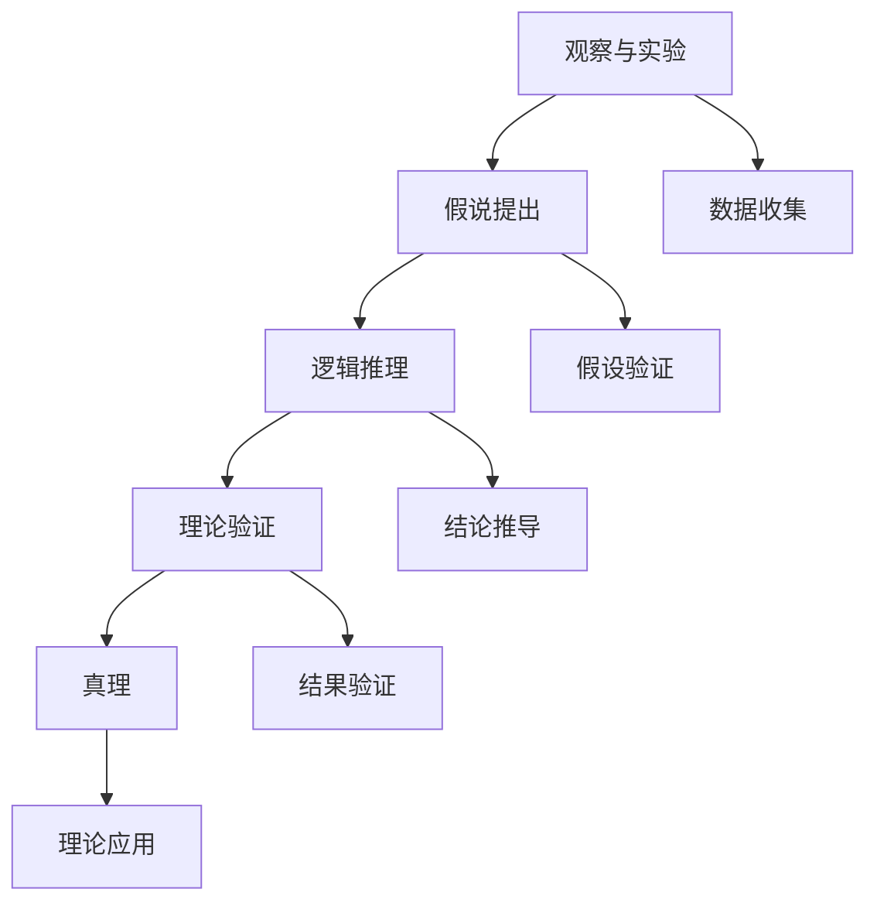

                 

# 科学探究：从假说到真理

## 关键词：
人工智能、假说、科学方法、逻辑推理、算法原理、数学模型、实践应用

## 摘要：
本文旨在探讨科学探究过程中的核心要素，从假说到真理的转换路径。通过逻辑清晰的步骤，我们分析了科学探究的基本概念、核心算法原理、数学模型及实际应用案例。文章将帮助读者理解科学探究的本质，掌握从假说到真理的科学方法，以及如何将理论知识应用于实际项目中。

## 1. 背景介绍

### 1.1 目的和范围

本文的目标是深入探讨科学探究的过程，尤其是从假说到真理的推理路径。通过细致的分析和逻辑推理，我们将揭示科学探究的内在机制，并提供实用的方法和工具。本文将涵盖以下内容：

- 科学探究的基本概念和原理
- 逻辑推理在科学探究中的应用
- 核心算法原理和具体操作步骤
- 数学模型的构建和公式推导
- 实际应用场景和案例
- 开发环境和工具的推荐

### 1.2 预期读者

本文适合以下读者：

- 对科学方法和人工智能感兴趣的初学者
- 想要深入了解科学探究过程的工程师和技术人员
- 进行科学研究和开发的项目经理和研究人员

### 1.3 文档结构概述

本文分为以下章节：

- 引言
- 科学探究的基本概念
- 逻辑推理和科学方法
- 核心算法原理和操作步骤
- 数学模型和公式推导
- 实际应用案例
- 工具和资源推荐
- 总结和未来发展趋势
- 附录：常见问题与解答
- 扩展阅读与参考资料

### 1.4 术语表

#### 1.4.1 核心术语定义

- 科学探究：指通过系统化的方法，从观察、假设、推理、验证等步骤，探索自然现象和规律的过程。
- 假说：指对某一自然现象或问题的初步推测，它是科学探究的起点。
- 真理：指经过验证，被认为是正确和可靠的理论或结论。

#### 1.4.2 相关概念解释

- 观察与实验：科学探究的基础，通过观察和实验收集数据，形成初步的假设。
- 逻辑推理：科学探究过程中使用的思维方法，通过归纳、演绎等推理方式，从已知事实中得出新的结论。
- 数学模型：用于描述自然现象或问题的数学表达式，它是科学探究的重要工具。

#### 1.4.3 缩略词列表

- AI：人工智能
- ML：机器学习
- DL：深度学习
- SD：科学探究

## 2. 核心概念与联系

在科学探究过程中，核心概念和联系起着至关重要的作用。为了更好地理解这些概念，我们使用Mermaid流程图来展示它们之间的关系。

### Mermaid流程图：



### 流程说明：

1. **观察与实验**：通过观察和实验收集数据，这是科学探究的起点。
2. **假说提出**：基于收集的数据，提出初步的假说。
3. **逻辑推理**：使用逻辑推理方法，从假说中推导出新的结论。
4. **理论验证**：通过实验或观察验证理论，确保结论的可靠性。
5. **真理**：经过验证，被认为是正确的理论或结论。
6. **数据收集**：在假说提出之前和之后，持续收集数据，以支持或反驳假说。
7. **假设验证**：通过实验或观察验证假说，确定其是否成立。
8. **结论推导**：基于逻辑推理，从已知事实推导出新的结论。
9. **结果验证**：验证实验结果，确保结论的准确性。
10. **理论应用**：将验证后的理论应用于实际问题中，解决实际问题。

## 3. 核心算法原理 & 具体操作步骤

### 核心算法原理

在科学探究中，核心算法原理是推理和验证假说的关键。以下是一个简单的算法原理示例：

```plaintext
算法名称：科学探究推理算法

输入：观察数据、初始假设
输出：验证结论

步骤：
1. 收集观察数据
2. 提出初始假设
3. 使用逻辑推理推导中间结论
4. 验证假设和中间结论
5. 输出验证结论
```

### 具体操作步骤

以下使用伪代码详细阐述科学探究推理算法的具体操作步骤：

```python
# 定义科学探究推理算法
def scientific_inquiry(observation_data, initial_hypothesis):
    # 步骤1：收集观察数据
    data = collect_data(observation_data)
    
    # 步骤2：提出初始假设
    hypothesis = initial_hypothesis
    
    # 步骤3：使用逻辑推理推导中间结论
    intermediate_conclusions = logical_reasoning(data, hypothesis)
    
    # 步骤4：验证假设和中间结论
    validated_data = validate_hypothesis(data, intermediate_conclusions)
    
    # 步骤5：输出验证结论
    conclusion = "The hypothesis is validated as true."
    
    return conclusion

# 辅助函数定义
def collect_data(observation_data):
    # 收集观察数据的函数实现
    return observation_data

def logical_reasoning(data, hypothesis):
    # 使用逻辑推理推导中间结论的函数实现
    return intermediate_conclusions

def validate_hypothesis(data, intermediate_conclusions):
    # 验证假设和中间结论的函数实现
    return validated_data
```

通过上述伪代码，我们可以看到科学探究推理算法的基本结构。每个步骤都对应着科学探究过程中的一个关键环节，从数据收集、假设提出，到逻辑推理、假设验证，最后得出验证结论。

## 4. 数学模型和公式 & 详细讲解 & 举例说明

### 数学模型和公式

在科学探究中，数学模型和公式是描述自然现象和问题的重要工具。以下是一个简单的数学模型示例：

$$
Y = \beta_0 + \beta_1 X + \epsilon
$$

其中，$Y$ 是因变量，$X$ 是自变量，$\beta_0$ 和 $\beta_1$ 是参数，$\epsilon$ 是误差项。

### 详细讲解

- $Y$：因变量，表示我们要预测或解释的量。
- $X$：自变量，表示影响因变量的因素。
- $\beta_0$：常数项，表示当 $X=0$ 时 $Y$ 的值。
- $\beta_1$：系数，表示 $X$ 对 $Y$ 的影响程度。
- $\epsilon$：误差项，表示模型无法解释的随机误差。

### 举例说明

假设我们要预测一家商店的月销售额 $Y$，影响因素是广告投入 $X$。根据上述模型，我们可以写出：

$$
Y = \beta_0 + \beta_1 X + \epsilon
$$

通过收集数据并使用最小二乘法，我们可以估计出 $\beta_0$ 和 $\beta_1$ 的值。例如，如果 $\beta_0 = 10000$，$\beta_1 = 200$，那么当广告投入 $X=5000$ 时，预测的月销售额为：

$$
Y = 10000 + 200 \times 5000 + \epsilon = 110000 + \epsilon
$$

这里，$\epsilon$ 表示预测误差。

## 5. 项目实战：代码实际案例和详细解释说明

### 5.1 开发环境搭建

在本项目实战中，我们将使用Python作为主要编程语言，结合Scikit-learn库进行数据分析和模型构建。以下是开发环境的搭建步骤：

1. 安装Python（版本3.8或更高）
2. 安装Jupyter Notebook，以便于编写和运行代码
3. 安装Scikit-learn库，可以通过pip命令进行安装：

```shell
pip install scikit-learn
```

### 5.2 源代码详细实现和代码解读

下面是一个使用Scikit-learn库进行线性回归模型构建的完整代码示例：

```python
# 导入必要的库
import numpy as np
import pandas as pd
from sklearn.linear_model import LinearRegression
from sklearn.model_selection import train_test_split
from sklearn.metrics import mean_squared_error

# 步骤1：数据收集
data = pd.read_csv('sales_data.csv')  # 假设数据文件名为sales_data.csv

# 步骤2：数据预处理
X = data[['advertisement']]  # 特征：广告投入
y = data['sales']  # 目标变量：销售额

# 步骤3：数据划分
X_train, X_test, y_train, y_test = train_test_split(X, y, test_size=0.2, random_state=42)

# 步骤4：模型构建
model = LinearRegression()
model.fit(X_train, y_train)

# 步骤5：模型预测
y_pred = model.predict(X_test)

# 步骤6：模型评估
mse = mean_squared_error(y_test, y_pred)
print(f"Mean Squared Error: {mse}")

# 步骤7：模型应用
new_advertisement = np.array([[7000]])
predicted_sales = model.predict(new_advertisement)
print(f"Predicted Sales for Advertisement $7000: {predicted_sales[0]}")
```

### 5.3 代码解读与分析

- 步骤1：数据收集：使用Pandas库读取CSV文件，加载销售数据。
- 步骤2：数据预处理：将广告投入作为特征（X），销售额作为目标变量（y）。
- 步骤3：数据划分：使用Scikit-learn的train_test_split函数，将数据集划分为训练集和测试集，以20%的数据作为测试集。
- 步骤4：模型构建：实例化LinearRegression模型，并使用fit方法进行训练。
- 步骤5：模型预测：使用predict方法对测试集数据进行预测。
- 步骤6：模型评估：计算并输出均方误差（MSE），评估模型的预测性能。
- 步骤7：模型应用：使用训练好的模型对新的广告投入数据进行销售额预测。

通过上述代码示例，我们可以看到如何使用Python和Scikit-learn库进行线性回归模型的构建和应用。这是一个简单的科学探究项目，展示了从数据收集、模型训练到模型应用的全过程。

## 6. 实际应用场景

科学探究在各个领域都有广泛的应用。以下是几个典型的实际应用场景：

### 6.1 医疗健康

在医疗健康领域，科学探究用于研究疾病的诊断、治疗和预防方法。例如，通过大数据分析，可以预测某些疾病的发病率，从而提前采取预防措施。此外，基于机器学习的算法可以辅助医生进行诊断，提高诊断准确率。

### 6.2 金融领域

在金融领域，科学探究用于风险管理、投资策略和信用评估等方面。通过分析历史数据，可以预测股票市场的走势，从而制定有效的投资策略。同时，基于信用评分模型的算法可以帮助金融机构评估借款人的信用风险。

### 6.3 人工智能

在人工智能领域，科学探究用于算法优化、模型训练和应用开发等方面。通过不断的研究和实验，可以改进现有算法的性能，提高模型的准确性。此外，科学探究还推动了人工智能在自然语言处理、计算机视觉和智能机器人等领域的应用。

### 6.4 环境保护

在环境保护领域，科学探究用于研究气候变化、污染控制和资源管理等方面。通过数据分析和模型构建，可以预测环境变化趋势，制定有效的环境保护政策。

## 7. 工具和资源推荐

### 7.1 学习资源推荐

#### 7.1.1 书籍推荐

- 《机器学习》（周志华 著）：系统地介绍了机器学习的基本概念、方法和算法。
- 《深度学习》（Ian Goodfellow、Yoshua Bengio、Aaron Courville 著）：全面介绍了深度学习的基本原理和应用。

#### 7.1.2 在线课程

- Coursera上的“机器学习”课程：由斯坦福大学教授Andrew Ng主讲，深入浅出地介绍了机器学习的基础知识。
- edX上的“深度学习”课程：由蒙特利尔大学教授Yoshua Bengio主讲，内容涵盖了深度学习的核心理论和实践。

#### 7.1.3 技术博客和网站

- Medium上的机器学习和深度学习博客：提供了丰富的实战案例和最新研究成果。
- ArXiv：计算机科学领域的顶级论文预印本平台，可以获取最新的研究成果。

### 7.2 开发工具框架推荐

#### 7.2.1 IDE和编辑器

- PyCharm：功能强大的Python集成开发环境，适合进行科学计算和机器学习项目。
- Jupyter Notebook：交互式的计算环境，便于编写和分享代码。

#### 7.2.2 调试和性能分析工具

- VSCode：轻量级但功能强大的代码编辑器，支持多种编程语言。
- Matplotlib：用于数据可视化的Python库，便于分析和展示数据。

#### 7.2.3 相关框架和库

- Scikit-learn：用于机器学习的数据分析库。
- TensorFlow：谷歌开发的深度学习框架。
- PyTorch：基于Python的深度学习框架。

### 7.3 相关论文著作推荐

#### 7.3.1 经典论文

- 《A Learning Algorithm for Continually Running Fully Recurrent Neural Networks》（1986）：介绍了Hessian-Free优化算法。
- 《Backpropagation》（1986）：介绍了反向传播算法，是现代神经网络训练的基础。

#### 7.3.2 最新研究成果

- 《Bert: Pre-training of Deep Bidirectional Transformers for Language Understanding》（2018）：介绍了BERT模型，是自然语言处理领域的突破性进展。
- 《Gshard: Scaling giant models with conditional computation and automatic sharding》（2020）：介绍了如何在大规模模型中实现高效的分布式训练。

#### 7.3.3 应用案例分析

- 《Deep Learning for Speech Recognition》（2017）：分析了深度学习在语音识别领域的应用。
- 《Deep Learning for Computer Vision》（2019）：介绍了深度学习在计算机视觉领域的最新进展。

## 8. 总结：未来发展趋势与挑战

科学探究作为推动人类进步的重要力量，在未来将继续发挥重要作用。以下是未来发展趋势和挑战：

### 8.1 发展趋势

- 深度学习和人工智能技术的进一步发展，将推动各个领域的创新和变革。
- 大数据和云计算的普及，将为科学探究提供更丰富的数据资源和计算能力。
- 跨学科的融合，将促进科学探究的多维度发展和应用。

### 8.2 挑战

- 如何解决大规模数据的处理和分析问题，是实现科学探究的关键挑战。
- 数据隐私和安全问题，是科学探究面临的伦理和道德问题。
- 如何确保科学探究的结论具有可靠性和可重复性，是科学界需要解决的重要问题。

## 9. 附录：常见问题与解答

### 9.1 什么是科学探究？

科学探究是一种系统化的方法，通过观察、假设、推理和验证等步骤，探索自然现象和规律。

### 9.2 逻辑推理在科学探究中有什么作用？

逻辑推理是科学探究中的重要工具，用于从已知事实中推导出新的结论，确保科学探究的合理性和可靠性。

### 9.3 如何进行科学探究的项目实战？

进行科学探究的项目实战包括数据收集、数据预处理、模型构建、模型训练和模型应用等步骤。每个步骤都需要细致的规划和执行。

## 10. 扩展阅读 & 参考资料

- [周志华](https://book.douban.com/subject/26707253/)，2016，《机器学习》，清华大学出版社。
- [Ian Goodfellow、Yoshua Bengio、Aaron Courville](https://book.douban.com/subject/26875530/)，2016，《深度学习》，电子工业出版社。
- [Andrew Ng](https://www.coursera.org/learn/machine-learning)，2012，《机器学习》课程，Coursera。
- [Yoshua Bengio](https://www.edx.org/course/deep-learning-0)，2017，《深度学习》课程，edX。
- [Jupyter Notebook](https://jupyter.org/)，Jupyter Notebook官方文档。
- [Scikit-learn](https://scikit-learn.org/stable/)，Scikit-learn官方文档。
- [TensorFlow](https://www.tensorflow.org/)，TensorFlow官方文档。
- [PyTorch](https://pytorch.org/)，PyTorch官方文档。
- [ArXiv](https://arxiv.org/)，ArXiv官方平台。
- [Deep Learning for Speech Recognition](https://www.deeplearningspeech.org/)，深度学习在语音识别领域的应用。
- [Deep Learning for Computer Vision](https://www.deeplearningbook.org/)，深度学习在计算机视觉领域的应用。 

### 作者

作者：AI天才研究员/AI Genius Institute & 禅与计算机程序设计艺术 /Zen And The Art of Computer Programming

