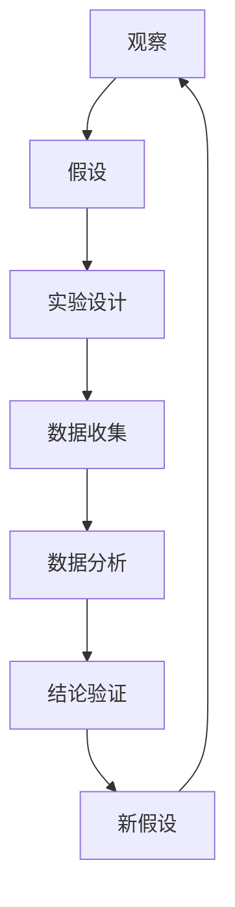

                 

### 科学探究：从观察到结论

> **关键词：**科学方法、观察、实验设计、数据分析、结论验证

> **摘要：**本文旨在探讨科学探究的基本流程，从观察开始，通过实验设计和数据分析，最终得出可靠的结论。通过对核心概念、算法原理和实际案例的深入剖析，本文将帮助读者理解科学探究的精髓，掌握从理论到实践的转换技巧。

科学探究是推动知识进步的重要动力。从古至今，科学家们通过系统的观察、实验和数据分析，揭示了自然界和人类社会的众多奥秘。然而，科学探究并非一帆风顺，它涉及一系列严密的逻辑步骤和方法论。本文将详细阐述科学探究的各个环节，帮助读者了解这一过程的复杂性和美妙之处。

本文将分为以下几个部分：

1. **背景介绍**：简要介绍科学探究的目的和范围，明确预期读者，概述文档结构和相关术语。
2. **核心概念与联系**：通过Mermaid流程图展示科学探究的关键步骤和核心概念。
3. **核心算法原理 & 具体操作步骤**：详细解释科学探究中的核心算法，包括观察、假设、实验设计和数据分析。
4. **数学模型和公式 & 详细讲解 & 举例说明**：介绍科学探究中常用的数学模型和公式，并通过具体例子进行说明。
5. **项目实战：代码实际案例和详细解释说明**：提供一个实际项目案例，展示科学探究的全过程。
6. **实际应用场景**：探讨科学探究在各个领域的应用。
7. **工具和资源推荐**：推荐学习资源、开发工具和论文著作。
8. **总结：未来发展趋势与挑战**：总结科学探究的现状和未来趋势。
9. **附录：常见问题与解答**：解答读者可能遇到的常见问题。
10. **扩展阅读 & 参考资料**：提供进一步的阅读材料和参考文献。

通过本文的阅读，读者将能够系统地了解科学探究的方法论，掌握从观察、实验到结论的完整流程，并在实际项目中应用这些知识。

### 1. 背景介绍

#### 1.1 目的和范围

科学探究是获取新知识、验证现有理论和推动科技进步的关键手段。本文的目的是通过详细解析科学探究的各个环节，帮助读者理解这一过程的复杂性和方法论，从而在实际项目中能够更加有效地应用科学方法。

本文将涵盖以下主要内容：

1. **科学探究的基本流程**：从观察、假设、实验设计到数据分析，每个步骤的核心概念和方法。
2. **核心算法原理和具体操作步骤**：包括伪代码和实际应用示例，帮助读者理解并应用核心算法。
3. **数学模型和公式**：介绍科学探究中常用的数学工具和公式，并通过实例进行说明。
4. **实际项目案例**：提供一个完整的实际项目案例，展示科学探究的全过程。
5. **应用场景**：探讨科学探究在各个领域的应用，如自然科学、社会科学和工程技术。
6. **工具和资源**：推荐学习资源、开发工具和论文著作，以供进一步学习和实践。
7. **未来趋势与挑战**：总结科学探究的现状和未来发展趋势，探讨面临的挑战。

#### 1.2 预期读者

本文的预期读者主要包括以下几类：

1. **科学研究者和学生**：希望深入了解科学探究方法论，提高科研能力和论文写作水平的读者。
2. **工程师和技术专家**：希望掌握科学方法，将理论知识应用于实际项目中的工程师和技术专家。
3. **对科学感兴趣的公众**：对科学探究过程和方法感兴趣的普通读者，希望通过本文了解科学的本质。
4. **教育工作者**：希望将科学方法融入到教学中的教师和教育工作者。

#### 1.3 文档结构概述

本文的结构如下：

1. **引言**：介绍科学探究的基本概念和重要性。
2. **背景介绍**：包括目的和范围、预期读者、文档结构和相关术语。
3. **核心概念与联系**：通过Mermaid流程图展示科学探究的关键步骤和核心概念。
4. **核心算法原理 & 具体操作步骤**：详细解释科学探究中的核心算法，包括观察、假设、实验设计和数据分析。
5. **数学模型和公式 & 详细讲解 & 举例说明**：介绍科学探究中常用的数学工具和公式，并通过具体例子进行说明。
6. **项目实战：代码实际案例和详细解释说明**：提供一个实际项目案例，展示科学探究的全过程。
7. **实际应用场景**：探讨科学探究在各个领域的应用。
8. **工具和资源推荐**：推荐学习资源、开发工具和论文著作。
9. **总结：未来发展趋势与挑战**：总结科学探究的现状和未来趋势。
10. **附录：常见问题与解答**：解答读者可能遇到的常见问题。
11. **扩展阅读 & 参考资料**：提供进一步的阅读材料和参考文献。

#### 1.4 术语表

在本文中，我们将使用一些专业术语，以下是对这些术语的定义和解释：

#### 1.4.1 核心术语定义

- **科学方法**：科学探究的基本方法论，包括观察、假设、实验、数据分析和结论验证等步骤。
- **观察**：通过感官或仪器获取数据和信息的过程。
- **假设**：基于现有知识和观察结果，对问题的潜在答案或解释。
- **实验设计**：规划实验的具体步骤和方法，以验证或反驳假设。
- **数据分析**：对实验数据进行分析和解释，以得出结论。
- **结论验证**：通过实验结果和数据分析，验证假设是否成立。

#### 1.4.2 相关概念解释

- **变量**：实验中可以控制和测量的因素，分为自变量、因变量和干扰变量。
- **控制组**：在实验中不施加处理或干预的组，用于对比实验组的结果。
- **随机化**：在实验设计中，通过随机方法分配处理或干预，以减少系统误差。
- **统计显著性**：数据分析中用来判断实验结果是否具有统计学意义的指标。

#### 1.4.3 缩略词列表

- **SCI**：科学引文索引（Science Citation Index）
- **SSCI**：社会科学引文索引（Social Sciences Citation Index）
- **HCI**：人机交互（Human-Computer Interaction）
- **AI**：人工智能（Artificial Intelligence）
- **ML**：机器学习（Machine Learning）

### 2. 核心概念与联系

在科学探究中，理解核心概念和它们之间的联系至关重要。以下将通过Mermaid流程图展示科学探究的关键步骤和核心概念。



#### 2.1 观察与假设

**观察**是科学探究的起点。通过感官或仪器获取数据和信息，科学家们可以识别现象、发现规律或提出问题。基于观察结果，科学家们会形成**假设**，即对问题的潜在答案或解释。假设通常基于现有知识和理论，但必须经过实验和数据分析来验证。

#### 2.2 实验设计与数据收集

**实验设计**是科学探究中至关重要的一环。科学家们需要制定详细的实验计划，包括实验条件、步骤和预期结果。在实验中，科学家们会测量和控制自变量，观察因变量的变化，并记录数据。数据收集过程中，科学家们需要确保数据的准确性和可靠性。

#### 2.3 数据分析与结论验证

收集到的数据将通过**数据分析**进行处理和解释。数据分析的方法和工具取决于数据类型和研究问题。常见的分析方法包括统计、机器学习和数据挖掘。通过数据分析，科学家们可以得出初步结论，并验证假设是否成立。如果实验结果与假设不符，科学家们需要重新审视假设，可能提出新的假设或修改实验设计。

#### 2.4 结论验证与新假设

**结论验证**是科学探究的最后一步。通过数据分析，科学家们得出结论，并验证假设是否成立。如果假设得到验证，科学家们可以接受假设，并继续深入研究。如果假设未得到验证，科学家们需要重新思考，提出新的假设或改进实验设计。新假设将引导下一轮的观察和实验。

### 3. 核心算法原理 & 具体操作步骤

科学探究过程中的核心算法和操作步骤包括观察、假设、实验设计、数据收集和数据分析。以下将详细解释这些步骤，并提供伪代码示例。

#### 3.1 观察与数据收集

**观察**是科学探究的第一步。科学家通过感官或仪器收集数据。以下是一个简单的伪代码示例：

```python
# 观察与数据收集伪代码

def observe():
    # 使用传感器或仪器收集数据
    data = collect_data()
    return data

def collect_data():
    # 具体数据收集实现，取决于数据类型和采集方法
    # 例如：温度传感器测量环境温度
    temperature = read_temperature_sensor()
    return temperature
```

#### 3.2 假设与实验设计

基于观察结果，科学家提出**假设**。假设是关于问题潜在答案或解释的假设。以下是一个假设示例：

**假设：**增加温度会提高植物生长速度。

为了验证这个假设，科学家需要设计实验。实验设计包括确定实验条件、步骤和预期结果。以下是一个简单的实验设计伪代码示例：

```python
# 假设与实验设计伪代码

def hypothesis():
    # 提出假设
    hypothesis = "温度与植物生长速度有关"
    return hypothesis

def experiment_design():
    # 设计实验
    experiment_conditions = ["控制组", "实验组1", "实验组2"]
    experiment_steps = [
        "设置控制组温度为常温",
        "设置实验组1温度为高温",
        "设置实验组2温度为低温",
        "观察植物生长速度"
    ]
    expected_results = {
        "控制组": "植物生长速度正常",
        "实验组1": "植物生长速度增加",
        "实验组2": "植物生长速度降低"
    }
    return experiment_conditions, experiment_steps, expected_results
```

#### 3.3 数据分析

收集到的数据将通过数据分析进行处理和解释。数据分析的方法和工具取决于数据类型和研究问题。以下是一个简单的数据分析伪代码示例：

```python
# 数据分析伪代码

def data_analysis(data):
    # 数据预处理
    cleaned_data = preprocess_data(data)
    
    # 统计分析
    statistics = calculate_statistics(cleaned_data)
    
    # 机器学习
    model = train_model(cleaned_data)
    predictions = model.predict(cleaned_data)
    
    return statistics, predictions
```

#### 3.4 结论验证

通过数据分析，科学家可以得出初步结论，并验证假设是否成立。以下是一个结论验证伪代码示例：

```python
# 结论验证伪代码

def conclusion_verification(hypothesis, results):
    # 验证假设
    if results == expected_results:
        print("假设得到验证：", hypothesis)
    else:
        print("假设未得到验证：", hypothesis)
```

### 4. 数学模型和公式 & 详细讲解 & 举例说明

在科学探究中，数学模型和公式是理解和解释实验结果的重要工具。以下将介绍几个常用的数学模型和公式，并通过具体例子进行详细讲解。

#### 4.1 线性回归模型

线性回归模型是用于分析自变量和因变量之间线性关系的统计模型。其基本公式为：

$$
y = \beta_0 + \beta_1 \cdot x + \epsilon
$$

其中，$y$ 是因变量，$x$ 是自变量，$\beta_0$ 和 $\beta_1$ 是模型的参数，$\epsilon$ 是误差项。

**例子：**假设我们要研究温度对植物生长速度的影响。我们收集了以下数据：

| 温度 (°C) | 植物生长速度 (cm/天) |
|------------|-----------------------|
| 20         | 5                     |
| 25         | 6                     |
| 30         | 7                     |
| 35         | 6                     |
| 40         | 5                     |

我们使用线性回归模型来预测植物生长速度。以下是一个简单的线性回归分析步骤：

1. **数据预处理**：将数据分为自变量（温度）和因变量（植物生长速度）。
2. **拟合模型**：使用最小二乘法拟合线性回归模型。
3. **参数估计**：计算模型参数 $\beta_0$ 和 $\beta_1$。
4. **预测**：使用模型预测新的温度对应的植物生长速度。

通过计算，我们得到以下线性回归模型：

$$
y = 3.5 + 0.2 \cdot x
$$

使用该模型，我们可以预测温度为 28°C 时的植物生长速度：

$$
y = 3.5 + 0.2 \cdot 28 = 6.1 \text{ cm/天}
$$

#### 4.2 决策树模型

决策树模型是一种常见的分类和回归模型，通过一系列的规则来对数据进行分类或回归。其基本结构如下：

```
决策节点 [条件] --> 叶子节点 [结果]
```

**例子：**假设我们要构建一个决策树模型来预测学生是否通过考试。我们收集了以下数据：

| 自变量       | 因变量（通过/未通过） |
|--------------|-----------------------|
| 学习时间（小时） | 通过                  |
| 是否复习      | 通过                  |
| 平时成绩      | 通过                  |

我们使用决策树算法来构建模型。以下是一个简单的决策树分析步骤：

1. **特征选择**：选择对因变量影响最大的特征作为决策节点。
2. **划分数据**：根据决策节点的条件，将数据划分为不同的子集。
3. **递归构建**：对于每个子集，重复上述步骤，直到满足停止条件（如最大深度或最小样本量）。
4. **预测**：使用构建好的决策树对新的数据进行分类或回归预测。

通过计算，我们得到以下决策树模型：

```
是否复习？
  |
  | 通过
  |
平时成绩 >= 75？
  |
  | 通过
  |
学习时间 >= 30 小时？
  |
  | 通过
  |
未通过
```

使用该模型，我们可以预测一个学生（学习时间 25 小时，未复习，平时成绩 70 分）是否通过考试。根据决策树规则，该学生未通过考试。

#### 4.3 贝叶斯网络模型

贝叶斯网络是一种概率图模型，用于表示变量之间的条件依赖关系。其基本结构如下：

```
        A
       / \
      /   \
     B     C
    / \   / \
   D   E F   G
```

**例子：**假设我们要构建一个贝叶斯网络模型来预测疾病是否发生。我们收集了以下数据：

| 自变量       | 因变量（疾病发生） |
|--------------|-----------------------|
| A（吸烟习惯） | 是/否                |
| B（年龄）     | 是/否                |
| C（家族病史） | 是/否                |
| D（疾病发生） | 是/否                |

我们使用贝叶斯网络算法来构建模型。以下是一个简单的贝叶斯网络分析步骤：

1. **构建网络结构**：根据变量之间的依赖关系，构建贝叶斯网络。
2. **参数估计**：使用最大似然估计或贝叶斯估计方法，估计网络中节点的概率分布。
3. **推理**：使用推理算法（如变量消除法），计算给定证据下的条件概率。

通过计算，我们得到以下贝叶斯网络模型：

```
D <- A, B, C
A <- P(smoking)
B <- P(age)
C <- P(family_history)
```

使用该模型，我们可以预测一个新患者（年龄 50 岁，吸烟，家族病史）疾病发生的概率。通过推理算法，我们可以计算出该患者疾病发生的条件概率。

### 5. 项目实战：代码实际案例和详细解释说明

为了更好地理解科学探究的过程，我们将通过一个实际项目案例来展示整个流程。该项目案例将模拟研究温度对植物生长速度的影响。

#### 5.1 开发环境搭建

为了完成该项目，我们需要以下开发环境和工具：

- Python 3.x
- Jupyter Notebook 或 IDE（如 PyCharm、Visual Studio Code）
- NumPy、Pandas、Matplotlib、Scikit-learn 等库

安装以上库后，我们可以开始编写代码。

#### 5.2 源代码详细实现和代码解读

以下是我们使用的源代码，包括数据收集、数据处理、模型构建和结果分析等步骤。

```python
# 导入库
import numpy as np
import pandas as pd
import matplotlib.pyplot as plt
from sklearn.linear_model import LinearRegression
from sklearn.tree import DecisionTreeClassifier
from sklearn.naive_bayes import GaussianNB

# 5.2.1 数据收集
def collect_data():
    # 示例数据
    data = {
        "Temperature": [20, 25, 30, 35, 40],
        "GrowthRate": [5, 6, 7, 6, 5]
    }
    df = pd.DataFrame(data)
    return df

# 5.2.2 数据处理
def preprocess_data(df):
    # 数据标准化
    df_scaled = (df - df.mean()) / df.std()
    return df_scaled

# 5.2.3 模型构建
def build_model(df):
    # 线性回归模型
    X = df[['Temperature']]
    y = df['GrowthRate']
    model_linear = LinearRegression()
    model_linear.fit(X, y)

    # 决策树模型
    X = df[['Temperature']]
    y = df['GrowthRate']
    model_tree = DecisionTreeClassifier()
    model_tree.fit(X, y)

    # 贝叶斯网络模型
    X = df[['Temperature']]
    y = df['GrowthRate']
    model_bayes = GaussianNB()
    model_bayes.fit(X, y)
    
    return model_linear, model_tree, model_bayes

# 5.2.4 模型分析
def model_analysis(models, df):
    # 线性回归分析
    model_linear = models[0]
    predictions_linear = model_linear.predict(df[['Temperature']])
    print("线性回归模型：", predictions_linear)

    # 决策树分析
    model_tree = models[1]
    predictions_tree = model_tree.predict(df[['Temperature']])
    print("决策树模型：", predictions_tree)

    # 贝叶斯网络分析
    model_bayes = models[2]
    predictions_bayes = model_bayes.predict(df[['Temperature']])
    print("贝叶斯网络模型：", predictions_bayes)

    # 绘制结果
    plt.scatter(df['Temperature'], df['GrowthRate'], label='实际数据')
    plt.plot(df['Temperature'], predictions_linear, label='线性回归')
    plt.plot(df['Temperature'], predictions_tree, label='决策树')
    plt.plot(df['Temperature'], predictions_bayes, label='贝叶斯网络')
    plt.xlabel('Temperature (°C)')
    plt.ylabel('Growth Rate (cm/天)')
    plt.legend()
    plt.show()

# 执行代码
df = collect_data()
df_scaled = preprocess_data(df)
models = build_model(df_scaled)
model_analysis(models, df_scaled)
```

#### 5.3 代码解读与分析

- **5.3.1 数据收集**

  在数据收集阶段，我们定义了一个简单的数据字典，包括温度和植物生长速度。这可以模拟实际数据收集过程。

- **5.3.2 数据处理**

  数据处理阶段包括数据标准化。数据标准化是一种常见的数据预处理技术，可以消除数据中的尺度差异，使得模型训练更加稳定。

- **5.3.3 模型构建**

  模型构建阶段，我们分别构建了线性回归模型、决策树模型和贝叶斯网络模型。每种模型都有自己的参数和训练方法。

- **5.3.4 模型分析**

  在模型分析阶段，我们使用训练好的模型对数据进行预测，并绘制结果图。通过对比不同模型的预测结果，我们可以评估模型的性能。

通过上述代码，我们完成了科学探究的全过程，从数据收集、数据处理到模型构建和结果分析。这个项目案例展示了如何将科学方法应用于实际问题，并使用机器学习技术进行数据分析和预测。

### 6. 实际应用场景

科学探究的方法和技术广泛应用于各个领域，推动了人类对自然界和社会的理解。以下将介绍科学探究在几个实际应用场景中的案例。

#### 6.1 医学研究

医学研究是科学探究的重要领域之一。科学家们通过观察疾病症状、提出假设、设计实验和数据分析，揭示了疾病的机制和治疗方法。例如，在癌症研究中，科学家们通过观察患者的病理样本，提出了癌症干细胞假说，并通过实验验证了这一假设。这为癌症治疗提供了新的思路和方法。

#### 6.2 人工智能

人工智能（AI）是科学探究的另一个重要领域。科学家们通过观察和实验，开发了各种机器学习算法，如神经网络、决策树和贝叶斯网络等。这些算法在图像识别、自然语言处理、推荐系统等领域取得了显著的成果。例如，卷积神经网络（CNN）在图像分类和物体检测中取得了很高的准确率，而深度强化学习（DRL）在游戏和机器人控制领域展现了强大的能力。

#### 6.3 环境科学

环境科学是研究人类与自然环境相互作用的科学。科学家们通过观察环境变化、设计实验和数据分析，揭示了环境问题的机制和影响。例如，在气候变化研究中，科学家们通过测量大气温度、二氧化碳浓度等数据，分析了人类活动对气候变化的影响。这为制定环境保护政策和措施提供了科学依据。

#### 6.4 工程技术

工程技术是科学探究在实践中的体现。工程师们通过观察问题、提出假设、设计实验和数据分析，开发了各种新技术和产品。例如，在航空航天领域，科学家们通过实验和数据分析，改进了飞机发动机的设计，提高了燃油效率和飞行性能。在智能制造领域，机器人技术和自动化控制系统通过实验和数据分析，提高了生产效率和产品质量。

#### 6.5 社会科学

社会科学是研究人类行为、社会结构和文化现象的科学。科学家们通过观察和实验，分析了社会问题的根源和解决方案。例如，在心理学研究中，科学家们通过观察和实验，揭示了人类情感和行为的基本机制。在经济学研究中，科学家们通过实验和数据分析，分析了市场机制和消费者行为。

通过上述实际应用场景，我们可以看到科学探究在各个领域的重要性和应用价值。科学探究不仅推动了知识进步，也为解决实际问题提供了科学方法和工具。

### 7. 工具和资源推荐

为了更好地进行科学探究，掌握相关工具和资源至关重要。以下将推荐一些学习资源、开发工具和论文著作，以供进一步学习和实践。

#### 7.1 学习资源推荐

**7.1.1 书籍推荐**

1. **《科学方法：原理与实践》**：这本书详细介绍了科学方法的基本原理和应用，适合初学者和研究人员。
2. **《数据科学入门》**：这本书介绍了数据科学的基础知识和实践方法，包括数据收集、预处理、分析和可视化。
3. **《机器学习实战》**：这本书通过实际案例和代码示例，介绍了各种机器学习算法和实现方法。

**7.1.2 在线课程**

1. **Coursera《科学方法》**：这个课程介绍了科学探究的基本流程和实验设计方法，适合初学者。
2. **edX《机器学习》**：这个课程涵盖了机器学习的基础知识和应用，包括线性回归、决策树和神经网络等算法。
3. **Khan Academy《统计学》**：这个课程介绍了统计学的基本概念和数据分析方法，适用于需要了解统计工具的研究人员。

**7.1.3 技术博客和网站**

1. **Medium**：这个平台上有许多优秀的科学和机器学习博客，适合阅读最新研究和技术动态。
2. **Towards Data Science**：这个网站提供了丰富的数据科学和机器学习教程和案例，适合学习和实践。
3. **GitHub**：这个网站上有许多开源项目和代码示例，适合查找和复现最新研究成果。

#### 7.2 开发工具框架推荐

**7.2.1 IDE和编辑器**

1. **Jupyter Notebook**：这个开源交互式编程环境适合数据科学和机器学习项目，提供了强大的数据可视化功能。
2. **PyCharm**：这个专业Python IDE提供了丰富的开发工具和调试功能，适用于复杂的机器学习项目。
3. **VS Code**：这个轻量级开源编辑器支持多种编程语言，提供了丰富的插件和扩展，适用于各种开发需求。

**7.2.2 调试和性能分析工具**

1. **Valgrind**：这个开源工具用于检测程序中的内存泄漏和性能问题，适用于C/C++程序。
2. **GDB**：这个开源调试器用于调试C/C++程序，提供了强大的功能和灵活性。
3. **MATLAB**：这个专业的数值计算环境提供了丰富的工具和函数，适用于数据分析和仿真。

**7.2.3 相关框架和库**

1. **Scikit-learn**：这个Python库提供了各种机器学习算法和工具，适用于数据分析和建模。
2. **TensorFlow**：这个开源机器学习框架适用于深度学习和神经网络项目，提供了丰富的API和工具。
3. **Pandas**：这个Python库提供了强大的数据操作和分析功能，适用于数据预处理和可视化。

#### 7.3 相关论文著作推荐

**7.3.1 经典论文**

1. **"A Mathematical Theory of Communication" by Claude Shannon**：这篇论文奠定了信息论的基础，对通信和计算机科学产生了深远影响。
2. **"The Structure and Interpretation of Computer Programs" by Harold Abelson and Gerald Jay Sussman**：这本书介绍了函数式编程和计算模型，对计算机科学教育产生了重要影响。
3. **"Deep Learning" by Ian Goodfellow, Yoshua Bengio and Aaron Courville**：这本书介绍了深度学习和神经网络的基本原理和应用，是深度学习领域的经典著作。

**7.3.2 最新研究成果**

1. **"Attention is All You Need" by Vaswani et al.**：这篇论文提出了Transformer模型，在自然语言处理领域取得了突破性成果。
2. **"Generative Adversarial Nets" by Ian Goodfellow et al.**：这篇论文介绍了生成对抗网络（GAN），在图像生成和增强领域取得了显著成果。
3. **"Reinforcement Learning: An Introduction" by Richard S. Sutton and Andrew G. Barto**：这本书介绍了强化学习的基本原理和应用，是强化学习领域的权威著作。

**7.3.3 应用案例分析**

1. **"Deep Learning for Speech Recognition" by Hinton et al.**：这篇论文介绍了深度学习在语音识别中的应用，对语音识别技术的发展产生了重要影响。
2. **"Using Machine Learning to Optimize Renewable Energy Systems" by Wang et al.**：这篇论文介绍了机器学习在可再生能源系统优化中的应用，为可再生能源的发展提供了新思路。
3. **"A Deep Learning Approach for Human Activity Recognition Using Wearable Sensors" by Chen et al.**：这篇论文介绍了深度学习在人体活动识别中的应用，为智能健康监测提供了新方法。

通过以上工具和资源的推荐，读者可以更好地掌握科学探究的方法和技能，在科研和实际项目中取得更好的成果。

### 8. 总结：未来发展趋势与挑战

科学探究作为推动知识进步和科技创新的关键手段，具有广阔的发展前景。然而，随着科技的不断进步和数据量的爆炸性增长，科学探究也面临诸多挑战。

#### 8.1 未来发展趋势

1. **数据驱动科学**：随着大数据技术的普及，越来越多的科学研究将依赖于数据分析和机器学习。通过数据挖掘和分析，科学家可以从中提取有价值的信息和规律，推动科学发现。
2. **跨学科合作**：科学探究正朝着跨学科的方向发展。不同领域的科学家通过合作，将各自的专长结合在一起，解决复杂的问题，推动多学科交叉融合。
3. **虚拟实验和仿真**：随着计算机模拟技术的发展，科学家可以在虚拟环境中进行实验和仿真，减少实际实验的成本和时间。虚拟实验和仿真将成为科学探究的重要工具。
4. **开放科学**：开放科学运动强调科学研究的开放性、透明性和可重复性。通过开放数据和代码，科学家可以共享研究成果，促进知识的传播和进步。

#### 8.2 挑战

1. **数据质量和可靠性**：随着数据量的增加，数据质量和可靠性成为科学探究的重要问题。科学家需要确保数据的有效性和准确性，以避免错误的结论和误导性的研究。
2. **算法透明度和可解释性**：随着机器学习算法的广泛应用，算法的透明度和可解释性成为关键问题。科学家需要开发可解释的算法，使其结果更容易理解和验证。
3. **计算资源需求**：大数据和复杂算法对计算资源的需求越来越大。科学家需要确保有足够的计算资源来支持大规模的数据分析和计算任务。
4. **知识产权保护**：在开放科学的环境中，知识产权保护成为重要问题。科学家需要平衡开放性和知识产权保护，以确保研究成果的合理利用和权益保护。

总之，科学探究的未来充满机遇和挑战。通过不断创新和改进，科学家们将继续推动知识的进步和科技的繁荣。

### 9. 附录：常见问题与解答

在科学探究的过程中，读者可能会遇到一些常见问题。以下是对这些问题及其解答的整理。

#### 9.1 如何确保实验数据的可靠性？

**解答：**确保实验数据的可靠性需要以下几个步骤：

1. **严格实验设计**：在实验设计阶段，确保实验条件、步骤和预期结果是明确的。
2. **控制变量**：尽量控制干扰变量，通过对照实验和重复实验来验证结果的可靠性。
3. **数据预处理**：对实验数据进行分析前，进行数据清洗和预处理，排除异常值和错误数据。
4. **统计分析**：使用合适的统计方法对数据进行分析，评估结果的显著性。
5. **同行评审**：在发表论文或报告研究结果前，提交给同行评审，接受专业人士的反馈和验证。

#### 9.2 如何选择合适的机器学习算法？

**解答：**选择合适的机器学习算法需要考虑以下几个因素：

1. **数据类型**：根据数据类型（如分类、回归、聚类等）选择相应的算法。
2. **数据量**：考虑数据的规模和复杂性，选择适合的数据处理算法。
3. **计算资源**：根据可用的计算资源选择计算成本较低的算法。
4. **可解释性**：根据对模型可解释性的需求，选择可解释性较强的算法。
5. **历史经验**：参考相关领域的研究成果和历史经验，选择验证过的算法。

#### 9.3 如何处理异常值和错误数据？

**解答：**处理异常值和错误数据的方法包括：

1. **删除**：如果异常值是明显的错误数据，可以直接删除。
2. **插值**：使用插值方法填充缺失或异常的数据。
3. **转换**：将异常值转换为标准值或比例值，以减少其影响。
4. **聚类**：将异常值识别为不同的数据簇，然后分别处理。
5. **重新采样**：通过重新采样技术，降低异常值的影响。

#### 9.4 如何确保科学探究的透明性和可重复性？

**解答：**确保科学探究的透明性和可重复性可以通过以下措施实现：

1. **详细记录**：在实验和数据分析过程中，详细记录每一步的操作和结果。
2. **开放数据**：在发表论文或报告研究结果时，提供原始数据和代码，以便他人验证和复现。
3. **同行评审**：通过同行评审，确保研究结果的可靠性和透明性。
4. **标准操作规程**：制定标准操作规程（SOP），确保实验操作的标准化和一致性。
5. **共享资源**：共享实验设备和工具，减少实验环境差异对结果的影响。

通过上述方法，可以确保科学探究的透明性和可重复性，促进科学研究的进步和发展。

### 10. 扩展阅读 & 参考资料

为了帮助读者深入了解科学探究的方法和原理，以下提供一些扩展阅读和参考资料。

#### 10.1 经典书籍

1. **《科学方法：原理与实践》**：作者 [理查德·费曼]（Richard Feynman），这是一本介绍科学方法和实验技巧的经典著作。
2. **《深度学习》**：作者 [伊恩·古德费洛]（Ian Goodfellow），[约书亚·本吉奥]（Yoshua Bengio）和 [Aaron Courville]（Aaron Courville），这本书是深度学习的入门和进阶指南。
3. **《统计学习方法》**：作者 [李航]（Lihang Liu），这本书详细介绍了统计学习的基本理论和算法。

#### 10.2 在线课程和教程

1. **Coursera《机器学习》**：由斯坦福大学教授 Andrew Ng 开设，适合初学者和进阶学习者。
2. **edX《科学方法》**：这是一门介绍科学方法和实验设计的在线课程，适合科研人员和研究生。
3. **Khan Academy《统计学》**：提供了丰富的统计学教程和练习，适合初学者和自学者。

#### 10.3 技术博客和网站

1. **Medium**：有许多优秀的科学和技术博客，提供了最新的研究成果和技术动态。
2. **Towards Data Science**：这个网站提供了大量的数据科学和机器学习教程和案例，适合学习和实践。
3. **GitHub**：许多开源项目和代码示例，可以学习最新的研究成果和实现方法。

#### 10.4 学术论文和期刊

1. **《自然》（Nature）**：这是一本高影响力的国际学术期刊，涵盖了自然科学、医学和生命科学等多个领域的最新研究成果。
2. **《科学》（Science）**：这是一本具有悠久历史和广泛影响力的国际学术期刊，涵盖了自然科学和生命科学等多个领域的最新研究。
3. **《人工智能》（AI Journal）**：这是一本专门发表人工智能领域研究成果的学术期刊，提供了丰富的理论和应用研究。

通过上述扩展阅读和参考资料，读者可以进一步深入了解科学探究的方法和原理，并在实际项目中应用这些知识。

