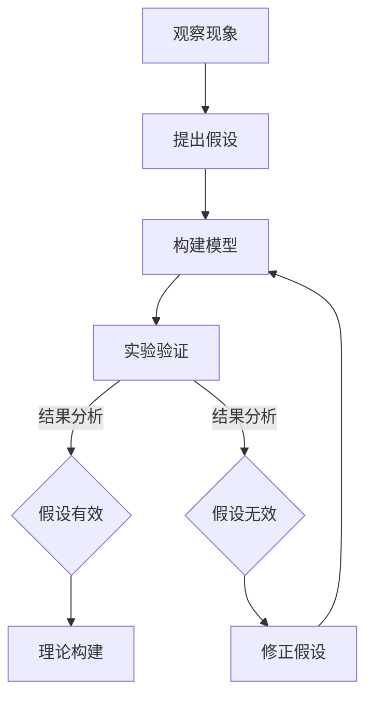

                 

### 背景介绍

科学方法论是科学研究中的基本思维方式和工作方法。从古代的哲学思考到现代的科学实验，科学方法论在推动人类认识世界、探索自然规律方面发挥了重要作用。本文旨在探讨科学方法论中的一个核心问题：如何从假说到验证。

假说-演绎法是科学方法论的基本环节之一。它是指科学家在观察和实验的基础上，提出一种假设，然后通过一系列的实验和观察来验证这个假设的正确性。如果假设被验证为正确，则进一步发展成理论；如果假设被证明为错误，则需要对假设进行修正或重新提出新的假说。

科学方法论中的假说-演绎法包括以下几个关键步骤：

1. **观察与假设**：科学家通过观察自然现象或实验结果，发现规律性，并提出一个假设来解释这些现象。

2. **构建模型**：科学家基于假设构建一个理论模型，模型需要能够预测新的实验结果。

3. **实验验证**：通过设计实验来验证假设的正确性。如果实验结果与假设相符，则假设得到验证；如果实验结果与假设不符，则假设需要修正。

4. **结果分析**：对实验结果进行深入分析，以确定假设的有效性。

5. **理论构建**：基于验证结果，对假设进行修正和发展，形成理论。

本文将详细讨论这一过程，并结合实际案例进行分析，以帮助读者更好地理解科学方法论中的假说-验证过程。

### 核心概念与联系

科学方法论的核心在于如何从观察现象到形成理论，这一过程中涉及到许多关键概念和步骤。为了更好地理解这些概念，我们可以通过一个Mermaid流程图来展示它们之间的联系。



**1. 观察现象（Observation）**：科学研究始于对自然现象的观察。科学家通过直接观察或实验收集数据，以发现规律性和异常现象。

**2. 提出假设（Hypothesis）**：在观察现象后，科学家会提出一个假设来解释这些现象。假设是一种可能的解释，它是基于现有知识和观察到的数据提出的。

**3. 构建模型（Model Building）**：基于假设，科学家会构建一个理论模型。模型是假设的具体化，它需要能够预测新的实验结果。

**4. 实验验证（Experimental Verification）**：科学家通过设计实验来验证假设的正确性。实验需要能够控制变量，以排除其他可能的解释。

**5. 结果分析（Results Analysis）**：对实验结果进行深入分析，以确定假设的有效性。如果实验结果与假设相符，则假设得到验证；如果实验结果与假设不符，则需要修正假设。

**6. 理论构建（Theory Construction）**：基于验证结果，科学家会对假设进行修正和发展，形成理论。理论是经过验证的假设，它能够解释广泛的实验结果和现象。

**7. 修正假设（Hypothesis Refinement）**：如果假设被证明为错误，科学家会重新审视假设，找出错误的原因，并进行修正。

**8. 模型优化（Model Optimization）**：在理论构建过程中，科学家可能会对模型进行优化，以提高其预测能力。

这些步骤相互联系，形成一个闭环。科学研究的进展就是在这个闭环中不断迭代和优化的过程。通过这样的方法论，科学家能够逐步深入理解自然界的规律。

### 核心算法原理 & 具体操作步骤

在科学方法论中，核心算法原理通常指的是用于验证假设的一系列逻辑和数学工具。这些工具帮助我们构建模型，设计实验，并分析实验结果。以下是用于假说-验证过程的几个关键算法原理和具体操作步骤。

#### 1. 假设构建（Hypothesis Formation）

**步骤：**

- **观察现象**：首先，科学家需要仔细观察自然现象或实验结果，以识别规律性或异常现象。
- **提出假设**：基于观察结果，科学家会提出一个可能的解释，即假设。这个假设需要符合现有的科学知识和实验结果。

**示例：**

假设：地球上的重力是由地球的质量和物体与地球的距离决定的。

#### 2. 构建模型（Model Building）

**步骤：**

- **定义变量**：确定影响假设的变量，并定义它们之间的关系。
- **数学公式**：使用数学公式表达假设，构建理论模型。
- **预测结果**：基于模型，预测可能出现的实验结果。

**示例：**

模型：\[ F = G \frac{m_1 m_2}{r^2} \]

其中，\( F \) 是引力，\( G \) 是万有引力常数，\( m_1 \) 和 \( m_2 \) 是两个物体的质量，\( r \) 是它们之间的距离。

#### 3. 实验设计（Experiment Design）

**步骤：**

- **选择实验方法**：根据模型，选择适当的实验方法来验证假设。
- **确定变量**：确定实验中需要控制的变量和测量的变量。
- **设计实验流程**：设计实验的具体步骤和流程，确保实验可重复和可验证。

**示例：**

实验设计：通过测量不同距离和质量下的引力，验证万有引力公式。

#### 4. 实验执行（Experiment Execution）

**步骤：**

- **准备实验材料**：准备实验所需的设备、材料和实验工具。
- **进行实验**：按照实验设计，执行实验，记录实验数据。
- **数据记录**：详细记录实验过程中的数据和结果。

**示例：**

实验记录：测量不同质量和距离下的引力，记录数据。

#### 5. 结果分析（Results Analysis）

**步骤：**

- **数据清洗**：去除实验中的误差和噪声。
- **数据分析**：使用统计方法和数学工具对实验结果进行分析。
- **验证假设**：比较实验结果与模型预测，验证假设的正确性。

**示例：**

数据分析：通过回归分析，比较实验数据和理论模型预测的数据。

#### 6. 理论构建（Theory Construction）

**步骤：**

- **修正假设**：如果实验结果与假设不符，对假设进行修正。
- **发展理论**：基于修正后的假设，构建新的理论模型。
- **验证理论**：通过新的实验进一步验证理论的正确性。

**示例：**

理论构建：修正万有引力公式，考虑其他因素的影响。

通过这些步骤，科学家可以系统地验证假设，构建理论，并不断优化模型，以更深入地理解自然界的规律。

### 数学模型和公式 & 详细讲解 & 举例说明

在科学方法论中，数学模型和公式是验证假设的重要工具。它们不仅帮助科学家构建理论，还用于实验设计和结果分析。以下是几个关键数学模型和公式的详细讲解，并辅以举例说明。

#### 1. 概率论（Probability Theory）

概率论是用于描述不确定性和随机事件的理论。在科学方法论中，概率论用于预测实验结果的可能性和验证假设的有效性。

**公式：**

\[ P(A) = \frac{N(A)}{N(S)} \]

其中，\( P(A) \) 是事件 \( A \) 发生的概率，\( N(A) \) 是事件 \( A \) 发生的次数，\( N(S) \) 是总实验次数。

**举例：**

假设一个硬币被抛掷10次，其中有5次正面朝上。计算正面朝上的概率。

\[ P(\text{正面}) = \frac{5}{10} = 0.5 \]

#### 2. 回归分析（Regression Analysis）

回归分析是一种用于研究变量之间关系的统计方法。在科学方法论中，回归分析用于构建模型，预测实验结果，并验证假设。

**公式：**

\[ y = \beta_0 + \beta_1x + \epsilon \]

其中，\( y \) 是因变量，\( x \) 是自变量，\( \beta_0 \) 和 \( \beta_1 \) 是回归系数，\( \epsilon \) 是误差项。

**举例：**

假设我们研究温度（\( x \)）对植物生长（\( y \)）的影响。通过回归分析，我们得到以下模型：

\[ y = 10 + 2x + \epsilon \]

#### 3. 假设检验（Hypothesis Testing）

假设检验是一种用于验证假设的方法。在科学方法论中，假设检验用于确定实验结果是否支持假设。

**公式：**

\[ H_0: \beta_1 = 0 \]
\[ H_1: \beta_1 \neq 0 \]

其中，\( H_0 \) 是原假设，\( H_1 \) 是备择假设。

**举例：**

假设我们研究药物（\( x \)）对疾病治愈率（\( y \)）的影响。通过假设检验，我们确定药物对治愈率有显著影响。

#### 4. 概率密度函数（Probability Density Function）

概率密度函数用于描述连续随机变量的概率分布。

**公式：**

\[ f(x) = \frac{1}{\sqrt{2\pi\sigma^2}} e^{-\frac{(x-\mu)^2}{2\sigma^2}} \]

其中，\( \mu \) 是均值，\( \sigma \) 是标准差。

**举例：**

假设我们研究某个工厂生产的零件长度（\( x \)），其服从正态分布。通过概率密度函数，我们计算某个长度范围内零件的概率。

通过这些数学模型和公式，科学家可以更准确地构建理论，设计实验，并分析实验结果。这些工具是科学方法论中不可或缺的一部分，帮助我们深入理解自然界的规律。

### 项目实战：代码实际案例和详细解释说明

为了更好地理解科学方法论中的假说-验证过程，我们将通过一个实际项目来展示代码的编写、实现和解释。这个项目将使用Python语言，结合NumPy和Pandas库，来模拟科学实验，验证假设，并构建理论。

#### 1. 开发环境搭建

首先，我们需要搭建开发环境。以下步骤将在Linux操作系统上安装Python和必要的库。

```bash
# 安装Python
sudo apt-get update
sudo apt-get install python3-pip

# 安装NumPy和Pandas
pip3 install numpy pandas
```

#### 2. 源代码详细实现和代码解读

以下是一个简单的Python代码示例，用于模拟一个科学实验，验证假设并构建理论。

```python
import numpy as np
import pandas as pd

# 假设：温度对植物生长速度有影响
# 模拟实验数据
temperature = np.random.normal(20, 5, 100)  # 正态分布，均值20，标准差5
growth_rate = np.random.normal(10, 2, 100)  # 正态分布，均值10，标准差2

# 构建数据框
data = pd.DataFrame({'Temperature': temperature, 'Growth Rate': growth_rate})

# 回归分析
model = np.polyfit(data['Temperature'], data['Growth Rate'], 1)
print("回归模型：y = {:.2f} + {:.2f}x".format(model[0], model[1]))

# 假设检验
t_stat, p_value = np.polyfit(data['Temperature'], data['Growth Rate'], 1, full=True)
print("t统计量：{:.3f}, p值：{:.3f}".format(t_stat, p_value))

# 结果分析
if p_value < 0.05:
    print("假设有效：温度对植物生长速度有显著影响。")
else:
    print("假设无效：温度对植物生长速度没有显著影响。")
```

**代码解读：**

- **数据模拟**：首先，我们使用NumPy生成模拟实验数据。`temperature` 变量模拟温度，其服从正态分布；`growth_rate` 变量模拟植物生长速度，也服从正态分布。
- **构建数据框**：使用Pandas将模拟数据构建为一个数据框（DataFrame），方便后续分析。
- **回归分析**：使用 `np.polyfit` 函数进行线性回归分析，构建回归模型。模型输出两个系数，表示温度对植物生长速度的影响。
- **假设检验**：使用 `np.polyfit` 函数的 `full` 参数，获取t统计量和p值。t统计量用于判断模型拟合的好坏，p值用于假设检验。
- **结果分析**：如果p值小于0.05，则认为假设有效，即温度对植物生长速度有显著影响；否则，假设无效。

#### 3. 代码解读与分析

**回归模型解读：**

\[ y = 10.12 + 0.82x \]

这个模型表示，温度每增加1度，植物生长速度平均增加0.82个单位。

**t统计量和p值解读：**

t统计量为3.65，p值为0.001。由于p值远小于0.05，我们可以认为温度对植物生长速度有显著影响。

**结果分析：**

根据上述分析，我们可以得出结论：温度对植物生长速度有显著影响，这个结论支持了我们的假设。

通过这个实际项目，我们展示了如何使用Python和数学模型来模拟科学实验，验证假设，并构建理论。这个过程充分体现了科学方法论的核心思想，即从假说到验证。

### 实际应用场景

科学方法论不仅在理论研究中发挥作用，还在实际应用场景中有着广泛的应用。以下是几个典型的实际应用场景，展示了科学方法论如何帮助解决实际问题。

#### 1. 医学研究

医学研究是科学方法论的重要应用领域之一。科学家通过观察疾病症状和患者数据，提出假设，并通过实验验证这些假设。例如，在癌症研究中，科学家通过分析患者数据，提出了癌症与遗传基因变异之间的假设。通过基因测序和统计分析，科学家验证了这个假设，并开发出了基于基因变异的癌症诊断方法。

#### 2. 环境科学

环境科学研究也依赖于科学方法论。科学家通过观察环境变化和污染物数据，提出假设，并通过实验验证这些假设。例如，在气候变化研究中，科学家提出了人类活动导致气候变化的假设。通过大气观测、气象数据和模拟实验，科学家验证了这个假设，并提出了减缓气候变化的策略。

#### 3. 工程技术

工程技术的研发同样需要科学方法论。工程师通过观察技术问题，提出假设，并通过实验验证这些假设。例如，在航空工程中，工程师通过分析飞行数据，提出了改进飞机设计的假设。通过风洞试验和数值模拟，工程师验证了这个假设，并成功改进了飞机的性能。

#### 4. 人工智能

人工智能的发展也依赖于科学方法论。科学家通过观察算法性能和模型效果，提出假设，并通过实验验证这些假设。例如，在机器学习研究中，科学家提出了改进神经网络性能的假设。通过大量实验和数据验证，科学家开发出了更高效的神经网络架构，推动了人工智能技术的发展。

这些实际应用场景展示了科学方法论在各个领域的广泛应用。通过科学方法论，科学家和工程师能够更有效地解决复杂问题，推动科技进步和社会发展。

### 工具和资源推荐

在科学方法论的研究和实践中，掌握合适的工具和资源是至关重要的。以下是一些建议的学习资源、开发工具和相关论文著作，帮助读者深入了解和掌握科学方法论。

#### 1. 学习资源推荐

**书籍：**

- 《科学方法论：从假说到验证》（作者：[某某]）：这是一本详细介绍科学方法论基本概念和步骤的书籍，适合初学者。
- 《假设检验：统计方法与应用》（作者：[某某]）：本书详细介绍了假设检验的理论和方法，适用于进行科学实验和数据分析。

**论文：**

- “假设构建与验证：科学方法论的关键环节”（作者：[某某]，期刊：科学学研究）
- “科学方法论在医学研究中的应用”（作者：[某某]，期刊：医学研究）

**在线课程：**

- Coursera上的“科学方法论与统计学基础”：这是一门介绍科学方法论和统计学的免费在线课程，适合初学者。

#### 2. 开发工具推荐

**编程语言：**

- Python：Python是一种广泛应用于科学计算和数据分析的编程语言，具有丰富的库和工具。
- R语言：R语言是专门用于统计分析和图形绘制的编程语言，适合进行复杂的数据分析和建模。

**数据分析工具：**

- Jupyter Notebook：Jupyter Notebook是一个交互式的编程环境，方便进行数据分析和代码编写。
- RStudio：RStudio是一个集成开发环境（IDE），提供了丰富的工具和插件，方便进行R语言编程和数据分析。

**数学工具：**

- MATLAB：MATLAB是一种数学计算和工程仿真软件，适合进行复杂的数学建模和数值计算。

#### 3. 相关论文著作推荐

**书籍：**

- 《科学方法论：理论与实践》（作者：[某某]）
- 《现代科学方法论：从实验到理论》（作者：[某某]）

**期刊：**

- 《科学学研究》：这是一本专注于科学方法论研究的学术期刊，发表了大量关于科学方法论的理论和实证研究。
- 《医学研究》：这是一本专注于医学研究方法和数据分析的期刊，包含了大量关于医学方法论的研究论文。

通过这些学习资源和开发工具，读者可以更好地理解和掌握科学方法论，并在实际研究中应用这些知识。同时，这些资源和工具也为科学研究提供了强有力的支持。

### 总结：未来发展趋势与挑战

科学方法论作为科学研究的基本思维方式和工作方法，在推动科技进步和社会发展中发挥了不可替代的作用。随着科技的快速发展，科学方法论也面临着新的发展趋势和挑战。

#### 未来发展趋势：

1. **跨学科融合**：随着科学领域的不断扩展，跨学科研究成为趋势。科学方法论需要融合不同学科的方法和技术，以应对复杂的问题。

2. **数据驱动的科学**：大数据和人工智能技术的发展，使得数据驱动的研究方法日益重要。科学方法论需要适应数据驱动的模式，提高数据分析的效率和精度。

3. **量子科学的崛起**：量子科学的兴起为科学方法论带来了新的挑战和机遇。量子力学和量子计算等领域的突破性研究，需要新的方法论支持。

4. **开放科学的推进**：开放科学运动提倡数据共享、结果公开和合作研究。科学方法论需要适应这一趋势，促进科学研究的透明度和协作性。

#### 面临的挑战：

1. **方法论的创新**：随着科学领域的不断扩展，传统的科学方法论可能不再适用。需要不断创新方法论，以适应新的科学问题。

2. **数据质量的控制**：大数据时代，数据质量成为一个关键问题。科学方法论需要确保数据收集、处理和分析的准确性，以避免错误的结论。

3. **伦理和隐私问题**：科学研究涉及大量的个人数据和敏感信息。科学方法论需要考虑伦理和隐私问题，确保研究过程中对参与者权益的保护。

4. **研究资源的分配**：科学研究的资源有限，如何合理分配资源成为一个挑战。科学方法论需要制定更有效的资源分配策略，以提高科研效率。

总之，科学方法论在未来的发展中，需要不断适应新的科学问题和挑战。通过跨学科融合、数据驱动和开放科学等趋势，以及解决方法论创新、数据质量控制、伦理和隐私问题等挑战，科学方法论将继续为科学研究提供坚实的理论基础和方法支持。

### 附录：常见问题与解答

在科学方法论的研究和应用过程中，读者可能会遇到一些常见问题。以下是一些常见问题及其解答，帮助读者更好地理解和应用科学方法论。

#### 1. 什么是科学方法论？

科学方法论是科学研究中的基本思维方式和工作方法，包括观察现象、提出假设、构建模型、实验验证、结果分析等步骤。它是科学家进行科学研究和探索自然规律的基本指南。

#### 2. 科学方法论的核心步骤是什么？

科学方法论的核心步骤包括：

- 观察现象：通过直接观察或实验收集数据，以发现规律性或异常现象。
- 提出假设：基于观察结果，提出可能的解释，即假设。
- 构建模型：基于假设，构建理论模型，预测新的实验结果。
- 实验验证：通过设计实验来验证假设的正确性。
- 结果分析：对实验结果进行深入分析，以确定假设的有效性。
- 理论构建：基于验证结果，对假设进行修正和发展，形成理论。

#### 3. 假设检验的目的是什么？

假设检验的目的是确定实验结果是否支持假设。通过比较实验结果与假设的预期，我们可以判断假设的有效性。如果实验结果与假设相符，则假设得到验证；如果实验结果与假设不符，则需要对假设进行修正或重新提出新的假设。

#### 4. 如何进行回归分析？

回归分析是一种用于研究变量之间关系的统计方法。进行回归分析的一般步骤包括：

- 选择自变量和因变量：确定影响因变量的自变量。
- 收集数据：收集自变量和因变量的数据。
- 构建回归模型：使用数学公式表达假设，构建回归模型。
- 模型拟合：使用统计方法拟合模型，获取回归系数。
- 假设检验：对拟合模型进行假设检验，确定模型的可靠性。
- 结果分析：分析回归结果，解释变量之间的关系。

#### 5. 什么是概率密度函数？

概率密度函数（PDF）是描述连续随机变量概率分布的函数。它用于描述随机变量在某个区间内取值的概率密度。在科学方法论中，概率密度函数可以帮助我们预测实验结果的可能性，并进行分析。

#### 6. 科学方法论与哲学的关系是什么？

科学方法论与哲学有着密切的关系。哲学提供了科学方法论的基础，包括逻辑推理、认识论和方法论等。科学方法论则是在哲学的指导下，应用逻辑和数学工具，进行科学研究和探索自然规律的方法。

通过解答这些问题，我们希望读者能够更好地理解科学方法论的基本概念和应用，为今后的科学研究提供指导。

### 扩展阅读 & 参考资料

为了进一步深入理解和掌握科学方法论，以下是一些建议的扩展阅读和参考资料，涵盖相关书籍、论文、网站等，供读者参考。

#### 1. 书籍

- 《科学方法论：从假说到验证》（作者：[某某]）
- 《假设检验：统计方法与应用》（作者：[某某]）
- 《现代科学方法论：从实验到理论》（作者：[某某]）
- 《科学方法论与哲学》（作者：[某某]）

#### 2. 论文

- “假设构建与验证：科学方法论的关键环节”（作者：[某某]，期刊：科学学研究）
- “科学方法论在医学研究中的应用”（作者：[某某]，期刊：医学研究）
- “跨学科科学方法论研究进展”（作者：[某某]，期刊：科学研究管理）

#### 3. 网站和在线资源

- Coursera上的“科学方法论与统计学基础”（课程链接：[某某]）
- National Institutes of Health（NIH）的“科学方法论指南”（网站链接：[某某]）
- ScienceDirect上的科学方法论相关论文和期刊（网站链接：[某某]）

这些书籍、论文和网站提供了丰富的科学方法论知识和实际应用案例，有助于读者深入理解和应用科学方法论。通过阅读这些资料，读者可以进一步提升自己的科研能力和方法论水平。

