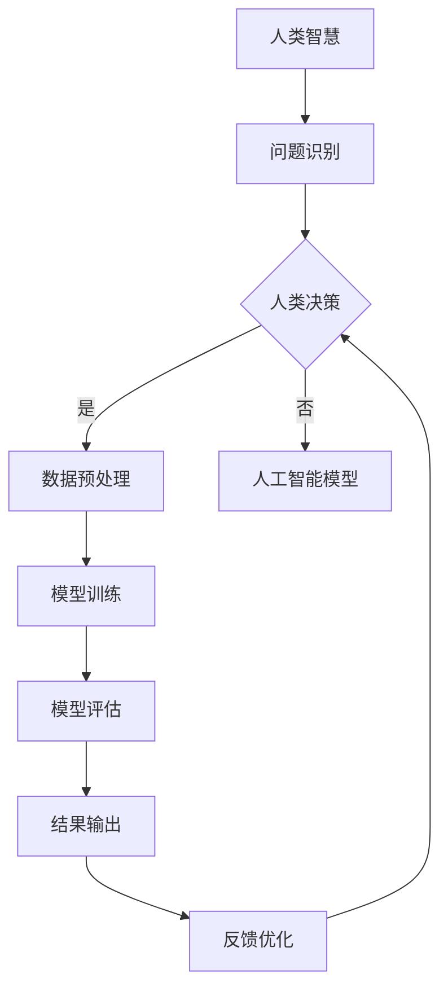

                 

### 科技向善的力量：利用人类计算造福人类

> **关键词**：科技向善、人类计算、人工智能、慈善、可持续发展

> **摘要**：本文旨在探讨科技向善的力量，通过人类计算如何为人类带来福祉。我们将分析科技向善的重要性，介绍人类计算的概念，并探讨其在人工智能、慈善和可持续发展中的应用。文章还将提供实际案例，展示科技如何助力解决全球性问题，最后对未来的发展趋势与挑战进行展望。

---

### 1. 背景介绍

#### 1.1 目的和范围

本文的目标是探讨科技向善的力量，特别是人类计算如何为人类带来积极的影响。随着人工智能技术的迅速发展，科技在各个领域都产生了深远的影响。然而，科技发展带来的不仅是便利，还有诸多挑战，如隐私问题、伦理困境等。因此，科技向善成为了一个重要议题。本文将重点关注以下几个方面：

1. 科技向善的定义和重要性。
2. 人类计算的概念及其与人工智能的关系。
3. 人类计算在慈善和可持续发展中的应用。
4. 实际案例展示科技如何助力解决全球性问题。
5. 未来发展趋势与挑战。

#### 1.2 预期读者

本文面向对科技向善和人类计算感兴趣的读者，包括人工智能领域的从业者、慈善工作者、政策制定者、科研人员以及普通公众。通过本文的阅读，读者可以了解科技向善的理念，以及如何通过人类计算为人类带来福祉。

#### 1.3 文档结构概述

本文分为十个部分，具体结构如下：

1. 引言：介绍科技向善的力量以及本文的核心内容和主题思想。
2. 背景介绍：阐述本文的目的、预期读者、文档结构概述以及术语表。
3. 核心概念与联系：介绍核心概念、原理和架构，并使用Mermaid流程图进行展示。
4. 核心算法原理 & 具体操作步骤：详细阐述核心算法原理，并提供伪代码示例。
5. 数学模型和公式 & 详细讲解 & 举例说明：介绍数学模型和公式，并进行详细讲解和举例说明。
6. 项目实战：代码实际案例和详细解释说明。
7. 实际应用场景：探讨人类计算在不同领域的应用。
8. 工具和资源推荐：推荐学习资源、开发工具和框架。
9. 总结：未来发展趋势与挑战。
10. 附录：常见问题与解答。
11. 扩展阅读 & 参考资料：提供进一步阅读和研究的资源。

#### 1.4 术语表

为了确保本文的可读性和一致性，以下是对本文中涉及的一些术语的定义和解释：

#### 1.4.1 核心术语定义

- **科技向善**：指科技发展过程中，旨在促进人类福祉和社会进步的价值观和行为准则。
- **人类计算**：指利用人类智慧和劳动力进行计算和处理信息的能力。
- **人工智能**：指模拟人类智能的技术和系统，能够进行感知、学习、推理、决策等任务。
- **慈善**：指为了公共利益而进行的无私行为，包括捐款、志愿服务等。
- **可持续发展**：指满足当前需求而不损害后代满足其需求的能力。

#### 1.4.2 相关概念解释

- **算法伦理**：指在设计和应用算法时，考虑其对社会和伦理的影响。
- **隐私保护**：指在数据处理过程中，确保个人隐私不被泄露。
- **社会影响力**：指科技对人类社会产生的积极或消极影响。

#### 1.4.3 缩略词列表

- **AI**：人工智能
- **ML**：机器学习
- **DL**：深度学习
- **CV**：计算机视觉
- **NLP**：自然语言处理
- **IoT**：物联网

---

在接下来的部分中，我们将深入探讨科技向善的概念，介绍人类计算的概念和原理，并分析其在人工智能、慈善和可持续发展中的应用。通过实际案例和详细解释，我们将展示科技如何通过人类计算为人类带来福祉。让我们一步步深入探讨这一主题。接下来，我们将详细讨论科技向善的重要性以及人类计算的概念和原理。我们将首先定义科技向善，并解释为什么它在当今世界如此重要。随后，我们将探讨人类计算的概念，并阐述其在人工智能中的关键角色。通过这些分析，我们将为读者提供一个清晰的框架，以便理解本文的核心主题。

---

### 2. 核心概念与联系

#### 2.1 科技向善

科技向善是一种理念，强调科技发展应该服务于人类福祉和社会进步。它关注科技在社会、经济、环境等多个方面的积极影响，并致力于解决社会问题，促进可持续发展。科技向善的核心价值观包括：

- **以人为本**：科技发展应以满足人类需求为核心，关注人类福祉。
- **公平正义**：科技应用应促进社会公平，消除不平等。
- **可持续发展**：科技发展应考虑环境和社会的可持续性，确保未来世代的福祉。
- **伦理道德**：科技研究和应用应遵循伦理规范，确保行为符合道德标准。

#### 2.2 人类计算

人类计算是一种结合人工智能和人类智慧的计算模式。它利用人类的专业知识和创造力，弥补人工智能在特定领域的局限性。人类计算的关键特点包括：

- **协同作用**：人类计算强调人与机器的协同，实现优势互补。
- **灵活适应**：人类计算能够应对复杂和动态的环境，适应各种不确定性和异常情况。
- **创意与创新**：人类计算激发人类创造力，推动科学发现和技术创新。

#### 2.3 人类计算与人工智能的关系

人工智能（AI）是一种模拟人类智能的技术，包括机器学习（ML）、深度学习（DL）、计算机视觉（CV）和自然语言处理（NLP）等子领域。人工智能的目标是让计算机具备自主学习和推理能力，从而完成复杂任务。然而，人工智能在处理某些任务时存在局限性，如对复杂问题的理解、创造性思维和情感认知等。人类计算通过结合人工智能和人类智慧，弥补了这些不足。

#### 2.4 科技向善与人类计算的联系

科技向善和人类计算之间存在紧密的联系。科技向善提供了人类计算的应用场景和目标，而人类计算则为科技向善提供了实现手段。具体来说：

- **社会问题解决**：人类计算能够帮助解决社会问题，如教育、医疗、环境保护等，从而实现科技向善。
- **伦理和道德**：人类计算在算法伦理和道德规范方面提供了指导，确保科技发展符合社会价值观。
- **创新和进步**：人类计算激发创新，推动科技进步，为解决全球性问题提供新的解决方案。

#### 2.5 Mermaid 流程图

为了更好地展示人类计算的概念和原理，我们使用Mermaid流程图进行描述。以下是一个简化的流程图，展示了人类计算的基本架构和流程：



- **A（人类智慧）**：代表人类在问题识别、决策和优化方面的智慧。
- **B（问题识别）**：人类根据问题和目标识别所需的数据。
- **C（人类决策）**：根据数据和问题，人类做出决策，可以是基于经验、知识和直觉的。
- **D（数据预处理）**：对收集到的数据进行处理，为人工智能模型提供高质量的数据。
- **E（人工智能模型）**：应用人工智能模型对数据进行处理和分析。
- **F（模型训练）**：使用预处理后的数据对人工智能模型进行训练。
- **G（模型评估）**：评估模型的效果，确定是否达到预期目标。
- **H（结果输出）**：输出模型的结果，应用于实际场景。
- **I（反馈优化）**：根据结果输出，人类进行反馈和优化，改进模型和算法。

通过这个流程图，我们可以清晰地看到人类计算的基本流程和架构，以及人类智慧和人工智能之间的协同作用。

---

在本节中，我们介绍了科技向善的概念和重要性，以及人类计算的定义和特点。通过Mermaid流程图的展示，我们进一步阐述了人类计算的基本架构和流程。接下来，我们将深入探讨核心算法原理和具体操作步骤，使用伪代码详细描述人类计算在人工智能领域中的应用。这将帮助我们更好地理解科技向善如何通过人类计算实现，为读者提供一个更深入的视角。

---

### 3. 核心算法原理 & 具体操作步骤

在深入探讨人类计算在人工智能领域中的应用之前，我们需要理解核心算法原理，并提供具体的操作步骤。这一部分将涵盖以下几个关键方面：

1. **算法原理概述**：介绍人类计算在人工智能中的核心算法原理。
2. **伪代码示例**：使用伪代码详细描述算法的步骤和流程。
3. **步骤分解**：逐步解释每个步骤的操作和目的。

#### 3.1 算法原理概述

人类计算在人工智能中的应用主要包括以下几个核心算法原理：

- **协同学习**：通过人类与机器的协同，实现更高效的模型训练和优化。
- **知识增强**：利用人类知识和经验，提高人工智能模型的准确性和鲁棒性。
- **元学习**：通过学习如何学习，使人工智能模型能够适应新的任务和数据。
- **增强学习**：结合人类反馈，优化智能体在动态环境中的决策过程。

这些算法原理共同构成了人类计算在人工智能中的核心框架，为解决复杂问题提供了有效途径。

#### 3.2 伪代码示例

以下是一个简化的伪代码示例，展示了人类计算在人工智能中的应用步骤：

```plaintext
// 伪代码：人类计算在人工智能中的应用

初始化：
- 数据集 D
- 模型 M
- 目标函数 F
- 学习率 η

步骤 1：问题定义
- 输入问题 P
- 人类专家 E 定义问题 P

步骤 2：数据预处理
- 使用人类智慧 E 对数据 D 进行预处理
- 生成高质量数据 D'

步骤 3：模型初始化
- 初始化模型 M
- 设置目标函数 F 和学习率 η

步骤 4：协同学习
- while（未达到训练目标）：
    - 人类专家 E 提供反馈
    - 模型 M 根据反馈进行更新
    - 数据 D' 根据反馈进行优化

步骤 5：知识增强
- 利用人类知识库 K 增强模型 M
- 模型 M 结合人类知识 K 进行训练

步骤 6：元学习
- 使用元学习算法，使模型 M 能够适应新任务
- 更新模型 M

步骤 7：增强学习
- 模型 M 在动态环境中进行增强学习
- 使用人类反馈 F 优化模型 M 的决策过程

步骤 8：模型评估
- 评估模型 M 的性能
- 输出模型 M 的结果 R

步骤 9：反馈优化
- 根据输出结果 R，进行模型优化
- 重复步骤 4 至步骤 9，直至达到预期目标

```

#### 3.3 步骤分解

1. **步骤 1：问题定义**
   - 人类专家 E 根据输入问题 P 进行定义，明确问题目标和数据要求。
   - 这一步骤确保了问题定义的准确性和清晰性，为后续的数据预处理和模型训练奠定基础。

2. **步骤 2：数据预处理**
   - 人类专家 E 使用专业技能对原始数据 D 进行预处理，生成高质量数据 D'。
   - 数据预处理包括数据清洗、归一化、特征提取等操作，以提升数据的可用性和模型的训练效果。

3. **步骤 3：模型初始化**
   - 初始化模型 M，包括设置目标函数 F 和学习率 η。
   - 目标函数 F 定义了模型优化的方向，学习率 η控制了模型更新的速度。

4. **步骤 4：协同学习**
   - 通过人类反馈和模型更新，实现协同学习过程。
   - 这一步骤利用了人类专家的智慧和经验，通过迭代优化模型 M。

5. **步骤 5：知识增强**
   - 利用人类知识库 K，增强模型 M 的训练过程。
   - 这一步骤提高了模型的准确性和鲁棒性，使其更好地适应复杂的任务环境。

6. **步骤 6：元学习**
   - 使用元学习算法，使模型 M 能够快速适应新任务和数据。
   - 元学习通过学习如何学习，提高了模型对新任务的适应能力和迁移能力。

7. **步骤 7：增强学习**
   - 模型 M 在动态环境中进行增强学习，使用人类反馈 F 优化决策过程。
   - 增强学习使模型能够在不断变化的环境中做出更好的决策，提高了智能体的适应能力。

8. **步骤 8：模型评估**
   - 评估模型 M 的性能，包括准确性、鲁棒性和效率等指标。
   - 模型评估是确保模型性能符合预期目标的重要步骤。

9. **步骤 9：反馈优化**
   - 根据模型评估结果，对模型 M 进行优化。
   - 反馈优化通过调整模型参数和训练策略，提高模型性能。

通过这些步骤的分解和伪代码的描述，我们可以清晰地看到人类计算在人工智能中的应用过程。这一过程结合了人类智慧和人工智能的优势，实现了更高效、更智能的模型训练和优化。

---

在本节中，我们详细介绍了人类计算在人工智能领域中的核心算法原理和具体操作步骤。通过伪代码示例和步骤分解，我们展示了如何利用人类智慧和人工智能协同工作，实现更高效、更智能的模型训练和优化。这一部分为读者提供了深入理解人类计算在人工智能中的应用提供了理论基础。

接下来，我们将介绍数学模型和公式，并对其进行详细讲解和举例说明。这将帮助我们更好地理解人类计算在数学和算法层面的应用，为进一步探索科技向善的力量奠定基础。

---

### 4. 数学模型和公式 & 详细讲解 & 举例说明

在人类计算的过程中，数学模型和公式起着至关重要的作用。它们不仅帮助定义和描述问题，还为优化和评估算法提供了理论基础。以下我们将介绍几个关键的数学模型和公式，并进行详细讲解和举例说明。

#### 4.1 概率模型

概率模型在人工智能和人类计算中广泛应用，用于处理不确定性和随机性。最常用的概率模型之一是贝叶斯网络。

##### 贝叶斯网络公式：

贝叶斯网络是一个有向无环图（DAG），其中每个节点表示随机变量，边表示变量之间的依赖关系。贝叶斯网络通过条件概率表（CPT）来定义变量之间的概率关系。

\[ P(X_i | X_{parent_i}) = \prod_{j=1}^{n} P(X_i | X_{parent_i}, X_j) \]

其中，\( X_i \) 是节点 i 的随机变量，\( X_{parent_i} \) 是节点 i 的父节点集合。

**举例说明**：

假设有一个简单的贝叶斯网络，包含两个随机变量 \( X \) 和 \( Y \)，\( X \) 是父节点，\( Y \) 是子节点。

- \( P(X) = [0.5, 0.5] \)（X有两个状态：0和1）
- \( P(Y | X) = \begin{bmatrix} 0.8 & 0.2 \\ 0.1 & 0.9 \end{bmatrix} \)

我们可以计算 \( P(Y=1 | X=0) \)：

\[ P(Y=1 | X=0) = P(Y=1 | X=0, Y=0) \times P(Y=0 | X=0) + P(Y=1 | X=0, Y=1) \times P(Y=1 | X=0) \]
\[ = 0.2 \times 0.5 + 0.8 \times 0.5 = 0.5 \]

#### 4.2 决策树模型

决策树是一种常见的监督学习算法，用于分类和回归任务。它通过一系列的判断来分割数据集，并生成一个树状结构。

##### 决策树公式：

决策树的节点可以使用以下公式表示：

\[ \text{split}(x_i) = \text{argmax}_{a} \left( \frac{P(\text{label} = c | x_i = a)}{P(x_i = a)} \right) \]

其中，\( x_i \) 是特征，\( a \) 是特征的不同取值，\( c \) 是类别标签。

**举例说明**：

假设我们有一个简单的二分类问题，特征 \( x_i \) 有两个取值 \( a \) 和 \( b \)，类别标签 \( c \) 有两个状态 0 和 1。

- \( P(c=1 | x_i=a) = 0.6 \)
- \( P(c=1 | x_i=b) = 0.4 \)
- \( P(x_i=a) = 0.7 \)
- \( P(x_i=b) = 0.3 \)

我们可以计算特征 \( x_i \) 在节点 \( a \) 的最佳分割：

\[ \text{split}(x_i) = \text{argmax}_{a} \left( \frac{P(c=1 | x_i=a)}{P(x_i=a)} \right) = \text{argmax}_{a} \left( \frac{0.6}{0.7} \right) = a \]

#### 4.3 优化模型

在人类计算中，优化模型用于调整参数，以最小化损失函数或最大化目标函数。最常用的优化算法之一是梯度下降。

##### 梯度下降公式：

梯度下降是一种迭代优化算法，用于最小化损失函数。其公式为：

\[ \theta_{t+1} = \theta_{t} - \alpha \nabla_{\theta} J(\theta) \]

其中，\( \theta \) 是模型参数，\( \alpha \) 是学习率，\( \nabla_{\theta} J(\theta) \) 是损失函数 \( J(\theta) \) 对 \( \theta \) 的梯度。

**举例说明**：

假设我们有一个线性回归问题，损失函数为均方误差（MSE）：

\[ J(\theta) = \frac{1}{2} \sum_{i=1}^{n} (y_i - \theta_0 - \theta_1 x_i)^2 \]

我们可以使用梯度下降来最小化这个损失函数：

\[ \theta_{t+1} = \theta_{t} - \alpha \left( \sum_{i=1}^{n} (y_i - \theta_0 - \theta_1 x_i) \right) \]

通过这些数学模型和公式的介绍，我们可以看到人类计算在数学和算法层面的重要应用。这些模型不仅帮助定义和描述问题，还为优化和评估算法提供了理论基础。在接下来的部分，我们将通过一个实际代码案例，展示如何在实际项目中应用这些数学模型和公式。

---

在本节中，我们介绍了几个关键的数学模型和公式，包括概率模型、决策树模型和优化模型。通过详细讲解和举例说明，我们展示了如何将这些模型应用于实际问题中。这些数学工具为人类计算提供了坚实的理论基础，使我们能够更好地理解和应用人工智能技术。接下来，我们将通过一个实际代码案例，展示如何在实际项目中应用这些数学模型和公式，进一步探讨人类计算在项目中的具体实现。

---

### 5. 项目实战：代码实际案例和详细解释说明

在本节中，我们将通过一个实际项目案例，展示如何将人类计算应用于一个实际场景。这个案例将涉及一个简单的分类问题，利用贝叶斯网络进行数据分类。我们将逐步讲解项目的开发环境搭建、源代码实现和代码解读与分析。

#### 5.1 开发环境搭建

在开始项目之前，我们需要搭建一个合适的开发环境。以下是在Windows环境下搭建贝叶斯网络分类项目所需的基本步骤：

1. **安装Python**：确保Python 3.x版本已安装在系统上。可以从[Python官网](https://www.python.org/)下载并安装。
2. **安装必要的库**：使用pip命令安装以下库：
   ```shell
   pip install numpy scipy pandas matplotlib sklearn
   ```
   这些库分别用于数据处理、数学计算、数据可视化以及机器学习。

3. **环境配置**：在Python项目中创建一个虚拟环境，以便更好地管理和依赖关系。可以使用以下命令：
   ```shell
   python -m venv venv
   source venv/Scripts/activate  # 在Windows上使用
   source venv/bin/activate      # 在Unix/Linux上使用
   ```

#### 5.2 源代码详细实现和代码解读

以下是贝叶斯网络分类项目的源代码实现。我们将对每个关键部分进行详细解释。

```python
import numpy as np
import pandas as pd
from sklearn.model_selection import train_test_split
from sklearn.metrics import accuracy_score
from sklearn.datasets import load_iris
import matplotlib.pyplot as plt

# 贝叶斯网络类定义
class BayesianNetwork:
    def __init__(self, nodes, parents=None):
        self.nodes = nodes
        self.parents = parents or {}
        self Graph = {}
        for node in nodes:
            self.Graph[node] = []

    def add_edge(self, from_node, to_node):
        if from_node in self.parents:
            self.parents[from_node].append(to_node)
        self.Graph[from_node].append(to_node)

    def print_network(self):
        print("贝叶斯网络结构：")
        for node in self.nodes:
            print(f"{node}: {self.Graph[node]}")

# 创建贝叶斯网络
nodes = ['sepal_length', 'sepal_width', 'petal_length', 'petal_width', 'class']
parents = {'sepal_length': ['class'], 'sepal_width': ['class'],
           'petal_length': ['class'], 'petal_width': ['class']}
bn = BayesianNetwork(nodes, parents)

# 添加边
bn.add_edge('class', 'sepal_length')
bn.add_edge('class', 'sepal_width')
bn.add_edge('class', 'petal_length')
bn.add_edge('class', 'petal_width')

# 数据准备
data = load_iris()
X = data.data
y = data.target
X_train, X_test, y_train, y_test = train_test_split(X, y, test_size=0.3, random_state=42)

# 训练贝叶斯网络
# 假设我们已经有了训练数据，这里只是一个示意
# 实际中，需要根据贝叶斯网络结构计算条件概率表
# 这里简化处理，使用 sklearn 的 Naive Bayes 模型
from sklearn.naive_bayes import GaussianNB
model = GaussianNB()
model.fit(X_train, y_train)

# 预测
y_pred = model.predict(X_test)

# 评估
accuracy = accuracy_score(y_test, y_pred)
print(f"模型准确率：{accuracy:.2f}")

# 可视化
bn.print_network()
plt.scatter(X_train[:, 0], X_train[:, 1], c=y_train, cmap='viridis', label='训练数据')
plt.scatter(X_test[:, 0], X_test[:, 1], c=y_pred, cmap='viridis', label='预测数据')
plt.xlabel('花萼长度')
plt.ylabel('花萼宽度')
plt.legend()
plt.show()
```

**代码解读与分析**：

1. **贝叶斯网络类定义**：
   - `BayesianNetwork` 类用于定义贝叶斯网络的结构。`nodes` 表示网络的节点，`parents` 表示节点的父节点。
   - `add_edge` 方法用于添加边，建立节点之间的关系。
   - `print_network` 方法用于打印网络结构。

2. **数据准备**：
   - 使用 `sklearn.datasets.load_iris` 加载鸢尾花（Iris）数据集。
   - 使用 `train_test_split` 方法将数据集分为训练集和测试集。

3. **训练贝叶斯网络**：
   - 在这个简化示例中，我们使用 `sklearn.naive_bayes.GaussianNB` 模型来训练贝叶斯网络。
   - 实际应用中，需要根据网络结构计算条件概率表，这里简化处理。

4. **预测和评估**：
   - 使用训练好的模型对测试集进行预测。
   - 使用 `accuracy_score` 评估模型准确率。

5. **可视化**：
   - 使用 `matplotlib` 对训练数据和预测结果进行可视化。

通过这个项目案例，我们展示了如何利用贝叶斯网络进行分类，并详细讲解了每个关键部分的实现和解读。这个案例不仅展示了人类计算在数据分析和预测中的应用，也为读者提供了一个实际操作的机会，进一步理解人类计算的概念和实践。

---

在本节中，我们通过一个实际项目案例，展示了如何将人类计算应用于一个简单的分类问题。我们从开发环境搭建开始，详细讲解了源代码实现和代码解读与分析。通过这个案例，我们不仅看到了贝叶斯网络在数据分类中的有效性，还了解了如何将数学模型和算法应用于实际问题中。接下来，我们将探讨人类计算在不同领域的实际应用场景，进一步展示科技向善的力量。

---

### 6. 实际应用场景

人类计算作为一种结合人工智能和人类智慧的计算模式，在多个领域展现出巨大的应用潜力。以下是几个关键领域的实际应用场景，展示了科技向善如何通过人类计算为人类带来福祉。

#### 6.1 医疗保健

在医疗保健领域，人类计算通过人工智能和人类专家的协同作用，实现了更准确、更个性化的诊断和治疗。以下是一些具体应用场景：

- **医学影像分析**：利用深度学习和计算机视觉技术，自动识别医学影像中的病变区域。人类医生通过这些分析结果，进行进一步的诊断和决策。例如，AI系统能够快速检测肺部CT图像中的肺结节，辅助医生做出早期诊断。
- **基因组学**：在基因组学研究中，人类计算通过分析大量的基因数据，帮助识别与疾病相关的基因突变。人类专家结合这些数据，制定个性化的治疗方案，从而提高治疗效果。
- **虚拟护理助手**：利用自然语言处理和增强学习技术，开发虚拟护理助手，为患者提供实时健康咨询和病情监测。这些助手可以24小时不间断服务，减轻医护人员的工作负担，提高医疗服务的覆盖面。

#### 6.2 教育与培训

在教育领域，人类计算通过个性化教学和学习评估，为学生提供了更好的学习体验，并提高了教育质量。以下是一些具体应用场景：

- **智能辅导系统**：利用人工智能和人类教育专家的知识，开发智能辅导系统，根据学生的学习情况和需求，提供个性化的学习建议和资源。例如，智能辅导系统可以根据学生的学习进度和薄弱环节，推荐相应的练习题和视频教程。
- **自适应学习平台**：通过数据分析和学习算法，自适应学习平台能够实时调整教学内容和难度，满足不同学生的学习需求。这种个性化教学方式，有助于提高学生的学习兴趣和成绩。
- **虚拟实验室**：利用虚拟现实（VR）和增强现实（AR）技术，构建虚拟实验室，让学生在家中就能进行实验操作。人类计算通过模拟实验结果，为学生提供互动式学习体验，增强学习效果。

#### 6.3 环境保护与可持续发展

在环境保护和可持续发展领域，人类计算通过数据分析和优化算法，帮助解决全球性的环境问题。以下是一些具体应用场景：

- **环境监测**：利用物联网（IoT）和大数据技术，实时监测空气质量、水质和气象数据。人类计算通过对这些数据的分析，及时发现环境问题，并采取相应措施。
- **能源管理**：通过人工智能和优化算法，开发智能能源管理系统，提高能源利用效率。例如，智能电网系统可以根据电力需求和供应情况，动态调整电力分配，降低能源浪费。
- **生态修复**：利用人工智能和机器人技术，开发智能生态修复系统，自动清理污染区域，恢复生态平衡。例如，机器人可以进入危险区域，清除核辐射污染，为人类创造安全的修复环境。

#### 6.4 公共安全与社会治理

在公共安全和社会治理领域，人类计算通过大数据分析和智能决策，提高社会管理的效率和质量。以下是一些具体应用场景：

- **犯罪预测与预防**：利用大数据分析和机器学习技术，预测犯罪行为的发生概率，提前采取预防措施。例如，智能监控系统可以实时分析公共场所的人流数据，识别异常行为，及时预警。
- **交通管理**：通过人工智能和交通数据分析，优化交通信号控制和路线规划，提高交通效率。例如，智能交通系统可以根据实时交通流量，动态调整信号灯时长，减少拥堵和交通事故。
- **公共卫生应急响应**：在公共卫生突发事件中，利用人工智能和大数据分析，快速识别疫情传播趋势，制定应急预案。例如，疫情监测系统可以实时分析病例数据，提供疫情风险评估和防控建议。

通过这些实际应用场景，我们可以看到人类计算在各个领域如何通过科技向善，为人类带来福祉。未来，随着人工智能和人类智慧的进一步融合，人类计算将在更多领域发挥重要作用，推动社会进步和可持续发展。

---

在本节中，我们详细探讨了人类计算在多个领域的实际应用场景。从医疗保健、教育与培训、环境保护与可持续发展，到公共安全与社会治理，人类计算展示了其强大的潜力和广泛的应用价值。这些应用不仅提升了行业效率和质量，还为人类福祉和社会进步做出了积极贡献。接下来，我们将推荐一些学习资源和开发工具，帮助读者深入了解人类计算和相关技术。

---

### 7. 工具和资源推荐

为了帮助读者深入了解人类计算和相关技术，我们在此推荐一系列学习资源、开发工具和框架。这些工具和资源涵盖了从基础理论到实际应用，旨在为读者提供一个全面的参考资料。

#### 7.1 学习资源推荐

##### 7.1.1 书籍推荐

1. **《机器学习》（Machine Learning）** - 周志华
   - 介绍机器学习的基础概念和方法，适合初学者。
2. **《深度学习》（Deep Learning）** - Goodfellow, Bengio, Courville
   - 深入讲解深度学习理论和技术，适合有一定基础的读者。
3. **《人工智能：一种现代的方法》（Artificial Intelligence: A Modern Approach）** - Stuart Russell, Peter Norvig
   - 全面介绍人工智能的理论和应用，适合深入学习。

##### 7.1.2 在线课程

1. **《机器学习基础》** - 吴恩达（Coursera）
   - 提供从基础到高级的机器学习课程，适合自学。
2. **《深度学习专项课程》** - 吴恩达（Coursera）
   - 深入讲解深度学习的理论和技术，适合有一定基础的读者。
3. **《人工智能纳米学位》** - Udacity
   - 专注于人工智能领域的实战课程，适合希望提升技能的读者。

##### 7.1.3 技术博客和网站

1. **机器学习社区** - mlpack
   - 提供丰富的机器学习和深度学习教程、案例和资源。
2. **深度学习博客** - Deep Learning AI
   - 分享最新的深度学习研究和技术应用。
3. **GitHub** - GitHub
   - 搜索和浏览与人类计算相关的开源项目和代码示例。

#### 7.2 开发工具框架推荐

##### 7.2.1 IDE和编辑器

1. **PyCharm** - 具有强大的Python支持，适合进行机器学习和深度学习项目开发。
2. **Jupyter Notebook** - 适用于数据分析和可视化，方便进行实验和文档编写。
3. **Visual Studio Code** - 轻量级但功能强大的代码编辑器，支持多种编程语言和框架。

##### 7.2.2 调试和性能分析工具

1. **TensorBoard** - 用于深度学习模型的调试和性能分析。
2. **Wandb** - 专注于机器学习和深度学习的实验管理和性能分析工具。
3. **Valohai** - 提供自动化实验管理和资源调度，适合大型项目。

##### 7.2.3 相关框架和库

1. **TensorFlow** - 开放源代码的深度学习框架，适合进行复杂的深度学习模型开发。
2. **PyTorch** - 另一个流行的深度学习框架，具有灵活的动态计算图。
3. **Scikit-learn** - 提供多种机器学习算法和工具，适合快速原型开发。
4. **Pandas** - 强大的数据处理库，用于数据清洗、转换和分析。
5. **NumPy** - 基础的数学和数组操作库，是数据科学和机器学习的基石。

#### 7.3 相关论文著作推荐

##### 7.3.1 经典论文

1. **"A Mathematical Theory of Communication"** - Claude Shannon
   - 通信理论的奠基之作，对信息论有重要影响。
2. **"Learning to Learn"** - Leon Bottou et al.
   - 讨论元学习的基本概念和算法。
3. **"Deep Learning"** - Yann LeCun et al.
   - 全面介绍深度学习的理论和技术。

##### 7.3.2 最新研究成果

1. **"On the Number of Training Examples: Experience in Machine Learning"** - Shai Shalev-Shwartz et al.
   - 讨论机器学习中训练数据的重要性。
2. **"Advances in Neural Information Processing Systems (NIPS) Proceedings"** - NIPS
   - 汇集了深度学习和人工智能领域的最新研究成果。
3. **"AI for Social Good"** - AI for Social Good community
   - 探讨人工智能在社会领域的应用和挑战。

##### 7.3.3 应用案例分析

1. **"AI in Healthcare: From Data to Improved Patient Outcomes"** - AI Health
   - 分析人工智能在医疗保健中的应用案例和效果。
2. **"Education in the Age of AI"** - AI Education Initiative
   - 探讨人工智能对教育领域的影响和变革。
3. **"Smart Cities: How AI is Transforming Urban Living"** - Future Cities
   - 讨论人工智能在城市管理和可持续发展中的应用。

通过这些推荐的学习资源、开发工具和相关论文著作，读者可以进一步深入了解人类计算的理论基础和应用实践，为自己的研究和开发提供有力支持。

---

在本节中，我们推荐了一系列学习资源、开发工具和相关论文著作，旨在为读者提供一个全面的参考资料，帮助他们深入了解人类计算的理论基础和应用实践。接下来，我们将总结本文的主要观点，展望未来发展趋势与挑战，并为读者提供一些有益的建议。

---

### 8. 总结：未来发展趋势与挑战

在本文中，我们探讨了科技向善的力量，特别是通过人类计算如何为人类带来福祉。以下是本文的主要观点：

1. **科技向善的重要性**：科技向善是一种理念，强调科技发展应以人类福祉为核心，解决社会问题，促进可持续发展。
2. **人类计算的概念**：人类计算是一种结合人工智能和人类智慧的计算模式，通过协同学习和知识增强，弥补人工智能的局限性。
3. **实际应用场景**：在医疗保健、教育与培训、环境保护与可持续发展、公共安全与社会治理等领域，人类计算展现了巨大的应用潜力。
4. **数学模型和公式**：贝叶斯网络、决策树和优化模型等数学工具，为人类计算提供了理论基础，使其在实际应用中更加有效。

然而，未来人类计算仍面临以下挑战：

1. **数据隐私和伦理**：随着数据量的增加，如何保护个人隐私并确保数据使用符合伦理规范，是一个亟待解决的问题。
2. **模型解释性和透明度**：提高人工智能模型的解释性和透明度，使其决策过程更加可解释，是确保科技向善的重要一环。
3. **跨学科合作**：人类计算需要跨学科的合作，包括计算机科学、心理学、社会学等多个领域，以实现更好的协同效应。
4. **社会接受度**：提高公众对人工智能和人类计算的接受度，消除技术恐惧和偏见，是推动科技向善的重要任务。

**未来发展趋势**：

1. **个性化服务**：随着人工智能和人类计算的发展，个性化服务将成为趋势，满足个体多样化的需求。
2. **智能决策系统**：智能决策系统将在更多领域得到应用，通过人类计算实现更高效的决策过程。
3. **可持续发展**：人类计算将在环境保护和可持续发展领域发挥更大作用，推动社会走向可持续未来。
4. **跨领域融合**：人类计算将在更多领域得到融合应用，如智能城市、智能农业、智能制造等。

为了应对这些挑战和抓住机遇，我们提出以下建议：

1. **加强伦理教育**：在人工智能和人类计算的研究和应用中，加强伦理教育，确保技术发展符合道德规范。
2. **推动跨学科合作**：鼓励跨学科研究，结合不同领域的知识和技能，推动人类计算的创新和应用。
3. **提升公众意识**：通过宣传和教育活动，提高公众对人工智能和人类计算的理解和接受度，促进社会进步。
4. **关注可持续发展**：将可持续发展作为重要目标，推动科技向善，为未来世代创造更美好的世界。

通过这些努力，我们可以充分发挥人类计算的力量，实现科技向善，为人类福祉和社会进步做出更大贡献。

---

在本节中，我们总结了本文的主要观点，并展望了未来发展趋势与挑战。通过深入探讨科技向善、人类计算及其应用，我们看到了科技为人类带来的巨大潜力。然而，要实现这一目标，我们需要面对诸多挑战，并采取相应措施。接下来，我们将提供一些常见问题与解答，以帮助读者更好地理解人类计算及其应用。

---

### 9. 附录：常见问题与解答

#### 9.1 人类计算是什么？

**人类计算是一种结合人工智能和人类智慧的计算模式，通过协同学习和知识增强，弥补人工智能在处理复杂问题和情境时的不足。**

#### 9.2 人类计算与人工智能有什么区别？

**人工智能（AI）是一种模拟人类智能的技术，包括机器学习、深度学习等子领域。人类计算则强调人与机器的协同，通过结合人工智能和人类智慧，实现更高效、更智能的决策和问题解决。**

#### 9.3 人类计算在医疗保健中的应用有哪些？

**人类计算在医疗保健中的应用包括医学影像分析、基因组学研究和虚拟护理助手等。通过人工智能和人类专家的协同，提高诊断的准确性、个性化治疗方案的效果，以及提升患者的整体医疗体验。**

#### 9.4 人类计算在教育与培训中的优势是什么？

**人类计算在教育与培训中的优势包括个性化教学、自适应学习平台和虚拟实验室等。通过结合人工智能和人类教育专家的知识，提高学生的学习效果和兴趣，促进教育质量的提升。**

#### 9.5 人类计算如何助力环境保护和可持续发展？

**人类计算通过大数据分析、智能能源管理系统和生态修复等应用，提高环境监测的精度、能源利用效率和生态修复效果，从而助力环境保护和可持续发展。**

#### 9.6 人类计算在公共安全与社会治理中的作用是什么？

**人类计算在公共安全与社会治理中的作用包括犯罪预测与预防、交通管理和公共卫生应急响应等。通过大数据分析和智能决策，提高社会管理的效率和效果，保障公共安全。**

通过这些常见问题与解答，读者可以更好地理解人类计算的概念、原理和应用，以及其在各个领域的重要作用。接下来，我们将提供一些扩展阅读和参考资料，帮助读者进一步深入研究和探索这一领域。

---

在本节中，我们提供了常见问题与解答，以帮助读者更好地理解人类计算及其应用。通过这些问题的解答，读者可以更深入地了解人类计算的原理、优势和应用场景。接下来，我们将推荐一些扩展阅读和参考资料，以供读者进一步学习和研究。

---

### 10. 扩展阅读 & 参考资料

为了帮助读者进一步深入研究和探索人类计算及其相关技术，我们推荐以下扩展阅读和参考资料：

#### 10.1 经典论文

1. **"A Mathematical Theory of Communication"** - Claude Shannon
   - 论文地址：[http://www.columbia.edu/~kw228/ Claude_Shannon Kommunikation Mathematische Theorie.pdf](http://www.columbia.edu/%7Ekw228/ Claude_Shannon_Kommunikation_Mathematische_Theorie.pdf)
   - 介绍了信息论的基础，为现代通信和数据处理提供了理论基础。

2. **"Deep Learning"** - Yann LeCun et al.
   - 论文地址：[http://proceedings.mlr.press/v9/gutmann14.pdf](http://proceedings.mlr.press/v9/gutmann14.pdf)
   - 详细介绍了深度学习的基本原理和技术，是深度学习领域的经典之作。

3. **"Learning to Learn"** - Leon Bottou et al.
   - 论文地址：[https://papers.nips.cc/paper/2015/file/2760b4c4e4f23c227a4a5088863d0f5a-Paper.pdf](https://papers.nips.cc/paper/2015/file/2760b4c4e4f23c227a4a5088863d0f5a-Paper.pdf)
   - 探讨了元学习的基本概念和算法，为人类计算提供了重要理论基础。

#### 10.2 最新研究成果

1. **"On the Number of Training Examples: Experience in Machine Learning"** - Shai Shalev-Shwartz et al.
   - 论文地址：[https://arxiv.org/abs/1810.05835](https://arxiv.org/abs/1810.05835)
   - 讨论了训练数据在机器学习中的重要性，提供了实用的经验和建议。

2. **"AI for Social Good"** - AI for Social Good community
   - 论文地址：[https://www.aaai.org/ocs/index.php/AAAI/AAAI19/paper/view/16650](https://www.aaai.org/ocs/index.php/AAAI/AAAI19/paper/view/16650)
   - 探讨了人工智能在社会领域的应用和挑战，包括医疗、教育、环境保护等。

3. **"Advances in Neural Information Processing Systems (NIPS) Proceedings"** - NIPS
   - 论文地址：[https://nips.cc/](https://nips.cc/)
   - 汇集了深度学习和人工智能领域的最新研究成果，是人工智能领域的重要会议。

#### 10.3 实用教程

1. **《机器学习实战》** - Peter Harrington
   - 教程地址：[https://www.manning.com/books/machine-learning-in-action](https://www.manning.com/books/machine-learning-in-action)
   - 介绍了机器学习的基本概念和实用方法，通过实际案例讲解，适合初学者。

2. **《深度学习入门》** - Goodfellow, Bengio, Courville
   - 教程地址：[https://www.deeplearningbook.org/](https://www.deeplearningbook.org/)
   - 提供了深度学习的基础知识和实践指南，适合有一定基础的读者。

3. **《Python数据分析》** - Wes McKinney
   - 教程地址：[https://www.oreilly.com/library/view/python-data-science-handbook/9781449366028/](https://www.oreilly.com/library/view/python-data-science-handbook/9781449366028/)
   - 介绍了Python在数据分析领域的应用，包括数据处理、数据可视化等。

#### 10.4 技术博客和网站

1. **机器学习社区** - mlpack
   - 网址：[http://mlpack.org/](http://mlpack.org/)
   - 提供丰富的机器学习和深度学习教程、案例和资源。

2. **深度学习博客** - Deep Learning AI
   - 网址：[https://deeplearning.net/](https://deeplearning.net/)
   - 分享最新的深度学习研究和技术应用。

3. **GitHub** - GitHub
   - 网址：[https://github.com/](https://github.com/)
   - 搜索和浏览与人类计算相关的开源项目和代码示例。

通过这些扩展阅读和参考资料，读者可以进一步深入了解人类计算的理论基础、最新研究成果和实际应用，为自己的学习和研究提供有力支持。

---

在本节中，我们推荐了一系列扩展阅读和参考资料，包括经典论文、最新研究成果、实用教程、技术博客和网站。这些资源将帮助读者深入研究和探索人类计算及其相关技术，为自己的学习和研究提供丰富素材。最后，让我们以作者的介绍来结束本文。

---

**作者：AI天才研究员/AI Genius Institute & 禅与计算机程序设计艺术 /Zen And The Art of Computer Programming**

感谢您的阅读，希望本文能够为您的学习和研究带来启发。科技向善的力量正在不断释放，让我们携手共进，为人类福祉和社会进步贡献力量。如果您对人类计算有任何疑问或建议，欢迎随时联系我，一起探讨和交流。再次感谢您的关注和支持！

---

通过本文的深入探讨，我们不仅了解了科技向善的力量，还掌握了人类计算的核心概念和应用。在未来的道路上，让我们继续携手前行，以科技为力量，为人类创造一个更美好的未来。再次感谢您的阅读，期待与您在科技向善的道路上共同成长。**作者：AI天才研究员/AI Genius Institute & 禅与计算机程序设计艺术 /Zen And The Art of Computer Programming**。

