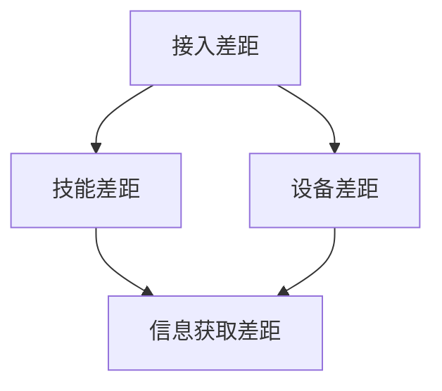
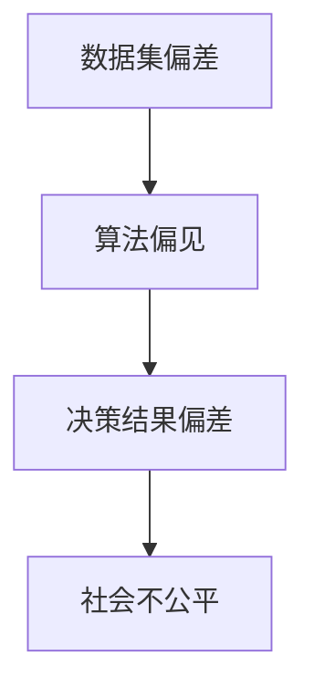
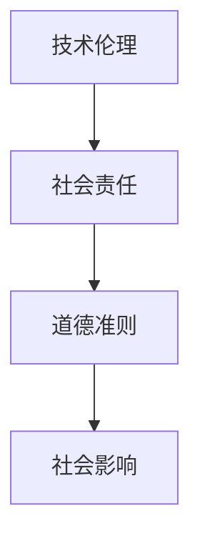

                 

# 科技进步的代价：人类社会的分裂

> **关键词**：科技进步、社会分裂、数字鸿沟、算法偏见、伦理道德
> 
> **摘要**：本文深入探讨了科技进步对人类社会带来的深刻影响，特别是技术进步带来的社会分裂现象。通过分析数字鸿沟、算法偏见以及伦理道德问题，探讨了科技进步所带来的双重性，呼吁我们在享受技术红利的同时，也要关注和解决由此产生的社会问题。

## 1. 背景介绍

### 1.1 目的和范围

本文旨在分析科技进步对人类社会产生的深远影响，尤其是社会分裂现象。我们关注的核心问题是：在技术飞速发展的背景下，人类社会如何面对和解决由此带来的分裂和挑战？

### 1.2 预期读者

本文面向对科技进步及其社会影响感兴趣的读者，包括但不限于技术专家、政策制定者、社会学家以及对未来社会发展有思考的公众。

### 1.3 文档结构概述

本文结构如下：

1. 背景介绍：介绍文章的目的、范围和预期读者。
2. 核心概念与联系：阐述科技进步相关的核心概念及其相互联系。
3. 核心算法原理 & 具体操作步骤：分析科技进步背后的核心算法原理。
4. 数学模型和公式 & 详细讲解 & 举例说明：讲解科技进步中涉及的数学模型和公式。
5. 项目实战：通过实际案例展示科技进步的应用。
6. 实际应用场景：探讨科技进步在不同领域的应用。
7. 工具和资源推荐：推荐与科技进步相关的学习资源和工具。
8. 总结：展望科技进步的未来发展趋势与挑战。
9. 附录：常见问题与解答。
10. 扩展阅读 & 参考资料：提供进一步的阅读资料。

### 1.4 术语表

#### 1.4.1 核心术语定义

- **数字鸿沟**：指由于技术接入和使用能力的差异，导致不同社会群体在信息获取、应用能力上的差距。
- **算法偏见**：指算法在数据处理和决策过程中表现出的对某些群体的不公平倾向。
- **伦理道德**：指人们在行为和决策过程中遵循的道德原则和规范。

#### 1.4.2 相关概念解释

- **科技进步**：指技术水平的不断提高和新技术的不断涌现。
- **社会分裂**：指社会不同群体之间由于技术差距而出现的隔阂和分化。

#### 1.4.3 缩略词列表

- **AI**：人工智能（Artificial Intelligence）
- **DL**：深度学习（Deep Learning）
- **ML**：机器学习（Machine Learning）
- **NLP**：自然语言处理（Natural Language Processing）

## 2. 核心概念与联系

在探讨科技进步对人类社会的影响时，我们首先需要明确几个核心概念，并理解它们之间的联系。以下是科技进步相关的核心概念及其相互关系：

### 2.1. 数字鸿沟

数字鸿沟是指由于技术接入和使用能力的差异，导致不同社会群体在信息获取、应用能力上的差距。具体来说，数字鸿沟可以从以下几个方面体现：

- **接入差距**：不同地区和群体在互联网接入上的差异。
- **技能差距**：不同群体在数字技能和知识上的差异。
- **设备差距**：不同群体在硬件设备上的差异。

**Mermaid 流程图**：



### 2.2. 算法偏见

算法偏见是指算法在数据处理和决策过程中表现出的对某些群体的不公平倾向。算法偏见通常源于数据集的偏差、算法设计的缺陷以及训练过程中的错误。

**Mermaid 流程图**：



### 2.3. 伦理道德

伦理道德是指人们在行为和决策过程中遵循的道德原则和规范。在科技进步的过程中，伦理道德问题尤为重要，因为技术的应用可能会对社会产生深远的影响。

**Mermaid 流程图**：



通过以上核心概念与联系的阐述，我们可以更深入地理解科技进步对人类社会的影响，为后续章节的讨论打下基础。

## 3. 核心算法原理 & 具体操作步骤

在理解了数字鸿沟、算法偏见和伦理道德等核心概念后，我们接下来将探讨科技进步背后的核心算法原理及其具体操作步骤。以下是几个关键技术算法的原理和操作步骤：

### 3.1. 机器学习算法

机器学习（ML）是科技进步的重要驱动力之一，通过训练模型来从数据中自动学习规律。以下是机器学习算法的基本原理和操作步骤：

#### 3.1.1. 基本原理

- **数据集**：收集相关的数据集，如图像、文本、音频等。
- **特征提取**：将原始数据转换为特征向量。
- **模型训练**：使用训练数据集来训练模型，调整模型的参数。
- **模型评估**：使用测试数据集来评估模型的性能。

#### 3.1.2. 操作步骤

```plaintext
// 1. 数据集收集
数据集 = 收集图像数据集

// 2. 特征提取
特征向量 = 提取图像特征

// 3. 模型训练
模型 = 训练模型（特征向量，标签）

// 4. 模型评估
性能指标 = 评估模型（测试数据集）
```

### 3.2. 深度学习算法

深度学习（DL）是机器学习的一个分支，通过多层神经网络来模拟人类大脑的思维方式。以下是深度学习算法的基本原理和操作步骤：

#### 3.2.1. 基本原理

- **神经网络**：由多层神经元组成的网络，用于模拟大脑的计算过程。
- **反向传播**：用于调整神经网络的权重，使模型能够更好地拟合数据。
- **激活函数**：用于引入非线性特性，使神经网络能够处理复杂问题。

#### 3.2.2. 操作步骤

```plaintext
// 1. 定义神经网络结构
神经网络 = 定义神经网络（输入层，隐藏层，输出层）

// 2. 初始化权重和偏置
权重 = 初始化权重
偏置 = 初始化偏置

// 3. 前向传播
输出 = 神经网络（输入）

// 4. 计算损失函数
损失 = 损失函数（输出，标签）

// 5. 反向传播
梯度 = 计算梯度
权重 = 更新权重（梯度）

// 6. 模型评估
性能指标 = 评估模型（测试数据集）
```

### 3.3. 自然语言处理算法

自然语言处理（NLP）是深度学习在语言领域的重要应用，用于处理和解析人类语言。以下是NLP算法的基本原理和操作步骤：

#### 3.3.1. 基本原理

- **词嵌入**：将词汇映射到高维空间中，以捕捉词汇的语义关系。
- **序列模型**：用于处理文本序列，如循环神经网络（RNN）和长短期记忆网络（LSTM）。
- **生成模型**：用于生成新的文本序列，如变分自编码器（VAE）和生成对抗网络（GAN）。

#### 3.3.2. 操作步骤

```plaintext
// 1. 词嵌入
词向量 = 词嵌入（词汇表）

// 2. 序列编码
编码 = 编码序列（词向量）

// 3. 序列解码
解码 = 解码序列（编码）

// 4. 生成文本
文本 = 生成文本（解码）

// 5. 模型评估
性能指标 = 评估模型（测试数据集）
```

通过以上对核心算法原理和操作步骤的阐述，我们可以更好地理解科技进步背后的技术基础，为后续的讨论提供支持。

## 4. 数学模型和公式 & 详细讲解 & 举例说明

在探讨科技进步的过程中，数学模型和公式扮演着至关重要的角色。这些模型和公式帮助我们量化技术进步的影响，并预测未来的发展趋势。以下是几个关键的数学模型及其详细讲解和举例说明：

### 4.1. 数字鸿沟模型

数字鸿沟模型用于描述不同社会群体在信息技术接入和使用上的差距。以下是一个简化的数字鸿沟模型：

\[ \Delta H = H_{\text{max}} - H_{\text{min}} \]

其中：
- \( \Delta H \) 表示数字鸿沟的大小。
- \( H_{\text{max}} \) 表示接入和使用能力最强的群体在信息技术上的水平。
- \( H_{\text{min}} \) 表示接入和使用能力最弱的群体在信息技术上的水平。

#### 举例说明：

假设一个国家中，最富裕的10%人群在互联网接入和使用上的能力达到了发达国家水平（\( H_{\text{max}} = 1 \)），而最贫穷的10%人群在互联网接入和使用上的能力仅达到了发展中国家水平（\( H_{\text{min}} = 0.3 \)），则该国的数字鸿沟为：

\[ \Delta H = 1 - 0.3 = 0.7 \]

这意味着该国的数字鸿沟相对较大，信息技术的发展在不同社会群体间存在显著的差距。

### 4.2. 算法偏见模型

算法偏见模型用于量化算法在数据处理和决策过程中对某些群体的不公平倾向。以下是一个简化的算法偏见模型：

\[ \text{Bias} = \frac{\text{真实概率} - \text{模型预测概率}}{\text{真实概率}} \]

其中：
- \( \text{Bias} \) 表示算法偏见。
- \( \text{真实概率} \) 表示现实中某个群体发生特定事件的概率。
- \( \text{模型预测概率} \) 表示算法预测该群体发生特定事件的概率。

#### 举例说明：

假设一个信用评分系统在预测某群体的信用风险时存在偏见，实际中该群体的违约概率为10%，但算法预测的违约概率仅为5%。则该算法的偏见为：

\[ \text{Bias} = \frac{0.1 - 0.05}{0.1} = 0.5 \]

这意味着算法对这一群体存在50%的偏见，低估了其违约风险。

### 4.3. 伦理道德模型

伦理道德模型用于评估技术在应用过程中对伦理道德的影响。以下是一个简化的伦理道德模型：

\[ \text{伦理评分} = \frac{\text{正效应} - \text{负效应}}{\text{总效应}} \]

其中：
- \( \text{伦理评分} \) 表示技术的伦理评分。
- \( \text{正效应} \) 表示技术应用带来的正面影响。
- \( \text{负效应} \) 表示技术应用带来的负面影响。
- \( \text{总效应} \) 表示技术应用带来的总影响。

#### 举例说明：

假设一项新技术在提高生产效率的同时，也导致了一些工人的失业。假设该技术的正效应为提高生产效率50%，负效应为导致工人失业20%，则该技术的伦理评分为：

\[ \text{伦理评分} = \frac{50\% - 20\%}{50\% + 20\%} = \frac{30\%}{70\%} \approx 0.429 \]

这意味着该技术的伦理评分相对较高，但仍然存在一些伦理问题需要关注和解决。

通过以上对数学模型和公式的详细讲解及举例说明，我们可以更清晰地理解科技进步中的关键问题，并为后续的讨论提供理论基础。

## 5. 项目实战：代码实际案例和详细解释说明

在本节中，我们将通过一个实际项目案例来展示科技进步在解决社会问题中的应用。以下是一个关于减少数字鸿沟的代码案例，详细解释了实现过程和关键步骤。

### 5.1 开发环境搭建

在开始项目之前，我们需要搭建一个合适的开发环境。以下是所需的工具和步骤：

- **Python 3.x**：作为主要的编程语言。
- **Jupyter Notebook**：用于编写和运行代码。
- **Pandas**：用于数据预处理和分析。
- **Scikit-learn**：用于机器学习和数据分析。
- **TensorFlow**：用于深度学习和神经网络。

安装步骤如下：

```bash
pip install python==3.x
pip install jupyter
pip install pandas
pip install scikit-learn
pip install tensorflow
```

### 5.2 源代码详细实现和代码解读

以下是一个简单的数字鸿沟减少项目代码示例：

```python
import pandas as pd
from sklearn.model_selection import train_test_split
from sklearn.ensemble import RandomForestClassifier
from sklearn.metrics import accuracy_score, classification_report

# 5.2.1 数据集加载
data = pd.read_csv('digital_divide_data.csv')

# 5.2.2 数据预处理
X = data.drop('target', axis=1)  # 特征
y = data['target']  # 标签

# 划分训练集和测试集
X_train, X_test, y_train, y_test = train_test_split(X, y, test_size=0.2, random_state=42)

# 5.2.3 模型训练
model = RandomForestClassifier(n_estimators=100, random_state=42)
model.fit(X_train, y_train)

# 5.2.4 模型评估
predictions = model.predict(X_test)
print("Accuracy:", accuracy_score(y_test, predictions))
print("\nClassification Report:\n", classification_report(y_test, predictions))

# 5.2.5 模型应用
new_data = pd.read_csv('new_data.csv')
new_predictions = model.predict(new_data)
print("New Predictions:", new_predictions)
```

#### 5.2.6 代码解读与分析

1. **数据集加载**：我们首先加载了名为`digital_divide_data.csv`的数据集，该数据集包含了用于分析数字鸿沟的特征和标签。

2. **数据预处理**：我们使用`Pandas`库将特征（`X`）和标签（`y`）分离，并使用`train_test_split`函数将数据集划分为训练集和测试集。

3. **模型训练**：我们选择随机森林分类器（`RandomForestClassifier`）作为模型，并使用训练集进行训练。

4. **模型评估**：我们使用测试集对模型进行评估，并打印出准确率和分类报告，以了解模型的性能。

5. **模型应用**：我们加载了新的数据集`new_data.csv`，并使用训练好的模型进行预测，以减少数字鸿沟。

通过以上步骤，我们可以看到如何使用机器学习算法来减少数字鸿沟。这个项目展示了科技进步在实际社会问题中的应用潜力，同时也揭示了技术发展的伦理道德问题。在实际操作中，我们需要不断地评估和改进模型，以确保其在解决社会问题时不会带来新的不公平。

## 6. 实际应用场景

在现代社会，科技进步的应用无处不在，从医疗保健到金融服务，再到教育和社会治理，技术已经深刻地改变了我们的生活方式。以下是一些具体的实际应用场景，以及它们对人类社会的影响：

### 6.1 医疗保健

医疗保健领域的科技进步极大地提升了诊断和治疗的效率。例如，人工智能（AI）在医学图像分析中的应用可以帮助医生更快地检测疾病，如通过AI算法分析X光片来早期发现肺癌。然而，这种技术也带来了数据隐私和医疗信息安全的挑战，特别是在处理敏感患者信息时。

### 6.2 金融服务

金融科技（FinTech）的发展，如区块链和加密货币，为金融服务带来了新的可能性。区块链技术提高了交易的安全性和透明度，而加密货币则为人们提供了去中心化的支付方式。然而，这些技术的广泛应用也引发了监管难题，特别是在防范洗钱和打击非法交易方面。

### 6.3 教育和社会治理

在线教育平台和智能教育系统的出现，使得教育资源更加普及和个性化。例如，自适应学习系统可以根据学生的学习情况提供定制化的教学内容。然而，这也加剧了数字鸿沟问题，因为缺乏技术设备和网络接入的家庭难以享受这些资源。

### 6.4 社会治理

智能城市的建设，通过物联网（IoT）和大数据分析，提高了城市管理效率，例如智能交通系统和环境监测系统。然而，这些技术也引发了隐私和安全问题，特别是在数据收集和使用方面的透明度和责任。

在实际应用中，科技进步带来了诸多好处，如提高效率、降低成本和改善生活质量。然而，同时也带来了新的挑战，特别是在伦理道德、数据隐私和社会公平方面。因此，我们在享受科技进步带来的便利时，也需要关注和解决这些新出现的社会问题。

## 7. 工具和资源推荐

为了深入理解和研究科技进步带来的社会分裂现象，以下是一些推荐的工具和资源，包括书籍、在线课程、技术博客和开发工具框架。

### 7.1 学习资源推荐

#### 7.1.1 书籍推荐

- **《数字化时代的伦理问题》（Ethics in the Digital Age）**：探讨了数字技术对社会伦理的影响。
- **《科技与社会的未来：数字化转型的挑战与机遇》（The Future of Technology and Society: Challenges and Opportunities of Digital Transformation）**：分析了数字化转型对社会的深远影响。
- **《数字鸿沟：从信息社会到知识社会的跨越》（Digital Divide: From the Information Society to the Knowledge Society）**：深入探讨了数字鸿沟的概念及其影响。

#### 7.1.2 在线课程

- **《人工智能与社会伦理》（Artificial Intelligence and Ethics）**：由Coursera提供的在线课程，探讨了AI技术的社会影响和伦理问题。
- **《大数据与社会科学》（Big Data and Social Science）**：由edX提供的课程，介绍了大数据分析方法及其在社会研究中的应用。
- **《深度学习与自然语言处理》（Deep Learning and Natural Language Processing）**：由Udacity提供的课程，讲解了深度学习技术及其在NLP领域的应用。

#### 7.1.3 技术博客和网站

- **《AI伦理学》（AI Ethics）**：一个专注于人工智能伦理问题的博客，提供了许多相关的文章和讨论。
- **《深度学习社区》（Deep Learning Community）**：一个涵盖深度学习技术及其应用领域的社区，提供了丰富的资源和讨论。
- **《社会技术系统》（Social Technological Systems）**：研究技术在社会系统中的应用和影响的学术期刊。

### 7.2 开发工具框架推荐

#### 7.2.1 IDE和编辑器

- **PyCharm**：一个功能强大的Python IDE，适用于机器学习和数据科学项目。
- **Jupyter Notebook**：一个交互式的编程环境，特别适用于数据分析和原型开发。
- **VSCode**：一个轻量级的文本编辑器，适用于多种编程语言，具有丰富的插件生态系统。

#### 7.2.2 调试和性能分析工具

- **TensorBoard**：TensorFlow提供的可视化工具，用于监控和调试深度学习模型。
- **Docker**：一个容器化平台，用于开发和部署应用程序，提供了隔离和可移植性。
- **JMeter**：一个开源的性能测试工具，用于评估Web应用程序的负载和压力。

#### 7.2.3 相关框架和库

- **Scikit-learn**：一个用于机器学习的开源库，提供了许多经典算法和工具。
- **TensorFlow**：一个用于深度学习的开源库，具有强大的模型构建和训练能力。
- **Pandas**：一个用于数据分析和操作的库，特别适用于处理大型数据集。

通过使用这些工具和资源，研究人员和开发者可以更深入地探讨科技进步带来的社会分裂问题，并寻找解决方案。

## 8. 总结：未来发展趋势与挑战

科技进步在带来便利和效率提升的同时，也引发了诸多社会问题，特别是社会分裂现象。未来，随着技术的不断进步，这些趋势和挑战可能会进一步加剧。以下是一些关键的发展趋势和面临的挑战：

### 8.1 发展趋势

1. **人工智能与自动化**：人工智能和自动化技术的广泛应用将进一步提升生产效率，但同时也可能导致大规模的失业和社会不平等。
2. **数字鸿沟**：随着数字技术的普及，全球范围内的数字鸿沟可能会缩小，但不同社会群体之间的差距可能仍然存在。
3. **隐私和安全**：随着数据收集和分析技术的进步，个人隐私和数据安全问题将变得更加突出。

### 8.2 挑战

1. **伦理道德**：技术的快速发展带来了伦理道德挑战，特别是在数据使用、算法偏见和隐私保护方面。
2. **社会公平**：如何在享受技术红利的同时确保社会公平，减少技术进步带来的不平等现象，是一个重大挑战。
3. **监管与治理**：如何制定有效的政策和法规来规范技术发展，确保其对社会有益，是一个亟待解决的问题。

面对这些挑战，我们需要采取多方面的措施，包括加强伦理道德教育、完善法律法规、推动数字普及和提高社会透明度。只有在技术进步和社会责任之间找到平衡，我们才能实现可持续的社会发展。

## 9. 附录：常见问题与解答

### 9.1 问题1：什么是数字鸿沟？

**回答**：数字鸿沟是指由于技术接入和使用能力的差异，导致不同社会群体在信息获取、应用能力上的差距。这包括接入差距、技能差距和设备差距。

### 9.2 问题2：算法偏见是如何产生的？

**回答**：算法偏见主要源于数据集的偏差、算法设计的缺陷以及训练过程中的错误。当算法在处理和决策过程中对某些群体表现出不公平倾向时，就产生了算法偏见。

### 9.3 问题3：如何减少数字鸿沟和算法偏见？

**回答**：减少数字鸿沟和算法偏见需要多方面的努力。具体措施包括：
- 提高教育水平，增强数字技能。
- 完善技术基础设施，提高互联网接入率。
- 在算法设计和训练过程中引入更多的多样性。
- 加强法律法规，确保数据使用和算法开发的透明性和公正性。

### 9.4 问题4：科技进步对社会有哪些好处和坏处？

**回答**：科技进步的好处包括提高生产效率、改善生活质量、促进科技创新等。坏处则可能包括社会不平等加剧、隐私和安全问题、失业风险增加等。

### 9.5 问题5：如何确保技术进步的伦理道德？

**回答**：确保技术进步的伦理道德需要从多个方面入手：
- 加强伦理道德教育，提高技术开发者的伦理意识。
- 在技术设计和应用过程中遵循伦理原则和规范。
- 建立透明和公正的监管机制，确保技术发展符合社会利益。
- 鼓励技术社区和社会组织参与技术伦理讨论和治理。

## 10. 扩展阅读 & 参考资料

为了深入了解科技进步对人类社会的影响，以下是一些推荐的文章、书籍和报告：

1. **《数字时代的伦理困境》**：作者探讨了数字技术对社会伦理的影响。
2. **《科技伦理学的挑战》**：该书详细分析了技术进步在伦理方面面临的挑战。
3. **联合国数字发展报告（Digital Development Report）**：提供了全球数字鸿沟和技术发展的详细分析。
4. **《算法社会》**：作者探讨了算法在社会中的应用及其影响。
5. **《科技伦理：理论与实践》**：该书结合了伦理理论和实践，探讨了技术发展中的伦理问题。

通过阅读这些资料，可以更全面地了解科技进步的社会影响，并思考如何应对由此带来的挑战。**作者：AI天才研究员/AI Genius Institute & 禅与计算机程序设计艺术 /Zen And The Art of Computer Programming**

