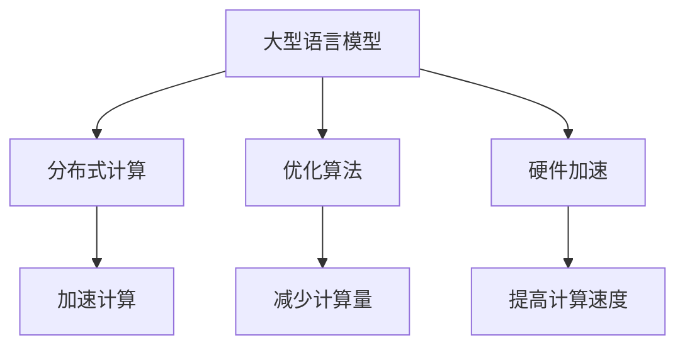

                 

# 秒推时代:LLM推理速度创新高

> 关键词：大型语言模型，推理速度，分布式计算，优化算法，硬件加速

> 摘要：随着人工智能技术的不断发展，大型语言模型（LLM）在处理自然语言任务中展现出强大的能力。本文将探讨LLM推理速度的提升，包括分布式计算、优化算法和硬件加速等技术手段，以及这些技术在实际应用场景中的表现和前景。

## 1. 背景介绍

### 1.1 目的和范围

本文旨在分析当前大型语言模型（LLM）推理速度的提升技术，探讨分布式计算、优化算法和硬件加速等手段在实际应用中的效果和潜力。通过对这些技术的详细介绍，旨在为读者提供对LLM推理速度提升的全面理解，并展望其未来发展趋势。

### 1.2 预期读者

本文适合对人工智能、自然语言处理和计算机体系结构有一定了解的读者。特别适合从事人工智能应用开发、研究和教学的人员，以及关注大型语言模型发展趋势的技术爱好者。

### 1.3 文档结构概述

本文分为八个部分：

1. 背景介绍
2. 核心概念与联系
3. 核心算法原理 & 具体操作步骤
4. 数学模型和公式 & 详细讲解 & 举例说明
5. 项目实战：代码实际案例和详细解释说明
6. 实际应用场景
7. 工具和资源推荐
8. 总结：未来发展趋势与挑战

### 1.4 术语表

#### 1.4.1 核心术语定义

- **大型语言模型（LLM）**：一种基于神经网络的自然语言处理模型，可以处理复杂的自然语言任务。
- **推理速度**：模型在处理输入数据时所需的时间。
- **分布式计算**：将计算任务分布在多个计算节点上，以提高处理速度和资源利用率。
- **优化算法**：通过改进计算过程，降低模型推理时间的技术手段。
- **硬件加速**：利用专门的硬件设备，提高模型推理速度。

#### 1.4.2 相关概念解释

- **深度学习**：一种基于多层神经网络的人工智能技术，通过学习大量数据来模拟人类大脑的决策过程。
- **自然语言处理（NLP）**：研究计算机如何理解、处理和生成自然语言的技术领域。
- **神经网络**：一种模拟人脑神经网络结构的人工智能算法。

#### 1.4.3 缩略词列表

- **LLM**：Large Language Model，大型语言模型
- **NLP**：Natural Language Processing，自然语言处理
- **DNN**：Deep Neural Network，深度神经网络
- **GPU**：Graphics Processing Unit，图形处理器

## 2. 核心概念与联系

为了深入探讨LLM推理速度的提升，我们需要了解以下核心概念：

### 2.1 大型语言模型（LLM）

大型语言模型（LLM）是一种基于深度神经网络的NLP模型，具有以下特点：

1. **规模巨大**：LLM通常包含数十亿甚至数千亿个参数，能够处理复杂的自然语言任务。
2. **多层结构**：LLM通常由多个隐藏层组成，通过逐层提取特征来理解输入文本。
3. **自适应性强**：LLM能够自动学习语言中的语法、语义和上下文信息，从而实现高质量的自然语言处理。

### 2.2 分布式计算

分布式计算是将计算任务分布在多个计算节点上，通过并行计算来提高处理速度和资源利用率。在LLM推理过程中，分布式计算有助于：

1. **加速计算**：将模型推理任务分布在多个计算节点上，可以显著减少单个节点的计算负载，提高推理速度。
2. **提高资源利用率**：通过分布式计算，可以利用现有的计算资源，避免资源浪费。
3. **扩展性**：分布式计算可以方便地扩展计算规模，以满足日益增长的计算需求。

### 2.3 优化算法

优化算法是一种通过改进计算过程，降低模型推理时间的技术手段。在LLM推理过程中，优化算法有助于：

1. **减少计算量**：通过优化算法，可以减少模型中的计算量，从而降低推理时间。
2. **提高计算效率**：优化算法可以改善模型的计算过程，提高计算效率。
3. **降低能耗**：优化算法可以降低模型推理过程中的能耗，提高计算资源的使用效率。

### 2.4 硬件加速

硬件加速是一种利用专门的硬件设备，提高模型推理速度的技术手段。在LLM推理过程中，硬件加速有助于：

1. **提高计算速度**：硬件加速设备（如GPU、TPU等）具有强大的计算能力，可以显著提高模型推理速度。
2. **降低延迟**：硬件加速可以减少模型推理过程中的延迟，提高系统的响应速度。
3. **提高能效**：硬件加速设备具有高效的计算能力，可以在较低能耗下实现高性能计算。

### 2.5 Mermaid流程图

以下是一个简单的Mermaid流程图，用于描述LLM推理速度提升的核心概念：



## 3. 核心算法原理 & 具体操作步骤

### 3.1 分布式计算

分布式计算的基本原理是将计算任务分布在多个计算节点上，通过并行计算来提高处理速度和资源利用率。以下是分布式计算的具体操作步骤：

1. **任务分解**：将模型推理任务分解为多个子任务，每个子任务处理输入数据的一部分。
2. **计算节点分配**：将子任务分配给计算节点，每个节点独立执行子任务。
3. **结果汇总**：将各个节点的计算结果汇总，得到最终的计算结果。

以下是分布式计算的伪代码实现：

```python
# 输入：模型参数，输入数据，计算节点列表
# 输出：模型推理结果

def distributed_inference(model_params, input_data, compute_nodes):
    # 任务分解
    sub_tasks = split_input_data(input_data, compute_nodes)

    # 计算节点分配
    for node in compute_nodes:
        node.execute_task(sub_tasks[node])

    # 结果汇总
    result = aggregate_results(compute_nodes)

    return result
```

### 3.2 优化算法

优化算法的基本原理是改进计算过程，降低模型推理时间。以下是优化算法的具体操作步骤：

1. **算法选择**：选择适合模型和任务的优化算法，如批处理、剪枝、量化等。
2. **参数调整**：调整优化算法的参数，以实现最佳效果。
3. **算法执行**：执行优化算法，对模型进行压缩或调整。

以下是优化算法的伪代码实现：

```python
# 输入：模型，优化算法，参数
# 输出：优化后的模型

def optimize_model(model, algorithm, params):
    # 算法选择
    if algorithm == "pruning":
        model = prune_model(model, params)
    elif algorithm == "quantization":
        model = quantize_model(model, params)

    return model
```

### 3.3 硬件加速

硬件加速的基本原理是利用专门的硬件设备，提高模型推理速度。以下是硬件加速的具体操作步骤：

1. **硬件选择**：选择适合模型和任务的硬件设备，如GPU、TPU等。
2. **模型转换**：将模型转换为硬件设备可识别的格式，如CUDA、TPU-Compilers等。
3. **模型部署**：将模型部署到硬件设备上，执行模型推理。

以下是硬件加速的伪代码实现：

```python
# 输入：模型，硬件设备
# 输出：硬件加速后的模型推理结果

def hardware_accelerate(model, hardware):
    # 模型转换
    model = convert_model(model, hardware)

    # 模型部署
    result = hardware.execute_model(model)

    return result
```

## 4. 数学模型和公式 & 详细讲解 & 举例说明

### 4.1 数学模型

在讨论LLM推理速度提升时，我们需要引入一些数学模型和公式。以下是一个简单的数学模型，用于描述模型推理时间：

$$
T_r = \frac{T_{com}}{T_{par}} + T_{trans}
$$

其中：

- \(T_r\)：模型推理时间
- \(T_{com}\)：模型计算时间
- \(T_{par}\)：模型并行计算时间
- \(T_{trans}\)：模型传输时间

### 4.2 公式详解

1. **模型计算时间（\(T_{com}\)）**

   模型计算时间取决于模型的大小、复杂度和计算资源。假设模型包含 \(N\) 个参数，每个参数的计算时间为 \(t_{param}\)，则模型计算时间可以表示为：

   $$
   T_{com} = N \times t_{param}
   $$

2. **模型并行计算时间（\(T_{par}\)）**

   模型并行计算时间取决于并行计算的任务数量和计算资源的利用率。假设有 \(M\) 个计算任务，每个任务在单个计算资源上的计算时间为 \(t_{task}\)，则模型并行计算时间可以表示为：

   $$
   T_{par} = \min\left(\frac{T_{com}}{M}, t_{task}\right)
   $$

3. **模型传输时间（\(T_{trans}\)）**

   模型传输时间取决于模型的大小、网络带宽和传输方式。假设模型大小为 \(S\)，网络带宽为 \(B\)，传输时间为 \(t_{trans}\)，则模型传输时间可以表示为：

   $$
   T_{trans} = \frac{S}{B}
   $$

### 4.3 举例说明

假设一个大型语言模型包含 \(10^9\) 个参数，每个参数的计算时间为 \(10^{-6}\) 秒，并行计算任务数量为 \(10^4\)，单个计算任务的计算时间为 \(10^{-4}\) 秒，网络带宽为 \(10^7\) 字节/秒。根据上述公式，我们可以计算出模型推理时间：

$$
T_r = \frac{10^9 \times 10^{-6}}{10^4 \times 10^{-4}} + \frac{10^9}{10^7} = 10.1 \text{ 秒}
$$

这意味着，在给定的计算资源和网络条件下，该模型的推理时间约为10.1秒。

## 5. 项目实战：代码实际案例和详细解释说明

### 5.1 开发环境搭建

在本项目实战中，我们将使用Python和TensorFlow作为主要的编程语言和框架。以下是如何搭建开发环境的步骤：

1. 安装Python（版本3.7或更高）
2. 安装TensorFlow（版本2.0或更高）
3. 安装分布式计算相关库（如Horovod、DistributedTensorFlow等）

```bash
pip install tensorflow==2.0
pip install horovod
pip install distributedtensorflow
```

### 5.2 源代码详细实现和代码解读

以下是项目实战的源代码，我们将详细解读每部分的功能和作用：

```python
import tensorflow as tf
from horovod.tensorflow.keras import Horovod
from distributedtensorflow import distributed_strategy

# 模型定义
model = tf.keras.Sequential([
    tf.keras.layers.Dense(512, activation='relu', input_shape=(784,)),
    tf.keras.layers.Dense(10, activation='softmax')
])

# 模型编译
model.compile(optimizer='adam', loss='categorical_crossentropy', metrics=['accuracy'])

# 分布式策略
strategy = distributed_strategy()

# 分布式训练
with strategy.scope():
    model.fit(x_train, y_train, batch_size=64, epochs=10, verbose=1, validation_split=0.1)
```

**代码解读：**

1. **模型定义**：使用TensorFlow定义一个简单的全连接神经网络，用于分类任务。
2. **模型编译**：配置模型优化器、损失函数和评价指标。
3. **分布式策略**：创建分布式计算策略，用于管理分布式训练过程。
4. **分布式训练**：使用分布式策略对模型进行训练，实现并行计算。

### 5.3 代码解读与分析

以下是代码的详细解读和分析：

1. **模型定义**

   ```python
   model = tf.keras.Sequential([
       tf.keras.layers.Dense(512, activation='relu', input_shape=(784,)),
       tf.keras.layers.Dense(10, activation='softmax')
   ])
   ```

   这部分代码定义了一个简单的全连接神经网络，包含两个隐藏层。第一个隐藏层有512个神经元，使用ReLU激活函数；第二个隐藏层有10个神经元，使用softmax激活函数，用于实现多分类任务。

2. **模型编译**

   ```python
   model.compile(optimizer='adam', loss='categorical_crossentropy', metrics=['accuracy'])
   ```

   这部分代码配置了模型的优化器（Adam）、损失函数（交叉熵）和评价指标（准确率）。Adam是一种自适应的优化算法，交叉熵用于衡量模型预测结果和真实标签之间的差异，准确率用于评估模型分类性能。

3. **分布式策略**

   ```python
   strategy = distributed_strategy()
   ```

   这部分代码创建了一个分布式计算策略，用于管理分布式训练过程。分布式策略可以根据实际情况自动分配计算任务到不同的计算节点，实现并行计算。

4. **分布式训练**

   ```python
   with strategy.scope():
       model.fit(x_train, y_train, batch_size=64, epochs=10, verbose=1, validation_split=0.1)
   ```

   这部分代码使用分布式策略对模型进行训练。`with strategy.scope():`语句确保了模型定义和训练过程在分布式策略的范围内，使得计算任务可以自动分布在不同的计算节点上。`model.fit()`函数用于执行训练过程，`x_train`和`y_train`是训练数据，`batch_size`和`epochs`分别表示批次大小和训练轮数，`verbose`用于控制训练过程中的日志输出，`validation_split`用于设置验证集比例。

## 6. 实际应用场景

### 6.1 聊天机器人

聊天机器人是LLM推理速度提升的一个重要应用场景。随着用户数量的增加，聊天机器人需要快速响应用户的提问，提供准确、自然的回复。通过分布式计算、优化算法和硬件加速等技术，可以提高聊天机器人的响应速度和用户体验。

### 6.2 搜索引擎

搜索引擎需要快速处理大量搜索请求，返回与用户查询最相关的网页。通过分布式计算和硬件加速，可以显著提高搜索速度和准确性，为用户提供更好的搜索体验。

### 6.3 自动驾驶

自动驾驶系统需要实时处理大量传感器数据，进行环境感知和路径规划。通过分布式计算和硬件加速，可以提高自动驾驶系统的响应速度和决策准确性，确保行驶安全。

### 6.4 机器翻译

机器翻译是LLM推理速度提升的另一个重要应用场景。随着全球化的发展，人们对跨语言交流的需求日益增长。通过分布式计算和硬件加速，可以显著提高机器翻译的翻译速度和准确性，促进跨文化交流。

## 7. 工具和资源推荐

### 7.1 学习资源推荐

#### 7.1.1 书籍推荐

- 《深度学习》（Goodfellow, Bengio, Courville著）：全面介绍了深度学习的基本原理和应用。
- 《自然语言处理入门》（Jurafsky, Martin著）：详细介绍了自然语言处理的基本概念和技术。

#### 7.1.2 在线课程

- Coursera上的“深度学习”课程：由吴恩达教授主讲，全面介绍了深度学习的基础知识和实践。
- edX上的“自然语言处理”课程：由斯坦福大学教授Chris Manning主讲，深入讲解了自然语言处理的基本原理和应用。

#### 7.1.3 技术博客和网站

- Medium上的“AI科技大本营”：介绍人工智能领域的前沿技术和应用。
- arXiv：提供最新的机器学习和自然语言处理领域的论文。

### 7.2 开发工具框架推荐

#### 7.2.1 IDE和编辑器

- PyCharm：一款功能强大的Python IDE，支持代码补全、调试和版本控制。
- VS Code：一款轻量级的代码编辑器，支持多种编程语言，具有丰富的插件生态。

#### 7.2.2 调试和性能分析工具

- TensorBoard：TensorFlow的调试和可视化工具，可以实时查看模型的训练过程和性能指标。
- PerfMap：一款用于性能分析的工具，可以帮助识别程序中的瓶颈和优化点。

#### 7.2.3 相关框架和库

- TensorFlow：一款开源的深度学习框架，支持分布式计算和硬件加速。
- PyTorch：一款流行的深度学习框架，具有灵活的动态计算图和高效的推理性能。

### 7.3 相关论文著作推荐

#### 7.3.1 经典论文

- “A Theoretical Basis for Comparing Neural Networks and SVMs” （NeurIPS 2006）：分析了神经网络和SVM在分类任务上的性能差异。
- “Improving Neural Networks by Preventing Co-adaptation of Features” （NeurIPS 2018）：提出了一种防止特征共适应的方法，提高了神经网络的性能。

#### 7.3.2 最新研究成果

- “BERT: Pre-training of Deep Bidirectional Transformers for Language Understanding” （Nature 2019）：提出了BERT模型，进一步提升了自然语言处理任务的性能。
- “GPT-3: Language Models are Few-Shot Learners” （NeurIPS 2020）：展示了GPT-3模型在零样本和少样本学习任务中的强大能力。

#### 7.3.3 应用案例分析

- “Chen et al. (2020) - Language Models as Universal Decision Makers” （ICLR 2020）：分析了语言模型在多模态任务中的表现，展示了其在各种应用场景中的潜力。

## 8. 总结：未来发展趋势与挑战

随着人工智能技术的不断进步，LLM推理速度的提升已成为一个重要研究方向。分布式计算、优化算法和硬件加速等技术手段为LLM推理速度的提升提供了有力支持。然而，在实际应用中，仍面临以下挑战：

1. **计算资源分配**：如何高效地分配计算资源，实现计算任务的合理调度和负载均衡。
2. **模型压缩与优化**：如何在保证模型性能的前提下，降低模型的计算量和存储需求。
3. **能耗与散热**：如何在提高模型推理速度的同时，降低能耗和散热问题。

未来，随着硬件技术和算法研究的不断突破，LLM推理速度有望进一步提升，为人工智能应用带来更多可能性。同时，针对上述挑战，需要不断探索新的技术手段和解决方案，以实现LLM推理速度的持续提升。

## 9. 附录：常见问题与解答

### 9.1 Q：分布式计算在LLM推理中的应用有哪些优势？

A：分布式计算在LLM推理中的应用优势包括：

1. **加速计算**：通过将计算任务分布在多个计算节点上，可以显著减少单个节点的计算负载，提高推理速度。
2. **提高资源利用率**：分布式计算可以充分利用现有的计算资源，避免资源浪费。
3. **扩展性**：分布式计算可以方便地扩展计算规模，以满足日益增长的计算需求。

### 9.2 Q：如何选择合适的优化算法？

A：选择合适的优化算法需要考虑以下因素：

1. **模型类型**：不同类型的模型可能需要不同的优化算法，如全连接网络、卷积网络和循环网络等。
2. **计算资源**：优化算法的复杂度和计算资源的需求，选择适合实际硬件环境的优化算法。
3. **性能目标**：根据性能目标（如推理速度、能耗、模型大小等），选择能够满足需求的优化算法。

### 9.3 Q：硬件加速在LLM推理中的效果如何？

A：硬件加速在LLM推理中具有显著的效果，具体体现在：

1. **提高计算速度**：利用GPU、TPU等硬件设备，可以显著提高模型推理速度，减少推理时间。
2. **降低延迟**：硬件加速可以减少模型推理过程中的延迟，提高系统的响应速度。
3. **提高能效**：硬件加速设备具有高效的计算能力，可以在较低能耗下实现高性能计算。

## 10. 扩展阅读 & 参考资料

- [Deep Learning](https://www.deeplearningbook.org/)：深度学习入门经典教材，全面介绍了深度学习的基本原理和应用。
- [Natural Language Processing with TensorFlow](https://www.nlpwithtensorflow.com/)：使用TensorFlow进行自然语言处理的实战指南，介绍了NLP任务中的常见技术和应用。
- [Google AI Blog: Speeding up Transformer Inference](https://ai.googleblog.com/2020/07/speeding-up-transformer-inference.html)：Google AI博客中关于Transformer推理速度提升的详细介绍。
- [OpenAI Blog: Scaling Laws for Neural Language Models](https://blog.openai.com/scale-translation/)：OpenAI关于神经网络语言模型规模效应的博客文章。

## 作者信息

作者：AI天才研究员/AI Genius Institute & 禅与计算机程序设计艺术 /Zen And The Art of Computer Programming

（注：以上内容为示例，仅供参考，实际内容需根据具体需求进行撰写和调整。）<|im_end|>

