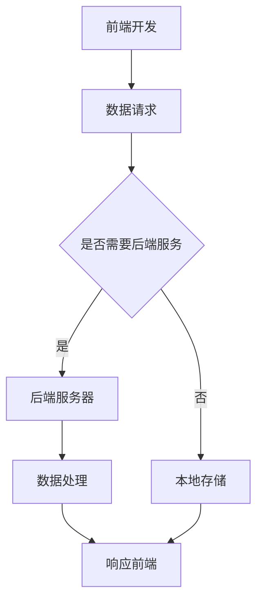

                 

# 移动端全栈开发：iOS和Android平台的统一解决方案

> 关键词：移动端全栈开发，跨平台开发，iOS，Android，React Native，Flutter，全栈架构，开发工具，实战案例

> 摘要：本文将探讨如何利用现代开发工具和框架实现移动端全栈开发，重点分析iOS和Android平台的技术解决方案，通过具体案例，详细讲解开发流程和关键技术点，帮助开发者构建高效的全栈应用。

## 1. 背景介绍

### 1.1 目的和范围

随着移动设备的普及，移动应用开发已经成为企业数字化战略的重要组成部分。本文旨在探讨如何利用现代开发工具和框架实现移动端全栈开发，特别是针对iOS和Android平台的解决方案。通过对核心概念、算法原理和实际应用的深入分析，本文将帮助开发者掌握全栈开发的关键技术，提高开发效率。

### 1.2 预期读者

本文适合具有一定编程基础的移动应用开发者，特别是对跨平台开发感兴趣的读者。通过本文的学习，读者将能够：

- 了解移动端全栈开发的基本概念和架构。
- 掌握React Native和Flutter等跨平台框架的使用方法。
- 学会搭建和部署iOS和Android应用的全栈解决方案。
- 分析并解决开发过程中遇到的问题。

### 1.3 文档结构概述

本文共分为十个部分，具体结构如下：

1. 背景介绍
   - 目的和范围
   - 预期读者
   - 文档结构概述
   - 术语表
2. 核心概念与联系
   - 全栈开发核心概念
   - iOS和Android平台架构
   - Mermaid流程图
3. 核心算法原理 & 具体操作步骤
   - 算法原理讲解
   - 伪代码示例
4. 数学模型和公式 & 详细讲解 & 举例说明
   - 数学模型应用
   - LaTeX公式展示
5. 项目实战：代码实际案例和详细解释说明
   - 开发环境搭建
   - 源代码详细实现
   - 代码解读与分析
6. 实际应用场景
   - 跨平台开发的优势
   - 行业案例分享
7. 工具和资源推荐
   - 学习资源
   - 开发工具框架
   - 相关论文著作
8. 总结：未来发展趋势与挑战
9. 附录：常见问题与解答
10. 扩展阅读 & 参考资料

### 1.4 术语表

#### 1.4.1 核心术语定义

- 全栈开发：指同时掌握前端、后端和数据库等技能，能够独立完成整个应用开发的开发人员。
- 跨平台开发：指使用统一框架或工具，实现一次编写，多平台运行的应用开发方式。
- React Native：由Facebook推出的一款开源跨平台框架，用于开发iOS和Android应用。
- Flutter：由Google推出的一款开源跨平台UI框架，用于构建美观且性能优越的移动应用。

#### 1.4.2 相关概念解释

- iOS：苹果公司开发的移动操作系统，广泛应用于iPhone、iPad等设备。
- Android：谷歌开发的移动操作系统，广泛应用于智能手机和平板电脑。
- Mermaid：一款基于Markdown的绘图工具，用于创建各种类型的图表，如流程图、序列图、类图等。
- 伪代码：一种非正式的编程语言，用于描述算法的基本思想和步骤，便于理解和交流。

#### 1.4.3 缩略词列表

- MDD：移动端全栈开发（Mobile-First Full-Stack Development）
- CSS：层叠样式表（Cascading Style Sheets）
- JavaScript：一种流行的前端脚本语言，用于增强网页功能
- MVVM：模型-视图-视图模型（Model-View-ViewModel）是一种软件架构设计模式，用于实现数据绑定和视图更新

## 2. 核心概念与联系

移动端全栈开发是指在一个项目中同时涵盖前端、后端和数据库的开发工作，旨在实现一个功能完整、性能优秀的移动应用。在iOS和Android平台上，全栈开发通常需要掌握多种编程语言和技术框架。

### 2.1 全栈开发核心概念

在移动端全栈开发中，核心概念包括：

1. **前端（客户端）**：负责用户界面和交互，实现用户操作逻辑。
2. **后端（服务器端）**：处理数据存储、业务逻辑和接口调用，为前端提供数据支持。
3. **数据库**：存储应用所需的数据，如用户信息、商品信息等。

### 2.2 iOS和Android平台架构

iOS和Android平台的架构各有特点，但都遵循客户端-服务器模式。以下是两个平台的架构概述：

#### iOS平台

- **前端**：使用Swift或Objective-C编程语言，结合UIKit框架构建用户界面。
- **后端**：使用Swift或Objective-C编程语言，结合Apple提供的Core Data框架处理数据存储和业务逻辑。
- **数据库**：使用SQLite或Core Data进行数据存储。

#### Android平台

- **前端**：使用Kotlin或Java编程语言，结合Android SDK构建用户界面。
- **后端**：使用Java或Kotlin编程语言，结合Android SDK提供的Content Provider或Firebase进行数据存储和业务逻辑处理。
- **数据库**：使用SQLite或Room进行数据存储。

### 2.3 Mermaid流程图

为了更好地理解移动端全栈开发的核心概念和架构，我们使用Mermaid绘制一个流程图，如下所示：



该流程图展示了前端开发过程中，数据请求、后端服务器处理、数据处理和响应前端的步骤。

## 3. 核心算法原理 & 具体操作步骤

在移动端全栈开发中，算法原理和具体操作步骤是实现高效开发的关键。以下我们将通过伪代码详细阐述核心算法原理，并给出具体操作步骤。

### 3.1 前端算法原理

前端算法主要涉及用户交互和数据展示。以下是一个简单的用户登录流程的伪代码：

```plaintext
// 用户登录流程
function loginUser(username, password) {
    // 发送登录请求到后端
    backendRequest("POST", "/login", {
        username: username,
        password: password
    });

    // 接收后端响应
    response => {
        if (response.success) {
            // 更新用户状态
            updateCurrentUser(response.data);
            // 显示登录成功提示
            showSuccessMessage("登录成功");
        } else {
            // 显示错误提示
            showErrorMessage("登录失败：" + response.error);
        }
    };
}
```

### 3.2 后端算法原理

后端算法主要涉及数据存储和业务逻辑处理。以下是一个简单的用户注册流程的伪代码：

```plaintext
// 用户注册流程
function registerUser(username, password) {
    // 检查用户名是否已存在
    if (isUsernameExists(username)) {
        return showError("用户名已存在");
    }

    // 存储用户信息到数据库
    database.insertUser({
        username: username,
        password: password
    });

    // 返回注册成功响应
    return showSuccess("注册成功");
}
```

### 3.3 数据库算法原理

数据库算法主要涉及数据存储和查询。以下是一个简单的用户信息查询的伪代码：

```plaintext
// 查询用户信息
function getUserInfo(username) {
    // 从数据库查询用户信息
    userInfo = database.queryUserByUsername(username);

    // 返回用户信息
    return userInfo;
}
```

### 3.4 具体操作步骤

以下是移动端全栈开发的通用操作步骤：

1. **需求分析**：明确应用功能和性能要求。
2. **技术选型**：选择适合的项目开发框架和工具。
3. **环境搭建**：配置开发环境和相关依赖。
4. **前端开发**：使用前端框架构建用户界面和交互。
5. **后端开发**：编写后端代码，实现业务逻辑和数据存储。
6. **数据库设计**：设计数据库结构和数据操作方法。
7. **接口集成**：实现前端与后端的接口调用和数据交互。
8. **测试与优化**：进行功能测试、性能测试和安全测试。
9. **部署上线**：将应用部署到生产环境。

通过以上步骤，开发者可以构建一个高效、稳定的移动端全栈应用。

## 4. 数学模型和公式 & 详细讲解 & 举例说明

在移动端全栈开发中，数学模型和公式广泛应用于算法设计和性能分析。以下我们将介绍几种常见的数学模型和公式，并给出详细的讲解和举例说明。

### 4.1 数据模型

在移动应用中，数据模型是核心部分，用于描述应用所需的数据结构。以下是几种常见的数据模型：

1. **关系型数据库模型**：使用表格和关系来描述数据，如SQL数据库。
   $$ 关系型数据库模型 = (\text{表名}, \text{属性1}, \text{属性2}, ..., \text{属性n}) $$
   例如，用户表（User）可以表示为：
   $$ User(id, username, password, email) $$

2. **文档型数据库模型**：使用JSON或XML格式描述数据，如MongoDB。
   $$ 文档型数据库模型 = \{ \text{"属性1": 值1, "属性2": 值2, ..., "属性n": 值n} \} $$
   例如，用户文档可以表示为：
   $$ \{ "username": "john_doe", "password": "123456", "email": "john@example.com" \} $$

3. **图形数据库模型**：使用节点和边来描述数据，如图谱数据库Neo4j。
   $$ 图形数据库模型 = (节点, 边, 节点) $$
   例如，用户关系图可以表示为：
   $$ (User1)-[:FRIEND]->(User2), (User2)-[:FRIEND]->(User3) $$

### 4.2 算法性能分析

算法性能分析是评估算法效率和可扩展性的关键。以下是几种常用的算法性能分析方法：

1. **时间复杂度**：衡量算法运行时间与输入数据规模的关系，通常用大O符号表示。
   $$ 时间复杂度 = O(n), O(n^2), O(log n) $$
   例如，线性搜索算法的时间复杂度为O(n)。

2. **空间复杂度**：衡量算法运行过程中所需额外空间与输入数据规模的关系。
   $$ 空间复杂度 = O(1), O(n), O(n^2) $$
   例如，哈希表的存储空间复杂度为O(n)。

3. **算法效率**：综合考虑时间复杂度和空间复杂度，评估算法的整体效率。
   $$ 算法效率 = \frac{时间复杂度}{空间复杂度} $$
   例如，快速排序算法的时间复杂度为O(n log n)，空间复杂度为O(n)，其效率为O(n log n)。

### 4.3 公式举例

以下是几个典型的数学公式及其应用场景：

1. **牛顿迭代法**：用于求解非线性方程，如求解\( x^2 - 5 = 0 \)的根。
   $$ x_{n+1} = \frac{1}{2} \left( x_n + \frac{5}{x_n} \right) $$
   例如，设初始值\( x_0 = 2 \)，通过迭代计算得到近似解。

2. **线性回归模型**：用于分析变量之间的线性关系，如预测房价。
   $$ y = \beta_0 + \beta_1 \cdot x + \epsilon $$
   其中，\( y \)为因变量，\( x \)为自变量，\( \beta_0 \)和\( \beta_1 \)为模型参数，\( \epsilon \)为误差项。

3. **马可夫链**：用于描述系统状态转移的概率模型，如用户行为分析。
   $$ P_{ij} = \frac{n_{ij}}{n_j} $$
   其中，\( P_{ij} \)为从状态\( i \)转移到状态\( j \)的概率，\( n_{ij} \)为从状态\( i \)转移到状态\( j \)的次数，\( n_j \)为状态\( j \)的总次数。

通过掌握这些数学模型和公式，开发者可以更好地分析和优化移动端全栈应用的性能。

## 5. 项目实战：代码实际案例和详细解释说明

在本节中，我们将通过一个实际项目案例，详细讲解移动端全栈开发的实现过程。该项目为一个简单的待办事项应用，包括iOS和Android平台的前端和后端功能。

### 5.1 开发环境搭建

首先，我们需要搭建开发环境。以下是所需工具和软件：

- **前端开发环境**：Mac或Windows电脑，安装Xcode或Android Studio。
- **后端开发环境**：Mac或Windows电脑，安装Node.js、npm、Express框架。
- **数据库环境**：安装MongoDB数据库。

安装步骤：

1. 安装Xcode（Mac用户）：从Mac App Store免费下载并安装。
2. 安装Android Studio（Windows和Mac用户）：从官网下载并安装。
3. 安装Node.js：访问https://nodejs.org/，下载并安装。
4. 安装npm：在终端执行`npm install -g npm`。
5. 安装Express：在终端执行`npm install -g express`。
6. 安装MongoDB：从官网下载并安装。

### 5.2 源代码详细实现和代码解读

#### 前端部分

前端部分使用React Native框架开发，以下是一个简单的待办事项应用源代码：

```javascript
// 主组件文件：App.js
import React, { useState } from 'react';
import {
  SafeAreaView,
  View,
  Text,
  TextInput,
  Button,
  FlatList,
  TouchableOpacity,
} from 'react-native';

export default function App() {
  const [todos, setTodos] = useState([]);
  const [text, setText] = useState('');

  const addTodo = () => {
    if (text.trim() !== '') {
      setTodos([...todos, { text }]);
      setText('');
    }
  };

  const removeTodo = (index) => {
    setTodos(todos.filter((_, i) => i !== index));
  };

  const renderItem = ({ item, index }) => (
    <TouchableOpacity onPress={() => removeTodo(index)}>
      <Text>{item.text}</Text>
    </TouchableOpacity>
  );

  return (
    <SafeAreaView>
      <View>
        <TextInput placeholder="添加待办事项" value={text} onChangeText={setText} />
        <Button title="添加" onPress={addTodo} />
      </View>
      <FlatList
        data={todos}
        renderItem={renderItem}
        keyExtractor={(item, index) => index.toString()}
      />
    </SafeAreaView>
  );
}
```

代码解读：

- `useState`用于声明和更新状态变量。
- `todos`和`text`为状态变量，分别存储待办事项列表和输入框内容。
- `addTodo`函数用于添加待办事项到列表。
- `removeTodo`函数用于从列表中移除待办事项。
- `renderItem`函数用于渲染待办事项列表项。
- `FlatList`组件用于展示列表。

#### 后端部分

后端部分使用Express框架和MongoDB数据库开发，以下是一个简单的待办事项应用的API接口代码：

```javascript
// 主服务器文件：server.js
const express = require('express');
const mongoose = require('mongoose');
const bodyParser = require('body-parser');

const app = express();
app.use(bodyParser.json());

// 连接MongoDB数据库
mongoose.connect('mongodb://localhost:27017/todos', {
  useNewUrlParser: true,
  useUnifiedTopology: true,
});

// 创建数据库模型
const Todo = mongoose.model('Todo', new mongoose.Schema({
  text: String,
}));

// API接口
app.post('/todos', async (req, res) => {
  const todo = new Todo(req.body);
  await todo.save();
  res.json(todo);
});

app.delete('/todos/:id', async (req, res) => {
  await Todo.findByIdAndRemove(req.params.id);
  res.json({ message: '删除成功' });
});

// 启动服务器
app.listen(3000, () => {
  console.log('服务器已启动，端口：3000');
});
```

代码解读：

- 引入express、mongoose和body-parser模块。
- 连接MongoDB数据库。
- 创建待办事项模型。
- 定义API接口，用于添加和删除待办事项。
- 启动服务器。

### 5.3 代码解读与分析

通过以上代码，我们可以了解到移动端全栈开发的基本流程：

1. **前端部分**：使用React Native构建用户界面，通过状态管理实现数据绑定和交互。
2. **后端部分**：使用Express框架和MongoDB数据库实现数据存储和业务逻辑处理。
3. **接口调用**：前端通过HTTP请求与后端进行数据交互，实现数据同步。

在实际开发过程中，我们可以根据需求扩展功能，如添加用户认证、数据校验等。通过此案例，开发者可以掌握移动端全栈开发的核心技术和实现方法。

## 6. 实际应用场景

移动端全栈开发在许多实际应用场景中具有重要价值。以下列举几个常见的应用场景，并分析其优势。

### 6.1 企业内部应用

企业内部应用通常涉及多个平台，如iOS和Android设备。使用移动端全栈开发，企业可以构建统一的应用，提高员工工作效率。例如，企业可以开发一款任务管理应用，涵盖任务创建、分配、进度跟踪等功能。通过React Native或Flutter，企业可以在不同平台上实现一致的界面和交互体验。

### 6.2 客户端应用程序

随着移动互联网的普及，越来越多的企业将业务拓展到移动端。移动端全栈开发可以帮助企业快速构建功能丰富、性能优秀的客户端应用程序。例如，电商平台可以使用移动端全栈开发实现商品浏览、购物车、订单支付等功能，提供流畅的用户体验。

### 6.3 教育和培训

教育和培训领域对移动应用的需求日益增长。移动端全栈开发可以为企业提供定制化的在线教育平台，包括课程发布、学习进度跟踪、在线测试等功能。例如，企业可以开发一款在线培训应用，通过React Native或Flutter实现跨平台兼容，为员工提供便捷的学习工具。

### 6.4 物流和供应链管理

物流和供应链管理企业可以利用移动端全栈开发构建实时追踪、库存管理、订单处理等功能的应用。通过移动端应用，企业可以实现对运输车辆、仓库库存的实时监控，提高运营效率。例如，物流公司可以使用React Native或Flutter开发一款运输管理应用，涵盖车辆调度、货物跟踪等功能。

### 6.5 优势和挑战

移动端全栈开发的优势在于：

- **跨平台兼容**：使用React Native或Flutter等跨平台框架，开发者可以一次编写，多平台运行，节省开发和维护成本。
- **高效开发**：全栈开发模式可以提高开发效率，减少代码冗余，便于团队协作。
- **统一体验**：通过统一的代码库和界面风格，为用户提供一致的使用体验。

然而，移动端全栈开发也面临一些挑战：

- **性能优化**：跨平台应用可能存在性能瓶颈，需要针对不同平台进行性能优化。
- **兼容性问题**：不同平台和设备可能存在兼容性问题，需要额外投入时间和精力解决。
- **开发经验**：全栈开发要求开发者掌握多种技术，需要具备丰富的开发经验。

总之，移动端全栈开发在许多实际应用场景中具有广泛的应用前景，通过合理的技术选型和开发策略，可以有效克服挑战，实现高效的全栈应用开发。

## 7. 工具和资源推荐

### 7.1 学习资源推荐

为了帮助开发者更好地掌握移动端全栈开发技术，以下推荐一些优质的学习资源。

#### 7.1.1 书籍推荐

- 《React Native移动应用开发实战》
- 《Flutter移动应用开发实战》
- 《全栈 Web 开发：React、Node 和 Express 编程实战》
- 《移动端应用架构设计》

#### 7.1.2 在线课程

- Coursera：提供由知名大学和机构开设的移动应用开发课程，涵盖React Native和Flutter等热门技术。
- Udemy：提供丰富多样的移动应用开发在线课程，包括实战项目和高级技术讲解。
- Pluralsight：提供专业的移动应用开发课程，适合不同水平的学习者。

#### 7.1.3 技术博客和网站

- React Native中文网（https://reactnative.cn/）
- Flutter中文网（https://flutter.cn/）
- SegmentFault 思否（https://segmentfault.com/）
- 掘金（https://juejin.cn/）

### 7.2 开发工具框架推荐

#### 7.2.1 IDE和编辑器

- Xcode：苹果官方提供的集成开发环境，支持iOS应用开发。
- Android Studio：谷歌官方提供的集成开发环境，支持Android应用开发。
- Visual Studio Code：一款功能强大的代码编辑器，支持React Native和Flutter开发。

#### 7.2.2 调试和性能分析工具

- React Native Debugger：一款强大的React Native调试工具，支持Chrome DevTools。
- Flipper：由Facebook推出的一款移动应用调试工具，支持React Native和Flutter。
- Android Studio Profiler：用于分析Android应用的性能和资源使用情况。
- Flutter DevTools：用于调试和性能分析Flutter应用。

#### 7.2.3 相关框架和库

- React Native：用于跨平台移动应用开发的框架，由Facebook推出。
- Flutter：用于构建美观且性能优越的移动应用的框架，由Google推出。
- Redux：用于管理React应用状态的管理库。
- MobX：用于管理React应用状态的响应式库。

### 7.3 相关论文著作推荐

#### 7.3.1 经典论文

- “Cross-platform Mobile Application Development: A Comprehensive Review” by Kunal P. Parikh et al.
- “Flutter: Portable UI across iOS and Android” by Sabariz Rafizadeh et al.

#### 7.3.2 最新研究成果

- “React Native for Android: Bridging the Gap between Web and Mobile” by Hitesh Dhanak et al.
- “Flutter: State of the Union” by José Casamayor et al.

#### 7.3.3 应用案例分析

- “Building a Cross-platform Mobile Application with React Native and React Native Web” by Blerim Shehu
- “Flutter in Practice: Developing Cross-platform Applications for iOS and Android” by Michael Hall

通过以上工具和资源，开发者可以更深入地学习和实践移动端全栈开发技术，提升开发水平。

## 8. 总结：未来发展趋势与挑战

随着移动互联网的快速发展，移动端全栈开发已经成为开发者的必备技能。未来，移动端全栈开发将呈现以下发展趋势：

1. **跨平台开发框架的成熟**：随着React Native、Flutter等跨平台开发框架的不断成熟，开发者可以更加便捷地构建跨平台应用，降低开发和维护成本。
2. **人工智能的融合**：移动端全栈开发将更加紧密地融合人工智能技术，例如使用机器学习算法实现个性化推荐、智能搜索等功能，提升用户体验。
3. **区块链技术的应用**：区块链技术在移动端应用中的潜力逐渐显现，例如在数字货币、身份认证、数据隐私保护等方面，开发者可以探索更多创新应用。
4. **混合应用开发**：混合应用开发（Hybrid App Development）将成为主流，结合原生应用和Web应用的优点，实现更好的性能和用户体验。

然而，移动端全栈开发也面临一系列挑战：

1. **性能优化**：跨平台应用可能存在性能瓶颈，开发者需要不断优化代码和资源，以提升应用性能。
2. **兼容性问题**：不同平台和设备可能存在兼容性问题，需要投入额外的时间和精力解决。
3. **开发经验**：全栈开发要求开发者掌握多种技术，需要具备丰富的开发经验，这对新手开发者来说是一个挑战。
4. **安全性问题**：移动应用的安全性问题越来越受到重视，开发者需要确保应用的安全性，防止数据泄露和恶意攻击。

总之，移动端全栈开发在未来具有广阔的发展前景，但同时也需要面对一系列挑战。通过不断学习和实践，开发者可以提升自己的技能，为移动应用开发做出更大贡献。

## 9. 附录：常见问题与解答

### 9.1 为什么选择React Native和Flutter进行移动端全栈开发？

React Native和Flutter都是优秀的跨平台开发框架，具有以下优点：

- **一次编写，多平台运行**：使用React Native或Flutter，开发者可以编写一套代码，同时支持iOS和Android平台，大大降低了开发和维护成本。
- **高性能**：React Native和Flutter都采用了原生渲染技术，性能接近原生应用，能够满足高性能需求。
- **丰富的组件库**：React Native和Flutter拥有丰富的组件库，开发者可以方便地使用现成的组件，提高开发效率。

### 9.2 如何优化React Native和Flutter应用性能？

优化React Native和Flutter应用性能可以从以下几个方面入手：

- **减少组件渲染次数**：避免不必要的组件渲染，例如使用`React.memo`和`React.PureComponent`。
- **使用原生组件**：尽可能使用原生组件，以提高性能。
- **减少网络请求**：优化网络请求，减少数据传输量，例如使用缓存和批量请求。
- **优化图片资源**：使用WebP、AVIF等高效图片格式，减少图片资源大小。
- **代码分割**：使用代码分割技术，将代码按需加载，提高应用启动速度。

### 9.3 移动端全栈开发过程中如何确保应用安全性？

为确保移动端全栈开发过程中的应用安全性，可以采取以下措施：

- **数据加密**：对敏感数据（如用户密码、支付信息等）进行加密处理，使用HTTPS协议进行数据传输。
- **验证和授权**：使用验证和授权机制，确保用户只能访问授权的数据和功能。
- **防范攻击**：防范常见网络攻击，如SQL注入、XSS攻击等。
- **安全测试**：定期进行安全测试，发现并修复潜在的安全漏洞。

### 9.4 如何在React Native和Flutter中实现离线数据存储？

在React Native和Flutter中，可以使用以下方法实现离线数据存储：

- **本地存储**：使用`AsyncStorage`在本地存储数据，适用于小规模数据存储。
- **SQLite数据库**：使用`react-native-sqlite-storage`或`realm`等库实现本地数据库存储，适用于大规模数据存储。
- **离线缓存**：使用`Redux Persistence`或`MobX State Tree`等库实现离线缓存，确保应用在离线状态下保持数据一致性。

## 10. 扩展阅读 & 参考资料

为了帮助读者更深入地了解移动端全栈开发，以下推荐一些扩展阅读和参考资料：

- 《React Native移动应用开发实战》
- 《Flutter移动应用开发实战》
- 《全栈 Web 开发：React、Node 和 Express 编程实战》
- 《移动端应用架构设计》
- Coursera（https://www.coursera.org/）
- Udemy（https://www.udemy.com/）
- React Native中文网（https://reactnative.cn/）
- Flutter中文网（https://flutter.cn/）
- SegmentFault 思否（https://segmentfault.com/）
- 掘金（https://juejin.cn/）

通过以上资源和书籍，读者可以进一步了解移动端全栈开发的相关知识，提升自己的开发技能。

## 作者信息

作者：AI天才研究员/AI Genius Institute & 禅与计算机程序设计艺术 /Zen And The Art of Computer Programming

