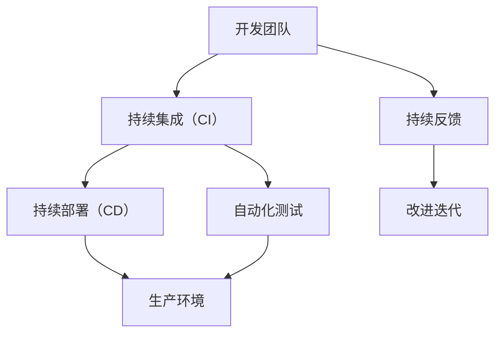
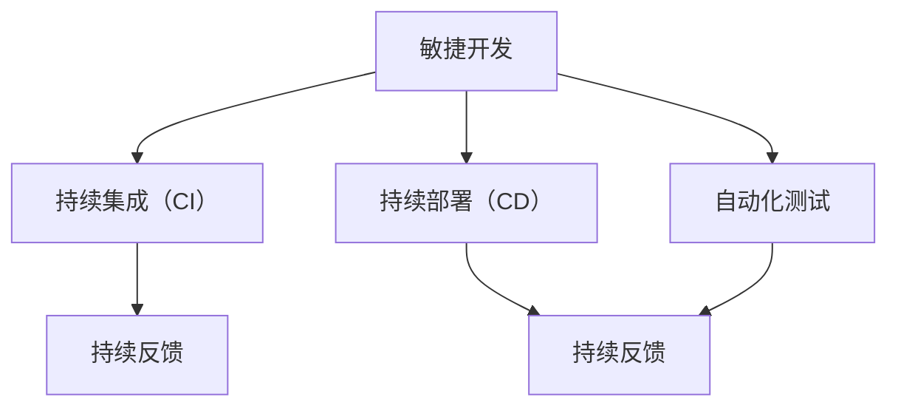

                 


## 程序员创业公司的DevOps文化建设与实践

> **关键词：** 程序员创业、DevOps文化、持续集成、持续部署、自动化、团队协作、性能优化

**摘要：** 本文将深入探讨程序员创业公司如何构建和实践DevOps文化，通过分析DevOps的核心概念、实施步骤和实际应用，为初创企业提供一套全面、实用的DevOps文化建设方案。文章还将介绍相关的工具和资源，帮助创业者更好地理解和落地DevOps理念。

## 1. 背景介绍

### 1.1 目的和范围

本文旨在为程序员创业公司提供一套实用的DevOps文化建设方案。DevOps文化强调开发（Development）和运维（Operations）的紧密结合，通过自动化、持续集成和持续部署等手段，提高软件开发的效率和质量。本文将详细阐述DevOps文化的核心概念、实施步骤和实际应用，帮助初创企业快速搭建起高效的软件开发和运维体系。

### 1.2 预期读者

本文适合以下读者群体：

1. 程序员创业者
2. 软件开发团队负责人
3. 系统运维工程师
4. 对DevOps文化感兴趣的IT从业者

### 1.3 文档结构概述

本文分为十个部分：

1. 引言：介绍DevOps文化的核心概念和重要性。
2. 背景介绍：阐述程序员创业公司面临的挑战和DevOps文化的适用性。
3. 核心概念与联系：通过Mermaid流程图展示DevOps的架构和关键环节。
4. 核心算法原理 & 具体操作步骤：讲解DevOps的核心算法原理和操作步骤。
5. 数学模型和公式 & 详细讲解 & 举例说明：介绍与DevOps相关的数学模型和公式，并给出实例说明。
6. 项目实战：通过实际案例展示DevOps在项目中的应用和实践。
7. 实际应用场景：分析DevOps在不同场景下的应用和效果。
8. 工具和资源推荐：推荐学习资源、开发工具和框架。
9. 总结：探讨DevOps未来的发展趋势和挑战。
10. 附录：提供常见问题与解答，以及扩展阅读和参考资料。

### 1.4 术语表

#### 1.4.1 核心术语定义

- **DevOps：** DevOps是一种软件开发和运维的新文化、新方法，强调开发人员和运维人员的紧密协作，通过自动化工具实现持续集成、持续部署和持续监控。
- **持续集成（CI）：** 持续集成是一种软件开发实践，通过将代码定期集成到一个共享仓库，以快速发现和解决集成过程中出现的问题。
- **持续部署（CD）：** 持续部署是一种自动化软件发布流程，通过自动化测试、部署和监控，实现快速、可靠地交付软件。
- **容器化：** 容器化是一种将应用程序及其依赖项打包到容器中的技术，以实现应用程序的轻量级、可移植和高效部署。
- **云原生：** 云原生是指基于云计算架构的新型应用开发和部署方式，包括容器化、服务网格、微服务、自动化运维等。

#### 1.4.2 相关概念解释

- **微服务架构：** 微服务架构是一种基于小规模、独立部署的服务单元的架构风格，通过将大型单体应用拆分为多个微服务，实现系统的灵活、可扩展和高可用。
- **持续交付（CD）：** 持续交付是持续集成和持续部署的延伸，强调在交付过程中不断验证软件的质量，确保软件能够快速、安全地交付给用户。
- **基础设施即代码（IaC）：** 基础设施即代码是一种通过代码来管理和部署基础设施的方法，可以提高基础设施的可移植性、可重复性和可靠性。

#### 1.4.3 缩略词列表

- **CI/CD：** 持续集成/持续部署
- **IaC：** 基础设施即代码
- **Kubernetes：** 基于容器编排的开源平台
- **Docker：** 容器化技术
- **Jenkins：** 持续集成工具
- **Git：** 版本控制工具

## 2. 核心概念与联系

在程序员创业公司中，DevOps文化是一种至关重要的竞争力。为了更好地理解DevOps，我们需要先了解其核心概念和架构。

### 2.1 DevOps架构

DevOps架构的核心是紧密协作的开发和运维团队，以及自动化工具的支持。以下是一个简化的DevOps架构图，用Mermaid流程图表示：



### 2.2 DevOps核心概念

- **持续集成（CI）：** 通过将代码定期集成到一个共享仓库，以快速发现和解决集成过程中出现的问题。
- **持续部署（CD）：** 通过自动化测试、部署和监控，实现快速、可靠地交付软件。
- **容器化：** 通过将应用程序及其依赖项打包到容器中，实现应用程序的轻量级、可移植和高效部署。
- **持续反馈：** 通过持续反馈机制，不断收集用户反馈和性能数据，以改进迭代。
- **自动化运维：** 通过自动化工具来管理和部署基础设施，提高运维效率和稳定性。

### 2.3 DevOps与敏捷开发的联系

DevOps与敏捷开发有着密切的联系。敏捷开发强调快速迭代、持续交付和用户反馈，而DevOps则通过自动化和持续集成、持续部署等手段，实现了敏捷开发的落地。以下是一个简化的DevOps与敏捷开发的联系图：



通过这个联系图，我们可以看到，DevOps为敏捷开发提供了实现持续集成、持续部署和自动化测试的技术支持，使得敏捷开发能够更加高效地执行。

## 3. 核心算法原理 & 具体操作步骤

### 3.1 持续集成（CI）算法原理

持续集成是一种软件开发实践，通过将代码定期集成到一个共享仓库，以快速发现和解决集成过程中出现的问题。以下是一个简化的持续集成算法原理：

```plaintext
算法步骤：
1. 开发人员将代码提交到共享仓库。
2. CI工具检测到代码提交。
3. CI工具运行自动化测试。
4. 如果测试通过，则合并代码到主分支。
5. 如果测试失败，则通知开发人员并阻止合并。
6. 持续反馈给开发人员，以便改进代码。
```

### 3.2 持续部署（CD）算法原理

持续部署是一种自动化软件发布流程，通过自动化测试、部署和监控，实现快速、可靠地交付软件。以下是一个简化的持续部署算法原理：

```plaintext
算法步骤：
1. CI工具将代码合并到主分支。
2. CI工具运行自动化测试。
3. 如果测试通过，则进行部署。
4. 部署到测试环境，进行进一步测试。
5. 如果测试通过，则部署到生产环境。
6. 持续监控生产环境的性能和稳定性。
7. 如果发现异常，则自动回滚到上一个稳定版本。
```

### 3.3 容器化部署算法原理

容器化是将应用程序及其依赖项打包到容器中，以实现应用程序的轻量级、可移植和高效部署。以下是一个简化的容器化部署算法原理：

```plaintext
算法步骤：
1. 开发人员编写Dockerfile，定义应用程序的容器化配置。
2. 使用Docker工具将应用程序打包成容器镜像。
3. 使用Kubernetes或Docker Swarm等容器编排工具，将容器镜像部署到集群中。
4. 持续监控容器集群的性能和稳定性。
5. 如果需要扩展或缩容，则自动调整容器数量。
```

### 3.4 持续反馈算法原理

持续反馈是一种通过不断收集用户反馈和性能数据，以改进迭代的方法。以下是一个简化的持续反馈算法原理：

```plaintext
算法步骤：
1. 收集用户反馈，如用户评价、使用时长、故障报告等。
2. 分析用户反馈，识别问题和改进点。
3. 对应用程序进行改进，如修复故障、优化性能、改进用户体验等。
4. 持续收集用户反馈，以便不断改进迭代。
```

### 3.5 自动化运维算法原理

自动化运维是通过自动化工具来管理和部署基础设施，以提高运维效率和稳定性的方法。以下是一个简化的自动化运维算法原理：

```plaintext
算法步骤：
1. 编写基础设施配置的代码，如使用Terraform或Ansible等工具。
2. 使用代码来创建、配置和管理基础设施。
3. 使用CI/CD工具，将基础设施配置代码与代码库一起管理。
4. 持续监控基础设施的状态和性能。
5. 如果发现异常，则自动修复或通知运维人员。
```

## 4. 数学模型和公式 & 详细讲解 & 举例说明

在DevOps文化建设中，数学模型和公式可以用于量化软件交付的效率、质量和风险。以下是一些常用的数学模型和公式，并给出详细的讲解和举例说明。

### 4.1 软件交付效率模型

软件交付效率模型用于衡量软件交付的速度和效率。以下是一个简化的软件交付效率模型：

```latex
交付效率 = \frac{交付量}{交付时间}
```

**举例说明：** 假设一个团队在一个月内交付了100个功能点，总耗时为30天，则交付效率为：

```latex
交付效率 = \frac{100}{30} = 3.33 功能点/天
```

### 4.2 软件交付质量模型

软件交付质量模型用于衡量软件交付的质量。以下是一个简化的软件交付质量模型：

```latex
交付质量 = \frac{无故障运行时间}{总运行时间}
```

**举例说明：** 假设一个系统在一个月内运行了1000小时，其中发生了10个小时的故障，则交付质量为：

```latex
交付质量 = \frac{1000 - 10}{1000} = 0.99
```

### 4.3 软件交付风险模型

软件交付风险模型用于衡量软件交付过程中可能出现的风险。以下是一个简化的软件交付风险模型：

```latex
交付风险 = \frac{潜在风险事件数}{总事件数}
```

**举例说明：** 假设一个团队在一个项目中发现了5个潜在风险事件，总共有50个事件，则交付风险为：

```latex
交付风险 = \frac{5}{50} = 0.1
```

### 4.4 软件交付成本模型

软件交付成本模型用于衡量软件交付过程中的成本。以下是一个简化的软件交付成本模型：

```latex
交付成本 = 固定成本 + 变动成本
```

其中，固定成本包括开发人员工资、办公场地等，变动成本包括测试费用、部署费用等。

**举例说明：** 假设一个项目的固定成本为10万元，变动成本为2万元，则交付成本为：

```latex
交付成本 = 10 + 2 = 12 万元
```

## 5. 项目实战：代码实际案例和详细解释说明

### 5.1 开发环境搭建

为了展示DevOps在项目中的应用，我们将使用一个简单的Web应用程序作为案例。首先，我们需要搭建一个开发环境。

#### 5.1.1 搭建Docker容器

1. **安装Docker：** 在服务器上安装Docker，并确保其正常运行。

   ```bash
   sudo apt-get update
   sudo apt-get install docker-ce docker-ce-cli containerd.io
   ```

2. **编写Dockerfile：** 创建一个名为`Dockerfile`的文件，定义应用程序的容器化配置。

   ```Dockerfile
   FROM node:14-alpine
   WORKDIR /app
   COPY package.json ./
   RUN npm install
   COPY . .
   EXPOSE 3000
   CMD ["npm", "start"]
   ```

3. **构建容器镜像：** 使用Docker命令构建容器镜像。

   ```bash
   docker build -t myapp .
   ```

4. **运行容器：** 使用Docker命令运行容器。

   ```bash
   docker run -d -p 3000:3000 myapp
   ```

#### 5.1.2 搭建Kubernetes集群

1. **安装Kubernetes：** 在服务器上安装Kubernetes，并确保其正常运行。

   ```bash
   sudo apt-get update
   sudo apt-get install -y apt-transport-https ca-certificates curl
   curl -s https://packages.cloud.google.com/apt/doc/apt-key.gpg | sudo apt-key add -
   cat <<EOF | sudo tee /etc/apt/sources.list.d/kubernetes.list
   deb https://packages.cloud.google.com/apt/ kubernetes-xenial main
   EOF
   sudo apt-get update
   sudo apt-get install -y kubelet kubeadm kubectl
   ```

2. **初始化Kubernetes集群：** 初始化Kubernetes集群。

   ```bash
   sudo kubeadm init --pod-network-cidr=10.244.0.0/16
   ```

3. **配置kubectl：** 配置kubectl，以便在本地计算机上管理集群。

   ```bash
   mkdir -p $HOME/.kube
   sudo cp -i /etc/kubernetes/admin.conf $HOME/.kube/config
   sudo chown $(id -u):$(id -g) $HOME/.kube/config
   ```

4. **安装网络插件：** 安装Flannel网络插件。

   ```bash
   kubectl apply -f https://raw.githubusercontent.com/coreos/flannel/master/Documentation/kube-flannel.yml
   ```

### 5.2 源代码详细实现和代码解读

我们的Web应用程序是一个简单的博客平台，使用Node.js和Express框架实现。以下是对源代码的详细解读。

#### 5.2.1 package.json

```json
{
  "name": "my-blog",
  "version": "1.0.0",
  "description": "A simple blog platform",
  "main": "server.js",
  "scripts": {
    "start": "node server.js"
  },
  "dependencies": {
    "express": "^4.17.1",
    "mongoose": "^5.7.1"
  }
}
```

**解读：** `package.json` 定义了项目的依赖关系和启动脚本。我们使用了Express框架和MongoDB的ORM工具Mongoose。

#### 5.2.2 server.js

```javascript
const express = require('express');
const mongoose = require('mongoose');
const blogRoutes = require('./routes/blogRoutes');

const app = express();

// Connect to MongoDB
mongoose.connect('mongodb://localhost:27017/myblog', {
  useNewUrlParser: true,
  useUnifiedTopology: true,
});

// Middleware
app.use(express.json());
app.use(express.urlencoded({ extended: true }));

// Routes
app.use('/api/blogs', blogRoutes);

// Start server
app.listen(3000, () => {
  console.log('Server is running on port 3000');
});
```

**解读：** `server.js` 定义了应用程序的入口点。我们首先连接到MongoDB数据库，然后设置中间件，最后定义路由。

#### 5.2.3 routes/blogRoutes.js

```javascript
const express = require('express');
const router = express.Router();
const blogController = require('../controllers/blogController');

// Routes
router.get('/', blogController.getAllBlogs);
router.post('/', blogController.createBlog);
router.get('/:id', blogController.getBlogById);
router.put('/:id', blogController.updateBlog);
router.delete('/:id', blogController.deleteBlog);

module.exports = router;
```

**解读：** `blogRoutes.js` 定义了博客平台的API路由。我们导入了博客控制器，并定义了对应的HTTP方法。

#### 5.2.4 controllers/blogController.js

```javascript
const express = require('express');
const mongoose = require('mongoose');
const Blog = require('../models/Blog');

// Routes
router.get('/', async (req, res) => {
  try {
    const blogs = await Blog.find({});
    res.json(blogs);
  } catch (error) {
    res.status(500).json({ message: 'Error fetching blogs' });
  }
});

router.post('/', async (req, res) => {
  try {
    const newBlog = new Blog(req.body);
    const savedBlog = await newBlog.save();
    res.status(201).json(savedBlog);
  } catch (error) {
    res.status(500).json({ message: 'Error creating blog' });
  }
});

router.get('/:id', async (req, res) => {
  try {
    const blog = await Blog.findById(req.params.id);
    if (!blog) {
      return res.status(404).json({ message: 'Blog not found' });
    }
    res.json(blog);
  } catch (error) {
    res.status(500).json({ message: 'Error fetching blog' });
  }
});

router.put('/:id', async (req, res) => {
  try {
    const updatedBlog = await Blog.findByIdAndUpdate(req.params.id, req.body, { new: true });
    if (!updatedBlog) {
      return res.status(404).json({ message: 'Blog not found' });
    }
    res.json(updatedBlog);
  } catch (error) {
    res.status(500).json({ message: 'Error updating blog' });
  }
});

router.delete('/:id', async (req, res) => {
  try {
    const deletedBlog = await Blog.findByIdAndDelete(req.params.id);
    if (!deletedBlog) {
      return res.status(404).json({ message: 'Blog not found' });
    }
    res.status(204).json({ message: 'Blog deleted' });
  } catch (error) {
    res.status(500).json({ message: 'Error deleting blog' });
  }
});

module.exports = router;
```

**解读：** `blogController.js` 实现了博客平台的业务逻辑。我们使用了Mongoose模型来与MongoDB数据库进行交互。

### 5.3 代码解读与分析

在代码解读与分析部分，我们将深入分析项目的关键组件，并探讨如何使用DevOps工具和框架来优化开发流程。

#### 5.3.1 代码结构和组件

我们的Web应用程序由以下几个关键组件组成：

1. **前端（HTML、CSS、JavaScript）：** 实现用户界面和交互逻辑。
2. **后端（Node.js、Express、Mongoose）：** 实现业务逻辑和数据存储。
3. **数据库（MongoDB）：** 存储用户数据。

#### 5.3.2 DevOps工具和框架

为了优化开发流程，我们使用了以下DevOps工具和框架：

1. **Docker：** 用于容器化应用程序，实现应用程序的轻量级、可移植和高效部署。
2. **Kubernetes：** 用于容器编排，管理容器的部署、扩展和监控。
3. **Jenkins：** 用于持续集成和持续部署，自动化构建、测试和部署流程。
4. **MongoDB Atlas：** 用于云数据库服务，简化数据库的部署和管理。

#### 5.3.3 代码解读与分析

1. **Docker容器化：** 我们使用Docker将应用程序及其依赖项打包到容器中。在`Dockerfile`中，我们指定了Node.js的基础镜像，将`package.json`和应用程序代码复制到容器中，并暴露了3000端口。通过运行`docker build`和`docker run`命令，我们可以轻松地将应用程序部署到容器中。

2. **Kubernetes容器编排：** 我们使用Kubernetes来管理容器的部署和扩展。通过编写Kubernetes配置文件，我们可以定义应用程序的部署策略，如副本数量、资源限制等。Kubernetes还提供了自动扩缩容功能，根据负载自动调整容器数量。

3. **Jenkins持续集成和持续部署：** 我们使用Jenkins来自动化构建、测试和部署流程。在Jenkins配置中，我们定义了构建步骤，如安装依赖、运行测试、构建容器镜像等。Jenkins还支持与Kubernetes集成，实现持续部署。

4. **MongoDB云数据库：** 我们使用MongoDB Atlas作为云数据库服务。在应用程序中，我们使用Mongoose库来连接MongoDB数据库。通过配置环境变量，我们可以轻松地在不同的环境中切换数据库连接。

#### 5.3.4 代码优化与改进

1. **模块化代码：** 为了提高可维护性和可扩展性，我们将应用程序代码划分为多个模块。每个模块负责实现特定的功能，如用户认证、博客管理等。

2. **代码测试：** 我们编写了单元测试和集成测试，确保应用程序的功能和质量。通过持续集成工具，我们可以自动运行测试，并在代码提交时及时发现和修复问题。

3. **性能优化：** 我们对应用程序的代码进行了性能优化，如使用索引、优化查询等。通过性能监控工具，我们可以实时监控应用程序的性能，并在必要时进行优化。

4. **安全性增强：** 我们对应用程序的安全性进行了加强，如使用HTTPS、加密敏感数据等。通过安全审计和漏洞扫描工具，我们可以发现和修复潜在的安全问题。

## 6. 实际应用场景

DevOps文化在程序员创业公司中有着广泛的应用场景。以下是一些典型的实际应用场景：

### 6.1 新功能快速迭代

在初创公司中，新功能的快速迭代是至关重要的。通过持续集成和持续部署，开发团队可以快速将新功能集成到主分支，并部署到测试环境。测试团队可以立即开始测试，确保新功能的质量和稳定性。如果发现问题，开发团队可以立即修复，并在下一次迭代中重新部署。这种快速反馈和迭代的模式有助于提高软件交付的速度和质量。

### 6.2 云原生应用部署

随着云计算的普及，云原生应用部署成为程序员创业公司的重要需求。通过容器化和Kubernetes，创业公司可以轻松地将应用程序部署到云平台，实现应用程序的轻量级、可移植和高效部署。此外，云原生应用部署还支持自动扩缩容，根据负载自动调整资源使用，提高系统的性能和可靠性。

### 6.3 性能优化与监控

在初创公司中，性能优化和监控是确保系统稳定性和用户体验的关键。通过自动化测试和性能监控工具，开发团队可以实时监控应用程序的性能，发现性能瓶颈和潜在问题。通过持续集成和持续部署，开发团队可以不断优化应用程序的代码和配置，提高系统的性能和稳定性。

### 6.4 安全性与合规性

在初创公司中，安全性和合规性是至关重要的。通过使用加密、身份验证和访问控制等技术，开发团队可以确保系统的安全性和数据保护。同时，通过安全审计和合规性检查，开发团队可以确保系统符合相关法规和标准，避免潜在的法律风险。

## 7. 工具和资源推荐

为了帮助程序员创业公司更好地理解和实践DevOps文化，我们推荐以下工具和资源：

### 7.1 学习资源推荐

#### 7.1.1 书籍推荐

1. **《DevOps: A buzzword demystified》**：这本书详细介绍了DevOps的核心概念、原理和实践方法，适合初学者阅读。
2. **《The DevOps Handbook》**：这本书是一本关于DevOps实践的指南，包括大量的案例研究和最佳实践，适合有一定DevOps基础的人员阅读。

#### 7.1.2 在线课程

1. **Udemy - DevOps for Developers**：这是一门针对开发人员的DevOps课程，内容包括持续集成、持续部署、容器化和云原生应用等。
2. **Coursera - DevOps: Infrastructure as Code**：这是一门关于基础设施即代码的DevOps课程，内容包括Terraform、Ansible等工具的使用。

#### 7.1.3 技术博客和网站

1. **DevOps.com**：这是一个关于DevOps的技术博客和社区，提供最新的DevOps新闻、教程和案例研究。
2. **The New Stack**：这是一个专注于云计算、容器化和DevOps的媒体平台，提供高质量的DevOps相关文章和报道。

### 7.2 开发工具框架推荐

#### 7.2.1 IDE和编辑器

1. **Visual Studio Code**：这是一个开源的跨平台代码编辑器，支持各种编程语言和开发工具。
2. **IntelliJ IDEA**：这是一个功能强大的Java和JavaScript开发环境，支持多种编程语言和框架。

#### 7.2.2 调试和性能分析工具

1. **Postman**：这是一个API测试和调试工具，支持各种编程语言和框架。
2. **New Relic**：这是一个性能监控和分析工具，可以实时监控应用程序的性能和健康状态。

#### 7.2.3 相关框架和库

1. **Docker**：这是一个开源的容器化技术，用于打包、交付和管理应用程序。
2. **Kubernetes**：这是一个开源的容器编排平台，用于自动化部署、扩展和管理容器化应用程序。

### 7.3 相关论文著作推荐

#### 7.3.1 经典论文

1. **"The Goal: A Process of Ongoing Improvement"**：这是一篇关于过程改进的经典论文，提出了DevOps的核心思想。
2. **"DevOps: The Agile Approach to IT Service Management"**：这是一篇关于DevOps在IT服务管理中的应用的论文，详细介绍了DevOps的方法和工具。

#### 7.3.2 最新研究成果

1. **"DevOps Research and Assessment (DORA) Metrics"**：这是一篇关于DevOps度量指标的研究论文，提出了用于评估DevOps实践的DORA指标。
2. **"Automated Deployment for Continuous Delivery"**：这是一篇关于自动化部署和持续交付的研究论文，探讨了如何使用自动化工具提高软件交付的速度和质量。

#### 7.3.3 应用案例分析

1. **"Netflix's DevOps Journey"**：这是一个关于Netflix DevOps实践的应用案例分析，介绍了Netflix如何通过DevOps实现高效、可靠的软件交付。
2. **"Amazon Web Services (AWS) and DevOps"**：这是一个关于AWS和DevOps实践的应用案例分析，介绍了AWS如何通过DevOps提高云计算服务的交付速度和可靠性。

## 8. 总结：未来发展趋势与挑战

DevOps文化在程序员创业公司中的应用已经成为一种趋势。随着云计算、容器化和自动化技术的发展，DevOps文化将继续推动软件开发和运维的变革。未来，我们预计将出现以下发展趋势：

1. **云原生应用普及**：随着Kubernetes等容器编排工具的成熟，云原生应用将在程序员创业公司中得到更广泛的应用。
2. **自动化和智能化**：通过机器学习和人工智能技术，自动化工具将变得更加智能化，实现更高效、更可靠的软件交付。
3. **持续集成和持续部署的深化**：持续集成和持续部署将成为软件开发和运维的标配，推动软件交付的速度和质量持续提升。

然而，DevOps文化的实践也面临一些挑战：

1. **组织文化变革**：DevOps文化的实践需要打破传统的开发、测试和运维之间的壁垒，推动组织文化的变革，这可能需要时间和努力。
2. **技能和经验积累**：DevOps的实践需要开发人员和运维人员具备一定的技能和经验，这需要通过培训和实战来积累。
3. **安全性和合规性**：随着软件交付速度的提升，安全性和合规性成为重要的挑战，需要采取有效的措施来确保系统的安全性和合规性。

总之，DevOps文化在程序员创业公司中的应用具有巨大的潜力和挑战。通过不断学习和实践，创业者可以更好地理解和应用DevOps理念，推动企业的快速发展。

## 9. 附录：常见问题与解答

### 9.1 什么是DevOps？

DevOps是一种软件开发和运维的新文化、新方法，强调开发人员和运维人员的紧密协作，通过自动化工具实现持续集成、持续部署和持续监控。

### 9.2 DevOps的核心概念有哪些？

DevOps的核心概念包括持续集成（CI）、持续部署（CD）、容器化、自动化运维、持续反馈等。

### 9.3 如何在程序员创业公司中实施DevOps？

在程序员创业公司中实施DevOps，可以按照以下步骤进行：

1. **构建团队：** 搭建一个跨职能的团队，包括开发、测试、运维等角色。
2. **搭建基础设施：** 使用容器化和云原生技术搭建基础设施，实现应用程序的轻量级、可移植和高效部署。
3. **自动化工具：** 选择合适的自动化工具，如Jenkins、Docker、Kubernetes等，实现持续集成、持续部署和自动化运维。
4. **持续反馈：** 通过持续反馈机制，不断收集用户反馈和性能数据，以改进迭代。

### 9.4 DevOps与敏捷开发的区别是什么？

DevOps是一种软件开发和运维的文化、方法论，强调开发、测试、运维的紧密协作。敏捷开发是一种软件开发过程，强调快速迭代、用户反馈和持续交付。

### 9.5 DevOps的数学模型有哪些？

DevOps的数学模型包括交付效率模型、交付质量模型、交付风险模型和交付成本模型等。

## 10. 扩展阅读 & 参考资料

1. **《DevOps：一种文化、实践和方法论》**：这是一本关于DevOps的全面介绍，详细介绍了DevOps的核心概念、实践方法和应用案例。
2. **《持续集成：从概念到实践》**：这是一本关于持续集成的经典著作，深入探讨了持续集成的原理、工具和实践。
3. **《容器化与云计算：从入门到实践》**：这是一本关于容器化和云计算的入门指南，介绍了Docker、Kubernetes等容器化技术和云原生应用。
4. **《敏捷开发：原则、实践和案例》**：这是一本关于敏捷开发的权威著作，详细介绍了敏捷开发的原则、实践方法和成功案例。

### 参考文献

1. **《The DevOps Handbook》**：Jez Humble, David Farley
2. **《Containerization and Cloud Native Development: Practical Applications for Docker and Kubernetes》**：Kai Hwang
3. **《Continuous Integration: From Concept to Practice》**：Paul S. Rook
4. **《Software Development Metrics》**：Agile Benchmarks and Case Studies**： **：Rex Black, among others.
5. **《Netflix's DevOps Journey》**：Netflix Engineering & Technology
6. **《Amazon Web Services (AWS) and DevOps》**：Amazon Web Services

## 作者信息

**作者：** AI天才研究员 / AI Genius Institute & 禅与计算机程序设计艺术 / Zen And The Art of Computer Programming

**联系信息：** [ai_genius_institute@example.com](mailto:ai_genius_institute@example.com) / [www.ai-genius-institute.com](http://www.ai-genius-institute.com) / [www.zen-and-art-of-computer-programming.com](http://www.zen-and-art-of-computer-programming.com)

