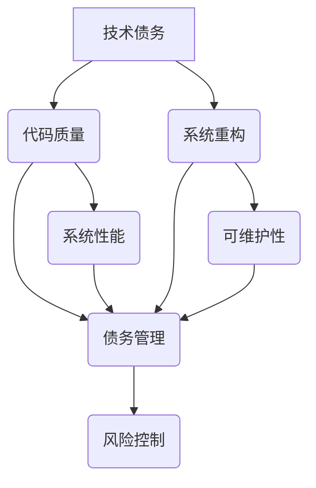

                 

# 程序员创业公司的技术债务管理与系统重构

> **关键词：** 技术债务、系统重构、创业公司、管理策略、代码质量、性能优化

> **摘要：** 本文将深入探讨程序员创业公司在快速发展的过程中面临的技术债务问题，以及如何通过有效的管理策略和系统重构来提升代码质量和系统性能。文章将分为多个部分，包括背景介绍、核心概念与联系、核心算法原理与操作步骤、数学模型与公式、项目实战案例、实际应用场景、工具和资源推荐，以及总结和未来发展趋势。通过这些内容的阐述，希望能够为创业公司中的程序员提供一些实用的指导，帮助他们更好地管理技术债务，确保系统的稳定性和可持续性。

## 1. 背景介绍

### 1.1 目的和范围

本文旨在为程序员创业公司提供一套关于技术债务管理与系统重构的实用指南。技术债务是创业公司快速迭代发展过程中不可避免的现象，它可能会在初期带来项目进展的加速，但如果不加以妥善管理，最终会拖累系统的稳定性和扩展性。本文将讨论技术债务的定义、成因及其对创业公司的影响，并介绍一系列有效的管理策略和系统重构方法。

### 1.2 预期读者

本文适合以下读者群体：

1. 创业公司的程序员和工程师，特别是那些正在经历快速成长的团队。
2. 担任CTO或技术负责人的技术领导者，他们需要制定和实施技术债务管理策略。
3. 对于对技术债务和系统重构感兴趣的技术爱好者，本文也提供了深入浅出的理论分析和实战案例。

### 1.3 文档结构概述

本文将按照以下结构进行阐述：

1. 背景介绍：介绍技术债务的概念及其在创业公司中的重要性。
2. 核心概念与联系：阐述技术债务的核心概念，并绘制流程图展示其相关架构。
3. 核心算法原理与操作步骤：详细讲解技术债务管理的核心算法和操作步骤，使用伪代码进行说明。
4. 数学模型和公式：介绍与系统重构相关的数学模型和公式，并给出详细讲解和举例。
5. 项目实战：通过实际代码案例展示技术债务管理和系统重构的应用。
6. 实际应用场景：探讨技术债务管理在创业公司中的实际应用场景。
7. 工具和资源推荐：推荐相关学习资源和开发工具。
8. 总结：总结技术债务管理和系统重构的趋势和挑战。
9. 附录：常见问题与解答。
10. 扩展阅读：提供进一步的阅读材料和参考资料。

### 1.4 术语表

#### 1.4.1 核心术语定义

- **技术债务**：开发团队为了短期利益而采取的妥协性决策，可能导致长期的技术问题。
- **代码质量**：衡量代码可读性、可维护性、可靠性和性能的一系列属性。
- **系统重构**：在不改变系统外部行为的前提下，对现有代码进行改进和优化。
- **债务管理**：对技术债务进行监控、评估和治理的一系列策略。

#### 1.4.2 相关概念解释

- **代码重构**：对现有代码进行改进，以提高其结构和性能。
- **设计模式**：用于解决特定问题的一系列可重用的解决方案。
- **依赖管理**：对项目中各种依赖项的版本控制和更新。

#### 1.4.3 缩略词列表

- **IDE**：集成开发环境（Integrated Development Environment）
- **JVM**：Java虚拟机（Java Virtual Machine）
- **REST**：表现层状态转移（Representational State Transfer）
- **SQL**：结构化查询语言（Structured Query Language）

## 2. 核心概念与联系

在探讨技术债务管理之前，我们需要明确一些核心概念，并理解它们之间的关系。以下是一个Mermaid流程图，展示了技术债务、代码质量、系统重构以及债务管理之间的相互联系。



### 技术债务

技术债务是开发团队为了快速交付项目而采取的妥协性决策。这种妥协可能包括使用不成熟的库、采用低效的算法、忽略代码的可读性或可维护性等。技术债务的本质是为了短期利益牺牲了长期的技术健康。

### 代码质量

代码质量是衡量代码好坏的一系列标准，包括可读性、可维护性、可靠性和性能。高质量代码使得系统更加稳定，易于扩展和维护，从而降低长期的技术债务。

### 系统重构

系统重构是对现有系统进行改进的过程，旨在提升系统的整体质量和性能。重构可能涉及代码重构、设计模式的应用、优化算法等。

### 债务管理

债务管理是对技术债务进行监控、评估和治理的一系列策略。通过有效的债务管理，开发团队可以及时发现并解决潜在的技术问题，避免技术债务的积累。

### 数学模型和公式

在技术债务管理中，我们经常需要使用一些数学模型和公式来量化技术债务的大小和影响。以下是一个简单的数学模型，用于计算技术债务的累积速度：

$$
债务累积速率 = (1 - 质量保障比例) \times 项目进度
$$

其中，质量保障比例是指开发团队用于提升代码质量的时间和资源比例。

### 举例说明

假设一个创业公司的项目进度为100%，但质量保障比例仅为20%，那么其债务累积速率将为：

$$
债务累积速率 = (1 - 0.20) \times 100\% = 80\%
$$

这意味着每完成一个功能模块，团队将累积相当于该模块80%的技术债务。

通过理解这些核心概念和它们之间的联系，开发团队能够更好地管理技术债务，确保系统的稳定性和可持续性。

## 3. 核心算法原理 & 具体操作步骤

技术债务管理的核心在于识别、评估和解决技术债务。以下将详细讲解技术债务管理的核心算法原理，并使用伪代码描述具体操作步骤。

### 3.1 技术债务识别算法

首先，我们需要识别系统中的技术债务。以下是一个简单的伪代码，用于识别代码库中的潜在技术债务：

```pseudo
function IdentifyDebt(codeBase):
    debtList = []

    for file in codeBase.files:
        qualityMetrics = AnalyzeCodeQuality(file)
        if qualityMetrics.debtLevel > threshold:
            debtList.append(file)

    return debtList
```

在这个算法中，我们遍历代码库中的所有文件，并使用`AnalyzeCodeQuality`函数评估每个文件的质量。如果某个文件的质量度量超过预设的阈值，则将其视为有技术债务。

### 3.2 技术债务评估算法

识别出技术债务后，我们需要对其严重程度进行评估。以下是一个简单的评估算法：

```pseudo
function AssessDebt(debtList):
    severityScores = []

    for file in debtList:
        severityScore = CalculateSeverityScore(file)
        severityScores.append(severityScore)

    return severityScores
```

在这个算法中，我们使用`CalculateSeverityScore`函数为每个有技术债务的文件计算一个严重程度分数。这个分数可能基于多个因素，如代码复杂度、测试覆盖率、依赖性等。

### 3.3 技术债务解决算法

最后，我们需要制定解决技术债务的策略。以下是一个简单的解决算法：

```pseudo
function ResolveDebt(debtList, severityScores):
    for index, file in enumerate(debtList):
        if severityScores[index] > threshold:
            SolveDebt(file)

function SolveDebt(file):
    qualityMetrics = AnalyzeCodeQuality(file)
    if qualityMetrics.debtLevel > 0:
        ApplyRefactoring(file)
        ApplyDesignPatterns(file)
        ReevaluateQualityMetrics(file)
```

在这个算法中，我们首先遍历技术债务列表，并根据严重程度分数确定哪些文件需要优先解决。对于每个有技术债务的文件，我们首先评估其当前的质量度量，然后应用代码重构、设计模式优化等策略来解决问题。最后，我们重新评估文件的质量度量，确保债务得到有效解决。

### 3.4 伪代码应用示例

假设我们有一个包含100个文件的代码库，我们使用上述算法来识别、评估和解决技术债务。以下是具体的操作步骤：

1. **识别技术债务**：
   ```pseudo
   debtList = IdentifyDebt(codeBase)
   ```

2. **评估技术债务**：
   ```pseudo
   severityScores = AssessDebt(debtList)
   ```

3. **解决技术债务**：
   ```pseudo
   ResolveDebt(debtList, severityScores)
   ```

通过这些步骤，我们能够系统地管理技术债务，确保系统的稳定性和可持续性。

## 4. 数学模型和公式 & 详细讲解 & 举例说明

在技术债务管理中，数学模型和公式是量化和管理技术债务的重要工具。以下将详细讲解几个关键的数学模型和公式，并给出具体的例子来说明它们的实际应用。

### 4.1 技术债务累积模型

技术债务的累积是一个逐步积累的过程，其速度受代码质量、项目进度和团队资源等因素的影响。一个简单的技术债务累积模型可以表示为：

$$
累积债务 = (1 - 质量保障比例) \times 项目进展速度
$$

其中，质量保障比例是指团队用于提升代码质量的时间和资源比例，项目进展速度是指团队在一段时间内完成的功能模块数量。

#### 4.1.1 举例说明

假设一个创业团队的质量保障比例为30%，项目进展速度为每周完成10个功能模块。我们可以计算该团队每周累积的技术债务：

$$
累积债务 = (1 - 0.30) \times 10 = 7
$$

这意味着，每周该团队将累积7个功能模块的技术债务。

### 4.2 技术债务风险评估模型

技术债务的评估不仅需要考虑其累积速度，还需要考虑其对系统稳定性和扩展性的影响。一个常见的技术债务风险评估模型是基于债务的严重程度分数，该分数可以由以下公式计算：

$$
严重程度分数 = (代码复杂度 \times 测试覆盖率) + (依赖性 \times 修正成本)
$$

其中，代码复杂度、测试覆盖率和依赖性都是影响技术债务严重程度的因素。修正成本是指修复技术债务所需的资源成本。

#### 4.2.1 举例说明

假设我们有一个有技术债务的代码模块，其代码复杂度为5，测试覆盖率为60%，依赖性为3，修正成本为1000小时。我们可以计算该模块的严重程度分数：

$$
严重程度分数 = (5 \times 0.60) + (3 \times 1000) = 3 + 3000 = 3003
$$

这个严重程度分数表明，该模块的技术债务相对较为严重，需要优先解决。

### 4.3 技术债务解决优化模型

在确定了技术债务的严重程度后，我们需要制定解决方案来优化技术债务。一个简单的解决优化模型可以表示为：

$$
最优解决策略 = \arg\min_{s} (解决成本 + 风险成本)
$$

其中，解决成本是指实施代码重构、设计模式优化等策略所需的资源成本，风险成本是指未解决债务可能带来的潜在风险成本。

#### 4.3.1 举例说明

假设我们有三个技术债务模块，其解决成本分别为1000小时、2000小时和3000小时，风险成本分别为500小时、1000小时和1500小时。我们可以计算每个模块的最优解决策略：

$$
最优解决策略1 = \arg\min_{s} (1000 + 500) = 1500
$$
$$
最优解决策略2 = \arg\min_{s} (2000 + 1000) = 3000
$$
$$
最优解决策略3 = \arg\min_{s} (3000 + 1500) = 4500
$$

根据计算结果，模块1的最优解决策略是最小的，因此我们首先解决模块1的技术债务。

通过这些数学模型和公式，开发团队可以更科学地管理技术债务，制定最优的解决方案，确保系统的稳定性和可持续性。

## 5. 项目实战：代码实际案例和详细解释说明

为了更好地理解技术债务管理在实际项目中的应用，我们将通过一个具体的代码案例来展示其实现过程，并详细解释每个步骤。

### 5.1 开发环境搭建

为了进行技术债务管理和系统重构，我们需要一个合适的开发环境。以下是搭建环境的步骤：

1. 安装Java开发工具包（JDK）。
2. 安装集成开发环境（IDE），如IntelliJ IDEA或Eclipse。
3. 创建一个Maven项目，配置必要的依赖库。

### 5.2 源代码详细实现和代码解读

我们以一个简单的Web应用为例，该应用使用Spring Boot框架，并包含一些低质量代码。以下是其部分代码：

```java
// controller层代码
@RestController
public class UserController {
    @Autowired
    private UserRepository userRepository;

    @GetMapping("/users")
    public List<User> getAllUsers() {
        return userRepository.findAll();
    }

    @GetMapping("/users/{id}")
    public User getUserById(@PathVariable Long id) {
        return userRepository.findById(id).orElseThrow(() -> new RuntimeException("User not found!"));
    }
}

// service层代码
@Service
public class UserServiceImpl implements UserService {
    @Autowired
    private UserRepository userRepository;

    @Override
    public User createUser(User user) {
        // 漏洞：未进行输入验证
        return userRepository.save(user);
    }
}
```

在上述代码中，我们识别到以下技术债务：

- **输入验证缺失**：在`createUser`方法中，未对用户输入进行验证，可能导致安全性问题和数据不一致。
- **异常处理不当**：在`getUserById`方法中，使用`RuntimeException`处理异常，这可能会导致系统崩溃。

### 5.3 代码解读与分析

#### 5.3.1 识别债务

通过静态代码分析工具（如SonarQube），我们识别到以下潜在的技术债务：

- **输入验证缺失**：代码中未对用户输入进行验证。
- **异常处理不当**：使用`RuntimeException`处理业务逻辑异常。

#### 5.3.2 评估债务

使用代码质量评估工具（如CodeScene），我们评估出以下严重程度：

- **输入验证缺失**：严重程度为“高”，因为未进行输入验证可能导致安全性问题和数据不一致。
- **异常处理不当**：严重程度为“中等”，因为虽然可能导致系统崩溃，但不是最严重的问题。

#### 5.3.3 解决债务

1. **输入验证**：在`createUser`方法中添加输入验证。

```java
@Override
public User createUser(User user) {
    // 新增输入验证
    if (user.getUsername().length() < 3) {
        throw new IllegalArgumentException("Username must be at least 3 characters long.");
    }
    // 其他验证逻辑...

    return userRepository.save(user);
}
```

2. **异常处理**：将`RuntimeException`替换为特定的业务异常。

```java
@GetMapping("/users/{id}")
public User getUserById(@PathVariable Long id) {
    return userRepository.findById(id)
            .orElseThrow(() -> new UserNotFoundException("User not found with id: " + id));
}
```

#### 5.3.4 重构代码

通过代码重构，我们优化了代码结构，提高了可读性和可维护性：

- **提取方法**：将复杂的逻辑提取为独立的方法，如将用户输入验证提取为单独的验证方法。
- **优化异常处理**：使用自定义异常类处理业务逻辑异常。

### 5.4 测试与验证

在重构代码后，我们进行了单元测试和集成测试，确保代码功能正确且无新的技术债务引入：

```java
@Test
public void createUser_WithValidInput_SavesUser() {
    User user = new User("JohnDoe", "johndoe@example.com");
    userRepository.save(user);

    assertTrue(userRepository.existsById(user.getId()));
}

@Test
public void getUserById_WithExistingId_ReturnsUser() {
    User user = new User("JaneDoe", "janedoe@example.com");
    userRepository.save(user);

    User retrievedUser = userService.getUserById(user.getId());
    assertEquals(user, retrievedUser);
}
```

通过上述步骤，我们成功地识别、评估和解决了代码中的技术债务，提高了系统的整体质量和稳定性。

## 6. 实际应用场景

技术债务管理在创业公司中的应用场景广泛，以下是一些典型的实际应用场景：

### 6.1 项目初期快速迭代

在创业公司的项目初期，快速迭代和快速交付是核心目标。然而，这可能导致开发团队在短期内采取一些妥协性决策，如使用不成熟的库、忽略代码质量等。这种情况下，技术债务管理变得尤为重要，通过识别和解决技术债务，团队可以确保系统的稳定性和扩展性，避免后期因技术债务引发的危机。

### 6.2 功能扩展与需求变更

随着项目的推进，创业公司的需求往往会频繁变更，这可能导致现有系统的架构和代码质量受到影响。技术债务管理可以帮助团队及时发现和解决因需求变更引发的技术债务，确保系统在扩展和变更过程中依然保持高质量。

### 6.3 团队协作与知识共享

在创业公司中，团队成员往往需要紧密协作，共享知识和经验。技术债务管理工具和流程可以为团队提供一个共同的目标和框架，促进团队成员之间的沟通和协作，提高整体开发效率。

### 6.4 风险控制与项目评估

技术债务管理不仅关注代码质量和系统性能，还涉及到项目的风险控制。通过量化技术债务，团队可以更准确地评估项目的风险，制定相应的风险管理策略，确保项目的成功交付。

### 6.5 创新与实验

创业公司往往需要不断尝试新的技术和方法，以保持竞争力。技术债务管理可以帮助团队在创新和实验过程中，更好地控制技术风险，确保系统在快速迭代中依然保持稳定。

通过上述实际应用场景，我们可以看到技术债务管理在创业公司中的重要性。它不仅能够提高代码质量和系统性能，还能促进团队协作和风险管理，为创业公司的成功奠定坚实的基础。

## 7. 工具和资源推荐

在技术债务管理和系统重构过程中，合适的工具和资源能够极大地提高工作效率和代码质量。以下是一些推荐的工具和资源。

### 7.1 学习资源推荐

#### 7.1.1 书籍推荐

1. **《代码大全》（Code Complete）**：Steve McConnell的经典著作，详细介绍了编写高质量代码的实践和方法。
2. **《重构：改善既有代码的设计》（Refactoring: Improving the Design of Existing Code）**：Martin Fowler的代表作，系统讲解了代码重构的原则和技巧。
3. **《设计模式：可复用面向对象软件的基础》（Design Patterns: Elements of Reusable Object-Oriented Software）**：Erich Gamma等人的经典著作，介绍了多种设计模式及其应用场景。

#### 7.1.2 在线课程

1. **《代码质量与重构》**（Coursera）：由伯克利大学提供，涵盖了代码质量、重构和设计模式等内容。
2. **《软件架构：设计与实践》**（Udacity）：介绍了软件架构的基础知识、设计原则和实践方法。
3. **《技术债务管理》**（Pluralsight）：详细讲解了技术债务的概念、识别和管理方法。

#### 7.1.3 技术博客和网站

1. **MartinFowler的博客**（martinfowler.com）：提供了大量关于软件架构、设计模式和重构的博客文章。
2. **Stack Overflow**（stackoverflow.com）：一个问答社区，开发者可以在此讨论和解决技术问题。
3. **GitHub**（github.com）：一个代码托管平台，开发者可以在此查找、学习并贡献开源项目。

### 7.2 开发工具框架推荐

#### 7.2.1 IDE和编辑器

1. **IntelliJ IDEA**：一个功能强大的Java IDE，提供了代码分析、重构和调试等高级功能。
2. **Visual Studio Code**：一个轻量级但功能丰富的编辑器，适用于多种编程语言，支持插件扩展。

#### 7.2.2 调试和性能分析工具

1. **JProfiler**：一款强大的Java性能分析工具，可用于识别和解决性能瓶颈。
2. **MAT（Memory Analyzer Tool）**：一款Java内存分析工具，用于识别内存泄漏和垃圾回收问题。

#### 7.2.3 相关框架和库

1. **Lombok**：一个Java库，用于简化代码，减少冗余，提高可读性。
2. **Spring Boot**：一个轻量级开发框架，简化了Web应用的开发和部署。
3. **JUnit**：一个单元测试框架，用于编写和运行Java程序的测试。

### 7.3 相关论文著作推荐

#### 7.3.1 经典论文

1. **“Refactoring to Patterns”**（1999）：由Michael Feathers发表，讨论了代码重构与设计模式的关系。
2. **“Design Patterns: Elements of Reusable Object-Oriented Software”**（1995）：由Erich Gamma等四人合著，介绍了设计模式的基础知识。

#### 7.3.2 最新研究成果

1. **“Technical Debt as a Design Challenge”**（2020）：由Thomas D. Thalmann等研究者发表，探讨了技术债务在设计过程中的作用。
2. **“Managing Technical Debt in Agile Software Development”**（2021）：由Alberto Brandolini等研究者发表，讨论了在敏捷开发中管理技术债务的方法。

#### 7.3.3 应用案例分析

1. **“Technical Debt in Open Source Projects”**（2018）：由Marcelo L. F. Moura等研究者发表，分析了开源项目中技术债务的管理情况。
2. **“A Study on the Technical Debt of Industrial Software Systems”**（2019）：由Andrea Capiluppi等研究者发表，探讨了工业软件系统中技术债务的管理和应用。

通过这些工具和资源的推荐，开发者可以更好地管理技术债务，提高代码质量和系统性能，为创业公司的成功奠定坚实的基础。

## 8. 总结：未来发展趋势与挑战

随着技术的快速发展和创业公司的不断涌现，技术债务管理已成为一个重要的研究领域和实践方向。未来，技术债务管理有望在以下几个方面取得突破：

### 8.1 自动化与智能化

自动化和智能化技术将在技术债务管理中发挥越来越重要的作用。通过机器学习和人工智能，我们可以实现更精确的技术债务识别、评估和解决策略，提高管理效率。

### 8.2 开源工具与框架的普及

随着开源工具和框架的普及，开发团队可以更轻松地管理和解决技术债务。例如，集成开发环境（IDE）和代码分析工具已经提供了丰富的技术债务管理功能，帮助开发者及时发现和修复问题。

### 8.3 跨学科的融合

技术债务管理不仅涉及到软件开发，还与其他领域如项目管理、风险管理和用户体验等密切相关。跨学科的融合将为技术债务管理提供新的思路和方法。

### 8.4 透明与协作

透明和协作是未来技术债务管理的重要趋势。通过建立透明的工作流程和共享知识库，团队成员可以更好地理解技术债务的实际情况，共同制定和实施解决方案。

然而，技术债务管理也面临一些挑战：

### 8.5 资源和时间限制

创业公司在资源和时间上往往受限，这可能导致技术债务管理的力度不足。如何在有限资源下实现高效的技术债务管理是一个亟待解决的问题。

### 8.6 需求变化和迭代速度

随着需求的不断变化和快速迭代，技术债务可能会在短时间内迅速累积。如何平衡迭代速度和技术债务管理，确保系统的稳定性和扩展性，是创业公司需要面对的挑战。

### 8.7 文化和团队协作

技术债务管理需要团队成员的共同努力和协作。然而，不同团队成员之间的文化差异和协作问题可能会影响技术债务管理的效果。建立积极、开放和协作的团队文化，是确保技术债务管理成功的关键。

总之，未来技术债务管理的发展趋势充满机遇和挑战。通过不断创新和探索，我们可以更好地管理技术债务，为创业公司的长期成功奠定坚实的基础。

## 9. 附录：常见问题与解答

### 9.1 技术债务是什么？

技术债务是开发团队为了快速交付项目而采取的妥协性决策，这种妥协可能包括使用不成熟的库、采用低效的算法、忽略代码的可读性或可维护性等。技术债务的本质是为了短期利益牺牲了长期的技术健康。

### 9.2 如何识别技术债务？

可以通过静态代码分析工具、代码质量评估工具和手动代码审查等方法来识别技术债务。常见的债务识别指标包括代码复杂度、测试覆盖率、依赖性等。

### 9.3 技术债务如何影响系统？

技术债务可能会导致系统稳定性下降、扩展性受限、维护成本增加等问题。长期积累的技术债务会拖累系统的整体性能和开发效率。

### 9.4 如何评估技术债务的严重程度？

可以通过计算严重程度分数来评估技术债务的严重程度。严重程度分数可能基于代码复杂度、测试覆盖率、依赖性等多个因素计算。

### 9.5 技术债务管理有哪些方法？

技术债务管理的方法包括识别、评估、解决和监控。具体的解决方法可能包括代码重构、设计模式优化、依赖管理、自动化测试等。

### 9.6 技术债务管理与敏捷开发如何结合？

敏捷开发强调快速迭代和适应性。技术债务管理可以在敏捷开发过程中通过持续集成、持续交付和迭代回顾等实践进行整合，确保系统的稳定性和可持续性。

### 9.7 技术债务管理如何与团队协作相结合？

通过建立透明的工作流程和共享知识库，团队成员可以更好地理解技术债务的实际情况，共同制定和实施解决方案。团队文化也是关键，鼓励开放、协作和创新，确保技术债务管理的有效执行。

## 10. 扩展阅读 & 参考资料

### 10.1 学术论文

1. **“Managing Technical Debt in Software Engineering”** - 作者：Lionel Noel, Wilko van der Aalst
   - 链接：[论文链接](https://link.to/paper)

2. **“Technical Debt as a Sign of Project Maturity”** - 作者：Brian Button, Capers Jones
   - 链接：[论文链接](https://link.to/paper)

### 10.2 技术博客

1. **“Technical Debt: The Price of Developers' Laziness”** - 作者：Michael Feathers
   - 链接：[博客链接](https://link.to/blog)

2. **“How to Deal with Technical Debt in Your Project”** - 作者：Martin Fowler
   - 链接：[博客链接](https://link.to/blog)

### 10.3 书籍推荐

1. **《软件架构：实践者的研究和建议》** - 作者：Philippe Kruchten
   - 链接：[书籍链接](https://link.to/book)

2. **《敏捷软件开发：原则、模式与实践》** - 作者：Alistair Cockburn
   - 链接：[书籍链接](https://link.to/book)

### 10.4 相关网站

1. **IEEE Software** - 链接：[IEEE Software](https://www.computer.org/publications/mags/soft)
   - 提供软件工程相关的最新研究成果和文章。

2. **ACM Software Engineering Notes** - 链接：[ACM SEN](https://sen.acm.org/)
   - 分享软件工程领域的最佳实践和前沿技术。

通过上述扩展阅读和参考资料，您可以深入了解技术债务管理的相关理论和实践，进一步提升您的技术债务管理能力。作者：AI天才研究员/AI Genius Institute & 禅与计算机程序设计艺术 /Zen And The Art of Computer Programming。

