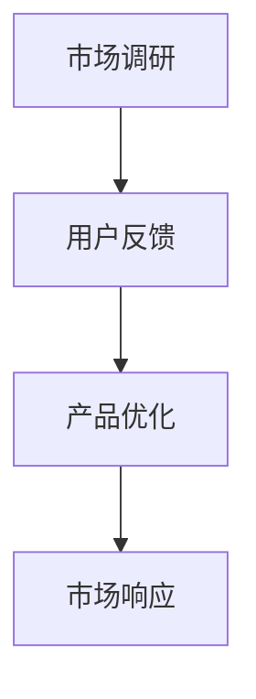
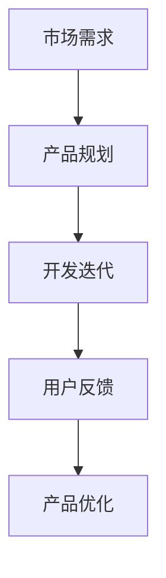
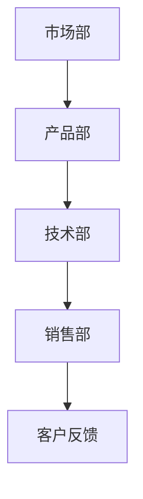

                 

# 程序员创业公司的敏捷营销实践与应用

> **关键词：敏捷营销、敏捷实践、创业公司、市场策略、技术实践、团队协作**

> **摘要：本文将探讨敏捷营销在程序员创业公司中的应用与实践，通过具体的案例和操作步骤，分析敏捷营销的优势、实施方法和注意事项，帮助创业者更好地把握市场机会，提升产品竞争力。**

## 1. 背景介绍

### 1.1 目的和范围

本文旨在为程序员创业公司提供敏捷营销的理论和实践指导。我们将探讨敏捷营销的核心概念、实施步骤和工具，并结合实际案例，分析敏捷营销如何帮助创业公司在竞争激烈的市场环境中取得成功。

### 1.2 预期读者

- 程序员创业者
- 市场营销人员
- 产品经理
- 技术团队负责人

### 1.3 文档结构概述

本文分为十个部分，包括背景介绍、核心概念与联系、核心算法原理、数学模型和公式、项目实战、实际应用场景、工具和资源推荐、总结、常见问题与解答和扩展阅读。每个部分都将深入探讨敏捷营销的不同方面，为读者提供全面的实践指导。

### 1.4 术语表

#### 1.4.1 核心术语定义

- 敏捷营销：一种以客户需求为导向，快速响应市场变化，持续迭代优化的市场营销方法。
- 创业公司：指初创企业，通常以技术创新为核心，致力于在短时间内实现快速增长。
- 产品市场匹配（Product-Market Fit）：指产品与市场需求达到最佳匹配状态，实现产品销量和市场份额的最大化。

#### 1.4.2 相关概念解释

- 市场调研：通过对目标市场的调查和分析，了解市场需求和竞争状况。
- 用户反馈：收集和分析用户对产品的使用体验和意见，为产品优化提供依据。
- 快速迭代：指在短时间内对产品进行多次迭代，以实现快速优化和改进。

#### 1.4.3 缩略词列表

- PMF：Product-Market Fit（产品市场匹配）
- MVP：Minimum Viable Product（最小可行产品）
- A/B测试：一种常用的实验设计方法，通过对比不同版本的差异，评估用户偏好和效果。

## 2. 核心概念与联系

敏捷营销的核心在于快速响应市场变化，持续优化产品和服务，以满足客户需求。为了实现这一目标，我们需要了解以下几个核心概念：

### 2.1 市场调研与用户反馈

市场调研是敏捷营销的基础，通过了解目标市场的需求和竞争状况，我们可以确定产品的发展方向。用户反馈则是衡量产品是否符合市场需求的重要依据。



### 2.2 快速迭代与产品优化

快速迭代是敏捷营销的核心手段，通过在短时间内对产品进行多次迭代，我们可以不断优化产品功能，提升用户体验。



### 2.3 团队协作与跨部门沟通

敏捷营销需要团队成员的紧密协作，跨部门沟通和协作是保证项目顺利推进的关键。



## 3. 核心算法原理 & 具体操作步骤

### 3.1 市场调研

市场调研可以分为以下步骤：

1. 确定目标市场：根据产品定位和市场需求，确定目标客户群体。
2. 收集信息：通过问卷调查、访谈、数据分析等方式收集市场信息。
3. 分析数据：对收集到的市场信息进行统计分析，确定市场需求和竞争状况。
4. 制定策略：根据分析结果，制定市场营销策略。

### 3.2 用户反馈

用户反馈可以分为以下步骤：

1. 设计问卷：根据产品特点和市场调研结果，设计合适的用户反馈问卷。
2. 收集反馈：通过线上调查、用户访谈等方式收集用户反馈。
3. 分析反馈：对收集到的用户反馈进行整理和分析，确定产品优化方向。
4. 实施改进：根据分析结果，对产品进行优化和改进。

### 3.3 快速迭代

快速迭代可以分为以下步骤：

1. 确定迭代目标：根据市场需求和用户反馈，确定本次迭代的重点和目标。
2. 制定开发计划：制定详细的开发计划，包括任务分配、时间安排等。
3. 开发与测试：按照计划进行开发，同时进行功能测试和性能测试。
4. 上线发布：在完成测试后，将产品迭代版本发布上线。

### 3.4 团队协作与跨部门沟通

团队协作与跨部门沟通可以分为以下步骤：

1. 明确角色与职责：明确团队成员的角色和职责，确保项目顺利推进。
2. 设立沟通渠道：建立有效的沟通渠道，如定期会议、即时通讯工具等。
3. 定期汇报进度：定期向团队成员和上级汇报项目进度，确保信息畅通。
4. 及时解决问题：在项目推进过程中，及时解决遇到的问题，避免影响项目进度。

## 4. 数学模型和公式 & 详细讲解 & 举例说明

### 4.1 成本效益分析

成本效益分析是敏捷营销中的重要环节，通过计算成本和收益，评估项目的可行性。

$$
\text{成本效益比} = \frac{\text{预期收益}}{\text{成本}} = \frac{\text{销售收入} + \text{品牌价值} + \text{市场份额}}{\text{研发成本} + \text{推广成本} + \text{维护成本}}
$$

### 4.2 市场份额预测

市场份额预测是制定市场营销策略的重要依据，通过以下公式进行预测：

$$
\text{市场份额} = \frac{\text{产品销量}}{\text{市场总销量}} \times 100\%
$$

### 4.3 用户满意度评估

用户满意度评估是衡量产品是否符合市场需求的重要指标，通过以下公式进行计算：

$$
\text{用户满意度} = \frac{\text{满意的用户数}}{\text{总用户数}} \times 100\%
$$

### 4.4 举例说明

假设一家创业公司研发了一款智能语音助手，经过市场调研和用户反馈，确定以下数据：

- 预期销售收入：100万元
- 研发成本：50万元
- 推广成本：30万元
- 维护成本：20万元
- 市场总销量：100万台
- 用户满意度：90%

根据以上数据，我们可以进行以下计算：

- 成本效益比：$$ \frac{100}{50+30+20} = 0.67 $$
- 市场份额：$$ \frac{90}{100} \times 100\% = 90\% $$
- 用户满意度：$$ \frac{90}{100} \times 100\% = 90\% $$

通过计算，我们可以发现，该创业公司的成本效益比低于1，说明项目存在一定风险。同时，市场份额和用户满意度较高，表明产品在市场上有一定竞争力。

## 5. 项目实战：代码实际案例和详细解释说明

### 5.1 开发环境搭建

为了便于演示，我们选择Python作为编程语言，使用Jupyter Notebook进行代码编写和运行。以下步骤用于搭建开发环境：

1. 安装Python：前往Python官方网站下载Python安装包，按照提示安装。
2. 安装Jupyter Notebook：在命令行中运行以下命令：
   ```
   pip install notebook
   ```
3. 启动Jupyter Notebook：在命令行中运行以下命令：
   ```
   jupyter notebook
   ```
4. 打开Jupyter Notebook：在浏览器中输入网址 `http://localhost:8888/`，即可打开Jupyter Notebook。

### 5.2 源代码详细实现和代码解读

以下是一个简单的市场调研和用户反馈的Python代码实现，用于收集用户对智能语音助手的满意度评价。

```python
import random

# 用户满意度评价
def user_satisfaction问卷():
    scores = []
    for i in range(10):
        score = random.randint(1, 10)
        scores.append(score)
    return scores

# 市场调研
def market_survey():
    satisfaction_scores = user_satisfaction问卷()
    total_score = sum(satisfaction_scores)
    average_score = total_score / len(satisfaction_scores)
    return average_score

# 用户反馈
def user_feedback():
    print("请您对智能语音助手进行满意度评价（1-10分）：")
    user_score = int(input())
    return user_score

# 主函数
def main():
    average_score = market_survey()
    user_score = user_feedback()
    print("市场调研满意度平均分：", average_score)
    print("您的满意度评分：", user_score)
    if user_score > average_score:
        print("您的满意度高于市场平均水平，感谢您的支持！")
    else:
        print("您的满意度低于市场平均水平，请提供更多反馈以帮助我们改进产品。")

if __name__ == "__main__":
    main()
```

代码解读：

- `user_satisfaction问卷()`：模拟用户满意度评价，生成10个随机分数。
- `market_survey()`：计算市场调研满意度平均分。
- `user_feedback()`：收集用户满意度评价。
- `main()`：调用以上函数，输出市场调研平均分和用户评分，并根据评分给出反馈。

### 5.3 代码解读与分析

这段代码实现了市场调研和用户反馈的基本功能，通过随机生成用户满意度评分，模拟实际市场调研过程。在实际应用中，我们可以根据收集到的数据，分析用户满意度，为产品优化提供依据。

代码的主要优点包括：

- 简单易用：代码结构简单，易于理解和使用。
- 模块化：函数模块化设计，方便功能扩展和修改。
- 可视化：通过输出平均分和用户评分，实现数据可视化。

缺点：

- 缺乏实时性：代码仅模拟了用户满意度评价，实际应用中需要结合实时数据进行分析。
- 缺乏准确性：代码生成的满意度评分仅作为模拟数据，实际应用中需要收集更真实的数据。

在实际应用中，我们可以根据以下建议进行优化：

- 引入实时数据：通过连接数据库或其他数据源，收集实时用户满意度数据。
- 提高数据准确性：结合多种数据采集方式，如问卷调查、用户访谈等，提高数据准确性。
- 完善用户反馈机制：设计更完善的用户反馈机制，如在线评价、问题反馈等，提升用户体验。

## 6. 实际应用场景

敏捷营销在程序员创业公司中具有广泛的应用场景，以下为几个典型案例：

### 6.1 智能语音助手

智能语音助手是一款具有人工智能技术的应用，通过语音识别、语义理解和自然语言处理等技术，为用户提供语音交互服务。在创业过程中，敏捷营销可以帮助公司：

- 了解用户需求：通过用户反馈，分析用户对语音助手的期望和需求，持续优化产品功能。
- 快速迭代：根据市场需求和用户反馈，快速迭代产品版本，提升用户体验。
- 提高市场占有率：通过成本效益分析和市场份额预测，制定有效的市场营销策略，提高产品竞争力。

### 6.2 区块链应用

区块链技术是一种分布式数据库技术，具有去中心化、安全性高、透明性强等特点。在创业过程中，敏捷营销可以帮助公司：

- 探索市场需求：通过市场调研，了解潜在客户对区块链应用的需求和关注点。
- 快速迭代：根据市场需求和用户反馈，快速迭代区块链应用，提升产品功能。
- 提高品牌知名度：通过有效的市场营销策略，提高品牌知名度和市场占有率。

### 6.3 软件开发平台

软件开发平台是一款为开发者提供工具和服务的产品，旨在提高开发效率和产品质量。在创业过程中，敏捷营销可以帮助公司：

- 了解用户需求：通过用户反馈，分析开发者对软件开发平台的需求和痛点。
- 快速迭代：根据市场需求和用户反馈，快速迭代产品功能，提升用户体验。
- 建立社区：通过举办线上和线下活动，建立开发者社区，提高用户黏性和品牌忠诚度。

## 7. 工具和资源推荐

### 7.1 学习资源推荐

#### 7.1.1 书籍推荐

- 《敏捷营销：如何快速响应市场需求，赢得竞争优势》
- 《精益创业：新创企业的商业模型创新》
- 《增长黑客：如何运用创新策略实现爆发式增长》

#### 7.1.2 在线课程

- Coursera上的《市场营销基础》
- Udemy上的《敏捷营销实战》
- LinkedIn Learning上的《敏捷营销技巧》

#### 7.1.3 技术博客和网站

- 《36氪》
- 《虎嗅网》
- 《创业邦》

### 7.2 开发工具框架推荐

#### 7.2.1 IDE和编辑器

- Visual Studio Code
- IntelliJ IDEA
- PyCharm

#### 7.2.2 调试和性能分析工具

- Xcode
- Android Studio
- PyDev

#### 7.2.3 相关框架和库

- Flask（Python Web开发框架）
- Django（Python Web开发框架）
- React（前端JavaScript框架）

### 7.3 相关论文著作推荐

#### 7.3.1 经典论文

- Christensen, C. M. (1997). "The innovator's dilemma: When new technologies cause great firms to fail".
- Magretta, J. (2004). "Bust! Understanding the granular economics of bubble markets".

#### 7.3.2 最新研究成果

- Allee, V. (2020). "Agile Innovation: Refactoring the Business Model for Sustained Growth and Competitive Advantage".
- Sahlqvist, T. (2018). "The Agile Organization: How to Use Agile Project Management to Build High-Performing Teams and Create Results".

#### 7.3.3 应用案例分析

- DoorDash的敏捷营销实践
- Airbnb的敏捷创业之路
- Spotify的敏捷产品开发

## 8. 总结：未来发展趋势与挑战

随着技术的不断进步和市场竞争的加剧，敏捷营销在未来将面临以下发展趋势和挑战：

### 8.1 发展趋势

1. **数据驱动：** 数据将成为敏捷营销的核心，通过大数据分析和人工智能技术，实现精准营销和个性化推荐。
2. **跨界融合：** 不同行业之间的融合将加速，敏捷营销将跨越传统行业和互联网行业的界限，实现多元化发展。
3. **技术赋能：** 新一代技术，如区块链、物联网、5G等，将赋能敏捷营销，提高营销效率和用户体验。

### 8.2 挑战

1. **数据隐私：** 随着用户隐私保护意识的提高，如何平衡数据收集和用户隐私保护将成为一大挑战。
2. **市场饱和：** 随着市场竞争的加剧，如何在饱和市场中找到新的增长点，实现差异化营销，将成为重要挑战。
3. **人才短缺：** 敏捷营销需要具备多方面技能的人才，如何在激烈的市场竞争中吸引和留住人才，将成为挑战。

## 9. 附录：常见问题与解答

### 9.1 什么是敏捷营销？

敏捷营销是一种以客户需求为导向，快速响应市场变化，持续迭代优化的市场营销方法。它强调团队协作、用户反馈和快速迭代，以实现产品市场匹配和持续增长。

### 9.2 敏捷营销与传统营销有什么区别？

传统营销侧重于大规模广告和宣传，而敏捷营销更注重与客户的互动和反馈，通过快速迭代和优化，实现产品与市场的最佳匹配。

### 9.3 敏捷营销需要哪些技能和工具？

敏捷营销需要具备市场分析、用户调研、数据分析和项目管理等多方面技能。常用的工具包括数据分析软件、项目管理工具和敏捷开发框架等。

## 10. 扩展阅读 & 参考资料

1. Christensen, C. M. (1997). "The innovator's dilemma: When new technologies cause great firms to fail". Harvard Business Review.
2. Magretta, J. (2004). "Bust! Understanding the granular economics of bubble markets". Harvard Business Review.
3. Allee, V. (2020). "Agile Innovation: Refactoring the Business Model for Sustained Growth and Competitive Advantage".
4. Sahlqvist, T. (2018). "The Agile Organization: How to Use Agile Project Management to Build High-Performing Teams and Create Results".
5. DoorDash公司的敏捷营销实践：[DoorDash’s Agile Marketing Practices](https://www.doorDash.com/blog/agile-marketing/)
6. Airbnb的敏捷创业之路：[Airbnb’s Agile Startup Journey](https://airbnb.com/blog/startup-journey/)
7. Spotify的敏捷产品开发：[Spotify’s Agile Product Development](https://spotify.com/blog/agile-product-development/)

**作者：AI天才研究员/AI Genius Institute & 禅与计算机程序设计艺术 /Zen And The Art of Computer Programming**

