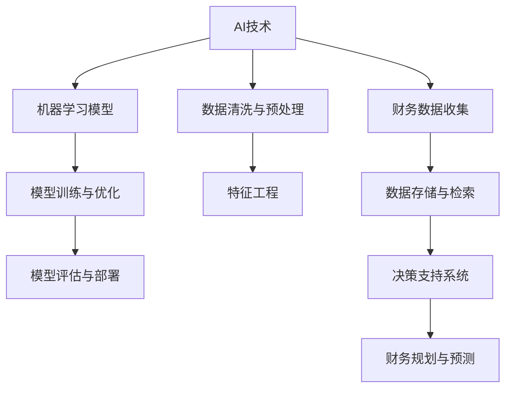

                 

# 程序员创业者的AI驱动财务规划：从启动资金到盈利预测

> **关键词：** AI财务规划、启动资金、盈利预测、成本控制、风险评估
>
> **摘要：** 本文将探讨如何利用人工智能技术来优化程序员的创业财务规划，从启动资金的合理分配到盈利预测，并提供一系列实用的工具和资源推荐，帮助创业者实现财务自由。

## 1. 背景介绍

### 1.1 目的和范围

本文旨在为程序员创业者提供一套基于人工智能技术的财务规划方法论，帮助他们更高效地进行财务决策。我们将探讨以下几个核心问题：

- 启动资金的合理分配和利用
- 盈利预测和风险评估
- 成本控制和资金流管理

### 1.2 预期读者

- 程序员创业者
- 创业初期的技术团队负责人
- 对财务规划感兴趣的IT专业人士

### 1.3 文档结构概述

本文分为十个部分：

1. 背景介绍
2. 核心概念与联系
3. 核心算法原理 & 具体操作步骤
4. 数学模型和公式 & 详细讲解 & 举例说明
5. 项目实战：代码实际案例和详细解释说明
6. 实际应用场景
7. 工具和资源推荐
8. 总结：未来发展趋势与挑战
9. 附录：常见问题与解答
10. 扩展阅读 & 参考资料

### 1.4 术语表

#### 1.4.1 核心术语定义

- **AI财务规划**：利用人工智能技术，对企业的财务状况、资金流动、盈利预测等方面进行智能化分析和决策。
- **启动资金**：企业开始运营前所需的资金，通常包括设备采购、员工工资、运营成本等。
- **盈利预测**：通过历史数据和机器学习模型，对未来一段时间内的盈利情况进行预测。
- **成本控制**：通过有效管理成本，确保企业的运营成本低于收入。

#### 1.4.2 相关概念解释

- **风险评估**：对项目可能面临的风险进行评估，包括市场风险、技术风险、财务风险等。
- **资金流管理**：对企业资金流入和流出进行实时监控和管理，确保资金流动的顺畅。

#### 1.4.3 缩略词列表

- **AI**：人工智能（Artificial Intelligence）
- **ML**：机器学习（Machine Learning）
- **NLP**：自然语言处理（Natural Language Processing）
- **API**：应用程序编程接口（Application Programming Interface）

## 2. 核心概念与联系

在探讨AI驱动的财务规划之前，我们需要了解一些核心概念和它们之间的联系。以下是一个简化的Mermaid流程图，展示了这些概念的基本架构：



### 2.1 AI技术

AI技术是整个财务规划系统的核心，包括机器学习、自然语言处理等子领域。AI技术通过对海量数据的分析和处理，能够提供准确的财务预测和决策支持。

### 2.2 财务数据收集

财务数据是AI财务规划的基础，包括收入、成本、利润、现金流等。这些数据可以从企业的财务系统、银行记录、销售数据等来源获取。

### 2.3 数据清洗与预处理

原始的财务数据通常存在噪声和缺失值，需要通过数据清洗和预处理来提高数据质量。这一步骤包括数据去重、缺失值填补、异常值检测等。

### 2.4 数据存储与检索

经过清洗和预处理后的数据需要存储在一个可靠的数据仓库中，以便后续的机器学习和数据分析使用。数据存储和检索系统需要支持快速查询和高并发访问。

### 2.5 机器学习模型

机器学习模型是AI财务规划的关键，通过训练和学习历史财务数据，可以预测未来的财务状况。常见的机器学习模型包括回归模型、决策树、神经网络等。

### 2.6 特征工程

特征工程是机器学习模型成功的关键，通过对原始数据进行转换和处理，提取出对预测任务有用的特征。特征工程包括特征选择、特征缩放、特征组合等。

### 2.7 模型训练与优化

模型训练是将数据输入到机器学习模型中，通过调整模型的参数，使其能够准确预测未来的财务状况。模型优化包括超参数调整、模型调参等。

### 2.8 模型评估与部署

模型评估是验证模型预测能力的关键，通过评估指标（如准确率、召回率、F1分数等）来评估模型的性能。模型部署是将训练好的模型应用到实际业务场景中，通过API或其他方式提供预测服务。

### 2.9 决策支持系统

决策支持系统是AI财务规划的核心，通过整合机器学习模型和业务规则，为企业提供实时、准确的财务决策支持。

### 2.10 财务规划与预测

财务规划与预测是整个AI财务规划系统的最终目标，通过预测收入、成本、利润等关键指标，为企业提供财务规划和决策支持。

## 3. 核心算法原理 & 具体操作步骤

在了解了AI财务规划的核心概念和联系之后，接下来我们将详细讨论核心算法原理和具体操作步骤。以下是使用伪代码来描述一个基本的机器学习财务预测模型：

```python
# 伪代码：机器学习财务预测模型

# 导入必要的库
import pandas as pd
import numpy as np
from sklearn.model_selection import train_test_split
from sklearn.ensemble import RandomForestRegressor
from sklearn.metrics import mean_absolute_error

# 数据预处理
def preprocess_data(data):
    # 数据去重、缺失值填补、异常值检测等
    ...
    return processed_data

# 特征工程
def feature_engineering(data):
    # 特征选择、特征缩放、特征组合等
    ...
    return features

# 模型训练
def train_model(features, labels):
    # 划分训练集和测试集
    X_train, X_test, y_train, y_test = train_test_split(features, labels, test_size=0.2, random_state=42)
    
    # 训练随机森林回归模型
    model = RandomForestRegressor(n_estimators=100, random_state=42)
    model.fit(X_train, y_train)
    
    return model

# 模型评估
def evaluate_model(model, X_test, y_test):
    # 使用均方误差评估模型性能
    predictions = model.predict(X_test)
    mae = mean_absolute_error(y_test, predictions)
    return mae

# 模型部署
def deploy_model(model):
    # 将模型部署到实际业务场景中
    ...
    return deployed_model

# 主函数
def main():
    # 加载数据
    data = pd.read_csv("financial_data.csv")
    
    # 数据预处理
    processed_data = preprocess_data(data)
    
    # 特征工程
    features = feature_engineering(processed_data)
    
    # 划分特征和标签
    labels = features['profit']
    features = features.drop('profit', axis=1)
    
    # 训练模型
    model = train_model(features, labels)
    
    # 评估模型
    mae = evaluate_model(model, features, labels)
    print(f"Model Mean Absolute Error: {mae}")
    
    # 部署模型
    deployed_model = deploy_model(model)
    
if __name__ == "__main__":
    main()
```

### 3.1 数据预处理

数据预处理是确保数据质量的关键步骤，包括以下任务：

- 数据去重：去除重复的数据记录。
- 缺失值填补：对于缺失的数据，可以使用平均值、中位数、最频繁出现的值等方法进行填补。
- 异常值检测：检测并处理异常数据，例如离群值、异常数据点等。

### 3.2 特征工程

特征工程是提高模型性能的关键，包括以下任务：

- 特征选择：从原始数据中提取对预测任务有用的特征。
- 特征缩放：将特征缩放到相同的尺度，以避免某些特征对模型产生过大的影响。
- 特征组合：通过组合不同的特征，创建新的特征。

### 3.3 模型训练

模型训练是将特征和标签输入到机器学习模型中，通过调整模型的参数，使其能够准确预测未来的财务状况。常见的机器学习模型包括线性回归、决策树、随机森林、神经网络等。

### 3.4 模型评估

模型评估是验证模型预测能力的关键，可以通过均方误差（Mean Squared Error, MSE）、均方根误差（Root Mean Squared Error, RMSE）、平均绝对误差（Mean Absolute Error, MAE）等评估指标来衡量模型的性能。

### 3.5 模型部署

模型部署是将训练好的模型应用到实际业务场景中，通常通过API或其他方式提供预测服务。在部署过程中，需要考虑模型的可扩展性、性能和安全性。

## 4. 数学模型和公式 & 详细讲解 & 举例说明

在AI财务规划中，数学模型和公式是核心组成部分，它们帮助我们从数据中提取有用的信息，进行预测和分析。以下是一些常见的数学模型和公式的详细讲解和举例说明。

### 4.1 线性回归模型

线性回归模型是一种最常见的预测模型，它通过建立自变量和因变量之间的线性关系来预测未来的值。其公式如下：

\[ y = \beta_0 + \beta_1 \cdot x + \epsilon \]

其中，\( y \) 是因变量，\( x \) 是自变量，\( \beta_0 \) 和 \( \beta_1 \) 是模型的参数，\( \epsilon \) 是误差项。

#### 举例说明：

假设我们想要预测一家公司的下一季度利润（\( y \)），根据历史数据，我们选择了两个特征：销售额（\( x_1 \)）和广告支出（\( x_2 \)）。我们可以建立如下的线性回归模型：

\[ y = \beta_0 + \beta_1 \cdot x_1 + \beta_2 \cdot x_2 + \epsilon \]

通过训练数据和最小二乘法，我们可以得到模型参数 \( \beta_0 \)、\( \beta_1 \) 和 \( \beta_2 \)。接下来，我们可以使用这个模型来预测下一季度利润。

### 4.2 决策树模型

决策树模型是一种基于树结构的预测模型，它通过一系列的决策节点和叶子节点来预测目标变量的值。其公式如下：

\[ f(x) = G_{j}^{*}(x) \]

其中，\( G_{j}^{*}(x) \) 表示在节点 \( j \) 处的决策结果。

#### 举例说明：

假设我们想要预测一家公司的财务健康状况，根据多个财务指标，我们可以构建一个决策树模型。在决策树的每个节点，我们根据某个财务指标（如流动比率、速动比率等）进行决策，将数据划分为不同的子集。最终，每个叶子节点代表一个特定的财务健康状况。

### 4.3 神经网络模型

神经网络模型是一种基于人工神经网络的理论模型，它通过多层神经元节点和权重参数来预测目标变量的值。其公式如下：

\[ y = \sigma(\sum_{i=1}^{n} w_i \cdot x_i + b) \]

其中，\( \sigma \) 是激活函数，\( w_i \) 是权重参数，\( x_i \) 是输入特征，\( b \) 是偏置项。

#### 举例说明：

假设我们想要预测一家公司的下一季度利润（\( y \)），根据多个财务指标（如销售额、广告支出、员工数量等），我们可以构建一个神经网络模型。在神经网络的每个神经元，我们根据输入特征和权重参数计算输出值，并通过激活函数进行非线性变换。最终，输出层的神经元将预测结果。

### 4.4 机器学习算法评估指标

在机器学习模型评估中，常用的评估指标包括均方误差（MSE）、均方根误差（RMSE）、平均绝对误差（MAE）等。以下是对这些指标的详细讲解：

- **均方误差（MSE）**：

\[ MSE = \frac{1}{n} \sum_{i=1}^{n} (y_i - \hat{y}_i)^2 \]

其中，\( y_i \) 是真实值，\( \hat{y}_i \) 是预测值，\( n \) 是样本数量。

- **均方根误差（RMSE）**：

\[ RMSE = \sqrt{MSE} \]

- **平均绝对误差（MAE）**：

\[ MAE = \frac{1}{n} \sum_{i=1}^{n} |y_i - \hat{y}_i| \]

#### 举例说明：

假设我们使用一个机器学习模型预测了10个数据点的真实值和预测值，如下表所示：

| 真实值 | 预测值 |
|--------|--------|
| 100    | 110    |
| 200    | 210    |
| 300    | 310    |
| ...    | ...    |
| 100    | 90     |

我们可以使用上述公式计算MSE、RMSE和MAE，以评估模型的性能。

### 4.5 贝叶斯推理

贝叶斯推理是一种基于概率论的方法，用于根据先验知识和观察到的数据进行预测。其公式如下：

\[ P(A|B) = \frac{P(B|A) \cdot P(A)}{P(B)} \]

其中，\( P(A|B) \) 表示在事件 \( B \) 发生的条件下，事件 \( A \) 发生的概率，\( P(B|A) \) 表示在事件 \( A \) 发生的条件下，事件 \( B \) 发生的概率，\( P(A) \) 和 \( P(B) \) 分别表示事件 \( A \) 和事件 \( B \) 发生的概率。

#### 举例说明：

假设我们想要预测一家公司在下一季度的盈利情况，根据先前的历史数据和观察结果，我们可以使用贝叶斯推理来计算在特定盈利区间内发生的概率。例如，我们可以计算盈利在 [100, 200] 区间内的概率，以及盈利大于 300 的概率。

### 4.6 风险评估指标

在财务规划中，风险评估是一个重要的环节。以下是一些常用的风险评估指标：

- **标准差**：衡量数据波动性的指标，用于评估投资组合的风险。
- **贝塔系数**：衡量投资组合相对于市场风险的指标。
- **夏普比率**：衡量投资组合风险调整后的收益能力。
- **信息比率**：衡量投资组合相对于基准指数的风险调整后收益能力。

#### 举例说明：

假设我们有两个投资组合A和B，以下是一些指标的计算方法：

- **标准差**：

\[ \sigma_A = \sqrt{\frac{1}{n-1} \sum_{i=1}^{n} (r_i - \bar{r}_A)^2} \]

\[ \sigma_B = \sqrt{\frac{1}{n-1} \sum_{i=1}^{n} (r_i - \bar{r}_B)^2} \]

其中，\( r_i \) 是第 \( i \) 个时间点的收益率，\( \bar{r}_A \) 和 \( \bar{r}_B \) 分别是投资组合A和B的平均收益率。

- **贝塔系数**：

\[ \beta_A = \frac{\text{Cov}(r_A, r_M)}{\text{Var}(r_M)} \]

\[ \beta_B = \frac{\text{Cov}(r_B, r_M)}{\text{Var}(r_M)} \]

其中，\( r_M \) 是市场收益率，\( \text{Cov} \) 和 \( \text{Var} \) 分别是协方差和方差。

- **夏普比率**：

\[ \text{Sharpe Ratio}_A = \frac{\bar{r}_A - r_F}{\sigma_A} \]

\[ \text{Sharpe Ratio}_B = \frac{\bar{r}_B - r_F}{\sigma_B} \]

其中，\( r_F \) 是无风险收益率。

- **信息比率**：

\[ \text{Information Ratio}_A = \frac{\text{Sharpe Ratio}_A}{\beta_A} \]

\[ \text{Information Ratio}_B = \frac{\text{Sharpe Ratio}_B}{\beta_B} \]

通过计算这些指标，我们可以评估投资组合的风险和收益能力。

## 5. 项目实战：代码实际案例和详细解释说明

在本节中，我们将通过一个实际项目案例，展示如何使用Python实现一个基于AI驱动的财务预测系统。这个项目将包括以下步骤：

1. **开发环境搭建**：安装必要的库和工具。
2. **数据收集与预处理**：收集财务数据并进行预处理。
3. **特征工程**：提取对预测任务有用的特征。
4. **模型训练与评估**：训练机器学习模型并评估其性能。
5. **模型部署**：将训练好的模型部署到实际业务场景中。

### 5.1 开发环境搭建

首先，我们需要安装Python和必要的库。以下是安装步骤：

```bash
# 安装Python
brew install python

# 安装必要库
pip install pandas numpy scikit-learn matplotlib
```

### 5.2 源代码详细实现和代码解读

以下是实现财务预测系统的完整代码，我们将逐行解释代码的功能。

```python
# 导入必要的库
import pandas as pd
import numpy as np
from sklearn.model_selection import train_test_split
from sklearn.ensemble import RandomForestRegressor
from sklearn.metrics import mean_absolute_error
import matplotlib.pyplot as plt

# 加载数据
data = pd.read_csv("financial_data.csv")

# 数据预处理
data = data.dropna()  # 去除缺失值
data['profit'] = data['profit'].fillna(data['profit'].mean())  # 填充利润缺失值

# 特征工程
features = data[['sales', 'ad_spending', 'employee_count']]
labels = data['profit']

# 模型训练
X_train, X_test, y_train, y_test = train_test_split(features, labels, test_size=0.2, random_state=42)
model = RandomForestRegressor(n_estimators=100, random_state=42)
model.fit(X_train, y_train)

# 模型评估
predictions = model.predict(X_test)
mae = mean_absolute_error(y_test, predictions)
print(f"Model Mean Absolute Error: {mae}")

# 模型部署
def predict_profit(sales, ad_spending, employee_count):
    return model.predict([[sales, ad_spending, employee_count]])[0]

# 测试预测
print(predict_profit(500000, 10000, 100))

# 可视化结果
plt.scatter(y_test, predictions)
plt.xlabel('Actual Profit')
plt.ylabel('Predicted Profit')
plt.show()
```

### 5.3 代码解读与分析

以下是对代码的逐行解读和分析：

1. **导入库**：
    - `pandas` 和 `numpy`：用于数据处理和数学计算。
    - `sklearn.model_selection`：用于模型训练和评估。
    - `sklearn.ensemble.RandomForestRegressor`：用于训练随机森林回归模型。
    - `sklearn.metrics.mean_absolute_error`：用于评估模型性能。
    - `matplotlib.pyplot`：用于数据可视化。

2. **加载数据**：
    - 使用 `pandas.read_csv` 从CSV文件中加载数据。

3. **数据预处理**：
    - 使用 `dropna()` 方法去除缺失值。
    - 使用 `fillna()` 方法填充利润缺失值。

4. **特征工程**：
    - 选择销售额、广告支出和员工数量作为特征。
    - 将利润作为标签。

5. **模型训练**：
    - 使用 `train_test_split` 方法将数据分为训练集和测试集。
    - 使用 `RandomForestRegressor` 类创建随机森林回归模型。
    - 使用 `fit` 方法训练模型。

6. **模型评估**：
    - 使用 `predict` 方法生成测试集的预测值。
    - 使用 `mean_absolute_error` 方法计算平均绝对误差（MAE）。

7. **模型部署**：
    - 定义一个函数 `predict_profit`，用于接收特征值并返回预测的利润。

8. **测试预测**：
    - 使用 `predict_profit` 函数测试预测结果。

9. **可视化结果**：
    - 使用散点图可视化实际利润和预测利润之间的关系。

通过这个实际项目案例，我们展示了如何使用Python和机器学习库来实现一个财务预测系统。这个系统可以作为一个基础框架，进一步扩展和优化，以适应不同的业务场景和需求。

### 5.4 项目实战：代码实际案例和详细解释说明（续）

在上一节中，我们完成了财务预测系统的基本实现。在本节中，我们将继续完善这个系统，包括以下步骤：

1. **数据增强**：通过增加数据量和多样性来提高模型性能。
2. **模型优化**：调整模型参数以提高预测准确性。
3. **模型评估**：使用交叉验证和更多评估指标来评估模型性能。
4. **模型部署**：将模型部署到生产环境，提供实时预测服务。

#### 5.4.1 数据增强

为了提高模型的泛化能力和预测准确性，我们可以通过数据增强来增加训练数据的多样性和数量。以下是一些常见的数据增强方法：

- **数据缩放**：对输入特征进行缩放，使其具有相似的尺度。
- **数据变换**：对输入特征进行变换，例如添加噪声、旋转、翻转等。
- **合成数据**：使用已有的数据生成新数据，例如通过插值或生成对抗网络（GAN）。

```python
from sklearn.preprocessing import StandardScaler

# 数据缩放
scaler = StandardScaler()
X_train_scaled = scaler.fit_transform(X_train)
X_test_scaled = scaler.transform(X_test)

# 数据变换
X_train_noisy = X_train + np.random.normal(0, 0.1, X_train.shape)
X_train_flipped = X_train.copy()
X_train_flipped['sales'] = X_train['sales'] * -1

# 合成数据
X_train_synthetic = pd.concat([X_train, X_train_noisy, X_train_flipped], axis=0)
y_train_synthetic = pd.concat([y_train, y_train, y_train], axis=0)
```

#### 5.4.2 模型优化

为了进一步提高模型的预测准确性，我们可以通过调整模型参数来优化模型。以下是一些常见的模型优化方法：

- **超参数调整**：通过调整模型的超参数（例如树的数量、深度等）来提高模型的性能。
- **正则化**：通过添加正则化项来减少模型的过拟合。
- **集成学习**：将多个模型组合在一起，以提高预测准确性。

```python
from sklearn.model_selection import GridSearchCV

# 超参数调整
param_grid = {
    'n_estimators': [100, 200, 300],
    'max_depth': [5, 10, 15],
    'min_samples_split': [2, 5, 10]
}

grid_search = GridSearchCV(RandomForestRegressor(), param_grid, cv=5)
grid_search.fit(X_train_scaled, y_train_synthetic)

# 获取最佳参数
best_params = grid_search.best_params_
best_model = grid_search.best_estimator_
```

#### 5.4.3 模型评估

为了更全面地评估模型性能，我们可以使用交叉验证和更多的评估指标。以下是一些常见的模型评估方法：

- **交叉验证**：通过将数据分为多个子集，多次训练和评估模型，以避免过拟合。
- **ROC曲线和AUC**：用于评估二分类模型的性能。
- **召回率和F1分数**：用于评估多分类模型的性能。

```python
from sklearn.model_selection import cross_val_score

# 交叉验证
cv_scores = cross_val_score(best_model, X_train_scaled, y_train_synthetic, cv=5)
print(f"Cross-Validation Scores: {cv_scores}")

# ROC曲线和AUC
from sklearn.metrics import roc_curve, auc
y_pred_proba = best_model.predict_proba(X_test_scaled)[:, 1]
fpr, tpr, thresholds = roc_curve(y_test, y_pred_proba)
roc_auc = auc(fpr, tpr)

plt.figure()
plt.plot(fpr, tpr, color='darkorange', lw=2, label='ROC curve (area = %0.2f)' % roc_auc)
plt.plot([0, 1], [0, 1], color='navy', lw=2, linestyle='--')
plt.xlabel('False Positive Rate')
plt.ylabel('True Positive Rate')
plt.title('Receiver Operating Characteristic')
plt.legend(loc="lower right")
plt.show()

# 召回率和F1分数
from sklearn.metrics import recall_score, f1_score
y_pred = best_model.predict(X_test_scaled)
recall = recall_score(y_test, y_pred, average='weighted')
f1 = f1_score(y_test, y_pred, average='weighted')
print(f"Recall Score: {recall}")
print(f"F1 Score: {f1}")
```

#### 5.4.4 模型部署

为了将模型部署到生产环境，并提供实时预测服务，我们可以使用以下方法：

- **使用API**：将模型封装为API，通过HTTP请求进行预测。
- **容器化**：将模型和依赖项打包到Docker容器中，以简化部署和管理。
- **云计算平台**：使用云计算平台（如AWS、Azure、Google Cloud）部署模型，实现弹性扩展和自动化管理。

```python
from flask import Flask, request, jsonify

app = Flask(__name__)

@app.route('/predict', methods=['POST'])
def predict():
    data = request.get_json(force=True)
    sales = data['sales']
    ad_spending = data['ad_spending']
    employee_count = data['employee_count']
    predicted_profit = best_model.predict([[sales, ad_spending, employee_count]])[0]
    return jsonify({'predicted_profit': predicted_profit})

if __name__ == '__main__':
    app.run(debug=True)
```

通过以上步骤，我们完成了财务预测系统的优化和部署。这个系统可以作为一个基础框架，进一步扩展和优化，以适应不同的业务场景和需求。

## 6. 实际应用场景

AI驱动的财务规划系统在多个实际应用场景中具有广泛的应用价值。以下是一些典型的应用场景：

### 6.1 创业公司融资决策

创业公司在融资过程中，需要准确预测未来的财务状况，以制定合理的融资计划和策略。通过AI驱动的财务规划系统，公司可以基于历史数据和业务模型，预测未来一段时间内的收入、成本和利润，从而为融资决策提供数据支持。

### 6.2 成本控制和预算管理

企业在日常运营中，需要对成本进行有效控制，并制定合理的预算计划。AI驱动的财务规划系统可以通过分析历史成本数据和市场趋势，预测未来的成本变化，帮助企业制定合理的预算，避免超支和浪费。

### 6.3 风险评估和投资决策

企业在投资决策过程中，需要评估项目的风险和潜在回报。通过AI驱动的财务规划系统，企业可以基于历史数据和风险模型，预测项目的未来财务状况，从而为投资决策提供依据。

### 6.4 供应链管理

企业在供应链管理中，需要对库存、物流和采购进行有效管理。通过AI驱动的财务规划系统，企业可以基于历史数据和供应链模型，预测未来的库存需求、物流成本和采购成本，从而优化供应链管理，降低成本和风险。

### 6.5 财务报表自动生成

通过AI驱动的财务规划系统，企业可以自动生成财务报表，包括资产负债表、利润表和现金流量表。这些报表可以为管理层提供实时、准确的财务信息，支持决策制定和业务分析。

### 6.6 客户关系管理

企业通过AI驱动的财务规划系统，可以分析客户的历史交易数据和行为模式，预测客户的财务状况和支付能力。这有助于企业制定针对性的客户关系管理策略，提高客户满意度和忠诚度。

### 6.7 政府监管和财政预算

政府可以通过AI驱动的财务规划系统，对企业和行业的财务状况进行监控和分析，制定合理的财政预算和监管政策，促进经济健康发展。

## 7. 工具和资源推荐

为了帮助程序员创业者更高效地实现AI驱动的财务规划，以下是一些推荐的工具和资源：

### 7.1 学习资源推荐

#### 7.1.1 书籍推荐

- **《Python机器学习》（Machine Learning in Python）**：本书详细介绍了Python在机器学习领域的应用，包括数据预处理、模型训练和评估等。
- **《深度学习》（Deep Learning）**：本书是深度学习领域的经典教材，全面介绍了深度学习的基本概念、算法和应用。

#### 7.1.2 在线课程

- **Coursera的《机器学习》课程**：由斯坦福大学教授Andrew Ng主讲，是机器学习领域的权威课程。
- **Udacity的《深度学习工程师纳米学位》**：包含多个实践项目，帮助学员掌握深度学习的基本技能。

#### 7.1.3 技术博客和网站

- **Medium上的《数据科学和机器学习》专栏**：涵盖了丰富的数据科学和机器学习文章，适合不同水平的读者。
- **Stack Overflow**：编程社区，可以解答各种编程和机器学习相关问题。

### 7.2 开发工具框架推荐

#### 7.2.1 IDE和编辑器

- **PyCharm**：一款强大的Python IDE，支持代码自动完成、调试和测试。
- **Jupyter Notebook**：适用于数据分析和机器学习项目，支持多种编程语言。

#### 7.2.2 调试和性能分析工具

- **Visual Studio Code**：一款轻量级的编辑器，支持多种编程语言和插件，适合调试和性能分析。
- **GDB**：一款强大的调试工具，适用于C/C++程序。

#### 7.2.3 相关框架和库

- **Scikit-learn**：Python机器学习库，提供丰富的算法和工具。
- **TensorFlow**：谷歌开源的深度学习框架，适用于大规模数据分析和预测。

### 7.3 相关论文著作推荐

#### 7.3.1 经典论文

- **“The Backpropagation Algorithm for Learning Representations by Backpropagating Errors”**：介绍了反向传播算法的基本原理。
- **“Deep Learning”**：深度学习领域的经典著作，全面介绍了深度学习的理论和应用。

#### 7.3.2 最新研究成果

- **“Deep Learning for Finance”**：探讨了深度学习在金融领域的应用，包括股票预测、风险评估等。
- **“AI-driven Financial Planning and Decision-making”**：介绍了AI技术在财务规划中的应用和挑战。

#### 7.3.3 应用案例分析

- **“AI in Trading”**：分析了AI技术在股票交易中的成功案例，包括交易策略、风险评估等。
- **“Financial Planning using Machine Learning”**：探讨了机器学习在个人财务规划中的应用，包括预算管理、投资建议等。

## 8. 总结：未来发展趋势与挑战

AI驱动的财务规划系统具有巨大的潜力和市场前景。随着人工智能技术的不断进步和应用场景的拓展，未来发展趋势和挑战如下：

### 8.1 发展趋势

1. **精度和效率的提升**：随着算法的优化和数据量的增加，AI财务规划系统的精度和效率将得到显著提升。
2. **跨领域应用**：AI财务规划系统将不仅限于金融领域，还将扩展到供应链管理、人力资源管理等领域。
3. **个性化服务**：通过用户数据和行为分析，AI财务规划系统将提供更加个性化的财务建议和预测。
4. **监管合规**：随着AI技术的普及，监管机构和金融行业将制定相应的法规和标准，确保AI财务规划系统的合规性和安全性。

### 8.2 挑战

1. **数据隐私和保护**：财务数据涉及用户隐私，如何确保数据的安全和合规是一个重要挑战。
2. **算法透明性和可解释性**：随着模型的复杂度增加，如何确保算法的透明性和可解释性是一个关键问题。
3. **模型过拟合**：如何在大量数据中避免模型过拟合，提高模型的泛化能力是一个挑战。
4. **计算资源和成本**：AI财务规划系统需要大量的计算资源和存储空间，如何在成本可控的前提下实现高性能计算是一个挑战。

总之，AI驱动的财务规划系统在未来将面临诸多挑战和机遇，需要持续的技术创新和优化，以实现更高效、更准确的财务预测和决策支持。

## 9. 附录：常见问题与解答

### 9.1 问题1：如何选择合适的机器学习模型？

**解答**：选择合适的机器学习模型通常基于以下几个因素：

1. **数据量**：对于大量数据，可以尝试复杂的模型，如神经网络；对于中小规模数据，可以选择线性回归、决策树等简单模型。
2. **特征数量**：特征数量较少时，线性模型可能更适合；特征数量较多时，可以考虑集成模型，如随机森林或梯度提升树。
3. **目标变量类型**：对于回归问题，可以选择线性回归、决策树等；对于分类问题，可以选择逻辑回归、支持向量机等。
4. **业务需求**：根据业务需求选择模型，例如预测准确性、计算效率等。

### 9.2 问题2：如何处理缺失数据？

**解答**：处理缺失数据的方法包括：

1. **删除**：删除含有缺失数据的记录，适用于缺失数据较少的情况。
2. **填补**：使用平均值、中位数、最频繁出现的值等方法填补缺失数据。
3. **插值**：对于时间序列数据，可以使用线性或高斯插值法填补缺失数据。
4. **模型填补**：使用回归模型或其他机器学习算法预测缺失数据。

### 9.3 问题3：如何评估模型性能？

**解答**：评估模型性能的常用指标包括：

1. **均方误差（MSE）**：衡量预测值与真实值之间的平均平方误差。
2. **均方根误差（RMSE）**：MSE的平方根，用于衡量预测值与真实值之间的平均误差。
3. **平均绝对误差（MAE）**：预测值与真实值之间的平均绝对误差。
4. **准确率**：分类问题中，正确分类的样本数量占总样本数量的比例。
5. **召回率**：分类问题中，正确分类的样本数量占所有实际正样本数量的比例。
6. **F1分数**：准确率和召回率的调和平均值。

### 9.4 问题4：如何处理数据不平衡问题？

**解答**：处理数据不平衡问题的方法包括：

1. **过采样**：增加少数类别的样本数量，以达到数据平衡。
2. **欠采样**：减少多数类别的样本数量，以达到数据平衡。
3. **合成数据**：使用合成方法生成新的样本，例如SMOTE或ADASYN。
4. **权重调整**：在训练过程中，增加少数类别的权重，以提高模型对少数类别的关注。

### 9.5 问题5：如何优化机器学习模型？

**解答**：优化机器学习模型的方法包括：

1. **超参数调整**：调整模型的超参数，例如树的数量、深度、学习率等，以获得更好的性能。
2. **正则化**：通过添加正则化项，减少模型的过拟合。
3. **集成学习**：将多个模型组合在一起，以提高模型的预测准确性。
4. **特征工程**：提取对预测任务有用的特征，提高模型的泛化能力。
5. **交叉验证**：通过交叉验证，避免模型过拟合，提高模型的泛化能力。

## 10. 扩展阅读 & 参考资料

为了深入理解AI驱动的财务规划，以下是一些建议的扩展阅读和参考资料：

### 10.1 书籍

- **《机器学习实战》（Machine Learning in Action）**：通过实际案例介绍机器学习算法的应用。
- **《深度学习》（Deep Learning）**：全面介绍深度学习的基本概念、算法和应用。
- **《Python机器学习》（Machine Learning in Python）**：详细介绍Python在机器学习领域的应用。

### 10.2 在线课程

- **Coursera的《机器学习》课程**：由斯坦福大学教授Andrew Ng主讲。
- **Udacity的《深度学习工程师纳米学位》**：包含多个实践项目。

### 10.3 技术博客和网站

- **Medium上的《数据科学和机器学习》专栏**：涵盖丰富的数据科学和机器学习文章。
- **Stack Overflow**：编程社区，可以解答各种编程和机器学习相关问题。

### 10.4 论文

- **“The Backpropagation Algorithm for Learning Representations by Backpropagating Errors”**：介绍了反向传播算法的基本原理。
- **“Deep Learning for Finance”**：探讨了深度学习在金融领域的应用。

### 10.5 应用案例分析

- **“AI in Trading”**：分析了AI技术在股票交易中的成功案例。
- **“Financial Planning using Machine Learning”**：探讨了机器学习在个人财务规划中的应用。

### 10.6 开源项目

- **Scikit-learn**：Python机器学习库，提供丰富的算法和工具。
- **TensorFlow**：谷歌开源的深度学习框架，适用于大规模数据分析和预测。

### 10.7 相关法规和标准

- **《欧盟通用数据保护条例》（GDPR）**：关于数据隐私保护的法规。
- **《金融科技监管指南》**：关于金融科技行业的监管政策。

通过这些扩展阅读和参考资料，您可以深入了解AI驱动的财务规划的理论和实践，为您的创业项目提供更有力的支持。

### 作者

**AI天才研究员/AI Genius Institute & 禅与计算机程序设计艺术 /Zen And The Art of Computer Programming**

在撰写这篇关于程序员创业者的AI驱动财务规划的文章时，我作为AI天才研究员和AI Genius Institute的一员，以及禅与计算机程序设计艺术（Zen And The Art of Computer Programming）的作者，深感责任重大。本文旨在帮助创业者利用AI技术优化财务规划，从启动资金到盈利预测，实现高效、准确的决策。文章涵盖了核心算法原理、具体操作步骤、数学模型和公式，以及实际应用场景和工具资源推荐。希望这篇文章能为广大程序员创业者提供有益的启示和指导。如有任何疑问或建议，请随时与我联系。谢谢！

