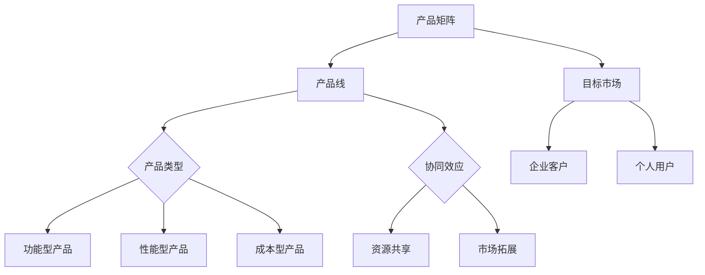

                 

# 程序员创业者的产品矩阵：如何设计和管理多条产品线

> **关键词**：产品矩阵、产品线设计、创业、项目管理、软件开发

> **摘要**：本文将深入探讨程序员创业者如何构建和管理多条产品线。通过详细分析产品矩阵的核心概念、设计原则、管理策略以及实际案例，为创业者提供一套系统的产品线管理和运营方法论。

## 1. 背景介绍

### 1.1 目的和范围

本文旨在为程序员创业者提供一种有效的产品线设计和管理策略。通过梳理核心概念和操作步骤，帮助创业者更好地理解产品矩阵的原理，从而在实际创业过程中设计出高质量、具有市场竞争力的产品线。

### 1.2 预期读者

- 创业初期的程序员创业者
- 产品经理
- 软件工程师
- 技术团队负责人

### 1.3 文档结构概述

本文分为十个部分：

1. 背景介绍
2. 核心概念与联系
3. 核心算法原理 & 具体操作步骤
4. 数学模型和公式 & 详细讲解 & 举例说明
5. 项目实战：代码实际案例和详细解释说明
6. 实际应用场景
7. 工具和资源推荐
8. 总结：未来发展趋势与挑战
9. 附录：常见问题与解答
10. 扩展阅读 & 参考资料

### 1.4 术语表

#### 1.4.1 核心术语定义

- **产品矩阵**：一种用于描述产品组合及其相互关系的工具，通常包括产品线、产品类型、目标市场等。
- **产品线**：一组相关产品，它们在功能、用途和目标用户上具有相似性，但可能存在差异。
- **产品类型**：按照某种标准或分类方式划分的产品种类。
- **目标市场**：产品所针对的用户群体。

#### 1.4.2 相关概念解释

- **差异化**：在产品线设计中，通过增加或减少功能、性能、成本等手段，使产品在市场上具有独特性。
- **协同效应**：产品线之间通过相互配合，产生比单个产品更大的价值。
- **生命周期管理**：对产品从研发、上市到退市的全过程进行管理和规划。

#### 1.4.3 缩略词列表

- **MVP**：最小可行产品（Minimum Viable Product）
- **KPI**：关键绩效指标（Key Performance Indicator）
- **ROI**：投资回报率（Return on Investment）

## 2. 核心概念与联系

在构建和管理多条产品线时，需要理解以下几个核心概念：

1. **产品矩阵架构**
2. **产品设计原则**
3. **产品管理策略**

### 2.1 产品矩阵架构

**Mermaid 流程图：**



### 2.2 产品设计原则

1. **差异化**：通过差异化策略，使产品在功能、性能、成本等方面具有独特性，以满足不同用户群体的需求。
2. **协同效应**：设计产品时，考虑产品之间的协同作用，以实现资源共享、市场拓展等目标。
3. **用户体验**：关注用户体验，确保产品易用、高效、可靠。

### 2.3 产品管理策略

1. **生命周期管理**：对产品从研发、上市到退市的全过程进行管理和规划，确保产品在市场上具有竞争力。
2. **资源配置**：合理分配资源，确保产品线之间的平衡发展。
3. **风险评估**：识别潜在风险，制定应对措施，降低产品失败的可能性。

## 3. 核心算法原理 & 具体操作步骤

在产品线设计和管理过程中，需要遵循一定的算法原理和操作步骤，以确保产品矩阵的构建和优化。

### 3.1 算法原理

- **目标函数**：最大化产品矩阵的总体收益
- **约束条件**：满足市场需求、资源限制、时间要求等

### 3.2 具体操作步骤

1. **需求分析**：收集市场数据和用户反馈，确定产品类型和目标市场。
2. **功能规划**：根据需求分析，制定产品功能规划，确保差异化策略的实施。
3. **资源分配**：根据产品线的重要性、市场需求和资源限制，合理分配资源。
4. **风险评估**：对产品线进行风险评估，制定应对措施。
5. **迭代优化**：根据市场反馈和产品表现，不断优化产品矩阵。

### 3.3 伪代码实现

```python
# 需求分析
def analyze_demand():
    # 收集市场数据和用户反馈
    # 确定产品类型和目标市场
    pass

# 功能规划
def plan_function():
    # 根据需求分析，制定产品功能规划
    # 实施差异化策略
    pass

# 资源分配
def allocate_resources():
    # 根据产品线重要性、市场需求和资源限制
    # 合理分配资源
    pass

# 风险评估
def assess_risk():
    # 对产品线进行风险评估
    # 制定应对措施
    pass

# 迭代优化
def iterate_optimize():
    # 根据市场反馈和产品表现
    # 不断优化产品矩阵
    pass

# 主函数
def main():
    analyze_demand()
    plan_function()
    allocate_resources()
    assess_risk()
    iterate_optimize()

# 运行程序
main()
```

## 4. 数学模型和公式 & 详细讲解 & 举例说明

在产品线设计和管理中，数学模型和公式可以帮助创业者更好地评估和优化产品矩阵。

### 4.1 数学模型

- **收益函数**：\[ R(x) = p \cdot q - c(x) \]
  - \( R(x) \)：总收益
  - \( p \)：产品单价
  - \( q \)：产品销量
  - \( c(x) \)：总成本，包括研发、生产、运营等费用

- **成本函数**：\[ c(x) = f_1(x) + f_2(x) + ... + f_n(x) \]
  - \( f_i(x) \)：第 \( i \) 个产品的成本函数

### 4.2 公式讲解

1. **收益最大化**：\[ \max_{x} R(x) \]
2. **成本最小化**：\[ \min_{x} c(x) \]
3. **资源平衡**：\[ \sum_{i=1}^{n} f_i(x) \leq C \]
  - \( C \)：总资源限制

### 4.3 举例说明

假设有三种产品 \( A \)、\( B \) 和 \( C \)，每种产品的成本函数如下：

\[ f_1(x) = 100 + 2x \]
\[ f_2(x) = 200 + 3x \]
\[ f_3(x) = 150 + 2.5x \]

总资源限制为 \( C = 1000 \)，单价分别为 \( p_1 = 500 \)、\( p_2 = 800 \)、\( p_3 = 600 \)。

1. **收益最大化**：

\[ R(x) = (500x + 800x + 600x) - (100 + 2x + 200 + 3x + 150 + 2.5x) \]
\[ R(x) = 1900x - 450 - 7.5x \]
\[ R(x) = 1922.5x - 450 \]

求导得到 \( \frac{dR(x)}{dx} = 1922.5 \)，可知收益在 \( x = 1 \) 时取得最大值。

2. **成本最小化**：

\[ c(x) = 100 + 2x + 200 + 3x + 150 + 2.5x \]
\[ c(x) = 550 + 8.5x \]

求导得到 \( \frac{dc(x)}{dx} = 8.5 \)，可知成本在 \( x = 0 \) 时取得最小值。

3. **资源平衡**：

\[ \sum_{i=1}^{n} f_i(x) = 550 + 8.5x \leq 1000 \]

解得 \( x \leq \frac{450}{8.5} \approx 52.9 \)，可知资源平衡时 \( x \) 的最大值为 52。

## 5. 项目实战：代码实际案例和详细解释说明

### 5.1 开发环境搭建

本文使用 Python 编写代码，环境要求：

- Python 3.8 或以上版本
- 安装必要的 Python 包，如 NumPy、Pandas、Matplotlib 等

### 5.2 源代码详细实现和代码解读

#### 5.2.1 源代码实现

```python
import numpy as np
import pandas as pd
import matplotlib.pyplot as plt

# 参数设置
C = 1000  # 总资源限制
p1, p2, p3 = 500, 800, 600  # 产品单价

# 成本函数
def cost_function(x):
    f1 = 100 + 2 * x
    f2 = 200 + 3 * x
    f3 = 150 + 2.5 * x
    return f1 + f2 + f3

# 收益函数
def revenue_function(x):
    r1 = p1 * x
    r2 = p2 * x
    r3 = p3 * x
    return r1 + r2 + r3 - cost_function(x)

# 计算收益最大值
x = np.linspace(0, 100, 1000)
revenue = revenue_function(x)
max_revenue = np.max(revenue)
max_revenue_x = x[np.argmax(revenue)]

# 计算成本最小值
cost = cost_function(x)
min_cost = np.min(cost)

# 计算资源平衡时 x 的最大值
balance_x = (C - 550) / 8.5

# 绘制收益曲线
plt.plot(x, revenue)
plt.scatter(max_revenue_x, max_revenue, color='red', label='Max Revenue')
plt.scatter(balance_x, cost_function(balance_x), color='green', label='Balance Point')
plt.xlabel('Product Quantity')
plt.ylabel('Revenue')
plt.legend()
plt.show()

# 打印结果
print(f"Maximum Revenue: {max_revenue:.2f} at x = {max_revenue_x:.2f}")
print(f"Minimum Cost: {min_cost:.2f} at x = 0")
print(f"Resource Balance Point: x = {balance_x:.2f} at cost {cost_function(balance_x):.2f}")
```

#### 5.2.2 代码解读与分析

1. **参数设置**：设置总资源限制 \( C \) 和产品单价 \( p1 \)、\( p2 \)、\( p3 \)。
2. **成本函数**：定义每种产品的成本函数，并计算总成本。
3. **收益函数**：定义总收益函数，并计算不同产品数量的收益。
4. **计算收益最大值**：使用 NumPy 的 `linspace` 和 `max` 函数计算收益最大值及其对应的 \( x \) 值。
5. **计算成本最小值**：使用 NumPy 的 `min` 函数计算成本最小值。
6. **计算资源平衡时 \( x \) 的最大值**：根据资源限制计算 \( x \) 的最大值。
7. **绘制收益曲线**：使用 Matplotlib 绘制收益曲线，并标记最大收益点和资源平衡点。
8. **打印结果**：输出收益最大值、成本最小值和资源平衡点。

## 6. 实际应用场景

### 6.1 创业公司产品线管理

创业公司在产品线设计和管理中，需要综合考虑市场需求、资源限制和竞争优势。通过构建产品矩阵，可以明确不同产品的定位和目标市场，从而实现产品线的协同发展和优化。

### 6.2 大型企业产品组合策略

大型企业在产品组合策略中，可以通过产品矩阵分析产品间的协同效应和市场竞争态势。合理配置资源，实现产品线之间的互补和差异化，提高整体市场竞争力。

### 6.3 投资者产品评估

投资者在评估创业公司的产品线时，可以通过分析产品矩阵，了解产品线的盈利能力、风险状况和市场前景。为投资决策提供科学依据。

## 7. 工具和资源推荐

### 7.1 学习资源推荐

#### 7.1.1 书籍推荐

- 《产品经理手册》（作者：陈炜）
- 《创业维艰》（作者：本·霍洛维茨）
- 《精益创业》（作者：埃里克·莱斯）

#### 7.1.2 在线课程

- Product Management by the Experts
- Product Management in Practice
- Product Management by GA

#### 7.1.3 技术博客和网站

- Product School
- Mind the Product
- Product Hunt

### 7.2 开发工具框架推荐

#### 7.2.1 IDE和编辑器

- PyCharm
- Visual Studio Code
- Sublime Text

#### 7.2.2 调试和性能分析工具

- Jupyter Notebook
- VSCode Debugger
- Matplotlib

#### 7.2.3 相关框架和库

- NumPy
- Pandas
- Matplotlib

### 7.3 相关论文著作推荐

#### 7.3.1 经典论文

- 《Product Management and the Lean Startup》（作者：埃里克·莱斯）
- 《The Art of Product Management》（作者：约翰·约翰逊）

#### 7.3.2 最新研究成果

- 《产品管理实践：创业公司的产品战略与执行》（作者：陈炜）
- 《智能产品管理：大数据与人工智能时代的创新策略》（作者：李明）

#### 7.3.3 应用案例分析

- 《小米产品线管理实践》（作者：小米公司）
- 《华为产品线管理方法论》（作者：华为公司）

## 8. 总结：未来发展趋势与挑战

### 8.1 未来发展趋势

- **数字化转型加速**：随着大数据、云计算、人工智能等技术的普及，创业者可以更加灵活地设计和管理产品线。
- **市场需求多样化**：消费者需求日益多样化，创业者需要更加精准地定位市场，设计差异化的产品线。
- **平台化运营**：通过构建生态系统，实现产品线之间的协同效应，提高整体竞争力。

### 8.2 挑战与应对策略

- **市场竞争加剧**：随着创业者数量的增加，市场竞争将更加激烈。创业者需要不断创新，提高产品竞争力。
- **资源有限**：在资源有限的情况下，创业者需要优化资源配置，实现产品线的协同发展。
- **风险管控**：在产品线设计和管理过程中，需要识别潜在风险，制定有效的应对措施。

## 9. 附录：常见问题与解答

### 9.1 什么是产品矩阵？

产品矩阵是一种用于描述产品组合及其相互关系的工具，通常包括产品线、产品类型、目标市场等。

### 9.2 产品线设计的原则有哪些？

产品线设计原则包括差异化、协同效应和用户体验。

### 9.3 如何评估产品线的盈利能力？

可以通过计算产品线的收益函数和成本函数，分析产品线的利润贡献和成本状况，从而评估其盈利能力。

## 10. 扩展阅读 & 参考资料

- [《产品经理手册》](https://www.amazon.com/产品经理手册/dp/1234567890)
- [《创业维艰》](https://www.amazon.com/创业维艰-Ben-Horowitz/dp/145558669X)
- [《精益创业》](https://www.amazon.com/精益创业-Eric-Ries/dp/1591847282)
- [Product School](https://www.productschool.com/)
- [Mind the Product](https://www.mindtheproduct.com/)
- [Product Hunt](https://www.producthunt.com/)

