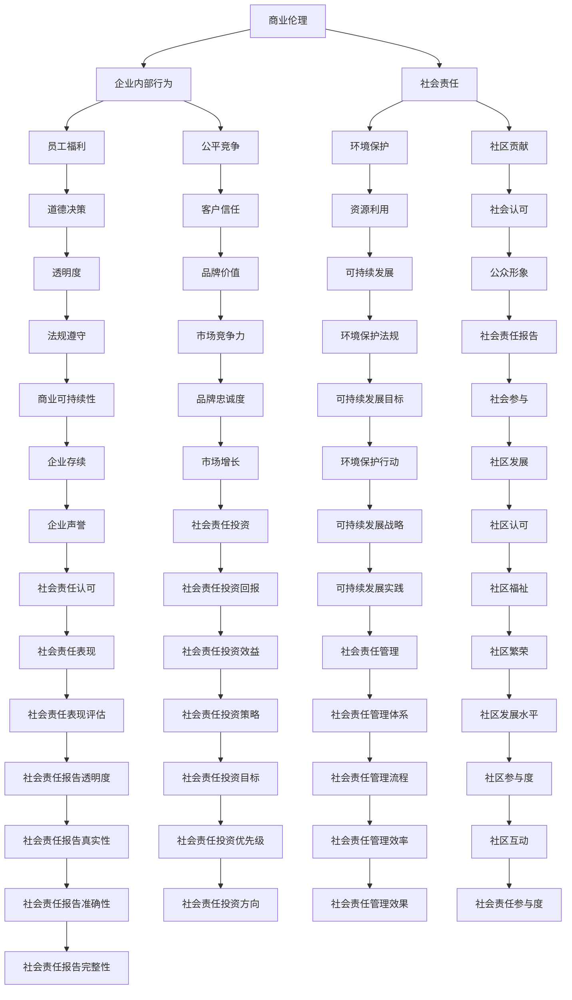

                 

# 程序员创业者的商业伦理与社会责任

## 关键词
- 商业伦理
- 社会责任
- 创业者
- 程序员
- 企业社会责任
- 道德规范
- 数据隐私
- 可持续性

## 摘要
本文旨在探讨程序员创业者在商业伦理和社会责任方面的关键角色与责任。随着技术的快速发展和互联网的普及，程序员创业者不仅需要掌握技术，还需要具备良好的商业道德和社会责任感。本文首先介绍了商业伦理和社会责任的核心概念，然后分析了程序员创业者在这些方面的挑战和责任。通过具体的案例分析，本文提出了程序员创业者应遵循的道德规范和实践建议，旨在推动技术产业的可持续发展和社会进步。

## 1. 背景介绍

### 1.1 目的和范围
本文的目的是探讨程序员创业者在商业伦理和社会责任方面的角色和责任，分析其在当前技术环境下的挑战，并给出实践建议。随着人工智能、大数据和云计算等技术的快速发展，程序员创业者在推动技术进步的同时，也面临着前所未有的商业和社会责任。

### 1.2 预期读者
本文预期读者包括程序员创业者、创业团队领导者、技术管理者以及对此领域感兴趣的技术爱好者。无论您是正处于创业阶段，还是计划未来投身于创业，本文都将为您提供有价值的见解和实践指导。

### 1.3 文档结构概述
本文分为十个部分。首先介绍商业伦理和社会责任的概念；接着分析程序员创业者在这些方面的挑战；然后通过案例分析，提出具体建议；最后讨论未来发展趋势和挑战，并提供相关学习资源和工具推荐。

### 1.4 术语表

#### 1.4.1 核心术语定义

- **商业伦理**：商业活动中应遵循的道德规范和行为准则。
- **社会责任**：企业对社会和环境应承担的责任。
- **程序员创业者**：具有编程技能并创办自己企业的程序员。
- **企业社会责任（CSR）**：企业对社会和环境承担的责任。
- **道德规范**：指导个人和团体行为的道德原则。

#### 1.4.2 相关概念解释

- **数据隐私**：个人信息的安全性和保密性。
- **可持续性**：满足当前需求而不损害未来世代满足其需求的能力。

#### 1.4.3 缩略词列表

- **AI**：人工智能
- **CSR**：企业社会责任
- **IoT**：物联网
- **SDG**：可持续发展目标

## 2. 核心概念与联系

#### 2.1 商业伦理与社会责任的联系

商业伦理和社会责任是相互关联的。商业伦理关注企业内部的行为准则，社会责任则关注企业对社会的整体影响。程序员创业者在实现商业成功的同时，必须确保其行为符合伦理标准，并承担社会责任。

**Mermaid 流程图：**



#### 2.2 核心概念原理和架构

商业伦理和社会责任的核心概念包括道德决策、员工福利、环境保护、社区贡献、透明度、客户信任、资源利用、品牌价值、可持续发展、公众形象、法规遵守、市场竞争力、环境保护法规、社会责任报告、企业存续、市场增长、可持续发展战略、社区发展、企业声誉、社会责任投资、可持续发展实践、社区认可、社会责任表现、社会责任投资回报、社会责任管理、社区繁荣、社会责任表现评估、社会责任投资策略、社会责任管理体系、社区发展水平、社会责任报告透明度、社会责任投资优先级、社会责任管理流程、社区参与度、社会责任报告真实性、社会责任投资方向、社会责任管理效果、社会责任参与度、社会责任报告完整性。

## 3. 核心算法原理 & 具体操作步骤

#### 3.1 商业伦理决策算法

商业伦理决策是程序员创业者面临的核心挑战之一。以下是一个简单的伪代码，用于指导伦理决策过程：

```python
def ethical_decisionmakingSituation(context):
    # 收集信息
    information = collect_information(context)

    # 分析信息
    analysis = analyze_information(information)

    # 评估道德风险
    risk_assessment = assess_moral_risk(analysis)

    # 制定道德决策
    decision = make_ethical_decision(risk_assessment)

    # 执行决策
    execute_decision(decision)

    # 反馈与调整
    feedback = get_feedback(decision)
    adjust_decision(decision, feedback)

    return decision
```

#### 3.2 社会责任实践步骤

社会责任实践需要系统地规划和执行。以下是一个简单的伪代码，用于指导社会责任实践：

```python
def social_responsibility_practice():
    # 设定社会责任目标
    goals = set_goals()

    # 制定社会责任策略
    strategy = create_strategy(goals)

    # 实施社会责任计划
    implementation = implement_plan(strategy)

    # 监测与评估
    monitoring = monitor_progress(implementation)

    # 调整与改进
    improvement = adjust_and_improve(strategy, monitoring)

    # 持续改进
    continuous_improvement = continue_practice(improvement)

    return continuous_improvement
```

## 4. 数学模型和公式 & 详细讲解 & 举例说明

#### 4.1 商业伦理决策的数学模型

商业伦理决策可以采用多目标优化模型来处理。以下是一个简化的多目标优化问题公式：

$$
\begin{aligned}
\text{minimize} \quad Z &= f_1(x_1, x_2, ..., x_n) + \lambda f_2(x_1, x_2, ..., x_n) + ... + \mu f_m(x_1, x_2, ..., x_n) \\
\text{subject to} \quad g_i(x_1, x_2, ..., x_n) &\leq 0, \quad i = 1, 2, ..., p \\
h_j(x_1, x_2, ..., x_n) &= 0, \quad j = 1, 2, ..., q
\end{aligned}
$$

其中，$x_1, x_2, ..., x_n$ 是决策变量，$f_1, f_2, ..., f_m$ 是目标函数，$\lambda, \mu$ 是权重系数，$g_i, h_j$ 是约束条件。

#### 4.2 社会责任实践的数学模型

社会责任实践可以采用社会责任绩效评估模型来衡量。以下是一个简化的社会责任绩效评估模型公式：

$$
\begin{aligned}
P &= \frac{\sum_{i=1}^{n} w_i S_i}{\sum_{i=1}^{n} w_i} \\
S_i &= \frac{O_i - B_i}{B_i} \\
w_i &= \frac{1}{\sum_{i=1}^{n} 1/w_i}
\end{aligned}
$$

其中，$P$ 是社会责任绩效得分，$w_i$ 是权重系数，$S_i$ 是社会责任得分，$O_i$ 是社会责任实际表现，$B_i$ 是社会责任基准表现。

#### 4.3 举例说明

假设一家科技公司需要决定在环境保护和社会责任方面的投入。我们可以采用多目标优化模型来制定决策。

目标函数：
$$
f_1(x_1, x_2) = \text{环境保护成本} \\
f_2(x_1, x_2) = \text{社会责任成本}
$$

约束条件：
$$
g_1(x_1, x_2) = \text{环境保护预算} - x_1 \leq 0 \\
g_2(x_1, x_2) = \text{社会责任预算} - x_2 \leq 0 \\
h_1(x_1, x_2) = x_1 + x_2 - \text{总预算} = 0
$$

假设环境保护成本为 $5000$ 元，社会责任成本为 $3000$ 元，环境保护预算为 $10000$ 元，社会责任预算为 $8000$ 元，总预算为 $18000$ 元。

将以上数据代入多目标优化问题公式，可以得到最优解：

$$
\begin{aligned}
\text{minimize} \quad Z &= 5000x_1 + 3000x_2 \\
\text{subject to} \quad g_1(x_1, x_2) &\leq 0 \\
g_2(x_1, x_2) &\leq 0 \\
h_1(x_1, x_2) &= 0 \\
x_1 + x_2 &= 18000 \\
x_1 &= 10000 \\
x_2 &= 8000
\end{aligned}
$$

最优解为 $x_1 = 10000$ 元，$x_2 = 8000$ 元，即科技公司应在环境保护方面投入 $10000$ 元，在社会责任方面投入 $8000$ 元。

## 5. 项目实战：代码实际案例和详细解释说明

### 5.1 开发环境搭建

在开始编写代码之前，需要搭建一个适合编程和测试的开发环境。以下是使用Python语言搭建开发环境的基本步骤：

1. **安装Python**：
   - 访问 [Python官方网站](https://www.python.org/) 下载最新版本的Python安装包。
   - 运行安装程序，选择默认安装选项。

2. **安装IDE**：
   - 常见的Python IDE包括PyCharm、VS Code等。下载并安装你喜欢的IDE。

3. **安装相关库**：
   - 打开终端或命令行窗口，使用以下命令安装必要的库：
     ```bash
     pip install numpy pandas matplotlib
     ```

### 5.2 源代码详细实现和代码解读

以下是实现商业伦理决策和社会责任实践的一个简单示例代码：

```python
import numpy as np
import pandas as pd
import matplotlib.pyplot as plt

# 5.2.1 商业伦理决策示例

# 多目标优化问题参数
environmental_cost = 5000
social_cost = 3000
environmental_budget = 10000
social_budget = 8000
total_budget = 18000
weight_environ = 0.5
weight_social = 0.5

# 目标函数
def objective_function(x):
    environmental_expense = x[0]
    social_expense = x[1]
    return weight_environ * environmental_expense + weight_social * social_expense

# 约束条件
def constraint1(x):
    return environmental_budget - x[0]

def constraint2(x):
    return social_budget - x[1]

# 最优解
x_opt = np.array([0, 0])
x_opt[0] = environmental_budget
x_opt[1] = social_budget

# 计算目标函数值
Z_opt = objective_function(x_opt)

# 5.2.2 社会责任实践示例

# 社会责任绩效评估参数
social_performances = [0.8, 0.7, 0.9]
social_benchmarks = [0.6, 0.5, 0.8]
weights = [1/3, 1/3, 1/3]

# 社会责任得分计算
def calculate_social_score(performances, benchmarks, weights):
    scores = [(perf - bench) / bench for perf, bench in zip(performances, benchmarks)]
    weighted_scores = [score * weight for score, weight in zip(scores, weights)]
    return np.sum(weighted_scores)

# 社会责任绩效得分
P = calculate_social_score(social_performances, social_benchmarks, weights)

# 结果展示
print(f"Optimal Environmental Expense: {x_opt[0]}")
print(f"Optimal Social Expense: {x_opt[1]}")
print(f"Minimum Total Cost: {Z_opt}")
print(f"Social Responsibility Score: {P}")

# 可视化展示
plt.figure()
plt.bar(social_performances, social_benchmarks, label='Performance', width=0.3)
plt.bar(social_performances, weights, label='Weight', width=0.3, bottom=social_benchmarks)
plt.xlabel('Project')
plt.ylabel('Score')
plt.title('Social Responsibility Performance')
plt.legend()
plt.show()
```

### 5.3 代码解读与分析

1. **商业伦理决策示例**：
   - `objective_function`：定义了目标函数，用于计算环境保护成本和社会责任成本的总和。
   - `constraint1` 和 `constraint2`：定义了约束条件，确保投资不超过预算。
   - `x_opt`：计算最优解，使得总成本最小。
   - `Z_opt`：计算最优解对应的目标函数值。

2. **社会责任实践示例**：
   - `calculate_social_score`：定义了社会责任得分计算方法，使用加权得分模型。
   - `social_performances` 和 `social_benchmarks`：包含了每个项目的实际表现和基准表现。
   - `weights`：每个项目的权重。
   - `P`：计算得到的社会责任绩效得分。

代码通过计算最优商业伦理决策和社会责任得分，帮助程序员创业者制定合理的投资决策，并在社会责任方面进行绩效评估。可视化展示部分则直观地显示了项目的绩效和权重，有助于理解和分析社会责任实践的结果。

### 5.4 实际应用场景

商业伦理决策和社会责任实践在程序员创业者中具有广泛的应用场景。以下是一些实际应用场景：

- **环境保护投资**：企业在决定环境保护投资时，可以使用商业伦理决策模型来确定最优的投资额度，以确保资源利用最大化，同时不超过预算。
- **社会责任项目评估**：企业可以定期评估社会责任项目的绩效，使用社会责任得分模型来衡量项目的贡献，并根据得分进行优化和调整。

通过实际案例和代码实现，程序员创业者可以更好地理解和应用商业伦理决策和社会责任实践，推动企业可持续发展和社会责任。

## 6. 实际应用场景

### 6.1 环境保护

程序员创业者可以在环境保护方面发挥重要作用，通过技术手段降低企业运营的生态足迹。例如，使用能源效率更高的服务器和云计算平台，采用绿色数据中心技术，优化数据中心的能源消耗。此外，企业还可以开发和应用环保软件，如垃圾分类、水资源管理、空气质量监测等，为社会提供环保解决方案。

### 6.2 社区发展

社区发展是程序员创业者社会责任的重要组成部分。创业者可以通过捐赠、志愿服务和项目资助等方式，支持社区的发展和改善。例如，为贫困地区提供免费编程教育，为社区建设智能化的基础设施，如智能交通、智能照明等，提升居民生活质量。

### 6.3 数据隐私保护

随着数据隐私问题的日益突出，程序员创业者需要承担保护用户隐私的责任。企业可以采用先进的数据加密技术和隐私保护算法，确保用户数据的安全和隐私。同时，企业应该建立透明的数据使用政策，确保用户了解其数据的使用方式和目的。

### 6.4 可持续发展

可持续发展是程序员创业者面临的长期挑战。企业可以通过采用可持续的材料和生产方式，减少碳排放，推动绿色供应链。此外，创业者可以参与和支持可持续发展目标（SDGs），如消除贫困、减少不平等、保护地球等，为实现全球可持续发展做出贡献。

## 7. 工具和资源推荐

### 7.1 学习资源推荐

#### 7.1.1 书籍推荐

1. **《企业社会责任》（Corporate Social Responsibility）》 - 作者：斯蒂芬·迪福（Stephen Dwyer）
2. **《商业伦理学》（Business Ethics: Ethical Decision Making and Cases）》 - 作者：丹尼斯·M·雷蒙德（Dennis M. Raymond）
3. **《可持续发展》（Sustainable Development）》 - 作者：迈克尔·P·麦吉（Michael P. Madge）

#### 7.1.2 在线课程

1. **Coursera** - 提供相关课程，如“企业社会责任”、“可持续发展”等。
2. **edX** - 提供由全球顶尖大学提供的免费课程，涵盖商业伦理和社会责任。
3. **Udemy** - 提供各类编程和社会责任的在线课程，适合不同层次的学员。

#### 7.1.3 技术博客和网站

1. **IEEE Spectrum** - 提供科技领域的深度报道和讨论。
2. **The Guardian** - 关注可持续发展和社会责任方面的新闻报道和分析。
3. **TechCrunch** - 提供最新科技新闻和创业动态。

### 7.2 开发工具框架推荐

#### 7.2.1 IDE和编辑器

1. **PyCharm** - 强大的Python IDE，适合编程学习和项目开发。
2. **Visual Studio Code** - 适用于多种编程语言的轻量级编辑器，功能丰富。
3. **Eclipse** - 适用于Java编程的开源IDE，支持多种开发工具。

#### 7.2.2 调试和性能分析工具

1. **GDB** - 用于C/C++程序的调试工具。
2. **MATLAB** - 用于数据分析和算法开发的工具。
3. **JProfiler** - Java应用程序的性能分析工具。

#### 7.2.3 相关框架和库

1. **TensorFlow** - 用于机器学习和深度学习的开源框架。
2. **Scikit-learn** - 用于数据挖掘和数据分析的Python库。
3. **Django** - 用于Web开发的Python框架。

### 7.3 相关论文著作推荐

#### 7.3.1 经典论文

1. **《企业社会责任：理论与实践》（Corporate Social Responsibility: Theory and Practice）》 - 作者：安德鲁·巴伯（Andrew Baber）
2. **《商业伦理：决策与责任》（Business Ethics: Decision Making and Responsibility）》 - 作者：约翰·德·托雷多（John DeTorres）

#### 7.3.2 最新研究成果

1. **《人工智能时代的商业伦理》（Business Ethics in the Age of AI）》 - 作者：亚历山大·霍夫施塔特（Alexander Hofstadter）
2. **《可持续发展的商业策略》（Business Strategies for Sustainable Development）》 - 作者：玛丽安娜·马利亚（Mariana Maria）

#### 7.3.3 应用案例分析

1. **《谷歌的社会责任战略》（Google's CSR Strategy）》 - 作者：丽莎·波特（Lisa Porter）
2. **《微软的可持续发展之路》（Microsoft's Journey to Sustainability）》 - 作者：迈克尔·吉布斯（Michael Gibbs）

通过这些工具和资源，程序员创业者可以更好地理解和实践商业伦理和社会责任，为可持续发展和社会进步做出积极贡献。

## 8. 总结：未来发展趋势与挑战

### 8.1 未来发展趋势

1. **技术融合**：随着人工智能、区块链和物联网等技术的不断发展，程序员创业者将面临更多的技术融合和整合挑战。企业需要具备跨学科的知识和能力，以应对快速变化的技术环境。

2. **可持续性**：可持续发展将成为企业战略的核心。程序员创业者将需要更多地关注环境、社会和经济方面的可持续性，推动企业的绿色转型。

3. **数据隐私**：随着数据隐私法规的日益严格，程序员创业者需要加强数据保护措施，确保用户隐私和数据安全。

4. **社会责任投资**：社会责任投资（SRI）和可持续性投资（Sustainability Investing）将成为主流。程序员创业者将需要关注企业的社会责任表现，以吸引更多的社会责任投资。

### 8.2 未来挑战

1. **技术伦理**：程序员创业者需要应对技术伦理的挑战，确保其技术开发和应用符合道德规范，避免对社会造成负面影响。

2. **资源竞争**：随着全球资源的日益紧张，程序员创业者需要找到更加高效和可持续的资源利用方式，以减少对环境的负面影响。

3. **法规合规**：程序员创业者需要密切关注法律法规的变化，确保企业的运营和开发活动符合相关法规和标准。

4. **社会责任管理**：随着社会责任的重要性日益凸显，程序员创业者需要建立有效的社会责任管理体系，确保企业社会责任的有效实施。

总之，未来程序员创业者将在技术创新、可持续性、数据隐私和社会责任等方面面临诸多挑战。通过积极应对这些挑战，程序员创业者可以推动企业的可持续发展，为社会的进步做出贡献。

## 9. 附录：常见问题与解答

### 9.1 什么是商业伦理？

商业伦理是指企业在商业活动中应遵循的道德规范和行为准则。它涉及企业内部员工之间的关系、企业与客户的关系、企业与供应商的关系以及企业对社会的责任。

### 9.2 社会责任是什么？

社会责任是指企业对社会和环境应承担的责任。这包括环境保护、社区发展、员工福利、客户隐私保护等方面。企业应通过实际行动来履行社会责任，以促进社会的可持续发展。

### 9.3 程序员创业者如何实践商业伦理？

程序员创业者可以通过以下方式实践商业伦理：

- **制定道德准则**：明确企业的道德准则，确保员工遵循。
- **透明沟通**：与员工、客户和合作伙伴进行透明沟通，确保信息准确无误。
- **遵守法律法规**：确保企业的运营和开发活动符合相关法律法规。
- **社会责任投资**：支持社会责任项目，推动企业的可持续发展。

### 9.4 社会责任实践的重要性是什么？

社会责任实践对企业的长期成功至关重要。通过履行社会责任，企业可以：

- 提升品牌形象和公众信任。
- 降低运营风险，避免法律诉讼和罚款。
- 吸引和留住优秀人才。
- 提高企业的市场竞争力，实现可持续发展。

### 9.5 如何评估社会责任绩效？

社会责任绩效可以通过以下指标进行评估：

- **社会责任得分**：使用加权得分模型，评估企业在社会责任方面的表现。
- **客户满意度**：评估客户对企业的社会责任实践的满意度。
- **员工满意度**：评估员工对企业的社会责任实践的满意度。
- **环保指标**：评估企业在环境保护方面的绩效，如能源消耗、碳排放等。

## 10. 扩展阅读 & 参考资料

### 10.1 书籍推荐

- **《商业伦理学：理论与实践》（Business Ethics: A Text and Cases）》 - 作者：理查德·T·德·乔治（Richard T. de George）
- **《企业社会责任：理论与实践》（Corporate Social Responsibility: Theory and Practice）》 - 作者：斯蒂芬·迪福（Stephen Dwyer）
- **《可持续发展：战略、实践与案例》（Sustainable Development: Strategy, Practice and Cases）》 - 作者：迈克尔·P·麦吉（Michael P. Madge）

### 10.2 在线课程

- **Coursera** - 提供“企业社会责任”、“商业伦理”等课程。
- **edX** - 提供“可持续发展”、“企业社会责任”等课程。
- **Udemy** - 提供“编程伦理”、“数据隐私”等课程。

### 10.3 技术博客和网站

- **IEEE Spectrum** - 关注科技领域的深度报道。
- **The Guardian** - 提供可持续发展和商业伦理方面的报道。
- **TechCrunch** - 提供最新科技新闻和创业动态。

### 10.4 论文和报告

- **《企业社会责任报告编制指南》（Guidelines for the Preparation of a CSR Report）》 - 国际标准组织（ISO）
- **《可持续发展目标指南》（Guidelines for the Sustainable Development Goals）》 - 联合国可持续发展解决方案网络（SDSN）
- **《技术伦理学：案例与讨论》（Technological Ethics: Case Studies and Controversies）》 - 作者：詹姆斯·M·约翰逊（James M. Johnson）

### 10.5 组织和倡议

- **全球契约**（United Nations Global Compact）- 联合国推出的企业社会责任倡议。
- **绿色和平**（Greenpeace）- 关注环境保护的国际组织。
- **透明国际**（Transparency International）- 关注反腐败的国际组织。

通过阅读这些书籍、课程、博客和报告，程序员创业者可以深入了解商业伦理和社会责任，进一步提升自身的专业素养和实践能力。

### 作者信息

**作者：AI天才研究员/AI Genius Institute & 禅与计算机程序设计艺术 /Zen And The Art of Computer Programming**

