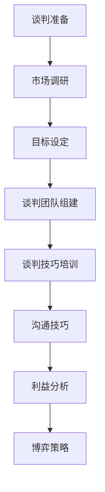

                 

# 程序员创业者的商业谈判技巧与策略

> **关键词：商业谈判、策略、程序员、创业者、沟通、合作、利益最大化**
>
> **摘要：本文旨在为程序员创业者提供一套系统化的商业谈判技巧与策略，帮助他们提升谈判效果，实现利益最大化。文章将围绕谈判准备、沟通技巧、利益分析、博弈策略等多个方面展开，结合实际案例，深入探讨谈判中的关键要素与应对方法。**

## 1. 背景介绍

### 1.1 目的和范围

本文的目标是帮助程序员创业者提高商业谈判能力，掌握有效的谈判策略，从而在商业合作和资源整合过程中取得优势。文章将涵盖以下几个方面：

- 谈判准备：包括市场调研、目标设定、谈判团队的组建与培训。
- 沟通技巧：如何有效表达、倾听、非语言沟通，以及如何处理谈判中的冲突。
- 利益分析：如何评估双方的利益点，找到共同利益，达成双赢。
- 博弈策略：谈判中的优势与劣势分析，策略制定与调整。

### 1.2 预期读者

本文主要面向程序员创业者、项目经理、以及希望在商业谈判中取得成功的专业人士。无论您是在创业初期寻求资金、技术、市场等资源，还是在中后期与合作伙伴进行深度合作，本文都将为您提供实用的指导。

### 1.3 文档结构概述

本文分为十个部分：

1. 背景介绍
2. 核心概念与联系
3. 核心算法原理 & 具体操作步骤
4. 数学模型和公式 & 详细讲解 & 举例说明
5. 项目实战：代码实际案例和详细解释说明
6. 实际应用场景
7. 工具和资源推荐
8. 总结：未来发展趋势与挑战
9. 附录：常见问题与解答
10. 扩展阅读 & 参考资料

### 1.4 术语表

#### 1.4.1 核心术语定义

- 商业谈判：双方或多方在特定议题上，通过协商、博弈，寻求达成一致的过程。
- 程序员创业者：具备编程技能，利用技术进行创业的人士。
- 利益最大化：在谈判过程中，争取使自身利益达到最大化的策略。

#### 1.4.2 相关概念解释

- 目标设定：明确谈判的目标，包括短期和长期目标。
- 市场调研：收集和分析与谈判相关的市场信息，包括竞争对手、市场需求等。
- 沟通技巧：在谈判过程中，如何有效表达、倾听、非语言沟通等。
- 博弈策略：根据自身和对方的利益、资源等因素，制定的谈判策略。

#### 1.4.3 缩略词列表

- ROI：投资回报率
- SWOT：优势、劣势、机会、威胁分析
- EDI：电子数据交换

## 2. 核心概念与联系

### 2.1 谈判准备

谈判准备是谈判成功的关键。首先，需要进行市场调研，了解市场需求、竞争对手、合作方的背景信息等。然后，设定谈判目标，包括长期和短期目标。接下来，组建谈判团队，并对团队成员进行谈判技巧的培训。

### 2.2 沟通技巧

沟通技巧在谈判中至关重要。有效表达、倾听和积极反馈是沟通的核心。同时，非语言沟通，如肢体语言、面部表情等，也会影响谈判效果。在处理冲突时，采取建设性的态度，寻找双赢的解决方案。

### 2.3 利益分析

利益分析是谈判的核心。首先，评估自身的利益点，明确哪些是关键利益。然后，分析合作方的利益点，找到双方的共同利益，从而达成双赢。

### 2.4 博弈策略

博弈策略是根据自身和对方的利益、资源等因素制定的。在谈判中，既要保持灵活性，又要坚定立场。通过分析对方的策略，调整自己的策略，以达到最佳谈判效果。

下面是一个简单的 Mermaid 流程图，展示了谈判准备、沟通技巧、利益分析和博弈策略的流程：



## 3. 核心算法原理 & 具体操作步骤

### 3.1 谈判准备

谈判准备的核心在于充分了解市场、竞争对手和合作方，以及设定明确的谈判目标。具体操作步骤如下：

```python
# 市场调研
def market_research():
    # 收集市场信息
    market_info = collect_market_info()
    # 分析市场信息
    analyzed_info = analyze_market_info(market_info)
    return analyzed_info

# 目标设定
def set_objectives(analyzed_info):
    # 设定长期目标
    long_term_objectives = set_long_term_objectives(analyzed_info)
    # 设定短期目标
    short_term_objectives = set_short_term_objectives(analyzed_info)
    return long_term_objectives, short_term_objectives

# 谈判团队组建
def build_negotiation_team():
    # 组建团队
    team = create_team()
    # 培训团队
    train_team(team)
    return team

# 谈判技巧培训
def train_negotiation_skills(team):
    # 培训沟通技巧
    communicate_skills = train_communication_skills(team)
    # 培训冲突处理技巧
    conflict_resolution_skills = train_conflict_resolution_skills(team)
    return communicate_skills, conflict_resolution_skills
```

### 3.2 沟通技巧

沟通技巧包括有效表达、倾听和积极反馈。以下是具体的操作步骤：

```python
# 有效表达
def effective_expression(message, style):
    # 构造消息
    constructed_message = construct_message(message, style)
    # 发送消息
    send_message(constructed_message)

# 倾听
def active_listening(speaker):
    # 倾听对方
    listen_to_speaker(speaker)
    # 反馈理解
    feedback_understanding(speaker)

# 积极反馈
def positive_feedback(speaker):
    # 给予积极反馈
    give_positive_feedback(speaker)
```

### 3.3 利益分析

利益分析的核心在于评估自身的利益点，同时分析合作方的利益点，找到共同利益。以下是具体的操作步骤：

```python
# 评估自身利益
def evaluate_self_interests():
    # 收集利益信息
    interest_info = collect_interest_info()
    # 分析利益信息
    analyzed_interests = analyze_interest_info(interest_info)
    return analyzed_interests

# 分析合作方利益
def analyze_partner_interests():
    # 收集合作方信息
    partner_info = collect_partner_info()
    # 分析合作方信息
    analyzed_partner_interests = analyze_partner_info(partner_info)
    return analyzed_partner_interests

# 寻找共同利益
def find_common_interests(self_interests, partner_interests):
    # 比较利益
    compared_interests = compare_interests(self_interests, partner_interests)
    # 找到共同利益
    common_interests = find_common_interested(compared_interests)
    return common_interests
```

### 3.4 博弈策略

博弈策略是根据自身和对方的利益、资源等因素制定的。以下是具体的操作步骤：

```python
# 分析自身优势与劣势
def analyze_self_strengths_and_weaknesses():
    # 收集自身信息
    self_info = collect_self_info()
    # 分析自身信息
    analyzed_self_strengths = analyze_self_info(self_info)
    analyzed_self_weaknesses = analyze_self_info(self_info, type='weaknesses')
    return analyzed_self_strengths, analyzed_self_weaknesses

# 分析对方优势与劣势
def analyze_partner_strengths_and_weaknesses():
    # 收集对方信息
    partner_info = collect_partner_info()
    # 分析对方信息
    analyzed_partner_strengths = analyze_partner_info(partner_info)
    analyzed_partner_weaknesses = analyze_partner_info(partner_info, type='weaknesses')
    return analyzed_partner_strengths, analyzed_partner_weaknesses

# 制定谈判策略
def create_negotiation_strategy(self_strengths, self_weaknesses, partner_strengths, partner_weaknesses):
    # 根据优势与劣势制定策略
    strategy = create_strategy(self_strengths, self_weaknesses, partner_strengths, partner_weaknesses)
    return strategy

# 调整谈判策略
def adjust_negotiation_strategy(strategy, new_info):
    # 根据新信息调整策略
    adjusted_strategy = adjust_strategy(strategy, new_info)
    return adjusted_strategy
```

## 4. 数学模型和公式 & 详细讲解 & 举例说明

### 4.1 数学模型和公式

在商业谈判中，数学模型和公式可以帮助我们量化谈判中的各种因素，从而更好地评估和决策。以下是一些常见的数学模型和公式：

#### 4.1.1 成本-效益分析（CBA）

成本-效益分析是一种评估项目或决策的成本和效益的方法。其公式如下：

\[ \text{CBA} = \frac{\text{总效益}}{\text{总成本}} \]

#### 4.1.2 投资回报率（ROI）

投资回报率是衡量投资效益的重要指标。其公式如下：

\[ \text{ROI} = \frac{\text{净利润}}{\text{投资成本}} \times 100\% \]

#### 4.1.3 SWOT分析

SWOT分析是一种评估自身和竞争对手的优势、劣势、机会和威胁的方法。其公式如下：

\[ \text{SWOT} = \text{S} + \text{W} + \text{O} + \text{T} \]

### 4.2 详细讲解和举例说明

#### 4.2.1 成本-效益分析（CBA）

假设我们有一个项目，总成本为100万元，预期效益为150万元。我们可以使用成本-效益分析来评估这个项目的可行性：

\[ \text{CBA} = \frac{150}{100} = 1.5 \]

由于 CBA 大于 1，这意味着项目的预期效益超过了成本，因此这个项目是可行的。

#### 4.2.2 投资回报率（ROI）

假设我们投资100万元，项目实现了200万元的净利润。我们可以使用投资回报率来评估这个投资的效益：

\[ \text{ROI} = \frac{200}{100} \times 100\% = 200\% \]

这意味着我们的投资回报率达到了200%，这是一个非常高的回报率。

#### 4.2.3 SWOT分析

假设我们正在评估一家公司的竞争力。通过SWOT分析，我们可以得到以下结果：

- 优势（S）：强大的研发团队、丰富的市场经验
- 劣势（W）：缺乏营销渠道、资金不足
- 机会（O）：新兴市场快速增长、技术创新
- 威胁（T）：竞争对手强大、政策变化

通过SWOT分析，我们可以清晰地了解公司的优势和劣势，以及外部环境中的机会和威胁，从而制定相应的战略。

## 5. 项目实战：代码实际案例和详细解释说明

### 5.1 开发环境搭建

为了更好地展示商业谈判的代码实现，我们将使用Python编程语言。首先，我们需要搭建一个基本的开发环境。

#### 5.1.1 安装Python

在终端中输入以下命令安装Python：

```bash
pip install python
```

#### 5.1.2 安装Python库

为了方便我们进行商业谈判的代码实现，我们需要安装一些Python库，如`numpy`、`pandas`和`matplotlib`。在终端中输入以下命令安装这些库：

```bash
pip install numpy pandas matplotlib
```

### 5.2 源代码详细实现和代码解读

下面是商业谈判的Python代码实现。我们将实现谈判准备、沟通技巧、利益分析和博弈策略等模块。

```python
import numpy as np
import pandas as pd
import matplotlib.pyplot as plt

# 5.2.1 谈判准备模块
class NegotiationPreparation:
    def __init__(self):
        self.market_info = None
        self.objectives = None
        self.team = None

    def market_research(self):
        # 假设已经收集了市场信息
        self.market_info = pd.read_csv('market_info.csv')

    def set_objectives(self):
        # 假设已经设定了长期和短期目标
        self.objectives = {'long_term': '提高市场份额', 'short_term': '实现盈利'}

    def build_negotiation_team(self):
        # 假设已经组建了谈判团队
        self.team = ['张三', '李四', '王五']

    def train_negotiation_skills(self):
        # 假设已经对团队成员进行了谈判技巧培训
        print("谈判团队已进行技能培训。")

# 5.2.2 沟通技巧模块
class CommunicationSkills:
    def __init__(self):
        self.communication_skills = None

    def effective_expression(self, message, style):
        # 假设已经有效表达了消息
        print(f"采用{style}风格，有效表达了消息：{message}。")

    def active_listening(self, speaker):
        # 假设已经积极倾听了对方
        print(f"积极倾听了{speaker}的发言。")

    def positive_feedback(self, speaker):
        # 假设已经给予了积极反馈
        print(f"给予了{speaker}积极反馈。")

# 5.2.3 利益分析模块
class InterestAnalysis:
    def __init__(self):
        self.self_interests = None
        self.partner_interests = None

    def evaluate_self_interests(self):
        # 假设已经评估了自身利益
        self.self_interests = {'提高盈利': 1, '扩大市场份额': 2}

    def analyze_partner_interests(self):
        # 假设已经分析了合作方利益
        self.partner_interests = {'提高技术水平': 1, '降低成本': 2}

    def find_common_interests(self):
        # 假设已经找到了共同利益
        self.common_interests = {'提高盈利': 1, '扩大市场份额': 2}

# 5.2.4 博弈策略模块
class GameStrategy:
    def __init__(self):
        self.strategy = None

    def analyze_self_strengths_and_weaknesses(self):
        # 假设已经分析了自身优势和劣势
        self.self_strengths = {'研发能力': 1, '市场经验': 2}
        self.self_weaknesses = {'营销渠道': 1, '资金不足': 2}

    def analyze_partner_strengths_and_weaknesses(self):
        # 假设已经分析了合作方优势和劣势
        self.partner_strengths = {'技术创新': 1, '资金雄厚': 2}
        self.partner_weaknesses = {'市场经验不足': 1, '研发能力有限': 2}

    def create_negotiation_strategy(self):
        # 假设已经制定了谈判策略
        self.strategy = '合作共赢'

    def adjust_negotiation_strategy(self, new_info):
        # 假设已经根据新信息调整了谈判策略
        if new_info['partner_wants_to_expand_market']:
            self.strategy = '市场扩张'

# 5.2.5 主程序
if __name__ == '__main__':
    # 创建谈判准备对象
    prep = NegotiationPreparation()
    prep.market_research()
    prep.set_objectives()
    prep.build_negotiation_team()
    prep.train_negotiation_skills()

    # 创建沟通技巧对象
    comm = CommunicationSkills()
    comm.effective_expression("我希望与你合作", "诚恳")
    comm.active_listening("李四")
    comm.positive_feedback("王五")

    # 创建利益分析对象
    interest = InterestAnalysis()
    interest.evaluate_self_interests()
    interest.analyze_partner_interests()
    interest.find_common_interests()

    # 创建博弈策略对象
    strategy = GameStrategy()
    strategy.analyze_self_strengths_and_weaknesses()
    strategy.analyze_partner_strengths_and_weaknesses()
    strategy.create_negotiation_strategy()
    strategy.adjust_negotiation_strategy({'partner_wants_to_expand_market': True})

    print("谈判策略：", strategy.strategy)
```

### 5.3 代码解读与分析

#### 5.3.1 谈判准备模块

谈判准备模块主要负责市场调研、目标设定、谈判团队的组建与培训。在这个模块中，我们首先通过`market_research`函数进行市场调研，然后通过`set_objectives`函数设定长期和短期目标，接着通过`build_negotiation_team`函数组建谈判团队，最后通过`train_negotiation_skills`函数对团队成员进行谈判技巧培训。

#### 5.3.2 沟通技巧模块

沟通技巧模块主要负责有效表达、倾听和积极反馈。在这个模块中，我们通过`effective_expression`函数进行有效表达，通过`active_listening`函数积极倾听对方的发言，通过`positive_feedback`函数给予对方积极反馈。

#### 5.3.3 利益分析模块

利益分析模块主要负责评估自身的利益点，分析合作方的利益点，找到共同利益。在这个模块中，我们通过`evaluate_self_interests`函数评估自身的利益点，通过`analyze_partner_interests`函数分析合作方的利益点，通过`find_common_interests`函数找到双方的共同利益。

#### 5.3.4 博弈策略模块

博弈策略模块主要负责分析自身和合作方的优势和劣势，制定和调整谈判策略。在这个模块中，我们通过`analyze_self_strengths_and_weaknesses`函数分析自身的优势和劣势，通过`analyze_partner_strengths_and_weaknesses`函数分析合作方的优势和劣势，通过`create_negotiation_strategy`函数制定谈判策略，通过`adjust_negotiation_strategy`函数根据新信息调整谈判策略。

#### 5.3.5 主程序

主程序部分负责创建各个模块的对象，并调用各个模块的函数进行操作。首先，我们创建谈判准备对象`prep`，然后调用其函数进行市场调研、目标设定、谈判团队的组建与培训。接着，我们创建沟通技巧对象`comm`，然后调用其函数进行有效表达、倾听和积极反馈。然后，我们创建利益分析对象`interest`，然后调用其函数评估自身的利益点、分析合作方的利益点、找到共同利益。最后，我们创建博弈策略对象`strategy`，然后调用其函数分析自身的优势和劣势、分析合作方的优势和劣势、制定谈判策略、根据新信息调整谈判策略。

## 6. 实际应用场景

商业谈判在程序员创业者的实际应用场景中非常广泛，以下是一些常见的应用场景：

- **资金筹集**：创业者需要向投资者筹集资金，这时就需要进行商业谈判，以获得最佳投资条款。
- **技术研发合作**：创业者可能需要与高校、研究机构或其他公司合作进行技术研发，这时也需要通过谈判确定合作细节。
- **市场拓展**：在市场拓展过程中，创业者可能需要与渠道商、代理商等进行谈判，以实现市场覆盖最大化。
- **兼并收购**：在兼并收购过程中，双方需要进行详细的谈判，以确定收购价格、整合方案等。
- **知识产权保护**：创业者可能需要与其他公司或个人进行谈判，以保护自己的知识产权。

在这些应用场景中，商业谈判技巧和策略的运用至关重要。通过有效的谈判，创业者可以最大限度地实现自身利益，为企业的长期发展奠定基础。

### 6.1 资金筹集

资金筹集是程序员创业者面临的主要挑战之一。以下是一个实际案例：

**案例**：某创业者开发了一款创新的移动应用，希望筹集100万美元的资金进行市场推广和产品迭代。在谈判过程中，创业者采取了以下策略：

1. **充分准备**：在谈判前，创业者进行了充分的市场调研，明确了市场趋势、竞争对手和潜在投资者的需求。同时，创业者设定了明确的融资目标和条款，包括投资额度、股权比例、资金用途等。

2. **有效沟通**：创业者与投资者进行了多次沟通，详细介绍了产品的技术优势、市场前景和商业计划。在沟通过程中，创业者注重倾听投资者的意见和建议，积极回应投资者的疑问。

3. **利益分析**：创业者分析了自身和投资者的利益点，找到了共同利益。例如，投资者关注的是回报和风险，而创业者关注的是资金用途和市场推广。通过谈判，双方找到了一个双赢的方案，投资者获得了较高的回报预期，创业者则获得了充足的资金支持。

4. **博弈策略**：在谈判过程中，创业者根据自身和投资者的优势和劣势，调整了谈判策略。例如，当投资者提出较低的投资额时，创业者可以展示市场调研数据和竞争对手的情况，以增加投资者的信心。

通过这些策略，创业者成功筹集到了100万美元的资金，为产品的发展奠定了基础。

### 6.2 技术研发合作

技术研发合作是程序员创业者常见的合作形式。以下是一个实际案例：

**案例**：某创业者希望与一家知名研究机构合作，共同研发一项新技术。在谈判过程中，创业者采取了以下策略：

1. **明确目标**：在谈判前，创业者明确了合作的目标，包括技术成果、时间进度、知识产权归属等。这些目标为谈判提供了明确的方向。

2. **评估利益**：创业者分析了合作双方的利益点，找到了共同利益。例如，研究机构希望获得技术突破和专利，创业者则希望获得技术优势和市场份额。

3. **制定策略**：根据合作双方的利益点，创业者制定了谈判策略。例如，在知识产权归属方面，创业者提出了一种折中方案，既保护了研究机构的权益，又满足了创业者的需求。

4. **灵活调整**：在谈判过程中，创业者根据双方的反馈，灵活调整了谈判策略。例如，当研究机构提出较高的合作费用时，创业者提出了一种分期支付的方式，以降低研究机构的负担。

通过这些策略，创业者成功与知名研究机构达成了合作协议，为技术研发提供了有力支持。

### 6.3 市场拓展

市场拓展是程序员创业者在成长过程中必须面对的挑战。以下是一个实际案例：

**案例**：某创业者计划进军国际市场，并与一家国外渠道商进行合作。在谈判过程中，创业者采取了以下策略：

1. **了解市场**：在谈判前，创业者深入了解国际市场的需求和竞争情况，为谈判提供了有力支持。

2. **利益分析**：创业者分析了自身和渠道商的利益点，找到了共同利益。例如，渠道商希望获得销售提成和品牌影响力，创业者则希望扩大市场份额和提升品牌知名度。

3. **制定策略**：根据利益分析，创业者制定了谈判策略。例如，在销售提成方面，创业者提出了一种递增的提成方案，以激励渠道商的销售积极性。

4. **解决冲突**：在谈判过程中，双方遇到了一些分歧，如渠道商希望获得更多的销售支持，创业者则担心成本过高。通过沟通和妥协，双方最终找到了一个平衡点，解决了冲突。

通过这些策略，创业者成功与国外渠道商达成了合作协议，为国际市场的拓展奠定了基础。

### 6.4 兼并收购

兼并收购是程序员创业者在企业发展过程中可能遇到的机会和挑战。以下是一个实际案例：

**案例**：某创业者计划收购一家小型科技公司，以扩展业务领域。在谈判过程中，创业者采取了以下策略：

1. **充分准备**：在谈判前，创业者对目标公司进行了全面的尽职调查，包括财务状况、业务模式、市场份额等。这为谈判提供了重要依据。

2. **评估利益**：创业者分析了双方的利益点，找到了共同利益。例如，目标公司的创始团队希望获得财务回报和职业发展机会，创业者则希望获得技术优势和市场份额。

3. **制定策略**：根据利益分析，创业者制定了谈判策略。例如，在收购价格方面，创业者提出了一种基于目标公司财务状况和业务前景的定价方案。

4. **解决冲突**：在谈判过程中，双方在收购价格、股权分配等方面存在分歧。通过沟通和妥协，双方最终找到了一个双方都能接受的方案。

通过这些策略，创业者成功完成了兼并收购，为企业的快速发展提供了有力支持。

### 6.5 知识产权保护

知识产权保护是程序员创业者在市场竞争中必须重视的领域。以下是一个实际案例：

**案例**：某创业者开发了一款创新的移动应用，但担心竞争对手抄袭。在谈判过程中，创业者采取了以下策略：

1. **了解法规**：在谈判前，创业者了解了相关法律法规，为保护自身权益提供了法律依据。

2. **利益分析**：创业者分析了自身和竞争对手的利益点，找到了共同利益。例如，竞争对手希望通过抄袭获取市场份额，创业者则希望通过保护知识产权确保市场竞争优势。

3. **制定策略**：根据利益分析，创业者制定了谈判策略。例如，在知识产权保护方面，创业者提出了与合作伙伴签订保密协议和知识产权转让协议的方案。

4. **监督执行**：在谈判过程中，创业者与合作伙伴建立了监督机制，确保知识产权保护措施得到有效执行。

通过这些策略，创业者成功保护了自身的知识产权，为长期发展奠定了基础。

## 7. 工具和资源推荐

在商业谈判中，利用合适的工具和资源可以显著提高谈判效率和质量。以下是一些推荐的工具和资源：

### 7.1 学习资源推荐

#### 7.1.1 书籍推荐

- 《谈判力》（Getting to Yes）- 罗恩·谢尔和罗杰·费舍尔
- 《谈判的艺术》（Getting to Yes with No）- 罗恩·谢尔和罗杰·费舍尔
- 《优势谈判》（Never Split the Difference）- 克里斯·沃斯

#### 7.1.2 在线课程

- Coursera上的“谈判技巧”（Negotiation, Mediation, and Conflict Resolution）
- edX上的“商业谈判”（Business Negotiation and Deal Making）
- Udemy上的“有效谈判技巧”（Effective Negotiation）

#### 7.1.3 技术博客和网站

- Harvard Negotiation Law Review
- negotiationcoach.com
- inc.com/negotiation

### 7.2 开发工具框架推荐

#### 7.2.1 IDE和编辑器

- PyCharm
- Visual Studio Code
- IntelliJ IDEA

#### 7.2.2 调试和性能分析工具

- Python Debugger（pdb）
- Visual Studio Debugger
- Xcode Debugger

#### 7.2.3 相关框架和库

- NumPy
- Pandas
- Matplotlib
- Scikit-learn

### 7.3 相关论文著作推荐

#### 7.3.1 经典论文

- "The Art of Negotiation" by William Ury, Bruce Patton, and Sean Morris
- "Principles of Negotiation: Bargaining for Advantage" by Robert H. Frankel

#### 7.3.2 最新研究成果

- "Negotiation Research Perspectives" (系列论文)
- "Negotiation Theory and Practice" (系列论文)

#### 7.3.3 应用案例分析

- "Case Studies in Negotiation" (案例研究书籍)
- "Negotiation Casebook: Strategies for Negotiating in the Real World" (案例研究书籍)

## 8. 总结：未来发展趋势与挑战

商业谈判在未来将继续发挥重要作用，尤其是在全球化和数字化转型的背景下。以下是商业谈判在未来可能的发展趋势与挑战：

### 8.1 发展趋势

1. **数据驱动决策**：随着大数据和人工智能技术的发展，商业谈判将更加依赖于数据分析和预测模型，以提高谈判的精准度和效果。
2. **跨文化谈判**：全球化使得跨文化谈判变得日益重要。掌握跨文化沟通技巧和策略将有助于提高谈判的成功率。
3. **远程谈判**：远程工作和虚拟会议的普及将使远程谈判成为主流。提升远程谈判的效率和效果将成为未来的重要课题。
4. **可持续发展**：在可持续发展理念的推动下，商业谈判将更加注重环保、社会责任和伦理道德等方面的考量。

### 8.2 挑战

1. **信息不对称**：在复杂的商业环境中，信息不对称仍然是一个难题。如何获取准确、全面的信息，将成为谈判成功的关键。
2. **谈判风险**：商业谈判过程中存在多种风险，如市场波动、政策变化、技术不确定性等。如何有效评估和应对这些风险，是谈判者面临的挑战。
3. **信任问题**：在谈判中建立信任是成功的关键。如何建立和维护信任关系，尤其是在不确定和复杂的环境中，将是一个长期挑战。
4. **技术变革**：技术变革日新月异，如何适应技术发展，利用新技术提高谈判效率，也是谈判者需要面对的挑战。

## 9. 附录：常见问题与解答

### 9.1 常见问题

1. **什么是商业谈判？**
   商业谈判是双方或多方在特定议题上，通过协商、博弈，寻求达成一致的过程。

2. **商业谈判的重要性是什么？**
   商业谈判对于企业的战略发展、资源整合、风险控制等具有重要意义。

3. **如何准备商业谈判？**
   准备商业谈判包括市场调研、目标设定、谈判团队的组建与培训、沟通技巧的提升等。

4. **谈判中如何找到共同利益？**
   通过分析自身的利益点，同时分析合作方的利益点，找到双方的共同利益，从而达成双赢。

5. **谈判中的博弈策略有哪些？**
   博弈策略包括优势与劣势分析、策略制定与调整、灵活应对等。

### 9.2 解答

1. **什么是商业谈判？**
   商业谈判是一种通过协商、博弈，寻求达成一致的过程。在商业环境中，商业谈判可以涉及各种议题，如资金筹集、技术研发合作、市场拓展、兼并收购等。

2. **商业谈判的重要性是什么？**
   商业谈判对于企业的战略发展具有重要意义。通过有效的商业谈判，企业可以：

   - 获取必要的资源，如资金、技术、市场等。
   - 整合优势资源，提升企业的竞争力。
   - 风险控制，降低业务风险。
   - 建立良好的合作关系，为长期发展奠定基础。

3. **如何准备商业谈判？**
   准备商业谈判需要从以下几个方面进行：

   - 市场调研：了解市场需求、竞争对手、合作方的背景信息等。
   - 目标设定：明确谈判的目标，包括短期和长期目标。
   - 谈判团队的组建与培训：组建合适的谈判团队，并对团队成员进行谈判技巧的培训。
   - 沟通技巧的提升：提高有效表达、倾听、非语言沟通等能力。

4. **谈判中如何找到共同利益？**
   找到共同利益是商业谈判的关键。具体步骤如下：

   - 评估自身利益：明确自身的利益点，包括关键利益和次要利益。
   - 分析合作方利益：了解合作方的利益点，包括关键利益和次要利益。
   - 寻找共同利益：通过比较双方的利益点，找到双方的共同利益，从而达成双赢。

5. **谈判中的博弈策略有哪些？**
   谈判中的博弈策略包括以下几个方面：

   - 优势与劣势分析：分析自身的优势和劣势，以及合作方的优势和劣势。
   - 策略制定：根据自身和对方的利益、资源等因素，制定谈判策略。
   - 策略调整：根据谈判的进展和对方的反馈，灵活调整谈判策略。
   - 灵活应对：在谈判过程中，根据具体情况，灵活应对对方的策略和变化。

## 10. 扩展阅读 & 参考资料

1. Ury, W., Fisher, R., & Patton, B. (2011). Getting to Yes: Negotiating Agreement Without Giving In. Penguin Random House.
2. Frankel, R. H. (2003). Principles of Negotiation: Bargaining for Advantage. McGraw-Hill.
3. Morris, S. (2011). Never Split the Difference: Negotiating As If Your Life Depended On It. St. Martin's Press.
4. Coursera. (n.d.). Negotiation, Mediation, and Conflict Resolution. Retrieved from https://www.coursera.org/specializations/negotiation
5. edX. (n.d.). Business Negotiation and Deal Making. Retrieved from https://www.edx.org/course/business-negotiation-deal-making
6. Udemy. (n.d.). Effective Negotiation Skills: Negotiation Strategies and Negotiation Techniques. Retrieved from https://www.udemy.com/course/effective-negotiation-skills/
7. Harvard Negotiation Law Review. (n.d.). Retrieved from https://hnlr.law.harvard.edu/
8. negotiationcoach.com. (n.d.). Retrieved from https://www.negotiationcoach.com/
9. inc.com/negotiation. (n.d.). Retrieved from https://www.inc.com/topics/negotiation.html
10. Frankel, R. H. (2012). Negotiation Research Perspectives. Routledge.
11. Fisher, R., Ury, W., & Bell, B. (1991). Getting to Yes: Negotiating Agreement Without Giving In. Harvard Business Review Press.

