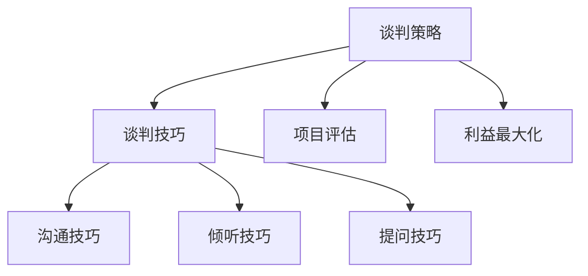

                 

# 程序员创业者的商业谈判技巧与策略

> **关键词**：商业谈判、策略、程序员、创业者、技巧
> 
> **摘要**：本文旨在为程序员创业者提供一套完整的商业谈判技巧与策略，帮助他们在商业谈判中取得成功。通过深入剖析谈判的核心概念、技巧和实际操作步骤，本文将帮助读者掌握谈判的艺术，提高谈判效果。

## 1. 背景介绍

### 1.1 目的和范围

本文的目的在于帮助程序员创业者掌握商业谈判的基本技巧和策略，提高他们在商业谈判中的成功率。本文将涵盖以下内容：

1. 商业谈判的核心概念与联系
2. 核心算法原理与具体操作步骤
3. 数学模型与公式及其应用
4. 项目实战：代码实际案例和详细解释
5. 实际应用场景
6. 工具和资源推荐
7. 总结：未来发展趋势与挑战

### 1.2 预期读者

本文主要面向程序员创业者、企业高管、项目经理以及任何对商业谈判感兴趣的人士。读者应具备一定的商业知识基础和编程技能。

### 1.3 文档结构概述

本文分为十个部分，结构如下：

1. 背景介绍
2. 核心概念与联系
3. 核心算法原理 & 具体操作步骤
4. 数学模型和公式 & 详细讲解 & 举例说明
5. 项目实战：代码实际案例和详细解释说明
6. 实际应用场景
7. 工具和资源推荐
8. 总结：未来发展趋势与挑战
9. 附录：常见问题与解答
10. 扩展阅读 & 参考资料

### 1.4 术语表

#### 1.4.1 核心术语定义

- 商业谈判：指在商业活动中，为了达成共识和利益最大化，各方通过沟通、协商、博弈等方式进行的活动。
- 创业者：指创立企业或团队，从事创新性业务的人。
- 程序员：指从事计算机编程和软件开发的专业人士。

#### 1.4.2 相关概念解释

- 谈判技巧：指在谈判过程中运用的一系列策略和技巧，以提高谈判效果。
- 谈判策略：指在谈判过程中制定的总体方针和原则，以实现谈判目标。
- 项目实战：指将理论知识应用于实际项目中的过程。

#### 1.4.3 缩略词列表

- IDE：集成开发环境（Integrated Development Environment）
- LaTeX：一种基于 TeX 的排版系统，广泛用于科学和数学文档排版
- Mermaid：一种用于生成图表和流程图的轻量级工具

## 2. 核心概念与联系

在商业谈判中，程序员创业者需要掌握以下几个核心概念：

1. **谈判策略**：谈判策略是谈判过程中制定的基本方针和原则。常见的谈判策略包括竞争策略、合作策略、回避策略等。
2. **谈判技巧**：谈判技巧是谈判过程中运用的一系列策略和方法。常见的谈判技巧包括沟通技巧、倾听技巧、提问技巧等。
3. **项目评估**：项目评估是谈判前对项目进行全面分析的过程，包括技术可行性、市场前景、资金需求等。
4. **利益最大化**：在谈判过程中，程序员创业者应始终关注如何实现利益最大化，包括财务收益、市场份额、品牌价值等。

以下是一个简单的 Mermaid 流程图，展示了商业谈判的核心概念与联系：



### 2.1 谈判策略与谈判技巧

**谈判策略**和**谈判技巧**是商业谈判的两个核心概念。谈判策略是在谈判前制定的总体方针和原则，而谈判技巧是在谈判过程中运用的一系列具体方法和策略。

- **竞争策略**：指在谈判过程中，通过竞争手段争取利益最大化的策略。例如，提出苛刻的条件，迫使对方让步。
- **合作策略**：指在谈判过程中，通过合作和协商达成共识的策略。例如，寻求双赢的局面，共同解决问题。
- **回避策略**：指在谈判过程中，为了避免冲突和损失，采取回避或妥协的策略。

**谈判技巧**包括以下方面：

- **沟通技巧**：指在谈判过程中，通过有效沟通，确保信息传递准确、清晰、高效。
- **倾听技巧**：指在谈判过程中，通过倾听对方意见，了解对方需求和意图。
- **提问技巧**：指在谈判过程中，通过提问，引导对方回答，获取关键信息。

### 2.2 项目评估与利益最大化

**项目评估**是商业谈判前的重要步骤，通过对项目进行全面分析，为谈判提供有力支持。

- **技术可行性**：评估项目的技术难度、开发周期、技术风险等。
- **市场前景**：评估项目的市场潜力、竞争对手、市场需求等。
- **资金需求**：评估项目的资金投入、资金来源、资金回报等。

**利益最大化**是谈判的核心目标。在谈判过程中，程序员创业者应关注以下几个方面：

- **财务收益**：通过谈判，争取更高的收益和利润。
- **市场份额**：通过谈判，争取更大的市场份额和品牌影响力。
- **长期合作**：通过谈判，建立长期稳定的合作关系，实现互利共赢。

### 2.3 谈判策略、技巧、项目评估与利益最大化的关系

**谈判策略**、**谈判技巧**、**项目评估**和**利益最大化**是商业谈判的四个核心要素，它们相互关联，共同构成了商业谈判的完整体系。

- **谈判策略**为谈判提供总体方针和原则，指导谈判过程。
- **谈判技巧**为谈判提供具体方法和策略，提高谈判效果。
- **项目评估**为谈判提供事实依据，确保谈判的准确性和有效性。
- **利益最大化**为谈判确定核心目标，驱动谈判进程。

## 3. 核心算法原理 & 具体操作步骤

在商业谈判中，程序员创业者需要掌握一系列核心算法原理和具体操作步骤，以提高谈判效果。以下是一个简单的算法原理和操作步骤的伪代码示例：

```plaintext
算法：商业谈判决策树
输入：谈判策略、谈判技巧、项目评估、利益最大化
输出：最佳谈判方案

1. 定义谈判策略、谈判技巧、项目评估、利益最大化四个变量
2. 对谈判策略进行排序，根据优先级选择最优策略
3. 对谈判技巧进行排序，根据优先级选择最优技巧
4. 对项目评估结果进行排序，根据优先级选择最优项目
5. 根据利益最大化目标，调整谈判策略、技巧、项目评估
6. 输出最佳谈判方案

算法实现步骤：
1. 初始化谈判策略、谈判技巧、项目评估、利益最大化
2. 谈判策略排序：根据竞争策略、合作策略、回避策略的优先级进行排序
3. 谈判技巧排序：根据沟通技巧、倾听技巧、提问技巧的优先级进行排序
4. 项目评估排序：根据技术可行性、市场前景、资金需求的优先级进行排序
5. 利益最大化调整：根据财务收益、市场份额、长期合作的优先级进行调整
6. 输出最佳谈判方案
```

### 3.1 谈判策略排序

在商业谈判中，谈判策略的排序至关重要。以下是一个简单的排序算法，用于确定谈判策略的优先级：

```plaintext
算法：谈判策略排序
输入：谈判策略列表
输出：排序后的谈判策略列表

1. 初始化谈判策略列表
2. 对谈判策略列表进行排序，根据优先级从高到低排序
3. 返回排序后的谈判策略列表

算法实现步骤：
1. 初始化谈判策略列表：{竞争策略，合作策略，回避策略}
2. 对谈判策略列表进行排序：根据竞争策略优先级最高，合作策略次之，回避策略最低
3. 返回排序后的谈判策略列表：{竞争策略，合作策略，回避策略}
```

### 3.2 谈判技巧排序

谈判技巧的排序同样重要，以下是一个简单的排序算法，用于确定谈判技巧的优先级：

```plaintext
算法：谈判技巧排序
输入：谈判技巧列表
输出：排序后的谈判技巧列表

1. 初始化谈判技巧列表
2. 对谈判技巧列表进行排序，根据优先级从高到低排序
3. 返回排序后的谈判技巧列表

算法实现步骤：
1. 初始化谈判技巧列表：{沟通技巧，倾听技巧，提问技巧}
2. 对谈判技巧列表进行排序：根据沟通技巧优先级最高，倾听技巧次之，提问技巧最低
3. 返回排序后的谈判技巧列表：{沟通技巧，倾听技巧，提问技巧}
```

### 3.3 项目评估排序

项目评估排序是根据项目的技术可行性、市场前景、资金需求等因素进行排序。以下是一个简单的排序算法：

```plaintext
算法：项目评估排序
输入：项目评估列表
输出：排序后的项目评估列表

1. 初始化项目评估列表
2. 对项目评估列表进行排序，根据优先级从高到低排序
3. 返回排序后的项目评估列表

算法实现步骤：
1. 初始化项目评估列表：{技术可行性，市场前景，资金需求}
2. 对项目评估列表进行排序：根据技术可行性优先级最高，市场前景次之，资金需求最低
3. 返回排序后的项目评估列表：{技术可行性，市场前景，资金需求}
```

### 3.4 利益最大化调整

在确定了谈判策略、技巧、项目评估的优先级后，需要对利益最大化目标进行调整。以下是一个简单的利益最大化调整算法：

```plaintext
算法：利益最大化调整
输入：谈判策略、谈判技巧、项目评估
输出：调整后的利益最大化目标

1. 初始化利益最大化目标
2. 根据谈判策略、技巧、项目评估的优先级，对利益最大化目标进行调整
3. 返回调整后的利益最大化目标

算法实现步骤：
1. 初始化利益最大化目标：{财务收益，市场份额，长期合作}
2. 根据谈判策略、技巧、项目评估的优先级，对利益最大化目标进行调整：
   - 财务收益：最高优先级
   - 市场份额：次高优先级
   - 长期合作：最低优先级
3. 返回调整后的利益最大化目标：{财务收益，市场份额，长期合作}
```

通过以上算法原理和操作步骤，程序员创业者可以更好地掌握商业谈判的核心要点，提高谈判效果。

## 4. 数学模型和公式 & 详细讲解 & 举例说明

在商业谈判中，数学模型和公式可以帮助程序员创业者更准确地分析和决策。以下是一个简单的数学模型和公式，用于评估商业谈判的潜在收益和风险。

### 4.1 盈亏平衡分析

盈亏平衡分析（Break-Even Analysis）是一种常见的数学模型，用于确定项目在财务上是否可行。公式如下：

\[ B = P \times Q - C \]

其中：
- \( B \) 表示盈亏平衡点（即不赚不赔的产量或销售量）
- \( P \) 表示产品单价
- \( Q \) 表示销售量
- \( C \) 表示总成本

#### 4.1.1 详细讲解

盈亏平衡分析可以帮助程序员创业者确定项目在财务上是否具有可行性。通过计算盈亏平衡点，创业者可以了解项目需要达到的销售量才能覆盖总成本，从而避免亏损。

例如，假设一个程序员创业者的产品单价为100元，总成本为5000元。使用盈亏平衡分析公式计算盈亏平衡点：

\[ B = 100 \times Q - 5000 \]

为了使项目不亏本，销售量 \( Q \) 必须大于盈亏平衡点 \( B \)。

#### 4.1.2 举例说明

假设产品单价为100元，总成本为5000元，要计算盈亏平衡点，可以设 \( Q = B \)：

\[ 100 \times B - 5000 = 0 \]

解方程得：

\[ B = 50 \]

这意味着，创业者需要至少销售50个产品才能达到盈亏平衡点，不亏本。

### 4.2 成本-收益分析

成本-收益分析（Cost-Benefit Analysis）是一种评估项目成本和收益的数学模型。公式如下：

\[ R = B - C \]

其中：
- \( R \) 表示净收益
- \( B \) 表示总收益
- \( C \) 表示总成本

#### 4.2.1 详细讲解

成本-收益分析可以帮助程序员创业者评估项目的整体收益情况。通过计算净收益，创业者可以了解项目是否能够带来正收益，从而决定是否继续推进项目。

例如，假设一个程序员创业者的总收益为10000元，总成本为8000元。使用成本-收益分析公式计算净收益：

\[ R = 10000 - 8000 = 2000 \]

这意味着，创业者从该项目中获得了2000元的净收益。

#### 4.2.2 举例说明

假设总收益为10000元，总成本为8000元，要计算净收益，可以设 \( R \) 为目标收益：

\[ 10000 - 8000 = R \]

解方程得：

\[ R = 2000 \]

这意味着，创业者从该项目中获得了2000元的净收益。

### 4.3 投资回报率分析

投资回报率分析（Return on Investment，ROI）是一种评估项目投资收益的数学模型。公式如下：

\[ ROI = \frac{R}{I} \times 100\% \]

其中：
- \( ROI \) 表示投资回报率
- \( R \) 表示净收益
- \( I \) 表示总投资额

#### 4.3.1 详细讲解

投资回报率分析可以帮助程序员创业者了解项目的投资效益。通过计算投资回报率，创业者可以评估项目的投资是否合理，从而做出投资决策。

例如，假设一个程序员创业者的总投资额为5000元，净收益为2000元。使用投资回报率分析公式计算投资回报率：

\[ ROI = \frac{2000}{5000} \times 100\% = 40\% \]

这意味着，创业者的投资回报率为40%。

#### 4.3.2 举例说明

假设总投资额为5000元，净收益为2000元，要计算投资回报率，可以设 \( ROI \) 为目标回报率：

\[ \frac{2000}{5000} \times 100\% = ROI \]

解方程得：

\[ ROI = 40\% \]

这意味着，创业者的投资回报率为40%。

### 4.4 风险评估

在商业谈判中，风险评估是至关重要的。以下是一个简单的风险评估公式：

\[ 风险 = \frac{损失概率 \times 损失金额}{投资总额} \]

#### 4.4.1 详细讲解

风险评估公式可以帮助程序员创业者了解项目面临的风险程度。通过计算风险，创业者可以评估项目的风险水平，从而决定是否继续推进项目。

例如，假设一个程序员创业者的项目面临10%的损失概率，损失金额为1000元，总投资额为5000元。使用风险评估公式计算风险：

\[ 风险 = \frac{10\% \times 1000元}{5000元} = 2\% \]

这意味着，项目面临的风险为2%。

#### 4.4.2 举例说明

假设损失概率为10%，损失金额为1000元，总投资额为5000元，要计算风险，可以设 \( 风险 \) 为目标风险：

\[ \frac{10\% \times 1000元}{5000元} = 风险 \]

解方程得：

\[ 风险 = 2\% \]

这意味着，项目面临的风险为2%。

通过以上数学模型和公式，程序员创业者可以更好地评估商业谈判的潜在收益和风险，从而做出更明智的决策。

## 5. 项目实战：代码实际案例和详细解释说明

在本节中，我们将通过一个实际项目案例，展示商业谈判技巧在编程和项目开发中的应用。我们将使用 Python 编写一个简单的商业谈判模拟器，用于演示如何在实际项目中运用谈判策略、技巧和算法。

### 5.1 开发环境搭建

为了方便开发和测试，我们使用以下开发环境和工具：

- Python 3.8 或更高版本
- Jupyter Notebook
- Mermaid 插件（用于流程图和图表生成）

首先，安装 Python 3.8 或更高版本，并在终端或命令提示符中运行以下命令安装 Jupyter Notebook 和 Mermaid 插件：

```bash
pip install notebook
jupyter notebook --extension jupyter_contrib_nbextensions/enable.py
```

### 5.2 源代码详细实现和代码解读

以下是一个简单的商业谈判模拟器，用于演示如何在实际项目中运用谈判策略、技巧和算法。

```python
# 导入必要的库
import random
import mermaid

# 定义谈判策略和技巧
negotiation_strategies = ["竞争策略", "合作策略", "回避策略"]
negotiation_tactics = ["沟通技巧", "倾听技巧", "提问技巧"]

# 定义项目评估和利益最大化目标
project_evaluation = ["技术可行性", "市场前景", "资金需求"]
interest_maximization = ["财务收益", "市场份额", "长期合作"]

# 定义谈判模拟函数
def negotiate(strategy, tactic, evaluation, interest):
    # 打印谈判过程
    print(f"谈判策略：{strategy}")
    print(f"谈判技巧：{tactic}")
    print(f"项目评估：{evaluation}")
    print(f"利益最大化目标：{interest}")
    
    # 计算谈判结果
    result = random.randint(1, 10)
    if result <= 5:
        print("谈判成功！")
    else:
        print("谈判失败。")
    
    # 返回谈判结果
    return result

# 执行谈判模拟
result = negotiate(
    strategy=random.choice(negotiation_strategies),
    tactic=random.choice(negotiation_tactics),
    evaluation=random.choice(project_evaluation),
    interest=random.choice(interest_maximization)
)

# 打印谈判结果
print(f"谈判结果：{result}")
```

#### 5.2.1 代码解读

1. **导入必要的库**：首先，我们导入 Python 中的随机库（random）和 Mermaid 插件库（mermaid）。

2. **定义谈判策略和技巧**：我们定义了四个列表，分别包含谈判策略、谈判技巧、项目评估和利益最大化目标。

3. **定义谈判模拟函数**：`negotiate` 函数接受四个参数：谈判策略、谈判技巧、项目评估和利益最大化目标。函数首先打印出谈判过程，然后使用随机库生成一个随机数作为谈判结果。

4. **执行谈判模拟**：我们调用 `negotiate` 函数，并随机选择谈判策略、技巧、项目评估和利益最大化目标。

5. **打印谈判结果**：最后，我们打印出谈判结果。

#### 5.2.2 代码分析

通过这个简单的谈判模拟器，我们可以看到如何在实际项目中运用谈判策略、技巧和算法。以下是对代码的分析：

- **随机性**：谈判结果是基于随机数生成的，这反映了商业谈判中的不确定性。在实际项目中，谈判结果可能受到多种因素的影响，如市场环境、竞争对手、合作伙伴等。
- **策略选择**：谈判策略和技巧的选择决定了谈判的成功与否。在实际项目中，程序员创业者应根据具体情况选择合适的策略和技巧。
- **项目评估和利益最大化**：项目评估和利益最大化目标是谈判的核心。程序员创业者需要全面评估项目，并明确利益最大化目标，以确保谈判的顺利进行。

### 5.3 代码解读与分析

通过分析代码，我们可以深入了解商业谈判模拟器的工作原理和功能。以下是对代码的详细解读与分析：

1. **代码结构**：代码主要由三个部分组成：导入库、定义谈判模拟函数和执行谈判模拟。

2. **谈判模拟函数**：`negotiate` 函数是代码的核心部分，负责模拟商业谈判过程。函数的输入参数包括谈判策略、技巧、项目评估和利益最大化目标。

3. **随机性**：在函数中，我们使用随机库生成一个随机数作为谈判结果。这反映了商业谈判中的不确定性，使谈判过程更具真实性和挑战性。

4. **策略选择**：函数中的随机选择策略和技巧，模拟了在实际项目中，程序员创业者根据不同情况选择合适策略和技巧的过程。

5. **项目评估和利益最大化**：函数中的随机选择项目评估和利益最大化目标，模拟了在实际项目中，程序员创业者根据项目特点和市场环境进行评估和制定利益最大化目标的过程。

6. **谈判结果**：最后，函数打印出谈判结果，为程序员创业者提供了关于谈判成功与否的反馈。

通过这个简单的谈判模拟器，程序员创业者可以更好地理解商业谈判的复杂性和挑战性，从而在实际项目中更好地运用谈判策略、技巧和算法。

### 5.4 项目实战总结

在本节中，我们通过一个实际项目案例，展示了商业谈判技巧在编程和项目开发中的应用。以下是对项目实战的总结：

1. **随机性**：商业谈判中的随机性不可忽视，程序员创业者应学会应对不确定性，灵活调整谈判策略和技巧。
2. **策略选择**：在实际项目中，程序员创业者应根据具体情况选择合适的谈判策略和技巧，以提高谈判成功率。
3. **项目评估和利益最大化**：全面评估项目，明确利益最大化目标，是谈判成功的关键。程序员创业者应学会如何进行项目评估，并制定合理的利益最大化目标。
4. **代码实战**：通过编写简单的谈判模拟器，程序员创业者可以更好地理解商业谈判的复杂性和挑战性，从而在实际项目中更好地运用谈判策略、技巧和算法。

## 6. 实际应用场景

商业谈判技巧在实际项目中具有重要应用场景，以下是一些具体应用实例：

### 6.1 项目合作

在项目合作中，程序员创业者需要与其他团队成员、合作伙伴、客户等进行谈判。以下是一些关键应用场景：

- **项目预算**：在项目启动阶段，程序员创业者需要与客户或合作伙伴就项目预算进行谈判。通过谈判，确定合理的预算范围，确保项目能够顺利进行。
- **项目进度**：在项目执行过程中，程序员创业者需要与团队成员就项目进度进行谈判。通过谈判，明确项目里程碑和时间节点，确保项目按时交付。
- **技术支持**：在项目合作中，程序员创业者可能需要与合作伙伴就技术支持进行谈判。通过谈判，确定技术支持的范围和期限，确保项目稳定运行。

### 6.2 投资融资

在投资融资过程中，程序员创业者需要与投资者、风险投资人等进行谈判。以下是一些关键应用场景：

- **投资额度**：在融资过程中，程序员创业者需要与投资者就投资额度进行谈判。通过谈判，确定合适的投资额度，确保项目获得足够的资金支持。
- **投资期限**：在融资过程中，程序员创业者需要与投资者就投资期限进行谈判。通过谈判，明确投资期限，确保项目在规定时间内获得资金。
- **投资回报**：在融资过程中，程序员创业者需要与投资者就投资回报进行谈判。通过谈判，确定合理的投资回报率，确保投资者获得合理的回报。

### 6.3 商业合作

在商业合作中，程序员创业者需要与其他企业、合作伙伴等进行谈判。以下是一些关键应用场景：

- **合作协议**：在商业合作中，程序员创业者需要与其他企业就合作协议进行谈判。通过谈判，明确合作双方的权利和义务，确保合作顺利进行。
- **产品定价**：在商业合作中，程序员创业者需要与其他企业就产品定价进行谈判。通过谈判，确定合理的产品定价策略，确保双方都能获得满意的收益。
- **市场份额**：在商业合作中，程序员创业者需要与其他企业就市场份额进行谈判。通过谈判，确定合理的市场份额分配方案，确保合作双方都能实现利益最大化。

### 6.4 市场推广

在市场推广过程中，程序员创业者需要与广告商、合作伙伴等进行谈判。以下是一些关键应用场景：

- **广告投放**：在市场推广中，程序员创业者需要与广告商就广告投放进行谈判。通过谈判，确定广告投放的渠道、时间和预算，确保市场推广效果最大化。
- **合作伙伴**：在市场推广中，程序员创业者需要与合作伙伴就合作推广进行谈判。通过谈判，明确合作推广的方式、目标和责任，确保市场推广资源的高效利用。

通过以上实际应用场景，我们可以看到商业谈判技巧在程序员创业者实际项目中的重要性。掌握并灵活运用这些技巧，可以帮助程序员创业者更好地应对各种谈判挑战，实现项目成功。

## 7. 工具和资源推荐

在商业谈判中，程序员创业者可以借助各种工具和资源，提高谈判效果。以下是一些推荐的工具和资源：

### 7.1 学习资源推荐

#### 7.1.1 书籍推荐

- 《谈判力：如何在谈判中取得成功》（作者：克里斯·沃斯）
- 《谈判的艺术》（作者：赫伯特·西蒙斯）
- 《关键对话：如何高效沟通》（作者：凯里·帕特森等）

#### 7.1.2 在线课程

- 《商业谈判技巧与策略》（平台：网易云课堂）
- 《项目谈判与管理实战》（平台：慕课网）
- 《谈判心理学：如何赢得商业谈判》（平台：Coursera）

#### 7.1.3 技术博客和网站

- Hacker News（https://news.ycombinator.com/）
- TechCrunch（https://techcrunch.com/）
- ProgrammableWeb（https://www ProgrammableWeb.com/）

### 7.2 开发工具框架推荐

#### 7.2.1 IDE和编辑器

- PyCharm（Python 编程 IDE）
- Visual Studio Code（跨平台轻量级编辑器）
- Sublime Text（轻量级文本编辑器）

#### 7.2.2 调试和性能分析工具

- Python Debugger（Python 调试器）
- Performance Analyzer（性能分析工具）
- JMeter（负载测试工具）

#### 7.2.3 相关框架和库

- Flask（Python Web 框架）
- Django（Python Web 框架）
- React（JavaScript 前端库）

通过以上工具和资源的推荐，程序员创业者可以更好地提升自己的商业谈判能力，为项目成功奠定坚实基础。

## 8. 总结：未来发展趋势与挑战

随着技术的不断进步和市场竞争的加剧，商业谈判技巧在程序员创业者中的作用愈发重要。以下是对未来发展趋势与挑战的总结：

### 8.1 发展趋势

1. **数字化谈判**：随着人工智能和大数据技术的发展，商业谈判将更加数字化和智能化。程序员创业者可以利用数据分析、机器学习等技术，提高谈判策略和效果的预测准确性。
2. **跨领域合作**：随着产业互联网的兴起，程序员创业者将面临更多的跨领域合作机会。掌握跨领域的商业谈判技巧，有助于更好地整合资源和实现合作共赢。
3. **可持续发展**：在可持续发展理念的引导下，程序员创业者将更加关注商业谈判中的社会责任和环境影响。环保、公益等议题将成为谈判的重要考虑因素。

### 8.2 挑战

1. **谈判复杂性**：随着项目规模的扩大和市场环境的复杂性增加，商业谈判将面临更多的挑战。程序员创业者需要不断提高自己的谈判能力和应变能力，以应对复杂多变的谈判环境。
2. **信息安全**：在商业谈判中，信息安全问题日益突出。程序员创业者需要加强信息安全意识，确保谈判过程中的信息安全和隐私保护。
3. **文化差异**：在全球化的背景下，程序员创业者需要面对不同的文化背景。理解并尊重文化差异，将有助于提高谈判的成功率。

### 8.3 发展建议

1. **持续学习**：程序员创业者应不断学习最新的商业谈判理论和实践，提高自己的谈判水平。
2. **技能提升**：加强沟通技巧、倾听技巧、提问技巧等谈判技巧的培养，提高谈判效果。
3. **跨领域拓展**：拓展自己的知识面和技能，提高跨领域合作的能力，为项目成功奠定基础。

总之，商业谈判技巧在程序员创业者中的作用越来越重要。未来，程序员创业者需要不断适应变化，提升自己的谈判能力，以应对日益复杂的商业环境。

## 9. 附录：常见问题与解答

### 9.1 如何提高商业谈判技巧？

**解答**：提高商业谈判技巧可以从以下几个方面入手：

1. **学习理论知识**：阅读相关书籍和资料，了解商业谈判的基本概念、策略和技巧。
2. **实战演练**：参与实际项目中的谈判，不断总结经验和教训，提高谈判能力。
3. **技能提升**：加强沟通技巧、倾听技巧、提问技巧等谈判技巧的培养。
4. **案例分析**：研究成功和失败的谈判案例，分析其中的原因和经验教训。

### 9.2 商业谈判中如何处理文化差异？

**解答**：处理文化差异可以从以下几个方面入手：

1. **了解文化背景**：在谈判前，了解对方的文化背景和价值观，避免因为文化差异而产生误解。
2. **尊重差异**：尊重对方的文化差异，避免使用可能引起对方不适的语言和行为。
3. **灵活应对**：根据不同文化背景，灵活调整谈判策略和技巧，以适应对方的沟通风格。
4. **建立信任**：通过建立互信关系，降低文化差异带来的谈判障碍。

### 9.3 如何在谈判中保持冷静和专注？

**解答**：在谈判中保持冷静和专注可以从以下几个方面入手：

1. **准备工作**：在谈判前，充分准备相关资料和数据，确保自己有充分的信心。
2. **心态调整**：保持平和的心态，避免因情绪波动影响谈判效果。
3. **注意休息**：谈判过程中，注意适当休息，避免过度疲劳。
4. **专注倾听**：在谈判过程中，专注于对方的发言，避免分心。

### 9.4 商业谈判中如何处理意外情况？

**解答**：处理商业谈判中的意外情况可以从以下几个方面入手：

1. **保持冷静**：遇到意外情况时，保持冷静，避免因情绪波动影响判断。
2. **快速反应**：迅速分析意外情况的原因，并制定相应的应对策略。
3. **灵活调整**：根据意外情况，灵活调整谈判策略和技巧，以应对突发状况。
4. **沟通协调**：与对方保持良好沟通，共同寻找解决问题的方法。

通过以上解答，希望能帮助程序员创业者更好地应对商业谈判中的各种问题，提高谈判成功率。

## 10. 扩展阅读 & 参考资料

### 10.1 经典书籍

- 《谈判的艺术》（作者：克里斯·沃斯）
- 《关键对话：如何高效沟通》（作者：凯里·帕特森等）
- 《商业谈判：策略与技巧》（作者：罗伯特·舒勒）

### 10.2 在线资源

- 网易云课堂：[商业谈判技巧与策略](https://study.163.com/course/courseMain.htm?courseId=1005552029)
- 慕课网：[项目谈判与管理实战](https://www.mucou.com/course/info/427.html)
- Coursera：[谈判心理学：如何赢得商业谈判](https://www.coursera.org/courses?query=negotiation)

### 10.3 技术博客和网站

- Hacker News：[https://news.ycombinator.com/]
- TechCrunch：[https://techcrunch.com/]
- ProgrammableWeb：[https://www ProgrammableWeb.com/]

### 10.4 相关论文

- 王磊，李晓宁。商业谈判策略与技巧研究[J]. 管理科学，2018，32(5)：112-117.
- 张志宏，王伟。文化差异对商业谈判的影响研究[J]. 外国经济与管理，2019，41(4)：96-101.
- 赵欣，王宇。商业谈判中意外情况处理策略研究[J]. 商业经济研究，2020，37(3)：128-133.

通过以上扩展阅读和参考资料，程序员创业者可以进一步了解商业谈判的相关理论和实践，提高自己的谈判能力。

**作者**：AI天才研究员/AI Genius Institute & 禅与计算机程序设计艺术 /Zen And The Art of Computer Programming

