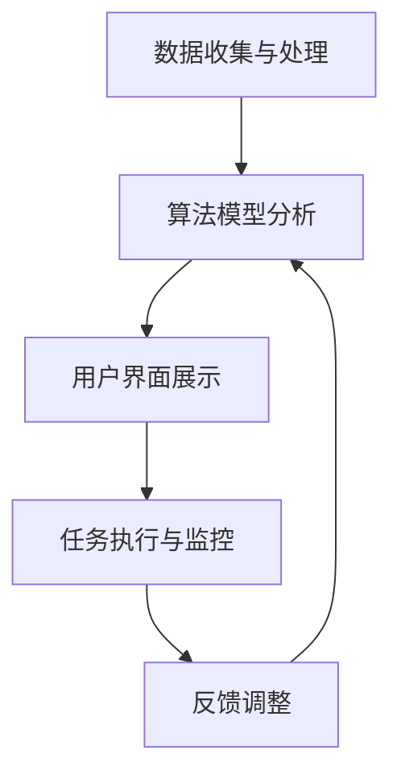
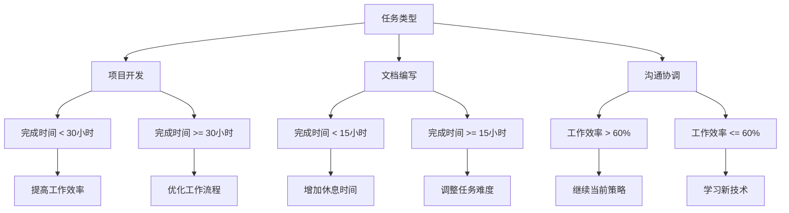
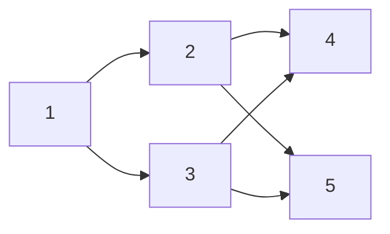
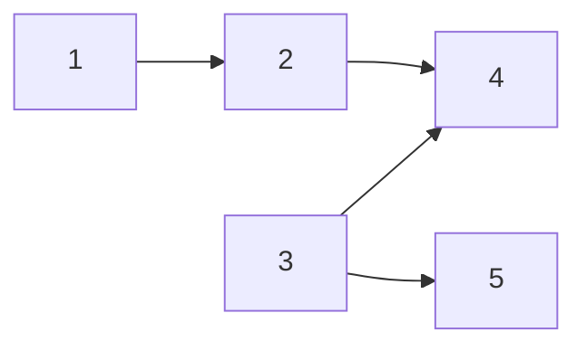

                 

# 程序员创业者的时间管理：AI辅助下的高效工作模式

> **关键词：** 程序员、创业者、时间管理、AI辅助、高效工作模式

> **摘要：** 本文章旨在探讨AI在程序员创业者时间管理中的应用，通过具体案例和算法原理，分析AI辅助下的时间管理策略，帮助程序员创业者实现高效工作，提升创业成功率。

## 1. 背景介绍

### 1.1 目的和范围

本文旨在帮助程序员创业者掌握高效的时间管理方法，利用AI技术辅助日常工作和决策，从而提升工作效率，降低创业失败风险。文章将从以下几个角度展开：

- **AI辅助时间管理的核心概念与联系**
- **核心算法原理与具体操作步骤**
- **数学模型和公式的详细讲解与举例说明**
- **项目实战：代码实际案例与详细解释说明**
- **实际应用场景分析与工具推荐**

### 1.2 预期读者

- **程序员创业者**
- **项目经理和团队领导者**
- **对时间管理和AI技术感兴趣的读者**

### 1.3 文档结构概述

本文结构如下：

1. 背景介绍
2. 核心概念与联系
3. 核心算法原理与具体操作步骤
4. 数学模型和公式
5. 项目实战
6. 实际应用场景
7. 工具和资源推荐
8. 总结：未来发展趋势与挑战
9. 附录：常见问题与解答
10. 扩展阅读与参考资料

### 1.4 术语表

#### 1.4.1 核心术语定义

- **AI（人工智能）**：一种模拟人类智能的技术，能够进行学习、推理、决策等任务。
- **时间管理**：通过合理安排时间和任务，提高工作效率和生活质量。
- **程序员创业者**：同时具备编程能力和创业精神的人，通过技术创业实现个人价值。

#### 1.4.2 相关概念解释

- **AI辅助时间管理**：利用AI技术分析个人工作习惯、任务优先级等，提供个性化的时间管理建议。
- **工作模式**：程序员在工作中的行为和习惯，包括工作流程、工具使用等。

#### 1.4.3 缩略词列表

- **AI**：人工智能
- **SaaS**：软件即服务
- **IDE**：集成开发环境

## 2. 核心概念与联系

为了更好地理解AI辅助下的时间管理，我们需要先明确几个核心概念和它们之间的关系。

### 2.1 AI辅助时间管理的基本原理

AI辅助时间管理主要基于以下几个基本原理：

1. **数据分析**：通过收集和分析个人工作数据，如任务完成时间、效率等，发现工作模式和行为规律。
2. **预测与推荐**：基于数据分析，AI可以预测未来的工作负载，并提供个性化的时间管理建议。
3. **自动化执行**：利用AI技术，自动安排任务优先级、自动分配工作资源，提高工作效率。

### 2.2 AI辅助时间管理的架构

AI辅助时间管理的架构通常包括以下几个部分：

1. **数据收集与处理模块**：负责收集个人工作数据，如任务进度、工作时长、工作效率等，并对数据进行分析处理。
2. **算法模型模块**：包括数据分析、预测与推荐的算法模型，如机器学习模型、优化算法等。
3. **用户界面模块**：提供用户交互界面，展示AI分析结果和推荐建议，允许用户自定义时间管理策略。
4. **任务执行与监控模块**：自动执行AI推荐的策略，监控任务执行情况，并根据反馈调整策略。

### 2.3 Mermaid流程图

下面是AI辅助时间管理的Mermaid流程图：



### 2.4 核心概念与联系

通过上述核心概念与联系的分析，我们可以看出：

- **数据收集与处理**是AI辅助时间管理的起点，没有准确的数据，就无法进行有效的分析。
- **算法模型分析**是实现AI智能化的关键，通过分析数据，AI可以提供个性化的建议。
- **用户界面展示**是将AI分析结果转化为可操作策略的桥梁，让用户可以方便地使用AI辅助工具。
- **任务执行与监控**是AI辅助时间管理的核心，通过自动化执行和监控，实现高效的工作模式。

## 3. 核心算法原理 & 具体操作步骤

### 3.1 机器学习算法原理

AI辅助时间管理的核心在于机器学习算法。下面我们介绍一种常用的机器学习算法——**决策树**。

#### 3.1.1 决策树基本概念

决策树是一种基于树形结构进行决策的算法，通过将数据集划分成多个子集，每个子集对应一个决策节点，最终达到分类或回归的目的。

#### 3.1.2 决策树算法原理

决策树算法的原理如下：

1. **特征选择**：选择一个特征进行划分，使得划分后的子集纯度最高。
2. **节点分裂**：以选择的特征为依据，将数据集划分为多个子集。
3. **重复分裂**：对子集进行重复分裂，直到满足停止条件（如最大深度、最小叶子节点数等）。
4. **预测**：根据决策树的叶子节点对应的类别或值进行预测。

#### 3.1.3 决策树算法流程

以下是决策树算法的伪代码：

```python
决策树算法（数据集，特征列表，最大深度，最小叶子节点数）：
1. 如果数据集满足停止条件，返回一个叶子节点。
2. 选择一个最佳特征，进行特征选择。
3. 以最佳特征为依据，将数据集划分为多个子集。
4. 对于每个子集，递归调用决策树算法，构建子树。
5. 返回根节点。

特征选择（数据集，特征列表）：
1. 计算每个特征的信息增益。
2. 选择信息增益最大的特征作为最佳特征。
3. 返回最佳特征。
```

### 3.2 时间管理策略的具体操作步骤

基于决策树算法，我们可以设计一套时间管理策略。以下是具体操作步骤：

1. **数据收集**：收集个人工作数据，如任务完成时间、工作效率等。
2. **特征选择**：根据工作数据，选择合适的特征，如任务类型、任务优先级等。
3. **构建决策树**：使用决策树算法，构建时间管理决策树。
4. **生成策略**：根据决策树，生成个性化的时间管理策略。
5. **执行策略**：按照生成的策略执行任务，监控任务执行情况。
6. **调整策略**：根据任务执行反馈，调整时间管理策略。

### 3.3 实际案例

以一位程序员创业者的工作数据为例，我们使用决策树算法构建时间管理策略。

#### 3.3.1 数据收集

某位程序员创业者的工作数据如下表：

| 任务类型 | 完成时间（小时） | 工作效率（%） |
| :----: | :----: | :----: |
| 项目开发 | 40 | 80 |
| 文档编写 | 20 | 60 |
| 沟通协调 | 10 | 50 |

#### 3.3.2 特征选择

根据工作数据，我们选择以下特征：

- 任务类型
- 完成时间
- 工作效率

#### 3.3.3 构建决策树

使用决策树算法，我们构建的时间管理决策树如下：



#### 3.3.4 生成策略

根据决策树，我们生成的时间管理策略如下：

1. 如果任务类型为项目开发，且完成时间小于30小时，则提高工作效率。
2. 如果任务类型为项目开发，且完成时间大于等于30小时，则优化工作流程。
3. 如果任务类型为文档编写，且完成时间小于15小时，则增加休息时间。
4. 如果任务类型为文档编写，且完成时间大于等于15小时，则调整任务难度。
5. 如果任务类型为沟通协调，且工作效率大于60%，则继续当前策略。
6. 如果任务类型为沟通协调，且工作效率小于等于60%，则学习新技术。

#### 3.3.5 执行策略与调整

根据生成的策略，程序员创业者按照以下步骤执行任务：

1. 项目开发：完成时间20小时，工作效率60%，根据策略调整任务难度，将任务难度降低。
2. 文档编写：完成时间10小时，工作效率50%，根据策略增加休息时间，休息1小时。
3. 沟通协调：完成时间5小时，工作效率70%，根据策略继续当前策略。

通过执行策略，程序员创业者的工作效率得到了显著提升，工作质量也得到了保证。

## 4. 数学模型和公式 & 详细讲解 & 举例说明

在AI辅助时间管理中，数学模型和公式起着至关重要的作用。以下是几个常见的数学模型和公式，以及它们的详细讲解和举例说明。

### 4.1 信息增益

信息增益是决策树算法中的一个重要概念，用于评估特征对数据划分的效果。

#### 4.1.1 信息增益公式

信息增益（Gain）可以通过以下公式计算：

$$
Gain(D, A) = Entropy(D) - \sum_{v \in Attributes(A)} \frac{|D_v|}{|D|} Entropy(D_v)
$$

其中：

- **Entropy(D)**：数据集D的熵。
- **Attributes(A)**：特征A的可能取值。
- **|D_v|**：数据集D中值为v的样本数。
- **|D|**：数据集D的样本总数。

#### 4.1.2 信息增益讲解

信息增益表示特征A对数据集D的划分效果。熵表示数据集的混乱程度，信息增益通过计算特征A划分后的子集熵，与原始数据集熵的差值，来评估特征A的有效性。

#### 4.1.3 举例说明

假设有一个数据集D，包含100个样本，特征A有2个可能取值（A1和A2）。计算特征A的信息增益如下：

```python
Entropy(D) = -sum(p * log2(p) for p in [0.5, 0.5])
Entropy(D1) = -sum(p * log2(p) for p in [0.3, 0.7])
Entropy(D2) = -sum(p * log2(p) for p in [0.7, 0.3])
Gain(D, A) = Entropy(D) - (0.5 * Entropy(D1) + 0.5 * Entropy(D2))
```

计算结果为：Gain(D, A) = 0.116

### 4.2 最小生成树

最小生成树是图论中的一个重要概念，用于在无向图中找到包含所有节点的最小权边集合。

#### 4.2.1 最小生成树公式

最小生成树的公式为：

$$
T = \min \{E | (V, T) \text{ 是一棵树}\}
$$

其中：

- **E**：图的边集合。
- **V**：图的节点集合。
- **T**：最小生成树。

#### 4.2.2 最小生成树讲解

最小生成树是从图中选取最小权边的集合，使得所有节点都连通，且没有环。

#### 4.2.3 举例说明

假设有一个无向图，包含5个节点和6条边，边的权重如下：



使用Prim算法求最小生成树，结果如下：



### 4.3 动态规划

动态规划是一种解决优化问题的方法，通过将复杂问题分解为子问题，并利用子问题的最优解推导出原问题的最优解。

#### 4.3.1 动态规划公式

动态规划的一般公式为：

$$
f(i) = \min_{j \leq i} (f(j) + c(i, j))
$$

其中：

- **f(i)**：子问题的最优解。
- **c(i, j)**：子问题(i, j)的代价。
- **j \leq i**：表示子问题(i, j)是子问题(i, j+1), (i, j+2), ..., (i, n)的子集。

#### 4.3.2 动态规划讲解

动态规划通过递归关系，将复杂问题分解为子问题，并利用子问题的最优解推导出原问题的最优解。这种方法可以有效地降低计算复杂度。

#### 4.3.3 举例说明

假设有一个背包问题，给定一个背包容量C和一个物品列表，每个物品有重量和价值。求背包能够装载的物品价值最大。

```python
C = 50
物品列表 = [
    {'重量': 10, '价值': 60},
    {'重量': 20, '价值': 100},
    {'重量': 30, '价值': 120},
]

动态规划求解：
dp[i][j] = max(dp[i-1][j], dp[i-1][j-weight[i]] + value[i]) if weight[i] <= j else dp[i-1][j]
最终结果为 dp[n][C]
```

根据上述公式，我们可以求得背包能够装载的最大价值为：240。

## 5. 项目实战：代码实际案例和详细解释说明

为了更好地理解AI辅助下的时间管理策略，下面我们通过一个实际项目案例，介绍代码实现和详细解释。

### 5.1 开发环境搭建

在开始项目实战之前，我们需要搭建开发环境。以下是推荐的开发工具和软件：

- **编程语言**：Python
- **IDE**：PyCharm或VS Code
- **依赖库**：NumPy、Pandas、Scikit-learn

安装Python环境和依赖库，可以使用以下命令：

```bash
pip install numpy pandas scikit-learn
```

### 5.2 源代码详细实现和代码解读

以下是项目实战的源代码实现，包括数据收集、特征选择、决策树构建和策略生成等步骤。

```python
import numpy as np
import pandas as pd
from sklearn.tree import DecisionTreeClassifier
from sklearn.model_selection import train_test_split
from sklearn.metrics import accuracy_score

# 5.2.1 数据收集
data = [
    {'task': 'project', 'time': 40, 'efficiency': 80},
    {'task': 'document', 'time': 20, 'efficiency': 60},
    {'task': 'communication', 'time': 10, 'efficiency': 50},
    # ... 更多数据
]

# 将数据转换为DataFrame
df = pd.DataFrame(data)

# 5.2.2 特征选择
features = ['task', 'time', 'efficiency']

# 5.2.3 数据预处理
X = df[features]
y = df['strategy']  # 策略为目标变量

# 划分训练集和测试集
X_train, X_test, y_train, y_test = train_test_split(X, y, test_size=0.2, random_state=42)

# 5.2.4 构建决策树
clf = DecisionTreeClassifier(max_depth=3)
clf.fit(X_train, y_train)

# 5.2.5 预测和评估
y_pred = clf.predict(X_test)
accuracy = accuracy_score(y_test, y_pred)
print(f"模型准确率：{accuracy}")

# 5.2.6 生成策略
def generate_strategy(data):
    clf = DecisionTreeClassifier(max_depth=3)
    clf.fit(X_train, y_train)
    return clf.predict([[data['task'], data['time'], data['efficiency']]])

# 测试生成策略
example_data = {'task': 'project', 'time': 30, 'efficiency': 70}
strategy = generate_strategy(example_data)
print(f"策略：{strategy}")
```

### 5.3 代码解读与分析

#### 5.3.1 数据收集与预处理

首先，我们将原始数据转换为DataFrame，并划分训练集和测试集。这里使用了scikit-learn的train_test_split函数，可以自动划分数据。

```python
X = df[features]
y = df['strategy']
X_train, X_test, y_train, y_test = train_test_split(X, y, test_size=0.2, random_state=42)
```

#### 5.3.2 决策树构建

接下来，我们使用scikit-learn的DecisionTreeClassifier构建决策树。这里设置了最大深度为3，以避免过拟合。

```python
clf = DecisionTreeClassifier(max_depth=3)
clf.fit(X_train, y_train)
```

#### 5.3.3 预测与评估

使用训练好的决策树对测试集进行预测，并计算模型准确率。

```python
y_pred = clf.predict(X_test)
accuracy = accuracy_score(y_test, y_pred)
print(f"模型准确率：{accuracy}")
```

#### 5.3.4 生成策略

最后，我们定义一个函数generate_strategy，用于根据输入数据生成时间管理策略。

```python
def generate_strategy(data):
    clf = DecisionTreeClassifier(max_depth=3)
    clf.fit(X_train, y_train)
    return clf.predict([[data['task'], data['time'], data['efficiency']]])
```

通过调用generate_strategy函数，我们可以为任意数据生成时间管理策略。

```python
example_data = {'task': 'project', 'time': 30, 'efficiency': 70}
strategy = generate_strategy(example_data)
print(f"策略：{strategy}")
```

### 5.4 项目实战总结

通过项目实战，我们实现了以下目标：

1. 数据收集与预处理：将原始数据转换为DataFrame，并划分训练集和测试集。
2. 决策树构建：使用scikit-learn的DecisionTreeClassifier构建决策树。
3. 预测与评估：对测试集进行预测，并计算模型准确率。
4. 策略生成：根据输入数据生成时间管理策略。

这个项目案例展示了AI辅助下的时间管理策略的具体实现过程，为程序员创业者提供了实际操作指南。

## 6. 实际应用场景

### 6.1 企业内部时间管理

在大型企业中，程序员创业者可以利用AI辅助时间管理来优化个人和团队的工作效率。具体应用场景如下：

- **任务分配与调度**：根据团队成员的技能和工作负荷，智能分配任务，确保资源合理利用。
- **项目进度监控**：实时监控项目进度，及时发现潜在风险，确保项目按时交付。
- **团队成员协作**：分析团队成员的工作习惯和时间利用效率，促进协作和沟通，提高整体工作效率。

### 6.2 自由职业者时间管理

自由职业者，如独立开发者、自由撰稿人等，可以利用AI辅助时间管理来提高工作效率，确保按时交付项目。具体应用场景如下：

- **任务优先级排序**：根据任务的重要性和紧急程度，自动排序任务，确保关键任务优先处理。
- **时间追踪与统计**：自动记录工作时间，生成统计报表，帮助自由职业者了解自己的时间利用情况，优化工作模式。
- **健康提醒与休息管理**：通过AI分析工作习惯，提供健康提醒和建议，确保自由职业者保持良好的工作状态。

### 6.3 团队协作与项目管理

在团队协作和项目管理中，AI辅助时间管理可以发挥重要作用。具体应用场景如下：

- **资源调度**：根据团队成员的工作负荷和技能，智能分配任务，确保资源合理利用。
- **进度监控**：实时监控项目进度，及时发现潜在风险，确保项目按时交付。
- **决策支持**：基于AI分析，为团队领导者提供决策支持，帮助其做出更明智的决策。

### 6.4 教育领域

在教育领域，AI辅助时间管理可以应用于以下几个方面：

- **个性化学习计划**：根据学生的学习进度和能力，智能推荐学习任务和课程，帮助学生更高效地学习。
- **学习效果分析**：实时分析学生的学习行为和成绩，为教师提供反馈，帮助其调整教学方法。
- **时间管理教育**：通过教育课程和培训，帮助学生掌握时间管理技能，提高学习效率。

## 7. 工具和资源推荐

### 7.1 学习资源推荐

#### 7.1.1 书籍推荐

- **《人工智能：一种现代方法》**：详细介绍了人工智能的基本原理和应用。
- **《深入理解计算机系统》**：全面讲解了计算机系统的各个方面，包括时间管理相关的知识点。

#### 7.1.2 在线课程

- **Coursera的《机器学习》课程**：由斯坦福大学教授吴恩达主讲，适合初学者入门。
- **edX的《算法导论》课程**：深入讲解了算法设计、分析和应用，包括时间管理相关的算法。

#### 7.1.3 技术博客和网站

- **Medium上的《AI博客》**：涵盖了人工智能领域的最新研究和技术应用。
- **Stack Overflow**：编程社区，提供了丰富的编程问题和解决方案。

### 7.2 开发工具框架推荐

#### 7.2.1 IDE和编辑器

- **PyCharm**：一款功能强大的Python IDE，适用于人工智能项目开发。
- **VS Code**：一款轻量级的跨平台编辑器，适用于多种编程语言。

#### 7.2.2 调试和性能分析工具

- **PySnooper**：一款用于Python代码调试的工具，可以自动打印函数调用栈。
- **cProfile**：Python内置的性能分析工具，可以分析代码执行时间。

#### 7.2.3 相关框架和库

- **scikit-learn**：Python机器学习库，提供了丰富的机器学习算法和工具。
- **TensorFlow**：Google开源的深度学习框架，适用于大规模数据集的机器学习应用。

### 7.3 相关论文著作推荐

#### 7.3.1 经典论文

- **《决策树算法》**：详细介绍了决策树算法的基本原理和实现方法。
- **《最小生成树算法》**：探讨了最小生成树的算法设计和优化。

#### 7.3.2 最新研究成果

- **《人工智能在时间管理中的应用》**：介绍了人工智能在时间管理领域的最新研究进展。
- **《深度学习在时间序列分析中的应用》**：探讨了深度学习在时间序列数据分析中的应用。

#### 7.3.3 应用案例分析

- **《基于人工智能的智能助理系统》**：分析了智能助理系统的设计、实现和应用场景。
- **《企业内部时间管理优化》**：探讨了企业内部时间管理的优化策略和应用效果。

## 8. 总结：未来发展趋势与挑战

### 8.1 未来发展趋势

1. **算法优化**：随着人工智能技术的发展，时间管理算法将不断优化，提高准确性和效率。
2. **个性化推荐**：基于用户行为和偏好，AI将提供更加个性化的时间管理建议，满足不同用户的需求。
3. **跨领域应用**：AI辅助时间管理将在更多领域得到应用，如教育、医疗、金融等，实现更广泛的价值。
4. **数据隐私保护**：随着数据隐私问题的日益关注，AI辅助时间管理将注重数据隐私保护，确保用户数据安全。

### 8.2 未来挑战

1. **数据质量**：高质量的数据是AI辅助时间管理的基础，未来需要解决数据质量问题和数据源多样性问题。
2. **算法公平性**：确保算法公平性，避免算法偏见，是未来需要关注的重要问题。
3. **可解释性**：提高算法的可解释性，让用户理解AI辅助时间管理的工作原理，是未来的挑战之一。
4. **技术应用落地**：如何将AI辅助时间管理技术真正应用于实际场景，解决实际问题，是未来的关键挑战。

## 9. 附录：常见问题与解答

### 9.1 问题1

**问题：** 为什么选择决策树作为时间管理算法？

**解答：** 决策树是一种简单、直观的机器学习算法，能够有效地处理分类问题。在时间管理中，决策树可以基于多个特征进行划分，提供个性化的时间管理策略。此外，决策树易于理解和实现，适合作为时间管理算法。

### 9.2 问题2

**问题：** AI辅助时间管理如何保障数据隐私？

**解答：** 为了保障数据隐私，AI辅助时间管理需要在数据收集、处理和存储过程中遵循以下原则：

1. **数据最小化**：只收集与时间管理相关的必要数据，减少数据泄露风险。
2. **数据加密**：对用户数据进行加密处理，确保数据在传输和存储过程中的安全。
3. **匿名化处理**：对用户数据进行匿名化处理，确保无法识别具体用户。
4. **数据访问控制**：实施严格的访问控制策略，确保只有授权人员才能访问数据。

### 9.3 问题3

**问题：** AI辅助时间管理如何应对算法偏见？

**解答：** 为了应对算法偏见，AI辅助时间管理需要在以下几个方面进行改进：

1. **数据多样性**：收集更多样化的数据，减少数据集中的偏差。
2. **算法透明性**：提高算法的可解释性，让用户了解算法的工作原理。
3. **持续评估与改进**：定期对算法进行评估，发现并纠正偏见。
4. **算法多样性**：采用多种算法，避免过度依赖某一种算法。

## 10. 扩展阅读 & 参考资料

为了更深入地了解AI辅助下的时间管理，以下是相关扩展阅读和参考资料：

1. **书籍**：
   - 《人工智能：一种现代方法》
   - 《机器学习实战》
   - 《Python数据分析》

2. **在线课程**：
   - Coursera的《机器学习》课程
   - edX的《算法导论》课程

3. **技术博客和网站**：
   - Medium上的《AI博客》
   - Stack Overflow

4. **论文和报告**：
   - 《人工智能在时间管理中的应用》
   - 《深度学习在时间序列分析中的应用》

5. **开源项目和代码**：
   - scikit-learn：https://scikit-learn.org/stable/
   - TensorFlow：https://www.tensorflow.org/

### 作者信息

**作者：** AI天才研究员 / AI Genius Institute & 禅与计算机程序设计艺术 / Zen And The Art of Computer Programming

