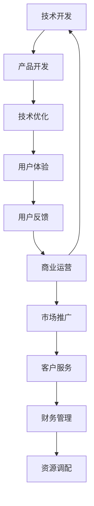

                 

# 程序员创业者的时间管理：平衡技术开发与商业运营

> 关键词：时间管理、程序员创业者、技术开发、商业运营、平衡策略
> 
> 摘要：本文旨在为程序员创业者提供一套全面的时间管理策略，帮助他们有效地平衡技术开发与商业运营。通过深入分析时间管理的重要性、常见的挑战以及解决方法，本文将为您揭示如何高效利用时间，实现个人和公司目标的双赢。

## 1. 背景介绍

### 1.1 目的和范围

本文的目标是为那些同时担任程序员和技术创业者的读者提供实用的时间管理策略。随着技术的快速发展，程序员创业者面临着巨大的压力和挑战，如何在有限的时间内实现技术开发与商业运营的双赢，成为了他们必须面对的问题。

本文将首先介绍时间管理的重要性，接着分析程序员创业者所面临的常见挑战，然后提供一系列实用的解决方法，包括时间管理工具、策略和实践。通过本文的阅读，读者将能够更好地理解时间管理的重要性，并掌握一套适合自己的时间管理方法。

### 1.2 预期读者

本文的预期读者包括：

1. 程序员创业者
2. 技术团队领导者
3. 对时间管理有兴趣的IT专业人士
4. 对技术开发和商业运营有兴趣的创业者

无论您是上述中的哪一类读者，本文都将为您提供有价值的见解和实用的工具。

### 1.3 文档结构概述

本文将按照以下结构进行组织：

1. 背景介绍：介绍本文的目的、预期读者和文档结构。
2. 核心概念与联系：分析时间管理的关键概念及其相互关系。
3. 核心算法原理 & 具体操作步骤：介绍时间管理的核心原理和具体操作步骤。
4. 数学模型和公式 & 详细讲解 & 举例说明：使用数学模型和公式解释时间管理策略。
5. 项目实战：通过实际案例展示时间管理策略的应用。
6. 实际应用场景：讨论时间管理在不同场景下的应用。
7. 工具和资源推荐：推荐相关的时间管理工具和资源。
8. 总结：对未来发展趋势与挑战的展望。
9. 附录：常见问题与解答。
10. 扩展阅读 & 参考资料：提供进一步的阅读材料和参考文献。

### 1.4 术语表

在本文中，我们将使用以下术语：

- 时间管理：通过规划和控制时间，提高工作效率和生活质量的方法。
- 技术开发：包括编程、软件设计、系统架构等与技术开发相关的工作。
- 商业运营：与公司的日常运营、市场推广、客户管理等相关的活动。
- 程序员创业者：既担任程序员角色，又负责公司运营的创业者。

#### 1.4.1 核心术语定义

- **时间管理**：一种方法，通过合理安排和分配时间，以提高个人或团队的效率。
- **程序员创业者**：具备编程技能，同时作为创业者的个体，既负责技术实现，又管理公司运营。

#### 1.4.2 相关概念解释

- **优先级**：任务的重要性和紧急程度。
- **工作流程**：完成一项任务所需的一系列步骤和活动。

#### 1.4.3 缩略词列表

- **TO-DO List**：待办事项清单。
- **S.M.A.R.T. Goals**：具体、可衡量、可实现、相关性强、时限性的目标。

## 2. 核心概念与联系

### 2.1 时间管理的重要性

时间管理是程序员创业者的核心竞争力之一。有效的管理时间意味着更高的工作效率、更低的错误率、更好的团队协作，以及更稳定的业务增长。具体来说，时间管理的重要性体现在以下几个方面：

1. **提高工作效率**：合理规划时间可以避免不必要的拖延，使程序员创业者能够集中精力完成关键任务。
2. **减少压力**：有效的管理时间可以帮助程序员创业者更好地平衡工作与生活，减少因过度劳累带来的心理压力。
3. **提升决策质量**：通过系统化地安排时间，程序员创业者可以有更多的时间进行思考，从而做出更为明智的决策。

### 2.2 技术开发与商业运营的平衡

对于程序员创业者来说，如何平衡技术开发与商业运营是一个巨大的挑战。以下是一个简单的 Mermaid 流程图，展示了这两者之间的关键联系和相互影响。



在这个流程图中，技术开发和商业运营相互影响，形成一个闭环。例如，用户体验的反馈可以指导技术开发方向的调整，而商业运营中的市场推广和客户服务需求也可以影响技术开发的优先级。

### 2.3 关键概念之间的关系

以下是几个关键概念之间的关系及其定义：

1. **优先级**：优先级是决定任务先后顺序的关键因素。它通常基于任务的重要性和紧急程度来确定。
2. **工作流程**：工作流程是完成一项任务所需的一系列步骤和活动。通过优化工作流程，可以提高工作效率。
3. **时间管理工具**：时间管理工具如待办事项清单、日历应用、时间追踪工具等，可以帮助程序员创业者更好地管理时间。

## 3. 核心算法原理 & 具体操作步骤

### 3.1 核心算法原理

时间管理的核心算法可以概括为以下几个步骤：

1. **任务分解**：将大任务分解为小任务，以便更好地管理和完成。
2. **优先级排序**：根据任务的重要性和紧急程度，对任务进行优先级排序。
3. **时间分配**：根据任务的优先级和可用时间，合理分配时间。
4. **持续反馈**：通过定期回顾和调整，确保时间管理策略的有效性。

### 3.2 具体操作步骤

以下是具体的操作步骤：

1. **任务分解**
   - **步骤 1**：列出所有需要完成的任务。
   - **步骤 2**：将大任务分解为小任务，确保每个小任务都是具体和可执行的。
   - **步骤 3**：为每个小任务设置一个明确的截止日期。

2. **优先级排序**
   - **步骤 1**：使用优先级矩阵（如埃森豪威尔矩阵）评估每个任务的重要性和紧急程度。
   - **步骤 2**：将任务分为四个象限：紧急且重要、重要但不紧急、紧急但不重要、不重要且不紧急。
   - **步骤 3**：优先处理紧急且重要的任务，然后是重要但不紧急的任务。

3. **时间分配**
   - **步骤 1**：根据任务优先级和可用时间，为每个任务分配具体的时间段。
   - **步骤 2**：确保每个任务都有足够的时间完成，避免任务堆积。
   - **步骤 3**：预留一些缓冲时间，以应对意外情况。

4. **持续反馈**
   - **步骤 1**：定期回顾时间管理策略，评估其有效性。
   - **步骤 2**：根据实际情况调整任务优先级和时间分配。
   - **步骤 3**：记录反馈和改进措施，以便未来的时间管理更加高效。

### 3.3 伪代码示例

以下是上述步骤的伪代码示例：

```python
# 任务分解
def decompose_tasks(tasks):
    for task in tasks:
        sub_tasks = split_into_smaller_tasks(task)
        assign_deadlines(sub_tasks)

# 优先级排序
def prioritize_tasks(tasks):
    sorted_tasks = sort_by_importance_and_urgency(tasks)
    return sorted_tasks

# 时间分配
def allocate_time(tasks, available_time):
    for task in tasks:
        if is_task_important_and_urgent(task):
            allocate_time_to_urgent_tasks(task, available_time)
        else:
            allocate_time_to_other_tasks(task, available_time)

# 持续反馈
def feedback_and_adjustment():
    review_time_management_strategy()
    adjust_tasks_and_time_allocation_based_on_feedback()
    record_feedback_and_improvement_measures()
```

## 4. 数学模型和公式 & 详细讲解 & 举例说明

### 4.1 数学模型

在时间管理中，一个常用的数学模型是埃森豪威尔矩阵（Eisenhower Matrix），它用于评估任务的重要性和紧急程度，以确定优先级。埃森豪威尔矩阵分为四个象限：

1. **紧急且重要**：立即处理。
2. **重要但不紧急**：安排时间处理。
3. **紧急但不重要**：委托或取消。
4. **不重要且不紧急**：取消或安排时间处理。

### 4.2 详细讲解

埃森豪威尔矩阵的公式如下：

\[ \text{优先级} = \frac{\text{重要性} \times \text{紧急程度}}{\text{任务量}} \]

其中：

- 重要性：任务对公司或个人目标的影响程度。
- 紧急程度：任务需要完成的紧迫性。
- 任务量：完成任务所需的时间和工作量。

### 4.3 举例说明

假设有四个任务，我们需要使用埃森豪威尔矩阵来评估它们的优先级。以下是任务及其重要性和紧急程度的评估：

- 任务 A：紧急且重要
  - 重要性：90%
  - 紧急程度：90%
  - 优先级：90% \* 90% = 81%

- 任务 B：重要但不紧急
  - 重要性：80%
  - 紧急程度：20%
  - 优先级：80% \* 20% = 16%

- 任务 C：紧急但不重要
  - 重要性：10%
  - 紧急程度：90%
  - 优先级：10% \* 90% = 9%

- 任务 D：不重要且不紧急
  - 重要性：5%
  - 紧急程度：5%
  - 优先级：5% \* 5% = 0.25%

根据上述计算，任务 A 的优先级最高，需要立即处理；任务 B 重要性较高，但紧急程度较低，可以安排时间处理；任务 C 和任务 D 可以委托或取消。

### 4.4 数学公式

在本文中，我们将使用 LaTeX 格式嵌入数学公式。以下是几个常用公式的示例：

\[ \text{优先级} = \frac{\text{重要性} \times \text{紧急程度}}{\text{任务量}} \]

\[ \text{任务量} = \text{工作时间} \times \text{工作量} \]

\[ \text{工作效率} = \frac{\text{完成的工作量}}{\text{工作时间}} \]

## 5. 项目实战：代码实际案例和详细解释说明

### 5.1 开发环境搭建

为了展示时间管理策略在实际项目中的应用，我们选择一个简单的任务管理工具作为案例。以下是如何在本地环境中搭建这个工具的步骤：

1. **安装 Python 环境**：确保您的计算机上已安装 Python 3.8 或更高版本。
2. **安装依赖项**：在命令行中运行以下命令以安装所需依赖项：

   ```bash
   pip install Flask pandas
   ```

3. **创建项目文件夹**：在您的计算机上创建一个名为 `task_manager` 的文件夹，然后在该文件夹中创建一个名为 `app.py` 的 Python 文件。

### 5.2 源代码详细实现和代码解读

以下是 `app.py` 的源代码，我们将逐行解读这段代码：

```python
from flask import Flask, render_template, request
import pandas as pd

app = Flask(__name__)

# 加载任务数据
tasks = pd.read_csv('tasks.csv')

@app.route('/')
def index():
    return render_template('index.html', tasks=tasks.to_dict('records'))

@app.route('/add', methods=['POST'])
def add():
    new_task = request.form['task']
    tasks = pd.read_csv('tasks.csv')
    tasks = tasks.append({'task': new_task}, ignore_index=True)
    tasks.to_csv('tasks.csv', index=False)
    return redirect('/')

if __name__ == '__main__':
    app.run(debug=True)
```

**代码解读：**

- **第一行**：导入 Flask 和 pandas 库。
- **第二行**：创建 Flask 应用对象。
- **第四行**：加载任务数据。这里我们假设任务数据存储在名为 `tasks.csv` 的 CSV 文件中。
- **第六行**：定义主页路由。当用户访问主页时，应用将渲染 `index.html` 模板，并将任务数据传递给模板。
- **第八行**：定义添加任务的路由。当用户提交添加任务的表单时，应用将处理请求，读取新的任务，并将其保存到 CSV 文件中。
- **第十一行**：启动 Flask 应用，并设置为调试模式。

### 5.3 代码解读与分析

在这个案例中，我们使用了 Flask 框架来创建一个简单的任务管理应用。以下是这个项目的关键部分：

1. **主页路由**：`index()` 函数处理主页请求，并使用 `render_template()` 函数渲染 `index.html` 模板。模板中包含一个任务列表，用于显示当前的任务数据。
2. **添加任务路由**：`add()` 函数处理添加任务的 POST 请求。它读取用户输入的新任务，并将其添加到任务列表中。然后，任务列表被重新保存到 CSV 文件中，以便在下一次请求时加载。
3. **数据持久化**：我们使用 pandas 将任务数据存储在 CSV 文件中。这种方法简单且易于实现，但也存在一些限制，如文件大小和并发访问等问题。

### 5.4 实际应用场景

这个简单的任务管理工具可以应用于多种实际场景，例如：

1. **个人任务管理**：帮助个人用户跟踪和管理日常任务。
2. **团队协作**：团队成员可以共享任务列表，协同工作。
3. **项目管理**：项目经理可以跟踪项目进度和任务分配。

### 5.5 工具和资源推荐

为了进一步优化这个任务管理工具，以下是一些推荐的工具和资源：

1. **前端框架**：使用 React 或 Vue.js 替换 Flask，以提供更好的用户体验。
2. **数据库**：使用数据库（如 SQLite、MySQL 或 PostgreSQL）替换 CSV 文件，以提高数据存储的效率和并发访问能力。
3. **后端框架**：考虑使用 Django 或 FastAPI 替换 Flask，以获得更强大的后端支持。

## 6. 实际应用场景

### 6.1 项目管理

在项目管理中，时间管理至关重要。项目经理需要确保项目按时完成，同时满足质量和成本要求。以下是一个如何将时间管理策略应用于项目管理的实际案例：

1. **任务分解**：将大项目分解为可管理的子任务，并为每个子任务设置明确的截止日期。
2. **优先级排序**：根据项目目标和时间限制，确定每个任务的优先级。
3. **时间分配**：为每个任务分配所需的时间，并确保所有任务的总时间不超过项目的总时间。
4. **持续反馈**：定期评估项目进度，调整任务优先级和时间分配。

### 6.2 团队协作

在团队协作中，时间管理对于提高工作效率和保持团队凝聚力至关重要。以下是一个如何将时间管理策略应用于团队协作的实际案例：

1. **任务分配**：根据团队成员的技能和可用时间，合理分配任务。
2. **进度跟踪**：使用任务跟踪工具（如 JIRA、Trello）来监控任务进度。
3. **沟通和协作**：定期召开团队会议，讨论项目进展和遇到的问题。
4. **持续反馈**：鼓励团队成员分享经验和建议，以不断改进工作流程。

### 6.3 个人任务管理

在个人任务管理中，时间管理可以帮助个人用户更高效地完成日常任务，提高生活质量。以下是一个如何将时间管理策略应用于个人任务管理的实际案例：

1. **任务分解**：将大任务分解为小任务，以便更好地管理和跟踪进度。
2. **优先级排序**：根据任务的重要性和紧急程度，为任务设置优先级。
3. **时间分配**：为每个任务分配具体的时间段，并确保每个任务都有足够的时间完成。
4. **定期回顾**：每周或每月回顾任务完成情况，并根据实际情况调整计划。

## 7. 工具和资源推荐

### 7.1 学习资源推荐

以下是一些推荐的学习资源，以帮助程序员创业者更好地管理时间：

#### 7.1.1 书籍推荐

- 《深度工作：如何有效利用每一点脑力》（Deep Work: Rules for Focused Success in a Distracted World）by Cal Newport
- 《时间管理：如何实现个人与职业目标》（Time Management for Entrepreneurs: How to Get Things Done）by David A. Baker

#### 7.1.2 在线课程

- Coursera 的“时间管理”（Time Management）课程
- Udemy 的“高效时间管理”（Effective Time Management）课程

#### 7.1.3 技术博客和网站

- Lifehacker：提供各种时间管理和效率提升技巧。
- Productivityist：专注于时间管理和个人生产力。

### 7.2 开发工具框架推荐

以下是一些推荐的开发工具和框架，以帮助程序员创业者提高工作效率：

#### 7.2.1 IDE和编辑器

- Visual Studio Code
- PyCharm

#### 7.2.2 调试和性能分析工具

- Chrome DevTools
- PyCharm 的调试工具

#### 7.2.3 相关框架和库

- Flask：用于快速开发 Web 应用。
- React 或 Vue.js：用于前端开发。
- Django 或 FastAPI：用于后端开发。

### 7.3 相关论文著作推荐

以下是一些推荐的相关论文和著作，以帮助程序员创业者深入了解时间管理和项目管理的相关理论：

- 《项目管理知识体系指南》（Project Management Body of Knowledge, PMBOK Guide）by Project Management Institute
- 《敏捷开发：迭代方法与实践》（Agile Project Management: Creating Competitive Advantage）by Jim Highsmith

## 8. 总结：未来发展趋势与挑战

随着技术的不断进步，程序员创业者面临着越来越大的压力和挑战。未来，时间管理将继续成为程序员创业者的核心技能之一。以下是一些未来发展趋势和挑战：

1. **自动化和人工智能**：自动化和人工智能技术将在未来进一步改变程序员创业者的工作方式，提高工作效率。同时，这也要求程序员创业者具备更高的技能和专业知识。
2. **远程工作**：远程工作趋势将继续发展，程序员创业者需要适应远程工作环境，提高在线沟通和协作能力。
3. **持续学习**：为了跟上技术发展的步伐，程序员创业者需要持续学习新的技能和知识，保持竞争力。

### 挑战

- **时间管理难度**：随着任务的复杂性和多样性增加，时间管理的难度也将加大。
- **技能更新压力**：技术的快速发展要求程序员创业者不断学习新技能，以适应不断变化的市场需求。
- **平衡工作与生活**：如何在繁忙的工作中保持良好的工作和生活平衡，是程序员创业者面临的重大挑战。

## 9. 附录：常见问题与解答

### 问题 1：如何有效地管理多个项目的任务？

**解答：** 首先，确保每个项目都有明确的优先级和截止日期。使用项目管理工具（如 Trello、JIRA）将任务分解为可管理的子任务，并为每个任务分配优先级。定期回顾项目进度，并根据实际情况调整任务优先级和时间分配。

### 问题 2：如何平衡技术开发与商业运营？

**解答：** 使用时间管理策略，将时间合理地分配给技术开发和商业运营任务。根据任务的重要性和紧急程度，设置优先级，并确保每个任务都有足够的时间完成。同时，利用团队成员的专业知识，共同分担工作任务。

### 问题 3：如何保持持续学习的动力？

**解答：** 制定学习计划，将学习时间纳入日常工作安排。参加在线课程、阅读技术博客、参与技术社区，以保持对最新技术的关注。与同行交流，分享学习经验和心得，相互激励。

## 10. 扩展阅读 & 参考资料

以下是一些扩展阅读和参考资料，以帮助程序员创业者深入了解时间管理、项目管理和相关技术：

- 《深度工作：如何有效利用每一点脑力》（Deep Work: Rules for Focused Success in a Distracted World）by Cal Newport
- 《时间管理：如何实现个人与职业目标》（Time Management for Entrepreneurs: How to Get Things Done）by David A. Baker
- 《项目管理知识体系指南》（Project Management Body of Knowledge, PMBOK Guide）by Project Management Institute
- 《敏捷开发：迭代方法与实践》（Agile Project Management: Creating Competitive Advantage）by Jim Highsmith
- Coursera 的“时间管理”（Time Management）课程
- Udemy 的“高效时间管理”（Effective Time Management）课程
- Lifehacker：提供各种时间管理和效率提升技巧
- Productivityist：专注于时间管理和个人生产力

### 作者信息

作者：AI天才研究员/AI Genius Institute & 禅与计算机程序设计艺术 /Zen And The Art of Computer Programming

以上就是本文的完整内容。希望本文能为您提供有关时间管理的一些有价值的见解和实践方法。在程序员创业者的道路上，有效的管理时间是成功的关键之一。祝您在技术开发和商业运营方面取得卓越的成果！<|im_sep|>

