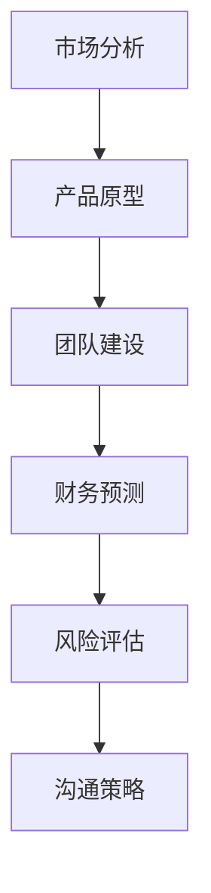

                 

# 程序员创业者的融资路演：制作打动投资人的商业计划书技巧

> **关键词：** 程序员创业、融资路演、商业计划书、投资人、技巧、市场分析、产品原型、团队建设、财务预测、风险评估、沟通策略。
> 
> **摘要：** 本文旨在为程序员创业者提供一整套制作和展示打动投资人的商业计划书的实战技巧。文章将从市场分析、产品原型、团队建设、财务预测、风险评估、沟通策略等多个方面展开，并结合具体案例，逐步解析每一个关键环节，帮助创业者提高融资成功率。

## 1. 背景介绍

### 1.1 目的和范围

本文的目的在于为程序员创业者提供一套全面而实用的融资路演指南，帮助他们在制作商业计划书时能够更加精准地吸引投资人的关注，提高融资成功率。文章将涵盖从市场分析到财务预测，从团队建设到沟通策略的多个关键环节，并提供具体操作步骤和案例分析。

### 1.2 预期读者

本文适用于有志于创业的程序员，特别是那些已经进入初步阶段，准备寻求外部投资以推动项目发展的创业者。同时，对于那些需要制作和优化商业计划书的团队和管理者，本文也提供了有价值的参考。

### 1.3 文档结构概述

本文将分为以下几个部分：

1. 背景介绍：介绍文章的目的、预期读者和文档结构。
2. 核心概念与联系：阐述商业计划书的核心概念及其相互关系。
3. 核心算法原理 & 具体操作步骤：讲解制作商业计划书的具体步骤。
4. 数学模型和公式 & 详细讲解 & 举例说明：介绍用于分析市场的数学模型。
5. 项目实战：通过实际案例展示商业计划书的制作和应用。
6. 实际应用场景：讨论商业计划书在不同阶段的应用。
7. 工具和资源推荐：推荐相关书籍、在线课程、开发工具和论文。
8. 总结：对全文进行总结，展望未来发展趋势与挑战。
9. 附录：常见问题与解答。
10. 扩展阅读 & 参考资料：提供进一步阅读的建议。

### 1.4 术语表

#### 1.4.1 核心术语定义

- **商业计划书**：详细描述公司业务模式、市场策略、财务预测等信息的文档。
- **投资人**：提供资金以支持企业发展的个人或机构。
- **市场分析**：研究目标市场的规模、增长潜力、竞争对手等。
- **产品原型**：产品的早期版本，用于验证产品概念和功能。
- **风险评估**：分析项目可能面临的各种风险，并制定应对策略。
- **融资路演**：创业者向投资人展示项目，争取投资的过程。

#### 1.4.2 相关概念解释

- **市场定位**：明确产品在市场中的位置，包括目标用户、产品特点和竞争优势。
- **财务预测**：预测公司的收入、支出、利润等财务状况。
- **团队建设**：组建具备专业技能和合作精神的团队。
- **沟通策略**：如何在路演过程中有效地传达项目价值。

#### 1.4.3 缩略词列表

- **VC**：风险投资（Venture Capital）
- **IPO**：首次公开募股（Initial Public Offering）
- **ROI**：投资回报率（Return on Investment）
- **SWOT**：优势、劣势、机会和威胁分析（Strengths, Weaknesses, Opportunities, Threats）

## 2. 核心概念与联系

商业计划书的成功与否，取决于其对核心概念之间联系的准确理解和有效表达。以下是商业计划书中的几个核心概念及其相互关系：

### 2.1 市场分析

市场分析是商业计划书的基础，它帮助创业者了解目标市场的现状和潜力。这包括：

- **市场细分**：将市场划分为具有相似需求的群体。
- **市场规模**：评估目标市场的总体规模和增长潜力。
- **竞争分析**：识别主要竞争对手及其市场份额。

市场分析的目的是为了确定产品或服务的市场定位和目标用户。

### 2.2 产品原型

产品原型是验证产品概念和功能的重要手段。这包括：

- **产品愿景**：明确产品的长期目标和愿景。
- **功能定义**：定义产品的核心功能和特性。
- **用户界面**：设计直观易用的用户界面。

产品原型有助于向投资人展示产品的实际效果和用户体验。

### 2.3 团队建设

团队建设是商业计划书的重要组成部分，它体现了创业者的领导力和执行力。这包括：

- **核心团队成员**：介绍团队成员的背景和技能。
- **组织结构**：说明团队的组织结构和分工。
- **团队文化**：描述团队的价值观和工作氛围。

一个高效的团队是项目成功的关键因素。

### 2.4 财务预测

财务预测是商业计划书的核心，它反映了公司的财务状况和盈利能力。这包括：

- **收入预测**：预测公司的收入来源和增长趋势。
- **支出预算**：预测公司的运营成本和支出。
- **现金流量表**：预测公司的现金流入和流出。

财务预测有助于投资人评估项目的盈利前景。

### 2.5 风险评估

风险评估是商业计划书中不可或缺的一部分，它帮助创业者识别和应对潜在风险。这包括：

- **市场风险**：评估市场需求和竞争环境的变化。
- **技术风险**：评估产品技术实现的可行性和稳定性。
- **运营风险**：评估公司运营过程中的各种风险。

有效的风险评估有助于降低投资风险。

### 2.6 沟通策略

沟通策略是路演过程中至关重要的环节，它决定了创业者能否成功吸引投资人的兴趣。这包括：

- **演讲技巧**：掌握有效的演讲技巧，清晰传达项目价值。
- **展示技巧**：利用幻灯片和其他展示工具，生动展示项目亮点。
- **互动技巧**：积极与投资人互动，解答疑问，建立信任。

一个良好的沟通策略有助于提高融资成功率。

### 2.7 Mermaid 流程图

为了更好地理解上述核心概念之间的联系，我们可以使用 Mermaid 流程图来展示它们之间的关系：



这个流程图展示了商业计划书中各个核心概念之间的逻辑关系，有助于创业者系统地思考和规划。

## 3. 核心算法原理 & 具体操作步骤

### 3.1 制作市场分析部分

市场分析是商业计划书的核心，以下是一系列步骤用于制作市场分析部分：

#### 3.1.1 收集市场数据

1. **市场调研**：通过问卷调查、访谈、数据分析等方式，收集目标市场的相关信息。
2. **行业报告**：阅读和分析相关的行业报告，了解市场规模、增长趋势、市场份额等。
3. **竞争对手分析**：识别主要竞争对手，分析他们的优势和劣势。

#### 3.1.2 进行市场细分

1. **用户需求分析**：根据用户的需求和偏好，将市场划分为不同的细分市场。
2. **市场规模评估**：对每个细分市场进行规模评估，确定目标市场的规模和增长潜力。

#### 3.1.3 制定市场定位

1. **目标用户定位**：明确目标用户群体，包括他们的特点、需求和痛点。
2. **产品定位**：根据目标用户的需求，确定产品的特点和价值主张。

### 3.2 制作产品原型部分

产品原型是验证产品概念和功能的重要手段，以下是具体操作步骤：

#### 3.2.1 明确产品愿景

1. **产品愿景**：明确产品的长期目标和愿景，确保团队的目标一致。
2. **产品路线图**：制定产品的发展路线图，规划短期和长期的产品迭代。

#### 3.2.2 功能定义

1. **功能列表**：列出产品的核心功能，确保每个功能都有明确的定义和实现计划。
2. **用户故事**：使用用户故事来描述产品的功能和使用场景。

#### 3.2.3 用户界面设计

1. **UI/UX 设计**：设计直观易用的用户界面，确保用户体验。
2. **原型制作**：使用工具（如 Sketch、Figma 等）制作产品原型，进行初步测试。

### 3.3 制作团队建设部分

团队建设是商业计划书的重要组成部分，以下是具体操作步骤：

#### 3.3.1 核心团队成员介绍

1. **团队成员背景**：介绍核心团队成员的背景和技能，确保他们的能力和项目需求匹配。
2. **团队角色分工**：明确每个成员的角色和责任，确保团队高效运作。

#### 3.3.2 组织结构

1. **组织结构图**：绘制组织结构图，展示团队成员之间的关系和汇报关系。
2. **团队文化**：描述团队的价值观和工作氛围，确保团队成员有共同的目标和愿景。

### 3.4 制作财务预测部分

财务预测是商业计划书的核心，以下是具体操作步骤：

#### 3.4.1 收入预测

1. **收入来源**：明确公司的收入来源，包括产品销售、服务收费等。
2. **收入增长趋势**：预测公司的收入增长趋势，考虑市场环境、竞争情况等。

#### 3.4.2 支出预算

1. **运营成本**：列出公司的运营成本，包括人力成本、物料成本、营销费用等。
2. **支出优化**：考虑如何优化支出，提高运营效率。

#### 3.4.3 现金流量表

1. **现金流入**：预测公司的现金流入，包括收入、投资回报等。
2. **现金流出**：预测公司的现金流出，包括运营成本、投资支出等。

### 3.5 制作风险评估部分

风险评估是商业计划书的重要组成部分，以下是具体操作步骤：

#### 3.5.1 识别风险

1. **市场风险**：分析市场需求和竞争环境的变化，识别潜在的市场风险。
2. **技术风险**：分析产品技术实现的可行性和稳定性，识别潜在的技术风险。
3. **运营风险**：分析公司运营过程中的各种风险，包括资金链断裂、团队管理问题等。

#### 3.5.2 应对策略

1. **市场风险应对**：制定应对市场变化的策略，如市场拓展、产品多元化等。
2. **技术风险应对**：制定应对技术风险的战略，如技术研发、合作伙伴等。
3. **运营风险应对**：制定应对运营风险的策略，如资金管理、团队建设等。

### 3.6 制作沟通策略部分

沟通策略是路演过程中至关重要的环节，以下是具体操作步骤：

#### 3.6.1 演讲技巧

1. **演讲准备**：提前准备演讲稿，确保内容清晰、逻辑严密。
2. **演讲技巧**：掌握有效的演讲技巧，如语气、表情、肢体语言等。

#### 3.6.2 展示技巧

1. **幻灯片设计**：设计简洁、直观的幻灯片，突出项目亮点。
2. **展示工具**：使用投影仪、白板等工具，增强展示效果。

#### 3.6.3 互动技巧

1. **提问与解答**：积极回答投资人的问题，展示专业性和信心。
2. **互动氛围**：营造良好的互动氛围，增强投资人的参与感。

### 3.7 使用伪代码详细阐述核心算法原理

```python
# 市场分析伪代码
def market_analysis():
    # 收集市场数据
    data = collect_market_data()
    
    # 进行市场细分
    submarkets = segment_market(data)
    
    # 评估市场规模
    market_size = evaluate_market_size(submarkets)
    
    # 确定目标用户和产品定位
    target_users, product_position = define_target_users_and_product_position(submarkets)

# 产品原型伪代码
def product_prototype():
    # 明确产品愿景
    vision = define_product_vision()
    
    # 定义功能
    features = define_features()
    
    # 设计用户界面
    ui_design = design_ui()

# 团队建设伪代码
def team_building():
    # 介绍团队成员
    team_members = introduce_team_members()
    
    # 明确组织结构
    org_structure = define_org_structure()
    
    # 描述团队文化
    culture = describe_team_culture()

# 财务预测伪代码
def financial_forecast():
    # 明确收入来源
    income_sources = define_income_sources()
    
    # 预测收入增长
    revenue_growth = predict_revenue_growth(income_sources)
    
    # 制定支出预算
    expense_budget = define_expense_budget()
    
    # 制作现金流量表
    cash_flow = create_cash_flow_table()

# 风险评估伪代码
def risk_assessment():
    # 识别市场风险
    market_risks = identify_market_risks()
    
    # 识别技术风险
    technical_risks = identify_technical_risks()
    
    # 识别运营风险
    operational_risks = identify_operational_risks()
    
    # 制定应对策略
    risk_strategies = define_risk_strategies(market_risks, technical_risks, operational_risks)

# 沟通策略伪代码
def communication_strategy():
    # 准备演讲稿
    speech = prepare_speech()
    
    # 设计幻灯片
    slides = design_slides()
    
    # 提问与解答
    questions_and_answers = handle_questions_and_answers()
```

通过上述伪代码，我们可以清楚地看到每个关键步骤的具体操作，从而为创业者提供了一套系统化的方法来制作商业计划书。

## 4. 数学模型和公式 & 详细讲解 & 举例说明

在商业计划书中，数学模型和公式是评估市场和财务预测的重要工具。以下是一些常用的数学模型和公式，并附有详细讲解和举例说明。

### 4.1 市场规模预测模型

**模型：** 线性回归模型

**公式：**
$$
\text{市场规模} = \text{基础规模} + \text{增长率} \times \text{时间}
$$

**详细讲解：** 线性回归模型用于预测市场的规模。其中，基础规模是当前市场的规模，增长率是市场的年增长率，时间是指预测的时间跨度。

**举例说明：** 假设当前市场规模为1000万元，年增长率为10%，预测未来3年的市场规模。

$$
\text{市场规模}_1 = 1000 + 10\% \times 1000 = 1100 \text{万元}
$$

$$
\text{市场规模}_2 = 1100 + 10\% \times 1100 = 1210 \text{万元}
$$

$$
\text{市场规模}_3 = 1210 + 10\% \times 1210 = 1331 \text{万元}
$$

### 4.2 财务预测模型

**模型：** 普通财务预测模型

**公式：**
$$
\text{净利润} = \text{总收入} - \text{总成本}
$$

$$
\text{现金流} = \text{净利润} + \text{折旧和摊销}
$$

**详细讲解：** 普通财务预测模型用于预测公司的净利润和现金流。其中，总收入是指公司的所有收入，总成本是指公司的所有成本，包括运营成本、研发成本等。折旧和摊销是指固定资产和无形资产的折旧和摊销费用。

**举例说明：** 假设某公司的总收入为100万元，总成本为70万元，折旧和摊销为10万元。

$$
\text{净利润} = 100 - 70 = 30 \text{万元}
$$

$$
\text{现金流} = 30 + 10 = 40 \text{万元}
$$

### 4.3 风险评估模型

**模型：** SWOT 分析模型

**公式：**
$$
\text{SWOT} = (\text{优势}, \text{劣势}, \text{机会}, \text{威胁})
$$

**详细讲解：** SWOT 分析模型用于评估项目的优势、劣势、机会和威胁。其中，优势是指项目的竞争优势，劣势是指项目的弱点，机会是指市场或环境带来的有利条件，威胁是指市场或环境带来的不利条件。

**举例说明：** 假设某项目的 SWOT 分析如下：

$$
\text{SWOT} = (\text{技术领先}, \text{市场认知不足}, \text{新兴市场增长}, \text{竞争对手强大})
$$

### 4.4 沟通效果评估模型

**模型：** 评分模型

**公式：**
$$
\text{沟通效果评分} = \frac{\text{成功互动次数}}{\text{总互动次数}} \times 100\%
$$

**详细讲解：** 评分模型用于评估沟通效果。其中，成功互动次数是指与投资人成功互动的次数，总互动次数是指与投资人互动的总次数。

**举例说明：** 假设某次路演中，成功互动次数为5次，总互动次数为10次。

$$
\text{沟通效果评分} = \frac{5}{10} \times 100\% = 50\%
$$

通过上述数学模型和公式，创业者可以更加准确地预测市场规模、财务状况和风险评估，从而为投资人提供有力支持。同时，评分模型有助于评估路演沟通效果，为后续改进提供参考。

## 5. 项目实战：代码实际案例和详细解释说明

### 5.1 开发环境搭建

在开始项目实战之前，我们需要搭建一个适合开发的实验环境。以下是一个简单的步骤指南：

1. **安装操作系统**：我们选择 Ubuntu 20.04 作为开发环境。
2. **安装编程语言**：选择 Python 3.8，可以使用官方的包管理器 `apt` 进行安装。
3. **安装数据库**：选择 SQLite3，它是一个轻量级的数据库，适合用于小规模实验。
4. **安装 IDE**：选择 PyCharm 或 Visual Studio Code 作为开发环境。

以下是具体操作步骤：

```bash
# 安装操作系统（如果尚未安装Ubuntu）
# 安装编程语言（Python 3.8）
sudo apt update
sudo apt install python3.8
sudo apt install python3.8-pip

# 安装数据库（SQLite3）
sudo apt install sqlite3

# 安装IDE（PyCharm）
# 下载 PyCharm 社区版安装包，并运行安装程序

# 安装IDE（Visual Studio Code）
# 下载 VS Code 安装包，并运行安装程序
```

### 5.2 源代码详细实现和代码解读

以下是一个简单的 Python 程序，用于实现一个基本的用户注册系统。这个程序将展示如何在商业计划书中使用代码来说明产品功能。

```python
# 用户注册系统

# 导入所需的库
import sqlite3
from getpass import getpass

# 连接数据库
conn = sqlite3.connect('user_registration.db')
cursor = conn.cursor()

# 创建用户表
cursor.execute('''CREATE TABLE IF NOT EXISTS users (
    id INTEGER PRIMARY KEY AUTOINCREMENT,
    username TEXT UNIQUE NOT NULL,
    password TEXT NOT NULL
)''')

# 注册用户
def register(username, password):
    cursor.execute("INSERT INTO users (username, password) VALUES (?, ?)", (username, password))
    conn.commit()
    print("用户注册成功！")

# 登录用户
def login(username, password):
    cursor.execute("SELECT * FROM users WHERE username = ? AND password = ?", (username, password))
    user = cursor.fetchone()
    if user:
        print("登录成功！")
    else:
        print("用户名或密码错误！")

# 退出系统
def exit_system():
    conn.close()
    print("系统已退出。")

# 主程序
def main():
    while True:
        print("\n用户注册系统")
        print("1. 注册用户")
        print("2. 登录用户")
        print("3. 退出系统")
        choice = input("请选择操作：")
        
        if choice == "1":
            username = input("请输入用户名：")
            password = getpass("请输入密码：")
            register(username, password)
        
        elif choice == "2":
            username = input("请输入用户名：")
            password = getpass("请输入密码：")
            login(username, password)
        
        elif choice == "3":
            exit_system()
            break
        else:
            print("无效选择，请重新输入。")

if __name__ == "__main__":
    main()
```

### 5.3 代码解读与分析

**1. 导入所需的库**

```python
import sqlite3
from getpass import getpass
```

这行代码导入了 `sqlite3` 和 `getpass` 两个库。`sqlite3` 用于连接和操作 SQLite 数据库，`getpass` 用于安全地获取用户输入的密码。

**2. 连接数据库**

```python
conn = sqlite3.connect('user_registration.db')
cursor = conn.cursor()
```

这行代码连接到本地数据库 `user_registration.db`，并创建一个游标对象用于执行 SQL 操作。

**3. 创建用户表**

```python
cursor.execute('''CREATE TABLE IF NOT EXISTS users (
    id INTEGER PRIMARY KEY AUTOINCREMENT,
    username TEXT UNIQUE NOT NULL,
    password TEXT NOT NULL
)''')
```

这行代码创建了一个名为 `users` 的表，包含 `id`（主键，自增），`username`（用户名，唯一，非空）和 `password`（密码，非空）三个字段。

**4. 注册用户**

```python
def register(username, password):
    cursor.execute("INSERT INTO users (username, password) VALUES (?, ?)", (username, password))
    conn.commit()
    print("用户注册成功！")
```

这个函数用于注册用户。它通过 SQL `INSERT` 语句将用户名和密码插入到 `users` 表中，并提交事务。如果注册成功，会打印“用户注册成功！”。

**5. 登录用户**

```python
def login(username, password):
    cursor.execute("SELECT * FROM users WHERE username = ? AND password = ?", (username, password))
    user = cursor.fetchone()
    if user:
        print("登录成功！")
    else:
        print("用户名或密码错误！")
```

这个函数用于登录用户。它通过 SQL `SELECT` 语句查询 `users` 表，检查用户名和密码是否匹配。如果匹配，会打印“登录成功！”；否则，会打印“用户名或密码错误！”。

**6. 退出系统**

```python
def exit_system():
    conn.close()
    print("系统已退出。")
```

这个函数用于退出系统。它关闭数据库连接，并打印“系统已退出。”。

**7. 主程序**

```python
def main():
    while True:
        print("\n用户注册系统")
        print("1. 注册用户")
        print("2. 登录用户")
        print("3. 退出系统")
        choice = input("请选择操作：")
        
        if choice == "1":
            username = input("请输入用户名：")
            password = getpass("请输入密码：")
            register(username, password)
        
        elif choice == "2":
            username = input("请输入用户名：")
            password = getpass("请输入密码：")
            login(username, password)
        
        elif choice == "3":
            exit_system()
            break
        else:
            print("无效选择，请重新输入。")

if __name__ == "__main__":
    main()
```

主程序是一个简单的命令行界面，允许用户选择注册、登录或退出。根据用户的选择，程序会调用相应的函数执行操作。

通过这个简单的代码案例，我们可以看到如何在实际项目中使用代码来展示产品功能。在商业计划书中，这样的代码案例不仅能够直观地展示产品功能，还可以向投资人展示团队的技术实力和开发能力。

## 6. 实际应用场景

商业计划书不仅在创业初期用来吸引投资人，还可以在项目的不同阶段发挥重要作用。以下是商业计划书在实际应用场景中的几个典型用途：

### 6.1 吸引初期投资

在项目启动阶段，商业计划书是吸引初期投资的关键文档。通过详细的市场分析、产品原型、财务预测和风险评估，商业计划书能够帮助创业者向潜在投资人展示项目的可行性和盈利潜力，从而获得必要的资金支持。

### 6.2 项目管理和监督

在项目实施过程中，商业计划书可以作为项目管理的参考文档。创业者可以定期与计划书中的预期数据进行对比，评估项目的进展情况，及时调整战略和资源分配，确保项目按计划推进。

### 6.3 融资后续轮次

当项目进入后续融资阶段，商业计划书可以更新并进一步完善。通过展示项目的实际成果和业绩，商业计划书有助于向投资人证明项目的价值和潜力，从而获得更高的估值和更多的资金。

### 6.4 业务拓展和合作

商业计划书还可以用于业务拓展和寻求合作伙伴。通过明确市场定位、产品优势和市场策略，商业计划书有助于吸引潜在合作伙伴，共同开拓市场，实现双赢。

### 6.5 风险评估与应对

商业计划书中的风险评估部分是评估项目风险的重要工具。创业者可以定期分析市场、技术、运营等方面的风险，制定相应的应对策略，确保项目稳健发展。

### 6.6 企业文化塑造

商业计划书不仅反映了项目的战略和愿景，还体现了创业团队的文化和价值观。通过展示团队的协作精神和创新能力，商业计划书有助于塑造企业的文化形象，增强员工的凝聚力和归属感。

### 6.7 举例说明

假设一个程序员创业团队开发了一款创新的智能医疗诊断系统，他们可以通过以下方式利用商业计划书：

- **初期投资**：在项目启动阶段，商业计划书详细分析了医疗诊断市场的现状和潜力，展示了产品的技术优势和市场需求，从而成功吸引了风险投资。
- **项目管理**：在项目实施过程中，团队定期更新商业计划书，与预期财务数据进行对比，发现某些功能模块的实现进度落后于计划，及时调整开发资源，确保项目按期完成。
- **融资后续轮次**：在项目取得初步成功后，团队更新商业计划书，展示了实际销售数据和市场反馈，成功获得了后续轮次融资。
- **业务拓展**：团队通过商业计划书吸引了多家医疗设备制造商作为合作伙伴，共同开发新型医疗诊断设备，实现了业务拓展。
- **风险评估与应对**：团队定期分析市场和技术风险，及时调整战略，确保项目在激烈的市场竞争中保持优势。

通过这些实际应用场景，我们可以看到商业计划书在程序员创业过程中的重要作用，它不仅是融资的重要工具，更是项目管理和业务拓展的指南。

## 7. 工具和资源推荐

为了帮助程序员创业者更加高效地制作和展示商业计划书，以下是一些推荐的工具和资源：

### 7.1 学习资源推荐

#### 7.1.1 书籍推荐

- 《创业维艰》（作者：本·霍洛维茨）：提供了丰富的创业经验和实用建议。
- 《精益创业》（作者：埃里克·莱斯）：介绍了如何通过最小可行性产品（MVP）快速验证创业想法。
- 《投资最重要的事》（作者：霍华德·马克斯）：探讨了投资中的一些基本原则和策略。

#### 7.1.2 在线课程

- Coursera 上的“创业管理”课程：提供了一系列关于创业策略、市场分析和财务管理的课程。
- Udemy 上的“如何制作商业计划书”课程：介绍了商业计划书的结构和写作技巧。
- edX 上的“创新和企业家精神”课程：探讨了如何通过创新推动创业项目的发展。

#### 7.1.3 技术博客和网站

- Medium 上的创业专栏：提供了大量关于创业和商业计划书的文章和案例。
- TechCrunch：关注科技和创业领域的新闻，可以了解最新的市场动态和趋势。
- LinkedIn 上的创业圈子：加入相关的LinkedIn圈子，与其他创业者交流经验和见解。

### 7.2 开发工具框架推荐

#### 7.2.1 IDE和编辑器

- PyCharm：适用于 Python 开发的强大 IDE。
- Visual Studio Code：轻量级但功能强大的代码编辑器，适用于多种编程语言。
- Eclipse：适用于 Java 和其他基于 Java 的编程语言的 IDE。

#### 7.2.2 调试和性能分析工具

- VSCode Debugger：适用于多种编程语言的调试工具。
- JMeter：用于性能测试的工具，可以模拟大量用户并发访问。
- Postman：用于 API 接口的调试和测试。

#### 7.2.3 相关框架和库

- Flask：轻量级的 Python Web 框架，适用于快速开发 Web 应用。
- Django：高级 Python Web 框架，提供了一套完整的后台开发解决方案。
- React：用于前端开发的 JavaScript 库，可以构建动态和交互式的用户界面。

### 7.3 相关论文著作推荐

#### 7.3.1 经典论文

- "The Lean Startup"（作者：埃里克·莱斯）：介绍了精益创业方法论。
- "The Innovator's Dilemma"（作者：克莱顿·克里斯坦森）：探讨了技术创新和市场颠覆的关系。

#### 7.3.2 最新研究成果

- "AI and Machine Learning in Business: A Guide for Decision-Makers"（作者：Michael I. Jordan）：介绍了人工智能和机器学习在商业中的应用。
- "Blockchain: Blueprint for a New Economy"（作者：MA Sikora 和 R. Tynkielski）：探讨了区块链技术的商业潜力。

#### 7.3.3 应用案例分析

- "The Netflix Case"（作者：Shirley Menendez）：分析了 Netflix 的商业战略和创新实践。
- "Amazon: How a Self-Styled Company is Changing the Way We Shop"（作者：Adam Lashinsky）：深入剖析了亚马逊的商业模式和企业文化。

通过这些工具和资源的推荐，程序员创业者可以更好地掌握商业计划书的制作和展示技巧，提高项目的成功率。

## 8. 总结：未来发展趋势与挑战

随着科技的飞速发展，程序员创业者的商业计划书也在不断演变。以下是对未来发展趋势和挑战的简要总结：

### 8.1 发展趋势

1. **数字化转型加速**：越来越多的企业将数字化作为战略重点，程序员创业者的商业计划书需要更注重数字化技术的应用，如人工智能、大数据、云计算等。
2. **市场细分和个性化**：市场细分和个性化服务将成为商业计划书的关键要素。创业者需要精准定位目标市场，提供定制化的解决方案。
3. **可持续性和社会责任**：可持续发展和社会责任成为商业计划书的重要议题。投资者越来越关注企业的环境、社会和治理（ESG）表现。
4. **跨界融合**：跨界合作和融合将成为新趋势。程序员创业者需要关注跨行业的技术融合，探索新的商业模式和市场机会。

### 8.2 挑战

1. **技术不确定性**：新兴技术的快速发展带来了技术不确定性。创业者需要具备前瞻性，及时应对技术变革带来的挑战。
2. **市场竞争加剧**：随着市场的不断成熟，竞争将变得更加激烈。创业者需要不断创新，保持竞争力。
3. **数据隐私和安全**：数据隐私和安全问题日益突出。商业计划书需要强调数据保护和安全措施，以满足法律法规和用户需求。
4. **资金获取难度增加**：融资环境的变化使得资金获取变得更加困难。创业者需要更加精心地制作商业计划书，提高融资成功率。

### 8.3 应对策略

1. **持续学习和创新**：保持对新兴技术和市场的关注，持续学习和创新，以应对技术变化和市场竞争。
2. **精准市场定位**：通过市场细分和数据分析，精准定位目标市场，提供定制化解决方案。
3. **强化数据安全**：制定严格的数据保护策略，确保用户数据和公司信息安全。
4. **多元化融资渠道**：探索多种融资渠道，包括风险投资、众筹、政府补贴等，提高资金获取能力。

总之，未来的商业计划书将更加注重技术、市场和社会责任。创业者需要具备前瞻性，灵活应对各种挑战，以实现持续发展和成功融资。

## 9. 附录：常见问题与解答

### 9.1 问题1：如何撰写吸引人的商业计划书？

**解答：** 撰写吸引人的商业计划书需要以下几个关键步骤：

1. **明确目标读者**：了解投资人的需求和关注点，针对性地撰写内容。
2. **突出亮点**：明确产品的独特卖点和市场优势，用数据支持。
3. **逻辑清晰**：确保内容逻辑严密，条理清晰，便于投资人快速理解。
4. **视觉吸引**：使用图表、图片和简洁的布局，增强视觉吸引力。
5. **实例说明**：提供具体的案例和实际数据，增强说服力。

### 9.2 问题2：如何在商业计划书中进行有效的市场分析？

**解答：** 市场分析的有效性取决于以下几点：

1. **数据来源**：确保数据来源可靠，包括行业报告、市场调研和竞争对手分析。
2. **市场细分**：根据用户需求和偏好进行市场细分，明确目标市场。
3. **竞争分析**：分析竞争对手的产品、市场份额和竞争优势。
4. **趋势预测**：结合市场数据和趋势分析，预测市场未来的发展方向。
5. **定制化策略**：根据市场分析结果，制定适合产品的市场策略。

### 9.3 问题3：商业计划书中的财务预测如何保证准确性？

**解答：** 财务预测的准确性依赖于以下几个方面：

1. **历史数据**：参考公司的历史财务数据，了解收入和支出的趋势。
2. **市场研究**：结合市场分析结果，预测未来的收入增长和成本变化。
3. **保守估计**：采取保守估计，确保预测的可靠性。
4. **敏感性分析**：进行敏感性分析，评估不同市场情况下财务预测的变化。
5. **定期更新**：定期更新财务预测，反映实际运营情况和市场变化。

### 9.4 问题4：如何进行有效的风险评估？

**解答：** 有效的风险评估包括以下几个步骤：

1. **识别风险**：识别项目可能面临的市场、技术、运营等方面的风险。
2. **评估风险**：对识别出的风险进行评估，确定其发生的概率和影响程度。
3. **制定策略**：根据风险评估结果，制定应对策略，降低风险。
4. **定期监控**：定期监控风险，及时调整应对策略。
5. **文档记录**：将风险评估的结果和应对策略记录在案，便于后续跟踪和改进。

### 9.5 问题5：如何提高融资成功率？

**解答：** 提高融资成功率可以从以下几个方面入手：

1. **完善商业计划书**：确保商业计划书内容完整、逻辑清晰、数据准确。
2. **准备充分**：提前了解投资人的需求和兴趣，准备好演讲稿和演示材料。
3. **展示专业性**：在路演过程中展示专业知识和团队实力，增强信任感。
4. **积极互动**：积极回答投资人的问题，展示项目的潜力。
5. **拓展人脉**：通过社交网络和行业活动拓展人脉，寻找潜在投资人。

通过上述问题和解答，创业者可以更好地了解如何制作和展示商业计划书，提高融资成功率。

## 10. 扩展阅读 & 参考资料

为了帮助读者进一步深入了解商业计划书制作和融资路演的相关知识，以下是一些扩展阅读和参考资料：

### 10.1 书籍推荐

- 《创业维艰》（作者：本·霍洛维茨）
- 《精益创业》（作者：埃里克·莱斯）
- 《投资最重要的事》（作者：霍华德·马克斯）
- 《硅谷之谜》（作者：彼得·蒂尔）

### 10.2 在线课程

- Coursera 上的“创业管理”课程
- Udemy 上的“如何制作商业计划书”课程
- edX 上的“创新和企业家精神”课程

### 10.3 技术博客和网站

- Medium 上的创业专栏
- TechCrunch
- LinkedIn 上的创业圈子

### 10.4 相关论文和报告

- "The Lean Startup"（作者：埃里克·莱斯）
- "The Innovator's Dilemma"（作者：克莱顿·克里斯坦森）
- "AI and Machine Learning in Business: A Guide for Decision-Makers"（作者：Michael I. Jordan）

### 10.5 开发工具和框架

- Flask
- Django
- React
- Postman

通过阅读这些书籍、课程、博客和论文，创业者可以更好地理解商业计划书的制作方法和融资策略，从而提高项目的成功率。

---

**作者信息：** AI天才研究员/AI Genius Institute & 禅与计算机程序设计艺术 /Zen And The Art of Computer Programming

