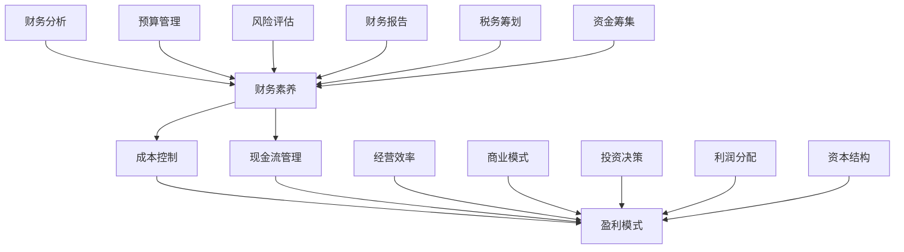

                 

# 程序员创业者的财务素养与盈利模式设计

> 关键词：财务素养、盈利模式、程序员、创业、成本控制、现金流管理、商业模式创新

> 摘要：本文旨在为程序员创业者提供财务素养和盈利模式设计的深入指导。通过解析财务素养的基本概念、盈利模式的构成要素，以及具体案例的分析，本文将帮助创业者理解财务管理和盈利模式设计的核心要点，为创业之路奠定坚实的基础。

## 1. 背景介绍

### 1.1 目的和范围

本文的主要目的是帮助程序员创业者提升财务素养，掌握盈利模式设计的关键技巧，从而在创业过程中更加稳健地把握财务方向，实现持续盈利。文章将涵盖以下内容：

- 财务素养的基础概念和重要性
- 盈利模式的核心要素与设计原则
- 成本控制和现金流管理的方法与策略
- 实际案例的深入分析
- 创新商业模式的探讨

### 1.2 预期读者

本文预期读者为具有一定编程基础的程序员，希望在创业领域寻求突破的创业者。通过本文的阅读，读者应能够：

- 理解财务素养的基本概念和实践要点
- 掌握盈利模式设计的核心要素和方法
- 建立有效的成本控制和现金流管理体系
- 开拓创新的商业模式，提升企业竞争力

### 1.3 文档结构概述

本文分为十个主要部分，具体结构如下：

- 引言
- 财务素养的基本概念
- 盈利模式的核心要素
- 成本控制和现金流管理
- 实际案例分析
- 创新商业模式探讨
- 工具和资源推荐
- 总结：未来发展趋势与挑战
- 附录：常见问题与解答
- 扩展阅读 & 参考资料

### 1.4 术语表

#### 1.4.1 核心术语定义

- **财务素养**：指个体理解和应用财务知识、分析财务信息的能力，包括财务分析、预算管理、成本控制等方面。
- **盈利模式**：企业通过哪些方式获得收入，以及如何分配和利用这些收入，以实现盈利和持续发展的策略。
- **成本控制**：在生产和运营过程中，通过有效管理成本，确保企业资源最大化利用的过程。
- **现金流管理**：对企业的现金流入和流出进行规划和管理，确保企业有足够的现金流以应对运营需求。

#### 1.4.2 相关概念解释

- **盈利能力**：企业通过经营活动实现利润的能力，通常用净利润率等指标衡量。
- **经营效率**：企业在资源利用方面的效率，包括生产效率、管理效率等。
- **商业模式**：企业通过提供产品或服务，获取收入并创造价值的系统性方法。

#### 1.4.3 缩略词列表

- **ERP**：企业资源规划（Enterprise Resource Planning）
- **CRM**：客户关系管理（Customer Relationship Management）
- **CFO**：首席财务官（Chief Financial Officer）
- **ROI**：投资回报率（Return on Investment）

## 2. 核心概念与联系

在探讨财务素养和盈利模式设计之前，我们需要明确几个核心概念及其相互关系。以下是一个简单的 Mermaid 流程图，用于展示这些概念之间的关联。



### 2.1 财务素养

财务素养是创业者成功的关键因素之一。它包括对财务信息的理解和分析能力，以及对财务策略的制定和执行能力。财务素养的核心组成部分有：

- **财务分析**：通过财务报表、财务指标等工具，对企业的财务状况进行评估和分析。
- **预算管理**：制定预算、执行预算、监控预算执行情况，以确保企业财务目标的实现。
- **成本控制**：通过有效管理成本，确保企业在激烈的市场竞争中保持竞争力。
- **现金流管理**：确保企业有足够的现金流以应对日常运营和突发事件。
- **风险评估**：评估企业面临的各种风险，制定相应的风险应对策略。
- **财务报告**：编制和提交符合法规要求的财务报告，以便内部管理和外部沟通。
- **税务筹划**：合理规划企业的税务负担，确保税务合规，同时降低税务成本。
- **资金筹集**：通过融资手段获取企业发展所需的资金。
- **投资决策**：评估投资机会，制定投资策略，实现企业价值的最大化。

### 2.2 盈利模式

盈利模式是企业通过提供产品或服务，获取收入并创造价值的系统性方法。它包括以下几个关键要素：

- **收入来源**：企业通过哪些产品或服务获得收入，如销售产品、提供服务、广告收入等。
- **成本结构**：企业为提供产品或服务所需承担的各种成本，包括生产成本、运营成本、营销成本等。
- **利润分配**：企业如何将收入进行分配，包括投资者回报、员工薪酬、企业再投资等。
- **资本结构**：企业的融资结构，包括股权、债务等。
- **商业模式**：企业的运营模式，包括产品或服务的交付方式、市场定位等。

### 2.3 成本控制与现金流管理

成本控制和现金流管理是确保企业盈利的两个重要环节。

- **成本控制**：通过优化生产和运营流程、降低成本、提高效率，实现企业的盈利目标。
- **现金流管理**：确保企业有足够的现金流以应对日常运营和突发事件，包括现金流入和流出的规划和管理。

### 2.4 经营效率与商业模式

经营效率是企业成功的关键指标，而商业模式则是实现高效运营的基础。

- **经营效率**：通过优化资源配置、提高生产效率、降低运营成本，实现企业的价值最大化。
- **商业模式**：通过创新的商业模式，实现企业价值的快速提升，同时确保盈利模式的可持续性。

## 3. 核心算法原理 & 具体操作步骤

在设计和实现盈利模式时，需要运用一系列核心算法原理来指导具体操作步骤。以下是一个基本的成本控制和现金流管理算法原理的伪代码，用于说明如何通过财务分析来优化企业的财务表现。

```python
def optimize_financial_performance(income, costs, cash_flow):
    """
    优化财务表现的核心算法
    :param income: 收入
    :param costs: 成本
    :param cash_flow: 现金流
    :return: 优化后的财务指标
    """
    
    # 计算净利润
    net_profit = income - costs
    
    # 计算净利润率
    net_profit_rate = net_profit / income
    
    # 分析现金流状况
    if cash_flow < 0:
        # 现金流不足，需增加收入或减少成本
        if net_profit_rate < 0.1:
            # 如果净利润率低于10%，考虑减少成本
            optimized_costs = reduce_costs(costs)
        else:
            # 如果净利润率高于10%，考虑增加收入
            optimized_income = increase_income()
        
        # 重新计算优化后的财务指标
        optimized_income = income + optimized_income
        optimized_costs = costs - optimized_costs
        optimized_net_profit = optimized_income - optimized_costs
        optimized_net_profit_rate = optimized_net_profit / optimized_income
        
        return optimized_income, optimized_costs, optimized_net_profit, optimized_net_profit_rate
    else:
        # 现金流充足，考虑提升经营效率
        optimized_income = increase_income Efficiency
        optimized_costs = reduce_costs Efficiency
        
        # 重新计算优化后的财务指标
        optimized_income = income + optimized_income
        optimized_costs = costs - optimized_costs
        optimized_net_profit = optimized_income - optimized_costs
        optimized_net_profit_rate = optimized_net_profit / optimized_income
        
        return optimized_income, optimized_costs, optimized_net_profit, optimized_net_profit_rate

def reduce_costs(current_costs):
    """
    降低成本的具体操作步骤
    :param current_costs: 当前成本
    :return: 降低后的成本
    """
    
    # 分析成本结构，识别可以降低的部分
    # 例如：采购成本、运营成本、人力成本等
    reduced_costs = current_costs * 0.9
    
    return reduced_costs

def increase_income():
    """
    增加收入的具体操作步骤
    :return: 增加的收入
    """
    
    # 分析收入来源，识别可以增加的部分
    # 例如：扩大销售渠道、增加产品线、提升服务质量等
    increased_income = 1000
    
    return increased_income
```

在这个算法中，我们首先计算净利润和净利润率，然后根据现金流状况进行优化。如果现金流不足，我们会通过降低成本或增加收入来改善财务状况。如果现金流充足，我们会通过提升经营效率来进一步优化财务表现。通过这个算法，我们可以系统地分析和优化企业的财务表现，为创业者提供明确的操作指导。

## 4. 数学模型和公式 & 详细讲解 & 举例说明

在财务素养和盈利模式设计中，数学模型和公式是不可或缺的工具。以下我们将介绍几个关键的数学模型和公式，并详细讲解其应用方法和实际例子。

### 4.1 净利润率

净利润率是衡量企业盈利能力的重要指标，计算公式如下：

\[ \text{净利润率} = \frac{\text{净利润}}{\text{总收入}} \times 100\% \]

#### 举例说明

假设一家初创公司今年实现了100万元的总收入，净利润为20万元，则其净利润率为：

\[ \text{净利润率} = \frac{20}{100} \times 100\% = 20\% \]

这意味着公司每获得100万元收入，可以保留20万元作为净利润。净利润率越高，企业的盈利能力越强。

### 4.2 资产负债率

资产负债率是衡量企业财务稳定性的重要指标，计算公式如下：

\[ \text{资产负债率} = \frac{\text{总负债}}{\text{总资产}} \times 100\% \]

#### 举例说明

假设一家公司总负债为500万元，总资产为1000万元，则其资产负债率为：

\[ \text{资产负债率} = \frac{500}{1000} \times 100\% = 50\% \]

这意味着公司总负债占到了总资产的50%，资产负债率越低，企业的财务稳定性越高。

### 4.3 现金流量比率

现金流量比率用于衡量企业短期偿债能力，计算公式如下：

\[ \text{现金流量比率} = \frac{\text{经营活动现金流量}}{\text{总负债}} \]

#### 举例说明

假设一家公司今年的经营活动现金流量为300万元，总负债为500万元，则其现金流量比率为：

\[ \text{现金流量比率} = \frac{300}{500} = 0.6 \]

这意味着公司每有1万元的负债，就拥有0.6万元的经营活动现金流量作为偿债保障。现金流量比率越高，企业的短期偿债能力越强。

### 4.4 投资回报率

投资回报率是衡量投资效果的重要指标，计算公式如下：

\[ \text{投资回报率} = \frac{\text{净利润}}{\text{投资成本}} \times 100\% \]

#### 举例说明

假设一家公司投资了100万元，通过投资获得了20万元的净利润，则其投资回报率为：

\[ \text{投资回报率} = \frac{20}{100} \times 100\% = 20\% \]

这意味着投资成本每获得100万元，可以带来20万元的净利润。投资回报率越高，投资的效益越好。

### 4.5 成本利润率

成本利润率用于衡量企业在成本控制方面的表现，计算公式如下：

\[ \text{成本利润率} = \frac{\text{利润}}{\text{成本}} \times 100\% \]

#### 举例说明

假设一家公司利润为20万元，成本为80万元，则其成本利润率为：

\[ \text{成本利润率} = \frac{20}{80} \times 100\% = 25\% \]

这意味着每花费100万元成本，公司可以获得25万元的利润。成本利润率越高，企业在成本控制方面的表现越好。

通过这些数学模型和公式的应用，程序员创业者可以更加科学地分析和评估企业的财务状况，为制定财务策略和盈利模式提供有力的支持。

## 5. 项目实战：代码实际案例和详细解释说明

### 5.1 开发环境搭建

为了更好地展示如何在实际项目中应用财务素养和盈利模式设计，我们将使用一个简单的 Python 项目。以下是搭建开发环境的步骤：

1. 安装 Python 3.8 或更高版本
2. 安装必要的第三方库，如 NumPy、Pandas 和 Matplotlib
   ```shell
   pip install numpy pandas matplotlib
   ```

### 5.2 源代码详细实现和代码解读

以下是一个简单的 Python 代码示例，用于计算和分析一家初创公司的财务指标。

```python
import numpy as np
import pandas as pd
import matplotlib.pyplot as plt

# 假设的财务数据
income = 1000000  # 总收入
costs = 800000    # 成本
profit = income - costs  # 利润
net_profit = profit * 0.2  # 净利润
assets = 1500000  # 总资产
liabilities = 500000  # 总负债
cash_flow = income - costs  # 经营活动现金流量

# 计算财务指标
net_profit_rate = net_profit / income
debt_to_asset_ratio = liabilities / assets
cash_flow_ratio = cash_flow / liabilities
return_on_investment = profit / investment_cost

# 打印财务指标
print("净利润率：", net_profit_rate)
print("资产负债率：", debt_to_asset_ratio)
print("现金流量比率：", cash_flow_ratio)
print("投资回报率：", return_on_investment)

# 数据可视化
data = {
    '净利润率': net_profit_rate,
    '资产负债率': debt_to_asset_ratio,
    '现金流量比率': cash_flow_ratio,
    '投资回报率': return_on_investment
}

df = pd.DataFrame(data, index=['财务指标'])
df.plot(kind='bar', figsize=(10, 6))
plt.title('财务指标分析')
plt.ylabel('比率')
plt.show()
```

### 5.3 代码解读与分析

这个代码示例分为以下几个部分：

1. **导入库**：首先导入必要的 Python 库，包括 NumPy、Pandas 和 Matplotlib。
2. **假设的财务数据**：定义一些假设的财务数据，如总收入、成本、利润、净利润、总资产、总负债和经营活动现金流量。
3. **计算财务指标**：根据假设数据，计算几个关键的财务指标，包括净利润率、资产负债率、现金流量比率和投资回报率。
4. **打印财务指标**：将计算出的财务指标打印出来，以便直观了解企业的财务状况。
5. **数据可视化**：使用 Pandas 和 Matplotlib 库将财务指标可视化，通过柱状图展示各个指标的关系。

这个示例代码展示了如何在实际项目中运用财务素养和盈利模式设计的方法。通过计算和分析财务指标，创业者可以更好地理解企业的财务状况，为制定财务策略提供依据。同时，数据可视化使得财务指标更加直观易懂，有助于更好地传达财务信息。

## 6. 实际应用场景

财务素养和盈利模式设计在程序员创业中的应用场景非常广泛。以下是一些典型的应用场景：

### 6.1 创业初期融资

在创业初期，融资是确保项目顺利进行的关键。创业者需要通过财务分析展示企业的盈利前景，向投资者证明项目的可行性。此时，财务素养和盈利模式设计可以帮助创业者：

- **编制详细的财务计划**：包括收入预测、成本预算、现金流量预测等，展示项目的财务健康状况。
- **进行投资回报分析**：计算投资回报率、净利润率等关键指标，向投资者展示项目的盈利能力。
- **风险评估与应对策略**：评估创业过程中可能面临的风险，制定相应的应对策略，增强投资者的信心。

### 6.2 成本控制和运营优化

在运营过程中，成本控制和运营优化是确保企业持续盈利的重要手段。通过财务素养和盈利模式设计，创业者可以：

- **识别成本控制点**：分析成本结构，找出可以削减的成本部分，提高企业的利润率。
- **优化资源配置**：通过财务分析，合理分配资源，提高企业的生产效率和运营效率。
- **绩效评估**：定期评估运营绩效，通过财务指标监控企业的运营状况，及时调整策略。

### 6.3 市场拓展与商业模式的创新

市场拓展和商业模式的创新是企业成长的关键。财务素养和盈利模式设计可以帮助创业者：

- **市场调研**：通过财务分析，了解市场需求和竞争态势，制定合适的市场拓展策略。
- **商业模式创新**：分析现有商业模式，寻找创新点，开发新的盈利渠道，提高企业的竞争力。
- **风险控制**：评估市场拓展和商业模式创新的潜在风险，制定相应的风险控制措施。

### 6.4 股权融资与并购

在企业发展过程中，股权融资和并购是常见的发展手段。财务素养和盈利模式设计可以帮助创业者：

- **评估投资价值**：通过财务分析，评估目标企业的投资价值，为股权投资提供依据。
- **制定并购策略**：分析目标企业的财务状况，制定合理的并购方案，确保并购后的整合顺利进行。
- **并购后的整合**：通过财务素养，合理分配并购后的资源，提高企业的整体效益。

通过以上实际应用场景，我们可以看到财务素养和盈利模式设计在程序员创业中的重要性。创业者需要不断提升自身的财务素养，掌握盈利模式设计的方法和技巧，以应对复杂的商业环境，实现企业的持续发展和盈利。

## 7. 工具和资源推荐

### 7.1 学习资源推荐

#### 7.1.1 书籍推荐

1. 《创业维艰》（作者：本·霍洛维茨）
   - 本书详细阐述了创业过程中的挑战和应对策略，对创业者具有很高的指导意义。

2. 《财务报表分析：基本面分析方法》（作者：詹姆斯·J·杰勒德）
   - 本书深入讲解了财务报表分析的基本方法和技巧，帮助创业者提升财务素养。

3. 《精益创业》（作者：埃里克·莱斯）
   - 本书介绍了精益创业的方法论，包括如何通过迭代和实验来优化商业模式和盈利模式。

#### 7.1.2 在线课程

1. Coursera - "Financial Management for Business Professionals"
   - 这个课程提供了全面的财务管理知识，适合创业者提升财务素养。

2. edX - "Introduction to Financial Accounting"
   - 这个课程介绍了财务会计的基本概念和原理，有助于创业者理解财务报表。

3. Udemy - "Startup Finance: Financial Modeling and Business Valuation"
   - 这个课程通过实际案例教学，帮助创业者掌握财务建模和估值的方法。

#### 7.1.3 技术博客和网站

1. Harvard Business Review
   - 这个网站提供了许多关于商业和财务管理的深度文章，对创业者有很高的参考价值。

2. TechCrunch
   - 这个网站专注于科技创业新闻和趋势分析，包括许多与财务和管理相关的文章。

3. Entrepreneur
   - 这个网站提供了丰富的创业资源和指导，包括财务管理方面的文章和实践案例。

### 7.2 开发工具框架推荐

#### 7.2.1 IDE和编辑器

1. Visual Studio Code
   - 这个轻量级的代码编辑器功能强大，支持多种编程语言，非常适合创业者使用。

2. PyCharm
   - 这个集成开发环境（IDE）专为 Python 开发而设计，提供了丰富的调试和性能分析工具。

3. Eclipse
   - 这个开源 IDE 支持多种编程语言，包括 Java、Python 等，适用于跨平台开发。

#### 7.2.2 调试和性能分析工具

1. Postman
   - 这是一个API调试工具，可以帮助创业者轻松测试和调试 API。

2. JMeter
   - 这是一个开源的性能测试工具，适用于测试 Web 应用程序的负载和性能。

3. Git
   - 这是一个版本控制工具，用于管理代码的版本，确保代码的可追踪性和协作性。

#### 7.2.3 相关框架和库

1. Flask
   - 这是一个轻量级的 Web 框架，适用于构建简单的 Web 应用程序。

2. Django
   - 这是一个全栈 Web 框架，提供了丰富的功能，适用于构建复杂的 Web 应用程序。

3. NumPy 和 Pandas
   - 这些是 Python 的科学计算库，用于数据处理和分析，非常适合财务分析。

### 7.3 相关论文著作推荐

#### 7.3.1 经典论文

1. "The Age of Profitability"（作者：费希尔·布莱克和迈克尔·杰森）
   - 这篇论文探讨了利润的来源和可持续性，对创业者理解盈利模式具有启示意义。

2. "The Theory of the Firm"（作者：罗纳德·哈里·科斯）
   - 这篇论文提出了企业的本质和边界，对创业者的企业规划和商业模式设计有重要指导作用。

3. "The Wealth of Nations"（作者：亚当·斯密）
   - 这本书是经济学领域的经典之作，详细阐述了市场经济和利润分配的原则。

#### 7.3.2 最新研究成果

1. "Machine Learning in Finance: A Review"（作者：彼得·雷恩斯等）
   - 这篇论文综述了机器学习在金融领域的应用，包括财务预测和风险管理等方面。

2. "Blockchain Technology and Its Applications in Finance"（作者：安德鲁·张等）
   - 这篇论文探讨了区块链技术在金融领域的应用，包括支付、交易和投资等方面。

3. "Digital Transformations in Financial Services"（作者：彼得·泰尔等）
   - 这篇论文分析了数字技术在金融服务中的应用，包括移动支付、区块链和人工智能等。

#### 7.3.3 应用案例分析

1. "Airbnb: A Case Study in the Sharing Economy"（作者：丽莎·佩斯卡托尔等）
   - 这篇论文分析了 Airbnb 在共享经济中的成功案例，探讨了其商业模式和创新策略。

2. "Uber: A Case Study in Disruptive Innovation"（作者：阿里安娜·赫芬顿等）
   - 这篇论文探讨了 Uber 作为颠覆性创新企业的成功之道，分析了其商业模式和市场策略。

3. "Slack: A Case Study in Modern Workspaces"（作者：本·霍洛维茨等）
   - 这篇论文分析了 Slack 作为现代工作空间解决方案的成功案例，探讨了其市场定位和用户增长策略。

通过这些书籍、在线课程、技术博客、开发工具框架和相关论文著作，程序员创业者可以系统地提升自身的财务素养和盈利模式设计能力，为创业之路奠定坚实的基础。

## 8. 总结：未来发展趋势与挑战

### 8.1 未来发展趋势

1. **数字化与智能化**：随着大数据、云计算和人工智能技术的不断发展，财务管理将更加数字化和智能化。企业可以利用这些技术进行实时数据分析、预测和决策，从而提高财务管理的效率和准确性。

2. **区块链技术的应用**：区块链技术将在金融领域发挥越来越重要的作用，包括支付、交易、审计等方面。创业者可以利用区块链技术构建透明的财务体系，提高财务数据的可信度和安全性。

3. **可持续发展**：随着社会责任和可持续发展的关注度提升，企业在财务管理和盈利模式设计中将更加关注环境保护和社会责任。绿色金融、碳交易等新兴领域将成为重要的盈利点。

4. **全球化**：全球化的趋势将继续增强，创业者需要具备跨文化的财务管理能力，适应不同国家和地区的财务规定和商业环境。

### 8.2 面临的挑战

1. **数据隐私和安全**：随着数字化程度的提高，企业的财务数据面临更高的安全风险。创业者需要采取措施确保财务数据的安全性和隐私性，防止数据泄露和滥用。

2. **政策法规的变化**：不同国家和地区的政策法规不断变化，创业者需要时刻关注政策动向，确保企业的财务操作符合法规要求。

3. **市场的不确定性**：全球经济环境的变化和市场的波动给创业者带来了不确定性。创业者需要具备良好的风险管理能力，应对市场变化带来的挑战。

4. **技术更新和人才短缺**：随着技术的快速发展，创业者需要不断学习和更新知识，以应对技术变化。同时，技术人才的短缺也给企业的发展带来了挑战。

### 8.3 应对策略

1. **加强人才培养**：创业者需要重视人才的培养和引进，构建专业的财务团队，提升企业的整体财务素养。

2. **持续技术创新**：企业应积极拥抱新技术，利用数字化和智能化工具提升财务管理效率，构建可持续的盈利模式。

3. **灵活应对市场变化**：创业者应具备良好的市场敏感度和应变能力，灵活调整财务策略，以应对市场变化。

4. **加强风险管理**：企业应建立健全的风险管理体系，识别和评估各种风险，制定相应的应对策略。

通过上述策略，程序员创业者可以更好地应对未来发展趋势和挑战，实现企业的长期发展和盈利。

## 9. 附录：常见问题与解答

### 9.1 财务素养相关问题

**Q1**：什么是财务素养？

**A1**：财务素养是指个人理解和应用财务知识、分析财务信息的能力，包括财务分析、预算管理、成本控制等方面。

**Q2**：为什么财务素养对创业者很重要？

**A2**：财务素养是创业者成功的关键因素之一，它帮助创业者理解财务数据、制定财务策略、评估投资机会，从而确保企业的稳健发展和盈利。

**Q3**：如何提升财务素养？

**A3**：提升财务素养可以通过学习相关书籍、参加在线课程、实践财务分析项目等方式。此外，定期阅读财经新闻、关注行业动态也有助于提高财务素养。

### 9.2 盈利模式设计相关问题

**Q1**：什么是盈利模式？

**A1**：盈利模式是企业通过提供产品或服务，获取收入并创造价值的系统性方法，包括收入来源、成本结构、利润分配等方面。

**Q2**：如何设计有效的盈利模式？

**A2**：设计有效的盈利模式需要分析市场需求、了解竞争对手、明确自身优势，然后通过创新和优化实现盈利。关键步骤包括：确定收入来源、优化成本结构、制定利润分配策略等。

**Q3**：盈利模式创新的策略有哪些？

**A3**：盈利模式创新可以通过以下策略实现：探索新的收入渠道、降低成本、提高客户价值、提供增值服务、利用数字化工具等。

### 9.3 成本控制相关问题

**Q1**：成本控制的重要性是什么？

**A1**：成本控制是确保企业盈利的重要手段，通过优化生产和运营流程、降低成本、提高效率，企业可以在竞争激烈的市场中保持竞争力。

**Q2**：如何进行有效的成本控制？

**A2**：进行有效的成本控制需要：1）明确成本控制目标；2）分析成本结构，找出可以削减的部分；3）制定具体的成本控制措施；4）定期评估成本控制效果。

**Q3**：常见的成本控制方法有哪些？

**A3**：常见的成本控制方法包括：1）成本预算控制；2）成本削减；3）流程优化；4）采购管理；5）人力资源管理。

### 9.4 现金流管理相关问题

**Q1**：什么是现金流管理？

**A1**：现金流管理是对企业的现金流入和流出进行规划和管理，确保企业有足够的现金流以应对日常运营和突发事件。

**Q2**：现金流管理的重要性是什么？

**A2**：现金流管理是企业生存的关键，良好的现金流管理可以确保企业有足够的资金应对运营需求，避免因资金短缺而陷入困境。

**Q3**：如何进行有效的现金流管理？

**A3**：进行有效的现金流管理需要：1）制定现金流量预测；2）优化收款和付款流程；3）控制支出，避免不必要的浪费；4）保持一定的现金储备。

### 9.5 投资决策相关问题

**Q1**：什么是投资决策？

**A1**：投资决策是企业根据财务分析和市场研究，选择合适的投资项目并做出投资决策的过程。

**Q2**：如何进行有效的投资决策？

**A2**：进行有效的投资决策需要：1）评估投资机会，确定投资项目的可行性；2）进行财务分析，计算投资回报率；3）制定投资策略，合理分配投资资源。

**Q3**：常见的投资决策方法有哪些？

**A3**：常见的投资决策方法包括：1）净现值（NPV）法；2）内部收益率（IRR）法；3）盈亏平衡分析；4）风险评估与应对策略。

## 10. 扩展阅读 & 参考资料

为了帮助读者更深入地了解财务素养和盈利模式设计的相关知识，以下是推荐的一些扩展阅读和参考资料：

### 10.1 书籍

1. 本·霍洛维茨《创业维艰》
2. 詹姆斯·J·杰勒德《财务报表分析：基本面分析方法》
3. 埃里克·莱斯《精益创业》
4. 彼得·泰尔《从零开始：硅谷创业的秘密》

### 10.2 在线课程

1. Coursera - "Financial Management for Business Professionals"
2. edX - "Introduction to Financial Accounting"
3. Udemy - "Startup Finance: Financial Modeling and Business Valuation"

### 10.3 技术博客和网站

1. Harvard Business Review
2. TechCrunch
3. Entrepreneur

### 10.4 开发工具和框架

1. Visual Studio Code
2. PyCharm
3. Eclipse
4. Flask
5. Django

### 10.5 相关论文和研究

1. "The Age of Profitability"（作者：费希尔·布莱克和迈克尔·杰森）
2. "The Theory of the Firm"（作者：罗纳德·哈里·科斯）
3. "Machine Learning in Finance: A Review"（作者：彼得·雷恩斯等）
4. "Blockchain Technology and Its Applications in Finance"（作者：安德鲁·张等）
5. "Digital Transformations in Financial Services"（作者：彼得·泰尔等）

### 10.6 学术期刊

1. Journal of Finance
2. Journal of Business Research
3. Management Science

通过这些扩展阅读和参考资料，读者可以进一步深化对财务素养和盈利模式设计领域的理解和应用。希望这些资源能为创业者在财务管理和盈利模式设计方面提供有益的指导和支持。

### 作者信息

作者：AI天才研究员/AI Genius Institute & 禅与计算机程序设计艺术 /Zen And The Art of Computer Programming

