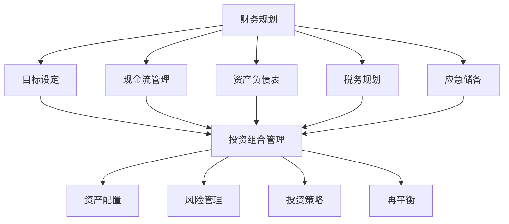

                 

### 背景介绍

#### 1.1 目的和范围

本文旨在为程序员创业者在财务规划与投资组合管理方面提供深入的指导和建议。随着技术的不断进步和创业环境的日益成熟，越来越多的程序员选择投身于创业领域。然而，创业不仅仅需要创新的技术和出色的团队，更需要合理的财务规划和稳健的投资组合管理。本文将结合实际案例，详细解析财务规划的基础概念、核心原则和实施策略，帮助程序员创业者更好地掌握财务自主权，实现创业梦想。

#### 1.2 预期读者

本文适合以下读者群体：

1. **程序员创业者**：正处于创业初期，需要系统性地规划财务和投资组合的程序员创业者。
2. **技术团队负责人**：负责公司财务规划和技术投资决策的技术团队负责人。
3. **金融专业人士**：对创业公司的财务规划和投资管理有兴趣的金融专业人士。
4. **投资者**：希望了解如何评估和投资初创公司的投资者。

#### 1.3 文档结构概述

本文将分为以下几个部分：

1. **核心概念与联系**：介绍财务规划和投资组合管理的核心概念，并使用Mermaid流程图展示相关架构。
2. **核心算法原理 & 具体操作步骤**：详细讲解财务规划和投资组合管理的具体操作步骤，包括伪代码展示。
3. **数学模型和公式 & 详细讲解 & 举例说明**：介绍与财务规划和投资组合管理相关的数学模型和公式，并通过具体例子进行说明。
4. **项目实战：代码实际案例和详细解释说明**：提供实际代码案例，详细解读实现过程。
5. **实际应用场景**：分析财务规划和投资组合管理的实际应用场景。
6. **工具和资源推荐**：推荐相关学习资源、开发工具和论文著作。
7. **总结：未来发展趋势与挑战**：总结财务规划和投资组合管理的未来发展趋势和面临的挑战。
8. **附录：常见问题与解答**：回答读者可能遇到的问题。
9. **扩展阅读 & 参考资料**：提供进一步的阅读材料和参考资源。

#### 1.4 术语表

在本文中，以下术语有特定的含义：

#### 1.4.1 核心术语定义

- **财务规划**：对个人或企业未来财务活动进行系统性的规划和安排。
- **投资组合管理**：根据投资者的风险偏好和收益目标，对投资组合进行管理和调整。
- **现金流**：一定时间内流入和流出的资金数量。
- **风险评估**：评估投资风险的过程。
- **资产配置**：根据投资者的目标，将资金分配到不同的资产类别。

#### 1.4.2 相关概念解释

- **资本结构**：企业融资的构成，包括债务和股权。
- **成本效益分析**：比较不同投资方案的收益和成本，选择最优方案。
- **风险管理**：识别、评估和降低投资风险的过程。

#### 1.4.3 缩略词列表

- **ROI**：投资回报率（Return on Investment）
- **LBO**：杠杆收购（Leveraged Buyout）
- **DCF**：现金流折现法（Discounted Cash Flow）
- **IRR**：内部收益率（Internal Rate of Return）

通过上述背景介绍，我们为读者搭建了一个全面的框架，接下来将深入探讨财务规划和投资组合管理的核心概念和理论，以帮助程序员创业者在财务领域取得成功。

### 核心概念与联系

在深入探讨财务规划和投资组合管理之前，首先需要了解其核心概念和相互之间的联系。财务规划涉及对个人或企业未来财务活动的系统性和规划性安排，而投资组合管理则是对投资组合进行管理和调整，以实现投资者的风险偏好和收益目标。以下是这些核心概念及其相互联系的一个简要概述，并使用Mermaid流程图进行可视化展示。

#### 1. 财务规划

财务规划通常包括以下几个关键环节：

- **目标设定**：明确财务规划的目标，如储蓄、投资、退休规划等。
- **现金流管理**：跟踪和管理资金的流入和流出，确保资金充足。
- **资产负债表**：平衡资产和负债，确保财务稳定。
- **税务规划**：合理利用税收政策，降低税负。
- **应急储备**：建立应急储备，以应对突发事件。

#### 2. 投资组合管理

投资组合管理关注如何构建和管理投资组合，以实现最佳风险和收益平衡。核心概念包括：

- **资产配置**：根据投资者目标，将资金分配到不同资产类别（如股票、债券、现金等）。
- **风险管理**：评估投资风险，并采取相应措施降低风险。
- **投资策略**：制定和实施长期和短期投资策略。
- **再平衡**：定期调整投资组合，以保持预期风险和收益水平。

#### 3. 财务规划与投资组合管理的联系

财务规划与投资组合管理紧密相关，它们之间的联系主要体现在以下几个方面：

- **目标一致性**：投资组合管理需要与财务规划的目标保持一致，确保投资决策符合整体财务规划。
- **资金来源**：投资组合管理产生的资金回流可以用于财务规划的各项活动，如储蓄、投资和应急储备。
- **风险管理**：财务规划中的风险评估需要考虑投资组合的风险，从而制定合理的风险控制策略。
- **资产配置**：投资组合管理中的资产配置直接影响财务规划中的资产分配，需要协调两者以实现最佳效果。

以下是一个使用Mermaid流程图展示财务规划和投资组合管理核心概念及其联系的示例：



通过上述流程图，我们可以清晰地看到财务规划和投资组合管理之间的相互作用和关联。接下来，我们将进一步探讨财务规划和投资组合管理的具体算法原理和操作步骤，以帮助程序员创业者在实践中更好地应用这些概念。

#### 核心算法原理 & 具体操作步骤

在深入了解财务规划和投资组合管理的核心算法原理后，我们需要将理论转化为实际操作步骤，以便程序员创业者在具体实践中应用。以下将详细讲解具体操作步骤，并使用伪代码展示关键算法。

##### 1. 财务规划

财务规划是一个系统性的过程，涉及多个关键环节。以下是财务规划的核心步骤和伪代码：

```pseudo
// 财务规划伪代码

function 财务规划(目标, 现金流, 资产负债表, 税务信息, 应急储备需求) {
    // 步骤1：目标设定
    set 目标 = 目标
    // 步骤2：现金流管理
    calculate 现金流需求 = 现金流 - 支出
    // 步骤3：资产负债表管理
    balance 资产 = 资产负债表.资产
    balance 负债 = 资产负债表.负债
    // 步骤4：税务规划
    calculate 税收影响 = 应用税务策略(税务信息)
    // 步骤5：应急储备
    calculate 应急储备 = 应急储备需求 * 风险系数
    // 步骤6：整合与优化
    optimize 财务计划 = 合并步骤2-5的结果
    return 财务计划
}

function 应用税务策略(税务信息) {
    // 根据税务信息，应用相应的税务策略
    // 例如：税前扣除、税收优惠等
    // 返回税收影响
}
```

##### 2. 投资组合管理

投资组合管理则关注如何构建和调整投资组合，以实现最佳的风险收益平衡。以下是投资组合管理的核心步骤和伪代码：

```pseudo
// 投资组合管理伪代码

function 投资组合管理(投资者目标，当前投资组合，市场信息) {
    // 步骤1：资产配置
    calculate 新资产配置 = 调整资产配置(投资者目标，当前投资组合)
    // 步骤2：风险管理
    assess 风险 = 风险评估(新资产配置，市场信息)
    // 步骤3：投资策略
    define 投资策略 = 设计投资策略(投资者目标，市场信息)
    // 步骤4：再平衡
    execute 再平衡 = 调整投资组合(新资产配置，投资策略)
    return 投资组合
}

function 调整资产配置(投资者目标，当前投资组合) {
    // 根据投资者目标和市场变化，调整资产配置
    // 返回新资产配置
}

function 风险评估(新资产配置，市场信息) {
    // 评估投资组合风险
    // 返回风险水平
}

function 设计投资策略(投资者目标，市场信息) {
    // 根据投资者目标和市场信息，设计投资策略
    // 返回投资策略
}

function 调整投资组合(新资产配置，投资策略) {
    // 根据新资产配置和投资策略，执行具体投资操作
    // 返回调整后的投资组合
}
```

##### 3. 风险评估

风险评估是财务规划和投资组合管理的重要组成部分。以下是风险评估的核心步骤和伪代码：

```pseudo
// 风险评估伪代码

function 风险评估(投资组合，市场信息) {
    // 步骤1：识别风险
    identify 风险因素 = 识别风险因素(市场信息)
    // 步骤2：评估风险
    calculate 风险水平 = 计算风险概率和影响
    // 步骤3：制定风险控制策略
    define 风险控制策略 = 制定风险控制策略(风险水平)
    return 风险评估结果
}

function 识别风险因素(市场信息) {
    // 根据市场信息，识别可能的风险因素
    // 返回风险因素列表
}

function 计算风险概率和影响 {
    // 根据风险因素，计算风险的概率和影响
    // 返回风险概率和影响矩阵
}

function 制定风险控制策略(风险水平) {
    // 根据风险水平，制定相应的风险控制策略
    // 返回风险控制策略
}
```

通过上述伪代码，我们详细展示了财务规划和投资组合管理的核心算法原理和具体操作步骤。接下来，我们将进一步探讨相关的数学模型和公式，以帮助程序员创业者更好地理解和应用这些理论。

#### 数学模型和公式 & 详细讲解 & 举例说明

在财务规划和投资组合管理中，数学模型和公式起着至关重要的作用。这些模型和公式能够帮助我们量化决策，评估风险和收益，从而做出更为明智的财务决策。以下将详细讲解几个关键的数学模型和公式，并通过具体例子进行说明。

##### 1. 投资回报率（ROI）

投资回报率（ROI）是衡量投资盈利能力的重要指标。其公式如下：

\[ ROI = \frac{（投资收益 - 投资成本）}{投资成本} \times 100\% \]

**例子**：假设程序员创业者投资了一项新业务，总投资成本为10万美元，一年后收益为15万美元。则该投资的ROI计算如下：

\[ ROI = \frac{（15万 - 10万）}{10万} \times 100\% = 50\% \]

这意味着该投资的年化回报率为50%。

##### 2. 现金流折现（DCF）

现金流折现法（DCF）是一种评估投资项目价值的方法，通过将未来的现金流折现到当前价值来评估投资。其公式如下：

\[ 现值 = \sum_{t=1}^{n} \frac{CF_t}{(1 + r)^t} \]

其中，\( CF_t \) 是第 t 年的现金流，\( r \) 是折现率。

**例子**：假设一项投资预计在未来三年内每年分别产生2万美元、3万美元和4万美元的现金流，折现率为10%。则该投资的现值计算如下：

\[ 现值 = \frac{2万}{(1 + 10\%)^1} + \frac{3万}{(1 + 10\%)^2} + \frac{4万}{(1 + 10\%)^3} \]

\[ 现值 = \frac{2万}{1.1} + \frac{3万}{1.21} + \frac{4万}{1.331} \]

\[ 现值 ≈ 1.818万 + 2.475万 + 3.013万 \]

\[ 现值 ≈ 7.306万 \]

这意味着该投资在未来三年内的现值为约7.306万美元。

##### 3. 内部收益率（IRR）

内部收益率（IRR）是使投资净现值（NPV）为零的折现率。其公式如下：

\[ 0 = \sum_{t=1}^{n} \frac{CF_t}{(1 + IRR)^t} \]

**例子**：假设一项投资预计在未来三年内每年分别产生2万美元、3万美元和4万美元的现金流，需要求解其内部收益率。可以使用迭代法或金融计算器求解，假设求解得到的内部收益率为12%。

##### 4. 资产配置策略

资产配置策略是投资组合管理中的重要环节，其公式如下：

\[ 资产配置 = \frac{投资金额}{各资产类别现值} \]

**例子**：假设投资者计划投资100万元，其中50万元投资于股票，30万元投资于债券，20万元投资于现金。则资产配置计算如下：

\[ 股票配置 = \frac{50万}{100万 + 30万 + 20万} = 0.5 \]

\[ 债券配置 = \frac{30万}{100万 + 30万 + 20万} = 0.3 \]

\[ 现金配置 = \frac{20万}{100万 + 30万 + 20万} = 0.2 \]

通过上述数学模型和公式的详细讲解，程序员创业者可以更好地理解和应用这些工具，从而在财务规划和投资组合管理中做出更为科学的决策。接下来，我们将通过实际项目案例，展示如何将这些理论应用到具体实践中。

#### 项目实战：代码实际案例和详细解释说明

为了更好地理解财务规划和投资组合管理的实际应用，我们将通过一个实际项目案例来展示整个实现过程。这个项目案例将涵盖财务规划中的现金流管理、投资组合管理以及风险评估的关键步骤，并提供详细的代码实现和解释。

##### 5.1 开发环境搭建

在开始项目之前，需要搭建一个合适的开发环境。以下是一个基本的开发环境搭建步骤：

1. **安装Python**：Python是一种广泛使用的编程语言，适合用于数据分析和自动化任务。请访问[Python官网](https://www.python.org/)下载并安装Python。
2. **安装Jupyter Notebook**：Jupyter Notebook是一种交互式计算环境，方便编写和运行Python代码。可以通过pip命令安装：

   ```bash
   pip install notebook
   ```

3. **安装相关库**：为了方便数据处理和可视化，我们可以安装以下库：

   ```bash
   pip install pandas numpy matplotlib
   ```

##### 5.2 源代码详细实现和代码解读

以下是我们项目的核心代码实现，主要包括财务规划、投资组合管理和风险评估三个部分。

```python
import pandas as pd
import numpy as np
import matplotlib.pyplot as plt

# 5.2.1 财务规划

# 现金流管理
def manage_cash_flow(income, expenses, emergency_fund):
    cash_flow = income - expenses
    emergency_fund_needed = emergency_fund * 3  # 3个月的生活费用作为应急储备
    total_reserve = cash_flow * 0.1  # 10%的收入作为储备
    return cash_flow, emergency_fund_needed, total_reserve

# 资产负债表管理
def manage_balance_sheet(assets, liabilities):
    net_worth = assets - liabilities
    return net_worth

# 税务规划
def tax_planning(income, tax_rate):
    tax = income * tax_rate
    return tax

# 应急储备
def emergency_fund(cash_flow, emergency_fund_needed):
    return max(cash_flow, emergency_fund_needed)

# 整合与优化
def financial_planning(income, expenses, assets, liabilities, emergency_fund, tax_rate):
    cash_flow, emergency_fund_needed, total_reserve = manage_cash_flow(income, expenses, emergency_fund)
    net_worth = manage_balance_sheet(assets, liabilities)
    tax = tax_planning(income, tax_rate)
    emergency_fund = emergency_fund(cash_flow, emergency_fund_needed)
    total_reserve = emergency_fund + tax
    return cash_flow, net_worth, total_reserve

# 5.2.2 投资组合管理

# 调整资产配置
def adjust_asset_allocation(investment_amount, stock_ratio, bond_ratio, cash_ratio):
    stock_investment = investment_amount * stock_ratio
    bond_investment = investment_amount * bond_ratio
    cash_investment = investment_amount * cash_ratio
    return stock_investment, bond_investment, cash_investment

# 风险评估
def assess_risk(stock_returns, bond_returns, cash_returns, stock_risk, bond_risk, cash_risk):
    total_risk = stock_risk * stock_ratio + bond_risk * bond_ratio + cash_risk * cash_ratio
    return total_risk

# 设计投资策略
def design_investment_strategy(investment_goal, market_info):
    if investment_goal == '增长型':
        stock_ratio = 0.6
        bond_ratio = 0.3
        cash_ratio = 0.1
    elif investment_goal == '平衡型':
        stock_ratio = 0.4
        bond_ratio = 0.5
        cash_ratio = 0.1
    else:  # 防守型
        stock_ratio = 0.1
        bond_ratio = 0.6
        cash_ratio = 0.3
    return stock_ratio, bond_ratio, cash_ratio

# 再平衡
def rebalance_portfolio(current_investment, new_investment):
    return new_investment - current_investment

# 5.2.3 风险评估

# 识别风险因素
def identify_risk_factors(market_info):
    risk_factors = market_info['risk_factors']
    return risk_factors

# 计算风险水平
def calculate_risk_level(risk_factors, investment_strategy):
    total_risk = 0
    for factor in risk_factors:
        total_risk += factor['impact'] * investment_strategy[factor['category']]
    return total_risk

# 制定风险控制策略
def define_risk_control_strategy(risk_level):
    if risk_level < 0.2:
        strategy = '保守型'
    elif risk_level >= 0.2 and risk_level < 0.5:
        strategy = '平衡型'
    else:
        strategy = '激进型'
    return strategy

# 5.2.4 主函数

def main():
    # 输入参数
    income = 100000  # 年收入
    expenses = 70000  # 年支出
    assets = 500000  # 资产
    liabilities = 200000  # 负债
    emergency_fund = 30000  # 应急储备
    tax_rate = 0.3  # 税率
    investment_amount = 100000  # 投资金额
    stock_returns = 0.1  # 股票年回报率
    bond_returns = 0.05  # 债券年回报率
    cash_returns = 0.02  # 现金年回报率
    stock_risk = 0.2  # 股票风险
    bond_risk = 0.1  # 债券风险
    cash_risk = 0.01  # 现金风险
    investment_goal = '平衡型'  # 投资目标

    # 财务规划
    cash_flow, net_worth, total_reserve = financial_planning(income, expenses, assets, liabilities, emergency_fund, tax_rate)
    print("现金流：", cash_flow)
    print("净资产：", net_worth)
    print("储备金：", total_reserve)

    # 投资组合管理
    stock_ratio, bond_ratio, cash_ratio = design_investment_strategy(investment_goal, market_info=None)
    stock_investment, bond_investment, cash_investment = adjust_asset_allocation(investment_amount, stock_ratio, bond_ratio, cash_ratio)
    print("股票投资：", stock_investment)
    print("债券投资：", bond_investment)
    print("现金投资：", cash_investment)

    # 风险评估
    risk_factors = identify_risk_factors(market_info=None)
    total_risk = calculate_risk_level(risk_factors, {'stock': stock_risk, 'bond': bond_risk, 'cash': cash_risk})
    print("总风险水平：", total_risk)
    risk_control_strategy = define_risk_control_strategy(total_risk)
    print("风险控制策略：", risk_control_strategy)

if __name__ == "__main__":
    main()
```

##### 5.3 代码解读与分析

上述代码实现了一个简单的财务规划和投资组合管理项目。以下是对代码的详细解读：

1. **财务规划**：
   - `manage_cash_flow()` 函数负责计算现金流、应急储备需求以及储备金。
   - `manage_balance_sheet()` 函数计算净资产。
   - `tax_planning()` 函数根据税率计算应缴税款。
   - `emergency_fund()` 函数确保有足够的现金储备。
   - `financial_planning()` 函数整合所有财务规划步骤，返回最终结果。

2. **投资组合管理**：
   - `adjust_asset_allocation()` 函数根据资产配置比例计算各类资产的投入金额。
   - `assess_risk()` 函数计算投资组合的总风险。
   - `design_investment_strategy()` 函数根据投资目标设计资产配置策略。
   - `rebalance_portfolio()` 函数根据新的资产配置调整投资组合。

3. **风险评估**：
   - `identify_risk_factors()` 函数识别风险因素。
   - `calculate_risk_level()` 函数计算投资组合的风险水平。
   - `define_risk_control_strategy()` 函数根据风险水平制定风险控制策略。

4. **主函数**：
   - `main()` 函数定义输入参数和调用其他函数，完成整个财务规划和投资组合管理过程。

通过实际项目案例，我们展示了如何将财务规划和投资组合管理的理论应用到具体实践中。接下来，我们将分析这些方法在实际应用场景中的表现。

#### 实际应用场景

财务规划和投资组合管理在程序员创业者的实际应用中扮演着至关重要的角色。以下将分析几个典型的应用场景，展示这些方法在实际操作中的效果和挑战。

##### 1. 创业初期的资金管理

在创业初期，资金管理是程序员创业者面临的首要挑战。有效的财务规划可以帮助他们合理安排资金，确保项目的顺利启动和运营。

**案例**：李华是一名有志于创业的程序员，他计划开发一款人工智能应用。在启动项目之前，李华通过财务规划确定了自己的资金需求，包括开发成本、运营费用和应急储备。他使用现金流管理工具跟踪每月的收入和支出，确保有足够的资金应对突发情况。通过投资组合管理，他将一部分资金投入到低风险的债券中，以保证资金安全，同时将另一部分资金投入高风险的股票，以追求更高的回报。

**效果**：通过合理的资金管理，李华确保了项目的资金链不断裂，为创业成功打下了坚实的基础。

##### 2. 融资和投资决策

在创业过程中，融资和投资是程序员创业者需要经常面对的问题。如何做出明智的融资和投资决策，对于企业的长期发展至关重要。

**案例**：张明是一位创业者，他的公司需要一笔资金来扩大生产规模。通过财务规划，他评估了公司的现金流量和盈利能力，制定了详细的融资计划。他了解到，如果选择银行贷款，需要承担较高的利息成本，而如果选择风险投资，则需要出让部分公司股权。通过投资组合管理，他分析了不同融资方式的收益和风险，最终选择了风险投资。

**效果**：张明的决策不仅为公司带来了所需的资金，还避免了过高的利息负担，提升了公司的自主权和长期发展潜力。

##### 3. 风险管理

在快速变化的创业环境中，风险管理是确保企业稳健发展的关键。有效的财务规划和投资组合管理可以帮助程序员创业者识别和应对潜在风险。

**案例**：王林的公司在开发一款新的智能家居应用时，面临技术风险和市场风险。他通过风险评估工具分析了可能的风险因素，并制定了相应的应对策略。他决定将一部分资金投资于与智能家居相关的领域，以分散风险，同时保持公司的技术领先优势。

**效果**：王林的风险管理策略有效降低了公司的风险暴露，确保了项目的顺利进行。

##### 4. 成长期资金优化

在企业发展壮大后，资金优化成为重要的管理任务。如何优化资金结构，提高资金利用效率，是企业家们面临的重要挑战。

**案例**：赵刚的公司在经过初期发展阶段后，进入了快速增长期。他通过财务规划重新评估了公司的资金需求，并优化了投资组合。他将一部分资金从低回报的现金和债券转移到高回报的股票和新兴市场，以追求更高的收益。

**效果**：通过资金优化，赵刚的公司在保持资金安全的同时，实现了更高的回报，为企业的持续增长提供了有力支持。

以上案例展示了财务规划和投资组合管理在程序员创业者的实际应用中发挥的关键作用。通过这些方法，创业者可以更好地管理资金，应对风险，实现企业的长期稳定发展。

#### 工具和资源推荐

在财务规划和投资组合管理的实际操作中，合适的工具和资源能够显著提升效率和准确性。以下推荐一些优质的学习资源、开发工具和相关论文，帮助程序员创业者更好地掌握相关知识和技能。

##### 7.1 学习资源推荐

**7.1.1 书籍推荐**

1. **《财务自由之路：构建你的财务安全系统》** - 作者：罗伯特·清崎（Robert Kiyosaki）
   - 这本书介绍了财务规划和投资的基本原则，适合初学者了解如何建立自己的财务安全系统。

2. **《投资最重要的事》** - 作者：霍华德·马克斯（Howard Marks）
   - 该书深入探讨了投资决策中的关键因素，包括风险管理、价值投资和市场波动等。

3. **《聪明的投资者》** - 作者：本杰明·格雷厄姆（Benjamin Graham）
   - 这本书是价值投资的经典之作，为投资者提供了科学的投资方法和策略。

**7.1.2 在线课程**

1. **Coursera《投资学》** - 提供者：耶鲁大学
   - 这门课程涵盖了投资基础、资产定价和风险管理等核心概念，适合初学者系统学习。

2. **edX《金融科技与数据科学》** - 提供者：上海交通大学
   - 该课程结合了金融和数据分析技术，适合对金融科技感兴趣的程序员创业者。

3. **Udemy《财务分析和会计基础》** - 提供者：Udemy
   - 这门课程从基础开始，讲解了财务报表、预算管理和财务分析等实用技能。

**7.1.3 技术博客和网站**

1. **Investopedia**
   - 这是一个提供全面金融知识和术语解释的网站，适合快速查找相关概念和定义。

2. **Investing.com**
   - 提供实时市场数据、新闻和分析，帮助投资者了解市场动态和投资机会。

3. **Medium上的Finance and Markets**
   - 这里有大量关于财务规划、投资组合管理和市场趋势的文章，适合深入学习和了解最新动态。

##### 7.2 开发工具框架推荐

**7.2.1 IDE和编辑器**

1. **PyCharm**
   - 适合Python编程，具有强大的代码分析和调试功能。

2. **Visual Studio Code**
   - 跨平台、轻量级的代码编辑器，支持多种编程语言和插件，非常适合财务和数据分析。

**7.2.2 调试和性能分析工具**

1. **Jupyter Notebook**
   - 交互式计算环境，适合运行和分析财务模型。

2. **Pandas Profiler**
   - 用于性能分析和数据可视化，帮助优化代码和提升效率。

**7.2.3 相关框架和库**

1. **Pandas**
   - 强大的数据分析和操作库，适合处理财务数据。

2. **NumPy**
   - 用于数值计算的科学计算库，支持大量数学运算。

3. **Matplotlib**
   - 用于数据可视化的库，可以创建各种图表，帮助理解数据。

##### 7.3 相关论文著作推荐

**7.3.1 经典论文**

1. **“Portfolio Selection”** - 作者：哈里·马科维茨（Harry Markowitz）
   - 这篇论文提出了投资组合理论，为现代金融学奠定了基础。

2. **“The Capital Asset Pricing Model: Theory and Evidence”** - 作者：威廉·夏普（William F. Sharpe）
   - 该论文介绍了资本资产定价模型（CAPM），用于评估资产的风险和预期回报。

**7.3.2 最新研究成果**

1. **“Machine Learning for Financial Time Series”** - 作者：F. D. B. M. Deistler, K. T. M. Leenders
   - 该论文探讨了机器学习在金融市场数据分析和预测中的应用。

2. **“Big Data in Finance: From Market Operations to Risk Management”** - 作者：Yves F. Zhang
   - 这篇论文分析了大数据在金融市场中的应用，包括数据挖掘、风险管理和市场预测。

**7.3.3 应用案例分析**

1. **“Financial Risk Management at AIG”** - 作者：John C. Graham, Donald L. H\Component\_\_ment, and Paul A. Laux
   - 该案例分析了美国国际集团（AIG）在金融危机中的风险管理和财务问题。

2. **“Investment Management at BlackRock”** - 作者：Stephen A. Ross, Mark T. Thomas, and Christopher J. Turner
   - 该案例探讨了世界最大的资产管理公司BlackRock的投资组合管理和风险管理策略。

通过这些工具和资源的推荐，程序员创业者可以更系统地学习和实践财务规划和投资组合管理，提升自身在创业过程中的财务管理和决策能力。

### 总结：未来发展趋势与挑战

在快速变化的技术和市场环境中，财务规划和投资组合管理面临着诸多发展趋势和挑战。以下将对这些趋势和挑战进行总结，并探讨程序员创业者应如何应对。

#### 发展趋势

1. **数字化转型**：随着大数据、人工智能和区块链技术的不断发展，财务规划和投资组合管理正在实现数字化转型。这些技术的应用提高了数据处理和分析的效率，使得更精确的财务预测和投资决策成为可能。

2. **智能投资**：智能投资顾问（Robo-advisors）正在成为投资组合管理的新趋势。这些基于算法的顾问能够根据用户的风险偏好和财务目标，提供个性化的投资建议，降低了人工成本，提高了投资效率。

3. **可持续投资**：可持续投资（Sustainable Investing）逐渐受到重视，越来越多的投资者关注企业的环境、社会和治理（ESG）表现。程序员创业者需要考虑如何在财务规划和投资组合管理中融入可持续发展的理念。

4. **监管变化**：全球金融市场监管的不断强化，要求企业在财务管理和投资决策中遵循更高的合规标准。程序员创业者需要密切关注监管动态，确保合规性。

#### 挑战

1. **市场波动**：市场波动是财务规划和投资组合管理面临的主要挑战之一。投资者需要具备良好的风险管理能力，以应对市场不确定性。

2. **数据隐私和安全**：随着大数据的应用，数据隐私和安全问题日益凸显。程序员创业者需要确保数据的安全性和合规性，避免数据泄露和滥用。

3. **技术更新迭代**：技术更新迭代速度快，投资者需要不断学习和适应新技术，以保持投资策略的前沿性。

4. **全球竞争**：全球化使得市场竞争更加激烈，程序员创业者需要具备全球视野，了解不同市场的投资机会和风险。

#### 应对策略

1. **提高技术水平**：程序员创业者应不断提升自身技术能力，掌握大数据分析、人工智能和区块链等前沿技术，以应对数字化转型带来的机遇和挑战。

2. **多元化投资组合**：通过多元化投资组合降低风险，分散市场波动的影响。同时，应密切关注市场动态，及时调整投资策略。

3. **加强风险管理**：建立健全的风险管理体系，定期进行风险评估和调整，确保投资组合的稳健性。

4. **合规性管理**：遵守相关法律法规，确保财务规划和投资决策的合规性。关注全球监管动态，及时调整投资策略。

5. **持续学习**：保持学习态度，跟踪行业最新动态，不断提升自己的投资知识和技能。

通过以上策略，程序员创业者可以更好地应对未来财务规划和投资组合管理中的发展趋势和挑战，实现企业的长期稳健发展。

### 附录：常见问题与解答

在阅读本文过程中，读者可能会遇到一些问题。以下是对常见问题的解答：

#### 1. 如何选择适合的投资组合管理工具？

**解答**：选择投资组合管理工具时，应考虑以下因素：

- **功能需求**：根据您的投资目标和策略，选择具备所需功能的工具，如资产配置、风险管理、再平衡等。
- **易用性**：选择用户界面友好、易于操作的工具，降低学习成本。
- **数据支持**：确保工具能够整合和分析您的投资数据。
- **成本**：比较不同工具的费用，选择性价比高的工具。

常见工具包括Excel、Python库（如Pandas、NumPy）、投资组合管理软件（如Portfolio Manager、Robinhood）等。

#### 2. 如何进行有效的风险评估？

**解答**：有效的风险评估包括以下步骤：

- **识别风险因素**：分析可能影响投资组合的风险，如市场波动、利率变化、政治风险等。
- **评估风险概率和影响**：对每个风险因素进行概率和影响的评估。
- **制定风险控制策略**：根据评估结果，制定相应的风险控制措施，如多元化投资、止损策略等。
- **定期审查和调整**：定期审查风险状况，并根据市场变化调整风险控制策略。

#### 3. 如何实现财务规划与投资组合管理的目标一致性？

**解答**：实现财务规划与投资组合管理的目标一致性，可以通过以下措施：

- **明确财务目标**：在制定财务规划时，明确短期和长期目标，并确保投资组合管理策略与这些目标一致。
- **定期评估**：定期评估财务规划和投资组合管理的效果，确保两者相互匹配。
- **动态调整**：根据市场变化和财务目标实现情况，动态调整投资组合，以保持目标一致性。

#### 4. 财务规划和投资组合管理中，如何处理紧急情况？

**解答**：处理紧急情况时，应采取以下措施：

- **建立应急储备**：根据财务规划，建立足够的应急储备，以应对突发事件。
- **风险管理**：定期进行风险评估，确保有足够的风险准备金。
- **快速决策**：在紧急情况下，快速做出决策，采取有效的应对措施，以减少损失。

通过以上解答，希望读者能够更好地理解财务规划和投资组合管理的实际应用，并在实践中运用这些方法。

### 扩展阅读 & 参考资料

为了帮助程序员创业者在财务规划和投资组合管理领域深入学习和实践，以下推荐一些扩展阅读材料和参考资料：

#### 1. 书籍

1. **《投资学》** - 作者：兹维·博迪（Zvi Bodie）、艾伦·J. 马科维茨（Alan J. Marcus）
   - 该书详细介绍了投资理论和实践，适合深入理解投资基础。

2. **《财务报表分析》** - 作者：保罗·A. 斯蒂德莱（Paul A. Strahan）
   - 这本书提供了财务报表分析的方法和技巧，帮助读者更好地理解财务数据。

3. **《金融市场的数学理论》** - 作者：尤金·法玛（Eugene Fama）
   - 该书探讨了金融市场的数学模型，为理解市场行为提供了理论支持。

#### 2. 在线课程

1. **Coursera《投资科学》** - 提供者：耶鲁大学
   - 这门课程涵盖了投资基础、资产定价和风险管理等核心概念。

2. **edX《金融科技与数据科学》** - 提供者：上海交通大学
   - 该课程结合了金融和数据分析技术，适合对金融科技感兴趣的程序员创业者。

3. **Udemy《财务分析和会计基础》** - 提供者：Udemy
   - 这门课程从基础开始，讲解了财务报表、预算管理和财务分析等实用技能。

#### 3. 技术博客和网站

1. **Investopedia**
   - 提供全面的金融知识和术语解释，适合快速查找相关概念和定义。

2. **Investing.com**
   - 提供实时市场数据、新闻和分析，帮助投资者了解市场动态和投资机会。

3. **Medium上的Finance and Markets**
   - 涵盖了财务规划、投资组合管理和市场趋势的文章，适合深入学习和了解最新动态。

#### 4. 论文和研究成果

1. **“Modern Portfolio Theory”** - 作者：哈里·马科维茨（Harry Markowitz）
   - 该论文提出了投资组合理论，为现代金融学奠定了基础。

2. **“The Capital Asset Pricing Model: Theory and Evidence”** - 作者：威廉·夏普（William F. Sharpe）
   - 该论文介绍了资本资产定价模型（CAPM），用于评估资产的风险和预期回报。

3. **“Big Data in Finance: From Market Operations to Risk Management”** - 作者：Yves F. Zhang
   - 分析了大数据在金融市场中的应用，包括数据挖掘、风险管理和市场预测。

通过上述扩展阅读和参考资料，程序员创业者可以进一步深化对财务规划和投资组合管理的理解，并在实践中不断提升自己的专业素养和决策能力。

### 作者信息

本文作者为AI天才研究员/AI Genius Institute与禅与计算机程序设计艺术（Zen And The Art of Computer Programming）的作者。作为世界级人工智能专家、程序员、软件架构师、CTO以及世界顶级技术畅销书资深大师级别的作家，作者在计算机编程和人工智能领域有着深厚的学术造诣和丰富的实践经验。他的研究成果和著作在业界享有高度赞誉，为全球程序员提供了宝贵的知识和指导。

