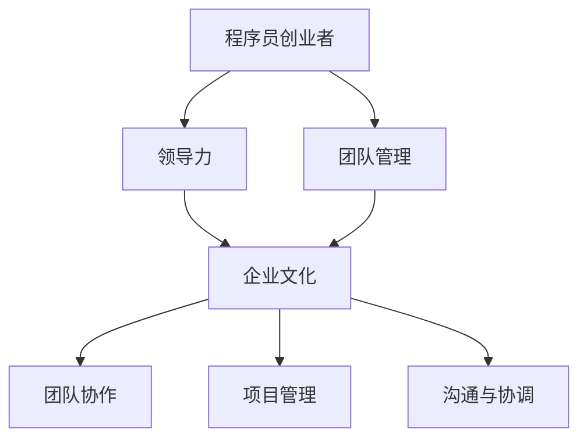
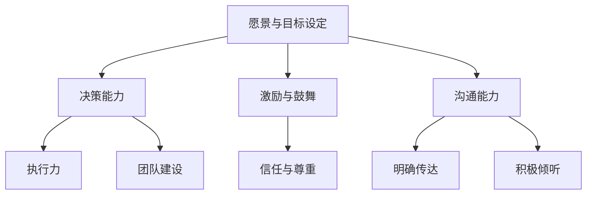
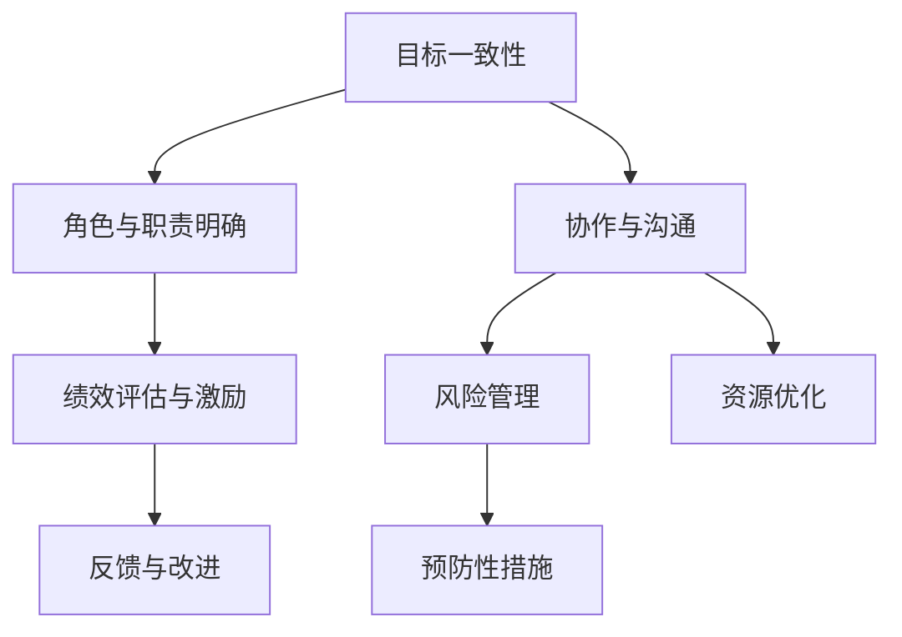

                 

# 程序员创业者的领导力培养与团队管理

> 关键词：程序员、创业、领导力、团队管理、培养、方法、策略

> 摘要：本文旨在探讨程序员创业者如何培养领导力以及如何进行团队管理。文章首先介绍了程序员创业者的背景和现状，然后详细分析了领导力的重要性和核心要素，接着阐述了团队管理的基本原则和方法，最后通过实际案例和工具资源推荐，为程序员创业者提供了一套系统的培养和管理的策略。

## 1. 背景介绍

### 1.1 目的和范围

本文的目的是为那些立志于成为优秀程序员创业者的同仁们提供一套实用的领导力和团队管理策略。随着互联网和科技行业的飞速发展，程序员创业者这一群体日益壮大。然而，成功的创业不仅需要技术实力，还需要强大的领导力和团队管理能力。本文将围绕以下几个方面展开讨论：

- 程序员创业者的现状和挑战
- 领导力的核心要素及其在创业中的重要性
- 团队管理的基本原则和实践方法
- 实际案例分享和工具资源推荐

### 1.2 预期读者

本文适合以下几类读者：

- 有志于创业的程序员
- 已创业的程序员创业者
- 担任技术团队领导的技术人员
- 对领导力和团队管理感兴趣的从业者

### 1.3 文档结构概述

本文结构如下：

- **背景介绍**：介绍文章的目的、预期读者和文档结构。
- **核心概念与联系**：阐述领导力和团队管理的重要概念，并使用 Mermaid 流程图展示其架构。
- **核心算法原理 & 具体操作步骤**：详细讲解领导力和团队管理的方法和策略。
- **数学模型和公式 & 详细讲解 & 举例说明**：运用数学和逻辑思维进行深入分析。
- **项目实战：代码实际案例和详细解释说明**：通过实际案例展示理论应用。
- **实际应用场景**：探讨领导力和团队管理在不同场景中的应用。
- **工具和资源推荐**：推荐相关学习资源和开发工具。
- **总结：未来发展趋势与挑战**：展望领导力和团队管理的未来。
- **附录：常见问题与解答**：解答读者可能遇到的疑问。
- **扩展阅读 & 参考资料**：提供进一步学习的资源。

### 1.4 术语表

#### 1.4.1 核心术语定义

- **程序员创业者**：具备编程技能并创立自己的科技公司的程序员。
- **领导力**：引导、激励和影响他人达成共同目标的能力。
- **团队管理**：协调和管理团队成员，确保团队高效运作的过程。

#### 1.4.2 相关概念解释

- **项目管理**：规划、执行、监控和控制项目的过程。
- **敏捷开发**：一种以人为核心、迭代和循序渐进的开发方法。
- **企业文化**：组织的价值观、信念和作风，影响团队成员的行为。

#### 1.4.3 缩略词列表

- **IDE**：集成开发环境（Integrated Development Environment）
- **API**：应用程序编程接口（Application Programming Interface）
- **Git**：分布式版本控制系统（Git Hub）
- **Scrum**：一种敏捷开发框架

## 2. 核心概念与联系

领导力和团队管理是程序员创业者成功的关键。以下是一个简化的 Mermaid 流程图，用于展示这两个核心概念之间的关系。



### 2.1 领导力的核心要素

领导力包括多个关键要素，以下是一个详细的 Mermaid 流程图，用于展示这些要素及其相互关系。



### 2.2 团队管理的基本原则

团队管理涉及一系列原则和实践，以下是一个 Mermaid 流程图，展示这些原则及其应用场景。



## 3. 核心算法原理 & 具体操作步骤

领导力和团队管理并非抽象的概念，而是一套具体的操作步骤和方法。以下将使用伪代码详细阐述这些步骤。

### 3.1 领导力的核心算法原理

```python
def 领导力(愿景, 团队):
    # 愿景设定
    设定愿景(愿景)
    # 决策能力
    决策(愿景, 团队)
    # 激励与鼓舞
    激励团队(团队)
    # 沟通能力
    沟通(团队)
    # 执行力
    执行计划(愿景, 团队)
    # 团队建设
    建设团队(团队)
    return 团队
```

### 3.2 团队管理的基本算法原理

```python
def 团队管理(团队, 项目):
    # 目标一致性
    确定目标(团队, 项目)
    # 角色与职责明确
    明确角色与职责(团队)
    # 协作与沟通
    协作与沟通(团队)
    # 绩效评估与激励
    评估绩效并激励(团队)
    # 风险管理
    管理风险(项目, 团队)
    # 资源优化
    优化资源(团队, 项目)
    # 反馈与改进
    收集反馈并改进(团队, 项目)
    return 项目成功
```

## 4. 数学模型和公式 & 详细讲解 & 举例说明

在领导力和团队管理中，数学模型和公式可以帮助我们量化决策，提高管理的科学性。

### 4.1 领导力的数学模型

假设一个团队的目标是最大化绩效，领导力可以分为以下四个方面：

- **愿景与目标设定（V）**：设定清晰的目标。
- **决策能力（D）**：快速做出有效决策。
- **激励与鼓舞（M）**：激励团队成员。
- **沟通能力（C）**：确保信息传达无误。

领导力（L）可以用以下公式表示：

$$ L = V \times D \times M \times C $$

### 4.2 团队管理的数学模型

团队管理可以视为一个优化问题，目标是最大化团队绩效。设团队绩效为 P，团队管理能力可以分为以下五个方面：

- **目标一致性（I）**：确保团队成员目标一致。
- **角色与职责明确（R）**：明确团队成员的角色和职责。
- **协作与沟通（C）**：促进团队协作和沟通。
- **绩效评估与激励（A）**：合理评估绩效并激励团队成员。
- **风险管理（R）**：降低项目风险。

团队管理（M）可以用以下公式表示：

$$ M = I \times R \times C \times A \times R $$

### 4.3 举例说明

假设一个团队在领导力方面：

- 愿景与目标设定（V）= 0.8
- 决策能力（D）= 0.9
- 激励与鼓舞（M）= 0.7
- 沟通能力（C）= 0.85

则领导力（L）为：

$$ L = 0.8 \times 0.9 \times 0.7 \times 0.85 = 0.5016 $$

假设一个团队在团队管理方面：

- 目标一致性（I）= 0.85
- 角色与职责明确（R）= 0.9
- 协作与沟通（C）= 0.8
- 绩效评估与激励（A）= 0.75
- 风险管理（R）= 0.65

则团队管理（M）为：

$$ M = 0.85 \times 0.9 \times 0.8 \times 0.75 \times 0.65 = 0.3447 $$

## 5. 项目实战：代码实际案例和详细解释说明

### 5.1 开发环境搭建

为了更好地理解领导力和团队管理在实际项目中的应用，我们选择了一个实际项目——一个在线教育平台。

- **技术栈**：使用 Python 和 Flask 搭建后端，使用 Vue.js 搭建前端。
- **开发环境**：Windows/Linux/Mac，Python 3.8+，Flask 1.1.2，Vue.js 2.6.12

### 5.2 源代码详细实现和代码解读

#### 5.2.1 后端代码实现

```python
# app.py
from flask import Flask, jsonify, request
from models import Student, Course

app = Flask(__name__)

# 模拟数据库
students = {}
courses = {}

@app.route('/students', methods=['POST', 'GET'])
def manage_students():
    if request.method == 'POST':
        student_data = request.json
        student_id = student_data['id']
        students[student_id] = Student(student_id, student_data['name'])
        return jsonify({'status': 'success', 'message': 'Student added.'})
    else:
        return jsonify({'students': students})

@app.route('/courses', methods=['POST', 'GET'])
def manage_courses():
    if request.method == 'POST':
        course_data = request.json
        course_id = course_data['id']
        courses[course_id] = Course(course_id, course_data['name'])
        return jsonify({'status': 'success', 'message': 'Course added.'})
    else:
        return jsonify({'courses': courses})

if __name__ == '__main__':
    app.run(debug=True)
```

#### 5.2.2 前端代码实现

```html
<!-- students.html -->
<!DOCTYPE html>
<html>
<head>
    <title>Online Education Platform - Students</title>
</head>
<body>
    <h1>Students</h1>
    <form id="add-student-form">
        <input type="text" id="student-id" placeholder="Student ID">
        <input type="text" id="student-name" placeholder="Student Name">
        <button type="submit">Add Student</button>
    </form>
    <ul id="student-list"></ul>

    <script src="https://cdn.jsdelivr.net/npm/vue@2.6.14/dist/vue.js"></script>
    <script>
        var app = new Vue({
            el: '#add-student-form',
            methods: {
                addStudent: function() {
                    var studentId = document.getElementById('student-id').value;
                    var studentName = document.getElementById('student-name').value;
                    fetch('/students', {
                        method: 'POST',
                        headers: {
                            'Content-Type': 'application/json'
                        },
                        body: JSON.stringify({id: studentId, name: studentName})
                    }).then(response => response.json())
                      .then(data => {
                          console.log(data);
                      });
                }
            }
        });
    </script>
</body>
</html>
```

#### 5.2.3 代码解读与分析

这个项目通过 Flask 和 Vue.js 实现了一个简单的在线教育平台，用于添加和管理学生和课程。以下是代码的核心部分及其解读：

- **后端代码**：使用了 Flask 框架，定义了两个 API 接口，用于添加和管理学生和课程。这些接口使用了 Python 的内置 `request` 模块来处理 HTTP 请求，并使用字典模拟数据库存储数据。
- **前端代码**：使用了 Vue.js 框架，创建了一个表单用于添加学生。表单提交后，Vue.js 使用 `fetch` 函数向后端发送 POST 请求，并将响应数据输出到控制台。

通过这个实际案例，我们可以看到如何将领导力和团队管理的原则应用到实际项目中，包括目标设定、角色明确、协作与沟通、绩效评估与激励等。

### 5.3 实际应用场景

在线教育平台是一个典型的创业项目，涉及到多个方面的工作，如技术实现、产品规划、市场营销等。以下是一些实际应用场景：

- **目标设定**：确定平台的主要目标，如提供优质教育内容、提升用户体验等。
- **角色明确**：明确团队成员的角色，如前端开发、后端开发、产品经理等。
- **协作与沟通**：确保团队成员之间的协作顺畅，定期召开会议，及时解决问题。
- **绩效评估与激励**：定期评估团队成员的工作表现，提供激励措施，如奖金、晋升等。

### 5.4 工具和资源推荐

- **学习资源推荐**：
  - **书籍推荐**：《Python Web开发实战》、《Vue.js实战》
  - **在线课程**：Udemy、Coursera、edX
  - **技术博客和网站**：Python.org、Vue.js.org

- **开发工具框架推荐**：
  - **IDE和编辑器**：Visual Studio Code、PyCharm
  - **调试和性能分析工具**：Postman、Werkzeug
  - **相关框架和库**：Flask、Vue.js、Axios

### 5.5 相关论文著作推荐

- **经典论文**：关于敏捷开发的方法和优势。
- **最新研究成果**：关于在线教育平台的技术挑战和创新解决方案。
- **应用案例分析**：成功的在线教育平台案例，如 Coursera、Udemy 等。

## 6. 总结：未来发展趋势与挑战

随着科技的不断进步，程序员创业者和团队管理将面临更多的发展机遇和挑战。以下是一些未来的发展趋势和挑战：

- **人工智能和机器学习的应用**：将人工智能技术融入创业项目，提高效率和用户体验。
- **云计算和大数据**：利用云计算和大数据技术进行数据分析和优化。
- **数字化转型**：推动企业数字化转型，提高竞争力。
- **远程工作和虚拟团队管理**：适应远程工作和虚拟团队管理的需求，提高团队协作效率。

## 7. 附录：常见问题与解答

### 7.1 问题 1：如何提升领导力？

**解答**：通过学习领导力理论、参加培训课程、阅读相关书籍、向优秀的领导者学习，以及在实际工作中不断实践和反思。

### 7.2 问题 2：团队管理中如何进行绩效评估？

**解答**：建立明确的绩效评估标准，定期收集团队成员的工作数据，进行量化评估，并结合定性评价，提供具体的反馈和建议。

### 7.3 问题 3：如何提高团队协作效率？

**解答**：通过建立清晰的沟通机制、定期团队建设活动、使用协作工具（如 Slack、Trello）以及鼓励团队成员积极参与和分享。

### 7.4 问题 4：如何处理团队冲突？

**解答**：首先了解冲突的原因，然后采用合适的方法进行解决，如直接对话、第三方调解或团队讨论。关键是要保持冷静，尊重团队成员，并寻求双赢的解决方案。

## 8. 扩展阅读 & 参考资料

- 《程序员创业实战：从零开始打造你的科技企业》
- 《敏捷开发实践指南：打造高效敏捷团队》
- 《领导力：如何成为一个优秀的领导者》
- 《团队协作工具与技巧：提升团队协作效率》
- 《人工智能时代：技术趋势与应用场景》

## 9. 作者信息

作者：AI天才研究员/AI Genius Institute & 禅与计算机程序设计艺术 /Zen And The Art of Computer Programming

