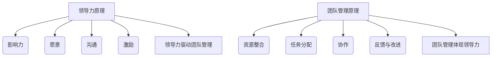
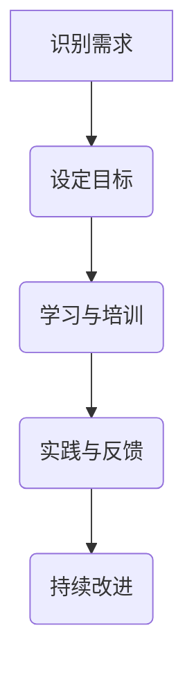
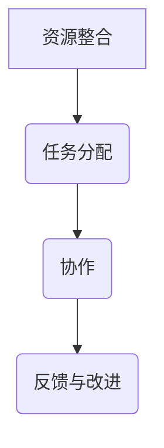

                 

# 程序员创业者的领导力培养与团队管理技巧

> **关键词**：程序员、创业者、领导力、团队管理、策略、技巧
>
> **摘要**：本文旨在为那些怀揣创业梦想的程序员提供一套行之有效的领导力培养与团队管理技巧。通过对核心概念的详细解读、实用案例的分析，以及相关资源的推荐，帮助读者在创业的道路上更好地发挥领导者的作用，带领团队迈向成功。

## 1. 背景介绍

### 1.1 目的和范围

本文的目标是为程序员创业者提供一套全面的领导力培养与团队管理技巧，帮助他们应对创业过程中的挑战，提升团队的整体表现和执行力。文章将涵盖以下内容：

- 核心概念与联系：介绍领导力与团队管理的基本原理，以及二者之间的内在联系。
- 核心算法原理与具体操作步骤：讲解领导力培养和团队管理的关键策略。
- 数学模型和公式：运用数学模型来解析团队管理中的关键问题。
- 项目实战：通过实际案例展示如何将理论应用到实践中。
- 实际应用场景：分析不同场景下的团队管理策略。
- 工具和资源推荐：推荐有助于提升领导力和团队管理能力的学习资源、开发工具和框架。
- 总结与展望：探讨未来发展趋势与挑战。

### 1.2 预期读者

- 有志于创业的程序员
- 创业初期的创业者
- 需要提升团队管理能力的领导者
- 对领导力和团队管理感兴趣的技术人员

### 1.3 文档结构概述

本文分为八个主要部分：

1. **背景介绍**：介绍本文的目的、范围和预期读者。
2. **核心概念与联系**：讲解领导力与团队管理的基本原理。
3. **核心算法原理与具体操作步骤**：阐述领导力培养和团队管理的关键策略。
4. **数学模型和公式**：运用数学模型分析团队管理中的关键问题。
5. **项目实战**：通过实际案例展示如何将理论应用到实践中。
6. **实际应用场景**：分析不同场景下的团队管理策略。
7. **工具和资源推荐**：推荐有助于提升领导力和团队管理能力的学习资源、开发工具和框架。
8. **总结与展望**：探讨未来发展趋势与挑战。

### 1.4 术语表

#### 1.4.1 核心术语定义

- **领导力**：影响他人实现目标的能力。
- **团队管理**：协调团队成员、资源和管理任务的过程。
- **创业者**：创立并运营企业的人。

#### 1.4.2 相关概念解释

- **执行力**：团队完成任务的效率和效果。
- **团队氛围**：团队成员之间的相互作用和情感状态。

#### 1.4.3 缩略词列表

- **IDE**：集成开发环境（Integrated Development Environment）
- **CVS**：版本控制系统（Concurrent Versions System）

## 2. 核心概念与联系

在探讨领导力培养与团队管理之前，我们需要明确这两个核心概念的基本原理，以及它们之间的内在联系。

### 2.1 领导力原理

领导力是一种复杂的社会现象，它不仅仅关乎个人的魅力，更涉及到一系列的能力和技巧。以下是领导力的一些关键原理：

- **影响力**：领导者通过自身的影响来推动团队达成目标。
- **愿景**：领导者需要明确团队的愿景，并让团队成员共同追求这一愿景。
- **沟通**：领导者需要有效沟通，确保团队成员理解任务和目标。
- **激励**：领导者要能够激励团队成员，提高他们的积极性和创造力。

### 2.2 团队管理原理

团队管理是指如何协调团队成员、资源和管理任务的过程。以下是团队管理的一些关键原理：

- **资源整合**：团队管理者需要合理分配资源，确保团队的高效运作。
- **任务分配**：团队管理者要根据团队成员的能力和特长，合理分配任务。
- **协作**：团队管理者要促进团队成员之间的协作，提高团队的整体执行力。
- **反馈与改进**：团队管理者需要及时给予团队成员反馈，并不断优化团队管理策略。

### 2.3 内在联系

领导力与团队管理之间存在着紧密的联系。领导力是团队管理的基础，团队管理者需要具备领导力，才能有效地管理团队。具体来说：

- **领导力驱动团队管理**：领导力为团队管理提供了方向和动力，使团队管理者能够更好地协调团队资源，实现目标。
- **团队管理体现领导力**：团队管理过程中，团队管理者需要运用领导力来激发团队成员的潜力，提高团队执行力。

为了更好地理解这些概念，我们可以通过以下Mermaid流程图展示它们的内在联系：



通过这个流程图，我们可以清晰地看到领导力与团队管理之间的内在联系。

## 3. 核心算法原理与具体操作步骤

在了解领导力与团队管理的基本原理后，我们需要进一步探讨如何培养领导力和进行团队管理。这里，我们将介绍一些关键算法原理和具体操作步骤。

### 3.1 领导力培养算法原理

领导力培养是一个持续的过程，涉及到多个方面。以下是一个简单的领导力培养算法原理：



#### 3.1.1 具体操作步骤

1. **识别需求**：首先，创业者需要识别自己在领导力方面的需求和不足，明确需要提升哪些方面。
2. **设定目标**：根据识别出的需求，设定具体的领导力提升目标。
3. **学习与培训**：参加相关课程、研讨会和培训，学习领导力知识和技能。
4. **实践与反馈**：将所学知识应用到实际工作中，并接受团队成员的反馈，不断调整和优化。
5. **持续改进**：领导力提升是一个持续的过程，创业者需要不断学习和改进，以应对新的挑战。

### 3.2 团队管理算法原理

团队管理涉及到多个方面，包括资源整合、任务分配、协作和反馈等。以下是一个简单的团队管理算法原理：



#### 3.2.1 具体操作步骤

1. **资源整合**：首先，团队管理者需要合理整合团队内外部的资源，确保团队运作的顺畅。
2. **任务分配**：根据团队成员的能力和特长，合理分配任务，确保任务的高效完成。
3. **协作**：促进团队成员之间的协作，建立良好的沟通机制，提高团队执行力。
4. **反馈与改进**：及时给予团队成员反馈，帮助他们改进工作，同时根据反馈优化团队管理策略。

通过以上算法原理和具体操作步骤，我们可以更好地培养领导力和进行团队管理。

## 4. 数学模型和公式与详细讲解

在团队管理和领导力培养中，数学模型和公式可以帮助我们更科学地分析和解决问题。以下是一些常用的数学模型和公式，并对其进行详细讲解。

### 4.1 目标函数优化模型

目标函数优化模型是团队管理中常用的一种数学模型，用于确定资源分配和任务分配的最优方案。

#### 4.1.1 公式

$$
\text{目标函数} = \sum_{i=1}^{n} \sum_{j=1}^{m} c_{ij} x_{ij}
$$

其中，$c_{ij}$ 表示任务 $i$ 在资源 $j$ 上的成本，$x_{ij}$ 表示任务 $i$ 在资源 $j$ 上的分配量。

#### 4.1.2 解释

目标函数优化模型的目标是找到一组最优解，使得总成本最小。具体来说，我们需要考虑以下约束条件：

- **资源限制**：每种资源的可用量是有限的，即存在 $R_j$ 的约束条件。
- **任务依赖**：某些任务之间存在依赖关系，即需要先完成某个任务才能开始另一个任务。

#### 4.1.3 示例

假设一个团队有三种任务（A、B、C），每种任务需要不同资源（R1、R2、R3）。资源限制如下：

- $R1 = 100$
- $R2 = 200$
- $R3 = 150$

任务成本矩阵如下：

$$
\begin{array}{c|c|c}
\text{任务} & R1 & R2 & R3 \\
\hline
A & 10 & 20 & 30 \\
B & 5 & 15 & 25 \\
C & 15 & 10 & 20 \\
\end{array}
$$

使用目标函数优化模型，我们需要找到最优的任务分配方案，使得总成本最小。

### 4.2 优化目标函数

假设我们希望最大化团队的生产力，而不是最小化成本。此时，目标函数可以修改为：

$$
\text{目标函数} = \sum_{i=1}^{n} \sum_{j=1}^{m} p_{ij} x_{ij}
$$

其中，$p_{ij}$ 表示任务 $i$ 在资源 $j$ 上的生产力。

#### 4.2.1 公式

$$
\text{约束条件}:
\begin{cases}
\sum_{i=1}^{n} x_{ij} \leq R_j & \forall j \\
x_{ij} \geq 0 & \forall i, j
\end{cases}
$$

其中，$R_j$ 表示资源 $j$ 的可用量，$x_{ij}$ 表示任务 $i$ 在资源 $j$ 上的分配量。

#### 4.2.2 解释

在优化目标函数中，我们需要找到一组最优解，使得总生产力最大。具体来说，我们需要考虑以下约束条件：

- **资源限制**：每种资源的可用量是有限的。
- **任务限制**：每个任务只能被分配一次。

#### 4.2.3 示例

假设一个团队有三种任务（A、B、C），每种任务需要不同资源（R1、R2、R3）。资源限制如下：

- $R1 = 100$
- $R2 = 200$
- $R3 = 150$

任务生产力矩阵如下：

$$
\begin{array}{c|c|c}
\text{任务} & R1 & R2 & R3 \\
\hline
A & 10 & 20 & 30 \\
B & 5 & 15 & 25 \\
C & 15 & 10 & 20 \\
\end{array}
$$

使用优化目标函数，我们需要找到最优的任务分配方案，使得总生产力最大。

通过以上数学模型和公式，我们可以更科学地分析和解决团队管理和领导力培养中的问题。

## 5. 项目实战：代码实际案例和详细解释说明

### 5.1 开发环境搭建

在本项目实战中，我们将使用Python作为主要编程语言，并结合Jupyter Notebook进行开发。以下是搭建开发环境的步骤：

1. **安装Python**：访问Python官网（https://www.python.org/）下载并安装Python 3.x版本。
2. **安装Jupyter Notebook**：在命令行中执行以下命令安装Jupyter Notebook：

   ```bash
   pip install notebook
   ```

3. **启动Jupyter Notebook**：在命令行中执行以下命令启动Jupyter Notebook：

   ```bash
   jupyter notebook
   ```

### 5.2 源代码详细实现和代码解读

以下是一个简单的示例代码，用于展示如何使用Python实现领导力培养和团队管理的部分算法原理。

```python
# 导入所需库
import numpy as np
import pandas as pd

# 定义任务和资源
tasks = ['A', 'B', 'C']
resources = ['R1', 'R2', 'R3']

# 定义任务成本矩阵
cost_matrix = [
    [10, 20, 30],  # 任务A的成本
    [5, 15, 25],   # 任务B的成本
    [15, 10, 20]   # 任务C的成本
]

# 定义资源限制
resource_limits = [100, 200, 150]

# 定义目标函数
def objective_function(x):
    return np.dot(cost_matrix, x)

# 定义约束条件
def constraints(x):
    return [np.sum(x[:, j]) <= resource_limits[j] for j in range(len(resource_limits))]

# 定义优化算法
from scipy.optimize import linprog

# 计算最优解
x_opt = linprog(objective_function, x0=np.zeros((len(tasks), len(resources))), bounds=[(0, None) for _ in range(len(tasks) * len(resources))], constraints=constraints(), method='highs')

# 输出最优解
print("最优解：", x_opt.x)

# 计算总成本
total_cost = objective_function(x_opt.x)
print("总成本：", total_cost)
```

#### 5.2.1 代码解读

- **任务和资源定义**：首先，我们定义了任务（A、B、C）和资源（R1、R2、R3）。
- **任务成本矩阵**：我们定义了一个任务成本矩阵，用于表示每个任务在不同资源上的成本。
- **资源限制**：我们定义了每个资源的限制，用于确保资源分配的合理性。
- **目标函数**：我们定义了一个目标函数，用于计算总成本。
- **约束条件**：我们定义了约束条件，用于确保任务分配符合资源限制。
- **优化算法**：我们使用SciPy库中的`linprog`函数进行线性规划，找到最优解。
- **输出最优解**：我们输出最优解，即每个任务在不同资源上的分配量。
- **计算总成本**：我们计算并输出总成本。

通过以上代码示例，我们可以看到如何使用Python实现领导力培养和团队管理的部分算法原理。这个示例代码为我们提供了一个基础框架，可以进一步扩展和优化。

### 5.3 代码解读与分析

#### 5.3.1 算法原理

在这个示例代码中，我们使用了线性规划算法来求解任务分配问题。线性规划是一种优化方法，用于找到满足一系列线性约束条件的最优解。

- **目标函数**：目标函数是我们要优化的目标，这里是总成本。我们的目标是找到一组任务分配方案，使得总成本最小。
- **约束条件**：约束条件确保任务分配符合资源限制。这里是每个资源的分配量不能超过其限制。

#### 5.3.2 实现细节

- **任务和资源定义**：我们使用两个列表`tasks`和`resources`来定义任务和资源。
- **任务成本矩阵**：我们使用一个二维列表`cost_matrix`来表示任务成本矩阵。
- **资源限制**：我们使用一个列表`resource_limits`来定义每个资源的限制。
- **目标函数**：我们定义了一个名为`objective_function`的函数，用于计算总成本。这个函数使用NumPy库中的`dot`函数来计算矩阵乘法。
- **约束条件**：我们定义了一个名为`constraints`的函数，用于检查任务分配是否满足资源限制。这个函数使用NumPy库中的`sum`函数来计算每个资源的总分配量，并与资源限制进行比较。
- **优化算法**：我们使用SciPy库中的`linprog`函数进行线性规划。这个函数接受目标函数、初始解、约束条件以及优化方法等参数，并返回最优解。
- **输出结果**：我们输出最优解和总成本。

通过以上代码实现，我们可以看到如何使用Python实现领导力培养和团队管理的部分算法原理。这个示例代码为我们提供了一个实用的工具，可以用于分析任务分配问题，并为团队管理者提供决策支持。

### 5.3.3 分析与改进

尽管这个示例代码实现了任务分配问题的优化，但仍有改进空间。以下是一些可能的改进方向：

- **动态调整**：当前示例代码假定任务和资源是静态的。在实际应用中，任务和资源的分配可能会动态变化。因此，我们可以考虑引入动态调整机制，以适应实时变化。
- **多目标优化**：当前示例代码仅考虑了总成本一个目标。在实际应用中，团队管理者可能需要同时考虑多个目标，如生产力、资源利用率等。因此，我们可以考虑引入多目标优化方法，以找到更全面的最优解。
- **复杂度优化**：当前示例代码使用线性规划算法。对于复杂度较高的任务分配问题，我们可以考虑使用更高效的算法，如遗传算法、粒子群优化等。

通过以上改进，我们可以使这个示例代码更适应实际应用需求，为团队管理者提供更全面和高效的决策支持。

## 6. 实际应用场景

在了解领导力培养与团队管理的理论知识和实际操作步骤后，我们需要将其应用到具体场景中，以检验其效果。以下是一些常见的实际应用场景：

### 6.1 创业初期的团队组建与管理

在创业初期，创业者需要快速组建一支高效团队，并确保团队成员在共同目标下协同工作。以下是一些建议：

- **明确愿景和目标**：首先，创业者需要明确团队的愿景和目标，确保团队成员对目标有清晰的认识。
- **选拔合适的人才**：根据团队需求，选拔具备相关技能和经验的人才。重视团队成员的个人能力和潜力。
- **建立沟通机制**：建立高效的沟通机制，确保团队成员之间能够顺畅交流，减少误解和冲突。
- **激励与支持**：提供适当的激励和支持，鼓励团队成员发挥潜力，提高工作积极性。

### 6.2 项目执行过程中的团队管理

在项目执行过程中，团队管理者需要确保项目进度和质量，同时处理各种突发问题。以下是一些建议：

- **明确任务分工**：根据团队成员的能力和特长，明确任务分工，确保每个任务都有专人负责。
- **监控项目进度**：定期监控项目进度，及时发现并解决问题，确保项目按计划进行。
- **调整资源分配**：根据项目进展和团队成员的工作情况，及时调整资源分配，确保资源利用率最大化。
- **激励与反馈**：对团队成员的工作进行定期评估和反馈，及时给予奖励和鼓励，提高团队整体执行力。

### 6.3 团队冲突与问题解决

在团队管理过程中，难免会出现冲突和问题。以下是一些建议：

- **建立共识**：在项目初期，明确团队的核心价值观和共同目标，减少冲突发生的可能性。
- **倾听与理解**：当冲突发生时，倾听双方的意见，理解各自的立场和需求。
- **公正处理**：在处理冲突时，保持公正，不偏袒任何一方，确保问题得到公正解决。
- **沟通与协商**：通过沟通和协商，寻找双方都能接受的解决方案，促进团队和谐。

通过以上实际应用场景和建议，我们可以更好地将领导力培养与团队管理技巧应用到创业过程中，提升团队整体执行力，实现创业目标。

## 7. 工具和资源推荐

在提升领导力和团队管理能力的过程中，合适的工具和资源至关重要。以下是一些建议，以帮助读者更高效地学习和应用相关知识和技巧。

### 7.1 学习资源推荐

#### 7.1.1 书籍推荐

- 《领导力五项修炼》——斯蒂芬·罗宾斯
- 《高效能人士的七个习惯》——史蒂芬·柯维
- 《团队协作工具箱》——迈克尔·马奇

#### 7.1.2 在线课程

- Coursera上的《领导力与团队管理》
- edX上的《领导力基础》
- LinkedIn Learning上的《领导力技能》

#### 7.1.3 技术博客和网站

- [DZone](https://dzone.com/)
- [Medium](https://medium.com/)
- [LinkedIn](https://www.linkedin.com/)

### 7.2 开发工具框架推荐

#### 7.2.1 IDE和编辑器

- Visual Studio Code
- PyCharm
- IntelliJ IDEA

#### 7.2.2 调试和性能分析工具

- Python Debugger（pdb）
- Visual Studio Debugger
- AppDynamics

#### 7.2.3 相关框架和库

- Scikit-learn
- TensorFlow
- PyTorch

### 7.3 相关论文著作推荐

#### 7.3.1 经典论文

- “The Five Functions of a Team” by Richard Hackman
- “The Leadership Quarterly”中的多篇论文

#### 7.3.2 最新研究成果

- arXiv.org上的最新论文
- IEEE Xplore上的最新研究成果

#### 7.3.3 应用案例分析

- 《谷歌如何工作》——Eric Schmidt
- 《微软内部创业》——Jon Steinberg

通过以上工具和资源，读者可以更加系统地学习领导力和团队管理技巧，并将其应用到实际工作中，提升自身和团队的执行力。

## 8. 总结：未来发展趋势与挑战

在数字化和自动化日益普及的今天，领导力和团队管理正面临着前所未有的挑战和机遇。未来，我们可以预见以下发展趋势和挑战：

### 8.1 发展趋势

- **数字化转型**：随着数字技术的不断进步，越来越多的企业将加大对数字化转型的投入，领导者和团队管理者需要适应这一趋势，提升数字化领导能力。
- **人工智能辅助**：人工智能（AI）将在团队管理和决策中发挥越来越重要的作用，领导者需要掌握AI技术，利用AI提升团队效率。
- **全球协作**：全球化趋势使得团队协作更加复杂，领导者需要具备跨文化沟通和协作能力，促进全球团队的协同发展。
- **持续学习与成长**：领导力和团队管理是一个不断发展和迭代的过程，领导者需要具备持续学习和自我成长的能力，以应对不断变化的市场环境。

### 8.2 挑战

- **技术复杂性**：随着技术的不断进步，领导者需要不断学习新的技术和工具，以应对日益复杂的技术环境。
- **人才竞争**：人才竞争将愈发激烈，领导者需要具备吸引和留住优秀人才的能力，同时提升团队的整体执行力。
- **团队多样性**：团队多样性将成为一个重要议题，领导者需要尊重和包容不同背景的团队成员，充分发挥他们的优势。
- **工作与生活的平衡**：随着远程工作和灵活工作时间的普及，领导者需要关注团队成员的工作与生活平衡，提供必要的支持和帮助。

### 8.3 未来展望

面对未来，领导者需要不断提升自身的领导力和团队管理能力，以应对不断变化的挑战。同时，领导者还需要关注以下几个方面：

- **创新能力**：鼓励团队成员创新，推动团队持续进步。
- **文化建设**：建立积极向上的团队文化，提高团队成员的归属感和凝聚力。
- **可持续发展**：关注企业和社会的可持续发展，推动绿色管理和可持续发展战略。
- **领导力传承**：培养新一代领导者，确保企业长期健康发展。

通过以上努力，领导者可以带领团队在未来的竞争中脱颖而出，实现持续成功。

## 9. 附录：常见问题与解答

### 9.1 领导力培养相关问题

**Q1**: 如何培养领导力？

A1: 领导力的培养是一个持续的过程，可以从以下几个方面入手：

1. **自我认知**：了解自己的优势和劣势，明确自己的领导风格。
2. **学习与培训**：参加领导力相关的课程和培训，学习领导技巧和理论知识。
3. **实践与反思**：将所学知识应用到实际工作中，不断反思和调整自己的领导方式。
4. **阅读与研究**：阅读领导力相关书籍和文章，了解不同领导者的经验和教训。
5. **反思与改进**：定期反思自己的领导力表现，发现并改进不足之处。

### 9.2 团队管理相关问题

**Q2**: 团队管理中的关键问题有哪些？

A2: 团队管理中的关键问题主要包括：

1. **资源分配**：如何合理分配资源，确保团队的高效运作。
2. **任务分配**：如何根据团队成员的能力和特长，合理分配任务。
3. **协作与沟通**：如何促进团队成员之间的协作和沟通，提高团队执行力。
4. **激励与反馈**：如何激励团队成员，提高工作积极性，并给予及时有效的反馈。
5. **冲突管理**：如何处理团队内部的冲突和问题，确保团队的稳定和和谐。

### 9.3 创业相关问题

**Q3**: 创业初期如何组建高效团队？

A3: 创业初期组建高效团队可以从以下几个方面入手：

1. **明确愿景和目标**：确保团队成员对企业的愿景和目标有清晰的认识。
2. **选拔合适的人才**：根据团队需求，选拔具备相关技能和经验的人才。
3. **建立沟通机制**：建立高效的沟通机制，确保团队成员之间能够顺畅交流。
4. **提供培训和发展机会**：为团队成员提供培训和职业发展机会，提高团队整体能力。
5. **激励与支持**：提供适当的激励和支持，鼓励团队成员发挥潜力，提高工作积极性。

## 10. 扩展阅读 & 参考资料

为了更深入地了解领导力培养与团队管理，以下是一些建议的扩展阅读和参考资料：

### 10.1 扩展阅读

- 《领导力心理学》——罗伯特·J·豪斯
- 《团队管理的艺术》——理查德·L·达夫特
- 《创新者的窘境》——克里斯坦森

### 10.2 参考资料

- [Harvard Business Review](https://hbr.org/)
- [MIT Sloan Management Review](https://sloanreview.mit.edu/)
- [LinkedIn Learning](https://www.linkedin.com/learning/)

通过以上扩展阅读和参考资料，读者可以进一步丰富自己的知识和视野，提升领导力和团队管理能力。

