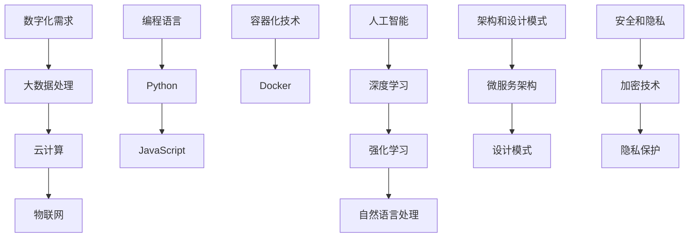
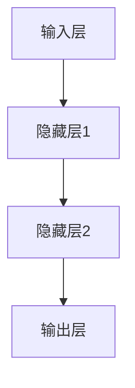
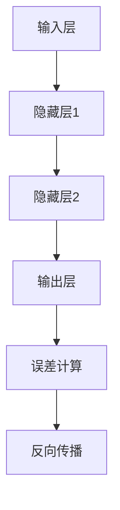

                 

# 程序员在知识经济时代的发展趋势与机遇

> 关键词：知识经济，程序员，人工智能，数字化，技能提升，职业发展

> 摘要：本文将探讨在知识经济时代，程序员如何应对发展趋势和抓住机遇。我们将从背景介绍、核心概念、算法原理、数学模型、项目实战、实际应用场景等多个角度进行分析，为程序员提供明确的职业发展路径和实用技能提升策略。

## 1. 背景介绍

### 1.1 目的和范围

本文旨在帮助程序员理解知识经济时代的发展趋势，并探索相应的职业发展机会。我们将重点讨论以下几个方面：

- 知识经济的定义及其对程序员职业的影响
- 程序员的核心技能和知识架构
- 知识经济时代的技术发展和应用
- 程序员如何利用新工具和资源提升自身能力
- 未来发展趋势和潜在挑战

### 1.2 预期读者

本文适合以下读者群体：

- 初级程序员，希望了解行业发展趋势
- 中级程序员，希望提升自身技能和职业竞争力
- 高级程序员和团队领导者，关注技术前沿和团队管理
- 对编程和人工智能感兴趣的从业者

### 1.3 文档结构概述

本文的结构如下：

- 背景介绍：概述知识经济的定义和程序员面临的机会与挑战
- 核心概念与联系：介绍程序员需要掌握的关键技术和概念
- 核心算法原理 & 具体操作步骤：详细讲解编程算法原理和实现
- 数学模型和公式 & 详细讲解 & 举例说明：探讨数学模型在编程中的应用
- 项目实战：代码实际案例和详细解释说明
- 实际应用场景：分析程序员在各个领域的实际应用案例
- 工具和资源推荐：推荐学习资源和开发工具
- 总结：未来发展趋势与挑战

### 1.4 术语表

#### 1.4.1 核心术语定义

- **知识经济**：以知识和信息为核心的经济形态，强调创新、技术和智力资源的重要性。
- **程序员**：从事编程和软件开发工作的专业人员。
- **人工智能**：模拟、延伸和扩展人类智能的理论、方法、技术及应用系统。

#### 1.4.2 相关概念解释

- **数字化**：将现实世界的信息转化为数字形式进行处理。
- **算法**：解决问题的一系列规则或步骤。
- **框架**：为特定任务提供结构和标准的软件库。

#### 1.4.3 缩略词列表

- **AI**：人工智能
- **ML**：机器学习
- **DL**：深度学习
- **API**：应用程序接口
- **IDE**：集成开发环境

## 2. 核心概念与联系

在知识经济时代，程序员需要掌握一系列核心概念和技术，以应对不断变化的市场需求。以下是这些概念和它们之间的联系：

### 2.1.1 数字化时代的技术需求

- **大数据处理**：利用分布式计算和存储技术处理海量数据。
- **云计算**：利用远程服务器和网络资源提供计算和存储服务。
- **物联网**：将物理设备互联，实现智能管理和控制。

### 2.1.2 编程语言和工具

- **Python**：一种通用编程语言，广泛应用于数据科学、机器学习等领域。
- **JavaScript**：前端开发语言，用于创建动态网页和交互式应用。
- **Docker**：容器化技术，用于简化应用程序的部署和运行。

### 2.1.3 人工智能和机器学习

- **深度学习**：一种基于神经网络的机器学习方法，用于图像识别、自然语言处理等任务。
- **强化学习**：一种通过试错和奖励机制进行决策的学习方法。
- **自然语言处理**：研究如何使计算机理解和处理人类语言。

### 2.1.4 架构和设计模式

- **微服务架构**：将大型应用程序拆分为小型、独立的服务，以提高可扩展性和灵活性。
- **设计模式**：解决常见软件设计问题的经验性解决方案。

### 2.1.5 安全和隐私

- **加密技术**：保护数据传输和存储的安全。
- **隐私保护**：确保用户数据的保密性和完整性。

### 2.1.6 Mermaid 流程图



## 3. 核心算法原理 & 具体操作步骤

### 3.1 深度学习算法原理

深度学习是一种基于多层神经网络的学习方法，它通过模拟人脑神经元的工作方式，从大量数据中自动提取特征。以下是深度学习算法的基本原理和实现步骤：

#### 3.1.1 神经网络结构

深度学习网络通常由多个层次组成，包括输入层、隐藏层和输出层。每层包含多个神经元，每个神经元与其他层神经元相连接。



#### 3.1.2 前向传播与反向传播

- **前向传播**：输入数据通过网络层传递，每个神经元计算出输出值。
- **反向传播**：根据输出值与实际值之间的差异，反向更新网络中的权重和偏置。



#### 3.1.3 伪代码

```python
# 定义神经网络结构
input_layer = InputLayer()
hidden_layer1 = HiddenLayer()
hidden_layer2 = HiddenLayer()
output_layer = OutputLayer()

# 定义损失函数和优化器
loss_function = MeanSquaredError()
optimizer = AdamOptimizer()

# 训练神经网络
for epoch in range(num_epochs):
    for sample in dataset:
        # 前向传播
        output = input_layer.forward(sample)
        hidden_layer1.forward(output)
        hidden_layer2.forward(hidden_layer1.output)
        output_layer.forward(hidden_layer2.output)

        # 计算误差
        error = loss_function.evaluate(output_layer.output, sample.label)

        # 反向传播
        output_layer.backward(error)
        hidden_layer2.backward(output_layer.error)
        hidden_layer1.backward(hidden_layer2.error)
        input_layer.backward(hidden_layer1.error)

        # 更新权重和偏置
        optimizer.update_weights(input_layer)
        optimizer.update_weights(hidden_layer1)
        optimizer.update_weights(hidden_layer2)
        optimizer.update_weights(output_layer)
```

## 4. 数学模型和公式 & 详细讲解 & 举例说明

### 4.1 数学模型

在深度学习中，常用的数学模型包括神经网络模型、损失函数和优化算法。

#### 4.1.1 神经网络模型

神经网络模型由多层神经元组成，每个神经元通过权重和偏置连接到其他神经元。神经网络模型可以用以下公式表示：

$$
z = \sum_{i=1}^{n} w_{i}x_{i} + b
$$

其中，$z$ 是输出值，$w_{i}$ 是权重，$x_{i}$ 是输入值，$b$ 是偏置。

#### 4.1.2 损失函数

损失函数用于衡量预测值与实际值之间的差距。常用的损失函数包括均方误差（MSE）和交叉熵（Cross-Entropy）。均方误差公式如下：

$$
MSE = \frac{1}{2}\sum_{i=1}^{n} (y_{i} - \hat{y}_{i})^{2}
$$

其中，$y_{i}$ 是实际值，$\hat{y}_{i}$ 是预测值。

#### 4.1.3 优化算法

优化算法用于更新网络中的权重和偏置，以最小化损失函数。常用的优化算法包括随机梯度下降（SGD）和Adam优化器。Adam优化器的公式如下：

$$
m = \frac{1}{\beta_{1} + 1} \sum_{t=1}^{T} (x_{t} - x_{t-1})
$$

$$
v = \frac{1}{\beta_{2} + 1} \sum_{t=1}^{T} (x_{t-1} - x_{t-2})
$$

$$
\hat{m} = \frac{m}{1 - \beta_{1}^{T}}
$$

$$
\hat{v} = \frac{v}{1 - \beta_{2}^{T}}
$$

$$
\theta = \theta - \alpha \frac{\hat{m}}{\sqrt{\hat{v}} + \epsilon}
$$

其中，$m$ 是一阶矩估计，$v$ 是二阶矩估计，$\beta_{1}$ 和 $\beta_{2}$ 是动量参数，$\alpha$ 是学习率，$\epsilon$ 是正则项。

### 4.2 举例说明

假设我们有一个二元分类问题，需要预测一个数字是0还是1。使用神经网络模型和均方误差损失函数，我们可以通过以下步骤进行训练：

1. 初始化神经网络结构，设置输入层、隐藏层和输出层的神经元数量。
2. 初始化权重和偏置，设置学习率。
3. 遍历训练数据集，对每个样本执行前向传播和反向传播。
4. 根据损失函数更新权重和偏置。

以下是伪代码实现：

```python
# 初始化神经网络结构
input_layer = InputLayer()
hidden_layer = HiddenLayer()
output_layer = OutputLayer()

# 初始化权重和偏置
weights = np.random.randn(input_layer.size, hidden_layer.size)
biases = np.random.randn(hidden_layer.size)
output_weights = np.random.randn(hidden_layer.size, output_layer.size)
output_biases = np.random.randn(output_layer.size)

# 设置学习率
learning_rate = 0.01

# 训练神经网络
for epoch in range(num_epochs):
    for sample in dataset:
        # 前向传播
        input_data = sample.input_data
        hidden_output = input_layer.forward(input_data)
        output_output = hidden_layer.forward(hidden_output)
        predicted_output = output_layer.forward(output_output)

        # 计算损失
        loss = mean_squared_error(predicted_output, sample.target)

        # 反向传播
        error = predicted_output - sample.target
        output_layer.backward(error)
        hidden_layer.backward(output_layer.error)
        input_layer.backward(hidden_layer.error)

        # 更新权重和偏置
        weights -= learning_rate * hidden_layer.weights_gradient
        biases -= learning_rate * hidden_layer.biases_gradient
        output_weights -= learning_rate * output_layer.weights_gradient
        output_biases -= learning_rate * output_layer.biases_gradient
```

通过以上步骤，我们可以训练出一个能够预测二元分类问题的神经网络模型。

## 5. 项目实战：代码实际案例和详细解释说明

### 5.1 开发环境搭建

为了进行项目实战，我们需要搭建一个合适的技术环境。以下是一个基于Python和TensorFlow的简单示例：

1. 安装Python（3.8及以上版本）。
2. 安装TensorFlow库。

```bash
pip install tensorflow
```

### 5.2 源代码详细实现和代码解读

以下是实现一个简单的线性回归问题的源代码：

```python
import tensorflow as tf
import numpy as np

# 设置随机种子，保证结果可重复
tf.random.set_seed(42)

# 数据集
x = np.random.normal(size=1000)
y = 2 * x + np.random.normal(size=1000)

# 定义模型
model = tf.keras.Sequential([
    tf.keras.layers.Dense(units=1, input_shape=[1])
])

# 编译模型
model.compile(optimizer='sgd', loss='mean_squared_error')

# 训练模型
model.fit(x, y, epochs=100)

# 预测
prediction = model.predict(x)

# 输出预测结果
print("预测结果：", prediction)
```

#### 5.2.1 代码解读与分析

- **1. 导入库**：引入TensorFlow和NumPy库，用于构建和训练神经网络模型。
- **2. 设置随机种子**：确保模型训练结果的可重复性。
- **3. 数据集**：生成一个包含1000个样本的线性回归数据集，其中$x$和$y$之间存在线性关系。
- **4. 定义模型**：使用`tf.keras.Sequential`创建一个简单的全连接神经网络，包含一个输入层和一个输出层。
- **5. 编译模型**：指定优化器和损失函数。
- **6. 训练模型**：使用`model.fit`方法训练模型，设置训练轮数。
- **7. 预测**：使用`model.predict`方法进行预测，并输出预测结果。

### 5.3 实际应用场景

该示例项目可以应用于多个实际场景，例如：

- **数据分析**：用于预测和分析数据之间的关系。
- **金融建模**：用于预测股票价格或市场趋势。
- **智能家居**：用于预测家居设备的能耗。

## 6. 实际应用场景

### 6.1 数据分析

程序员在数据分析领域具有广泛的应用场景，如：

- **数据清洗和预处理**：使用Python库（如Pandas和NumPy）进行数据清洗、转换和预处理。
- **数据可视化**：使用库（如Matplotlib和Seaborn）创建数据可视化图表。
- **统计分析**：使用库（如SciPy和StatsModels）进行假设检验和置信区间估计。

### 6.2 金融科技

程序员在金融科技领域可以应用于：

- **风险管理**：使用机器学习算法（如随机森林和神经网络）进行风险评估和预测。
- **量化交易**：编写算法交易策略，利用历史数据进行回测和优化。
- **区块链技术**：开发去中心化应用（DApp）和智能合约。

### 6.3 智能家居

程序员在智能家居领域可以开发：

- **智能控制系统**：使用物联网技术和Python库（如Raspberry Pi和Home Assistant）创建智能家居控制系统。
- **设备监测与控制**：使用API和Web应用程序控制家中的智能设备。
- **数据分析**：收集和分析设备数据，优化家居环境。

## 7. 工具和资源推荐

### 7.1 学习资源推荐

#### 7.1.1 书籍推荐

- **《Python编程：从入门到实践》**：适合初学者，内容全面，实例丰富。
- **《深度学习》**：由Ian Goodfellow等人编写的经典教材，深度学习领域入门必读。
- **《精通Python数据分析》**：详细介绍数据分析工具和技术，适合进阶学习。

#### 7.1.2 在线课程

- **Coursera**：提供多种编程和数据科学课程，包括TensorFlow和机器学习。
- **edX**：拥有高质量的数据分析和机器学习课程，适合自学。
- **Udemy**：提供丰富的编程和人工智能课程，涵盖多个领域。

#### 7.1.3 技术博客和网站

- **GitHub**：丰富的开源项目和代码示例，适合学习和参考。
- **Stack Overflow**：编程问题解答社区，快速解决技术难题。
- **Medium**：技术博客平台，涵盖多个编程和人工智能领域。

### 7.2 开发工具框架推荐

#### 7.2.1 IDE和编辑器

- **PyCharm**：功能强大的Python IDE，支持多种编程语言。
- **VSCode**：轻量级且高度可定制的文本编辑器，支持多种插件和扩展。

#### 7.2.2 调试和性能分析工具

- **Pytest**：Python测试框架，用于编写和执行测试用例。
- **Jupyter Notebook**：交互式计算环境，支持Python和其他多种语言。

#### 7.2.3 相关框架和库

- **TensorFlow**：开源机器学习框架，适用于深度学习和大规模数据处理。
- **Pandas**：数据处理库，提供数据清洗、转换和操作功能。
- **NumPy**：高性能数值计算库，支持多维数组操作。

### 7.3 相关论文著作推荐

#### 7.3.1 经典论文

- **"Deep Learning" (Goodfellow, Bengio, Courville, 2016)**：深度学习领域的经典教材。
- **"Reinforcement Learning: An Introduction" (Sutton, Barto, 2018)**：强化学习领域的权威著作。

#### 7.3.2 最新研究成果

- **"Attention Is All You Need" (Vaswani et al., 2017)**：注意力机制在自然语言处理中的应用。
- **"Generative Adversarial Nets" (Goodfellow et al., 2014)**：生成对抗网络（GAN）的研究。

#### 7.3.3 应用案例分析

- **"Google Brain's Deep Learning Research" (LeCun, Bengio, Hinton, 2015)**：Google Brain团队在深度学习领域的应用案例。
- **"AI in Healthcare: A Research Perspective" (Miotto et al., 2017)**：人工智能在医疗领域的应用案例分析。

## 8. 总结：未来发展趋势与挑战

在知识经济时代，程序员面临着前所未有的机遇和挑战。未来发展趋势包括：

- **人工智能与编程的深度融合**：人工智能技术将在编程中发挥更大作用，提高开发效率和软件质量。
- **数字化和物联网的普及**：数字化和物联网技术的普及将为程序员带来更多的应用场景和开发机会。
- **云计算和大数据的规模化应用**：云计算和大数据技术的发展将推动程序员在数据分析和处理方面的创新能力。
- **隐私保护和安全性的关注**：随着数据隐私和安全问题的日益突出，程序员需要加强对安全和隐私的保护。

然而，程序员也面临着一些挑战：

- **技能更新和知识更新的速度**：知识更新迅速，程序员需要不断学习新的技术和工具，以保持竞争力。
- **项目管理和团队合作能力的提升**：大型项目和团队合作的需求增加，程序员需要提升项目管理和团队合作能力。
- **安全风险和道德责任的增加**：随着技术的进步，程序员需要更加重视安全风险和道德责任，确保开发的应用程序符合法律法规和道德标准。

总之，知识经济时代为程序员提供了广阔的发展空间，但也要求程序员具备持续学习和创新的能力，以应对未来发展的挑战。

## 9. 附录：常见问题与解答

### 9.1 编程基础知识

**Q：为什么Python是编程语言中的热门选择？**

A：Python因其简洁、易读的语法和强大的标准库而广受欢迎。它适用于多种应用场景，包括网站开发、数据分析、人工智能等。Python的社区支持和丰富的开源资源也为程序员提供了极大的便利。

### 9.2 人工智能与机器学习

**Q：深度学习和机器学习的区别是什么？**

A：机器学习是人工智能的一个分支，它通过算法让计算机从数据中学习并做出预测或决策。深度学习是机器学习的一个子领域，它利用多层神经网络模拟人脑的学习方式，特别适合处理大量复杂数据。

### 9.3 云计算与大数据

**Q：云计算与大数据的关系是什么？**

A：云计算为大数据处理提供了基础设施，包括存储、计算资源和网络连接。大数据则依赖于云计算的资源进行高效的数据存储、分析和处理。

### 9.4 项目开发与协作

**Q：如何在团队中高效合作？**

A：高效的团队协作需要良好的沟通、明确的分工和规范的流程。使用版本控制系统（如Git）管理代码，定期进行代码审查和任务调度，以及使用项目管理工具（如Jira）跟踪项目进度和问题。

## 10. 扩展阅读 & 参考资料

本文涉及了知识经济时代程序员的发展趋势、核心概念、算法原理、数学模型以及实际应用场景等内容。以下是相关的扩展阅读和参考资料：

- **书籍推荐**：
  - 《Python编程：从入门到实践》
  - 《深度学习》
  - 《精通Python数据分析》
- **在线课程**：
  - Coursera上的《机器学习》
  - edX上的《深度学习基础》
  - Udemy上的《Python编程入门》
- **技术博客和网站**：
  - Medium上的技术博客
  - GitHub上的开源项目
  - Stack Overflow上的问答社区
- **相关论文著作**：
  - "Deep Learning" (Goodfellow, Bengio, Courville, 2016)
  - "Reinforcement Learning: An Introduction" (Sutton, Barto, 2018)
  - "Attention Is All You Need" (Vaswani et al., 2017)
  - "Generative Adversarial Nets" (Goodfellow et al., 2014)

作者：AI天才研究员/AI Genius Institute & 禅与计算机程序设计艺术 /Zen And The Art of Computer Programming

