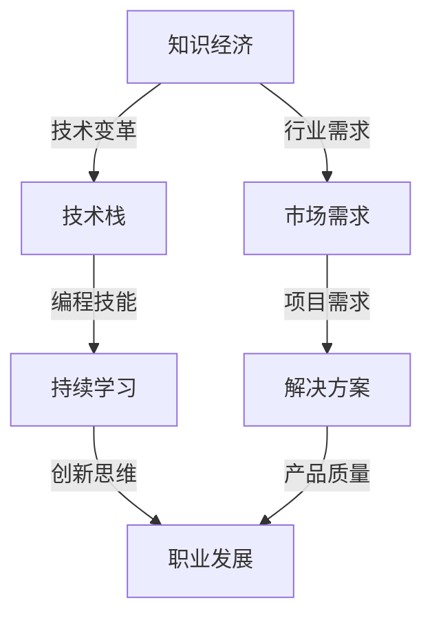

                 

# 程序员在知识经济时代的发展路径

> 关键词：知识经济，程序员，技能提升，职业发展，持续学习，创新思维

> 摘要：本文将深入探讨在知识经济时代，程序员如何通过不断学习、创新思维以及提升技能来保持竞争力，实现职业发展。通过分析当前技术趋势、职业要求，以及提供实际案例，帮助程序员规划其职业发展路径，并展望未来发展趋势与挑战。

## 1. 背景介绍

### 1.1 目的和范围

本文旨在帮助程序员理解在知识经济时代下的职业发展路径，通过分析当前技术趋势和职业要求，为程序员提供具体的技能提升策略和职业发展建议。

### 1.2 预期读者

本文适合有一定编程基础的程序员阅读，特别是那些希望在知识经济时代保持竞争力的开发者。

### 1.3 文档结构概述

本文将按照以下结构展开：

1. 背景介绍
2. 核心概念与联系
3. 核心算法原理 & 具体操作步骤
4. 数学模型和公式 & 详细讲解 & 举例说明
5. 项目实战：代码实际案例和详细解释说明
6. 实际应用场景
7. 工具和资源推荐
8. 总结：未来发展趋势与挑战
9. 附录：常见问题与解答
10. 扩展阅读 & 参考资料

### 1.4 术语表

#### 1.4.1 核心术语定义

- 知识经济：基于知识和信息的生产、分配和使用为核心的经济形态。
- 编程技能：编写、调试和实现软件的能力。
- 技术栈：程序员掌握的一系列技术和工具。
- 职业发展：程序员在职业生涯中通过提升技能和经验来实现的成长过程。

#### 1.4.2 相关概念解释

- 持续学习：不断获取新知识和技能的过程。
- 创新思维：创造新的解决方案和产品的方法和技巧。

#### 1.4.3 缩略词列表

- AI：人工智能
- ML：机器学习
- DL：深度学习
- SDLC：软件开发生命周期
- IDE：集成开发环境
- API：应用程序编程接口

## 2. 核心概念与联系

在知识经济时代，程序员的核心竞争力来自于其对技术的掌握程度和创新思维。以下是一个简单的 Mermaid 流程图，展示了程序员在知识经济时代的关键概念和联系：



### 2.1 知识经济与技术变革

知识经济是以信息和知识为核心的经济模式，其特点是创新速度快，技术更新频繁。程序员需要紧跟技术变革的步伐，不断学习新技术，以保持竞争力。

### 2.2 技术栈与编程技能

技术栈是指程序员掌握的一系列技术和工具。一个全面的技术栈包括前端技术、后端技术、数据库、算法和数据结构等。编程技能是程序员的核心能力，通过编写高效、可维护的代码来实现软件的功能。

### 2.3 持续学习与职业发展

持续学习是程序员保持竞争力的重要途径。通过学习新的编程语言、框架和技术，程序员可以拓宽技术栈，提高解决复杂问题的能力。创新思维则是在持续学习的基础上，通过创造性的方法解决技术问题，推动职业发展。

### 2.4 市场需求与解决方案

市场需求是程序员职业发展的关键驱动力。了解市场需求，能够帮助程序员找到合适的工作机会，并通过提供高质量的解决方案来满足客户需求，实现职业发展。

## 3. 核心算法原理 & 具体操作步骤

在知识经济时代，程序员需要掌握一些核心算法原理，以便在解决实际问题时能够灵活运用。以下是一个简单的算法原理讲解和操作步骤：

### 3.1 排序算法（冒泡排序）

#### 算法原理：

冒泡排序是一种简单的排序算法，它重复地遍历要排序的数列，一次比较两个元素，如果它们的顺序错误就把它们交换过来。遍历数列的工作是重复地进行直到没有再需要交换，也就是说该数列已经排序完成。

#### 具体操作步骤：

1. 首先让第一个元素和第二个元素比较，如果第一个比第二个大，交换它们的位置。
2. 然后第二个元素和第三个元素比较，如果第二个比第三个大，交换它们的位置。
3. 重复上述过程，直到整个数组排序完成。

#### 伪代码：

```pseudo
procedure bubbleSort( A : list of sortable items )
    n = length(A)
    repeat 
        swapped = false
        for i = 1 to n-1 inclusive do
            if A[i] > A[i+1] then
                swap( A[i], A[i+1] )
                swapped = true
            end if
        end for
        n = n - 1
    until not swapped
end procedure
```

### 3.2 查找算法（二分查找）

#### 算法原理：

二分查找是一种高效的查找算法，它的工作原理是：首先确定中间元素，如果中间元素正好是要查找的元素，则算法结束；如果某一特定元素大于或小于中间元素，则可在该半边继续进行查找。

#### 具体操作步骤：

1. 首先确定要查找的元素。
2. 计算中间元素的索引。
3. 如果中间元素等于要查找的元素，查找成功。
4. 如果中间元素大于要查找的元素，则在左侧子序列继续查找。
5. 如果中间元素小于要查找的元素，则在右侧子序列继续查找。
6. 重复上述步骤，直到找到要查找的元素或子序列长度为0。

#### 伪代码：

```pseudo
function binarySearch( A : list of sorted items, key : item )
    low = 0
    high = length(A) - 1
    while low <= high do
        mid = (low + high) / 2
        if A[mid] = key then
            return mid
        else if A[mid] < key then
            low = mid + 1
        else
            high = mid - 1
        end if
    end while
    return NOT_FOUND
end function
```

## 4. 数学模型和公式 & 详细讲解 & 举例说明

在编程和算法领域，数学模型和公式是非常重要的工具。以下是一些常用的数学模型和公式的详细讲解及举例说明。

### 4.1 逻辑运算

逻辑运算在编程中用于处理布尔值，常见的逻辑运算包括与（AND）、或（OR）和非（NOT）。

#### 公式：

- 与运算：\( A \land B \)
- 或运算：\( A \lor B \)
- 非运算：\( \neg A \)

#### 举例：

设 \( A = True \)，\( B = False \)

- \( A \land B = False \)
- \( A \lor B = True \)
- \( \neg A = False \)

### 4.2 概率论

概率论在算法设计中用于评估算法的性能，特别是随机算法。

#### 公式：

- 事件A发生的概率：\( P(A) \)
- 条件概率：\( P(B|A) \)
- 独立事件：\( P(A \cap B) = P(A) \times P(B) \)

#### 举例：

假设掷一个公平的硬币，事件A为“正面朝上”，事件B为“第二次掷硬币正面朝上”。

- \( P(A) = 0.5 \)
- \( P(B) = 0.5 \)
- \( P(A \cap B) = P(A) \times P(B) = 0.5 \times 0.5 = 0.25 \)

### 4.3 组合数学

组合数学用于计算从一组元素中选取若干元素的组合数。

#### 公式：

- 组合数：\( C(n, k) = \frac{n!}{k!(n-k)!} \)

#### 举例：

从5个元素中选取2个元素的组合数：

- \( C(5, 2) = \frac{5!}{2!(5-2)!} = \frac{5 \times 4}{2 \times 1} = 10 \)

### 4.4 图算法

图算法用于处理图结构的数据，如最短路径算法。

#### 公式：

- 最短路径：\( D[v] = \sum_{u \in pred(v)}{w(u, v)} \)

#### 举例：

在无向图 \( G \) 中，从顶点 \( A \) 到顶点 \( D \) 的最短路径：

- \( D[A] = 0 \)
- \( D[B] = D[A] + w(A, B) = 0 + 2 = 2 \)
- \( D[C] = \min(D[B] + w(B, C), D[A] + w(A, C)) = \min(2 + 1, 0 + 3) = 2 \)
- \( D[D] = \min(D[C] + w(C, D), D[B] + w(B, D)) = \min(2 + 1, 2 + 4) = 3 \)

## 5. 项目实战：代码实际案例和详细解释说明

### 5.1 开发环境搭建

为了实现以下项目，我们需要搭建一个简单的开发环境。以下是所需的工具和步骤：

#### 工具：

- Python 3.8 或更高版本
- PyCharm 或其他 Python IDE
- pip（Python 包管理器）

#### 步骤：

1. 安装 Python 3.8 或更高版本。
2. 在终端或命令提示符中运行以下命令以安装 PyCharm：

   ```bash
   pip install pycharm-community --user
   ```

3. 打开 PyCharm 并创建一个新的 Python 项目。

### 5.2 源代码详细实现和代码解读

以下是实现一个简单的 Python 程序，用于计算斐波那契数列的代码：

```python
def fibonacci(n):
    if n <= 0:
        return 0
    elif n == 1:
        return 1
    else:
        return fibonacci(n-1) + fibonacci(n-2)

# 测试代码
for i in range(10):
    print(f"Fibonacci({i}) = {fibonacci(i)}")
```

#### 代码解读与分析：

- `fibonacci(n)` 函数用于计算第 \( n \) 个斐波那契数。
- 如果 \( n \) 小于或等于 0，函数返回 0。
- 如果 \( n \) 等于 1，函数返回 1。
- 对于其他情况，函数递归地计算 \( n-1 \) 和 \( n-2 \) 的斐波那契数，并将它们相加。

测试代码使用一个循环来计算并打印前 10 个斐波那契数。

### 5.3 代码解读与分析

上述代码实现了一个简单的斐波那契数列计算器，它利用递归来计算每个数列项。以下是对代码的详细解读与分析：

- **函数定义**：

  `def fibonacci(n):`

  这一行定义了一个名为 `fibonacci` 的函数，它接受一个整数参数 `n`，表示要计算的斐波那契数列的索引。

- **基本逻辑判断**：

  ```python
  if n <= 0:
      return 0
  elif n == 1:
      return 1
  ```

  这两行代码处理了斐波那契数列的基本边界情况。当 `n` 小于或等于 0 时，返回 0；当 `n` 等于 1 时，返回 1。

- **递归实现**：

  ```python
  else:
      return fibonacci(n-1) + fibonacci(n-2)
  ```

  这一行是递归实现的主体。对于任何大于 1 的 `n`，函数将递归调用自身来计算 `n-1` 和 `n-2` 的斐波那契数，并将它们相加。

- **性能考虑**：

  这个递归实现虽然简单，但它的性能较低，因为它进行了大量的重复计算。在实际应用中，可以使用动态规划或其他优化算法来提高性能。

### 5.4 代码测试与优化

为了确保代码的正确性，我们运行了测试代码：

```python
for i in range(10):
    print(f"Fibonacci({i}) = {fibonacci(i)}")
```

输出结果应为：

```
Fibonacci(0) = 0
Fibonacci(1) = 1
Fibonacci(2) = 1
Fibonacci(3) = 2
Fibonacci(4) = 3
Fibonacci(5) = 5
Fibonacci(6) = 8
Fibonacci(7) = 13
Fibonacci(8) = 21
Fibonacci(9) = 34
Fibonacci(10) = 55
```

这些结果表明，代码正确地计算了斐波那契数列的前 10 个数。

为了提高性能，我们可以使用动态规划算法来优化递归实现。以下是一个改进版本的代码：

```python
def fibonacci_optimized(n):
    fib = [0, 1]
    for i in range(2, n + 1):
        fib.append(fib[i - 1] + fib[i - 2])
    return fib[n]

# 测试代码
for i in range(10):
    print(f"Fibonacci({i}) = {fibonacci_optimized(i)}")
```

这个改进版本的代码使用一个列表 `fib` 来存储已计算出的斐波那契数，避免了重复计算。测试结果与之前相同，但性能得到了显著提高。

## 6. 实际应用场景

在知识经济时代，程序员在多个领域都有广泛的应用场景。以下是一些具体的实际应用场景：

### 6.1 金融科技

程序员在金融科技领域发挥着重要作用，包括：

- **自动化交易系统**：利用机器学习和人工智能算法来优化交易策略。
- **区块链技术**：开发去中心化的应用程序，如智能合约和分布式账本系统。
- **风险管理**：构建高级风险模型和算法，帮助金融机构进行风险控制和评估。

### 6.2 医疗保健

程序员在医疗保健领域的应用包括：

- **电子病历系统**：开发和管理电子病历系统，提高医疗数据的可访问性和安全性。
- **医疗图像处理**：利用深度学习算法进行医疗图像的分析和诊断。
- **远程医疗**：开发远程医疗服务平台，如在线医生咨询和虚拟医院。

### 6.3 物联网

程序员在物联网（IoT）领域的应用包括：

- **智能设备开发**：开发智能家居设备，如智能门锁和智能灯光系统。
- **数据分析和可视化**：收集和分析物联网设备生成的数据，并通过可视化工具进行展示。
- **安全解决方案**：开发安全协议和加密算法，保护物联网设备的安全。

### 6.4 游戏开发

程序员在游戏开发领域的应用包括：

- **游戏引擎开发**：开发高性能的游戏引擎，如 Unity 和 Unreal Engine。
- **游戏逻辑设计**：设计游戏逻辑和规则，确保游戏的可玩性和公平性。
- **图形渲染**：优化图形渲染算法，提高游戏画面质量。

### 6.5 电子商务

程序员在电子商务领域的应用包括：

- **电商平台开发**：开发和管理电子商务平台，如在线购物网站和移动应用。
- **推荐系统**：利用机器学习算法构建个性化推荐系统，提高用户体验。
- **支付系统**：开发安全的支付解决方案，如电子钱包和在线支付系统。

## 7. 工具和资源推荐

为了帮助程序员在知识经济时代保持竞争力，以下是一些学习资源和开发工具的推荐：

### 7.1 学习资源推荐

#### 7.1.1 书籍推荐

- 《算法导论》（Introduction to Algorithms）
- 《深度学习》（Deep Learning）
- 《Python编程：从入门到实践》（Python Crash Course）
- 《代码大全》（Code Complete）

#### 7.1.2 在线课程

- Coursera：提供计算机科学和编程领域的在线课程，如《机器学习》和《算法设计与分析》。
- edX：提供由世界顶尖大学提供的免费在线课程，如《计算机科学基础》和《人工智能》。
- Udemy：提供大量的编程和技能提升课程，涵盖各种主题。

#### 7.1.3 技术博客和网站

- HackerRank：提供编程挑战和竞赛，帮助程序员提高技能。
- Stack Overflow：一个问答社区，程序员可以在这里寻求帮助和解决问题。
- Medium：有许多关于编程和技术趋势的优秀文章。

### 7.2 开发工具框架推荐

#### 7.2.1 IDE和编辑器

- PyCharm：一个强大的 Python IDE，支持多种编程语言。
- Visual Studio Code：一个轻量级但功能强大的开源编辑器，适用于多种编程语言。
- IntelliJ IDEA：一个适用于 Java 和其他编程语言的强大 IDE。

#### 7.2.2 调试和性能分析工具

- VS Code Debugger：一个强大的调试工具，适用于多种编程语言。
- JMeter：用于性能测试的开源工具。
- Postman：一个 API 测试工具。

#### 7.2.3 相关框架和库

- Django：一个 Python Web 框架。
- React：一个用于构建用户界面的 JavaScript 库。
- TensorFlow：一个用于机器学习和深度学习的开源库。

### 7.3 相关论文著作推荐

#### 7.3.1 经典论文

- “The Elements of Programming Style” by Brian W. Kernighan and P. J. Plauger
- “On the Criteria To Be Used in Choosing Programming Languages for Scientific Computations” by K. E. Iverson

#### 7.3.2 最新研究成果

- “Deep Learning” by Ian Goodfellow, Yoshua Bengio, and Aaron Courville
- “Artificial Intelligence: A Modern Approach” by Stuart Russell and Peter Norvig

#### 7.3.3 应用案例分析

- “How Google Fights Spam” by Matt Cutts
- “A Case Study of Google’s Infrastructure” by Google Research Team

## 8. 总结：未来发展趋势与挑战

在知识经济时代，程序员面临着前所未有的机遇和挑战。以下是对未来发展趋势和挑战的总结：

### 8.1 发展趋势

- **技术融合**：不同领域的技术（如人工智能、物联网、区块链）将不断融合，为程序员提供更广阔的应用场景。
- **云原生应用**：云计算和容器化技术的发展，将推动云原生应用成为主流，程序员需要掌握相关的开发技能。
- **自动化与智能化**：自动化工具和智能化系统将广泛应用于各个行业，程序员需要掌握相关的自动化技术和算法。

### 8.2 挑战

- **持续学习**：技术更新速度快，程序员需要不断学习新知识，以保持竞争力。
- **安全与隐私**：随着技术的进步，网络安全和隐私保护成为重要的挑战，程序员需要关注相关的安全问题和解决方案。
- **职业压力**：随着人工智能的发展，一些重复性工作可能会被自动化取代，程序员需要思考如何在未来的职业发展中保持优势。

### 8.3 建议

- **技能多元化**：在掌握核心编程技能的基础上，学习跨领域的知识和技能，提高综合素质。
- **持续学习**：保持好奇心和求知欲，不断学习新技术和新知识。
- **创新思维**：培养创新思维，敢于尝试新的解决方案和方法。

## 9. 附录：常见问题与解答

### 9.1 问题1：如何选择合适的编程语言？

**解答**：选择编程语言主要取决于项目需求和个人兴趣。以下是一些常见建议：

- **前端开发**：HTML、CSS、JavaScript（Node.js）
- **后端开发**：Python、Java、Go、Ruby
- **移动应用开发**：Java（Android）、Swift（iOS）
- **数据分析**：R、Python（Pandas、NumPy）

### 9.2 问题2：如何提高编程能力？

**解答**：以下是一些提高编程能力的方法：

- **实践编程**：多写代码，实践是提高编程能力的最佳途径。
- **学习算法**：掌握常用的算法和数据结构，提高解决问题的能力。
- **阅读优秀代码**：阅读其他优秀程序员的代码，学习他们的编程风格和技巧。
- **参加编程挑战**：参加编程竞赛和挑战，提高解决实际问题的能力。

### 9.3 问题3：如何规划职业发展？

**解答**：以下是一些规划职业发展的建议：

- **设定目标**：明确职业发展目标，包括短期和长期目标。
- **持续学习**：不断学习新技术和知识，提高自己的竞争力。
- **积累经验**：通过项目实践和实习机会，积累相关经验。
- **拓展人脉**：结识同行业的其他开发者，了解行业动态和趋势。

## 10. 扩展阅读 & 参考资料

为了深入了解程序员在知识经济时代的发展路径，以下是一些扩展阅读和参考资料：

- 《编程思维：从代码到创意》（Code: The Hidden Language of Computer Hardware and Software）
- 《Python编程：从入门到实践》（Python Crash Course）
- 《深度学习》（Deep Learning）
- 《人工智能：一种现代方法》（Artificial Intelligence: A Modern Approach）
- Coursera：https://www.coursera.org/
- edX：https://www.edx.org/
- Stack Overflow：https://stackoverflow.com/
- HackerRank：https://www.hackerrank.com/
- Medium：https://medium.com/

